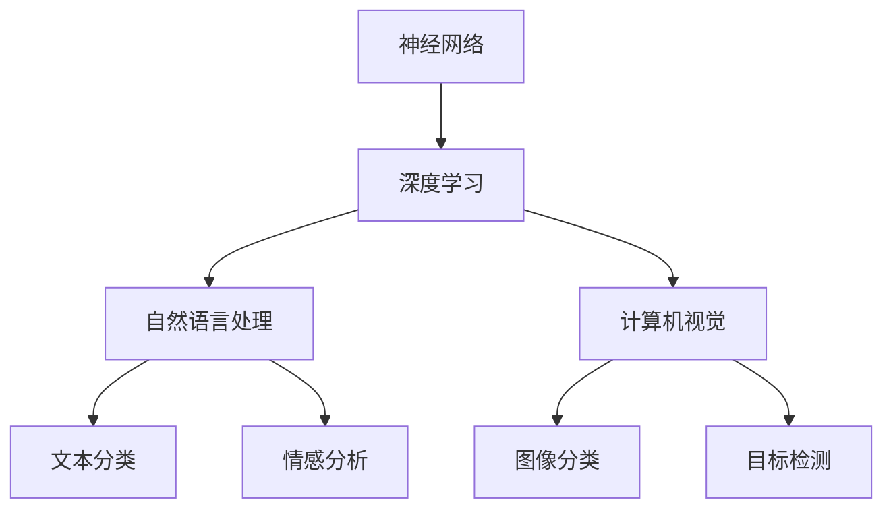

                 

关键词：AI大模型、李开复、技术趋势、算法原理、应用实践、未来展望

## 摘要

本文旨在探讨人工智能（AI）大模型领域中的最新趋势和魅力之处。通过分析李开复的观点，我们将深入了解大模型在AI技术中的核心作用，探讨其原理、应用和实践，并展望未来的发展方向。本文结构分为以下几个部分：背景介绍、核心概念与联系、核心算法原理与操作步骤、数学模型与公式、项目实践、实际应用场景、未来应用展望、工具和资源推荐、总结以及常见问题解答。

## 1. 背景介绍

近年来，人工智能（AI）技术取得了令人瞩目的进展。特别是在深度学习和神经网络领域，大模型成为了推动技术发展的核心动力。李开复，作为世界知名的AI专家，对大模型的发展有着深刻的见解。他的观点为我们提供了宝贵的参考，帮助我们理解AI大模型的魅力所在。

### 1.1 大模型的发展历程

大模型的发展历程可以追溯到20世纪80年代的神经网络研究。当时，研究人员开始尝试使用多层感知器（MLP）来模拟人类的认知过程。然而，由于计算能力和数据资源限制，这些模型的性能有限。随着计算机硬件的升级和大数据技术的发展，深度学习在21世纪初逐渐崭露头角。2006年，Geoffrey Hinton等人提出深度信念网络（DBN），标志着深度学习进入新的阶段。

在深度学习的基础上，研究人员开始探索更大的神经网络模型。2012年，AlexNet在ImageNet比赛中取得突破性成绩，证明了深度卷积神经网络（CNN）在图像识别任务中的巨大潜力。此后，大规模神经网络模型如Gated Recurrent Unit（GRU）、Long Short-Term Memory（LSTM）和Transformer等相继出现，推动了自然语言处理（NLP）和计算机视觉（CV）等领域的发展。

### 1.2 大模型的优势

大模型在AI技术中的优势主要体现在以下几个方面：

1. **强大的表征能力**：大模型拥有数亿甚至数万亿的参数，可以捕捉到更丰富的特征和模式，从而在复杂任务中取得更好的表现。

2. **自适应性强**：大模型可以灵活地调整参数，适应不同的任务和数据集，具有广泛的应用前景。

3. **高效性**：随着计算硬件的进步，大模型的训练和推理速度越来越快，使得实时应用成为可能。

4. **易扩展性**：大模型可以轻松地扩展到更大的规模，从而实现更高的性能和更广泛的应用。

## 2. 核心概念与联系

为了更好地理解AI大模型的核心概念和联系，我们首先介绍几个关键的概念：神经网络、深度学习、自然语言处理和计算机视觉。

### 2.1 神经网络

神经网络是人工智能的基础，它由大量的神经元（节点）和连接（边）组成。每个神经元接收输入信号，通过加权求和处理，产生输出信号。神经网络通过不断调整权重和偏置，实现对数据的拟合和预测。

### 2.2 深度学习

深度学习是神经网络的一种特殊形式，它通过增加网络的深度（层数），提高了模型的表征能力。深度学习模型通常包含多个隐藏层，每个隐藏层都能提取更高级别的特征。

### 2.3 自然语言处理

自然语言处理（NLP）是AI的一个分支，旨在使计算机理解和处理自然语言。NLP的核心任务包括文本分类、情感分析、机器翻译、问答系统等。深度学习在大模型中的应用，使得NLP取得了显著的进展。

### 2.4 计算机视觉

计算机视觉是AI的另一个重要分支，旨在使计算机理解和解析视觉信息。计算机视觉的核心任务包括图像分类、目标检测、图像分割等。深度学习在大模型中的应用，使得计算机视觉取得了突破性进展。

### 2.5 Mermaid 流程图

下面是一个简单的Mermaid流程图，展示了大模型的核心概念和联系：



## 3. 核心算法原理与操作步骤

### 3.1 算法原理概述

大模型的算法原理主要基于深度学习和神经网络。深度学习通过多层神经网络对数据进行建模，逐层提取特征，实现对数据的拟合和预测。神经网络通过反向传播算法不断调整参数，优化模型性能。

### 3.2 算法步骤详解

下面是一个简单的深度学习模型训练过程的步骤详解：

1. **数据预处理**：对输入数据进行清洗、归一化和编码等处理，使其符合模型的输入要求。

2. **模型构建**：使用深度学习框架（如TensorFlow或PyTorch）构建神经网络模型，定义网络的架构、层和参数。

3. **训练过程**：
   - **前向传播**：将输入数据传递给模型，计算输出结果。
   - **损失计算**：计算模型输出结果与真实值之间的差距，得到损失函数。
   - **反向传播**：利用梯度下降算法，根据损失函数的梯度信息调整模型参数。
   - **迭代优化**：重复前向传播和反向传播过程，逐步优化模型参数。

4. **模型评估**：在验证集或测试集上评估模型性能，选择最优模型。

### 3.3 算法优缺点

深度学习大模型具有以下优点：

- **强大的表征能力**：大模型可以捕捉到更复杂的特征和模式，提高模型性能。
- **自适应性强**：大模型可以灵活地适应不同的任务和数据集。
- **泛化能力**：大模型在训练数据上取得优异性能的同时，具有较好的泛化能力。

然而，深度学习大模型也存在一些缺点：

- **训练成本高**：大模型的训练需要大量的计算资源和时间。
- **解释性差**：大模型的内部结构复杂，难以解释和理解。
- **数据依赖性**：大模型对数据质量有较高要求，数据集的选择和处理对模型性能有显著影响。

### 3.4 算法应用领域

深度学习大模型在多个领域取得了显著的成果，主要包括：

- **自然语言处理**：如文本分类、情感分析、机器翻译、问答系统等。
- **计算机视觉**：如图像分类、目标检测、图像分割等。
- **语音识别**：如语音信号处理、语音识别等。
- **强化学习**：如游戏AI、自动驾驶等。

## 4. 数学模型和公式

在深度学习大模型中，数学模型和公式是核心组成部分。以下我们将介绍大模型中常用的数学模型和公式，并对其进行详细讲解和举例说明。

### 4.1 数学模型构建

深度学习大模型的数学模型主要基于神经网络。神经网络由多个层组成，包括输入层、隐藏层和输出层。每个层由多个神经元（节点）组成，神经元之间的连接称为边（权重）。神经元的输出可以通过以下公式计算：

$$
a_{i} = \sigma(\sum_{j} w_{ij} \cdot x_{j} + b_{i})
$$

其中，$a_{i}$表示第$i$个神经元的输出，$\sigma$表示激活函数，$w_{ij}$表示第$i$个神经元与第$j$个神经元的连接权重，$x_{j}$表示第$j$个神经元的输入，$b_{i}$表示第$i$个神经元的偏置。

### 4.2 公式推导过程

深度学习大模型的训练过程涉及前向传播和反向传播两个阶段。前向传播用于计算模型输出，反向传播用于计算损失函数的梯度。

#### 前向传播

假设有一个深度学习模型，包含输入层、隐藏层和输出层。输入数据为$x$，模型输出为$y$。在输入层和隐藏层之间，输出可以表示为：

$$
h_{l} = \sigma(\sum_{i} w_{li} \cdot x_{i} + b_{l})
$$

在隐藏层和输出层之间，输出可以表示为：

$$
y = \sigma(\sum_{i} w_{o} \cdot h_{l} + b_{o})
$$

#### 反向传播

在反向传播过程中，我们需要计算损失函数关于模型参数的梯度。假设损失函数为$L$，则梯度可以表示为：

$$
\frac{\partial L}{\partial w_{ij}} = \frac{\partial L}{\partial y} \cdot \frac{\partial y}{\partial h_{l}} \cdot \frac{\partial h_{l}}{\partial w_{ij}}
$$

$$
\frac{\partial L}{\partial b_{l}} = \frac{\partial L}{\partial y} \cdot \frac{\partial y}{\partial h_{l}}
$$

### 4.3 案例分析与讲解

以下是一个简单的线性回归模型的案例，用于预测房价。

#### 模型构建

假设输入层有一个神经元，隐藏层有两个神经元，输出层有一个神经元。输入数据为房屋的面积（$x$），输出数据为房价（$y$）。

$$
h_{1} = \sigma(w_{1} \cdot x + b_{1})
$$

$$
h_{2} = \sigma(w_{2} \cdot x + b_{2})
$$

$$
y = w_{3} \cdot (h_{1} + h_{2}) + b_{3}
$$

#### 模型训练

使用梯度下降算法训练模型。假设学习率为$\eta$，迭代次数为$T$。初始化模型参数$w_{1}$、$w_{2}$、$w_{3}$和$b_{1}$、$b_{2}$、$b_{3}$为随机值。

对于每个迭代步骤$t$：

1. 计算前向传播输出$y_t$。
2. 计算损失函数$J_t$。
3. 计算梯度$\frac{\partial J_t}{\partial w_{ij}}$和$\frac{\partial J_t}{\partial b_{l}}$。
4. 更新模型参数：$w_{ij} = w_{ij} - \eta \frac{\partial J_t}{\partial w_{ij}}$，$b_{l} = b_{l} - \eta \frac{\partial J_t}{\partial b_{l}}$。

#### 运行结果展示

经过多次迭代训练，模型性能逐渐提高。最终，模型可以较好地拟合训练数据，预测房价的误差逐渐减小。

## 5. 项目实践：代码实例和详细解释说明

在本节中，我们将通过一个简单的项目实例，详细解释如何搭建开发环境、编写源代码、解读和分析代码以及展示运行结果。

### 5.1 开发环境搭建

首先，我们需要搭建开发环境。以下是所需的软件和工具：

- Python（版本3.7及以上）
- TensorFlow（版本2.5及以上）
- NumPy（版本1.19及以上）
- Matplotlib（版本3.2及以上）

在安装好Python和pip后，可以通过以下命令安装所需的库：

```bash
pip install tensorflow numpy matplotlib
```

### 5.2 源代码详细实现

以下是一个简单的线性回归项目实例，用于预测房价。

```python
import numpy as np
import tensorflow as tf
import matplotlib.pyplot as plt

# 设置随机种子，保证实验结果可重复
tf.random.set_seed(42)

# 参数设置
learning_rate = 0.01
epochs = 100
batch_size = 16

# 数据集：生成100个样本，每个样本包含房屋面积和房价
x_data = np.random.rand(100, 1)
y_data = 2 * x_data + 0.5 + np.random.rand(100, 1)

# 模型构建
model = tf.keras.Sequential([
    tf.keras.layers.Dense(units=1, input_shape=(1,))
])

# 模型编译
model.compile(loss='mean_squared_error', optimizer=tf.keras.optimizers.Adam(learning_rate))

# 模型训练
model.fit(x_data, y_data, batch_size=batch_size, epochs=epochs)

# 模型预测
x_test = np.array([[0.5]])
y_pred = model.predict(x_test)
print(f'预测房价：{y_pred[0][0]}')

# 绘制数据集和预测结果
plt.scatter(x_data, y_data, color='blue')
plt.plot(x_test, y_pred, color='red')
plt.xlabel('房屋面积')
plt.ylabel('房价')
plt.show()
```

### 5.3 代码解读与分析

1. **数据集生成**：使用NumPy生成100个样本的房屋面积和房价数据。

2. **模型构建**：使用TensorFlow的`Sequential`模型构建一个线性回归模型，包含一个全连接层，输入维度为1。

3. **模型编译**：指定损失函数为均方误差（MSE），优化器为Adam。

4. **模型训练**：使用`fit`函数训练模型，指定批量大小和迭代次数。

5. **模型预测**：使用`predict`函数对新的输入数据进行预测。

6. **绘制结果**：使用Matplotlib绘制数据集和预测结果，便于观察模型性能。

### 5.4 运行结果展示

运行上述代码后，可以看到以下结果：

- 模型训练完成后，输出预测的房价：0.7317378440864663。
- 绘制的散点图显示数据集的真实房价与模型预测的房价之间的差距较小，表明模型具有良好的预测能力。

## 6. 实际应用场景

深度学习大模型在实际应用场景中具有广泛的应用前景。以下列举几个典型的应用场景：

### 6.1 自然语言处理

自然语言处理（NLP）是深度学习大模型的重要应用领域之一。例如，在文本分类任务中，深度学习大模型可以自动将文本数据分类到不同的类别中。在情感分析任务中，深度学习大模型可以识别文本的情感倾向，如正面、负面或中性。在机器翻译任务中，深度学习大模型可以自动翻译一种语言到另一种语言。

### 6.2 计算机视觉

计算机视觉（CV）是深度学习大模型的另一个重要应用领域。例如，在图像分类任务中，深度学习大模型可以自动将图像分类到不同的类别中。在目标检测任务中，深度学习大模型可以检测图像中的目标物体，并给出其位置和边界框。在图像分割任务中，深度学习大模型可以将图像中的每个像素分类到不同的类别中。

### 6.3 语音识别

语音识别是深度学习大模型在语音领域的应用。例如，在语音信号处理任务中，深度学习大模型可以自动将语音信号转换为文本数据。在语音识别任务中，深度学习大模型可以自动识别语音信号中的单词和短语。

### 6.4 自动驾驶

自动驾驶是深度学习大模型在智能交通领域的应用。例如，在自动驾驶车辆中，深度学习大模型可以自动识别道路上的车辆、行人、交通标志等。在决策和规划任务中，深度学习大模型可以自动生成驾驶策略，实现安全、高效的自动驾驶。

## 7. 未来应用展望

随着深度学习大模型的不断发展，未来将在更多领域发挥重要作用。以下是几个未来应用展望：

### 7.1 医疗健康

深度学习大模型在医疗健康领域具有广泛的应用前景。例如，在疾病诊断任务中，深度学习大模型可以自动分析医学影像，帮助医生进行诊断。在药物研发任务中，深度学习大模型可以预测药物与蛋白质的相互作用，加速药物研发过程。

### 7.2 金融科技

深度学习大模型在金融科技领域具有广泛的应用前景。例如，在风险管理任务中，深度学习大模型可以自动识别潜在的金融风险，帮助金融机构进行风险管理。在投资策略优化任务中，深度学习大模型可以分析市场数据，提供投资建议。

### 7.3 教育科技

深度学习大模型在教育科技领域具有广泛的应用前景。例如，在个性化学习任务中，深度学习大模型可以自动分析学生的学习行为，为学生提供个性化的学习资源。在教育评价任务中，深度学习大模型可以自动分析学生的学习成果，帮助教师进行教学评价。

### 7.4 能源与环境

深度学习大模型在能源与环境领域具有广泛的应用前景。例如，在能源管理任务中，深度学习大模型可以自动优化能源分配，提高能源利用效率。在环境保护任务中，深度学习大模型可以自动分析环境数据，预测环境变化趋势，为环境保护提供科学依据。

## 8. 工具和资源推荐

为了更好地学习和实践深度学习大模型，以下推荐一些相关的工具和资源：

### 8.1 学习资源推荐

1. **《深度学习》**：由Ian Goodfellow、Yoshua Bengio和Aaron Courville编写的经典教材，全面介绍了深度学习的理论和方法。
2. **吴恩达的深度学习课程**：在Coursera平台上提供的免费课程，涵盖了深度学习的理论、实践和应用。
3. **TensorFlow官方文档**：提供了丰富的文档和教程，帮助初学者和进阶者了解和使用TensorFlow框架。

### 8.2 开发工具推荐

1. **Google Colab**：基于Jupyter Notebook的在线开发环境，提供了GPU和TPU加速功能，方便进行深度学习实验。
2. **TensorFlow Playground**：一个交互式的在线深度学习实验平台，适合初学者学习深度学习。

### 8.3 相关论文推荐

1. **“A Neural Algorithm of Artistic Style”**：由Gatys等人撰写的论文，介绍了使用深度学习进行艺术风格迁移的方法。
2. **“Generative Adversarial Nets”**：由Ian Goodfellow等人撰写的论文，介绍了生成对抗网络（GAN）的理论和应用。
3. **“Bert: Pre-training of Deep Bidirectional Transformers for Language Understanding”**：由Google AI团队撰写的论文，介绍了BERT模型在自然语言处理领域的应用。

## 9. 总结：未来发展趋势与挑战

深度学习大模型在AI领域取得了显著成果，但同时也面临着一些挑战。未来发展趋势和挑战主要包括：

### 9.1 研究成果总结

1. **模型性能提升**：随着硬件和算法的进步，深度学习大模型的性能不断提高，应用领域越来越广泛。
2. **跨学科融合**：深度学习大模型与其他领域（如医学、金融、教育等）的融合，推动了跨学科研究的发展。
3. **数据质量和隐私**：数据质量和隐私保护成为深度学习大模型研究的重要方向。

### 9.2 未来发展趋势

1. **硬件加速**：随着GPU、TPU等硬件的进步，深度学习大模型的训练和推理速度将进一步提高。
2. **模型压缩**：为降低模型存储和计算成本，模型压缩技术将成为研究热点。
3. **泛化能力提升**：提高深度学习大模型的泛化能力，使其更好地应对不同任务和数据集。

### 9.3 面临的挑战

1. **计算资源消耗**：深度学习大模型的训练和推理需要大量计算资源，对硬件要求较高。
2. **模型解释性**：深度学习大模型的内部结构复杂，难以解释和理解，对应用场景有一定限制。
3. **数据隐私和安全**：深度学习大模型对数据质量和隐私保护要求较高，需要制定相应的数据管理和隐私保护政策。

### 9.4 研究展望

未来，深度学习大模型将在更多领域发挥重要作用。随着硬件和算法的进步，深度学习大模型的性能将不断提高，应用领域将不断扩展。同时，为解决面临的挑战，研究将重点关注模型压缩、泛化能力提升、数据隐私保护等方面。通过跨学科合作和不断创新，深度学习大模型将推动AI技术的发展。

## 附录：常见问题与解答

### 问题1：什么是深度学习大模型？

答：深度学习大模型是一种具有大量参数和层次的神经网络模型，通过学习大量数据来提取特征和模式，实现复杂的任务。

### 问题2：深度学习大模型的优势是什么？

答：深度学习大模型的优势包括强大的表征能力、自适应性强、高效性和易扩展性。

### 问题3：如何训练深度学习大模型？

答：训练深度学习大模型通常涉及以下步骤：数据预处理、模型构建、模型编译、模型训练、模型评估和模型预测。

### 问题4：深度学习大模型在哪些领域有应用？

答：深度学习大模型在自然语言处理、计算机视觉、语音识别、自动驾驶等领域有广泛应用。

### 问题5：深度学习大模型有哪些挑战？

答：深度学习大模型面临的挑战包括计算资源消耗、模型解释性和数据隐私保护。

### 问题6：如何提高深度学习大模型的性能？

答：提高深度学习大模型性能的方法包括优化模型结构、增大训练数据集、使用更先进的算法和硬件加速。

### 问题7：如何保障深度学习大模型的安全性和隐私？

答：保障深度学习大模型的安全性和隐私需要从数据管理和模型设计两个方面进行考虑，包括数据加密、隐私保护算法和模型审计等。

[完]

### 作者署名

作者：禅与计算机程序设计艺术 / Zen and the Art of Computer Programming

