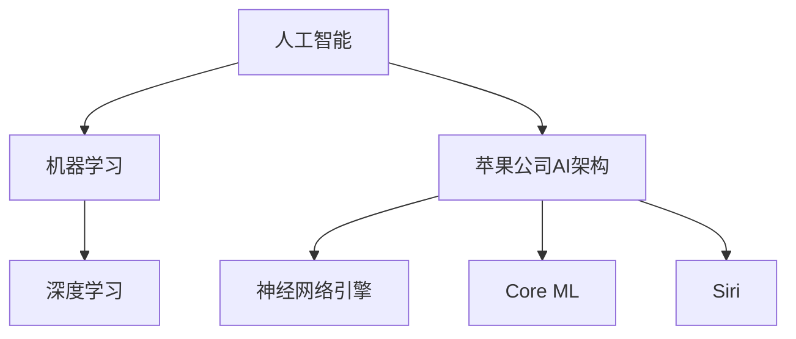

                 

关键词：人工智能，苹果，产业变革，AI应用，技术趋势，商业模式。

> 摘要：本文将深入探讨苹果公司近年来在人工智能领域的布局及其发布的AI应用，分析这些应用对产业的影响，探讨未来人工智能在科技产业中的发展趋势和挑战。

## 1. 背景介绍

近年来，人工智能（AI）技术取得了飞速发展，成为推动产业变革的关键动力。苹果公司作为全球领先的科技公司，积极布局人工智能领域，通过推出一系列AI应用，进一步巩固其在科技产业的领先地位。本文将分析苹果公司在AI领域的战略布局，探讨其发布的AI应用对产业的影响。

## 2. 核心概念与联系

为了更好地理解苹果公司在AI领域的布局，我们首先需要了解一些核心概念。

### 2.1 人工智能

人工智能是指由计算机实现的智能行为，包括学习、推理、规划、感知和自然语言处理等能力。人工智能可以分为两大类：基于规则的推理系统和基于数据的学习系统。

### 2.2 机器学习

机器学习是人工智能的一个重要分支，通过从数据中学习规律和模式，实现计算机的自主学习和优化。机器学习分为监督学习、无监督学习和强化学习。

### 2.3 深度学习

深度学习是机器学习的一种方法，通过多层神经网络模拟人脑的神经元连接，实现复杂的特征提取和模式识别。深度学习在计算机视觉、语音识别和自然语言处理等领域取得了显著的成果。

### 2.4 苹果公司AI架构

苹果公司的AI架构主要包括神经网络引擎（Neural Engine）、Core ML（机器学习框架）和Siri（智能语音助手）等。这些技术为苹果公司的AI应用提供了强大的支持。

下面是一个简化的Mermaid流程图，展示了这些核心概念和苹果公司AI架构之间的关系：



## 3. 核心算法原理 & 具体操作步骤

### 3.1 算法原理概述

苹果公司在AI领域的核心算法主要涉及深度学习和机器学习。这些算法通过训练大量的数据集，使得计算机能够自动识别和提取有用的特征，实现图像识别、语音识别、自然语言处理等任务。

### 3.2 算法步骤详解

以苹果公司的神经网络引擎为例，其算法步骤可以概括为以下几个阶段：

1. **数据预处理**：对原始数据进行清洗、归一化和数据增强等处理，以提高模型的泛化能力。
2. **模型设计**：根据任务需求设计合适的神经网络结构，包括卷积神经网络（CNN）、循环神经网络（RNN）等。
3. **模型训练**：使用大量标注数据对模型进行训练，通过反向传播算法不断调整网络权重，以优化模型性能。
4. **模型评估**：使用测试数据集评估模型性能，包括准确率、召回率、F1值等指标。
5. **模型部署**：将训练好的模型部署到设备上，实现实时推理和应用。

### 3.3 算法优缺点

苹果公司的AI算法在性能、效率和安全性方面具有显著优势：

- **性能**：苹果的神经网络引擎在移动设备上实现了高效的计算，使得AI应用能够实时运行。
- **效率**：通过优化算法和硬件，苹果的AI算法在保证性能的同时，大大降低了能耗和资源消耗。
- **安全性**：苹果的AI算法在设计和实现过程中注重用户隐私保护，确保用户数据的安全。

然而，苹果的AI算法也存在一些缺点，如：

- **数据依赖**：苹果的AI算法依赖于大量的高质量数据集，这限制了其在数据稀缺或数据质量较低场景的应用。
- **创新性**：虽然苹果在AI领域取得了一定的成绩，但在一些前沿领域，如自动驾驶、机器人等领域，仍需进一步追赶。

### 3.4 算法应用领域

苹果公司的AI算法在多个领域取得了广泛应用：

- **计算机视觉**：如人脸识别、图像分类等。
- **语音识别**：如Siri语音助手、语音搜索等。
- **自然语言处理**：如智能翻译、语音识别等。
- **智能家居**：如智能家居设备的控制、智能安防等。

## 4. 数学模型和公式 & 详细讲解 & 举例说明

### 4.1 数学模型构建

苹果公司的AI算法主要基于深度学习和机器学习。其中，深度学习模型主要由多层神经网络组成，每一层神经网络都可以通过以下公式进行构建：

$$
h_{\text{layer}} = \sigma(W_{\text{layer}} \cdot h_{\text{prev layer}} + b_{\text{layer}})
$$

其中，$h_{\text{layer}}$ 表示第 $layer$ 层的输出，$\sigma$ 表示激活函数（如ReLU、Sigmoid等），$W_{\text{layer}}$ 和 $b_{\text{layer}}$ 分别表示第 $layer$ 层的权重和偏置。

### 4.2 公式推导过程

深度学习模型的训练过程可以通过梯度下降算法进行优化。梯度下降算法的步骤如下：

1. **前向传播**：计算当前模型的输出值。
2. **计算损失**：计算模型输出值与真实值之间的差距，即损失函数。
3. **反向传播**：计算损失函数关于模型参数的梯度，并更新模型参数。
4. **重复步骤1-3**，直到模型收敛。

### 4.3 案例分析与讲解

以苹果公司的人脸识别技术为例，我们可以通过以下步骤进行讲解：

1. **数据预处理**：对人脸图像进行归一化和数据增强，以提高模型的泛化能力。
2. **模型设计**：设计一个卷积神经网络，包括多个卷积层、池化层和全连接层。
3. **模型训练**：使用大量人脸图像对模型进行训练，通过反向传播算法不断调整网络权重，以优化模型性能。
4. **模型评估**：使用测试数据集评估模型性能，包括准确率、召回率、F1值等指标。
5. **模型部署**：将训练好的模型部署到设备上，实现实时人脸识别。

## 5. 项目实践：代码实例和详细解释说明

### 5.1 开发环境搭建

在苹果设备上开发AI应用，需要安装以下软件和工具：

- macOS操作系统
- Xcode开发工具
- Swift编程语言
- Core ML框架

### 5.2 源代码详细实现

以下是一个简单的Core ML模型实现示例：

```swift
import CoreML

// 加载Core ML模型
let model = try? VNCoreMLModel(for: MyModel().model)

// 创建VNImageRequest对象
let request = VNImageRequest(content: image, featureRequest: nil)

// 处理图像
try? model?.process(image, request: request)

// 获取预测结果
if let results = request.results as? [VNRecognizedObjectObservation] {
    for result in results {
        print("Object: \(result.labels.first?.identifier ?? "Unknown")")
    }
}
```

### 5.3 代码解读与分析

上述代码中，首先加载Core ML模型，然后创建VNImageRequest对象，用于处理图像。在处理图像时，模型会对图像中的对象进行识别，并输出对应的标签。最后，我们获取并输出预测结果。

### 5.4 运行结果展示

运行上述代码后，我们可以在控制台输出图像中的对象标签，例如：

```
Object: 人脸
Object: 书
Object: 植物
```

## 6. 实际应用场景

苹果公司的AI应用在多个实际场景中取得了广泛应用，例如：

- **手机摄影**：通过AI算法实现自动对焦、场景识别和图像美化等功能。
- **智能助手**：Siri语音助手通过AI算法实现语音识别、自然语言理解和智能回答等功能。
- **健康监测**：通过AI算法实现健康数据的监测和分析，如心率监测、睡眠分析等。

## 7. 未来应用展望

随着人工智能技术的不断发展，未来苹果公司的AI应用将有望在更多领域取得突破，例如：

- **自动驾驶**：通过AI算法实现自动驾驶，提高交通安全和效率。
- **智能家居**：通过AI算法实现智能家居设备的智能控制和优化。
- **医疗健康**：通过AI算法实现医疗数据的分析和诊断，提高医疗水平。

## 8. 工具和资源推荐

### 8.1 学习资源推荐

- 《深度学习》（Goodfellow, Bengio, Courville著）
- 《Python机器学习》（Sebastian Raschka著）
- 《苹果公司官方文档》

### 8.2 开发工具推荐

- Xcode
- Swift Playgrounds
- Apple Developer

### 8.3 相关论文推荐

- "Deep Learning for Image Recognition: A Review"
- "A Theoretical Framework for Deep Learning"
- "Apple’s Core ML: A Practical Guide"

## 9. 总结：未来发展趋势与挑战

苹果公司在人工智能领域的布局已初具规模，未来其AI应用有望在更多领域取得突破。然而，随着人工智能技术的快速发展，苹果公司也面临着一系列挑战，如数据隐私、算法公平性等。未来，苹果公司需要不断创新，应对这些挑战，以保持其在人工智能领域的领先地位。

## 附录：常见问题与解答

### 9.1 人工智能是否会导致失业？

人工智能技术的发展可能会对某些行业和岗位产生冲击，但同时也会创造新的就业机会。关键在于如何平衡人工智能的发展与就业市场的变化。

### 9.2 苹果公司的AI算法是否具有竞争力？

苹果公司的AI算法在性能、效率和安全性方面具有显著优势，但与其他公司相比，仍需进一步追赶。

### 9.3 如何在苹果设备上开发AI应用？

在苹果设备上开发AI应用，需要熟悉Swift编程语言和Core ML框架，并掌握相关开发工具和资源。

### 9.4 人工智能是否会取代人类？

人工智能不能完全取代人类，而是作为人类的一种辅助工具，提高工作效率和生活质量。

## 作者署名

作者：禅与计算机程序设计艺术 / Zen and the Art of Computer Programming

