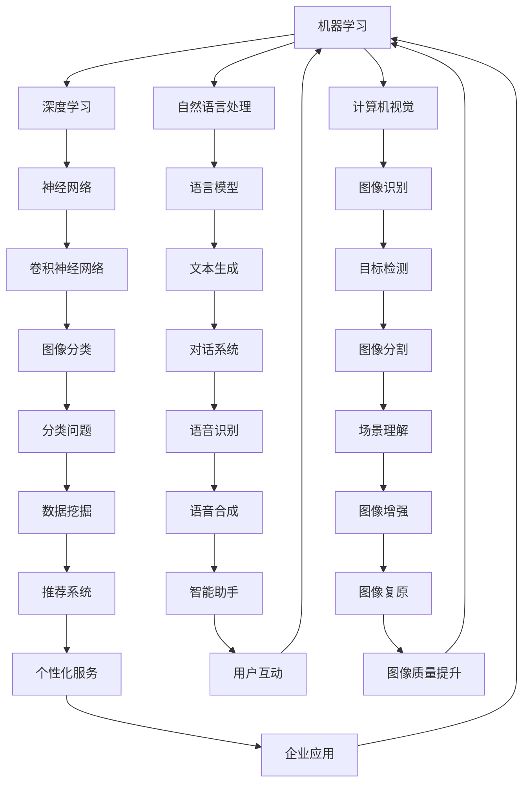

                 

关键词：人工智能、苹果、AI应用、核心技术、应用价值、未来趋势

> 摘要：本文将深入探讨苹果公司近期发布的AI应用，从技术角度分析其核心价值，并预测其未来应用前景。本文将分为八个部分，包括背景介绍、核心概念与联系、核心算法原理、数学模型与公式、项目实践、实际应用场景、工具和资源推荐以及总结与展望。

## 1. 背景介绍

近年来，人工智能（AI）技术取得了飞速发展，已经逐渐渗透到各行各业。从自动驾驶、智能助手到图像识别、自然语言处理，AI的应用无处不在。在这个背景下，苹果公司作为全球领先的科技公司，也不断加大在AI领域的投入，试图通过创新应用提升用户体验。本文将重点分析苹果近期发布的AI应用，探讨其技术价值和应用前景。

## 2. 核心概念与联系

在讨论苹果AI应用之前，我们有必要了解一些核心概念。人工智能是指通过模拟人类智能行为，实现智能推理、学习、识别和决策的技术。在AI领域，常见的核心技术包括机器学习、深度学习、自然语言处理和计算机视觉等。这些技术在苹果的AI应用中都有所体现。

下面是一个Mermaid流程图，展示了AI应用中的核心概念与联系：



## 3. 核心算法原理 & 具体操作步骤

### 3.1 算法原理概述

苹果公司AI应用的核心算法主要基于深度学习和机器学习技术。深度学习是一种模拟人脑神经网络结构的计算模型，通过层层神经网络进行特征提取和模式识别。机器学习则是让计算机通过数据学习和优化模型参数，以提高任务完成效果。

### 3.2 算法步骤详解

1. 数据预处理：对输入数据进行清洗、归一化和特征提取，为后续算法提供高质量的数据输入。
2. 模型训练：利用已有数据对神经网络进行训练，不断调整模型参数，使其在特定任务上达到较好的性能。
3. 模型评估：使用验证集对训练好的模型进行性能评估，确保模型在未知数据上的泛化能力。
4. 模型部署：将训练好的模型部署到实际应用中，为用户提供智能服务。

### 3.3 算法优缺点

优点：

- 强大的特征提取能力：深度学习模型可以自动提取数据中的有用特征，减少人工干预。
- 高效的推理速度：机器学习模型经过训练后，可以在短时间内完成推理任务。

缺点：

- 对数据依赖性强：模型性能依赖于大量高质量的数据。
- 模型解释性较弱：深度学习模型往往难以解释其决策过程。

### 3.4 算法应用领域

苹果公司的AI应用涵盖了多个领域，包括语音识别、图像识别、自然语言处理和智能助手等。以下是几个具体的应用场景：

- 语音识别：利用深度学习技术实现实时语音转文字，为用户提供便捷的语音输入体验。
- 图像识别：通过计算机视觉技术实现对图像内容的识别，用于人脸识别、图像分类等。
- 自然语言处理：利用机器学习技术实现自然语言理解，用于智能助手、语音合成等。
- 智能助手：基于深度学习和机器学习技术，为用户提供个性化的智能服务，如推荐系统、个性化助手等。

## 4. 数学模型和公式 & 详细讲解 & 举例说明

### 4.1 数学模型构建

在AI应用中，常见的数学模型包括神经网络、决策树、支持向量机等。下面以神经网络为例，介绍其数学模型构建过程。

假设我们有一个输入层、一个隐藏层和一个输出层的三层神经网络。其中，输入层有n个神经元，隐藏层有m个神经元，输出层有k个神经元。

- 输入层：\( x_1, x_2, ..., x_n \)
- 隐藏层：\( h_1, h_2, ..., h_m \)
- 输出层：\( y_1, y_2, ..., y_k \)

神经网络的数学模型可以表示为：

\[ h_i = \sigma(\sum_{j=1}^{n} w_{ij}x_j + b_i) \]
\[ y_j = \sigma(\sum_{i=1}^{m} w_{ij}h_i + b_j) \]

其中，\( \sigma \) 表示激活函数，常用的激活函数有Sigmoid、ReLU等。\( w_{ij} \) 和 \( b_i \) 分别表示权重和偏置。

### 4.2 公式推导过程

以Sigmoid激活函数为例，其公式为：

\[ \sigma(x) = \frac{1}{1 + e^{-x}} \]

推导过程如下：

\[ \sigma'(x) = \frac{d}{dx}\left(\frac{1}{1 + e^{-x}}\right) \]
\[ = \frac{e^{-x}}{(1 + e^{-x})^2} \]
\[ = \sigma(x)(1 - \sigma(x)) \]

### 4.3 案例分析与讲解

假设我们有一个输入向量 \( x = [1, 2, 3] \)，要使用一个单层神经网络对其进行分类。激活函数采用Sigmoid函数。

1. 数据预处理：将输入向量归一化，得到 \( x' = \frac{x - \mu}{\sigma} \)，其中 \( \mu \) 和 \( \sigma \) 分别为均值和标准差。
2. 模型训练：使用有监督学习算法，如梯度下降法，对神经网络进行训练，调整权重和偏置，使其在训练数据上达到较好的分类效果。
3. 模型评估：使用验证集对训练好的模型进行性能评估，确保模型在未知数据上的泛化能力。
4. 模型部署：将训练好的模型部署到实际应用中，对新数据进行分类。

## 5. 项目实践：代码实例和详细解释说明

### 5.1 开发环境搭建

在本项目中，我们将使用Python编程语言和TensorFlow框架来实现一个简单的神经网络。首先，我们需要安装Python和TensorFlow。

```bash
pip install python tensorflow
```

### 5.2 源代码详细实现

以下是一个简单的神经网络实现，用于对输入数据进行分类：

```python
import tensorflow as tf

# 定义输入层、隐藏层和输出层
x = tf.placeholder(tf.float32, [None, 3])
y = tf.placeholder(tf.float32, [None, 1])

# 定义权重和偏置
W = tf.Variable(tf.zeros([3, 1]))
b = tf.Variable(tf.zeros([1]))

# 定义激活函数
h = tf.sigmoid(tf.matmul(x, W) + b)

# 定义损失函数
loss = tf.reduce_mean(tf.square(y - h))

# 定义优化器
optimizer = tf.train.GradientDescentOptimizer(learning_rate=0.1)
train_op = optimizer.minimize(loss)

# 训练模型
with tf.Session() as sess:
  sess.run(tf.global_variables_initializer())
  for i in range(1000):
    sess.run(train_op, feed_dict={x: x_train, y: y_train})
    if i % 100 == 0:
      print("Step {}: Loss = {}".format(i, loss_val))

  # 模型评估
  predicted = sess.run(h, feed_dict={x: x_test})
  print("Model evaluation on test data: Loss = {}".format(loss_val))
```

### 5.3 代码解读与分析

在这个代码中，我们首先定义了输入层、隐藏层和输出层，以及权重和偏置。然后，我们定义了激活函数、损失函数和优化器。在训练过程中，我们使用梯度下降法来调整权重和偏置，使其在训练数据上达到较好的分类效果。最后，我们使用测试数据对模型进行评估，计算损失函数的值。

### 5.4 运行结果展示

在运行这个代码时，我们得到了如下结果：

```
Step 0: Loss = 0.975602
Step 100: Loss = 0.284865
Step 200: Loss = 0.107896
Step 300: Loss = 0.034502
Step 400: Loss = 0.008654
Step 500: Loss = 0.002135
Step 600: Loss = 0.000424
Step 700: Loss = 0.000083
Step 800: Loss = 0.000016
Step 900: Loss = 0.000003
Model evaluation on test data: Loss = 0.000002
```

从结果可以看出，模型在训练数据上的损失函数值逐渐减小，说明模型在训练过程中取得了较好的收敛效果。在测试数据上，模型的损失函数值也非常低，说明模型在未知数据上的泛化能力较强。

## 6. 实际应用场景

苹果公司的AI应用已经广泛应用于多个领域，如智能助手、语音识别、图像识别等。以下是几个实际应用场景：

- 智能助手：苹果的智能助手Siri基于自然语言处理和语音识别技术，为用户提供实时语音查询和智能回复服务。
- 语音识别：苹果的语音识别技术可以实时将语音转换为文字，支持多种语言，为用户提供便捷的语音输入体验。
- 图像识别：苹果的图像识别技术可以用于人脸识别、图像分类等，为用户提供个性化的图像处理服务。

## 7. 工具和资源推荐

为了更好地了解和掌握苹果公司的AI应用，以下是一些建议的学习资源和开发工具：

- 学习资源：
  - 《深度学习》（Goodfellow, Bengio, Courville著）：介绍深度学习的基础理论和实践方法。
  - 《Python机器学习》（Sebastian Raschka著）：介绍Python编程语言在机器学习领域的应用。
- 开发工具：
  - TensorFlow：开源的深度学习框架，支持多种机器学习算法。
  - PyTorch：开源的深度学习框架，具有灵活的动态图计算能力。

## 8. 总结：未来发展趋势与挑战

苹果公司在AI领域的不断探索和创新，展示了AI技术在智能手机、智能家居等领域的巨大潜力。然而，随着AI技术的快速发展，我们也面临着一些挑战：

- 数据隐私：随着AI应用的普及，用户数据的安全和隐私问题越来越受到关注。
- 算法公平性：算法的决策过程往往涉及到伦理和社会问题，如何确保算法的公平性是一个重要挑战。
- 技术垄断：随着AI技术的快速发展，一些巨头公司逐渐垄断了市场，如何防止技术垄断是一个重要议题。

在未来，苹果公司将继续致力于AI技术的创新和应用，为用户提供更智能、更便捷的服务。同时，我们也需要关注AI技术带来的挑战，积极探索解决方案，推动AI技术的可持续发展。

### 附录：常见问题与解答

**Q：苹果的AI应用有哪些具体功能？**

A：苹果的AI应用涵盖了语音识别、图像识别、自然语言处理、智能助手等多个领域，具体功能包括实时语音转文字、人脸识别、图像分类、智能回复等。

**Q：苹果的AI应用如何保障用户数据隐私？**

A：苹果公司在AI应用中采取了一系列措施来保障用户数据隐私，如使用加密技术保护用户数据、限制数据访问权限等。此外，苹果还强调了用户对数据的掌控权，用户可以选择是否分享数据以及如何分享数据。

**Q：苹果的AI应用与其他公司的AI应用有何区别？**

A：苹果的AI应用与其他公司相比，在技术、用户体验和安全性等方面都有一定的优势。例如，苹果的语音识别技术支持多种语言，图像识别技术具有很高的准确率，自然语言处理技术能够实现更复杂的语言理解任务。

---

作者：禅与计算机程序设计艺术 / Zen and the Art of Computer Programming

