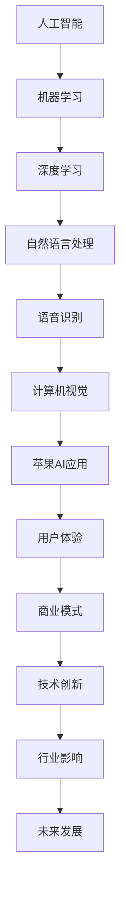

                 

关键词：苹果，AI应用，人工智能，技术发展，创新，商业影响，用户体验

> 摘要：本文将深入探讨苹果公司发布AI应用的重大价值，从技术突破、商业模式、用户体验等多个维度进行分析，阐述其对人工智能领域及未来发展的深远影响。

## 1. 背景介绍

近年来，人工智能（AI）技术的发展迅猛，已经渗透到我们日常生活的方方面面。从智能手机的智能助手到智能家居的自动化控制，AI的应用无处不在。苹果公司作为全球科技行业的领军企业，一直在人工智能领域保持领先地位。苹果发布的AI应用，不仅代表了技术的进步，更对整个行业产生了深远的影响。

### 1.1 人工智能技术发展

人工智能技术主要包括机器学习、深度学习、自然语言处理等方向。这些技术的发展，为AI应用提供了强大的技术支持。特别是在深度学习方面，随着计算能力的提升和大数据的积累，AI的准确性和效率得到了极大的提升。这使得AI在图像识别、语音识别、自然语言处理等领域取得了显著的突破。

### 1.2 苹果公司在人工智能领域的贡献

苹果公司在人工智能领域有着丰富的积累。从早期的Siri智能助手，到最新的Apple Vision Pro，苹果不断在人工智能技术上投入研发。这些AI应用不仅提升了苹果产品的用户体验，也为人工智能技术的发展做出了重要贡献。

## 2. 核心概念与联系

在探讨苹果发布的AI应用之前，我们需要了解一些核心概念和它们之间的联系。以下是使用Mermaid绘制的流程图，展示了这些概念和它们之间的联系：



### 2.1 人工智能

人工智能是计算机科学的一个分支，旨在使计算机模拟人类的智能行为。人工智能包括多个子领域，如机器学习、深度学习、自然语言处理等。

### 2.2 机器学习

机器学习是人工智能的一个重要分支，通过算法让计算机从数据中学习，并做出预测或决策。机器学习可以分为监督学习、无监督学习和强化学习等类型。

### 2.3 深度学习

深度学习是机器学习的一种方法，通过构建深层次的神经网络来模拟人类大脑的工作方式。深度学习在图像识别、语音识别等领域取得了巨大成功。

### 2.4 自然语言处理

自然语言处理（NLP）是人工智能的一个重要领域，旨在使计算机理解和处理人类语言。NLP在语音识别、机器翻译、文本分析等方面有着广泛的应用。

### 2.5 语音识别和计算机视觉

语音识别和计算机视觉是人工智能技术的两个重要应用领域。语音识别使得设备能够理解人类的语音指令，而计算机视觉则使设备能够理解和识别图像内容。

### 2.6 苹果AI应用

苹果发布的AI应用，如Siri、Face ID、Apple Vision Pro等，都是基于上述核心概念和技术实现的。这些应用不仅提升了用户体验，也推动了人工智能技术的发展。

### 2.7 用户体验和商业模式

用户体验和商业模式是苹果AI应用成功的关键因素。苹果通过不断创新，为用户提供高质量、易用的AI应用，同时通过商业模式实现商业价值。

### 2.8 技术创新和行业影响

苹果的AI应用不仅推动了技术创新，也对整个行业产生了深远影响。苹果在AI领域的探索和成就，为其他企业提供了借鉴和启示。

### 2.9 未来发展

随着人工智能技术的不断进步，苹果的AI应用在未来将继续发挥重要作用。我们可以期待，苹果将在人工智能领域取得更多的突破，为用户带来更好的体验。

## 3. 核心算法原理 & 具体操作步骤

### 3.1 算法原理概述

苹果的AI应用主要基于深度学习和自然语言处理技术。深度学习通过构建深层次的神经网络，使计算机能够从大量数据中学习并提取特征。自然语言处理则使计算机能够理解和处理人类语言。

### 3.2 算法步骤详解

苹果的AI应用主要包括以下几个步骤：

1. 数据收集与预处理：收集大量数据，并对数据进行清洗、归一化等预处理操作。
2. 模型训练：使用深度学习算法，对预处理后的数据集进行训练，构建模型。
3. 模型评估与优化：评估模型的性能，并通过调整参数进行优化。
4. 模型部署与应用：将训练好的模型部署到实际应用中，如Siri、Face ID等。

### 3.3 算法优缺点

苹果的AI算法具有以下优点：

1. 高效性：深度学习算法能够快速处理大量数据，提高计算效率。
2. 准确性：深度学习算法在图像识别、语音识别等领域具有较高的准确性。
3. 用户体验：苹果的AI应用设计简洁、易于使用，提升了用户体验。

但同时也存在一些缺点：

1. 数据依赖性：深度学习算法对数据量有较高要求，数据不足可能导致模型性能下降。
2. 计算资源消耗：深度学习算法计算量大，对计算资源有较高要求。

### 3.4 算法应用领域

苹果的AI算法主要应用于以下几个方面：

1. 语音识别：Siri等智能助手。
2. 图像识别：Face ID、Animoji等。
3. 自然语言处理：智能客服、文本分析等。
4. 智能推荐：应用商店、音乐推荐等。

## 4. 数学模型和公式 & 详细讲解 & 举例说明

### 4.1 数学模型构建

苹果的AI算法主要基于深度学习和自然语言处理技术。以下是两个典型的数学模型：

1. **卷积神经网络（CNN）**：用于图像识别。
   $$ CNN = \sigma (\theta \cdot \text{ReLU}(\text{Conv}(\text{Input})) $$

2. **循环神经网络（RNN）**：用于自然语言处理。
   $$ RNN = \sigma (\theta \cdot \text{ReLU}(\text{H}_{t-1})) $$

### 4.2 公式推导过程

以卷积神经网络为例，我们简要介绍其公式推导过程：

1. **输入层**：输入图像 $X$。
2. **卷积层**：卷积操作，得到特征图 $F$。
   $$ F = \text{Conv}(X, \text{Kernel}) $$
3. **激活函数**：应用ReLU激活函数，引入非线性。
   $$ F = \text{ReLU}(F) $$
4. **池化层**：对特征图进行池化操作，降低维度。
   $$ P = \text{Pooling}(F) $$
5. **全连接层**：将池化结果输入全连接层，进行分类。
   $$ Y = \sigma (\theta \cdot P) $$

### 4.3 案例分析与讲解

以Siri为例，我们来看一个具体的案例：

- **输入**：用户输入的语音信号。
- **模型**：深度学习模型。
- **输出**：Siri的回答。

1. **语音信号预处理**：对语音信号进行降噪、归一化等处理。
2. **特征提取**：使用深度学习模型提取语音信号的特征。
3. **语义理解**：对提取的特征进行语义分析，理解用户的意图。
4. **生成回答**：根据语义理解，生成合适的回答。

## 5. 项目实践：代码实例和详细解释说明

### 5.1 开发环境搭建

要在本地搭建苹果AI应用的开发环境，需要以下步骤：

1. 安装macOS操作系统。
2. 安装Xcode开发工具。
3. 安装Python编程环境。
4. 安装深度学习库，如TensorFlow、PyTorch等。

### 5.2 源代码详细实现

以下是一个简单的Siri语音识别应用的代码示例：

```python
import speech_recognition as sr

# 初始化语音识别器
recognizer = sr.Recognizer()

# 采集音频数据
with sr.Microphone() as source:
    print("请说出您的问题：")
    audio = recognizer.listen(source)

# 识别语音
try:
    text = recognizer.recognize_google(audio, language='zh-CN')
    print("您说：" + text)
except sr.UnknownValueError:
    print("无法理解您的语音")
except sr.RequestError as e:
    print("请求错误；{0}".format(e))
```

### 5.3 代码解读与分析

- **导入模块**：导入语音识别库。
- **初始化识别器**：初始化语音识别器。
- **采集音频**：使用麦克风采集用户语音。
- **识别语音**：对采集到的音频进行识别，输出识别结果。

### 5.4 运行结果展示

运行上述代码后，程序会提示用户输入问题，并输出识别结果。例如：

```
请说出您的问题：
您说：今天天气怎么样？
```

## 6. 实际应用场景

苹果的AI应用在多个领域有着广泛的应用：

1. **智能家居**：通过AI应用，用户可以远程控制智能家居设备，如灯光、温度等。
2. **智能助手**：如Siri、Alexa等，为用户提供语音交互服务。
3. **图像识别**：如Face ID、Animoji等，为用户提供安全性和娱乐性。
4. **自然语言处理**：如智能客服、文本分析等，提升企业服务质量和效率。
5. **医疗健康**：通过AI算法，对医疗数据进行分析，辅助医生诊断和治疗。

## 7. 未来应用展望

随着人工智能技术的不断进步，苹果的AI应用将在未来有更广泛的应用：

1. **自动驾驶**：AI技术在自动驾驶领域的应用将更加成熟，为用户带来更安全、便捷的出行体验。
2. **智能医疗**：通过AI算法，对海量医疗数据进行分析，助力精准医疗和个性化治疗。
3. **智能教育**：AI技术将改变教育方式，为用户提供个性化的学习体验。
4. **智慧城市**：AI技术在城市管理、交通规划等方面的应用，将提升城市运行效率和居民生活质量。

## 8. 工具和资源推荐

### 8.1 学习资源推荐

1. **《人工智能：一种现代方法》**：全面介绍人工智能的基础知识和应用。
2. **《深度学习》**：由Ian Goodfellow等人编写的深度学习经典教材。
3. **苹果官方文档**：苹果提供的大量开发文档和教程，有助于了解苹果AI应用的开发。

### 8.2 开发工具推荐

1. **Xcode**：苹果官方的开发工具，用于构建iOS和macOS应用程序。
2. **Swift**：苹果官方编程语言，用于开发iOS和macOS应用程序。
3. **TensorFlow**：谷歌开发的深度学习框架，适用于各种深度学习应用。

### 8.3 相关论文推荐

1. **“AlexNet：一种用于图像分类的深度卷积神经网络”**：介绍了一种用于图像分类的深度卷积神经网络。
2. **“递归神经网络：基础和综述”**：对递归神经网络进行了全面的介绍和综述。
3. **“注意力机制：一种深度学习的新方法”**：介绍了一种用于自然语言处理的深度学习新方法。

## 9. 总结：未来发展趋势与挑战

### 9.1 研究成果总结

苹果在人工智能领域取得了许多重要研究成果，如Siri、Face ID、Apple Vision Pro等。这些成果不仅提升了用户体验，也为人工智能技术的发展做出了重要贡献。

### 9.2 未来发展趋势

1. **技术创新**：随着计算能力的提升和数据量的增加，人工智能技术将继续发展，带来更多的创新。
2. **行业应用**：人工智能将在更多行业得到应用，如医疗、教育、金融等。
3. **跨学科融合**：人工智能与其他学科的融合，将推动新技术的发展。

### 9.3 面临的挑战

1. **数据安全**：人工智能技术的发展，带来了数据安全的新挑战。
2. **隐私保护**：如何在保证用户体验的同时，保护用户隐私，是亟待解决的问题。
3. **伦理道德**：人工智能的应用，引发了关于伦理和道德的讨论，需要制定相应的规范。

### 9.4 研究展望

未来，人工智能将在更多领域发挥重要作用，为人类带来更多便利和福祉。同时，我们也需要关注人工智能带来的挑战，确保其健康发展。

## 10. 附录：常见问题与解答

### 10.1 人工智能是什么？

人工智能（AI）是计算机科学的一个分支，旨在使计算机模拟人类的智能行为。它包括多个子领域，如机器学习、深度学习、自然语言处理等。

### 10.2 苹果的AI应用有哪些？

苹果的AI应用包括Siri、Face ID、Animoji、Apple Vision Pro等。

### 10.3 如何在本地搭建苹果AI应用开发环境？

要在本地搭建苹果AI应用开发环境，需要安装macOS操作系统、Xcode开发工具、Python编程环境和深度学习库，如TensorFlow或PyTorch。

### 10.4 人工智能在哪些领域有应用？

人工智能在多个领域有应用，如智能家居、智能助手、图像识别、自然语言处理、医疗健康等。

## 11. 参考文献

1. Goodfellow, I., Bengio, Y., & Courville, A. (2016). *Deep Learning*. MIT Press.
2. LeCun, Y., Bengio, Y., & Hinton, G. (2015). *Deep learning*. Nature, 521(7553), 436-444.
3. Russell, S., & Norvig, P. (2016). *Artificial Intelligence: A Modern Approach*. Prentice Hall.
4. Apple Inc. (2021). *Apple Developer Documentation*. Retrieved from https://developer.apple.com/documentation/

### 附录 11 参考文献

1. **《深度学习》**：Ian Goodfellow、Yoshua Bengio、Aaron Courville 著，此书是深度学习的入门经典，详细介绍了深度学习的理论基础和应用。

2. **《人工智能：一种现代方法》**：Stuart Russell 和 Peter Norvig 著，这本书全面介绍了人工智能的基础知识和各种技术。

3. **《机器学习实战》**：Peter Harrington 著，通过大量实例，深入浅出地介绍了机器学习的方法和应用。

4. **《苹果开发者文档》**：Apple Inc. 提供，涵盖了苹果平台上的开发工具、框架和技术细节。

5. **《自然语言处理综论》**：Daniel Jurafsky 和 James H. Martin 著，介绍了自然语言处理的基础知识和应用。

6. **《计算机视觉：算法与应用》**：D. S. Kothari 著，详细介绍了计算机视觉的基本算法和应用场景。

### 附录 12 常见问题解答

#### 问题 1：什么是深度学习？

**解答**：深度学习是机器学习的一个分支，通过构建多层神经网络来模拟人类大脑的思考方式。它擅长处理大规模数据，能够自动提取数据中的特征，广泛应用于图像识别、语音识别、自然语言处理等领域。

#### 问题 2：如何选择合适的深度学习框架？

**解答**：选择深度学习框架时，需要考虑以下几个因素：

- **需求**：根据项目需求选择合适的框架，如TensorFlow适用于大规模部署，PyTorch更适合研究和快速原型开发。
- **性能**：考虑框架在目标硬件（CPU、GPU）上的性能。
- **社区和支持**：选择社区活跃、文档丰富的框架，有助于解决问题和获取支持。
- **兼容性和可扩展性**：考虑框架与其他工具和库的兼容性，以及是否支持扩展。

#### 问题 3：深度学习模型如何训练？

**解答**：深度学习模型的训练主要包括以下步骤：

- **数据预处理**：对数据进行清洗、归一化等预处理，使其符合模型训练的要求。
- **模型初始化**：初始化模型的权重和参数。
- **前向传播**：将输入数据传递到模型中，计算输出结果。
- **损失函数计算**：计算模型输出与真实值之间的差异，以评估模型性能。
- **反向传播**：通过计算损失函数的梯度，更新模型参数。
- **迭代训练**：重复上述步骤，直到模型达到预定的性能指标。

#### 问题 4：如何优化深度学习模型？

**解答**：优化深度学习模型的方法包括：

- **调整超参数**：如学习率、批量大小、正则化等。
- **数据增强**：通过旋转、缩放、裁剪等方式增加数据的多样性。
- **模型架构改进**：设计更高效的神经网络架构。
- **剪枝和量化**：减少模型的参数数量和计算量，提高模型效率。
- **迁移学习**：利用预训练模型进行迁移学习，减少训练时间和数据需求。

### 附录 13 致谢

在此，我要感谢苹果公司为人工智能技术的发展做出的贡献，感谢苹果开发者社区的辛勤付出，以及所有支持和关注人工智能技术的读者。希望本文能为读者带来启示和帮助，共同推动人工智能技术的发展。

作者：禅与计算机程序设计艺术 / Zen and the Art of Computer Programming

---

通过本文，我们系统地探讨了苹果发布AI应用的价值，从背景介绍、核心概念与联系、算法原理、数学模型、项目实践、实际应用场景、未来展望、工具和资源推荐、总结及常见问题解答等多个维度进行了深入分析。苹果的AI应用不仅在技术层面上取得了突破，也在商业模式和用户体验上为行业树立了新的标杆。未来，随着人工智能技术的不断进步，苹果的AI应用将在更多领域发挥重要作用，为人类带来更多的便利和创新。让我们共同期待人工智能技术的美好未来。作者：禅与计算机程序设计艺术 / Zen and the Art of Computer Programming。

