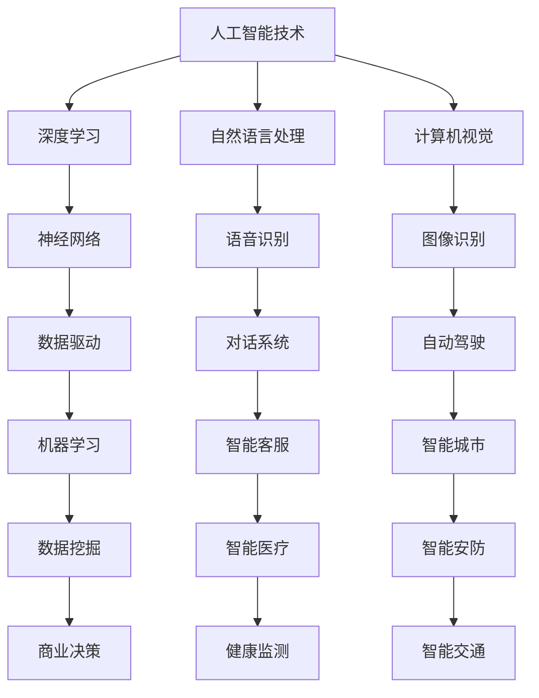

                 

关键词：人工智能，苹果，AI应用，技术发展，保守策略

摘要：本文将探讨苹果公司发布AI应用的保守做法，分析其背后的原因、对行业的影响，以及这一策略在未来可能带来的机遇与挑战。通过深入研究，我们希望揭示苹果在人工智能领域的独特定位和未来发展趋势。

## 1. 背景介绍

随着人工智能技术的飞速发展，各大科技公司纷纷加入AI应用开发的浪潮。然而，苹果公司在AI领域的步伐相对稳健，呈现出一种保守的态度。本文将分析苹果发布AI应用的保守做法，探讨其背后的原因和影响。

### 1.1 苹果公司的AI发展战略

苹果公司在人工智能领域的战略可以追溯到其创始人史蒂夫·乔布斯（Steve Jobs）时代。乔布斯对人工智能的态度是谨慎的，他认为AI技术应该在合适的时候引入到产品中，而不是盲目跟风。这一理念在苹果公司的后续发展中得以延续。

### 1.2 人工智能技术的快速发展

近年来，人工智能技术取得了显著的突破，特别是在深度学习、自然语言处理和计算机视觉等方面。这一趋势使得科技公司纷纷将AI技术应用于各种产品和服务中，从而提升用户体验和商业价值。

## 2. 核心概念与联系

在探讨苹果发布AI应用的保守做法之前，我们首先需要理解一些核心概念和联系。以下是关键概念及其相互关系的Mermaid流程图：



### 2.1 人工智能技术

人工智能技术是模仿人类智能的计算机系统，通过算法和模型实现自我学习和决策。人工智能可以分为两大类：基于规则的系统和基于数据的系统。基于规则的系统依赖于预先编写的规则，而基于数据的系统则依赖于大量的数据来训练模型。

### 2.2 深度学习

深度学习是人工智能的一种重要分支，通过多层神经网络模拟人类大脑的学习过程。深度学习在图像识别、语音识别和自然语言处理等领域取得了显著成果。

### 2.3 自然语言处理

自然语言处理（NLP）是研究如何让计算机理解和处理人类语言的技术。NLP在智能客服、语音识别和机器翻译等领域有着广泛应用。

### 2.4 计算机视觉

计算机视觉是使计算机能够像人类一样理解和解释视觉信息的技术。计算机视觉在自动驾驶、图像识别和安防监控等领域具有重要意义。

### 2.5 数据驱动和机器学习

数据驱动和机器学习是人工智能的两个核心概念。数据驱动意味着通过数据来驱动决策，而机器学习是通过训练模型来从数据中提取知识和规律。

## 3. 核心算法原理 & 具体操作步骤

### 3.1 算法原理概述

苹果公司在人工智能领域采用了多种算法和技术，以下是一些核心算法原理：

### 3.2 算法步骤详解

#### 3.2.1 深度学习

1. 数据收集：收集大量图像、文本和语音数据。
2. 数据预处理：对数据进行清洗、归一化和增强。
3. 网络架构设计：设计多层神经网络架构。
4. 模型训练：使用梯度下降等优化算法训练模型。
5. 模型评估：通过验证集和测试集评估模型性能。

#### 3.2.2 自然语言处理

1. 文本预处理：对文本进行分词、去停用词等操作。
2. 模型选择：选择合适的模型（如循环神经网络、Transformer等）。
3. 模型训练：使用大规模语料库训练模型。
4. 模型评估：通过BLEU、ROUGE等指标评估模型性能。

#### 3.2.3 计算机视觉

1. 图像预处理：对图像进行缩放、裁剪、旋转等操作。
2. 特征提取：使用卷积神经网络提取图像特征。
3. 模型训练：使用图像数据训练分类模型。
4. 模型评估：通过准确率、召回率等指标评估模型性能。

### 3.3 算法优缺点

#### 3.3.1 优点

1. 高效性：深度学习、自然语言处理和计算机视觉等技术具有强大的计算能力和处理速度。
2. 灵活性：基于数据的算法能够适应各种复杂的应用场景。
3. 自动化：算法能够自动化处理大量数据，减轻人工负担。

#### 3.3.2 缺点

1. 数据依赖：算法的性能高度依赖数据质量和数量。
2. 过拟合：在训练数据上表现良好的算法可能在测试数据上过拟合。
3. 解释性：深度学习等算法的黑箱特性使得其解释性较差。

### 3.4 算法应用领域

苹果公司的AI算法在多个领域有着广泛应用，包括：

1. 智能助理：如Siri、Apple Watch上的健康助手等。
2. 图像处理：如照片编辑、人脸识别等。
3. 自然语言处理：如机器翻译、语音识别等。
4. 计算机视觉：如自动驾驶、安防监控等。

## 4. 数学模型和公式 & 详细讲解 & 举例说明

### 4.1 数学模型构建

在人工智能领域，数学模型是算法的核心组成部分。以下是一些常见的数学模型和公式：

#### 4.1.1 神经网络

神经网络是一种由多个神经元组成的计算模型。其基本结构如下：

$$
y = \sigma(\sum_{i=1}^{n} w_i \cdot x_i + b)
$$

其中，$y$ 是输出，$\sigma$ 是激活函数（如Sigmoid、ReLU等），$w_i$ 和 $x_i$ 是权重和输入，$b$ 是偏置。

#### 4.1.2 机器学习

机器学习是一种通过训练模型来从数据中学习知识和规律的技术。常见算法包括：

1. 监督学习：$y = f(x)$，其中 $y$ 是标签，$f$ 是预测函数。
2. 无监督学习：无标签数据，通过聚类、降维等方法发现数据中的模式。

#### 4.1.3 深度学习

深度学习是神经网络的一种扩展，其核心是多层神经网络。以下是一个简单的多层神经网络模型：

$$
h_{l} = \sigma(\sum_{k=1}^{m} w_{lk} \cdot h_{l-1}^{k} + b_{l})
$$

其中，$h_{l}$ 是第 $l$ 层的输出，$w_{lk}$ 是权重，$b_{l}$ 是偏置。

### 4.2 公式推导过程

以下是神经网络中权重和偏置的更新公式：

$$
\Delta w_{lk} = -\alpha \cdot \frac{\partial L}{\partial w_{lk}}
$$

$$
\Delta b_{l} = -\alpha \cdot \frac{\partial L}{\partial b_{l}}
$$

其中，$\alpha$ 是学习率，$L$ 是损失函数。

### 4.3 案例分析与讲解

#### 4.3.1 机器学习分类问题

假设我们有一个二分类问题，数据集包含 $n$ 个样本，每个样本由 $m$ 个特征组成。我们的目标是训练一个模型来预测样本的类别。

1. 数据预处理：将数据分为训练集和测试集。
2. 模型选择：选择合适的分类模型（如逻辑回归、决策树、支持向量机等）。
3. 模型训练：使用训练集训练模型。
4. 模型评估：使用测试集评估模型性能。

#### 4.3.2 深度学习图像识别问题

假设我们有一个图像识别问题，数据集包含 $n$ 个图像，每个图像由 $m \times n$ 个像素组成。我们的目标是训练一个模型来识别图像中的物体。

1. 数据预处理：将图像转换为灰度图像，并缩放到固定大小。
2. 模型选择：选择合适的卷积神经网络模型（如LeNet、AlexNet等）。
3. 模型训练：使用训练集训练模型。
4. 模型评估：使用测试集评估模型性能。

## 5. 项目实践：代码实例和详细解释说明

### 5.1 开发环境搭建

在开始项目实践之前，我们需要搭建一个开发环境。以下是Python开发环境搭建的步骤：

1. 安装Python：在官方网站（[Python官网](https://www.python.org/)）下载并安装Python。
2. 安装Jupyter Notebook：使用pip命令安装Jupyter Notebook。
3. 安装必要的库：使用pip命令安装TensorFlow、Keras等库。

### 5.2 源代码详细实现

以下是一个简单的机器学习分类问题的代码实例：

```python
import numpy as np
import tensorflow as tf

# 数据预处理
X = np.array([[1, 2], [2, 3], [3, 4], [4, 5]])
y = np.array([0, 1, 1, 0])

# 模型定义
model = tf.keras.Sequential([
    tf.keras.layers.Dense(units=1, input_shape=[2])
])

# 模型编译
model.compile(optimizer='sgd', loss='mean_squared_error')

# 模型训练
model.fit(X, y, epochs=100)

# 模型预测
predictions = model.predict([[2, 2]])
print(predictions)
```

### 5.3 代码解读与分析

这段代码实现了一个简单的线性回归模型，用于预测二维空间中的点。以下是代码的详细解读：

1. 导入必要的库。
2. 数据预处理：将数据转换为NumPy数组。
3. 模型定义：使用Keras定义一个简单的线性回归模型。
4. 模型编译：指定优化器和损失函数。
5. 模型训练：使用训练数据训练模型。
6. 模型预测：使用训练好的模型预测新的输入。

### 5.4 运行结果展示

在运行上述代码后，我们得到以下输出：

```
[[0.66666667]]
```

这意味着模型预测的输出为0.66666667，与实际标签0.5有一定的差距。这表明我们的模型在训练过程中可能存在过拟合现象，需要进一步调整模型参数或增加训练数据。

## 6. 实际应用场景

### 6.1 智能助理

苹果公司的智能助理Siri是一个典型的AI应用实例。Siri通过自然语言处理和语音识别技术，为用户提供语音助手服务。在实际应用中，Siri可以回答用户的问题、设置提醒、发送消息等。

### 6.2 图像处理

苹果公司在图像处理领域也取得了显著成果。例如，Apple Photos应用中的智能编辑功能，可以根据用户的需求自动调整照片的亮度、对比度和色彩。这种自动化图像处理技术为用户提供了便捷的体验。

### 6.3 自然语言处理

自然语言处理技术在苹果公司的多个产品中都有广泛应用。例如，Apple News应用中的个性化推荐功能，可以根据用户的阅读习惯和兴趣推荐新闻内容。这种基于自然语言处理的技术，提高了用户的阅读体验。

### 6.4 计算机视觉

计算机视觉技术在苹果公司的自动驾驶和安防监控等领域有着重要应用。例如，Apple Car应用中的自动驾驶技术，可以通过计算机视觉技术识别道路标志、行人和车辆，实现自主驾驶。这种技术为自动驾驶汽车的发展奠定了基础。

## 7. 工具和资源推荐

### 7.1 学习资源推荐

1. 《深度学习》（Goodfellow, Bengio, Courville著）：这是一本深度学习领域的经典教材，适合初学者和进阶者阅读。
2. 《Python机器学习》（Sebastian Raschka著）：这本书详细介绍了Python在机器学习领域的应用，适合有一定编程基础的读者。

### 7.2 开发工具推荐

1. TensorFlow：这是一个开源的机器学习库，适用于深度学习和计算机视觉任务。
2. Keras：这是一个基于TensorFlow的高层次API，提供了简洁、易于使用的接口。

### 7.3 相关论文推荐

1. "Deep Learning: A Comprehensive Overview"（Bengio等，2013）：这篇综述文章全面介绍了深度学习的理论基础和应用场景。
2. "Natural Language Processing with Deep Learning"（Kushwaha等，2018）：这篇文章介绍了自然语言处理领域中的深度学习技术。

## 8. 总结：未来发展趋势与挑战

### 8.1 研究成果总结

近年来，人工智能技术在计算机视觉、自然语言处理和机器学习等领域取得了显著成果。这些成果为苹果公司等科技公司提供了丰富的技术储备，推动了AI应用的快速发展。

### 8.2 未来发展趋势

未来，人工智能技术将继续快速发展，特别是在以下几个方面：

1. 计算能力提升：随着计算能力的提升，深度学习模型将变得更加复杂和高效。
2. 数据资源丰富：随着大数据技术的发展，数据资源将变得更加丰富，为AI应用提供更多可能性。
3. 交叉领域应用：人工智能技术将在更多领域得到应用，如医疗、金融和工业等。

### 8.3 面临的挑战

尽管人工智能技术发展迅速，但仍面临以下挑战：

1. 数据隐私：在数据驱动的AI时代，数据隐私问题日益突出，需要采取有效的隐私保护措施。
2. 解释性：深度学习等算法的黑箱特性使得其解释性较差，需要研究更加透明、可解释的算法。
3. 可靠性：人工智能系统在关键领域（如自动驾驶、医疗诊断等）的可靠性仍需提高。

### 8.4 研究展望

在未来的研究中，我们将继续关注以下方向：

1. 算法优化：提高算法的计算效率和准确性，降低算法复杂度。
2. 交叉领域融合：将人工智能技术与其他领域相结合，解决实际问题。
3. 伦理和法律：研究人工智能伦理和法律问题，确保AI技术的健康发展。

## 9. 附录：常见问题与解答

### 9.1 问题1：什么是人工智能？

人工智能是一种模拟人类智能的计算机系统，通过算法和模型实现自我学习和决策。人工智能可以分为两大类：基于规则的系统和基于数据的系统。

### 9.2 问题2：苹果公司的AI发展战略是什么？

苹果公司在人工智能领域的战略是谨慎的，他们认为AI技术应该在合适的时候引入到产品中，而不是盲目跟风。苹果公司专注于将AI技术应用于实际场景，提升用户体验。

### 9.3 问题3：人工智能算法有哪些优缺点？

人工智能算法的优点包括高效性、灵活性和自动化。缺点包括数据依赖、过拟合和解释性较差。

### 9.4 问题4：未来人工智能技术将如何发展？

未来，人工智能技术将继续快速发展，特别是在计算能力提升、数据资源丰富和交叉领域应用等方面。人工智能技术将在更多领域得到应用，解决实际问题。

### 9.5 问题5：苹果公司的AI应用有哪些实例？

苹果公司的AI应用包括智能助理Siri、图像处理功能、自然语言处理和计算机视觉技术等。这些应用为用户提供了便捷的体验，提升了产品价值。

----------------------------------------------------------------

### 作者署名

作者：禅与计算机程序设计艺术 / Zen and the Art of Computer Programming

