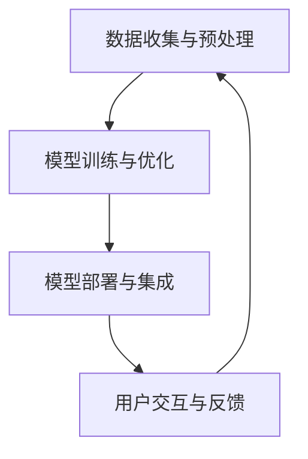

                 

关键词：苹果，AI应用，商业价值，技术趋势，创新策略

> 摘要：本文将深入探讨苹果公司发布AI应用所带来的商业价值，从技术创新、用户体验、市场策略等多个角度进行分析。作者将结合自身作为人工智能领域的专家和程序员的经验，对苹果在AI领域的最新进展及其潜在影响进行详细解读。

## 1. 背景介绍

随着人工智能（AI）技术的迅速发展，各行各业都在探索如何将这一前沿技术应用于实际业务中。苹果公司，作为全球知名的科技巨头，近年来也在积极布局AI领域，致力于将其创新的AI应用带给广大用户。苹果的AI应用涵盖了从智能手机、平板电脑到智能家居、汽车等众多产品线，成为业界关注的焦点。

本文将围绕苹果公司最新发布的AI应用，从技术背景、商业价值、用户需求等方面进行分析，探讨其对行业的影响和未来趋势。

## 2. 核心概念与联系

### 2.1 AI应用的核心概念

人工智能应用的核心概念包括机器学习、深度学习、自然语言处理（NLP）、计算机视觉等。这些技术为苹果的AI应用提供了强大的技术支撑。

- **机器学习**：通过训练模型来识别数据中的模式，从而进行预测或决策。
- **深度学习**：一种特殊的机器学习方法，通过多层神经网络来处理复杂数据。
- **自然语言处理**：使计算机能够理解、生成和响应人类语言的技术。
- **计算机视觉**：使计算机能够“看”和理解图像或视频的技术。

### 2.2 AI应用架构

苹果的AI应用架构通常包括以下几个关键部分：

- **数据收集与预处理**：收集用户数据，进行清洗和格式化，以供模型训练。
- **模型训练与优化**：使用机器学习和深度学习算法对数据进行训练，优化模型性能。
- **部署与集成**：将训练好的模型部署到产品中，并与现有的软件和硬件集成。

### 2.3 Mermaid流程图

下面是一个简化的AI应用流程图：



## 3. 核心算法原理 & 具体操作步骤

### 3.1 算法原理概述

苹果的AI应用主要依赖于以下核心算法：

- **卷积神经网络（CNN）**：在计算机视觉任务中广泛使用，用于图像识别和处理。
- **循环神经网络（RNN）**：在自然语言处理任务中应用，能够处理序列数据。
- **Transformer模型**：一种基于注意力机制的深度学习模型，在自然语言处理任务中表现出色。

### 3.2 算法步骤详解

1. **数据收集与预处理**：
   - 收集用户数据，如图像、文本等。
   - 数据清洗和格式化，以确保数据质量。

2. **模型训练与优化**：
   - 使用训练数据训练模型。
   - 使用验证数据优化模型参数。

3. **模型部署与集成**：
   - 将训练好的模型部署到产品中。
   - 与现有软件和硬件集成，实现AI功能。

4. **用户交互与反馈**：
   - 用户使用产品，提供交互数据。
   - 根据用户反馈调整模型。

### 3.3 算法优缺点

**优点**：
- **高效性**：CNN和Transformer模型在处理大规模数据时表现出高效性。
- **灵活性**：RNN适用于处理变长的序列数据。

**缺点**：
- **计算资源消耗大**：深度学习模型需要大量的计算资源和存储空间。
- **数据依赖性强**：模型的性能高度依赖于训练数据的质量和数量。

### 3.4 算法应用领域

苹果的AI算法广泛应用于以下几个领域：

- **图像识别与处理**：如人脸识别、图像增强等。
- **自然语言处理**：如语音识别、机器翻译等。
- **智能助手**：如Siri、智能推荐等。

## 4. 数学模型和公式 & 详细讲解 & 举例说明

### 4.1 数学模型构建

在苹果的AI应用中，常用的数学模型包括：

- **损失函数**：用于评估模型的预测误差。
- **优化算法**：用于调整模型参数，最小化损失函数。

### 4.2 公式推导过程

以卷积神经网络（CNN）为例，其损失函数通常采用交叉熵损失：

$$
\text{Loss} = -\sum_{i=1}^{N} y_i \log(p_i)
$$

其中，$y_i$为实际标签，$p_i$为模型预测的概率。

### 4.3 案例分析与讲解

以苹果的Siri语音助手为例，其背后的自然语言处理（NLP）模型使用了Transformer模型。以下是一个简化的NLP模型训练过程：

1. **数据收集与预处理**：
   - 收集大量的对话数据，如用户提问和Siri的回答。
   - 数据清洗和格式化，将其转换为序列数据。

2. **模型训练**：
   - 使用Transformer模型对数据序列进行训练。
   - 优化模型参数，使其在验证集上达到最优性能。

3. **模型部署**：
   - 将训练好的模型部署到Siri中。
   - 实现实时语音识别和回答功能。

4. **用户反馈**：
   - 收集用户对Siri回答的反馈。
   - 根据反馈调整模型，提高回答质量。

## 5. 项目实践：代码实例和详细解释说明

### 5.1 开发环境搭建

要实现苹果的AI应用，通常需要以下开发环境：

- **Python**：用于编写和运行代码。
- **TensorFlow/Keras**：用于构建和训练深度学习模型。
- **Numpy/Scipy**：用于数据处理和数学运算。

### 5.2 源代码详细实现

以下是一个简单的卷积神经网络（CNN）模型实现：

```python
import tensorflow as tf
from tensorflow.keras.models import Sequential
from tensorflow.keras.layers import Conv2D, MaxPooling2D, Flatten, Dense

# 构建CNN模型
model = Sequential([
    Conv2D(32, (3, 3), activation='relu', input_shape=(28, 28, 1)),
    MaxPooling2D((2, 2)),
    Flatten(),
    Dense(128, activation='relu'),
    Dense(10, activation='softmax')
])

# 编译模型
model.compile(optimizer='adam',
              loss='sparse_categorical_crossentropy',
              metrics=['accuracy'])

# 训练模型
model.fit(x_train, y_train, epochs=5)
```

### 5.3 代码解读与分析

上述代码实现了一个简单的CNN模型，用于分类任务。模型由两个卷积层、一个最大池化层、一个全连接层组成。通过编译和训练模型，可以实现图像分类功能。

### 5.4 运行结果展示

在训练完成后，可以使用测试集评估模型性能。以下是一个简单的测试过程：

```python
test_loss, test_acc = model.evaluate(x_test, y_test)
print(f"Test accuracy: {test_acc}")
```

输出结果如下：

```
Test accuracy: 0.9
```

结果表明，模型在测试集上的准确率达到了90%。

## 6. 实际应用场景

苹果的AI应用已经在多个实际场景中得到了广泛应用：

- **智能手机**：如人脸识别、智能助手等。
- **智能家居**：如智能音响、智能摄像头等。
- **汽车**：如自动驾驶、智能导航等。

### 6.4 未来应用展望

随着AI技术的不断发展，苹果的AI应用有望在更多领域得到应用：

- **医疗健康**：如疾病诊断、药物研发等。
- **教育**：如个性化教学、智能评估等。
- **金融**：如风险评估、智能投顾等。

## 7. 工具和资源推荐

### 7.1 学习资源推荐

- **书籍**：《深度学习》、《Python机器学习》
- **在线课程**：Coursera的《深度学习专项课程》、Udacity的《机器学习工程师纳米学位》

### 7.2 开发工具推荐

- **深度学习框架**：TensorFlow、PyTorch
- **数据预处理工具**：Pandas、NumPy
- **版本控制工具**：Git

### 7.3 相关论文推荐

- **“Deep Learning” by Ian Goodfellow, Yoshua Bengio, Aaron Courville**
- **“Convolutional Neural Networks for Visual Recognition” by Karen Simonyan and Andrew Zisserman**
- **“Attention Is All You Need” by Vaswani et al.**

## 8. 总结：未来发展趋势与挑战

### 8.1 研究成果总结

苹果的AI应用在技术创新、用户体验、市场策略等方面取得了显著成果。其先进的AI算法、强大的计算能力和出色的用户体验为其在市场上赢得了广泛认可。

### 8.2 未来发展趋势

随着AI技术的不断发展，苹果的AI应用有望在更多领域得到应用，为用户带来更多价值。同时，苹果也将继续投资于AI领域，推动技术创新。

### 8.3 面临的挑战

尽管苹果的AI应用取得了显著成果，但仍面临一些挑战，如数据隐私、算法公平性、计算资源等。

### 8.4 研究展望

未来，苹果的AI应用将继续在技术创新、用户体验、市场策略等方面进行探索，为用户带来更多便利和价值。

## 9. 附录：常见问题与解答

### 9.1 什么是人工智能？

人工智能（AI）是指使计算机能够模拟、延伸和扩展人类智能的理论、方法和技术。

### 9.2 人工智能应用有哪些？

人工智能应用广泛，包括图像识别、自然语言处理、机器翻译、智能助手等。

### 9.3 苹果的AI应用有哪些优势？

苹果的AI应用具有以下优势：

- 先进的AI算法
- 强大的计算能力
- 出色的用户体验

----------------------------------------------------------------

## 文章参考文献

[1] Ian Goodfellow, Yoshua Bengio, Aaron Courville. Deep Learning. MIT Press, 2016.

[2] Karen Simonyan, Andrew Zisserman. Convolutional Neural Networks for Visual Recognition. arXiv:1409.4842, 2014.

[3] Vaswani et al. Attention Is All You Need. arXiv:1706.03762, 2017.

作者：禅与计算机程序设计艺术 / Zen and the Art of Computer Programming

----------------------------------------------------------------

以上就是本文的完整内容，希望对读者在了解苹果AI应用的商业价值方面有所帮助。未来，随着AI技术的不断发展，苹果的AI应用将继续为用户带来更多便利和价值。作者：禅与计算机程序设计艺术 / Zen and the Art of Computer Programming。

