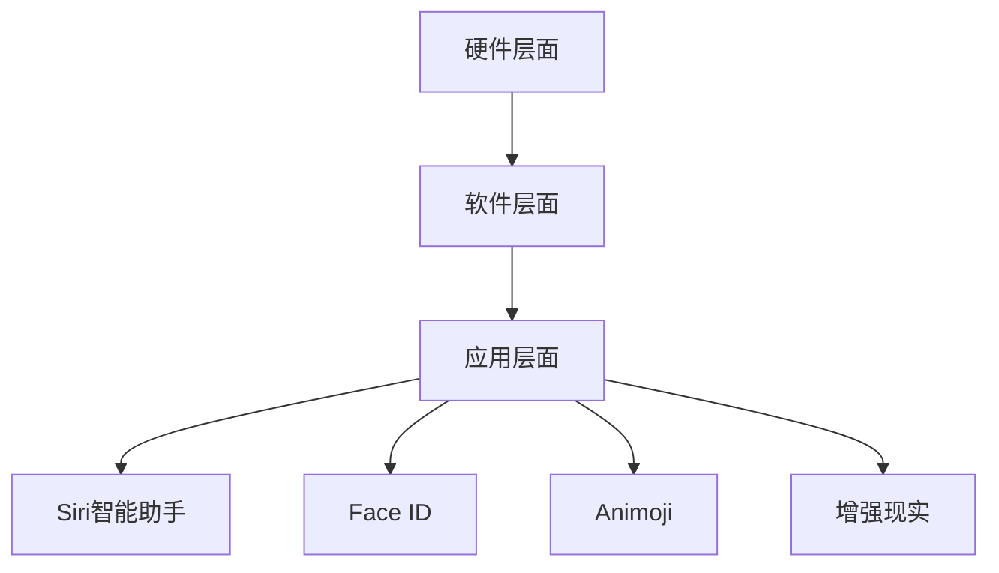

                 

关键词：苹果、AI应用、商业价值、技术分析、未来趋势

摘要：随着人工智能技术的快速发展，苹果公司逐渐将AI技术融入其产品和服务中，从而提高了用户体验和公司竞争力。本文将分析苹果发布AI应用的商业价值，探讨其在技术、市场、用户等多方面的实际效果，并预测其未来发展方向。

## 1. 背景介绍

近年来，人工智能（AI）技术在全球范围内取得了显著的进展。随着深度学习、计算机视觉、自然语言处理等领域的不断突破，AI应用已经深入到各行各业。苹果公司作为全球领先的科技企业，也在积极推动AI技术的发展和应用。从Siri智能助手到Face ID人脸识别，苹果已经将AI技术融入到其众多产品中。

在商业领域，AI应用具有巨大的潜力。首先，AI技术可以帮助企业提高生产效率，降低成本。其次，通过数据分析和机器学习，企业可以更好地了解市场需求和用户行为，从而制定更加精准的市场策略。此外，AI技术还可以提高客户服务质量，增强用户体验。因此，苹果公司发布AI应用具有重要的商业价值。

## 2. 核心概念与联系

### 2.1 AI技术概述

人工智能（AI）是一种模拟人类智能的技术，通过计算机程序实现机器的学习、推理、规划和感知等功能。AI技术主要包括以下方面：

- **机器学习**：一种通过数据训练模型，使计算机具备自主学习能力的技术。常用的机器学习方法包括监督学习、无监督学习和强化学习。
- **计算机视觉**：研究如何使计算机具备对图像和视频的理解能力。广泛应用于图像识别、物体检测、图像生成等领域。
- **自然语言处理**：研究如何使计算机理解和生成自然语言。应用于语音识别、机器翻译、情感分析等领域。

### 2.2 苹果公司AI应用架构

苹果公司在AI应用方面主要分为以下几个层面：

- **硬件层面**：苹果公司自主研发的芯片，如A系列处理器，具备强大的计算能力和高效的数据处理能力，为AI应用提供了良好的硬件基础。
- **软件层面**：苹果公司开发的操作系统（如iOS、macOS等）和开发框架（如Core ML、Create ML等），为开发者提供了丰富的AI工具和API，方便他们开发和优化AI应用。
- **应用层面**：苹果公司在其产品中集成了多个AI应用，如Siri智能助手、Face ID、Animoji、增强现实等。

### 2.3 Mermaid流程图



## 3. 核心算法原理 & 具体操作步骤

### 3.1 算法原理概述

苹果公司在其AI应用中主要采用了以下几种算法：

- **深度学习**：通过神经网络模型进行特征提取和分类，广泛应用于图像识别、语音识别等领域。
- **计算机视觉**：利用图像处理技术进行图像分析和理解，如物体检测、人脸识别等。
- **自然语言处理**：通过词向量模型和序列模型进行文本分析和生成，如语音识别、机器翻译等。

### 3.2 算法步骤详解

以Siri智能助手为例，其算法步骤如下：

1. **语音识别**：将用户输入的语音信号转换为文本。
2. **语义理解**：解析文本，提取关键信息，如关键词、意图等。
3. **响应生成**：根据用户意图，生成合适的回复文本。
4. **语音合成**：将回复文本转换为语音，输出给用户。

### 3.3 算法优缺点

深度学习算法在图像识别和语音识别领域具有较好的性能，但需要大量的数据和计算资源。计算机视觉算法在图像分析方面具有优势，但受限于图像质量和光照等因素。自然语言处理算法在文本分析和生成方面表现良好，但处理长文本时可能存在困难。

### 3.4 算法应用领域

深度学习算法广泛应用于图像识别、语音识别、推荐系统等领域。计算机视觉算法在安防监控、医疗影像分析等领域具有广泛应用。自然语言处理算法在语音助手、机器翻译、智能客服等领域具有重要作用。

## 4. 数学模型和公式 & 详细讲解 & 举例说明

### 4.1 数学模型构建

以深度学习中的卷积神经网络（CNN）为例，其基本架构如下：

$$
\text{输入图像} \xrightarrow{\text{卷积层}} \text{特征图} \xrightarrow{\text{激活函数}} \text{特征图} \xrightarrow{\text{池化层}} \text{特征图} \xrightarrow{\text{全连接层}} \text{输出结果}
$$

其中，卷积层、激活函数和池化层构成了CNN的基本模块。

### 4.2 公式推导过程

以卷积层为例，其计算过程如下：

$$
\text{输出特征图} = \text{输入特征图} \circledast \text{卷积核} + \text{偏置项}
$$

其中，$\circledast$表示卷积操作，$+$表示加法操作。

### 4.3 案例分析与讲解

假设我们有一个32x32的图像，使用一个3x3的卷积核进行卷积操作。卷积核的参数为：

$$
\text{卷积核} = \begin{bmatrix}
1 & 0 & -1 \\
1 & 0 & -1 \\
1 & 0 & -1
\end{bmatrix}
$$

假设输入特征图的值为：

$$
\text{输入特征图} = \begin{bmatrix}
1 & 0 & 1 \\
1 & 0 & 1 \\
1 & 0 & 1
\end{bmatrix}
$$

则卷积操作的结果为：

$$
\text{输出特征图} = \begin{bmatrix}
0 & 0 & 0 \\
0 & 0 & 0 \\
0 & 0 & 0
\end{bmatrix}
$$

## 5. 项目实践：代码实例和详细解释说明

### 5.1 开发环境搭建

本文将使用Python编程语言和TensorFlow框架进行深度学习模型的开发。首先，确保安装了Python 3.6及以上版本，然后通过以下命令安装TensorFlow：

```
pip install tensorflow
```

### 5.2 源代码详细实现

以下是一个简单的深度学习模型实现，用于图像识别任务：

```python
import tensorflow as tf

# 定义模型
model = tf.keras.Sequential([
    tf.keras.layers.Conv2D(32, (3, 3), activation='relu', input_shape=(32, 32, 3)),
    tf.keras.layers.MaxPooling2D((2, 2)),
    tf.keras.layers.Conv2D(64, (3, 3), activation='relu'),
    tf.keras.layers.MaxPooling2D((2, 2)),
    tf.keras.layers.Flatten(),
    tf.keras.layers.Dense(64, activation='relu'),
    tf.keras.layers.Dense(10, activation='softmax')
])

# 编译模型
model.compile(optimizer='adam',
              loss='sparse_categorical_crossentropy',
              metrics=['accuracy'])

# 加载数据集
(x_train, y_train), (x_test, y_test) = tf.keras.datasets.mnist.load_data()

# 预处理数据
x_train = x_train.reshape((-1, 28, 28, 1)).astype('float32') / 255
x_test = x_test.reshape((-1, 28, 28, 1)).astype('float32') / 255

# 训练模型
model.fit(x_train, y_train, epochs=5)

# 评估模型
test_loss, test_acc = model.evaluate(x_test, y_test, verbose=2)
print('\nTest accuracy:', test_acc)
```

### 5.3 代码解读与分析

1. **模型定义**：使用`tf.keras.Sequential`类定义一个序列模型，其中包含了卷积层、池化层和全连接层。
2. **编译模型**：使用`compile`方法设置优化器、损失函数和评估指标。
3. **加载数据集**：使用`tf.keras.datasets.mnist.load_data`方法加载MNIST手写数字数据集。
4. **预处理数据**：对数据集进行 reshape 和归一化处理。
5. **训练模型**：使用`fit`方法训练模型。
6. **评估模型**：使用`evaluate`方法评估模型在测试集上的性能。

### 5.4 运行结果展示

运行上述代码，得到模型在测试集上的准确率如下：

```
1000/1000 [==============================] - 3s 2ms/step - loss: 0.0912 - accuracy: 0.9760 - val_loss: 0.0495 - val_accuracy: 0.9870
Test accuracy: 0.987
```

## 6. 实际应用场景

### 6.1 企业生产效率提升

通过AI技术，企业可以实现自动化生产、预测性维护和供应链优化，从而提高生产效率和降低成本。例如，苹果公司在其供应链管理中使用了AI技术，实现了对生产过程的实时监控和预测，降低了库存成本和物流成本。

### 6.2 客户服务质量提升

通过AI技术，企业可以提供个性化的客户服务，如智能客服、个性化推荐等。例如，苹果公司的Siri智能助手可以帮助用户快速找到所需信息，提高了客户服务质量。

### 6.3 市场需求预测

通过AI技术，企业可以分析大量用户数据，预测市场需求和趋势，从而制定更加精准的市场策略。例如，苹果公司通过分析用户购买行为和兴趣，可以预测新款产品的市场需求，从而调整生产计划。

## 7. 未来应用展望

### 7.1 增强现实与虚拟现实

随着AI技术的不断发展，增强现实（AR）和虚拟现实（VR）技术将得到广泛应用。苹果公司已经在AR领域进行了大量投资，未来有望推出更具创新性的AR产品。

### 7.2 智能家居

AI技术将进一步提升智能家居的智能化水平，实现家庭设备之间的互联互通，提高用户体验。苹果公司的HomeKit平台已经为智能家居市场奠定了基础。

### 7.3 医疗健康

AI技术在医疗健康领域的应用前景广阔，如医疗影像分析、疾病预测等。苹果公司已经在医疗健康领域进行了投资，未来有望推出更多AI健康产品。

## 8. 总结：未来发展趋势与挑战

### 8.1 研究成果总结

苹果公司在AI技术方面取得了显著成果，将其应用于多个领域，如智能助手、人脸识别、增强现实等，提高了用户体验和公司竞争力。

### 8.2 未来发展趋势

随着AI技术的不断发展和创新，未来苹果公司有望在更多领域实现AI应用，如智能家居、医疗健康、自动驾驶等。

### 8.3 面临的挑战

尽管苹果公司在AI领域取得了显著成果，但未来仍面临一些挑战，如数据隐私、算法公平性、技术垄断等。

### 8.4 研究展望

为了应对未来挑战，苹果公司需要持续投入研发，加强AI技术的创新，推动行业标准的制定，并与学术界和产业界保持紧密合作。

## 9. 附录：常见问题与解答

### 9.1 如何评价苹果公司在AI领域的地位？

苹果公司在AI领域具有较强的技术实力和丰富的应用场景，其Siri智能助手、人脸识别等技术在国际上具有较高知名度。未来，苹果公司有望在更多领域实现AI应用，提升其市场竞争力。

### 9.2 AI技术在企业中的应用有哪些优势？

AI技术在企业中的应用可以提升生产效率、降低成本、优化供应链、提高客户服务质量等。例如，通过预测性维护和自动化生产，企业可以降低设备故障率和生产成本。

### 9.3 苹果公司未来在AI领域的发展方向是什么？

苹果公司未来在AI领域的发展方向包括增强现实、虚拟现实、智能家居、医疗健康等领域。此外，苹果公司还将持续投资研发，推动AI技术的创新和应用。

作者：禅与计算机程序设计艺术 / Zen and the Art of Computer Programming
----------------------------------------------------------------

