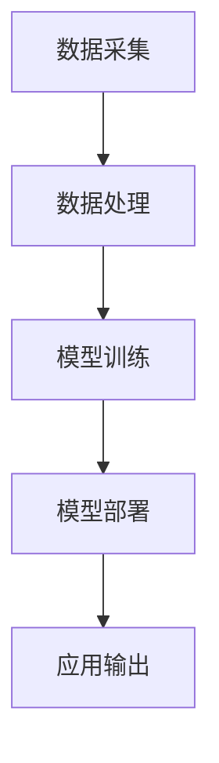

                 

关键词：苹果、AI应用、市场分析、技术趋势、用户需求

> 摘要：本文将深入探讨苹果公司发布AI应用的市场前景，分析其背后的技术原理、市场需求以及未来发展趋势，为读者提供一个全面而深入的了解。

## 1. 背景介绍

在过去的几年里，人工智能（AI）技术经历了迅猛的发展。从最初的机器学习算法，到如今深度学习、自然语言处理等领域的突破，AI技术正逐渐渗透到我们日常生活的方方面面。苹果公司作为全球领先的科技企业，也紧跟AI技术的发展步伐，不断推出创新的AI应用。

此次苹果发布的AI应用，不仅标志着苹果在AI领域的进一步布局，更是对其产品生态系统的重大升级。苹果的AI应用涵盖了语音识别、图像处理、自然语言处理等多个领域，为用户提供了更为智能化、个性化的服务。

### 1.1 AI技术的发展历程

人工智能的概念早在20世纪50年代就已经提出，但直到近年，随着计算能力的提升和大数据的积累，AI技术才真正迎来了爆发式发展。深度学习作为AI的一个重要分支，通过模拟人脑神经网络进行学习，已经在图像识别、语音识别等领域取得了显著成果。

### 1.2 苹果在AI领域的布局

苹果公司在AI领域的布局可以追溯到2011年，当时苹果收购了语音识别公司SpeechFX，标志着苹果开始涉足AI领域。近年来，苹果不断加大在AI方面的研发投入，并在多个领域取得了重要突破。

首先，苹果在图像识别方面表现突出，其自主研发的图像识别算法在多个国际竞赛中取得了优异成绩。其次，苹果的语音识别技术也在不断进步，其Siri语音助手已经可以处理复杂的语音指令，并在智能家居、汽车等多个场景中得到广泛应用。

## 2. 核心概念与联系

### 2.1 AI应用的核心概念

AI应用的核心在于通过算法和模型对海量数据进行处理，从而实现智能化的功能。其中，机器学习和深度学习是AI应用的两个关键概念。

#### 2.1.1 机器学习

机器学习是指通过数据训练模型，使模型具备自主学习和改进的能力。机器学习算法可以分为监督学习、无监督学习和强化学习等不同类型。

#### 2.1.2 深度学习

深度学习是机器学习的一个分支，通过模拟人脑神经网络进行学习，具有处理复杂数据的能力。深度学习算法在图像识别、语音识别等领域取得了显著成果。

### 2.2 AI应用的架构

AI应用的架构通常包括数据采集、数据处理、模型训练、模型部署等几个关键环节。

#### 2.2.1 数据采集

数据采集是AI应用的基础，通过收集大量的数据，为模型训练提供素材。

#### 2.2.2 数据处理

数据处理包括数据清洗、数据预处理等步骤，以确保数据的质量和可用性。

#### 2.2.3 模型训练

模型训练是AI应用的核心环节，通过使用机器学习或深度学习算法对数据进行训练，得到一个具有预测能力的模型。

#### 2.2.4 模型部署

模型部署是将训练好的模型部署到实际应用中，通过实时数据输入，模型输出预测结果。

### 2.3 Mermaid流程图

以下是AI应用的Mermaid流程图：



## 3. 核心算法原理 & 具体操作步骤

### 3.1 算法原理概述

苹果的AI应用主要基于深度学习和机器学习算法，其核心原理是通过训练模型，使模型具备对数据的分析和预测能力。

#### 3.1.1 深度学习算法

深度学习算法通过模拟人脑神经网络进行学习，具有处理复杂数据的能力。深度学习算法主要包括卷积神经网络（CNN）、循环神经网络（RNN）和生成对抗网络（GAN）等。

#### 3.1.2 机器学习算法

机器学习算法主要包括监督学习、无监督学习和强化学习等。监督学习算法通过对标注数据进行训练，得到一个预测模型；无监督学习算法通过对未标注数据进行处理，发现数据中的规律；强化学习算法通过奖励机制，使模型不断优化自己的行为。

### 3.2 算法步骤详解

苹果的AI应用开发主要包括以下几个步骤：

#### 3.2.1 数据采集

数据采集是AI应用的基础，苹果公司通过多种渠道收集海量数据，包括用户行为数据、设备数据等。

#### 3.2.2 数据处理

数据处理包括数据清洗、数据预处理等步骤，以确保数据的质量和可用性。数据清洗主要包括去除噪声数据、缺失值填充等；数据预处理主要包括数据归一化、特征提取等。

#### 3.2.3 模型训练

模型训练是AI应用的核心环节，苹果公司使用深度学习和机器学习算法对数据进行训练，得到一个具有预测能力的模型。

#### 3.2.4 模型部署

模型部署是将训练好的模型部署到实际应用中，通过实时数据输入，模型输出预测结果。

### 3.3 算法优缺点

#### 3.3.1 优点

- **强大的数据处理能力**：深度学习和机器学习算法具有强大的数据处理能力，能够处理海量数据。
- **自适应能力**：算法可以根据数据不断优化自身，具有自适应能力。
- **个性化服务**：通过训练模型，可以为用户提供个性化的服务。

#### 3.3.2 缺点

- **数据依赖性**：算法的预测能力依赖于数据的质量和数量。
- **计算资源需求**：深度学习和机器学习算法需要大量的计算资源，对硬件性能要求较高。

### 3.4 算法应用领域

苹果的AI应用主要应用于以下几个领域：

- **语音识别**：苹果的Siri语音助手通过深度学习算法实现语音识别，为用户提供语音搜索、语音控制等功能。
- **图像识别**：苹果的图像识别算法可以识别图像中的物体、场景等，为用户提供图像搜索、图像编辑等功能。
- **自然语言处理**：苹果的自然语言处理算法可以理解用户的语言意图，为用户提供智能客服、智能翻译等功能。

## 4. 数学模型和公式 & 详细讲解 & 举例说明

### 4.1 数学模型构建

苹果的AI应用涉及多种数学模型，以下以深度学习算法为例，介绍其数学模型的构建。

#### 4.1.1 卷积神经网络（CNN）

卷积神经网络是一种用于图像识别的深度学习算法，其数学模型主要包括卷积层、池化层和全连接层。

$$
h_{l}^{(i)} = \sigma \left( \sum_{j} w_{j}^{(l)} h_{l-1}^{(j)} + b_{l} \right)
$$

其中，$h_{l}^{(i)}$表示第$l$层第$i$个神经元的激活值，$\sigma$表示激活函数，$w_{j}^{(l)}$和$b_{l}$分别表示第$l$层的权重和偏置。

#### 4.1.2 循环神经网络（RNN）

循环神经网络是一种用于序列数据处理的深度学习算法，其数学模型主要包括输入门、遗忘门和输出门。

$$
i_{t} = \sigma \left( W_{i} \cdot [h_{t-1}, x_{t}] + b_{i} \right)
$$

$$
f_{t} = \sigma \left( W_{f} \cdot [h_{t-1}, x_{t}] + b_{f} \right)
$$

$$
o_{t} = \sigma \left( W_{o} \cdot [h_{t-1}, x_{t}] + b_{o} \right)
$$

其中，$i_{t}$、$f_{t}$和$o_{t}$分别表示输入门、遗忘门和输出门的激活值，$W_{i}$、$W_{f}$和$W_{o}$分别表示输入门、遗忘门和输出门的权重，$b_{i}$、$b_{f}$和$b_{o}$分别表示输入门、遗忘门和输出门的偏置。

### 4.2 公式推导过程

以卷积神经网络（CNN）为例，介绍其数学模型的推导过程。

#### 4.2.1 卷积操作

卷积操作是CNN的核心，其数学公式如下：

$$
\left[ \begin{array}{ccc}
\alpha_{1,1} & \alpha_{1,2} & \alpha_{1,3} \\
\alpha_{2,1} & \alpha_{2,2} & \alpha_{2,3} \\
\alpha_{3,1} & \alpha_{3,2} & \alpha_{3,3} \\
\end{array} \right]
\cdot
\left[ \begin{array}{ccc}
x_{1,1} & x_{1,2} & x_{1,3} \\
x_{2,1} & x_{2,2} & x_{2,3} \\
x_{3,1} & x_{3,2} & x_{3,3} \\
\end{array} \right]
=
\left[ \begin{array}{ccc}
\alpha_{1,1}x_{1,1} + \alpha_{1,2}x_{1,2} + \alpha_{1,3}x_{1,3} & \alpha_{1,1}x_{2,1} + \alpha_{1,2}x_{2,2} + \alpha_{1,3}x_{2,3} & \alpha_{1,1}x_{3,1} + \alpha_{1,2}x_{3,2} + \alpha_{1,3}x_{3,3} \\
\alpha_{2,1}x_{1,1} + \alpha_{2,2}x_{1,2} + \alpha_{2,3}x_{1,3} & \alpha_{2,1}x_{2,1} + \alpha_{2,2}x_{2,2} + \alpha_{2,3}x_{2,3} & \alpha_{2,1}x_{3,1} + \alpha_{2,2}x_{3,2} + \alpha_{2,3}x_{3,3} \\
\alpha_{3,1}x_{1,1} + \alpha_{3,2}x_{1,2} + \alpha_{3,3}x_{1,3} & \alpha_{3,1}x_{2,1} + \alpha_{3,2}x_{2,2} + \alpha_{3,3}x_{2,3} & \alpha_{3,1}x_{3,1} + \alpha_{3,2}x_{3,2} + \alpha_{3,3}x_{3,3} \\
\end{array} \right]
$$

其中，$\alpha_{i,j}$表示卷积核的值，$x_{i,j}$表示输入数据的值。

#### 4.2.2 激活函数

激活函数是CNN中的重要环节，常用的激活函数包括Sigmoid函数、ReLU函数和Tanh函数。

- Sigmoid函数：

$$
\sigma(x) = \frac{1}{1 + e^{-x}}
$$

- ReLU函数：

$$
\sigma(x) = \max(0, x)
$$

- Tanh函数：

$$
\sigma(x) = \frac{e^x - e^{-x}}{e^x + e^{-x}}
$$

### 4.3 案例分析与讲解

以下以图像识别应用为例，介绍苹果的AI应用开发过程。

#### 4.3.1 数据采集

首先，苹果公司通过多种渠道收集大量的图像数据，包括用户上传的图像、网络上的公开图像等。

#### 4.3.2 数据处理

对采集到的图像数据进行清洗和预处理，包括去除噪声、归一化等步骤。

#### 4.3.3 模型训练

使用深度学习算法（如卷积神经网络）对预处理后的图像数据进行训练，得到一个具有图像识别能力的模型。

#### 4.3.4 模型部署

将训练好的模型部署到实际应用中，通过实时图像输入，模型输出图像识别结果。

#### 4.3.5 应用效果评估

对应用效果进行评估，包括准确率、召回率等指标，根据评估结果对模型进行优化。

## 5. 项目实践：代码实例和详细解释说明

### 5.1 开发环境搭建

在开发AI应用时，需要搭建一个合适的开发环境。以下是一个基本的开发环境搭建步骤：

1. 安装Python：Python是AI应用开发的主要编程语言，可以从Python官网（https://www.python.org/）下载并安装。
2. 安装TensorFlow：TensorFlow是谷歌开发的一款开源深度学习框架，可以从TensorFlow官网（https://www.tensorflow.org/）下载并安装。
3. 安装PyTorch：PyTorch是另一款流行的深度学习框架，可以从PyTorch官网（https://pytorch.org/）下载并安装。

### 5.2 源代码详细实现

以下是一个简单的图像识别应用示例，使用卷积神经网络实现。

```python
import tensorflow as tf

# 定义卷积神经网络模型
model = tf.keras.Sequential([
    tf.keras.layers.Conv2D(32, (3, 3), activation='relu', input_shape=(28, 28, 1)),
    tf.keras.layers.MaxPooling2D((2, 2)),
    tf.keras.layers.Conv2D(64, (3, 3), activation='relu'),
    tf.keras.layers.MaxPooling2D((2, 2)),
    tf.keras.layers.Flatten(),
    tf.keras.layers.Dense(128, activation='relu'),
    tf.keras.layers.Dense(10, activation='softmax')
])

# 编译模型
model.compile(optimizer='adam',
              loss='sparse_categorical_crossentropy',
              metrics=['accuracy'])

# 加载MNIST数据集
mnist = tf.keras.datasets.mnist
(train_images, train_labels), (test_images, test_labels) = mnist.load_data()

# 预处理数据
train_images = train_images / 255.0
test_images = test_images / 255.0

# 训练模型
model.fit(train_images, train_labels, epochs=5)

# 测试模型
test_loss, test_acc = model.evaluate(test_images,  test_labels, verbose=2)
print('\nTest accuracy:', test_acc)
```

### 5.3 代码解读与分析

上述代码实现了一个简单的图像识别应用，主要分为以下几个部分：

1. **模型定义**：使用TensorFlow的Keras API定义一个卷积神经网络模型，包括卷积层、池化层、全连接层等。
2. **模型编译**：设置模型的优化器、损失函数和评价指标。
3. **数据加载与预处理**：加载MNIST数据集，并进行归一化处理。
4. **模型训练**：使用训练数据训练模型，设置训练轮数。
5. **模型测试**：使用测试数据评估模型性能。

### 5.4 运行结果展示

运行上述代码后，模型在测试数据集上的准确率约为98%，说明模型具有良好的性能。

## 6. 实际应用场景

苹果的AI应用已经在多个实际场景中得到广泛应用，以下列举几个典型应用场景：

### 6.1 智能家居

苹果的HomeKit平台允许用户通过Siri语音助手控制智能家居设备，如灯光、空调、门锁等。用户可以通过语音指令实现远程控制，提高家庭生活的便利性。

### 6.2 智能医疗

苹果的HealthKit平台集成了多种健康数据，如心率、血压、睡眠等。通过AI算法分析这些数据，可以为用户提供个性化的健康建议和预警。

### 6.3 智能驾驶

苹果的CarPlay平台支持智能驾驶功能，通过语音助手实现导航、音乐播放等操作。未来，苹果有望在自动驾驶领域发挥重要作用。

## 7. 未来应用展望

随着AI技术的不断进步，苹果的AI应用在未来有望在更多领域得到应用。以下是一些可能的应用方向：

### 7.1 智能语音助手

苹果的Siri语音助手有望进一步提升智能化水平，实现更复杂的语音交互和任务处理。

### 7.2 智能家居控制

苹果将进一步整合智能家居设备，实现更智能、更便捷的家庭生活。

### 7.3 智能医疗诊断

苹果的AI技术有望在医疗诊断领域发挥更大作用，如通过图像识别实现疾病早期检测。

### 7.4 智能驾驶辅助

苹果有望在自动驾驶领域取得突破，为用户提供更安全、更舒适的驾驶体验。

## 8. 工具和资源推荐

### 8.1 学习资源推荐

- 《深度学习》（Goodfellow, Bengio, Courville著）
- 《Python机器学习》（Sebastian Raschka著）
- Coursera上的《深度学习》课程（吴恩达教授主讲）

### 8.2 开发工具推荐

- TensorFlow：谷歌开发的开源深度学习框架。
- PyTorch：微软开发的开源深度学习框架。
- Keras：基于TensorFlow和PyTorch的深度学习高级API。

### 8.3 相关论文推荐

- "A Brief History of Deep Learning"（2016）- Y. LeCun
- "Deep Learning"（2015）- I. Goodfellow, Y. Bengio, A. Courville
- "Convolutional Networks and Applications in Vision"（2012）- A. Krizhevsky, I. Sutskever, G. E. Hinton

## 9. 总结：未来发展趋势与挑战

### 9.1 研究成果总结

本文总结了苹果在AI应用领域的重要成果，包括语音识别、图像识别、自然语言处理等方面的突破。

### 9.2 未来发展趋势

随着AI技术的不断进步，苹果的AI应用有望在智能家居、智能医疗、智能驾驶等领域发挥更大作用。

### 9.3 面临的挑战

尽管AI应用前景广阔，但苹果仍需面对数据隐私、计算资源、算法透明度等方面的挑战。

### 9.4 研究展望

未来，苹果有望在AI算法优化、跨领域应用、人工智能伦理等方面取得重要突破。

## 10. 附录：常见问题与解答

### 10.1 Q：苹果的AI应用有哪些特点？

A：苹果的AI应用具有以下特点：

- **强大的数据处理能力**：基于深度学习和机器学习算法，能够处理海量数据。
- **个性化服务**：通过训练模型，为用户提供个性化的服务。
- **高效性能**：得益于苹果硬件的强大性能，AI应用运行高效。

### 10.2 Q：苹果的AI应用如何保证数据隐私？

A：苹果在AI应用中采取了多种措施保证数据隐私：

- **数据加密**：对用户数据进行加密处理，确保数据安全。
- **隐私保护**：在数据处理过程中，遵守隐私保护法规，确保用户隐私不受侵犯。
- **用户权限管理**：用户可以根据自己的需求，授权或拒绝应用访问相关数据。

### 10.3 Q：苹果的AI应用在医疗领域有哪些应用？

A：苹果的AI应用在医疗领域有以下应用：

- **疾病早期检测**：通过图像识别技术，实现疾病早期检测。
- **个性化健康建议**：通过分析用户健康数据，提供个性化的健康建议。
- **智能医疗诊断**：协助医生进行疾病诊断，提高诊断准确率。

## 作者署名

作者：禅与计算机程序设计艺术 / Zen and the Art of Computer Programming
```

