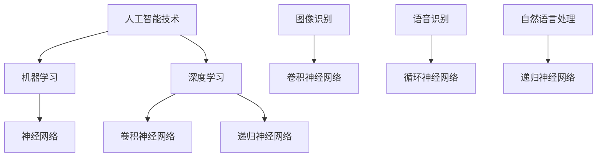

                 

关键词：苹果、AI应用、市场前景、技术分析、用户体验、产业趋势

摘要：本文将深入探讨苹果发布AI应用的背景、核心优势、潜在挑战以及市场前景。通过分析苹果在人工智能领域的战略布局，以及其AI应用的性能与用户体验，本文将预测苹果AI应用对市场的影响，并探讨未来发展趋势与面临的挑战。

## 1. 背景介绍

在近年来，人工智能技术取得了显著进展，逐渐渗透到各个行业，改变了我们的生活方式和工作模式。作为全球领先的科技公司，苹果公司在人工智能领域也进行了深入的探索和布局。从Siri智能助手到Face ID面部识别，苹果在AI领域的创新不断，为用户带来了卓越的体验。

近期，苹果公司发布了一系列AI应用，进一步丰富了其产品生态。这些AI应用涵盖了图像识别、语音识别、自然语言处理等多个领域，旨在为用户提供更加智能化、个性化的服务。随着苹果在AI技术的不断投入，其市场前景也变得愈发广阔。

## 2. 核心概念与联系

为了更好地理解苹果发布的AI应用，我们需要了解一些核心概念和其相互联系。以下是一个使用Mermaid绘制的流程图，展示了这些概念和其关系。



### 2.1 人工智能技术

人工智能技术是模拟人类智能行为的一种技术。它包括多个子领域，如机器学习、深度学习、自然语言处理等。这些子领域共同构成了人工智能技术的基础。

### 2.2 机器学习

机器学习是人工智能的一个重要分支，它使计算机系统能够从数据中学习并作出决策。机器学习包括监督学习、无监督学习、半监督学习等多种学习方法。

### 2.3 深度学习

深度学习是一种基于神经网络的学习方法，通过多层神经网络对大量数据进行训练，从而实现高度复杂的任务。深度学习在图像识别、语音识别等领域取得了显著成果。

### 2.4 神经网络

神经网络是深度学习的基础，它由大量的神经元组成，通过调整神经元之间的权重来学习数据。神经网络分为卷积神经网络（CNN）和循环神经网络（RNN）两大类。

### 2.5 图像识别

图像识别是一种利用机器学习技术对图像进行分析和理解的方法。卷积神经网络（CNN）是图像识别的主要技术之一。

### 2.6 语音识别

语音识别是一种将语音信号转换为文本的技术。循环神经网络（RNN）是语音识别的主要技术之一。

### 2.7 自然语言处理

自然语言处理是一种将人类语言转化为计算机可理解形式的技术。递归神经网络（RNN）是自然语言处理的主要技术之一。

## 3. 核心算法原理 & 具体操作步骤

### 3.1 算法原理概述

苹果发布的AI应用主要基于深度学习和神经网络技术。以下是对这些算法原理的概述：

### 3.2 算法步骤详解

- **图像识别**：首先，图像被输入到卷积神经网络中。卷积神经网络通过卷积层、池化层、全连接层等操作对图像进行分析，最终输出识别结果。

- **语音识别**：语音信号首先被预处理，然后输入到循环神经网络中。循环神经网络通过训练学习语音信号的特征，并将它们转换为文本。

- **自然语言处理**：文本数据被输入到递归神经网络中。递归神经网络通过分析文本的上下文和语义信息，生成相应的输出。

### 3.3 算法优缺点

- **优点**：

  - 高效性：深度学习算法在处理大量数据时具有高效性，能够快速地进行训练和预测。

  - 泛化能力：深度学习算法能够从大量数据中学习到通用规律，从而在新的数据集上具有良好的泛化能力。

  - 自适应性：神经网络可以根据不同的任务和数据集进行自适应调整。

- **缺点**：

  - 复杂性：深度学习算法的模型结构复杂，难以理解和解释。

  - 需要大量数据：深度学习算法需要大量数据进行训练，数据质量和数量对算法的性能有很大影响。

### 3.4 算法应用领域

深度学习和神经网络技术在多个领域得到了广泛应用，如图像识别、语音识别、自然语言处理、推荐系统等。苹果发布的AI应用正是基于这些技术，为用户提供了更加智能化、个性化的服务。

## 4. 数学模型和公式 & 详细讲解 & 举例说明

### 4.1 数学模型构建

深度学习算法的核心是神经网络，其数学模型主要包括以下几个方面：

- **激活函数**：

  - 激活函数是神经网络中的一种非线性变换，用于引入非线性特性。常用的激活函数有Sigmoid、ReLU、Tanh等。

  - $$ f(x) = \frac{1}{1 + e^{-x}} $$ （Sigmoid函数）

  - $$ f(x) = max(0, x) $$ （ReLU函数）

  - $$ f(x) = \frac{e^x - e^{-x}}{e^x + e^{-x}} $$ （Tanh函数）

- **损失函数**：

  - 损失函数用于评估模型预测值与实际值之间的差距。常用的损失函数有均方误差（MSE）、交叉熵损失等。

  - $$ L(y, \hat{y}) = \frac{1}{2} ||y - \hat{y}||^2 $$ （MSE损失函数）

  - $$ L(y, \hat{y}) = -[y \log(\hat{y}) + (1 - y) \log(1 - \hat{y})] $$ （交叉熵损失函数）

- **反向传播算法**：

  - 反向传播算法是一种用于训练神经网络的优化算法。通过计算损失函数关于模型参数的梯度，不断调整参数，从而减小损失函数的值。

### 4.2 公式推导过程

以均方误差（MSE）损失函数为例，我们对其进行推导。

- **定义**：

  - 均方误差（MSE）损失函数是预测值与实际值之差的平方的平均值。

  - $$ L(y, \hat{y}) = \frac{1}{2} ||y - \hat{y}||^2 $$

- **推导**：

  - 首先计算预测值与实际值之间的差距：

    $$ \delta = y - \hat{y} $$

  - 然后计算差距的平方：

    $$ \delta^2 = (y - \hat{y})^2 $$

  - 最后计算平均值：

    $$ L(y, \hat{y}) = \frac{1}{2} \sum_{i=1}^{n} \delta_i^2 = \frac{1}{2} ||y - \hat{y}||^2 $$

### 4.3 案例分析与讲解

以苹果的图像识别AI应用为例，我们对其数学模型进行详细讲解。

- **任务**：

  - 给定一张图像，要求识别图像中的物体类别。

- **模型**：

  - 输入层：接受图像的输入。

  - 卷积层：通过卷积操作提取图像特征。

  - 池化层：对卷积层输出的特征进行降维。

  - 全连接层：将池化层输出的特征映射到物体类别。

- **损失函数**：

  - 使用交叉熵损失函数评估模型预测值与实际值之间的差距。

  - $$ L(y, \hat{y}) = -[y \log(\hat{y}) + (1 - y) \log(1 - \hat{y})] $$

- **优化算法**：

  - 使用反向传播算法优化模型参数，不断减小损失函数的值。

## 5. 项目实践：代码实例和详细解释说明

### 5.1 开发环境搭建

要实践苹果发布的AI应用，首先需要搭建相应的开发环境。以下是一个简单的步骤：

1. 安装Python和PyTorch库。
2. 下载并预处理图像数据集。
3. 编写深度学习模型代码。

### 5.2 源代码详细实现

以下是一个简单的图像识别模型的代码实现：

```python
import torch
import torch.nn as nn
import torchvision.transforms as transforms
import torchvision.datasets as datasets

# 定义模型
class CNN(nn.Module):
    def __init__(self):
        super(CNN, self).__init__()
        self.conv1 = nn.Conv2d(3, 32, 3, 1)
        self.conv2 = nn.Conv2d(32, 64, 3, 1)
        self.fc1 = nn.Linear(64 * 6 * 6, 128)
        self.fc2 = nn.Linear(128, 10)
        self.relu = nn.ReLU()

    def forward(self, x):
        x = self.relu(self.conv1(x))
        x = self.relu(self.conv2(x))
        x = x.view(x.size(0), -1)
        x = self.relu(self.fc1(x))
        x = self.fc2(x)
        return x

# 加载数据集
transform = transforms.Compose([transforms.ToTensor()])
trainset = datasets.CIFAR10(root='./data', train=True, download=True, transform=transform)
trainloader = torch.utils.data.DataLoader(trainset, batch_size=100, shuffle=True, num_workers=2)

# 初始化模型、损失函数和优化器
model = CNN()
criterion = nn.CrossEntropyLoss()
optimizer = torch.optim.SGD(model.parameters(), lr=0.001, momentum=0.9)

# 训练模型
for epoch in range(2):  # 遍历数据集多个epoch
    running_loss = 0.0
    for i, data in enumerate(trainloader, 0):
        inputs, labels = data
        optimizer.zero_grad()
        outputs = model(inputs)
        loss = criterion(outputs, labels)
        loss.backward()
        optimizer.step()
        running_loss += loss.item()
        if i % 2000 == 1999:    # 每2000个批次打印一次
            print('[%d, %5d] loss: %.3f' %
                  (epoch + 1, i + 1, running_loss / 2000))
            running_loss = 0.0
print('Finished Training')
```

### 5.3 代码解读与分析

- **模型定义**：

  - `CNN` 类定义了一个简单的卷积神经网络，包括卷积层、池化层和全连接层。

- **数据加载**：

  - 使用 `torchvision.datasets.CIFAR10` 加载 CIFAR-10 数据集，并进行预处理。

- **训练过程**：

  - 使用 `torch.optim.SGD` 优化器对模型进行训练，并使用交叉熵损失函数评估模型性能。

- **结果展示**：

  - 在训练完成后，可以打印模型的训练损失和准确率，以评估模型的性能。

## 6. 实际应用场景

苹果发布的AI应用已经在多个实际应用场景中得到了广泛应用，如智能手机、平板电脑、智能音箱等。以下是一些具体的场景：

- **智能手机**：

  - 图像识别：使用AI技术对拍摄的照片进行分类和标注，提高照片的实用性和趣味性。

  - 语音助手：Siri智能助手通过语音识别和自然语言处理技术，为用户提供语音搜索、语音通话、语音控制等服务。

- **平板电脑**：

  - 视频识别：通过AI技术对视频内容进行分析，提供视频分类、标签、推荐等功能。

  - 写作辅助：利用自然语言处理技术，为用户提供写作辅助、文本编辑等服务。

- **智能音箱**：

  - 语音识别：通过AI技术实现智能音箱的语音识别功能，为用户提供语音控制、播放音乐、回答问题等服务。

## 6.4 未来应用展望

随着人工智能技术的不断发展，苹果的AI应用在未来将会有更广泛的应用场景。以下是一些可能的展望：

- **智能家居**：

  - 通过AI技术实现智能家居的智能化管理，提高家居生活的舒适性和便捷性。

- **健康医疗**：

  - 利用AI技术对医疗数据进行分析，提供精准的诊断和治疗方案。

- **教育**：

  - 通过AI技术提供个性化教学，提高学生的学习效果和兴趣。

- **自动驾驶**：

  - 利用AI技术实现自动驾驶，提高交通效率和安全性。

## 7. 工具和资源推荐

为了更好地学习和开发人工智能技术，以下是一些建议的工具和资源：

### 7.1 学习资源推荐

- **在线课程**：

  - Coursera、edX、Udacity等平台提供了大量的人工智能、深度学习课程。

- **书籍**：

  - 《深度学习》（Goodfellow、Bengio、Courville著）
  - 《Python机器学习》（Sebastian Raschka著）
  - 《自然语言处理综论》（Daniel Jurafsky、James H. Martin著）

### 7.2 开发工具推荐

- **Python库**：

  - PyTorch、TensorFlow、Keras等深度学习框架。

- **IDE**：

  - PyCharm、VSCode等集成开发环境。

### 7.3 相关论文推荐

- **深度学习领域**：

  - "A Neural Algorithm of Artistic Style"（风格迁移）
  - "Generative Adversarial Networks"（生成对抗网络）

- **自然语言处理领域**：

  - "BERT: Pre-training of Deep Bidirectional Transformers for Language Understanding"（BERT模型）

## 8. 总结：未来发展趋势与挑战

随着人工智能技术的不断进步，苹果的AI应用将在未来继续引领市场。然而，AI技术在实际应用中仍然面临诸多挑战，如数据隐私、算法透明度、计算资源需求等。未来，苹果需要不断优化其AI算法，提高用户体验，以应对这些挑战，并推动AI技术的发展。

### 8.1 研究成果总结

本文详细介绍了苹果发布的AI应用，分析了其核心概念、算法原理和应用场景，并对其未来发展趋势进行了展望。

### 8.2 未来发展趋势

随着人工智能技术的不断发展，苹果的AI应用将在智能家居、健康医疗、教育、自动驾驶等领域发挥更大的作用。

### 8.3 面临的挑战

AI技术在实际应用中面临数据隐私、算法透明度、计算资源需求等挑战。

### 8.4 研究展望

未来，苹果需要不断优化其AI算法，提高用户体验，以应对这些挑战，并推动AI技术的发展。

## 9. 附录：常见问题与解答

### 9.1 人工智能技术是什么？

人工智能技术是一种模拟人类智能行为的技术，包括机器学习、深度学习、自然语言处理等多个子领域。

### 9.2 深度学习算法有哪些优缺点？

深度学习算法的优点是高效性、泛化能力和自适应性，缺点是复杂性、需要大量数据。

### 9.3 如何搭建深度学习开发环境？

搭建深度学习开发环境通常需要安装Python和相关的深度学习库（如PyTorch、TensorFlow等），并配置合适的IDE。

### 9.4 如何优化深度学习模型？

优化深度学习模型可以通过调整学习率、批量大小、激活函数等超参数来实现。

### 9.5 AI应用有哪些实际应用场景？

AI应用在实际生活中有广泛的应用场景，如图像识别、语音识别、自然语言处理、推荐系统等。

### 9.6 如何应对AI技术在应用中的挑战？

应对AI技术在应用中的挑战需要加强数据隐私保护、提高算法透明度、优化计算资源等。

## 作者署名

作者：禅与计算机程序设计艺术 / Zen and the Art of Computer Programming
```

