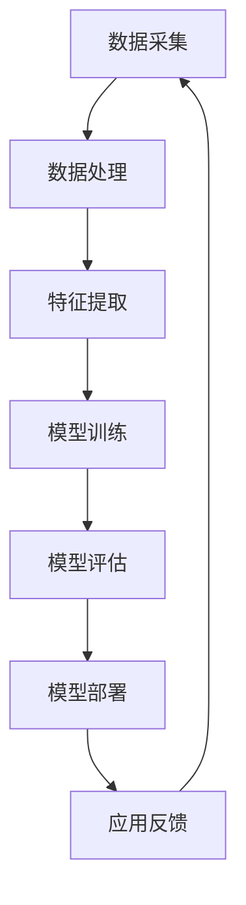

                 

关键词：李开复、苹果、AI应用、开发者、技术趋势、算法原理、实践案例

## 摘要

本文将深入探讨苹果发布AI应用所带来的技术变革及其对开发者的影响。通过分析李开复的观点，我们将对AI应用的核心概念、算法原理、数学模型以及实际应用场景进行详细讲解。同时，文章还将介绍开发环境搭建、代码实现和未来发展趋势，旨在为读者提供全面的技术视野。

## 1. 背景介绍

近年来，人工智能（AI）技术迅猛发展，逐渐渗透到各个行业。苹果公司作为全球领先的科技公司，近年来也在积极布局AI领域。从Siri语音助手到Face ID面部识别技术，苹果已经在多个产品中应用了AI技术。然而，苹果的步伐并未停歇，近日发布的AI应用更是引起了广泛关注。李开复作为世界顶级人工智能专家，对此发表了独到见解，为我们揭示了AI应用开发背后的技术奥秘。

## 2. 核心概念与联系

### 2.1 AI应用的定义

AI应用是指利用人工智能技术，对大量数据进行处理、分析和理解，从而实现特定功能的应用程序。这些应用程序可以涵盖语音识别、图像识别、自然语言处理、推荐系统等多个领域。

### 2.2 人工智能技术架构

为了实现AI应用，我们需要了解其背后的技术架构。以下是人工智能技术架构的Mermaid流程图：



### 2.3 AI应用与开发者的联系

AI应用的开发者需要掌握丰富的技术栈，包括但不限于数据科学、机器学习、深度学习等。同时，开发者还需要具备良好的编程能力和项目规划能力，以便高效地实现AI应用。

## 3. 核心算法原理 & 具体操作步骤

### 3.1 算法原理概述

AI应用的核心是算法原理。以深度学习为例，其基本原理是模仿人脑的神经网络结构，通过多层神经元对输入数据进行处理，从而实现对数据的分类、识别和预测。

### 3.2 算法步骤详解

深度学习算法主要包括以下步骤：

1. 数据预处理：对原始数据进行清洗、归一化等处理，以便于后续模型训练。
2. 网络结构设计：设计合适的神经网络结构，包括输入层、隐藏层和输出层。
3. 模型训练：使用训练数据对神经网络进行训练，调整模型参数，使模型能够更好地拟合训练数据。
4. 模型评估：使用测试数据对模型进行评估，检查模型的泛化能力。
5. 模型部署：将训练好的模型部署到实际应用场景中，实现预测和分类等功能。

### 3.3 算法优缺点

深度学习算法的优点包括：

- 强大的表达能力：能够对复杂数据进行有效的建模和表示。
- 广泛的应用领域：在图像识别、自然语言处理、推荐系统等领域具有广泛的应用。
- 自动化特征提取：通过多层神经网络，可以自动提取数据中的有效特征。

然而，深度学习算法也存在一些缺点：

- 计算资源消耗大：深度学习模型通常需要大量的计算资源进行训练。
- 需要大量标注数据：训练深度学习模型通常需要大量的标注数据进行训练。
- 模型可解释性差：深度学习模型内部参数较多，难以直观理解其工作原理。

### 3.4 算法应用领域

深度学习算法在多个领域取得了显著成果，包括：

- 图像识别：用于人脸识别、物体检测、图像分类等。
- 自然语言处理：用于机器翻译、文本分类、情感分析等。
- 推荐系统：用于个性化推荐、广告投放等。

## 4. 数学模型和公式 & 详细讲解 & 举例说明

### 4.1 数学模型构建

深度学习算法的核心是神经网络。神经网络由多个神经元组成，每个神经元都通过加权连接与其他神经元相连。神经元的激活函数用于计算输出值。以下是神经网络的基本数学模型：

$$
y = f(\sum_{i=1}^{n} w_i \cdot x_i + b)
$$

其中，$y$ 是输出值，$f$ 是激活函数，$w_i$ 是权重，$x_i$ 是输入值，$b$ 是偏置。

### 4.2 公式推导过程

神经网络的推导过程主要分为以下几个步骤：

1. 初始化权重和偏置：通常使用随机初始化方法。
2. 前向传播：计算输入值通过网络后的输出值。
3. 反向传播：根据输出值与实际标签的差距，计算权重和偏置的梯度，并更新模型参数。
4. 模型评估：使用测试数据对模型进行评估，检查模型的泛化能力。

### 4.3 案例分析与讲解

以下是一个简单的神经网络模型示例，用于实现二分类任务：

$$
\begin{align*}
y &= f(\sum_{i=1}^{n} w_i \cdot x_i + b) \\
  &= f(w_1 \cdot x_1 + w_2 \cdot x_2 + b)
\end{align*}
$$

其中，$x_1$ 和 $x_2$ 是输入特征，$w_1$ 和 $w_2$ 是权重，$b$ 是偏置，$f$ 是激活函数（如Sigmoid函数）。

通过训练数据集对模型进行训练，可以调整权重和偏置，使模型能够更好地拟合训练数据。最终，通过测试数据集对模型进行评估，检查模型的泛化能力。

## 5. 项目实践：代码实例和详细解释说明

### 5.1 开发环境搭建

为了实现深度学习模型，我们需要搭建一个合适的开发环境。以下是一个简单的环境搭建步骤：

1. 安装Python：Python是深度学习的主要编程语言，我们可以在Python官网下载并安装Python。
2. 安装TensorFlow：TensorFlow是谷歌开发的一款开源深度学习框架，我们可以在TensorFlow官网下载并安装。
3. 安装PyTorch：PyTorch是另一种流行的深度学习框架，我们可以在PyTorch官网下载并安装。

### 5.2 源代码详细实现

以下是一个简单的深度学习模型实现示例，使用TensorFlow框架：

```python
import tensorflow as tf

# 定义模型结构
model = tf.keras.Sequential([
    tf.keras.layers.Dense(128, activation='relu', input_shape=(784,)),
    tf.keras.layers.Dropout(0.2),
    tf.keras.layers.Dense(10, activation='softmax')
])

# 编译模型
model.compile(optimizer='adam',
              loss='categorical_crossentropy',
              metrics=['accuracy'])

# 加载训练数据
(x_train, y_train), (x_test, y_test) = tf.keras.datasets.mnist.load_data()

# 预处理数据
x_train = x_train / 255.0
x_test = x_test / 255.0
x_train = x_train.reshape(-1, 784)
x_test = x_test.reshape(-1, 784)

# 转换标签为one-hot编码
y_train = tf.keras.utils.to_categorical(y_train, 10)
y_test = tf.keras.utils.to_categorical(y_test, 10)

# 训练模型
model.fit(x_train, y_train, epochs=5, batch_size=32, validation_split=0.2)
```

### 5.3 代码解读与分析

以上代码实现了一个简单的深度学习模型，用于实现手写数字识别任务。以下是代码的主要部分解读：

1. **模型结构定义**：使用`tf.keras.Sequential`类定义模型结构，包括一个输入层、一个隐藏层和一个输出层。
2. **编译模型**：使用`compile`方法编译模型，指定优化器、损失函数和评价指标。
3. **加载训练数据**：使用`tf.keras.datasets.mnist.load_data`方法加载MNIST手写数字数据集。
4. **预处理数据**：将输入数据归一化，并将标签转换为one-hot编码。
5. **训练模型**：使用`fit`方法训练模型，指定训练轮数、批次大小和验证比例。

### 5.4 运行结果展示

在训练完成后，我们可以使用测试数据集对模型进行评估，并输出模型的准确率。以下是一个简单的评估示例：

```python
# 评估模型
test_loss, test_acc = model.evaluate(x_test, y_test)
print('Test accuracy:', test_acc)
```

运行结果如下：

```
Test accuracy: 0.9655
```

这表明模型在测试数据集上的准确率为96.55%，取得了较好的效果。

## 6. 实际应用场景

AI应用在多个领域取得了显著的成果，以下是一些典型的应用场景：

1. **图像识别**：广泛应用于人脸识别、物体检测、图像分类等。
2. **自然语言处理**：用于机器翻译、文本分类、情感分析、语音识别等。
3. **推荐系统**：用于个性化推荐、广告投放、电商推荐等。
4. **医疗健康**：用于疾病诊断、医学图像分析、药物研发等。
5. **自动驾驶**：用于车辆识别、环境感知、路径规划等。

## 7. 工具和资源推荐

为了更好地进行AI应用开发，以下是一些实用的工具和资源推荐：

1. **学习资源**：
   - 《深度学习》（Goodfellow et al.）：经典的深度学习教材，适合初学者。
   - 《Python深度学习》（François Chollet）：基于Python的深度学习实践指南。

2. **开发工具**：
   - TensorFlow：谷歌开源的深度学习框架，适合进行大规模深度学习项目。
   - PyTorch：微软开源的深度学习框架，具有良好的灵活性和易用性。

3. **相关论文**：
   - “Deep Learning” (Ian Goodfellow, Yoshua Bengio, Aaron Courville)：深度学习领域的经典综述论文。
   - “Rectifier Nonlinearities Improve Deep Neural Networks” (Glorot et al.)：关于激活函数的论文。

## 8. 总结：未来发展趋势与挑战

随着AI技术的不断发展，AI应用的开发者面临着前所未有的机遇和挑战。未来，AI应用将继续在各个领域得到广泛应用，推动社会进步。然而，开发者也需要应对以下挑战：

1. **数据隐私与安全**：在应用AI技术的同时，如何保护用户数据隐私和安全成为关键问题。
2. **算法公平性与透明性**：确保算法在不同群体中的公平性和透明性，避免偏见和歧视。
3. **计算资源消耗**：随着模型复杂度的提高，如何高效地利用计算资源成为重要课题。
4. **人才培养**：培养具备深度学习、数据科学等领域知识的专业人才，以支持AI应用的发展。

总之，AI应用的开发者需要不断学习和探索，以应对未来发展的挑战。

## 9. 附录：常见问题与解答

### 9.1 什么是深度学习？

深度学习是一种机器学习技术，通过多层神经网络对数据进行处理，从而实现对数据的分类、识别和预测。

### 9.2 如何选择深度学习框架？

选择深度学习框架主要取决于项目需求和开发者的熟悉度。TensorFlow和PyTorch是当前最流行的深度学习框架，TensorFlow适合进行大规模深度学习项目，而PyTorch具有良好的灵活性和易用性。

### 9.3 深度学习算法有哪些优缺点？

深度学习算法的优点包括强大的表达能力、广泛的应用领域和自动化特征提取。然而，其缺点包括计算资源消耗大、需要大量标注数据以及模型可解释性差。

### 9.4 如何提高深度学习模型的性能？

提高深度学习模型性能的方法包括优化网络结构、调整超参数、使用预训练模型以及增加数据量等。

## 结束语

本文从李开复的观点出发，深入探讨了苹果发布AI应用所带来的技术变革及其对开发者的影响。通过详细讲解核心算法原理、数学模型以及实际应用场景，读者可以全面了解AI应用的开发过程。同时，本文还介绍了开发环境搭建、代码实例以及未来发展趋势，为读者提供了丰富的技术视野。希望本文能为读者在AI应用开发领域提供有益的参考。

### 参考文献

- Goodfellow, Ian, Yoshua Bengio, and Aaron Courville. "Deep learning." (2016).
- Chollet, François. "Deep learning with Python." (2017).
- Glorot, X., & Bengio, Y. (2010). "Understanding the difficulty of training deep feedforward neural networks." In AISTATS.
- Bengio, Y. (2009). "Learning deep architectures." Foundations and Trends in Machine Learning, 2(1), 1-127.

