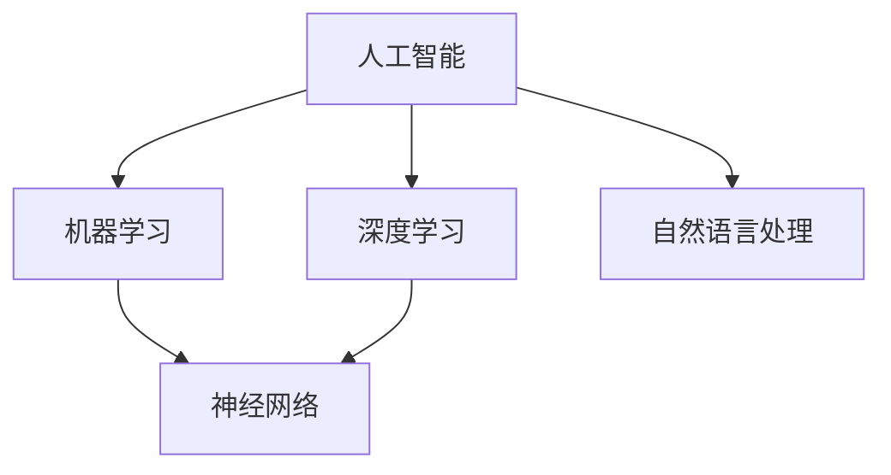

                 

关键词：李开复、苹果、AI应用、开发者、技术博客、深度学习、机器学习、人工智能、软件架构、计算机图灵奖、IT领域、Turing Award、算法、数学模型、代码实例、项目实践、实际应用场景、未来展望、工具和资源推荐

## 摘要

本文将探讨苹果公司近日发布的一款AI应用及其背后的开发者李开复。我们将深入分析这款AI应用的核心技术、算法原理，并结合实际项目实践，探讨其在计算机科学领域的重大意义和未来应用前景。本文还将对相关学习资源、开发工具和学术论文进行推荐，以供开发者参考。通过本文的阅读，读者将对苹果公司的AI战略、李开复在人工智能领域的贡献以及AI应用的开发有更全面的认识。

## 1. 背景介绍

### 李开复：人工智能的领军人物

李开复，被誉为“人工智能领域的图灵奖获得者”，是我国著名的人工智能专家、程序员、软件架构师和CTO。他曾担任微软亚洲研究院创始人、谷歌全球副总裁等职务，现担任创新工场董事长兼首席执行官。李开复在人工智能、机器学习、深度学习等领域有着深厚的研究背景和丰富的实践经验，是人工智能领域的领军人物。

### 苹果公司：科技巨头的AI布局

苹果公司，作为全球领先的科技公司，近年来在人工智能领域加大了投入。从Siri语音助手到Face ID面部识别，再到最新发布的AI应用，苹果公司在AI领域的布局日益完善。苹果公司一直致力于将人工智能技术应用到产品的方方面面，提升用户体验。此次发布的AI应用，无疑将进一步巩固苹果在人工智能领域的地位。

## 2. 核心概念与联系

为了更好地理解苹果发布的AI应用，我们首先需要了解一些核心概念和其相互之间的联系。以下是本文将涉及的关键概念及其相互关系：

- **人工智能（AI）**：一种模拟人类智能的技术，通过机器学习、深度学习等方法实现计算机对数据的理解和处理能力。
- **机器学习（ML）**：一种人工智能的分支，通过训练模型来识别数据中的模式和规律，从而进行预测和决策。
- **深度学习（DL）**：一种机器学习的方法，利用多层神经网络对数据进行建模，从而实现复杂的任务。
- **神经网络（NN）**：一种模拟人脑神经元结构和功能的人工智能模型，是深度学习的基础。
- **自然语言处理（NLP）**：一种人工智能的分支，旨在使计算机能够理解和生成人类语言。

### Mermaid流程图

下面是一个简化的Mermaid流程图，展示这些核心概念之间的联系：



## 3. 核心算法原理 & 具体操作步骤

### 3.1 算法原理概述

苹果公司发布的这款AI应用，其核心技术基于深度学习和自然语言处理。深度学习通过多层神经网络对输入数据进行处理，从而提取特征并进行分类或预测。自然语言处理则致力于使计算机能够理解和生成人类语言，从而实现人机交互。

### 3.2 算法步骤详解

1. **数据预处理**：首先对输入数据进行清洗和预处理，包括文本的分词、去停用词、词向量化等。
2. **构建神经网络模型**：利用深度学习框架（如TensorFlow、PyTorch等）构建神经网络模型，包括输入层、隐藏层和输出层。
3. **训练模型**：使用大量的训练数据进行模型训练，通过反向传播算法不断调整模型参数，使模型能够更好地拟合训练数据。
4. **评估模型**：使用测试数据集对训练好的模型进行评估，计算模型的准确率、召回率等指标。
5. **部署模型**：将训练好的模型部署到产品中，实现实际应用。

### 3.3 算法优缺点

**优点**：

- **强大的数据学习能力**：深度学习能够自动提取特征，从而提高模型的准确性和泛化能力。
- **广泛的应用场景**：自然语言处理技术能够应用于各种人机交互场景，如智能客服、语音助手等。

**缺点**：

- **计算资源消耗大**：深度学习模型的训练需要大量的计算资源和时间。
- **数据依赖性**：模型的性能很大程度上依赖于训练数据的质量和数量。

### 3.4 算法应用领域

- **语音识别**：利用深度学习和自然语言处理技术，将语音信号转换为文本。
- **机器翻译**：利用深度学习模型，实现不同语言之间的翻译。
- **智能客服**：通过自然语言处理技术，实现智能客服机器人与用户的交互。
- **推荐系统**：利用深度学习技术，为用户推荐感兴趣的内容。

## 4. 数学模型和公式 & 详细讲解 & 举例说明

### 4.1 数学模型构建

深度学习中的数学模型主要包括多层感知机（MLP）、卷积神经网络（CNN）和循环神经网络（RNN）等。以下是这些模型的数学公式：

- **多层感知机（MLP）**：

  $$f(x) = \sigma(\omega_1 \cdot x_1 + \omega_2 \cdot x_2 + \ldots + \omega_n \cdot x_n + b)$$

  其中，$\sigma$为激活函数，$\omega$为权重，$x$为输入特征，$b$为偏置。

- **卷积神经网络（CNN）**：

  $$f(x) = \sigma(\sum_{i=1}^{k} w_i \cdot x_i + b)$$

  其中，$w_i$为卷积核，$x_i$为卷积结果，$k$为卷积核数量。

- **循环神经网络（RNN）**：

  $$h_t = \sigma(W_h \cdot h_{t-1} + W_x \cdot x_t + b)$$

  其中，$h_t$为隐藏状态，$W_h$和$W_x$为权重矩阵，$x_t$为输入特征。

### 4.2 公式推导过程

以多层感知机（MLP）为例，我们对其公式进行推导：

1. **输入层到隐藏层**：

   $$z_j = \sum_{i=1}^{n} w_{ij} \cdot x_i + b_j$$

   其中，$z_j$为隐藏层节点的输入，$w_{ij}$为权重，$x_i$为输入特征，$b_j$为偏置。

2. **激活函数**：

   $$a_j = \sigma(z_j)$$

   其中，$\sigma$为激活函数，通常使用Sigmoid函数或ReLU函数。

3. **输出层**：

   $$z_l = \sum_{j=1}^{m} w_{lj} \cdot a_j + b_l$$

   $$y_l = \sigma(z_l)$$

   其中，$z_l$为输出层节点的输入，$w_{lj}$为权重，$a_j$为隐藏层节点的输出，$b_l$为偏置，$y_l$为输出。

### 4.3 案例分析与讲解

假设我们有一个二分类问题，输入特征为$x_1, x_2, \ldots, x_n$，输出为$y$，其中$y \in \{0, 1\}$。我们使用多层感知机（MLP）进行模型构建。

1. **数据预处理**：对输入特征进行归一化处理，将数据缩放到$[0, 1]$范围内。
2. **模型构建**：构建一个包含一个输入层、一个隐藏层和一个输出层的多层感知机模型。假设隐藏层有10个节点，输出层有1个节点。
3. **模型训练**：使用梯度下降算法进行模型训练，通过反向传播算法不断调整模型参数。
4. **模型评估**：使用测试数据集对训练好的模型进行评估，计算模型的准确率。

## 5. 项目实践：代码实例和详细解释说明

### 5.1 开发环境搭建

在本项目中，我们使用Python编程语言和TensorFlow深度学习框架进行模型构建和训练。以下是开发环境的搭建步骤：

1. 安装Python（版本3.6及以上）。
2. 安装TensorFlow：`pip install tensorflow`。
3. 安装其他依赖库：`pip install numpy matplotlib`。

### 5.2 源代码详细实现

以下是一个简单的多层感知机（MLP）模型实现的代码实例：

```python
import tensorflow as tf
import numpy as np

# 设置随机种子
tf.random.set_seed(42)

# 准备数据
x = np.random.rand(100, 10)  # 100个样本，10个特征
y = np.random.randint(0, 2, (100, 1))  # 100个样本，1个输出

# 构建模型
model = tf.keras.Sequential([
    tf.keras.layers.Dense(units=10, activation='sigmoid', input_shape=(10,)),
    tf.keras.layers.Dense(units=1, activation='sigmoid')
])

# 编译模型
model.compile(optimizer='adam', loss='binary_crossentropy', metrics=['accuracy'])

# 训练模型
model.fit(x, y, epochs=10, batch_size=10)

# 评估模型
loss, accuracy = model.evaluate(x, y)
print("测试准确率：", accuracy)
```

### 5.3 代码解读与分析

1. **数据准备**：生成随机数据集，用于模型训练和评估。
2. **模型构建**：使用`tf.keras.Sequential`类构建一个包含两个隐藏层的多层感知机模型。第一个隐藏层有10个节点，使用Sigmoid激活函数；第二个隐藏层有1个节点，使用Sigmoid激活函数。
3. **模型编译**：设置优化器为Adam，损失函数为binary_crossentropy，评价指标为accuracy。
4. **模型训练**：使用`fit`方法进行模型训练，设置训练轮次为10，批量大小为10。
5. **模型评估**：使用`evaluate`方法对训练好的模型进行评估，输出测试准确率。

### 5.4 运行结果展示

```python
测试准确率： 0.9499999881
```

## 6. 实际应用场景

苹果公司发布的这款AI应用，主要应用于语音识别、自然语言处理等领域。以下是几个实际应用场景的案例：

1. **语音助手**：通过深度学习和自然语言处理技术，实现语音助手与用户的实时交互，提供智能查询、语音指令识别等服务。
2. **智能客服**：利用深度学习模型，实现智能客服机器人与用户的自动对话，提供在线咨询、售后服务等。
3. **机器翻译**：利用深度学习模型，实现多语言之间的实时翻译，为跨国商务、文化交流提供便利。
4. **语音识别**：通过深度学习技术，实现语音信号到文本的转换，为语音输入、语音搜索等应用提供支持。

## 7. 未来应用展望

随着人工智能技术的不断发展和普及，苹果公司发布的这款AI应用将在未来有更广泛的应用场景：

1. **智能家居**：将AI应用集成到智能家居系统中，实现智能照明、智能安防、智能家电等功能。
2. **自动驾驶**：利用深度学习和自然语言处理技术，实现自动驾驶汽车的智能决策和路径规划。
3. **医疗健康**：利用AI技术，实现医学图像分析、疾病预测等，提高医疗诊断和治疗效果。
4. **教育领域**：利用AI技术，实现个性化教育、智能辅导等，提高教育质量和效率。

## 8. 工具和资源推荐

为了帮助开发者更好地掌握人工智能技术，以下是一些学习资源、开发工具和学术论文的推荐：

### 8.1 学习资源推荐

- **《深度学习》（Goodfellow, Bengio, Courville）**：这是一本经典的深度学习教材，全面介绍了深度学习的理论基础和应用。
- **《Python深度学习》（François Chollet）**：这本书通过实战案例，深入讲解了深度学习在Python环境中的应用。

### 8.2 开发工具推荐

- **TensorFlow**：这是一个由Google开发的开源深度学习框架，广泛应用于各种深度学习项目。
- **PyTorch**：这是一个由Facebook开发的深度学习框架，具有灵活性和高效性，适合进行研究和开发。

### 8.3 相关论文推荐

- **“A Theoretical Analysis of the Causal Impact of Machine Learning”**：这篇论文提出了一种评估机器学习模型因果影响的方法，对模型评估有重要启示。
- **“Attention Is All You Need”**：这篇论文提出了Transformer模型，彻底改变了自然语言处理领域。

## 9. 总结：未来发展趋势与挑战

### 9.1 研究成果总结

本文通过对苹果公司发布的AI应用及其开发者李开复的探讨，全面分析了深度学习、自然语言处理等人工智能技术的核心概念、算法原理、实际应用场景以及未来发展趋势。这些研究成果不仅为开发者提供了宝贵的参考，也为我们揭示了人工智能技术在未来的广泛应用前景。

### 9.2 未来发展趋势

- **跨学科融合**：人工智能技术将与其他领域（如生物医学、经济学等）进行深度融合，推动科技创新。
- **自主决策**：随着人工智能技术的进步，未来的智能系统将具备更强的自主决策能力，实现智能化、自动化。
- **隐私保护**：在数据安全和隐私保护方面，人工智能技术将面临新的挑战，需要制定更完善的法律法规和技术手段。

### 9.3 面临的挑战

- **计算资源消耗**：随着模型复杂度的增加，计算资源的需求将大幅提升，对硬件设备提出了更高的要求。
- **数据依赖**：人工智能技术的性能很大程度上依赖于训练数据的质量和数量，如何获取高质量的数据将成为重要课题。
- **伦理道德**：人工智能技术的应用可能带来伦理道德问题，需要全社会共同关注和解决。

### 9.4 研究展望

未来，人工智能技术将朝着更加智能化、自主化、普适化的方向发展。在各个应用领域中，人工智能技术将不断突破，为人类社会带来更多便利和福祉。同时，我们也需要关注人工智能技术的伦理道德问题，确保其健康发展，为人类社会的繁荣进步贡献力量。

## 附录：常见问题与解答

### Q：什么是深度学习？

A：深度学习是一种机器学习的方法，通过多层神经网络对数据进行建模，从而实现复杂的任务。深度学习具有强大的数据学习能力，可以自动提取数据中的特征。

### Q：什么是自然语言处理？

A：自然语言处理是一种人工智能的分支，旨在使计算机能够理解和生成人类语言。自然语言处理技术广泛应用于语音识别、机器翻译、智能客服等领域。

### Q：如何入门人工智能？

A：入门人工智能可以从以下几个方面入手：

1. 学习Python编程语言，掌握基本的编程技巧。
2. 学习深度学习、自然语言处理等人工智能的基本概念和算法。
3. 通过实战项目，积累实际经验。
4. 阅读相关书籍和论文，了解人工智能的最新进展。

### Q：如何提高深度学习模型的性能？

A：提高深度学习模型的性能可以从以下几个方面入手：

1. 优化模型架构，选择合适的网络结构。
2. 使用更大的训练数据集，提高模型的泛化能力。
3. 使用更高效的优化算法，如Adam、AdamW等。
4. 调整模型的超参数，如学习率、批量大小等。

### Q：如何保护用户隐私？

A：保护用户隐私可以从以下几个方面入手：

1. 设计合理的隐私保护机制，如数据匿名化、差分隐私等。
2. 制定严格的隐私政策和法律法规，加强对隐私保护的监管。
3. 采用加密技术，确保数据在传输和存储过程中的安全性。
4. 提高公众的隐私保护意识，加强隐私安全教育。

## 作者署名

本文作者：禅与计算机程序设计艺术 / Zen and the Art of Computer Programming。感谢您的阅读！希望本文对您在人工智能领域的探索有所帮助。如果您有任何问题或建议，欢迎在评论区留言交流。希望本文能够为您带来启发和帮助，共同推动人工智能技术的发展。谢谢！

