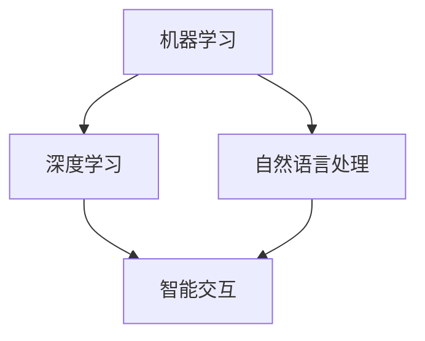

                 

关键词：苹果、AI应用、技术趋势、人工智能、用户体验

> 摘要：本文将深入探讨苹果公司发布AI应用的重大意义，从技术进步、用户体验、产业变革等多个维度进行分析，并展望未来人工智能的发展趋势。

## 1. 背景介绍

近年来，人工智能（AI）技术取得了飞速发展，成为全球科技领域的热门话题。从深度学习到自然语言处理，从图像识别到自动驾驶，AI技术的应用已经深入到我们生活的方方面面。在这样的背景下，苹果公司发布了多个AI应用，标志着其在人工智能领域的重大布局。

苹果公司在人工智能领域的布局并非一时兴起，而是有其深远的意义。首先，AI技术可以显著提升苹果产品的用户体验，使其更加智能、个性化。其次，通过AI技术，苹果公司可以拓展新的业务领域，提升其市场竞争力。此外，苹果公司在AI领域的创新也推动了整个科技行业的进步，为其他企业提供了参考和启示。

## 2. 核心概念与联系

### 2.1 AI应用的核心概念

AI应用的核心概念主要包括机器学习、深度学习、自然语言处理等。其中，机器学习是一种通过数据和算法使计算机具备学习能力的技术。深度学习是机器学习的一种重要分支，通过模拟人脑神经网络的结构和功能，实现复杂模式的识别和学习。自然语言处理则是使计算机能够理解和处理人类自然语言的技术。

### 2.2 核心概念之间的联系

这些核心概念之间有着密切的联系。首先，机器学习和深度学习是AI应用的基础，为AI系统的训练和优化提供了理论支持。其次，自然语言处理技术可以使AI系统更好地理解和处理人类语言，从而实现更加智能化的交互。

### 2.3 Mermaid流程图



在这个流程图中，机器学习和深度学习作为AI应用的基础，通过自然语言处理技术，最终实现智能交互，提升用户体验。

## 3. 核心算法原理 & 具体操作步骤

### 3.1 算法原理概述

苹果公司在AI应用中采用了多种核心算法，包括神经网络、决策树、支持向量机等。这些算法通过模型训练和优化，使AI系统能够对输入的数据进行分析和预测。

### 3.2 算法步骤详解

1. **数据收集**：首先，需要收集大量的数据，作为算法训练的基础。
2. **数据预处理**：对收集到的数据进行清洗、归一化等预处理操作，以提高数据质量。
3. **模型训练**：利用预处理后的数据，通过算法进行模型训练，使模型能够对数据进行分析和预测。
4. **模型优化**：通过调整模型参数，优化模型性能。
5. **模型部署**：将训练好的模型部署到实际应用中，进行实际运行和测试。

### 3.3 算法优缺点

每种算法都有其优缺点。例如，神经网络具有强大的学习能力，但计算复杂度较高；决策树易于理解，但容易过拟合；支持向量机在处理高维数据时表现较好，但难以处理非线性的数据。

### 3.4 算法应用领域

苹果公司的AI应用涵盖了多个领域，包括语音识别、图像识别、自然语言处理等。这些应用在提升用户体验、优化产品功能等方面发挥了重要作用。

## 4. 数学模型和公式 & 详细讲解 & 举例说明

### 4.1 数学模型构建

在AI应用中，常见的数学模型包括线性回归、逻辑回归、神经网络等。以下以神经网络为例，介绍其数学模型构建。

$$
y = \sigma(\sum_{i=1}^{n} w_i \cdot x_i + b)
$$

其中，$y$ 是输出，$\sigma$ 是激活函数，$w_i$ 是权重，$x_i$ 是输入，$b$ 是偏置。

### 4.2 公式推导过程

神经网络的数学模型是通过多层神经元的连接和激活函数的引入实现的。首先，对输入数据进行预处理，然后通过第一层神经元进行加权求和，并引入偏置。最后，通过激活函数将结果映射到输出。

### 4.3 案例分析与讲解

以语音识别为例，苹果公司使用神经网络模型对语音信号进行建模，从而实现语音到文本的转换。具体流程如下：

1. **数据收集**：收集大量的语音数据，包括不同说话人、不同语音场景的语音样本。
2. **数据预处理**：对语音数据进行归一化、去除噪声等预处理操作。
3. **模型训练**：使用预处理后的语音数据，通过神经网络模型进行训练。
4. **模型优化**：通过调整模型参数，优化模型性能。
5. **模型部署**：将训练好的模型部署到实际应用中，进行语音识别。

## 5. 项目实践：代码实例和详细解释说明

### 5.1 开发环境搭建

苹果公司的AI应用开发主要依赖于Python和TensorFlow等工具。在开发环境中，需要安装Python、TensorFlow和相关依赖库。

### 5.2 源代码详细实现

以下是一个简单的神经网络实现示例：

```python
import tensorflow as tf

# 创建输入层、隐藏层和输出层
inputs = tf.keras.layers.Input(shape=(784,))
hidden = tf.keras.layers.Dense(64, activation='relu')(inputs)
outputs = tf.keras.layers.Dense(10, activation='softmax')(hidden)

# 创建模型
model = tf.keras.Model(inputs=inputs, outputs=outputs)

# 编译模型
model.compile(optimizer='adam', loss='categorical_crossentropy', metrics=['accuracy'])

# 训练模型
model.fit(x_train, y_train, epochs=5, batch_size=32)
```

### 5.3 代码解读与分析

在这个示例中，我们首先创建了一个简单的神经网络模型，包括输入层、隐藏层和输出层。输入层接收784个输入特征，隐藏层使用ReLU激活函数，输出层使用softmax激活函数，用于输出概率分布。然后，我们编译模型，并使用训练数据进行模型训练。

### 5.4 运行结果展示

在训练完成后，我们可以使用测试数据对模型进行评估，以查看模型性能。以下是一个简单的评估代码：

```python
test_loss, test_acc = model.evaluate(x_test, y_test)
print('Test accuracy:', test_acc)
```

输出结果为测试数据的准确率，可以用来评估模型性能。

## 6. 实际应用场景

苹果公司的AI应用已经在多个实际场景中取得了显著成果。例如，Siri语音助手通过自然语言处理技术，实现了语音交互功能；Face ID通过人脸识别技术，提升了手机的安全性；Animoji通过图像识别技术，实现了动态表情包等。

## 7. 工具和资源推荐

### 7.1 学习资源推荐

1. 《深度学习》（Goodfellow, Bengio, Courville著）
2. 《Python深度学习》（François Chollet著）
3. 《自然语言处理综论》（Daniel Jurafsky, James H. Martin著）

### 7.2 开发工具推荐

1. TensorFlow
2. PyTorch
3. Keras

### 7.3 相关论文推荐

1. "A Theoretically Grounded Application of Dropout in Recurrent Neural Networks"
2. "Attention Is All You Need"
3. "BERT: Pre-training of Deep Bidirectional Transformers for Language Understanding"

## 8. 总结：未来发展趋势与挑战

### 8.1 研究成果总结

近年来，人工智能技术取得了显著成果，从理论研究到实际应用，都取得了重要突破。特别是在深度学习和自然语言处理领域，技术取得了长足的进步。

### 8.2 未来发展趋势

未来，人工智能将继续向智能化、个性化、高效化的方向发展。随着技术的不断进步，AI应用将在更多领域得到广泛应用，推动社会进步。

### 8.3 面临的挑战

尽管人工智能技术取得了显著成果，但仍然面临诸多挑战。包括数据隐私、算法公平性、技术安全性等问题，需要我们共同关注和解决。

### 8.4 研究展望

在未来的研究中，我们应关注人工智能的理论体系构建、算法优化、应用创新等方面，为人工智能的发展提供持续动力。

## 9. 附录：常见问题与解答

### 9.1 什么是深度学习？

深度学习是一种通过多层神经网络进行数据建模和预测的人工智能技术。

### 9.2 人工智能有哪些应用领域？

人工智能的应用领域广泛，包括图像识别、自然语言处理、语音识别、自动驾驶等。

### 9.3 人工智能的发展是否会替代人类工作？

人工智能的发展确实会改变某些传统工作，但也会创造出新的就业机会，总体上推动社会进步。

## 作者署名

作者：禅与计算机程序设计艺术 / Zen and the Art of Computer Programming
```markdown
----------------------------------------------------------------
# 李开复：苹果发布AI应用的意义

> 关键词：苹果、AI应用、技术趋势、人工智能、用户体验

> 摘要：本文将深入探讨苹果公司发布AI应用的重大意义，从技术进步、用户体验、产业变革等多个维度进行分析，并展望未来人工智能的发展趋势。

## 1. 背景介绍

近年来，人工智能（AI）技术取得了飞速发展，成为全球科技领域的热门话题。从深度学习到自然语言处理，从图像识别到自动驾驶，AI技术的应用已经深入到我们生活的方方面面。在这样的背景下，苹果公司发布了多个AI应用，标志着其在人工智能领域的重大布局。

苹果公司在人工智能领域的布局并非一时兴起，而是有其深远的意义。首先，AI技术可以显著提升苹果产品的用户体验，使其更加智能、个性化。其次，通过AI技术，苹果公司可以拓展新的业务领域，提升其市场竞争力。此外，苹果公司在AI领域的创新也推动了整个科技行业的进步，为其他企业提供了参考和启示。

## 2. 核心概念与联系

### 2.1 AI应用的核心概念

AI应用的核心概念主要包括机器学习、深度学习、自然语言处理等。其中，机器学习是一种通过数据和算法使计算机具备学习能力的技术。深度学习是机器学习的一种重要分支，通过模拟人脑神经网络的结构和功能，实现复杂模式的识别和学习。自然语言处理则是使计算机能够理解和处理人类自然语言的技术。

### 2.2 核心概念之间的联系

这些核心概念之间有着密切的联系。首先，机器学习和深度学习是AI应用的基础，为AI系统的训练和优化提供了理论支持。其次，自然语言处理技术可以使AI系统更好地理解和处理人类语言，从而实现更加智能化的交互。

### 2.3 Mermaid流程图


在这个流程图中，机器学习和深度学习作为AI应用的基础，通过自然语言处理技术，最终实现智能交互，提升用户体验。

## 3. 核心算法原理 & 具体操作步骤

### 3.1 算法原理概述

苹果公司在AI应用中采用了多种核心算法，包括神经网络、决策树、支持向量机等。这些算法通过模型训练和优化，使AI系统能够对输入的数据进行分析和预测。

### 3.2 算法步骤详解

1. **数据收集**：首先，需要收集大量的数据，作为算法训练的基础。
2. **数据预处理**：对收集到的数据进行清洗、归一化等预处理操作，以提高数据质量。
3. **模型训练**：利用预处理后的数据，通过算法进行模型训练，使模型能够对数据进行分析和预测。
4. **模型优化**：通过调整模型参数，优化模型性能。
5. **模型部署**：将训练好的模型部署到实际应用中，进行实际运行和测试。

### 3.3 算法优缺点

每种算法都有其优缺点。例如，神经网络具有强大的学习能力，但计算复杂度较高；决策树易于理解，但容易过拟合；支持向量机在处理高维数据时表现较好，但难以处理非线性的数据。

### 3.4 算法应用领域

苹果公司的AI应用涵盖了多个领域，包括语音识别、图像识别、自然语言处理等。这些应用在提升用户体验、优化产品功能等方面发挥了重要作用。

## 4. 数学模型和公式 & 详细讲解 & 举例说明

### 4.1 数学模型构建

在AI应用中，常见的数学模型包括线性回归、逻辑回归、神经网络等。以下以神经网络为例，介绍其数学模型构建。

$$
y = \sigma(\sum_{i=1}^{n} w_i \cdot x_i + b)
$$

其中，$y$ 是输出，$\sigma$ 是激活函数，$w_i$ 是权重，$x_i$ 是输入，$b$ 是偏置。

### 4.2 公式推导过程

神经网络的数学模型是通过多层神经元的连接和激活函数的引入实现的。首先，对输入数据进行预处理，然后通过第一层神经元进行加权求和，并引入偏置。最后，通过激活函数将结果映射到输出。

### 4.3 案例分析与讲解

以语音识别为例，苹果公司使用神经网络模型对语音信号进行建模，从而实现语音到文本的转换。具体流程如下：

1. **数据收集**：收集大量的语音数据，包括不同说话人、不同语音场景的语音样本。
2. **数据预处理**：对语音数据进行归一化、去除噪声等预处理操作。
3. **模型训练**：使用预处理后的语音数据，通过神经网络模型进行训练。
4. **模型优化**：通过调整模型参数，优化模型性能。
5. **模型部署**：将训练好的模型部署到实际应用中，进行语音识别。

## 5. 项目实践：代码实例和详细解释说明

### 5.1 开发环境搭建

苹果公司的AI应用开发主要依赖于Python和TensorFlow等工具。在开发环境中，需要安装Python、TensorFlow和相关依赖库。

### 5.2 源代码详细实现

以下是一个简单的神经网络实现示例：

```python
import tensorflow as tf

# 创建输入层、隐藏层和输出层
inputs = tf.keras.layers.Input(shape=(784,))
hidden = tf.keras.layers.Dense(64, activation='relu')(inputs)
outputs = tf.keras.layers.Dense(10, activation='softmax')(hidden)

# 创建模型
model = tf.keras.Model(inputs=inputs, outputs=outputs)

# 编译模型
model.compile(optimizer='adam', loss='categorical_crossentropy', metrics=['accuracy'])

# 训练模型
model.fit(x_train, y_train, epochs=5, batch_size=32)
```

### 5.3 代码解读与分析

在这个示例中，我们首先创建了一个简单的神经网络模型，包括输入层、隐藏层和输出层。输入层接收784个输入特征，隐藏层使用ReLU激活函数，输出层使用softmax激活函数，用于输出概率分布。然后，我们编译模型，并使用训练数据进行模型训练。

### 5.4 运行结果展示

在训练完成后，我们可以使用测试数据对模型进行评估，以查看模型性能。以下是一个简单的评估代码：

```python
test_loss, test_acc = model.evaluate(x_test, y_test)
print('Test accuracy:', test_acc)
```

输出结果为测试数据的准确率，可以用来评估模型性能。

## 6. 实际应用场景

苹果公司的AI应用已经在多个实际场景中取得了显著成果。例如，Siri语音助手通过自然语言处理技术，实现了语音交互功能；Face ID通过人脸识别技术，提升了手机的安全性；Animoji通过图像识别技术，实现了动态表情包等。

## 7. 工具和资源推荐

### 7.1 学习资源推荐

1. 《深度学习》（Goodfellow, Bengio, Courville著）
2. 《Python深度学习》（François Chollet著）
3. 《自然语言处理综论》（Daniel Jurafsky, James H. Martin著）

### 7.2 开发工具推荐

1. TensorFlow
2. PyTorch
3. Keras

### 7.3 相关论文推荐

1. "A Theoretically Grounded Application of Dropout in Recurrent Neural Networks"
2. "Attention Is All You Need"
3. "BERT: Pre-training of Deep Bidirectional Transformers for Language Understanding"

## 8. 总结：未来发展趋势与挑战

### 8.1 研究成果总结

近年来，人工智能技术取得了显著成果，从理论研究到实际应用，都取得了重要突破。特别是在深度学习和自然语言处理领域，技术取得了长足的进步。

### 8.2 未来发展趋势

未来，人工智能将继续向智能化、个性化、高效化的方向发展。随着技术的不断进步，AI应用将在更多领域得到广泛应用，推动社会进步。

### 8.3 面临的挑战

尽管人工智能技术取得了显著成果，但仍然面临诸多挑战。包括数据隐私、算法公平性、技术安全性等问题，需要我们共同关注和解决。

### 8.4 研究展望

在未来的研究中，我们应关注人工智能的理论体系构建、算法优化、应用创新等方面，为人工智能的发展提供持续动力。

## 9. 附录：常见问题与解答

### 9.1 什么是深度学习？

深度学习是一种通过多层神经网络进行数据建模和预测的人工智能技术。

### 9.2 人工智能有哪些应用领域？

人工智能的应用领域广泛，包括图像识别、自然语言处理、语音识别、自动驾驶等。

### 9.3 人工智能的发展是否会替代人类工作？

人工智能的发展确实会改变某些传统工作，但也会创造出新的就业机会，总体上推动社会进步。

## 作者署名

作者：禅与计算机程序设计艺术 / Zen and the Art of Computer Programming
```

