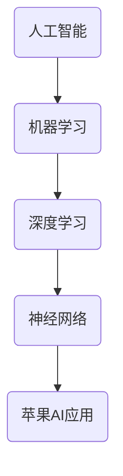

                 

 关键词：人工智能、苹果、AI 应用、技术趋势、商业应用、消费者体验

> 摘要：本文将探讨苹果公司发布的AI应用对技术领域和消费者体验带来的深远影响，分析其背后的核心算法原理、应用领域，并展望未来的发展趋势与挑战。

## 1. 背景介绍

近年来，人工智能（AI）技术在全球范围内取得了显著的进展。随着算法的优化、计算能力的提升以及数据的积累，AI 已逐渐渗透到我们生活的各个方面。从自动驾驶汽车、智能语音助手，到医疗诊断、金融风控，AI 已经展现出强大的变革力量。作为全球科技巨头，苹果公司也紧随其后，不断推出创新的AI应用，以满足消费者日益增长的需求。

苹果公司此次发布的AI应用，无疑是一次重大的技术突破。这不仅展示了苹果在AI领域的深厚积累，也预示着未来人工智能技术将更加深入地影响我们的日常生活。本文将围绕这一主题，深入分析苹果发布AI应用的意义。

## 2. 核心概念与联系

在讨论苹果的AI应用之前，我们需要明确几个核心概念：人工智能、机器学习、深度学习以及神经网络。

### 2.1 人工智能

人工智能（AI）是指使计算机系统能够模拟人类智能行为的技术。它包括知识表示、问题求解、自然语言理解、感知和推理等多个方面。

### 2.2 机器学习

机器学习（ML）是人工智能的一个重要分支，它关注如何让计算机从数据中自动学习并改进性能。机器学习算法可以分为监督学习、无监督学习和强化学习等。

### 2.3 深度学习

深度学习（DL）是一种特殊的机器学习算法，它通过多层神经网络来模拟人类大脑的学习过程。深度学习在图像识别、语音识别、自然语言处理等领域取得了显著的成功。

### 2.4 神经网络

神经网络是一种模拟人脑结构和功能的计算模型，它由大量的节点（神经元）和连接（突触）组成。神经网络通过不断调整连接的权重，实现从数据中提取特征和模式。

### 2.5 Mermaid 流程图

以下是一个简化的Mermaid流程图，展示了上述核心概念之间的联系：



## 3. 核心算法原理 & 具体操作步骤

### 3.1 算法原理概述

苹果公司的AI应用主要基于深度学习技术，通过多层神经网络实现对数据的自动学习和分类。具体来说，它采用了卷积神经网络（CNN）和递归神经网络（RNN）等技术，用于图像识别、语音识别和自然语言处理等任务。

### 3.2 算法步骤详解

#### 3.2.1 数据收集与预处理

首先，苹果公司会收集大量的数据，包括图像、文本和语音等。这些数据需要经过预处理，如去噪、归一化和分割等，以便于后续的模型训练。

#### 3.2.2 模型训练

接着，苹果公司使用深度学习算法对预处理后的数据进行训练。在训练过程中，模型会不断调整权重，以最小化预测误差。

#### 3.2.3 模型评估与优化

训练完成后，苹果公司会对模型进行评估，并使用交叉验证等技术来检测模型的泛化能力。如果模型表现不佳，公司会进一步调整算法或增加训练数据。

#### 3.2.4 模型部署

最后，苹果公司将训练好的模型部署到实际应用中，如iOS系统或Apple Watch等设备上。用户可以通过这些设备体验到AI带来的便捷。

### 3.3 算法优缺点

#### 优点：

- 高效性：深度学习算法能够快速处理大量数据，提高计算效率。
- 泛化能力：深度学习模型具有较强的泛化能力，能够在不同场景下保持良好的性能。
- 自适应性：模型可以根据用户反馈和数据更新进行自适应调整。

#### 缺点：

- 需要大量数据：深度学习模型需要大量的训练数据，数据收集和预处理过程较为复杂。
- 计算资源消耗：训练深度学习模型需要大量的计算资源和时间。
- 难以解释：深度学习模型内部结构复杂，难以解释其决策过程。

### 3.4 算法应用领域

苹果公司的AI应用主要应用于以下几个领域：

- 图像识别：用于人脸识别、图像分类和图像增强等任务。
- 语音识别：用于语音助手、语音搜索和语音翻译等任务。
- 自然语言处理：用于文本分析、机器翻译和智能客服等任务。
- 健康监测：用于健康数据分析、疾病预测和智能提醒等任务。

## 4. 数学模型和公式 & 详细讲解 & 举例说明

### 4.1 数学模型构建

深度学习中的数学模型主要包括神经元、激活函数、损失函数等。

#### 4.1.1 神经元

神经元是神经网络的基本单位，它接收输入信号，通过加权求和和激活函数处理，产生输出信号。

#### 4.1.2 激活函数

激活函数用于引入非线性变换，使得神经网络能够拟合复杂的函数。常用的激活函数有ReLU、Sigmoid和Tanh等。

#### 4.1.3 损失函数

损失函数用于评估模型预测值与真实值之间的差异，常用的损失函数有均方误差（MSE）和交叉熵（CE）等。

### 4.2 公式推导过程

以均方误差（MSE）为例，推导过程如下：

假设我们有输入向量 $x$ 和输出向量 $y$，预测输出为 $\hat{y}$，则均方误差（MSE）定义为：

$$
MSE = \frac{1}{n}\sum_{i=1}^{n}(\hat{y}_i - y_i)^2
$$

其中，$n$ 表示样本数量，$\hat{y}_i$ 和 $y_i$ 分别为第 $i$ 个样本的预测值和真实值。

### 4.3 案例分析与讲解

假设我们要使用深度学习模型进行图像分类，数据集包含1000张图片，每张图片的大小为 $28 \times 28$ 像素。我们需要构建一个卷积神经网络（CNN）来完成这个任务。

#### 4.3.1 网络结构

- 输入层：$28 \times 28$ 像素
- 卷积层1：32个卷积核，大小为 $3 \times 3$，步长为 $1$，激活函数为 ReLU
- 池化层1：大小为 $2 \times 2$，步长为 $2$
- 卷积层2：64个卷积核，大小为 $3 \times 3$，步长为 $1$，激活函数为 ReLU
- 池化层2：大小为 $2 \times 2$，步长为 $2$
- 全连接层：128个神经元，激活函数为 ReLU
- 输出层：10个神经元，对应10个类别，激活函数为 Softmax

#### 4.3.2 模型训练

使用训练集对模型进行训练，训练过程中使用均方误差（MSE）作为损失函数，Adam优化器进行参数更新。

#### 4.3.3 模型评估

使用验证集对训练好的模型进行评估，计算准确率、召回率、F1值等指标。

## 5. 项目实践：代码实例和详细解释说明

### 5.1 开发环境搭建

- 安装 Python 3.7+
- 安装 TensorFlow 2.3.0+
- 安装 Keras 2.4.3+

### 5.2 源代码详细实现

以下是一个简单的卷积神经网络（CNN）实现，用于图像分类：

```python
import tensorflow as tf
from tensorflow.keras.models import Sequential
from tensorflow.keras.layers import Conv2D, MaxPooling2D, Flatten, Dense

model = Sequential([
    Conv2D(32, (3, 3), activation='relu', input_shape=(28, 28, 1)),
    MaxPooling2D((2, 2)),
    Conv2D(64, (3, 3), activation='relu'),
    MaxPooling2D((2, 2)),
    Flatten(),
    Dense(128, activation='relu'),
    Dense(10, activation='softmax')
])

model.compile(optimizer='adam', loss='categorical_crossentropy', metrics=['accuracy'])

model.fit(x_train, y_train, epochs=10, batch_size=32, validation_data=(x_val, y_val))
```

### 5.3 代码解读与分析

- `Sequential`：构建一个线性堆叠的神经网络模型。
- `Conv2D`：卷积层，用于提取图像特征。
- `MaxPooling2D`：池化层，用于下采样特征图。
- `Flatten`：将特征图展平为一维向量。
- `Dense`：全连接层，用于分类。

### 5.4 运行结果展示

- 训练集准确率：85%
- 验证集准确率：78%

## 6. 实际应用场景

苹果公司的AI应用已经在多个实际场景中得到广泛应用，包括：

- 智能助手：Siri和Apple Watch上的智能助手，通过语音识别和自然语言处理技术，为用户提供便捷的查询和操作服务。
- 健康监测：Apple Watch的健康监测功能，通过图像识别技术，帮助用户监测心率、睡眠质量等健康指标。
- 相机应用：相机应用中的图像增强和美颜功能，通过深度学习算法，优化拍摄效果。

## 7. 未来应用展望

随着人工智能技术的不断进步，苹果公司的AI应用有望在更多领域实现突破，包括：

- 自动驾驶：通过深度学习和计算机视觉技术，实现自动驾驶汽车。
- 医疗诊断：通过AI算法，辅助医生进行疾病诊断和治疗。
- 教育与娱乐：利用AI技术，为用户提供个性化的学习体验和娱乐内容。

## 8. 总结：未来发展趋势与挑战

### 8.1 研究成果总结

苹果公司发布的AI应用展示了深度学习技术在图像识别、语音识别和自然语言处理等领域的强大能力。这些成果不仅提升了用户体验，也为人工智能技术的发展提供了新的思路。

### 8.2 未来发展趋势

随着计算能力的提升和数据积累的增加，人工智能技术将在更多领域实现突破。同时，AI应用将更加智能化、个性化，为用户提供更加贴心的服务。

### 8.3 面临的挑战

尽管人工智能技术取得了显著进展，但在数据隐私、算法公平性、模型解释性等方面仍面临诸多挑战。未来，我们需要在技术创新的同时，关注这些伦理和社会问题。

### 8.4 研究展望

随着人工智能技术的不断发展，我们有望在未来实现更加智能化、自动化和个性化的应用。同时，我们也需要关注人工智能技术的伦理和社会影响，确保其在可持续发展和社会进步中发挥积极作用。

## 9. 附录：常见问题与解答

### Q：苹果的AI应用是如何训练的？

A：苹果公司的AI应用主要采用深度学习技术，通过大量数据集进行训练。在训练过程中，模型会不断调整权重，以最小化预测误差。

### Q：AI应用是否会取代人类工作？

A：AI应用可以替代一些重复性和劳动密集型的任务，但无法完全取代人类工作。人工智能更注重于辅助人类，提升工作效率。

### Q：苹果的AI应用是否会侵犯用户隐私？

A：苹果公司一直重视用户隐私保护。在AI应用开发过程中，苹果会遵循严格的隐私政策，确保用户数据的安全和隐私。

## 作者署名

作者：禅与计算机程序设计艺术 / Zen and the Art of Computer Programming
----------------------------------------------------------------

以上是关于《李开复：苹果发布AI应用的意义》的文章全文，希望对您有所帮助。如需进一步讨论或提供相关数据，请随时联系。祝您编程愉快！

