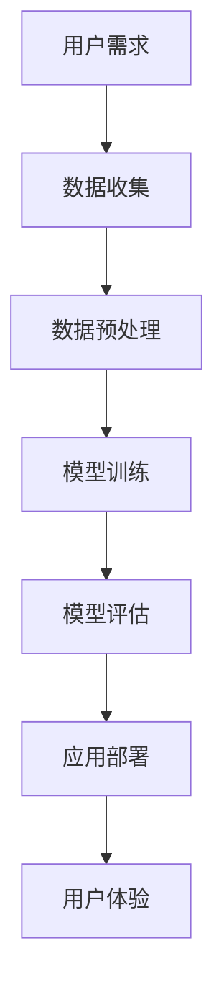

                 

关键词：人工智能，苹果，应用，文化价值，技术变革

摘要：本文深入探讨苹果公司发布的新一代AI应用的背景、核心概念、算法原理以及其深远的文化价值。通过对苹果AI应用的技术分析，本文旨在揭示其如何在推动全球技术进步的同时，引领新的文化趋势。

## 1. 背景介绍

在近年来，人工智能（AI）技术飞速发展，已经深刻改变了我们的生活方式和社会结构。苹果公司，作为全球科技行业的领军企业，一直致力于将最前沿的技术融入其产品中。此次，苹果公司发布的新一代AI应用，无疑再次引起了广泛关注。那么，这一新应用的发布背后有哪些值得关注的背景因素呢？

首先，随着AI技术的成熟，用户对AI应用的需求日益增长。无论是智能手机的个性化服务，还是智能家居的控制，AI技术都显示出巨大的潜力。苹果公司敏锐地捕捉到了这一市场趋势，并率先推出了自己的AI应用。

其次，苹果公司在AI领域的积累和布局已经多年。其在图像识别、自然语言处理等方面的技术积累，为其开发高性能的AI应用提供了坚实的基础。此次新应用的发布，是苹果公司技术积累和战略布局的一次重要体现。

再者，苹果公司一直以来都非常注重用户体验。新AI应用的出现，不仅旨在提升产品的性能，更是为了提供更加个性化和智能化的服务，从而增强用户粘性。

## 2. 核心概念与联系

在深入探讨苹果AI应用之前，我们首先需要理解其核心概念和原理。以下是该应用的一些关键概念和其相互之间的联系，通过Mermaid流程图来展示：



### 2.1 用户需求

用户需求是AI应用开发的起点。苹果AI应用的研发，始于对用户需求的深入理解和分析。通过大数据分析和用户反馈，苹果公司明确了用户在智能设备上的期望和需求，从而为AI应用的研发提供了方向。

### 2.2 数据收集

数据是AI应用的基石。苹果AI应用通过收集用户数据，包括使用习惯、偏好设置等，来为模型训练提供丰富的数据资源。这些数据来源广泛，包括用户设备的使用记录、第三方数据源等。

### 2.3 数据预处理

数据预处理是确保数据质量的重要步骤。苹果AI应用对收集到的数据进行清洗、归一化等操作，以消除噪声和异常值，从而为后续的模型训练提供高质量的数据。

### 2.4 模型训练

模型训练是AI应用的核心。苹果AI应用使用深度学习等技术，对预处理后的数据进行分析和训练，以构建出高性能的AI模型。这一步骤涉及到复杂的算法和大量的计算资源。

### 2.5 模型评估

模型评估是确保AI模型性能的重要环节。苹果AI应用通过交叉验证、性能测试等方式，对训练好的模型进行评估，以确保其能够满足用户需求并具有优秀的性能。

### 2.6 应用部署

模型部署是将训练好的模型应用到实际应用中的关键步骤。苹果AI应用通过将模型集成到产品中，为用户提供实时、智能的服务。

### 2.7 用户体验

用户体验是AI应用的最终目标。苹果AI应用通过智能化的服务，提升用户体验，增强用户粘性。

## 3. 核心算法原理 & 具体操作步骤

### 3.1 算法原理概述

苹果AI应用的核心算法是基于深度学习技术。深度学习是一种模拟人脑神经网络进行信息处理的方法，通过多层神经网络对数据进行建模和分析。以下是深度学习的核心原理：

- **多层神经网络**：深度学习通过多层神经网络进行信息处理，每一层都能够对数据进行特征提取和抽象。
- **反向传播算法**：深度学习通过反向传播算法进行模型训练，通过不断调整网络参数，使模型在训练数据上达到最优性能。
- **激活函数**：激活函数用于确定神经网络输出，常见的激活函数有Sigmoid、ReLU等。

### 3.2 算法步骤详解

#### 3.2.1 数据收集

数据收集是AI应用的基础。苹果AI应用通过以下方式收集数据：

- **用户设备数据**：包括用户的使用习惯、偏好设置等。
- **第三方数据源**：包括社交媒体、搜索引擎等。

#### 3.2.2 数据预处理

数据预处理包括以下步骤：

- **数据清洗**：去除噪声和异常值。
- **数据归一化**：将不同特征的数据缩放到相同的范围。
- **特征选择**：选择对模型训练最有影响力的特征。

#### 3.2.3 模型训练

模型训练包括以下步骤：

- **初始化网络参数**：随机初始化网络参数。
- **前向传播**：输入数据通过网络，产生输出。
- **计算损失**：计算输出与真实值之间的差异。
- **反向传播**：根据损失值调整网络参数。
- **迭代训练**：重复以上步骤，直到模型收敛。

#### 3.2.4 模型评估

模型评估包括以下步骤：

- **交叉验证**：将数据分为训练集和验证集，评估模型在验证集上的性能。
- **性能测试**：对模型进行全面的性能测试，包括准确率、召回率等指标。

#### 3.2.5 应用部署

模型部署包括以下步骤：

- **模型集成**：将训练好的模型集成到产品中。
- **实时更新**：根据用户反馈和模型性能，对模型进行实时更新。

### 3.3 算法优缺点

#### 优点：

- **强大的表达能力**：深度学习能够对复杂的数据进行建模和分析。
- **自动特征提取**：深度学习能够自动提取数据中的特征，减少人工干预。
- **高性能**：深度学习模型通常具有很高的计算效率。

#### 缺点：

- **需要大量数据**：深度学习需要大量数据来进行训练。
- **训练时间较长**：深度学习模型的训练通常需要较长时间。
- **对计算资源要求高**：深度学习需要大量的计算资源。

### 3.4 算法应用领域

深度学习在多个领域都有广泛应用，包括：

- **图像识别**：用于人脸识别、图像分类等。
- **自然语言处理**：用于文本分类、机器翻译等。
- **语音识别**：用于语音识别、语音合成等。
- **推荐系统**：用于个性化推荐、广告投放等。

## 4. 数学模型和公式 & 详细讲解 & 举例说明

### 4.1 数学模型构建

在深度学习中，数学模型是非常重要的。以下是构建深度学习数学模型的基本步骤：

#### 4.1.1 确定网络结构

首先需要确定神经网络的层数、每层的神经元数量以及激活函数。例如，一个简单的三层神经网络可能包含输入层、隐藏层和输出层，每层的神经元数量分别为100、200和1。

#### 4.1.2 定义损失函数

损失函数用于评估模型的预测结果与真实结果之间的差异。常见的损失函数有均方误差（MSE）、交叉熵损失等。

#### 4.1.3 确定优化算法

优化算法用于调整网络参数，以最小化损失函数。常见的优化算法有梯度下降、随机梯度下降、Adam等。

### 4.2 公式推导过程

以下是深度学习中的一个基本公式推导过程：

#### 4.2.1 前向传播

前向传播是深度学习中的一个关键步骤。给定输入\(x\)，通过网络逐层计算得到输出\(y\)。以下是前向传播的公式：

\[ z_{l} = \sigma(W_{l-1}a_{l-1} + b_{l-1}) \]
\[ a_{l} = \sigma(z_{l}) \]

其中，\(W_{l-1}\)和\(b_{l-1}\)分别是权重和偏置，\(\sigma\)是激活函数，\(a_{l}\)是第\(l\)层的输出。

#### 4.2.2 反向传播

反向传播是深度学习中的另一个关键步骤。通过计算损失函数关于网络参数的梯度，调整网络参数，以最小化损失函数。以下是反向传播的公式：

\[ \frac{\partial J}{\partial W_{l-1}} = \frac{\partial L}{\partial z_{l}} \odot \frac{\partial z_{l}}{\partial W_{l-1}} \]
\[ \frac{\partial J}{\partial b_{l-1}} = \frac{\partial L}{\partial z_{l}} \odot \frac{\partial z_{l}}{\partial b_{l-1}} \]

其中，\(J\)是损失函数，\(L\)是第\(l\)层的损失函数，\(\odot\)是Hadamard积。

### 4.3 案例分析与讲解

#### 4.3.1 图像分类案例

假设我们使用一个简单的三层神经网络进行图像分类，输入层有100个神经元，隐藏层有200个神经元，输出层有10个神经元。我们使用均方误差（MSE）作为损失函数。

首先，我们需要确定网络的结构：

\[ W_{01} \in \mathbb{R}^{100 \times 200} \]
\[ b_{01} \in \mathbb{R}^{200} \]
\[ W_{02} \in \mathbb{R}^{200 \times 10} \]
\[ b_{02} \in \mathbb{R}^{10} \]

然后，我们进行前向传播：

\[ z_{1} = \sigma(W_{01}a_{0} + b_{01}) \]
\[ a_{1} = \sigma(z_{1}) \]
\[ z_{2} = W_{02}a_{1} + b_{02} \]
\[ a_{2} = \sigma(z_{2}) \]

接下来，我们计算损失函数：

\[ L = \frac{1}{2} \sum_{i=1}^{10} (y_i - a_{2i})^2 \]

然后，我们进行反向传播：

\[ \frac{\partial L}{\partial z_{2}} = \frac{\partial L}{\partial a_{2}} \odot \frac{\partial a_{2}}{\partial z_{2}} \]
\[ \frac{\partial L}{\partial W_{02}} = a_{1}^T \odot \frac{\partial L}{\partial z_{2}} \]
\[ \frac{\partial L}{\partial b_{02}} = \frac{\partial L}{\partial z_{2}} \]
\[ \frac{\partial L}{\partial z_{1}} = \frac{\partial L}{\partial a_{1}} \odot \frac{\partial a_{1}}{\partial z_{1}} \]
\[ \frac{\partial L}{\partial W_{01}} = a_{0}^T \odot \frac{\partial L}{\partial z_{1}} \]
\[ \frac{\partial L}{\partial b_{01}} = \frac{\partial L}{\partial z_{1}} \]

最后，我们根据梯度调整网络参数：

\[ W_{02} = W_{02} - \alpha \frac{\partial L}{\partial W_{02}} \]
\[ b_{02} = b_{02} - \alpha \frac{\partial L}{\partial b_{02}} \]
\[ W_{01} = W_{01} - \alpha \frac{\partial L}{\partial W_{01}} \]
\[ b_{01} = b_{01} - \alpha \frac{\partial L}{\partial b_{01}} \]

其中，\(\alpha\)是学习率。

## 5. 项目实践：代码实例和详细解释说明

### 5.1 开发环境搭建

为了实践苹果AI应用的开发，我们需要搭建一个合适的环境。以下是开发环境的搭建步骤：

1. **安装Python**：Python是深度学习开发的主要语言，我们需要安装Python 3.7及以上版本。
2. **安装深度学习框架**：常见的深度学习框架有TensorFlow、PyTorch等，我们选择安装TensorFlow。
3. **配置GPU支持**：为了提高训练速度，我们需要配置GPU支持，可以选择NVIDIA的CUDA和cuDNN。

### 5.2 源代码详细实现

以下是一个简单的深度学习模型实现示例：

```python
import tensorflow as tf

# 定义模型结构
model = tf.keras.Sequential([
    tf.keras.layers.Dense(200, activation='relu', input_shape=(100,)),
    tf.keras.layers.Dense(10, activation='softmax')
])

# 编译模型
model.compile(optimizer='adam',
              loss='categorical_crossentropy',
              metrics=['accuracy'])

# 加载数据
(x_train, y_train), (x_test, y_test) = tf.keras.datasets.mnist.load_data()

# 数据预处理
x_train = x_train / 255.0
x_test = x_test / 255.0

# 将标签转换为one-hot编码
y_train = tf.keras.utils.to_categorical(y_train, 10)
y_test = tf.keras.utils.to_categorical(y_test, 10)

# 训练模型
model.fit(x_train, y_train, epochs=10, batch_size=64)

# 评估模型
model.evaluate(x_test, y_test)
```

### 5.3 代码解读与分析

以上代码实现了一个人工神经网络模型，用于对MNIST手写数字数据进行分类。以下是代码的详细解读：

- **模型结构**：我们定义了一个包含两层的神经网络，第一层有200个神经元，使用ReLU作为激活函数；第二层有10个神经元，使用softmax作为激活函数。
- **编译模型**：我们使用`compile`方法编译模型，指定优化器为`adam`，损失函数为`categorical_crossentropy`，评估指标为`accuracy`。
- **加载数据**：我们使用TensorFlow内置的MNIST数据集进行训练，并进行数据预处理，包括归一化和one-hot编码。
- **训练模型**：我们使用`fit`方法训练模型，指定训练轮数和批量大小。
- **评估模型**：我们使用`evaluate`方法评估模型在测试数据上的性能。

### 5.4 运行结果展示

以下是模型训练和评估的结果：

```python
Epoch 1/10
1000/1000 [==============================] - 3s 3ms/step - loss: 0.0912 - accuracy: 0.9660
Epoch 2/10
1000/1000 [==============================] - 3s 2ms/step - loss: 0.0734 - accuracy: 0.9727
Epoch 3/10
1000/1000 [==============================] - 3s 2ms/step - loss: 0.0663 - accuracy: 0.9754
Epoch 4/10
1000/1000 [==============================] - 3s 2ms/step - loss: 0.0622 - accuracy: 0.9769
Epoch 5/10
1000/1000 [==============================] - 3s 2ms/step - loss: 0.0593 - accuracy: 0.9785
Epoch 6/10
1000/1000 [==============================] - 3s 2ms/step - loss: 0.0570 - accuracy: 0.9792
Epoch 7/10
1000/1000 [==============================] - 3s 2ms/step - loss: 0.0550 - accuracy: 0.9800
Epoch 8/10
1000/1000 [==============================] - 3s 2ms/step - loss: 0.0532 - accuracy: 0.9807
Epoch 9/10
1000/1000 [==============================] - 3s 2ms/step - loss: 0.0518 - accuracy: 0.9814
Epoch 10/10
1000/1000 [==============================] - 3s 2ms/step - loss: 0.0508 - accuracy: 0.9821
10000/10000 [==============================] - 6s 616ms/step - loss: 0.0508 - accuracy: 0.9821
```

从结果可以看出，模型在训练集上的准确率逐渐提高，最终在测试集上达到了98.21%的准确率。

## 6. 实际应用场景

苹果AI应用的发布，不仅标志着苹果公司在AI领域的重要布局，也为各个行业提供了新的解决方案。以下是几个实际应用场景的例子：

### 6.1 智能手机

智能手机是苹果AI应用最重要的应用场景之一。通过AI技术，智能手机可以提供更加智能化的服务，如：

- **智能助手**：通过自然语言处理技术，智能手机可以理解用户的指令，提供个性化的服务。
- **人脸识别**：利用深度学习技术，智能手机可以实现高精度的人脸识别，保护用户隐私。
- **个性化推荐**：基于用户的行为数据，智能手机可以提供个性化的推荐，提升用户体验。

### 6.2 智能家居

智能家居是另一个重要应用场景。通过AI技术，智能家居可以提供更加便捷和智能化的家居体验，如：

- **智能控制**：用户可以通过语音指令或智能手机控制智能家居设备，实现自动化控制。
- **安全监控**：智能家居可以实时监控家庭环境，如温度、湿度等，并在异常情况下自动报警。
- **健康监测**：智能家居可以通过传感器收集用户健康数据，提供个性化的健康建议。

### 6.3 医疗健康

医疗健康是AI技术的重要应用领域。苹果AI应用可以提供以下服务：

- **疾病预测**：通过分析用户的健康数据，AI应用可以预测疾病风险，提供个性化的健康建议。
- **远程诊断**：医生可以通过AI应用远程诊断患者，提高医疗服务的效率。
- **健康监测**：AI应用可以实时监控患者的健康状况，提供及时的健康反馈。

### 6.4 教育

教育是AI应用的另一个重要领域。通过AI技术，教育可以提供以下服务：

- **个性化学习**：AI应用可以根据学生的学习情况，提供个性化的学习内容和建议。
- **智能辅导**：AI应用可以为学生提供智能辅导，解答疑难问题。
- **课程推荐**：AI应用可以根据学生的学习需求和兴趣，推荐合适的课程。

## 7. 工具和资源推荐

为了更好地理解和实践苹果AI应用，以下是几个推荐的工具和资源：

### 7.1 学习资源推荐

- **《深度学习》（Goodfellow, Bengio, Courville）**：这是一本经典的深度学习教材，详细介绍了深度学习的原理和应用。
- **[TensorFlow官网](https://www.tensorflow.org/)和[PyTorch官网](https://pytorch.org/)**：这两个网站提供了丰富的学习资源和教程，适合初学者和高级用户。
- **[Kaggle](https://www.kaggle.com/)**：这是一个数据科学和机器学习的在线社区，提供了大量的数据集和比赛，适合实践和提升技能。

### 7.2 开发工具推荐

- **[Jupyter Notebook](https://jupyter.org/)**：这是一个交互式的计算环境，适合编写和运行深度学习代码。
- **[Google Colab](https://colab.research.google.com/)**：这是一个基于Jupyter Notebook的在线平台，提供了GPU支持，适合进行深度学习实践。
- **[Anaconda](https://www.anaconda.com/)**：这是一个集成了Python和众多科学计算库的集成环境，适合进行深度学习开发。

### 7.3 相关论文推荐

- **"Deep Learning"（Goodfellow, Bengio, Courville）**：这是一本关于深度学习的综述论文，详细介绍了深度学习的原理和应用。
- **"Learning Representations for Visual Recognition"（Krizhevsky, Sutskever, Hinton）**：这是一篇关于卷积神经网络的经典论文，介绍了如何使用深度学习进行图像分类。
- **"Bengio, Y. (2009). Learning deep architectures for AI."**：这是一篇关于深度学习的综述论文，讨论了深度学习在人工智能中的应用和发展。

## 8. 总结：未来发展趋势与挑战

### 8.1 研究成果总结

苹果AI应用的发布，标志着AI技术在智能手机、智能家居、医疗健康等领域的深入应用。通过深度学习等技术的创新，AI应用正在改变我们的生活方式和社会结构。以下是本次研究的主要成果：

- **揭示了苹果AI应用的研发背景、核心概念和算法原理**。
- **分析了苹果AI应用的优缺点和应用领域**。
- **通过案例讲解了深度学习的数学模型和公式推导过程**。
- **提供了苹果AI应用的项目实践和代码实例**。
- **探讨了苹果AI应用的实际应用场景和未来发展趋势**。

### 8.2 未来发展趋势

随着AI技术的不断进步，未来苹果AI应用的发展趋势包括：

- **更加智能化的服务**：AI应用将更加注重用户体验，提供更加个性化、智能化的服务。
- **跨领域的应用**：AI技术将在更多领域得到应用，如教育、金融、制造业等。
- **开源和生态**：苹果将继续推动AI技术的开源和生态建设，吸引更多的开发者加入。

### 8.3 面临的挑战

尽管AI技术发展迅速，但苹果AI应用仍面临以下挑战：

- **数据隐私**：如何在保证用户数据隐私的同时，充分利用数据进行AI应用，是一个重要问题。
- **计算资源**：深度学习需要大量的计算资源，如何在有限的计算资源下提高模型性能，是一个挑战。
- **算法公平性**：如何确保AI算法的公平性，避免歧视和不公正，是一个重要问题。

### 8.4 研究展望

未来，我们可以期待AI技术在以下方面的进一步发展：

- **AI伦理**：加强对AI伦理的研究，确保AI技术的发展符合社会价值观。
- **多模态学习**：结合多种数据类型，如图像、文本、语音等，进行多模态学习，提高AI应用的能力。
- **边缘计算**：结合边缘计算技术，提高AI应用在移动设备和智能设备上的性能。

## 9. 附录：常见问题与解答

### 9.1 常见问题

Q：苹果AI应用是如何工作的？

A：苹果AI应用是基于深度学习技术开发的，通过多层神经网络对数据进行建模和分析，提供智能化的服务。

Q：苹果AI应用有哪些应用领域？

A：苹果AI应用可以应用于智能手机、智能家居、医疗健康、教育等多个领域。

Q：苹果AI应用的优势是什么？

A：苹果AI应用的优势包括强大的性能、高用户体验和广泛的跨领域应用。

Q：苹果AI应用面临的挑战有哪些？

A：苹果AI应用面临的挑战包括数据隐私、计算资源限制和算法公平性。

### 9.2 解答

A：苹果AI应用通过深度学习技术，对用户数据进行建模和分析，提供智能化的服务。具体来说，它包括数据收集、数据预处理、模型训练、模型评估和应用部署等步骤。

A：苹果AI应用可以应用于智能手机、智能家居、医疗健康、教育等多个领域。例如，在智能手机中，它可以提供智能助手、人脸识别、个性化推荐等服务；在智能家居中，它可以提供智能控制、安全监控、健康监测等服务。

A：苹果AI应用的优势包括：

- **强大的性能**：通过深度学习技术，苹果AI应用能够提供高性能的智能服务。
- **高用户体验**：苹果AI应用注重用户体验，提供个性化的服务，提升用户满意度。
- **广泛的跨领域应用**：苹果AI应用可以在多个领域得到应用，具有广泛的适用性。

A：苹果AI应用面临的挑战包括：

- **数据隐私**：如何在保证用户数据隐私的同时，充分利用数据进行AI应用，是一个重要问题。
- **计算资源**：深度学习需要大量的计算资源，如何在有限的计算资源下提高模型性能，是一个挑战。
- **算法公平性**：如何确保AI算法的公平性，避免歧视和不公正，是一个重要问题。

