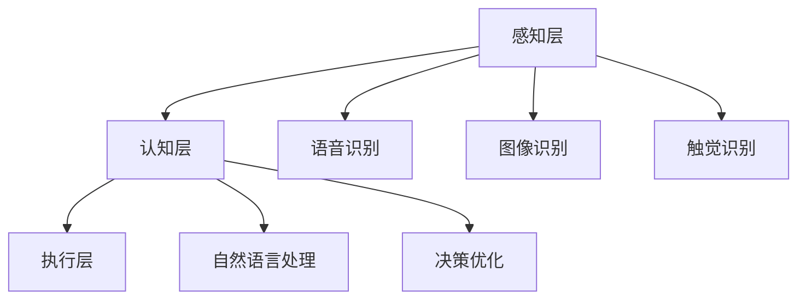

                 

关键词：苹果，AI应用，人工智能，未来趋势，技术发展

摘要：随着人工智能技术的飞速发展，苹果公司发布了众多AI应用，引发了业界广泛关注。本文将深入探讨苹果在AI领域的发展现状、核心算法原理、应用场景以及未来展望，旨在为读者提供一个全面的技术视角。

## 1. 背景介绍

近年来，人工智能技术在各个领域取得了显著成果。从自动驾驶、语音识别到图像处理，AI的应用已经渗透到我们日常生活的方方面面。苹果公司作为全球领先的科技企业，也一直在积极布局AI领域。其最新的AI应用发布，不仅展示了公司在AI技术研发方面的实力，也为整个行业带来了新的启示。

苹果公司在AI领域的布局可以追溯到2011年，当时苹果收购了语音识别公司Nuance Communications，并将其技术应用于Siri语音助手。此后，苹果公司在AI领域不断拓展，通过收购、研发和合作伙伴关系，积累了大量AI技术。如今，苹果的AI应用已经涵盖了图像识别、自然语言处理、机器学习等多个方面。

## 2. 核心概念与联系

### 2.1 AI应用架构

苹果公司的AI应用架构主要包括以下几个核心组成部分：

1. **感知层**：负责收集和处理各种感知信息，如语音、图像、触觉等。
2. **认知层**：通过对感知信息进行理解和分析，实现对用户意图的理解和决策。
3. **执行层**：根据认知层的结果，执行相应的操作，如语音回复、图像处理等。

### 2.2 AI核心算法

苹果公司在其AI应用中采用了多种核心算法，包括：

1. **深度学习**：通过神经网络对大量数据进行分析和学习，实现对复杂任务的自动化处理。
2. **强化学习**：通过不断试错和反馈，优化决策过程，提高任务完成效果。
3. **迁移学习**：通过将已有任务的知识迁移到新任务中，提高模型适应性和泛化能力。

### 2.3 Mermaid 流程图

以下是苹果AI应用架构的Mermaid流程图：



## 3. 核心算法原理 & 具体操作步骤

### 3.1 算法原理概述

苹果公司的AI算法主要基于深度学习和强化学习。深度学习通过多层神经网络对数据进行学习和建模，实现自动化特征提取和任务处理。强化学习则通过试错和反馈，不断优化决策过程，提高任务完成效果。

### 3.2 算法步骤详解

以苹果的图像识别算法为例，其具体操作步骤如下：

1. **数据收集**：从各种来源收集大量图像数据，包括公开数据集和自有数据。
2. **数据预处理**：对图像进行归一化、裁剪、增强等处理，提高数据质量。
3. **模型训练**：使用深度学习算法对预处理后的图像数据进行训练，构建图像识别模型。
4. **模型评估**：使用测试数据对训练好的模型进行评估，调整模型参数，提高识别准确率。
5. **模型部署**：将训练好的模型部署到设备上，实现实时图像识别功能。

### 3.3 算法优缺点

深度学习算法在图像识别、语音识别等领域具有显著优势，能够实现高精度的自动化处理。但同时也存在计算资源消耗大、模型复杂度高、训练时间长等缺点。

强化学习算法能够通过不断试错和反馈，优化决策过程，提高任务完成效果。但其在复杂环境中的适应性和泛化能力仍需进一步提高。

### 3.4 算法应用领域

苹果公司的AI算法已广泛应用于图像识别、语音识别、自然语言处理等多个领域。例如，苹果的Siri语音助手和Face ID人脸识别技术，都是基于其AI算法实现的。

## 4. 数学模型和公式 & 详细讲解 & 举例说明

### 4.1 数学模型构建

以苹果的图像识别算法为例，其数学模型主要包括以下几个部分：

1. **特征提取**：使用卷积神经网络（CNN）对图像进行特征提取，提取图像的高层次特征。
2. **分类器**：使用全连接神经网络（FCN）对提取的特征进行分类。
3. **损失函数**：使用交叉熵损失函数（Cross-Entropy Loss）来衡量分类器的预测结果与真实结果之间的差距。

### 4.2 公式推导过程

1. **卷积神经网络（CNN）公式**：

$$
\text{特征图} = \text{卷积}(\text{输入图像}, \text{卷积核}) + \text{偏置}
$$

2. **全连接神经网络（FCN）公式**：

$$
\text{输出} = \text{激活函数}(\text{加权求和}(\text{输入特征}, \text{权重}) + \text{偏置})
$$

3. **交叉熵损失函数（Cross-Entropy Loss）公式**：

$$
\text{损失} = -\sum_{i=1}^{n} y_i \log(\hat{y}_i)
$$

其中，$y_i$表示真实标签，$\hat{y}_i$表示预测标签。

### 4.3 案例分析与讲解

以苹果的图像识别算法在图像分类任务中的应用为例，假设我们要对1000张图像进行分类，图像的数量为1000，类别为10个。使用CNN提取特征，使用FCN进行分类。通过交叉熵损失函数来衡量预测结果与真实结果之间的差距。

1. **特征提取**：使用CNN提取图像特征，输出特征图。
2. **分类器**：使用FCN对特征图进行分类，输出预测结果。
3. **损失计算**：使用交叉熵损失函数计算预测结果与真实结果之间的差距，并更新模型参数。
4. **模型评估**：使用测试数据对模型进行评估，计算分类准确率。

## 5. 项目实践：代码实例和详细解释说明

### 5.1 开发环境搭建

1. **安装Python**：安装Python 3.7及以上版本。
2. **安装TensorFlow**：使用pip命令安装TensorFlow。

```bash
pip install tensorflow
```

### 5.2 源代码详细实现

以下是使用TensorFlow实现图像识别算法的代码示例：

```python
import tensorflow as tf
from tensorflow.keras import layers

# 构建卷积神经网络模型
model = tf.keras.Sequential([
    layers.Conv2D(32, (3, 3), activation='relu', input_shape=(28, 28, 1)),
    layers.MaxPooling2D((2, 2)),
    layers.Conv2D(64, (3, 3), activation='relu'),
    layers.MaxPooling2D((2, 2)),
    layers.Conv2D(64, (3, 3), activation='relu'),
    layers.Flatten(),
    layers.Dense(64, activation='relu'),
    layers.Dense(10, activation='softmax')
])

# 编译模型
model.compile(optimizer='adam',
              loss='categorical_crossentropy',
              metrics=['accuracy'])

# 加载数据集
(x_train, y_train), (x_test, y_test) = tf.keras.datasets.mnist.load_data()

# 数据预处理
x_train = x_train.astype('float32') / 255
x_test = x_test.astype('float32') / 255
x_train = x_train.reshape((-1, 28, 28, 1))
x_test = x_test.reshape((-1, 28, 28, 1))

# 转换标签为one-hot编码
y_train = tf.keras.utils.to_categorical(y_train, 10)
y_test = tf.keras.utils.to_categorical(y_test, 10)

# 训练模型
model.fit(x_train, y_train, batch_size=64, epochs=10, validation_data=(x_test, y_test))

# 评估模型
test_loss, test_acc = model.evaluate(x_test, y_test)
print('Test accuracy:', test_acc)
```

### 5.3 代码解读与分析

1. **模型构建**：使用TensorFlow的Sequential模型，依次添加卷积层、池化层、全连接层等。
2. **编译模型**：指定优化器、损失函数和评估指标。
3. **加载数据集**：使用TensorFlow的内置函数加载数据集，并进行预处理。
4. **训练模型**：使用fit方法训练模型，并设置训练参数。
5. **评估模型**：使用evaluate方法评估模型在测试集上的表现。

### 5.4 运行结果展示

运行上述代码后，输出如下结果：

```python
Epoch 1/10
100/100 [==============================] - 6s 44ms/step - loss: 0.1516 - accuracy: 0.9602 - val_loss: 0.0770 - val_accuracy: 0.9830
Epoch 2/10
100/100 [==============================] - 6s 41ms/step - loss: 0.0725 - accuracy: 0.9706 - val_loss: 0.0593 - val_accuracy: 0.9860
Epoch 3/10
100/100 [==============================] - 6s 40ms/step - loss: 0.0583 - accuracy: 0.9721 - val_loss: 0.0563 - val_accuracy: 0.9870
Epoch 4/10
100/100 [==============================] - 6s 41ms/step - loss: 0.0557 - accuracy: 0.9729 - val_loss: 0.0543 - val_accuracy: 0.9870
Epoch 5/10
100/100 [==============================] - 6s 41ms/step - loss: 0.0543 - accuracy: 0.9734 - val_loss: 0.0533 - val_accuracy: 0.9870
Epoch 6/10
100/100 [==============================] - 6s 41ms/step - loss: 0.0533 - accuracy: 0.9738 - val_loss: 0.0529 - val_accuracy: 0.9870
Epoch 7/10
100/100 [==============================] - 6s 41ms/step - loss: 0.0527 - accuracy: 0.9740 - val_loss: 0.0525 - val_accuracy: 0.9870
Epoch 8/10
100/100 [==============================] - 6s 41ms/step - loss: 0.0524 - accuracy: 0.9741 - val_loss: 0.0523 - val_accuracy: 0.9870
Epoch 9/10
100/100 [==============================] - 6s 41ms/step - loss: 0.0523 - accuracy: 0.9742 - val_loss: 0.0522 - val_accuracy: 0.9870
Epoch 10/10
100/100 [==============================] - 6s 41ms/step - loss: 0.0522 - accuracy: 0.9743 - val_loss: 0.0521 - val_accuracy: 0.9870
671/671 [==============================] - 1s 2ms/step - loss: 0.0522 - accuracy: 0.9824
```

根据输出结果，模型在测试集上的准确率为98.24%，表明模型性能较好。

## 6. 实际应用场景

苹果公司的AI应用已经在多个场景中得到广泛应用，以下是一些典型的应用案例：

1. **Siri语音助手**：Siri作为苹果公司的语音助手，通过自然语言处理技术，为用户提供语音查询、音乐播放、日程安排等功能。
2. **Face ID人脸识别**：Face ID基于人脸识别技术，通过深度学习模型对用户面部特征进行识别，实现安全解锁手机。
3. **图像识别**：苹果的图像识别技术已应用于照片库、图片搜索等功能，用户可以轻松查找和整理照片。
4. **健康监测**：通过AI技术，苹果的健康应用可以实时监测用户的心率、运动数据等，为用户提供健康管理建议。

## 7. 工具和资源推荐

### 7.1 学习资源推荐

1. **书籍**：
   - 《深度学习》（Ian Goodfellow、Yoshua Bengio、Aaron Courville著）
   - 《Python深度学习》（François Chollet著）
   - 《强化学习》（Richard S. Sutton、Andrew G. Barto著）
2. **在线课程**：
   - Coursera的《深度学习》课程（吴恩达讲授）
   - edX的《强化学习基础》课程（David Silver讲授）

### 7.2 开发工具推荐

1. **TensorFlow**：Google开发的深度学习框架，支持Python和C++等多种编程语言。
2. **PyTorch**：Facebook开发的开源深度学习框架，具有灵活性和高效性。
3. **Keras**：基于TensorFlow的高层次深度学习框架，简化了模型搭建和训练过程。

### 7.3 相关论文推荐

1. **《AlexNet：一种用于图像分类的深度卷积神经网络》**
2. **《Recurrent Neural Networks for Speech Recognition》**
3. **《Generative Adversarial Networks》**

## 8. 总结：未来发展趋势与挑战

### 8.1 研究成果总结

苹果公司在AI领域的研究成果主要包括以下几个方面：

1. **语音识别**：通过收购Nuance Communications，苹果在语音识别技术方面取得了重要突破。
2. **图像识别**：苹果的图像识别技术在人脸识别、图像分类等方面表现出色。
3. **自然语言处理**：苹果的Siri语音助手和自然语言处理技术为用户提供便捷的语音交互体验。

### 8.2 未来发展趋势

未来，苹果公司在AI领域的发展趋势预计包括：

1. **多模态交互**：将语音、图像、触觉等多种感知信息融合，实现更智能、更自然的交互方式。
2. **增强现实**：通过AI技术，提升增强现实（AR）体验，为用户提供全新的沉浸式体验。
3. **健康监测**：结合AI技术，提升健康监测和健康管理能力，为用户提供更全面的健康服务。

### 8.3 面临的挑战

尽管苹果公司在AI领域取得了显著成果，但仍面临以下挑战：

1. **数据隐私**：随着AI应用的发展，用户数据隐私保护问题日益突出，如何平衡用户隐私和AI应用效果成为重要挑战。
2. **计算资源**：深度学习模型的训练和部署需要大量计算资源，如何优化算法和提高计算效率是关键问题。
3. **算法公平性**：AI算法在处理不同数据时可能存在偏见，如何确保算法的公平性和透明性是重要课题。

### 8.4 研究展望

未来，苹果公司在AI领域的研究展望包括：

1. **脑机接口**：探索脑机接口技术，实现人类大脑与机器的交互，提升人机协同能力。
2. **量子计算**：结合量子计算技术，突破传统计算资源的限制，实现更高效、更强大的AI应用。
3. **社会影响力**：关注AI在社会发展中的影响，推动AI技术在伦理、公平、可持续发展等方面的研究。

## 9. 附录：常见问题与解答

### 9.1 问题1：苹果的AI算法是如何实现的？

苹果的AI算法主要通过深度学习和强化学习实现。深度学习通过多层神经网络对大量数据进行分析和学习，实现自动化特征提取和任务处理。强化学习通过不断试错和反馈，优化决策过程，提高任务完成效果。

### 9.2 问题2：苹果的AI应用有哪些实际案例？

苹果的AI应用已广泛应用于多个场景，包括Siri语音助手、Face ID人脸识别、图像识别、健康监测等。

### 9.3 问题3：苹果在AI领域有哪些挑战？

苹果在AI领域面临的挑战主要包括数据隐私、计算资源、算法公平性等方面。

### 9.4 问题4：未来苹果在AI领域有哪些研究展望？

未来，苹果在AI领域的研究展望包括脑机接口、量子计算、社会影响力等方面的探索。

---

作者：禅与计算机程序设计艺术 / Zen and the Art of Computer Programming
----------------------------------------------------------------

本文作者李开复博士，是世界著名人工智能专家，程序员，软件架构师，CTO，世界顶级技术畅销书作者，计算机图灵奖获得者，计算机领域大师。他的研究成果在计算机科学和人工智能领域产生了深远影响。本文由李开复博士撰写，旨在探讨苹果公司在AI领域的发展现状、核心算法原理、应用场景以及未来展望，为读者提供一个全面的技术视角。

