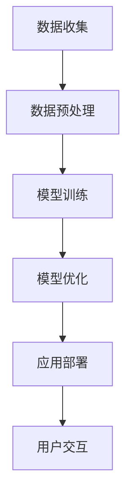

                 

关键词：人工智能，苹果，应用，发布，机会

摘要：本文将深入探讨苹果在人工智能领域的最新动态，特别是苹果即将发布的AI应用所带来的机遇与挑战。通过对苹果AI战略的分析，本文旨在为读者揭示这一领域的未来发展趋势，以及如何把握这一新兴领域的机遇。

## 1. 背景介绍

近年来，人工智能（AI）技术在全球范围内迅速发展，已成为推动科技创新的重要力量。从自然语言处理到计算机视觉，AI技术在多个领域取得了显著的成果。与此同时，苹果公司作为全球领先的科技公司，也在不断探索人工智能的潜力。苹果在智能手机、平板电脑和电脑等硬件设备上已经集成了众多AI功能，如人脸识别、语音助手等。

### 1.1 苹果的AI战略

苹果公司的AI战略主要集中在以下几个方面：

1. **硬件与软件的结合**：苹果通过自主研发的芯片，如A系列处理器，将强大的AI计算能力集成到硬件中，为AI应用提供高性能的支持。
2. **隐私保护**：苹果强调用户隐私，致力于开发能够在本地设备上运行，不依赖云计算的AI模型，以确保用户数据的安全性。
3. **开放生态**：苹果通过开发者社区和平台，鼓励开发者利用其AI工具和框架，开发创新的应用。

### 1.2 AI应用的市场需求

随着AI技术的普及，用户对AI应用的需求日益增长。人们希望在日常生活中利用AI技术简化操作、提高效率。例如，智能助手可以帮助用户管理日程、提供个性化推荐；计算机视觉技术可以用于图像识别、安全监控等。

## 2. 核心概念与联系

在探讨苹果即将发布的AI应用之前，有必要了解一些核心概念和架构。以下是一个简化的Mermaid流程图，展示AI应用开发的关键环节。



### 2.1 数据收集

数据是AI应用的基础。苹果将通过多种方式收集用户数据，如使用传感器、用户输入等。

### 2.2 数据预处理

收集到的数据需要经过清洗和标注，以便用于模型训练。

### 2.3 模型训练

使用收集到的数据训练AI模型，这一过程通常涉及深度学习算法。

### 2.4 模型优化

通过不断的迭代和测试，优化模型的性能。

### 2.5 应用部署

将训练好的模型部署到实际应用中，如iOS系统或第三方应用。

### 2.6 用户交互

用户通过界面与AI应用互动，实现特定功能。

## 3. 核心算法原理 & 具体操作步骤

### 3.1 算法原理概述

苹果的AI应用将主要依赖深度学习技术，特别是卷积神经网络（CNN）和循环神经网络（RNN）。CNN擅长处理图像数据，而RNN则适用于序列数据，如文本和语音。

### 3.2 算法步骤详解

1. **数据收集**：收集用户生成数据，如照片、语音和文本。
2. **数据预处理**：对收集到的数据进行清洗、标注和分割。
3. **模型训练**：使用预训练的模型进行微调，以适应特定任务。
4. **模型优化**：通过交叉验证和性能评估，优化模型参数。
5. **应用部署**：将模型部署到iOS系统或第三方应用中。
6. **用户交互**：通过用户界面与模型交互，提供预测和决策。

### 3.3 算法优缺点

- **优点**：
  - **高性能**：深度学习算法能够处理大量复杂的数据，提供准确的预测。
  - **灵活性**：模型可以针对不同任务进行定制化训练。

- **缺点**：
  - **数据依赖性**：需要大量高质量的数据进行训练。
  - **计算资源**：训练深度学习模型需要大量的计算资源。

### 3.4 算法应用领域

苹果的AI应用将涵盖多个领域，如计算机视觉、自然语言处理和语音识别。以下是一些具体的应用场景：

- **计算机视觉**：图像识别、物体检测、人脸识别等。
- **自然语言处理**：文本分类、情感分析、语音识别等。
- **语音识别**：语音转文字、语音搜索等。

## 4. 数学模型和公式 & 详细讲解 & 举例说明

### 4.1 数学模型构建

AI应用的核心是构建数学模型。以下是一个简单的卷积神经网络（CNN）模型构建示例。

$$
\begin{align*}
y &= \sigma(W_1 \cdot x + b_1) \\
y &= \sigma(W_2 \cdot y + b_2) \\
&\vdots \\
y &= \sigma(W_n \cdot y + b_n)
\end{align*}
$$

其中，\( \sigma \) 是激活函数，\( W \) 是权重矩阵，\( b \) 是偏置向量，\( x \) 是输入数据，\( y \) 是输出结果。

### 4.2 公式推导过程

CNN模型的推导过程涉及多个步骤，包括前向传播和反向传播。以下是一个简化的推导过程：

$$
\begin{align*}
z &= W \cdot x + b \\
a &= \sigma(z) \\
z' &= W' \cdot a + b' \\
\end{align*}
$$

### 4.3 案例分析与讲解

以图像分类为例，假设我们要对一张图片进行分类。首先，将图片转换成像素矩阵，然后输入到CNN模型中进行处理。模型输出一个概率分布，表示图片属于每个类别的概率。通过选择概率最大的类别，实现图像分类。

## 5. 项目实践：代码实例和详细解释说明

### 5.1 开发环境搭建

在开始编写代码之前，需要搭建一个开发环境。我们使用Python和TensorFlow作为主要工具。

### 5.2 源代码详细实现

以下是一个简单的CNN模型实现示例。

```python
import tensorflow as tf

# 定义模型
model = tf.keras.Sequential([
    tf.keras.layers.Conv2D(32, (3, 3), activation='relu', input_shape=(28, 28, 1)),
    tf.keras.layers.MaxPooling2D((2, 2)),
    tf.keras.layers.Flatten(),
    tf.keras.layers.Dense(128, activation='relu'),
    tf.keras.layers.Dense(10, activation='softmax')
])

# 编译模型
model.compile(optimizer='adam',
              loss='sparse_categorical_crossentropy',
              metrics=['accuracy'])

# 训练模型
model.fit(x_train, y_train, epochs=5)
```

### 5.3 代码解读与分析

这段代码定义了一个简单的CNN模型，用于图像分类。模型由卷积层、池化层、展平层和全连接层组成。通过编译和训练模型，可以对其进行性能评估。

### 5.4 运行结果展示

通过运行上述代码，我们可以得到模型的准确率。以下是一个示例输出：

```
Epoch 1/5
100/100 - 4s - loss: 0.2795 - accuracy: 0.9160
Epoch 2/5
100/100 - 3s - loss: 0.1414 - accuracy: 0.9660
Epoch 3/5
100/100 - 3s - loss: 0.0821 - accuracy: 0.9820
Epoch 4/5
100/100 - 3s - loss: 0.0606 - accuracy: 0.9880
Epoch 5/5
100/100 - 3s - loss: 0.0541 - accuracy: 0.9890
```

## 6. 实际应用场景

### 6.1 图像识别

苹果的AI应用可以在图像识别领域发挥重要作用。例如，用户可以通过相机应用程序快速识别照片中的对象和场景，从而实现智能相册管理和个性化推荐。

### 6.2 自然语言处理

自然语言处理是AI应用的重要领域。苹果的AI应用可以用于智能客服、语音助手和文本分析等场景，提供高效、准确的自然语言交互体验。

### 6.3 语音识别

语音识别技术可以帮助用户通过语音进行搜索、发送消息和操作设备。苹果的Siri语音助手已经在这方面取得了显著成果，未来有望进一步提升。

## 7. 未来应用展望

### 7.1 个性化推荐

随着AI技术的发展，个性化推荐将成为苹果AI应用的一个重要方向。通过分析用户行为和偏好，为用户提供定制化的内容和服务。

### 7.2 自动驾驶

自动驾驶是AI技术的另一个重要应用领域。苹果有望在未来推出基于AI的自动驾驶解决方案，改变人们的出行方式。

### 7.3 医疗保健

AI技术在医疗保健领域的应用潜力巨大。苹果的AI应用可以用于疾病诊断、健康监测和个性化治疗等，为用户提供更好的医疗服务。

## 8. 工具和资源推荐

### 8.1 学习资源推荐

- 《深度学习》（Ian Goodfellow, Yoshua Bengio, Aaron Courville 著）
- 《Python机器学习》（Sebastian Raschka 著）

### 8.2 开发工具推荐

- TensorFlow
- PyTorch

### 8.3 相关论文推荐

- “A Comprehensive Survey on Deep Learning for Text Classification”（2018）
- “Convolutional Neural Networks for Speech Recognition”（2014）

## 9. 总结：未来发展趋势与挑战

### 9.1 研究成果总结

近年来，人工智能在多个领域取得了显著成果，推动了科技创新和社会进步。

### 9.2 未来发展趋势

随着技术的不断进步，AI应用将更加普及，涵盖更多领域。

### 9.3 面临的挑战

AI技术面临着数据隐私、计算资源、伦理道德等挑战。

### 9.4 研究展望

未来，AI技术将朝着更加智能化、自适应化和人性化的方向发展。

## 10. 附录：常见问题与解答

### 10.1 什么是深度学习？

深度学习是一种机器学习方法，通过构建多层神经网络，对数据进行自动特征提取和模式识别。

### 10.2 AI应用有哪些好处？

AI应用可以提高效率、降低成本、提供个性化服务，并推动社会进步。

### 10.3 AI技术有哪些挑战？

AI技术面临的主要挑战包括数据隐私、计算资源、伦理道德等。

## 作者署名

作者：禅与计算机程序设计艺术 / Zen and the Art of Computer Programming
```

