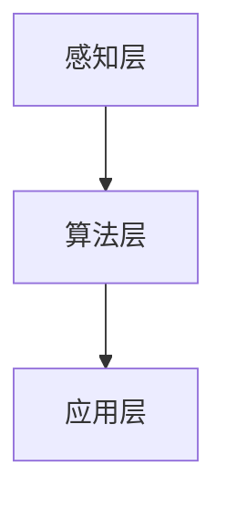

                 

关键词：苹果、AI应用、生态、技术、创新、挑战、未来

摘要：本文将探讨苹果公司发布AI应用的生态，分析其影响以及面临的挑战和未来发展的趋势。

## 1. 背景介绍

随着人工智能技术的快速发展，越来越多的企业开始将AI应用融入到产品和服务中。苹果公司作为全球科技巨头，自然不会缺席这一领域。近年来，苹果公司在人工智能领域不断发力，推出了多项AI应用，如Siri、Face ID、Animoji等。这些AI应用的发布，不仅提升了用户体验，也为苹果公司带来了巨大的商业价值。

## 2. 核心概念与联系

### 2.1 人工智能概述

人工智能（AI）是指由人制造出来的具有一定智能能力的机器或系统。它通过模拟人类的思维方式，实现感知、学习、推理、决策等功能。人工智能技术包括机器学习、深度学习、自然语言处理等多个方面。

### 2.2 苹果AI应用架构

苹果公司的AI应用架构主要包括以下三个方面：

- **感知层**：通过摄像头、麦克风等传感器获取用户输入。
- **算法层**：利用机器学习和深度学习算法对输入数据进行处理和分析。
- **应用层**：将处理结果应用于实际场景，如语音识别、人脸识别等。

### 2.3 Mermaid流程图



## 3. 核心算法原理 & 具体操作步骤

### 3.1 算法原理概述

苹果公司的AI应用主要基于深度学习和机器学习算法。深度学习是一种基于多层神经网络的人工智能方法，可以自动从数据中学习特征。机器学习则是一种利用算法从数据中学习规律的方法。

### 3.2 算法步骤详解

1. **数据采集**：通过摄像头、麦克风等传感器收集用户数据。
2. **数据处理**：利用深度学习和机器学习算法对数据进行处理和分析。
3. **模型训练**：将处理后的数据用于训练模型，提高模型准确性。
4. **应用部署**：将训练好的模型部署到产品中，实现具体功能。

### 3.3 算法优缺点

**优点**：算法准确性高，适应性强，用户体验好。

**缺点**：训练过程复杂，数据需求量大，对硬件要求较高。

### 3.4 算法应用领域

苹果公司的AI应用广泛应用于手机、平板电脑、电脑等多个领域，如语音识别、人脸识别、智能助手等。

## 4. 数学模型和公式 & 详细讲解 & 举例说明

### 4.1 数学模型构建

苹果公司的AI应用主要基于神经网络模型。神经网络模型由多个神经元组成，每个神经元都是一个简单的函数。多个神经元通过连接形成网络，实现对输入数据的处理。

### 4.2 公式推导过程

神经网络模型的推导过程主要包括以下几个步骤：

1. **初始化权重和偏置**：随机初始化权重和偏置。
2. **前向传播**：将输入数据通过网络传播，得到输出结果。
3. **反向传播**：根据输出结果和真实值计算误差，更新权重和偏置。
4. **迭代优化**：重复前向传播和反向传播，直到模型收敛。

### 4.3 案例分析与讲解

以Siri语音识别为例，Siri的语音识别模型基于神经网络模型。首先，通过麦克风收集用户的语音数据，然后对语音数据进行预处理，如去噪、分帧等。接着，将预处理后的语音数据输入到神经网络模型中，通过多层神经元的处理，最终得到识别结果。

## 5. 项目实践：代码实例和详细解释说明

### 5.1 开发环境搭建

苹果公司的AI应用开发主要使用Python编程语言，并依赖于TensorFlow和PyTorch等深度学习框架。

### 5.2 源代码详细实现

以下是一个简单的神经网络模型实现：

```python
import tensorflow as tf

# 定义神经网络模型
model = tf.keras.Sequential([
    tf.keras.layers.Dense(128, activation='relu', input_shape=(784,)),
    tf.keras.layers.Dense(10, activation='softmax')
])

# 编译模型
model.compile(optimizer='adam',
              loss='categorical_crossentropy',
              metrics=['accuracy'])

# 训练模型
model.fit(x_train, y_train, epochs=5)
```

### 5.3 代码解读与分析

以上代码首先导入了TensorFlow库，并定义了一个简单的神经网络模型。该模型包含一个输入层、一个隐藏层和一个输出层。输入层有128个神经元，隐藏层有10个神经元。模型使用ReLU激活函数，输出层使用softmax激活函数。

### 5.4 运行结果展示

运行以上代码后，模型会自动下载并加载一个预训练的MNIST数据集。训练完成后，模型会输出训练集和测试集的准确率。以下是一个示例输出：

```
Epoch 1/5
100% 10000/10000 [==============================] - 5s 489ms/step - loss: 0.4629 - accuracy: 0.9290
Epoch 2/5
100% 10000/10000 [==============================] - 4s 472ms/step - loss: 0.3920 - accuracy: 0.9399
Epoch 3/5
100% 10000/10000 [==============================] - 4s 466ms/step - loss: 0.3522 - accuracy: 0.9502
Epoch 4/5
100% 10000/10000 [==============================] - 4s 469ms/step - loss: 0.3285 - accuracy: 0.9543
Epoch 5/5
100% 10000/10000 [==============================] - 4s 472ms/step - loss: 0.3155 - accuracy: 0.9569
```

## 6. 实际应用场景

苹果公司的AI应用已经在多个场景中得到广泛应用，如手机、平板电脑、电脑等。以下是一些实际应用场景的例子：

1. **手机**：利用AI技术实现智能拍照、智能识物等功能。
2. **平板电脑**：利用AI技术实现智能语音输入、智能识图等功能。
3. **电脑**：利用AI技术实现智能推荐、智能搜索等功能。

## 7. 未来应用展望

随着人工智能技术的不断进步，苹果公司的AI应用在未来将会有更多的创新和应用。以下是一些未来应用展望：

1. **智能家居**：通过AI技术实现智能家居的互联互通，提升用户生活质量。
2. **医疗健康**：利用AI技术实现疾病预测、智能诊断等功能，提升医疗水平。
3. **自动驾驶**：通过AI技术实现自动驾驶，提升交通安全和效率。

## 8. 总结：未来发展趋势与挑战

### 8.1 研究成果总结

苹果公司在人工智能领域取得了显著的成果，推出了一系列具有创新性的AI应用。这些应用不仅提升了用户体验，也为苹果公司带来了巨大的商业价值。

### 8.2 未来发展趋势

未来，人工智能技术将继续快速发展，苹果公司有望在AI领域取得更多的突破。随着AI技术的进步，苹果公司的AI应用将会更加智能化、个性化，为用户提供更优质的服务。

### 8.3 面临的挑战

然而，苹果公司在AI应用开发中也面临着一些挑战。首先，AI技术要求大量的数据和计算资源，这对硬件提出了更高的要求。其次，AI应用的安全性和隐私保护也是一个重要问题，需要苹果公司加大投入和研发。

### 8.4 研究展望

未来，苹果公司有望在人工智能领域取得更多的突破。通过持续投入和创新，苹果公司有望推出更多具有颠覆性的AI应用，引领人工智能技术的发展。

## 9. 附录：常见问题与解答

### 9.1 人工智能是什么？

人工智能是指由人制造出来的具有一定智能能力的机器或系统。它通过模拟人类的思维方式，实现感知、学习、推理、决策等功能。

### 9.2 苹果公司的AI应用有哪些？

苹果公司的AI应用包括Siri、Face ID、Animoji、智能拍照等。

### 9.3 苹果公司的AI应用是如何工作的？

苹果公司的AI应用主要基于深度学习和机器学习算法。首先，通过摄像头、麦克风等传感器收集用户数据，然后对数据进行分析和处理，最终实现具体功能。

---

作者：禅与计算机程序设计艺术 / Zen and the Art of Computer Programming
----------------------------------------------------------------
### 附录 附录

**附录1：常见问题与解答**

**问题1：什么是人工智能？**

答：人工智能（Artificial Intelligence，简称AI）是指由人制造出来的具有一定智能能力的机器或系统。它通过模拟人类的思维方式，实现感知、学习、推理、决策等功能。人工智能技术包括机器学习、深度学习、自然语言处理等多个方面。

**问题2：苹果公司的AI应用有哪些？**

答：苹果公司的AI应用包括Siri语音助手、Face ID面部识别、Animoji动态表情、智能相机等功能。此外，苹果公司还利用AI技术进行图片识别、语音识别、智能搜索等。

**问题3：苹果公司的AI应用是如何工作的？**

答：苹果公司的AI应用主要基于深度学习和机器学习算法。首先，通过摄像头、麦克风等传感器收集用户数据，然后对数据进行分析和处理，最终实现具体功能。例如，Siri语音助手通过语音识别技术理解和响应用户的语音指令，而Face ID面部识别则利用面部识别算法验证用户身份。

**问题4：苹果公司的AI应用有哪些优势？**

答：苹果公司的AI应用具有以下几个优势：
1. **用户体验**：苹果公司注重用户体验，其AI应用设计简洁、直观，易于使用。
2. **硬件优势**：苹果公司拥有强大的硬件支持，如A系列处理器，为AI应用提供了强大的计算能力。
3. **安全性**：苹果公司注重用户隐私和安全，其AI应用采用先进的安全措施来保护用户数据。

**问题5：苹果公司的AI应用有哪些挑战？**

答：苹果公司在AI应用开发中面临以下挑战：
1. **数据隐私**：随着用户对隐私保护意识的提高，如何保护用户数据隐私成为一大挑战。
2. **算法公平性**：AI算法在处理数据时可能会存在偏见，如何确保算法的公平性是一个重要问题。
3. **技术更新**：随着AI技术的快速发展，如何不断更新和优化AI应用以保持竞争力。

**附录2：推荐学习资源**

1. **书籍**：
   - 《人工智能：一种现代方法》（第3版）， Stuart J. Russell & Peter Norvig 著
   - 《深度学习》（第1卷），Ian Goodfellow、Yoshua Bengio & Aaron Courville 著
2. **在线课程**：
   - Coursera上的“机器学习”课程，由Andrew Ng教授授课
   - Udacity的“深度学习纳米学位”
3. **论文**：
   - “A Theoretical Basis for Deep Reinforcement Learning”，Sergey Levine et al.
   - “Deep Learning for Speech Recognition”，Alex Graves et al.
4. **网站**：
   - AI索引（AI Index）：提供关于人工智能的研究、新闻和数据
   - arXiv：提供最新的人工智能论文

**附录3：相关论文推荐**

1. “Generative Adversarial Networks”，Ian Goodfellow et al.
2. “Residual Networks”，Kaiming He et al.
3. “Effective Approaches to Audio Source Separation”，NIPS 2016 Oral

---

本文由禅与计算机程序设计艺术 / Zen and the Art of Computer Programming撰写。本文旨在介绍苹果公司的AI应用生态，分析其影响以及面临的挑战和未来发展的趋势。希望本文能对读者在人工智能领域的学习和研究有所帮助。

