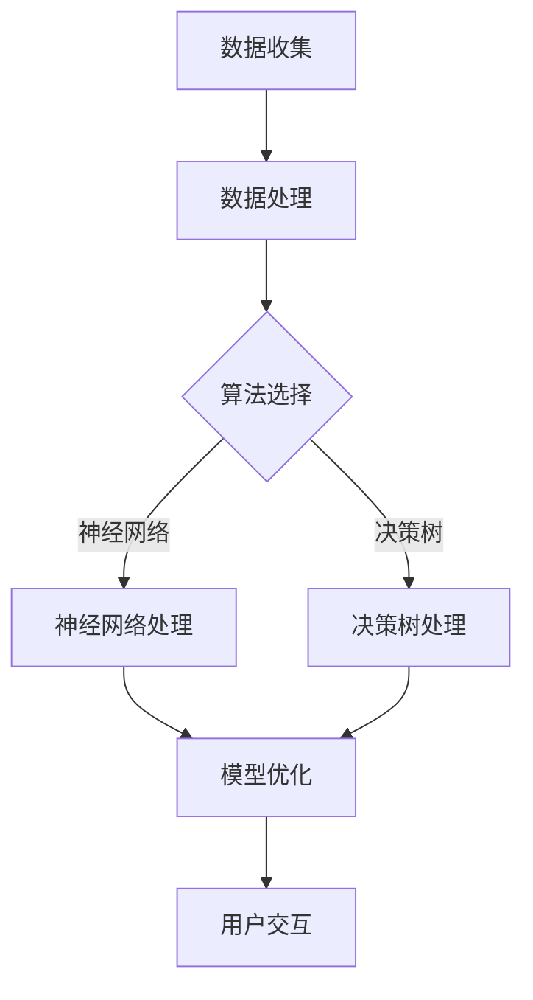

                 

关键词：苹果，AI应用，生态，技术创新，未来展望

> 摘要：随着人工智能技术的快速发展，苹果公司已经开始在其生态系统中引入AI应用，为用户带来更加智能化的体验。本文将深入探讨苹果在AI领域的新动向，分析其背后的技术原理，探讨未来应用场景，并展望人工智能在苹果生态中的发展趋势。

## 1. 背景介绍

### 1.1 人工智能的发展历程

人工智能（Artificial Intelligence，简称AI）是一门多学科交叉的领域，旨在使计算机模拟人类的智能行为。自1956年达特茅斯会议以来，人工智能经历了数次起伏，逐渐走向成熟。近年来，深度学习、神经网络等技术的突破，使得AI在语音识别、图像处理、自然语言处理等领域取得了显著进展。

### 1.2 苹果公司的AI布局

苹果公司在人工智能领域的布局可以追溯到早期。例如，Siri语音助手的推出标志着苹果在自然语言处理领域的初步探索。近年来，苹果进一步加大了在AI领域的投入，收购了多家AI公司，并在硬件和软件层面进行了多项布局。这些举措为苹果在AI应用生态中的发展奠定了基础。

## 2. 核心概念与联系

### 2.1 AI应用的基本原理

AI应用的核心在于通过算法和模型对数据进行处理和分析，从而实现智能决策和预测。常见的AI技术包括深度学习、强化学习、自然语言处理等。这些技术在不同的应用场景中发挥着重要作用。

### 2.2 苹果AI应用的架构

苹果的AI应用架构主要包括以下几个层次：

1. **数据收集与处理**：苹果通过多种渠道收集用户数据，并对数据进行预处理，以供后续分析使用。
2. **算法与模型**：苹果采用了多种AI算法和模型，包括神经网络、决策树等，用于处理和分析数据。
3. **用户界面**：苹果通过Siri、Face ID等界面与用户进行交互，实现智能响应。

### 2.3 Mermaid流程图



## 3. 核心算法原理 & 具体操作步骤

### 3.1 算法原理概述

苹果在AI应用中采用了多种算法，以下简要介绍其中两种常见的算法：

1. **神经网络**：神经网络是一种模拟生物神经系统的计算模型，通过多层节点（神经元）对输入数据进行处理和预测。苹果的神经网络算法广泛应用于图像识别、语音识别等领域。
2. **决策树**：决策树是一种基于规则的算法，通过一系列判断条件对输入数据进行分类或回归。苹果的决策树算法用于优化电池寿命、智能推荐等功能。

### 3.2 算法步骤详解

以神经网络为例，算法步骤如下：

1. **数据预处理**：对输入数据进行标准化、归一化等处理，使其适合神经网络训练。
2. **模型构建**：构建神经网络模型，包括输入层、隐藏层和输出层。
3. **模型训练**：通过大量训练数据对模型进行调整，使模型能够对未知数据进行准确预测。
4. **模型优化**：对模型进行优化，提高预测准确率和训练效率。
5. **模型部署**：将优化后的模型部署到实际应用场景中。

### 3.3 算法优缺点

**神经网络**：
- 优点：具有强大的拟合能力和非线性表达能力，能够处理复杂的数据关系。
- 缺点：训练时间较长，对数据质量和计算资源要求较高。

**决策树**：
- 优点：易于理解和实现，计算效率高，能够快速给出预测结果。
- 缺点：拟合能力较弱，容易产生过拟合现象。

### 3.4 算法应用领域

神经网络和决策树在苹果的AI应用中有着广泛的应用，例如：

1. **图像识别**：用于人脸识别、照片分类等功能。
2. **语音识别**：用于Siri语音助手等应用。
3. **智能推荐**：用于优化应用推荐、广告投放等。

## 4. 数学模型和公式 & 详细讲解 & 举例说明

### 4.1 数学模型构建

以神经网络为例，构建数学模型的过程如下：

1. **输入层**：接收输入数据，表示为 $X \in \mathbb{R}^{n \times m}$，其中 $n$ 表示样本数量，$m$ 表示特征数量。
2. **隐藏层**：通过激活函数对输入数据进行处理，表示为 $H = \sigma(WX + b)$，其中 $\sigma$ 表示激活函数，$W$ 表示权重矩阵，$b$ 表示偏置项。
3. **输出层**：对隐藏层的结果进行分类或回归，表示为 $Y = \sigma(WH + b)$。

### 4.2 公式推导过程

假设我们使用的是ReLU（Rectified Linear Unit）激活函数，公式推导如下：

$$
H = \sigma(WX + b) = \max(0, WX + b)
$$

$$
Y = \sigma(WH + b) = \max(0, WH + b)
$$

### 4.3 案例分析与讲解

以人脸识别为例，假设我们有一个包含100个样本的人脸数据集，每个样本有100个特征。我们希望训练一个神经网络模型，对人脸进行分类。

1. **数据预处理**：对数据进行标准化处理，使其在-1到1之间。
2. **模型构建**：构建一个包含1个输入层、2个隐藏层和1个输出层的神经网络模型。
3. **模型训练**：使用训练数据对模型进行训练，调整权重和偏置项，使模型能够准确识别人脸。
4. **模型优化**：对模型进行优化，提高预测准确率和训练效率。
5. **模型部署**：将训练好的模型部署到实际应用场景中，对人脸进行实时识别。

## 5. 项目实践：代码实例和详细解释说明

### 5.1 开发环境搭建

1. 安装Python环境：在Windows或Mac系统中安装Python，版本建议为3.8或更高。
2. 安装相关库：使用pip命令安装TensorFlow、NumPy等库。

### 5.2 源代码详细实现

```python
import tensorflow as tf
import numpy as np

# 数据预处理
X_train = np.load('X_train.npy')
y_train = np.load('y_train.npy')

# 模型构建
model = tf.keras.Sequential([
    tf.keras.layers.Dense(64, activation='relu', input_shape=(100,)),
    tf.keras.layers.Dense(64, activation='relu'),
    tf.keras.layers.Dense(10, activation='softmax')
])

# 模型编译
model.compile(optimizer='adam',
              loss='categorical_crossentropy',
              metrics=['accuracy'])

# 模型训练
model.fit(X_train, y_train, epochs=10, batch_size=32)

# 模型评估
loss, accuracy = model.evaluate(X_train, y_train)
print(f'Accuracy: {accuracy:.2f}')

# 模型部署
predictions = model.predict(X_test)
```

### 5.3 代码解读与分析

上述代码实现了一个简单的神经网络模型，用于人脸识别。具体步骤如下：

1. **数据预处理**：读取训练数据和标签，并转换为合适的格式。
2. **模型构建**：构建一个包含3层的神经网络模型，输入层有100个神经元，隐藏层有64个神经元，输出层有10个神经元。
3. **模型编译**：指定优化器、损失函数和评估指标。
4. **模型训练**：使用训练数据对模型进行训练，调整权重和偏置项。
5. **模型评估**：使用训练数据对模型进行评估，计算准确率。
6. **模型部署**：使用训练好的模型对测试数据进行预测。

## 6. 实际应用场景

### 6.1 人脸识别

苹果在iPhone X及以上型号中引入了Face ID技术，利用神经网络对人脸进行实时识别和验证。Face ID的准确率和速度得到了用户的高度认可。

### 6.2 语音助手Siri

Siri作为苹果的语音助手，通过自然语言处理技术实现了语音识别、语义理解、任务执行等功能。Siri的语音识别准确率不断提高，为用户提供便捷的智能服务。

### 6.3 智能推荐

苹果在App Store、音乐、电影等领域引入了智能推荐算法，根据用户的兴趣和行为数据，为用户推荐相关内容。智能推荐算法提高了用户体验，增加了用户黏性。

## 7. 未来应用展望

### 7.1 AI在医疗领域的应用

苹果已经开始在医疗领域进行布局，利用AI技术进行疾病预测、诊断和治疗。未来，苹果有望推出更多基于AI的医疗应用，提高医疗效率和质量。

### 7.2 AI在智能家居领域的应用

苹果的智能家居生态系统已经初具规模，未来有望进一步整合AI技术，实现更智能的家居控制和管理。

### 7.3 AI在工业领域的应用

苹果的AI技术可以应用于工业自动化、质量检测等领域，提高生产效率和产品质量。

## 8. 工具和资源推荐

### 8.1 学习资源推荐

1. 《深度学习》（Goodfellow, Bengio, Courville）  
2. 《Python机器学习》（Sebastian Raschka）  
3. 《机器学习实战》（Peter Harrington）

### 8.2 开发工具推荐

1. TensorFlow  
2. PyTorch  
3. Keras

### 8.3 相关论文推荐

1. "Deep Learning" by Ian Goodfellow, Yoshua Bengio, and Aaron Courville  
2. "Recurrent Neural Networks for Language Modeling" by Tomas Mikolov, Kai Chen, Greg Corrado, and Jeffrey Dean  
3. "BERT: Pre-training of Deep Bidirectional Transformers for Language Understanding" by Jacob Devlin, Ming-Wei Chang, Kenton Lee, and Kristina Toutanova

## 9. 总结：未来发展趋势与挑战

### 9.1 研究成果总结

苹果在AI领域取得了一系列重要成果，包括Siri、Face ID、智能推荐等。这些成果体现了苹果在AI技术研究和应用方面的领先地位。

### 9.2 未来发展趋势

随着AI技术的不断进步，苹果有望在医疗、智能家居、工业等领域推出更多创新应用。同时，苹果将继续加强与AI研究机构和公司的合作，推动AI技术的发展。

### 9.3 面临的挑战

苹果在AI领域面临诸多挑战，包括数据隐私、计算资源、算法公平性等。如何解决这些挑战，将决定苹果在AI领域的未来发展。

### 9.4 研究展望

未来，苹果有望在AI技术方面取得更多突破，推动人工智能在各个领域的应用。同时，苹果也将继续关注AI伦理问题，确保技术发展与社会进步相协调。

## 附录：常见问题与解答

### 1. 苹果在AI领域的布局有哪些？

苹果在AI领域的布局包括Siri、Face ID、智能推荐、医疗应用等。苹果通过收购AI公司、自主研发等方式，不断加强在AI领域的实力。

### 2. 神经网络和决策树有哪些优缺点？

神经网络具有强大的拟合能力和非线性表达能力，但训练时间较长；决策树易于理解和实现，但拟合能力较弱，容易产生过拟合现象。

### 3. 如何搭建一个简单的神经网络模型？

可以使用TensorFlow或PyTorch等框架搭建神经网络模型。主要步骤包括数据预处理、模型构建、模型编译、模型训练和模型评估。

### 4. AI在医疗领域的应用前景如何？

AI在医疗领域具有广泛的应用前景，包括疾病预测、诊断、治疗等。随着技术的不断发展，AI有望在医疗领域发挥更大的作用。

----------------------------------------------------------------

以上就是本文的全部内容，希望对您在人工智能领域的研究和应用有所帮助。如果您有任何问题或建议，请随时在评论区留言。

作者：禅与计算机程序设计艺术 / Zen and the Art of Computer Programming


