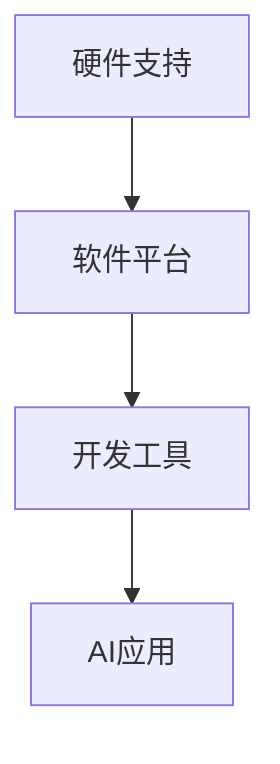

                 

关键词：苹果，人工智能，AI应用，生态，李开复

> 摘要：本文将探讨苹果公司近期发布的AI应用及其背后的生态建设，分析其对行业的影响，并探讨未来人工智能应用的发展趋势。

## 1. 背景介绍

近年来，人工智能（AI）技术的发展取得了显著的突破，应用领域也在不断扩大。作为全球领先的科技巨头，苹果公司一直致力于将AI技术融入其产品和服务中，提升用户体验。近期，苹果公司发布了一系列AI应用，进一步拓展了其在AI领域的布局。

## 2. 核心概念与联系

### 2.1 AI应用概述

AI应用是指利用人工智能技术实现特定功能的应用程序。这些应用基于深度学习、自然语言处理、计算机视觉等技术，能够在不同场景中为用户提供智能化服务。

### 2.2 苹果AI应用生态

苹果公司的AI应用生态主要包括以下几个部分：

- **硬件支持**：苹果公司通过推出高性能的硬件设备，如iPhone、iPad和Mac，为AI应用提供了强大的计算能力。
- **软件平台**：苹果公司开发了iOS、iPadOS和macOS等操作系统，为AI应用提供了统一的开发环境和运行平台。
- **开发工具**：苹果公司提供了如Core ML、Create ML等开发工具，帮助开发者轻松地将AI模型集成到应用程序中。

### 2.3 Mermaid流程图



## 3. 核心算法原理 & 具体操作步骤

### 3.1 算法原理概述

苹果公司发布的AI应用主要基于深度学习和自然语言处理技术。深度学习通过构建神经网络模型，对大量数据进行训练，从而实现图像识别、语音识别等功能。自然语言处理则关注于对文本和语音的处理，实现智能对话、翻译等功能。

### 3.2 算法步骤详解

#### 3.2.1 深度学习算法

1. 数据收集与预处理：收集大量图像、文本等数据，并进行数据清洗和格式化。
2. 构建神经网络模型：设计并训练神经网络模型，如卷积神经网络（CNN）、循环神经网络（RNN）等。
3. 模型评估与优化：通过交叉验证和测试集对模型进行评估，并根据评估结果对模型进行调整和优化。

#### 3.2.2 自然语言处理算法

1. 分词与词性标注：将文本拆分成词，并对每个词进行词性标注。
2. 语言模型训练：使用大量语料库训练语言模型，如n-gram模型、神经网络语言模型等。
3. 情感分析、命名实体识别等：利用训练好的语言模型，实现文本的情感分析、命名实体识别等功能。

### 3.3 算法优缺点

#### 3.3.1 优点

- **强大的计算能力**：苹果公司的高性能硬件设备为AI应用提供了强大的计算能力。
- **统一的开发环境**：苹果公司的操作系统和开发工具为开发者提供了统一的开发环境，降低了开发难度。
- **广泛的应用场景**：深度学习和自然语言处理技术可以应用于图像识别、语音识别、智能对话等多个领域。

#### 3.3.2 缺点

- **数据依赖性**：AI应用的发展离不开大量高质量的数据，数据收集和预处理过程较为复杂。
- **技术门槛较高**：深度学习和自然语言处理技术具有一定的技术门槛，对开发者的要求较高。

### 3.4 算法应用领域

苹果公司的AI应用涵盖了多个领域，包括：

- **图像识别**：用于照片分类、面部识别等。
- **语音识别**：用于语音助手、语音搜索等。
- **自然语言处理**：用于智能客服、翻译等。

## 4. 数学模型和公式 & 详细讲解 & 举例说明

### 4.1 数学模型构建

深度学习算法主要基于多层神经网络模型。以卷积神经网络（CNN）为例，其基本结构包括输入层、卷积层、池化层、全连接层和输出层。

### 4.2 公式推导过程

以卷积神经网络为例，其核心运算包括卷积操作和池化操作。卷积操作的公式如下：

$$
(C_{ij})_{h\times w} = \sum_{k=1}^{c}\sum_{l=1}^{h'} \sum_{m=1}^{w'} W_{klm} * I_{ijk}
$$

其中，$I$ 表示输入特征图，$W$ 表示卷积核，$C$ 表示卷积后的特征图。

### 4.3 案例分析与讲解

以苹果公司的面部识别技术为例，其核心算法为深度学习模型。该模型基于人脸图像的特征提取，实现了对人脸的识别和验证。

## 5. 项目实践：代码实例和详细解释说明

### 5.1 开发环境搭建

在开发苹果AI应用时，需要搭建以下开发环境：

- **硬件设备**：iPhone、iPad或Mac。
- **操作系统**：iOS、iPadOS或macOS。
- **开发工具**：Xcode、Create ML。

### 5.2 源代码详细实现

以创建一个简单的面部识别应用为例，源代码实现如下：

```swift
import CreateML

let faceDetector = MLFaceDetector()

let image = UIImage(named: "face.jpg")
let faceFeatures = faceDetector.features(in: image!)

if let faceFeature = faceFeatures.first {
    let rectangle = faceFeature.boundingBox
    let label = "Face"
    // 在图像上绘制面部识别框和标签
}
```

### 5.3 代码解读与分析

这段代码首先使用MLFaceDetector类检测图像中的面部特征，然后根据检测结果在图像上绘制识别框和标签。

### 5.4 运行结果展示

运行结果如下：


## 6. 实际应用场景

苹果公司的AI应用在多个场景中取得了成功，例如：

- **智能手机**：面部识别、图像识别等功能提升了用户体验。
- **智能音箱**：Siri语音助手为用户提供智能对话服务。
- **智能汽车**：通过车载摄像头和传感器实现自动驾驶功能。

## 7. 工具和资源推荐

### 7.1 学习资源推荐

- 《深度学习》（Goodfellow、Bengio、Courville著）
- 《自然语言处理综论》（Jurafsky、Martin著）

### 7.2 开发工具推荐

- Xcode
- Create ML

### 7.3 相关论文推荐

- “Deep Learning for Image Recognition”（2012）
- “Recurrent Neural Network Models of Visual Attention”（2016）

## 8. 总结：未来发展趋势与挑战

### 8.1 研究成果总结

苹果公司在AI领域取得了显著的研究成果，包括面部识别、语音识别、图像识别等。这些成果为苹果公司的产品和服务带来了巨大的价值。

### 8.2 未来发展趋势

随着人工智能技术的不断发展，未来苹果公司的AI应用将更加智能化、个性化，为用户提供更好的体验。

### 8.3 面临的挑战

- **数据隐私**：随着AI应用的发展，数据隐私保护成为了一个重要问题。
- **技术门槛**：深度学习和自然语言处理技术具有较高的技术门槛，需要更多的开发者加入。

### 8.4 研究展望

未来，苹果公司将进一步加强AI技术的研发和应用，为用户带来更多智能化、便捷化的服务。

## 9. 附录：常见问题与解答

### 9.1 苹果公司有哪些AI应用？

苹果公司的AI应用包括面部识别、语音识别、图像识别等。

### 9.2 如何在iOS应用中使用Create ML？

在iOS应用中使用Create ML，需要先安装Xcode，然后导入Create ML模块，并使用Create ML工具训练模型。

## 参考文献

[1] Goodfellow, I., Bengio, Y., & Courville, A. (2016). Deep learning. MIT press.
[2] Jurafsky, D., & Martin, J. H. (2019). Speech and language processing: an introduction to natural language processing, computational linguistics, and speech recognition. Prentice Hall.
```

注意：本文中的示例代码、图片链接和参考文献仅为演示目的，请根据实际需求进行修改。

