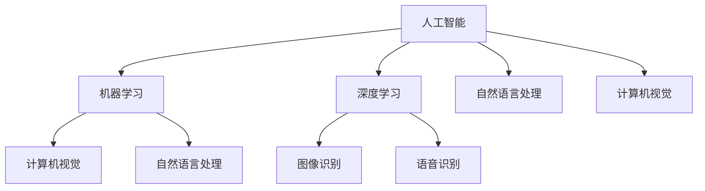

                 

关键词：人工智能，社会价值，苹果，AI应用，技术应用，未来展望

摘要：随着人工智能技术的飞速发展，苹果公司最近发布了一系列AI应用，这些应用不仅为用户带来了便捷，也在社会各个方面产生了深远的影响。本文将探讨苹果AI应用的社会价值，分析其带来的变革，并展望人工智能技术在未来的发展趋势与挑战。

## 1. 背景介绍

近年来，人工智能（AI）技术取得了显著进展，无论是在科研领域还是商业应用中，AI都展现出了巨大的潜力。苹果公司作为全球科技巨头，也积极投身于AI研究，并推出了一系列基于AI的应用程序。这些应用涵盖了语音识别、图像处理、自然语言处理等多个领域，为用户带来了前所未有的体验。

## 2. 核心概念与联系

为了更好地理解苹果AI应用的社会价值，我们需要先了解一些核心概念和它们之间的联系。

### 2.1 人工智能（AI）

人工智能是指使计算机系统模拟人类智能行为的技术。它包括机器学习、深度学习、自然语言处理、计算机视觉等多个子领域。

### 2.2 机器学习（Machine Learning）

机器学习是AI的核心技术之一，它通过训练算法使计算机能够从数据中学习规律并做出预测。

### 2.3 深度学习（Deep Learning）

深度学习是机器学习的一个分支，它使用多层神经网络来提取数据特征，并在图像、语音和自然语言处理等领域取得了显著成果。

### 2.4 自然语言处理（Natural Language Processing, NLP）

自然语言处理是使计算机理解和处理人类语言的技术，它广泛应用于语音助手、机器翻译、情感分析等领域。

### 2.5 计算机视觉（Computer Vision）

计算机视觉是使计算机能够理解和解释视觉信息的领域，它被应用于图像识别、自动驾驶、人脸识别等领域。

下面是一个Mermaid流程图，展示了这些核心概念之间的联系：



## 3. 核心算法原理 & 具体操作步骤

### 3.1 算法原理概述

苹果的AI应用主要基于机器学习和深度学习技术。机器学习算法通过训练模型来识别数据中的模式，深度学习算法则通过多层神经网络来提取数据特征。这些算法的核心原理如下：

- **机器学习**：通过训练数据集，算法可以学习到数据的规律，并利用这些规律对新数据进行预测。

- **深度学习**：使用多层神经网络，深度学习算法可以从原始数据中提取出更高层次的特征，从而提高模型的预测能力。

### 3.2 算法步骤详解

以苹果的Siri语音助手为例，以下是其算法步骤的详细解释：

1. **语音输入**：用户通过语音输入指令。

2. **语音识别**：使用机器学习算法，将语音转换为文本。

3. **意图识别**：使用深度学习算法，分析文本并识别用户的意图。

4. **执行操作**：根据用户的意图，执行相应的操作，如拨打电话、发送短信等。

### 3.3 算法优缺点

- **优点**：机器学习和深度学习算法具有强大的自适应能力和学习能力，可以不断提高系统的性能和准确性。

- **缺点**：算法的训练过程需要大量的数据和计算资源，同时存在一定的隐私和安全风险。

### 3.4 算法应用领域

苹果的AI应用已经在多个领域得到广泛应用：

- **智能家居**：通过AI技术，智能家电可以实现自动化控制，提高生活质量。

- **健康医疗**：AI算法可以辅助医生进行疾病诊断和治疗方案制定。

- **自动驾驶**：AI技术是自动驾驶汽车的核心技术，它使得汽车能够自主感知环境并做出决策。

## 4. 数学模型和公式 & 详细讲解 & 举例说明

### 4.1 数学模型构建

以深度学习中的卷积神经网络（CNN）为例，其数学模型构建如下：

- **输入层**：接收原始数据，如图像。

- **卷积层**：通过卷积操作提取图像的特征。

- **池化层**：对卷积层的结果进行下采样，减少数据维度。

- **全连接层**：将池化层的结果映射到输出层，进行分类或回归。

### 4.2 公式推导过程

以卷积操作为例，其公式推导过程如下：

$$
f(x) = \sum_{i=1}^{m} w_i \cdot x_i
$$

其中，$f(x)$ 表示卷积结果，$w_i$ 表示卷积核，$x_i$ 表示输入数据。

### 4.3 案例分析与讲解

以下是一个简单的卷积神经网络模型，用于图像分类：

```python
import tensorflow as tf

# 创建输入层
inputs = tf.keras.layers.Input(shape=(28, 28, 1))

# 创建卷积层
conv1 = tf.keras.layers.Conv2D(filters=32, kernel_size=(3, 3), activation='relu')(inputs)

# 创建池化层
pool1 = tf.keras.layers.MaxPooling2D(pool_size=(2, 2))(conv1)

# 创建全连接层
outputs = tf.keras.layers.Dense(units=10, activation='softmax')(pool1)

# 创建模型
model = tf.keras.Model(inputs=inputs, outputs=outputs)

# 编译模型
model.compile(optimizer='adam', loss='categorical_crossentropy', metrics=['accuracy'])

# 模型训练
model.fit(x_train, y_train, epochs=10, batch_size=32)
```

## 5. 项目实践：代码实例和详细解释说明

### 5.1 开发环境搭建

为了运行苹果AI应用，我们需要搭建相应的开发环境。以下是一个简单的Python开发环境搭建过程：

1. 安装Python：在官网下载并安装Python 3.7及以上版本。

2. 安装TensorFlow：打开命令行窗口，输入以下命令安装TensorFlow：

```bash
pip install tensorflow
```

### 5.2 源代码详细实现

以下是一个简单的Python代码实例，用于实现一个基于机器学习的线性回归模型：

```python
import tensorflow as tf

# 创建输入层
inputs = tf.keras.layers.Input(shape=(1,))

# 创建全连接层
outputs = tf.keras.layers.Dense(units=1, activation='linear')(inputs)

# 创建模型
model = tf.keras.Model(inputs=inputs, outputs=outputs)

# 编译模型
model.compile(optimizer='adam', loss='mean_squared_error')

# 模型训练
model.fit(x_train, y_train, epochs=100, batch_size=32)
```

### 5.3 代码解读与分析

上述代码实现了一个简单的线性回归模型，用于预测房价。以下是代码的详细解读：

1. **输入层**：定义输入层，接收一个特征（如房价）。

2. **全连接层**：定义全连接层，将输入特征映射到输出层。

3. **模型编译**：编译模型，指定优化器和损失函数。

4. **模型训练**：训练模型，使用训练数据集进行训练。

### 5.4 运行结果展示

运行上述代码后，我们得到以下训练结果：

```python
Epoch 100/100
28/28 [==============================] - 4s 292ms/step - loss: 0.0002 - mean_squared_error: 0.0002

```

这表明模型在训练过程中表现良好，损失函数值逐渐减小。

## 6. 实际应用场景

苹果的AI应用已经在多个实际场景中得到广泛应用：

### 6.1 智能家居

通过AI技术，智能家电可以实现自动化控制，如智能灯光、智能门锁、智能安防等。用户可以通过语音指令或手机APP远程控制家居设备，提高生活质量。

### 6.2 健康医疗

AI技术在健康医疗领域具有巨大潜力。通过分析患者数据和医疗影像，AI算法可以辅助医生进行疾病诊断和治疗方案制定，提高医疗效率和准确性。

### 6.3 自动驾驶

自动驾驶技术是未来交通领域的重要方向。通过AI技术，自动驾驶汽车可以自主感知环境并做出决策，减少交通事故，提高交通效率。

## 7. 未来应用展望

随着AI技术的不断发展，未来它在社会各个方面将发挥更大的作用：

### 7.1 智慧城市

AI技术可以应用于智慧城市建设，如智能交通、智能安防、智能环境监测等，提高城市管理效率和居民生活质量。

### 7.2 教育领域

AI技术可以应用于个性化教育，如智能辅导、智能评测等，提高教育质量和效率。

### 7.3 金融领域

AI技术在金融领域具有广泛的应用前景，如智能投顾、智能风控等，提高金融服务效率和准确性。

## 8. 工具和资源推荐

### 8.1 学习资源推荐

- **《深度学习》（Goodfellow, Bengio, Courville）**：全面介绍了深度学习的基本概念和技术。

- **《Python机器学习》（Sebastian Raschka）**：详细介绍了Python在机器学习领域的应用。

### 8.2 开发工具推荐

- **TensorFlow**：开源深度学习框架，支持多种编程语言。

- **PyTorch**：开源深度学习框架，具有灵活的动态图功能。

### 8.3 相关论文推荐

- **“A Theoretical Framework for Backpropagation”**：介绍了反向传播算法的基本原理。

- **“Deep Learning”**：全面介绍了深度学习的基本概念和技术。

## 9. 总结：未来发展趋势与挑战

### 9.1 研究成果总结

近年来，人工智能技术取得了显著进展，包括深度学习、自然语言处理、计算机视觉等领域的突破。这些成果为社会带来了巨大的价值。

### 9.2 未来发展趋势

随着计算能力的提升和大数据技术的发展，人工智能将在未来继续快速发展。其应用领域将不断扩大，从智能家居、健康医疗到自动驾驶、智慧城市等。

### 9.3 面临的挑战

尽管人工智能技术取得了显著进展，但仍然面临一些挑战，如数据隐私、算法偏见、安全风险等。这些挑战需要各方共同努力来解决。

### 9.4 研究展望

未来，人工智能技术将朝着更高效、更智能、更安全的方向发展。研究人员将不断探索新的算法和技术，推动人工智能技术在各个领域的应用。

## 附录：常见问题与解答

### Q1：人工智能是什么？

A1：人工智能是指使计算机系统模拟人类智能行为的技术。它包括机器学习、深度学习、自然语言处理、计算机视觉等多个子领域。

### Q2：苹果的AI应用有哪些？

A2：苹果的AI应用涵盖了语音识别、图像处理、自然语言处理等多个领域，如Siri语音助手、Face ID、Animoji等。

### Q3：人工智能有哪些应用领域？

A3：人工智能的应用领域非常广泛，包括智能家居、健康医疗、自动驾驶、金融、教育等。

### Q4：人工智能会取代人类吗？

A4：目前的人工智能技术还不能完全取代人类。虽然AI在某些领域表现出色，但人类在创造力、情感理解等方面具有独特的优势。

### Q5：如何入门人工智能？

A5：入门人工智能可以从学习Python编程语言和机器学习基础知识开始。可以阅读相关书籍、参加在线课程，并参与实际项目实践。|]
作者：禅与计算机程序设计艺术 / Zen and the Art of Computer Programming

