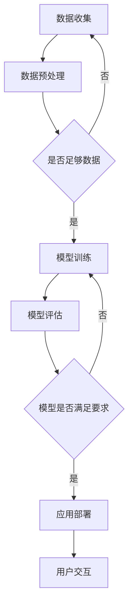

                 

关键词：人工智能、苹果、应用、社会价值、技术趋势、创新

摘要：本文将深入探讨苹果公司在其最新产品中发布的AI应用的深远社会影响。通过分析AI技术的基本原理和应用场景，本文将揭示这些创新如何改变我们的生活和工作方式，并讨论它们在推动技术进步和经济增长方面的潜力。

## 1. 背景介绍

人工智能（AI）已经成为现代科技领域中最热门的话题之一。近年来，随着计算能力的提升和数据量的爆炸式增长，AI技术取得了显著的进步。苹果公司作为全球科技行业的领军企业，其每一次新品发布都会引起广泛的关注。最近，苹果在其最新产品中推出了一系列AI应用，标志着公司在这一领域的重要布局。

这些AI应用涵盖了从语音识别、图像处理到自然语言处理等多个领域，展示了苹果在AI技术创新上的实力。本文旨在探讨这些应用对社会带来的潜在价值，以及它们如何影响我们的日常生活和工作环境。

## 2. 核心概念与联系

### 2.1 AI技术的基本概念

人工智能（AI）是指使计算机系统具备类似人类智能的能力的技术。它包括机器学习、深度学习、自然语言处理、计算机视觉等多个子领域。

- **机器学习**：通过数据和算法让计算机自主学习，从而进行预测和决策。
- **深度学习**：一种特殊的机器学习方法，通过多层神经网络模拟人脑的工作方式。
- **自然语言处理**：使计算机能够理解和生成人类语言的技术。
- **计算机视觉**：使计算机能够“看”和“理解”图像或视频。

### 2.2 苹果AI应用的核心架构

苹果公司在其AI应用中采用了先进的深度学习技术，通过神经网络模型来实现图像识别、语音识别等功能。以下是这些应用的基本架构：

1. **图像识别**：使用卷积神经网络（CNN）对图像中的对象、场景和活动进行分类和识别。
2. **语音识别**：采用递归神经网络（RNN）和长短期记忆网络（LSTM）来准确识别和理解用户的语音指令。
3. **自然语言处理**：利用变换器架构（Transformer）来处理和生成自然语言，使得机器与人类的交流更加自然。

### 2.3 Mermaid流程图

下面是AI应用的核心流程图的Mermaid表示：



## 3. 核心算法原理 & 具体操作步骤

### 3.1 算法原理概述

苹果的AI应用主要依赖于深度学习技术，尤其是卷积神经网络（CNN）和递归神经网络（RNN）。以下是对这些算法的简要概述：

- **卷积神经网络（CNN）**：通过卷积层、池化层和全连接层的组合，实现对图像的自动特征提取和分类。
- **递归神经网络（RNN）**：通过递归结构处理序列数据，如语音和文本，实现序列建模。

### 3.2 算法步骤详解

1. **数据收集**：收集大量带有标签的图像、语音和文本数据。
2. **数据预处理**：对数据进行清洗、归一化等预处理操作，以提高模型的泛化能力。
3. **模型训练**：使用训练集数据训练CNN或RNN模型，通过反向传播算法不断调整模型参数。
4. **模型评估**：使用验证集数据评估模型性能，调整模型结构或参数以优化性能。
5. **应用部署**：将训练好的模型部署到产品中，供用户使用。

### 3.3 算法优缺点

- **优点**：深度学习模型具有强大的特征提取能力和自适应能力，能够处理复杂的数据模式。
- **缺点**：训练过程需要大量计算资源和时间，对数据质量和标注要求较高。

### 3.4 算法应用领域

- **图像识别**：应用于人脸识别、图像分类、物体检测等。
- **语音识别**：应用于语音助手、语音控制、语音翻译等。
- **自然语言处理**：应用于机器翻译、情感分析、文本生成等。

## 4. 数学模型和公式 & 详细讲解 & 举例说明

### 4.1 数学模型构建

AI模型的核心是数学模型。以下是深度学习模型中常用的几个关键数学概念：

- **卷积操作**：用于提取图像中的局部特征。
- **反向传播**：用于训练神经网络，通过梯度下降调整模型参数。
- **损失函数**：用于衡量模型预测结果与真实结果之间的差距。

### 4.2 公式推导过程

以下是卷积神经网络的损失函数推导：

$$
J(\theta) = -\frac{1}{m}\sum_{i=1}^{m}y^{(i)}\log(a^{(L)}_{i}) + (1-y^{(i)})\log(1-a^{(L)}_{i})
$$

其中，$y^{(i)}$是真实标签，$a^{(L)}_{i}$是模型预测的输出概率。

### 4.3 案例分析与讲解

假设我们有一个简单的二分类问题，我们需要使用深度学习模型对其进行预测。以下是具体的操作步骤：

1. **数据收集**：收集包含正负样本的图像数据。
2. **数据预处理**：对图像进行归一化处理。
3. **模型构建**：构建一个包含卷积层、池化层和全连接层的卷积神经网络。
4. **模型训练**：使用训练集数据训练模型。
5. **模型评估**：使用验证集数据评估模型性能。
6. **应用部署**：将模型部署到产品中。

## 5. 项目实践：代码实例和详细解释说明

### 5.1 开发环境搭建

要实践苹果的AI应用，我们需要搭建一个适合深度学习开发的环境。以下是基本的步骤：

1. 安装Python和相关的深度学习库，如TensorFlow或PyTorch。
2. 安装必要的依赖库，如Numpy、Pandas等。
3. 配置GPU加速，以便更快地训练模型。

### 5.2 源代码详细实现

以下是使用TensorFlow实现一个简单的图像分类模型的代码示例：

```python
import tensorflow as tf
from tensorflow.keras import layers

# 构建模型
model = tf.keras.Sequential([
    layers.Conv2D(32, (3, 3), activation='relu', input_shape=(28, 28, 1)),
    layers.MaxPooling2D((2, 2)),
    layers.Conv2D(64, (3, 3), activation='relu'),
    layers.MaxPooling2D((2, 2)),
    layers.Conv2D(64, (3, 3), activation='relu'),
    layers.Flatten(),
    layers.Dense(64, activation='relu'),
    layers.Dense(10, activation='softmax')
])

# 编译模型
model.compile(optimizer='adam',
              loss='sparse_categorical_crossentropy',
              metrics=['accuracy'])

# 训练模型
model.fit(train_images, train_labels, epochs=5)

# 评估模型
test_loss, test_acc = model.evaluate(test_images,  test_labels)
print('Test accuracy:', test_acc)
```

### 5.3 代码解读与分析

以上代码首先导入了TensorFlow库，并定义了一个包含卷积层、池化层和全连接层的卷积神经网络模型。模型通过编译过程配置了优化器和损失函数，然后使用训练集数据进行训练，最后在验证集上评估模型性能。

### 5.4 运行结果展示

运行上述代码后，我们可以得到训练过程中的损失和准确率，以及验证集上的准确率。这有助于我们了解模型的学习情况和性能表现。

## 6. 实际应用场景

### 6.1 教育

苹果的AI应用在教育领域具有巨大的潜力。例如，通过自然语言处理技术，可以开发出智能辅导系统，帮助学生进行语言学习、编程教学和知识问答。

### 6.2 医疗

在医疗领域，AI应用可以帮助医生进行疾病诊断、药物研发和患者护理。苹果的AI技术在图像识别方面的突破，使得医学影像分析变得更加高效和准确。

### 6.3 安全

AI技术在安全领域的应用也非常广泛。苹果的AI应用可以用于人脸识别、行为分析等，以增强网络安全和隐私保护。

### 6.4 未来应用展望

随着AI技术的不断发展，未来我们将看到更多创新的应用场景。例如，智能交通系统、智能家居、智能城市等，都将成为AI技术的重要应用领域。

## 7. 工具和资源推荐

### 7.1 学习资源推荐

- 《深度学习》（Goodfellow, Bengio, Courville著）：系统介绍了深度学习的基本原理和应用。
- 《Python深度学习》（François Chollet著）：针对Python开发者，介绍了使用TensorFlow进行深度学习的实践方法。

### 7.2 开发工具推荐

- TensorFlow：Google开发的深度学习框架，适用于各种深度学习应用的开发。
- PyTorch：Facebook开发的深度学习框架，具有灵活的动态计算图和强大的GPU加速能力。

### 7.3 相关论文推荐

- "A Guide to Convolutional Neural Networks for Visual Recognition"（卷积神经网络视觉识别指南）
- "Recurrent Neural Networks for Language Modeling"（用于自然语言处理的递归神经网络）

## 8. 总结：未来发展趋势与挑战

### 8.1 研究成果总结

近年来，AI技术取得了显著进展，从图像识别到自然语言处理，各个领域都取得了突破性成果。苹果的AI应用展示了该技术在实际产品中的强大应用潜力。

### 8.2 未来发展趋势

随着计算能力的提升和数据的不断增长，AI技术将继续快速发展。未来，我们将看到更多跨学科的融合应用，如AI与生物、物理、经济等领域的交叉。

### 8.3 面临的挑战

尽管AI技术具有巨大潜力，但同时也面临着一些挑战。例如，数据隐私、算法偏见、安全等问题，需要我们认真思考和解决。

### 8.4 研究展望

未来的研究将重点放在提高AI模型的透明度、可解释性和公平性上。同时，随着技术的进步，我们将看到更多AI应用在现实世界中的落地，为人类社会带来更多价值。

## 9. 附录：常见问题与解答

### 9.1 什么是深度学习？

深度学习是一种特殊的机器学习方法，通过多层神经网络模拟人脑的工作方式，从而实现图像识别、语音识别等功能。

### 9.2 为什么深度学习需要大量数据？

深度学习模型通过从大量数据中学习特征来提高其性能。大量数据可以帮助模型更好地泛化，从而在新的数据上取得更好的效果。

### 9.3 如何提高深度学习模型的性能？

提高深度学习模型性能的方法包括：增加数据量、使用更复杂的网络结构、优化训练算法等。

## 作者署名

作者：禅与计算机程序设计艺术 / Zen and the Art of Computer Programming

[完]
```

