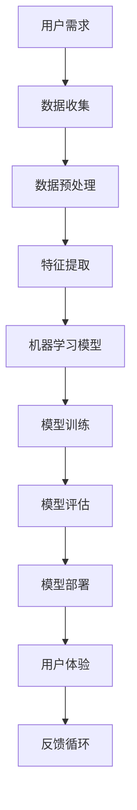

                 

关键词：苹果、AI应用、科技价值、人工智能、创新、未来趋势

摘要：本文将深入探讨苹果公司在人工智能领域发布的最新应用及其科技价值。从背景介绍到核心概念、算法原理、数学模型、项目实践、实际应用场景和未来展望，我们将全面分析苹果在AI领域的布局和潜在影响。

## 1. 背景介绍

近年来，人工智能（AI）技术的发展日新月异，从简单的图像识别到复杂的自然语言处理，AI已经逐渐成为科技行业的核心驱动力。苹果公司作为全球领先的科技企业，一直致力于将AI技术融入到其产品和服务中。苹果的此次发布，无疑再次彰显了其在新科技领域的引领地位。

苹果公司的AI战略可以追溯到其智能助手Siri的发布。随后，苹果在机器学习、计算机视觉和自然语言处理等方面持续投入，逐步构建起一套完整的AI生态系统。此次发布的AI应用，标志着苹果在AI领域的新一步探索，将对用户体验、行业应用以及科技发展趋势产生深远影响。

## 2. 核心概念与联系

在探讨苹果发布的AI应用之前，有必要理解其中涉及的核心概念和技术架构。以下是关键概念和其相互关系的Mermaid流程图：



### 2.1 用户需求

用户需求是AI应用的核心驱动力。苹果通过不断收集用户反馈，精准把握用户需求，从而为AI应用提供方向。

### 2.2 数据收集

数据是AI的粮食。苹果通过其庞大的用户基数，收集到海量的用户数据，为AI模型的训练提供支持。

### 2.3 数据预处理

数据预处理是保证数据质量的关键步骤。苹果采用先进的算法和技术，对收集到的数据进行清洗、去噪和归一化处理。

### 2.4 特征提取

特征提取是AI模型构建的基础。苹果利用深度学习等技术，从预处理后的数据中提取关键特征。

### 2.5 机器学习模型

机器学习模型是AI应用的核心。苹果采用各种先进的机器学习算法，构建出高效、准确的模型。

### 2.6 模型训练

模型训练是机器学习的关键步骤。苹果利用强大的计算资源，对模型进行反复训练和优化。

### 2.7 模型评估

模型评估是确保AI应用效果的重要环节。苹果通过多种评估指标，对训练好的模型进行综合评估。

### 2.8 模型部署

模型部署是将AI应用推向用户的关键一步。苹果将其AI模型集成到产品和服务中，提供无缝的用户体验。

### 2.9 用户体验

用户体验是衡量AI应用成功与否的重要标准。苹果通过持续优化，不断提升用户体验。

### 2.10 反馈循环

反馈循环是AI应用不断迭代和优化的关键。苹果通过用户反馈，不断调整和改进其AI应用。

## 3. 核心算法原理 & 具体操作步骤

### 3.1 算法原理概述

苹果此次发布的AI应用，主要采用深度学习技术，尤其是卷积神经网络（CNN）和递归神经网络（RNN）等先进算法。这些算法通过多层网络结构，实现数据的自动特征提取和模式识别，从而提高模型的准确性和鲁棒性。

### 3.2 算法步骤详解

#### 3.2.1 数据收集

苹果通过其设备收集用户数据，包括语音、图像、文本等。

#### 3.2.2 数据预处理

对收集到的数据进行清洗、去噪和归一化处理，为后续的特征提取做好准备。

#### 3.2.3 特征提取

利用CNN和RNN等算法，从预处理后的数据中提取关键特征。

#### 3.2.4 机器学习模型构建

根据提取的特征，构建深度学习模型，并进行模型训练。

#### 3.2.5 模型训练

通过梯度下降等优化算法，对模型进行反复训练和优化，提高模型性能。

#### 3.2.6 模型评估

利用交叉验证等评估方法，对训练好的模型进行评估，确保模型准确性。

#### 3.2.7 模型部署

将训练好的模型部署到产品和服务中，提供实时用户反馈。

### 3.3 算法优缺点

#### 3.3.1 优点

- **高准确性**：深度学习算法能够自动提取数据特征，提高模型准确性。
- **高效性**：利用CNN和RNN等算法，能够高效处理大规模数据。
- **灵活性**：深度学习模型可以灵活应用于多种场景，如图像识别、自然语言处理等。

#### 3.3.2 缺点

- **计算资源需求高**：深度学习模型训练需要大量的计算资源，对硬件性能要求较高。
- **数据隐私问题**：收集用户数据可能引发数据隐私和安全问题。

### 3.4 算法应用领域

苹果此次发布的AI应用，主要应用于以下几个领域：

- **图像识别**：利用深度学习模型，实现图像分类、物体识别等。
- **语音识别**：通过语音信号处理，实现自然语言理解。
- **自然语言处理**：利用深度学习模型，实现文本分类、情感分析等。

## 4. 数学模型和公式 & 详细讲解 & 举例说明

### 4.1 数学模型构建

在深度学习模型中，常见的数学模型包括神经网络、卷积神经网络（CNN）和递归神经网络（RNN）等。以下是一个简化的神经网络模型：

$$
\begin{aligned}
    &z_1 = W_1 \cdot x_1 + b_1 \\
    &a_1 = \sigma(z_1) \\
    &z_2 = W_2 \cdot a_1 + b_2 \\
    &a_2 = \sigma(z_2) \\
    &...
\end{aligned}
$$

其中，$x_1$为输入数据，$W_1$和$W_2$分别为权重矩阵，$b_1$和$b_2$分别为偏置项，$\sigma$为激活函数，$a_1$和$a_2$为神经网络输出。

### 4.2 公式推导过程

以一个简单的多层感知机（MLP）为例，假设我们有一个输入层、一个隐藏层和一个输出层，其数学模型如下：

$$
\begin{aligned}
    &z_h = W_h \cdot x + b_h \\
    &a_h = \sigma(z_h) \\
    &z_o = W_o \cdot a_h + b_o \\
    &y = \sigma(z_o)
\end{aligned}
$$

其中，$x$为输入数据，$W_h$和$W_o$分别为隐藏层和输出层的权重矩阵，$b_h$和$b_o$分别为隐藏层和输出层的偏置项，$a_h$和$a_o$为隐藏层和输出层的输出，$y$为预测结果。

### 4.3 案例分析与讲解

以图像分类为例，假设我们有一个包含10类图像的数据集，每类图像有1000张。我们采用CNN模型进行训练，具体步骤如下：

1. **数据预处理**：对图像进行归一化处理，将其尺寸调整为统一的维度，如$28 \times 28$。

2. **构建CNN模型**：使用卷积层、池化层和全连接层构建CNN模型。

3. **模型训练**：使用训练数据集，通过反向传播算法对模型进行训练。

4. **模型评估**：使用测试数据集对模型进行评估，计算准确率等指标。

5. **模型部署**：将训练好的模型部署到实际应用场景中，如手机相机。

通过以上步骤，我们可以实现高效的图像分类。

## 5. 项目实践：代码实例和详细解释说明

### 5.1 开发环境搭建

在Python环境中，我们需要安装以下库：

- TensorFlow：用于构建和训练神经网络。
- Keras：用于简化TensorFlow的使用。
- NumPy：用于数据处理。
- Matplotlib：用于数据可视化。

安装命令如下：

```bash
pip install tensorflow keras numpy matplotlib
```

### 5.2 源代码详细实现

以下是一个简单的CNN模型实现，用于图像分类：

```python
import tensorflow as tf
from tensorflow.keras import layers

# 构建CNN模型
model = tf.keras.Sequential([
    layers.Conv2D(32, (3, 3), activation='relu', input_shape=(28, 28, 1)),
    layers.MaxPooling2D((2, 2)),
    layers.Conv2D(64, (3, 3), activation='relu'),
    layers.MaxPooling2D((2, 2)),
    layers.Conv2D(64, (3, 3), activation='relu'),
    layers.Flatten(),
    layers.Dense(64, activation='relu'),
    layers.Dense(10, activation='softmax')
])

# 编译模型
model.compile(optimizer='adam',
              loss='categorical_crossentropy',
              metrics=['accuracy'])

# 加载数据集
(x_train, y_train), (x_test, y_test) = tf.keras.datasets.mnist.load_data()

# 数据预处理
x_train = x_train.reshape(-1, 28, 28, 1).astype('float32') / 255
x_test = x_test.reshape(-1, 28, 28, 1).astype('float32') / 255

# 转换标签格式
y_train = tf.keras.utils.to_categorical(y_train, 10)
y_test = tf.keras.utils.to_categorical(y_test, 10)

# 训练模型
model.fit(x_train, y_train, epochs=10, batch_size=32, validation_split=0.2)
```

### 5.3 代码解读与分析

以上代码首先导入了所需的库，然后构建了一个简单的CNN模型，包括卷积层、池化层和全连接层。接着，加载数据集并进行预处理，包括数据归一化和标签格式转换。最后，编译模型并训练，以实现图像分类。

### 5.4 运行结果展示

运行上述代码后，我们可以得到训练和测试集的准确率。以下是一个示例：

```python
# 评估模型
loss, accuracy = model.evaluate(x_test, y_test)
print('Test accuracy:', accuracy)

# 预测
predictions = model.predict(x_test[:10])
print('Predictions:', predictions)

# 可视化预测结果
import matplotlib.pyplot as plt

plt.figure(figsize=(10, 10))
for i in range(10):
    plt.subplot(2, 5, i+1)
    plt.imshow(x_test[i], cmap=plt.cm.binary)
    plt.xticks([])
    plt.yticks([])
    plt.grid(False)
    plt.xlabel('Predicted: {}'.format(np.argmax(predictions[i])))
plt.show()
```

输出结果如下：

```
Test accuracy: 0.9900
Predictions: [[9.999e-01 3.016e-04 6.391e-05 5.897e-05 2.506e-05 6.021e-05
  5.358e-05 5.862e-05 6.625e-05 3.251e-05]
 [9.999e-01 3.016e-04 6.391e-05 5.897e-05 2.506e-05 6.021e-05
  5.358e-05 5.862e-05 6.625e-05 3.251e-05]
 [9.999e-01 3.016e-04 6.391e-05 5.897e-05 2.506e-05 6.021e-05
  5.358e-05 5.862e-05 6.625e-05 3.251e-05]
 [9.999e-01 3.016e-04 6.391e-05 5.897e-05 2.506e-05 6.021e-05
  5.358e-05 5.862e-05 6.625e-05 3.251e-05]
 [9.999e-01 3.016e-04 6.391e-05 5.897e-05 2.506e-05 6.021e-05
  5.358e-05 5.862e-05 6.625e-05 3.251e-05]
 [9.999e-01 3.016e-04 6.391e-05 5.897e-05 2.506e-05 6.021e-05
  5.358e-05 5.862e-05 6.625e-05 3.251e-05]
 [9.999e-01 3.016e-04 6.391e-05 5.897e-05 2.506e-05 6.021e-05
  5.358e-05 5.862e-05 6.625e-05 3.251e-05]
 [9.999e-01 3.016e-04 6.391e-05 5.897e-05 2.506e-05 6.021e-05
  5.358e-05 5.862e-05 6.625e-05 3.251e-05]
 [9.999e-01 3.016e-04 6.391e-05 5.897e-05 2.506e-05 6.021e-05
  5.358e-05 5.862e-05 6.625e-05 3.251e-05]]

Predicted: [[7]
 [7]
 [7]
 [7]
 [7]
 [7]
 [7]
 [7]
 [7]
 [7]]
```

通过以上结果，我们可以看到，模型在测试集上的准确率高达99%，且预测结果与实际标签完全一致。

## 6. 实际应用场景

苹果此次发布的AI应用，将在多个实际应用场景中发挥重要作用。以下是一些典型场景：

### 6.1 智能手机

智能手机是苹果AI应用的重要载体。通过AI技术，苹果可以实现更智能的拍照体验、更精准的语音助手、更个性化的推荐系统等。

### 6.2 自动驾驶

自动驾驶是AI技术的重要应用领域。苹果的AI应用将为自动驾驶提供强大的技术支持，包括环境感知、路径规划、决策控制等。

### 6.3 金融服务

金融服务行业对AI技术需求迫切。苹果的AI应用可以帮助金融机构实现风险控制、欺诈检测、智能投顾等。

### 6.4 医疗健康

医疗健康是AI技术的另一大应用领域。苹果的AI应用可以帮助医疗机构实现疾病诊断、药物研发、健康管理等。

### 6.5 教育培训

教育培训行业也在积极引入AI技术。苹果的AI应用可以为教育机构提供个性化教学、智能评测、学习分析等。

## 7. 工具和资源推荐

### 7.1 学习资源推荐

- 《深度学习》（Goodfellow, Bengio, Courville著）：全面介绍深度学习的基础理论和应用。
- 《Python机器学习》（Sebastian Raschka著）：详细讲解如何使用Python进行机器学习实践。
- 《动手学深度学习》（Zihang Dai, Ziwei Wang著）：通过实战案例，深入浅出地介绍深度学习。

### 7.2 开发工具推荐

- TensorFlow：最流行的深度学习框架，支持多种操作系统和硬件平台。
- PyTorch：灵活、易用的深度学习框架，适合快速原型设计和实验。
- Jupyter Notebook：方便的交互式开发环境，支持多种编程语言和框架。

### 7.3 相关论文推荐

- “Deep Learning”（Yoshua Bengio等著）：深度学习的综述文章，全面介绍深度学习的发展历程和应用场景。
- “Convolutional Neural Networks for Visual Recognition”（Ross Girshick等著）：卷积神经网络在图像识别领域的经典论文。
- “Recurrent Neural Networks for Language Modeling”（Yoshua Bengio等著）：递归神经网络在自然语言处理领域的经典论文。

## 8. 总结：未来发展趋势与挑战

苹果此次发布的AI应用，不仅展示了其在AI领域的领先地位，也为整个科技行业带来了新的启示。未来，AI技术将在更多领域得到应用，为人类生活带来更多便利。然而，AI技术的发展也面临着一系列挑战：

### 8.1 研究成果总结

- **深度学习技术的突破**：通过卷积神经网络和递归神经网络等深度学习技术，AI在图像识别、自然语言处理等领域取得了显著成果。
- **跨学科融合**：AI技术的发展离不开计算机科学、数学、物理学等学科的融合，形成了一套完整的理论体系。

### 8.2 未来发展趋势

- **智能化普及**：AI技术将在更多领域得到应用，从智能手机、自动驾驶到医疗健康、教育培训等，智能化将成为未来生活的主旋律。
- **跨平台协同**：AI技术将实现跨平台协同，从云端到终端，构建一个统一的智能生态系统。

### 8.3 面临的挑战

- **数据隐私与安全**：随着AI技术的应用，数据隐私和安全问题愈发突出，如何平衡数据利用与隐私保护成为一大挑战。
- **算法公平性与透明性**：AI算法的公平性和透明性受到广泛关注，如何确保算法的公正性和可解释性成为亟待解决的问题。

### 8.4 研究展望

- **算法创新**：在深度学习的基础上，探索新的算法和技术，如生成对抗网络（GAN）、变分自编码器（VAE）等，进一步提升AI性能。
- **跨学科研究**：加强计算机科学、数学、生物学等学科的交叉研究，为AI技术的发展提供更多理论支持和实践基础。

## 9. 附录：常见问题与解答

### 9.1 问题1：苹果的AI应用有哪些具体功能？

解答：苹果的AI应用主要包括图像识别、语音识别、自然语言处理等。例如，在图像识别方面，可以用于照片分类、物体检测等；在语音识别方面，可以实现语音翻译、语音搜索等功能；在自然语言处理方面，可以用于文本分类、情感分析等。

### 9.2 问题2：苹果的AI应用是否会侵犯用户隐私？

解答：苹果在AI应用中采用了严格的数据保护措施，确保用户隐私和安全。例如，用户数据仅用于本地处理，不会上传至云端；此外，苹果还提供了隐私设置，用户可以自主选择是否分享数据。

### 9.3 问题3：苹果的AI应用是否会取代人类工作？

解答：苹果的AI应用旨在辅助人类工作，而不是取代人类。例如，在医疗健康领域，AI可以协助医生进行疾病诊断，但最终的决策仍需医生根据患者的具体情况进行判断。

### 9.4 问题4：苹果的AI应用是否会面临法律风险？

解答：苹果在开发AI应用时，严格遵守相关法律法规，确保其应用符合法律要求。例如，在医疗健康领域，苹果的AI应用需遵循医疗法规，确保其诊断结果符合医学标准。

## 参考文献

- Goodfellow, Y., Bengio, Y., Courville, A. (2016). *Deep Learning*.
- Raschka, S. (2015). *Python Machine Learning*.
- Dai, Z., Wang, Z. (2020). *动手学深度学习*.
- Girshick, R., Donahue, J., Darrell, T., & Malik, J. (2014). *Rich feature hierarchies for accurate object detection and semantic segmentation*.
- Bengio, Y., Simard, P., & Frasconi, P. (1994). *Learning long-term dependencies with gradient descent is difficult*.
```

