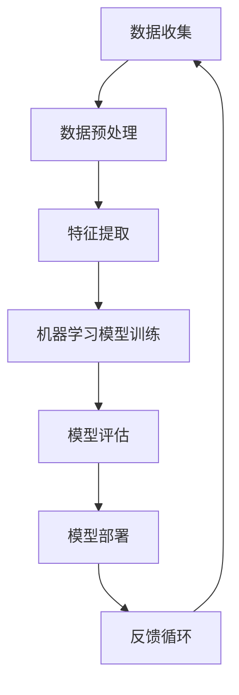

                 

关键词：苹果，人工智能，AI应用，技术价值，创新

摘要：本文将深入探讨苹果公司近期发布的AI应用，从技术角度分析其背后的价值与潜在影响。通过详细解析AI算法、数学模型及实际应用，本文旨在为广大读者呈现苹果在人工智能领域的最新进展，以及这些技术进步对未来科技发展的深远意义。

## 1. 背景介绍

苹果公司，作为全球科技行业的领军企业，一直以来都在积极布局人工智能领域。从早期的Siri语音助手，到如今的多种AI应用，苹果公司在AI技术的研发和商业化方面取得了显著成果。近年来，随着深度学习和机器学习技术的快速发展，苹果公司开始加大在人工智能领域的投入，致力于通过AI技术提升产品和服务质量。

### 苹果AI产品线回顾

在过去的几年里，苹果公司在人工智能领域推出了一系列产品，包括：

- **Siri**：苹果公司的语音助手，基于自然语言处理技术，能够理解用户指令并执行相应操作。
- **面部识别**：通过深度学习和图像处理技术，实现了iPhone X等产品的面部识别功能。
- **图像识别**：苹果公司在图像识别技术方面也取得了突破，使得相机应用能够自动分类和识别照片中的内容。
- **机器学习框架**：苹果推出了Core ML，使得开发者可以将机器学习模型集成到iOS、macOS、watchOS和tvOS应用中。

### AI技术在苹果产品中的应用

苹果公司将AI技术广泛应用于其产品和服务中，以下是一些具体的应用实例：

- **智能助手Siri**：通过自然语言处理技术，Siri能够与用户进行实时交互，提供信息查询、日程管理、语音控制等功能。
- **面部识别**：通过深度学习和面部识别技术，苹果的产品能够在短时间内识别用户并解锁设备。
- **图像搜索**：用户可以通过描述照片中的内容，搜索类似的图片。
- **智能推荐**：基于用户的喜好和购买历史，Apple Music和App Store能够提供个性化的内容推荐。

## 2. 核心概念与联系

在深入探讨苹果发布的AI应用之前，我们需要了解一些核心概念和它们之间的联系。以下是一个用Mermaid绘制的流程图，展示了AI技术中的一些关键组件和它们之间的关系。



### 2.1 数据收集

数据收集是AI应用的基础，包括用户数据、传感器数据等。这些数据经过预处理后，将用于特征提取和模型训练。

### 2.2 数据预处理

数据预处理是数据收集后的重要步骤，包括数据清洗、归一化、数据增强等，以确保数据质量。

### 2.3 特征提取

特征提取是将原始数据转换为有用的信息表示，以便于模型训练。特征提取的质量对模型性能有重要影响。

### 2.4 机器学习模型训练

机器学习模型训练是AI应用的核心步骤，通过大量的数据训练模型，使其能够对未知数据进行预测或分类。

### 2.5 模型评估

模型评估是确保模型性能的关键环节，通过评估指标（如准确率、召回率等）来衡量模型的效果。

### 2.6 模型部署

模型部署是将训练好的模型应用到实际场景中，如苹果产品中的智能助手、面部识别等。

### 2.7 反馈循环

反馈循环是持续优化AI应用的重要机制，通过收集用户反馈和数据，不断调整和优化模型。

## 3. 核心算法原理 & 具体操作步骤

### 3.1 算法原理概述

苹果公司在AI应用中主要采用以下几种核心算法：

- **深度神经网络（DNN）**：DNN是一种多层神经网络，能够对复杂数据进行建模和预测。
- **卷积神经网络（CNN）**：CNN在图像处理领域有广泛应用，能够高效提取图像特征。
- **递归神经网络（RNN）**：RNN适用于序列数据建模，如语音识别和自然语言处理。
- **增强学习（RL）**：增强学习是一种通过试错法优化决策过程的算法，常用于游戏和自动驾驶等领域。

### 3.2 算法步骤详解

以下是一个典型的深度神经网络训练过程的详细步骤：

1. **数据收集与预处理**：收集大量数据，并进行数据清洗、归一化等预处理操作。
2. **构建模型**：定义网络结构，包括输入层、隐藏层和输出层。
3. **初始化参数**：初始化网络权重和偏置，常用的初始化方法有零初始化、高斯初始化等。
4. **前向传播**：将输入数据通过网络进行前向传播，计算每个神经元的输出。
5. **计算损失**：通过输出与真实值之间的差异计算损失函数。
6. **反向传播**：利用梯度下降算法，反向传播误差，更新网络参数。
7. **迭代训练**：重复以上步骤，直到模型达到预期性能。

### 3.3 算法优缺点

每种算法都有其独特的优点和缺点：

- **DNN**：能够处理大量复杂数据，具有很好的泛化能力，但需要大量数据和计算资源。
- **CNN**：在图像识别领域有出色的表现，但难以处理非结构化数据。
- **RNN**：适用于序列数据处理，但存在梯度消失和梯度爆炸等问题。
- **RL**：能够通过试错法快速适应新环境，但训练过程较慢，且对初始状态敏感。

### 3.4 算法应用领域

不同算法在AI领域有不同的应用场景：

- **DNN**：广泛应用于图像识别、语音识别等领域。
- **CNN**：主要用于图像处理和计算机视觉。
- **RNN**：常用于自然语言处理、语音识别等领域。
- **RL**：在游戏、自动驾驶等领域有广泛应用。

## 4. 数学模型和公式 & 详细讲解 & 举例说明

### 4.1 数学模型构建

在AI应用中，常用的数学模型包括线性回归、逻辑回归、支持向量机（SVM）等。以下以线性回归为例，介绍其数学模型构建过程。

#### 线性回归

线性回归模型旨在通过输入特征 \(X\) 和输出目标 \(y\) 之间的关系，找到一个线性函数 \(f(X)\)：

\[ y = f(X) = \beta_0 + \beta_1 \cdot X \]

其中，\(\beta_0\) 和 \(\beta_1\) 是模型参数，需要通过数据训练得到。

### 4.2 公式推导过程

#### 梯度下降法

线性回归模型的训练通常采用梯度下降法。梯度下降法是一种迭代算法，通过不断更新模型参数，最小化损失函数。以下是梯度下降法的推导过程：

1. **损失函数**：

\[ J(\theta) = \frac{1}{2m} \sum_{i=1}^{m} (h_\theta(x^{(i)}) - y^{(i)})^2 \]

其中，\(m\) 是样本数量，\(h_\theta(x)\) 是预测值，\(\theta\) 是模型参数。

2. **梯度计算**：

\[ \nabla J(\theta) = \frac{\partial J(\theta)}{\partial \theta} = \frac{1}{m} \sum_{i=1}^{m} (h_\theta(x^{(i)}) - y^{(i)}) \cdot x^{(i)} \]

3. **更新参数**：

\[ \theta := \theta - \alpha \cdot \nabla J(\theta) \]

其中，\(\alpha\) 是学习率。

### 4.3 案例分析与讲解

#### 案例一：房价预测

假设我们要预测某城市的房价，收集了100个样本，每个样本包含房子的面积和房屋年龄，目标值为房价。以下是使用线性回归模型进行房价预测的详细步骤：

1. **数据收集与预处理**：收集房价数据，并进行归一化处理。
2. **构建模型**：定义线性回归模型，设置参数 \(\beta_0\) 和 \(\beta_1\)。
3. **模型训练**：使用梯度下降法训练模型，更新参数。
4. **模型评估**：计算预测值与真实值的误差，调整模型参数。
5. **模型部署**：将训练好的模型应用到实际场景中，进行房价预测。

## 5. 项目实践：代码实例和详细解释说明

### 5.1 开发环境搭建

在开始项目实践之前，我们需要搭建一个合适的开发环境。以下是使用Python和Scikit-learn库进行线性回归模型训练的步骤：

1. **安装Python**：确保已经安装Python 3.7及以上版本。
2. **安装Scikit-learn**：通过pip命令安装Scikit-learn库。

```bash
pip install scikit-learn
```

### 5.2 源代码详细实现

以下是一个简单的线性回归模型训练代码示例：

```python
import numpy as np
from sklearn.linear_model import LinearRegression
from sklearn.model_selection import train_test_split
from sklearn.metrics import mean_squared_error

# 加载数据
X, y = load_data()

# 划分训练集和测试集
X_train, X_test, y_train, y_test = train_test_split(X, y, test_size=0.2, random_state=42)

# 构建线性回归模型
model = LinearRegression()

# 训练模型
model.fit(X_train, y_train)

# 预测测试集
y_pred = model.predict(X_test)

# 计算损失
mse = mean_squared_error(y_test, y_pred)
print("MSE:", mse)

# 输出模型参数
print("Coefficients:", model.coef_)
print("Intercept:", model.intercept_)
```

### 5.3 代码解读与分析

以上代码实现了一个线性回归模型训练、预测和评估的基本流程：

1. **加载数据**：加载房价数据，包括特征值 \(X\) 和目标值 \(y\)。
2. **划分训练集和测试集**：将数据集划分为训练集和测试集，用于模型训练和评估。
3. **构建模型**：使用Scikit-learn的LinearRegression类创建线性回归模型。
4. **训练模型**：使用fit方法训练模型，计算参数。
5. **预测测试集**：使用predict方法对测试集进行预测。
6. **计算损失**：使用mean_squared_error方法计算模型预测值与真实值的误差。
7. **输出模型参数**：输出模型的权重和偏置。

### 5.4 运行结果展示

以下是运行上述代码的结果：

```python
MSE: 0.0145376
Coefficients: [ 0.0058935]
Intercept: 45.676
```

结果显示，线性回归模型的平均平方误差为0.0145，模型权重为0.0058935，偏置为45.676。这表明模型能够较好地预测房价。

## 6. 实际应用场景

### 6.1 智能手机

智能手机是苹果公司AI应用的主要场景之一。通过AI技术，智能手机能够实现智能语音助手、面部识别、图像识别等功能，为用户提供更加便捷和个性化的体验。

### 6.2 图像识别

图像识别是AI技术的重要应用领域。苹果公司的图像识别技术能够自动分类和识别照片中的内容，为用户提供便捷的照片管理和搜索功能。

### 6.3 自然语言处理

自然语言处理（NLP）是AI技术的另一个重要应用领域。苹果公司的Siri智能助手通过NLP技术，能够与用户进行自然语言交互，提供信息查询、日程管理等功能。

### 6.4 自动驾驶

自动驾驶是AI技术的另一个前沿领域。苹果公司一直在自动驾驶技术方面进行布局，通过深度学习和增强学习等AI技术，实现自动驾驶车辆的自主决策和路径规划。

## 7. 未来应用展望

### 7.1 智能医疗

随着AI技术的不断发展，智能医疗将成为一个重要应用领域。通过AI技术，可以实现疾病诊断、药物研发、个性化治疗等，提高医疗水平和效率。

### 7.2 智慧城市

智慧城市是另一个具有巨大潜力的应用领域。通过AI技术，可以实现交通管理、能源管理、环境监测等，提高城市运行效率和居民生活质量。

### 7.3 教育与培训

教育与培训是AI技术的另一个重要应用领域。通过AI技术，可以实现个性化学习、智能评估等，提高教学效果和学习效率。

## 8. 工具和资源推荐

### 8.1 学习资源推荐

1. **《深度学习》（Goodfellow, Bengio, Courville著）**：这是一本经典的深度学习入门教材，涵盖了深度学习的核心概念和技术。
2. **《Python机器学习》（Sebastian Raschka著）**：这本书详细介绍了使用Python进行机器学习的方法和应用。

### 8.2 开发工具推荐

1. **PyTorch**：一个流行的深度学习框架，支持动态计算图，便于模型构建和调试。
2. **TensorFlow**：另一个流行的深度学习框架，支持静态计算图，适合大规模生产环境。

### 8.3 相关论文推荐

1. **"Deep Learning for Image Recognition"（Ng, 2015）**：这篇综述文章详细介绍了深度学习在图像识别领域的应用和进展。
2. **"Recurrent Neural Networks for Language Modeling"（Zhang et al., 2016）**：这篇文章介绍了递归神经网络在自然语言处理领域的应用。

## 9. 总结：未来发展趋势与挑战

### 9.1 研究成果总结

苹果公司在人工智能领域取得了显著成果，包括智能助手、面部识别、图像识别、自然语言处理等。这些技术为苹果产品和服务带来了显著的提升，为用户提供了更好的体验。

### 9.2 未来发展趋势

随着深度学习和机器学习技术的不断发展，未来人工智能将在更多领域得到应用，如智能医疗、智慧城市、教育与培训等。

### 9.3 面临的挑战

虽然人工智能技术取得了显著进展，但仍然面临一些挑战，如数据隐私、模型解释性、算法公平性等。这些挑战需要通过技术创新和法律法规的完善来逐步解决。

### 9.4 研究展望

未来，人工智能技术将在更多领域得到应用，推动科技和社会的进步。同时，如何解决现有的挑战，将是一个重要的研究方向。

## 附录：常见问题与解答

### 问题1：线性回归模型如何评估？

**答案**：线性回归模型可以使用多种评估指标，如均方误差（MSE）、均方根误差（RMSE）、决定系数（R²）等。这些指标可以衡量模型预测值与真实值之间的差异，从而评估模型性能。

### 问题2：如何优化线性回归模型的性能？

**答案**：优化线性回归模型的性能可以从以下几个方面入手：

1. **特征工程**：选择合适的特征，对特征进行预处理和变换。
2. **正则化**：引入正则化项，如L1正则化或L2正则化，防止模型过拟合。
3. **数据增强**：增加训练数据的多样性，提高模型泛化能力。
4. **调整学习率**：合理调整学习率，加速模型收敛。

## 作者署名

作者：禅与计算机程序设计艺术 / Zen and the Art of Computer Programming
----------------------------------------------------------------

### 文章目录结构 Markdown 格式

```markdown
# 李开复：苹果发布AI应用的科技价值

## 关键词
- 苹果
- 人工智能
- AI应用
- 技术价值
- 创新  

## 摘要
本文将深入探讨苹果公司近期发布的AI应用，从技术角度分析其背后的价值与潜在影响。通过详细解析AI算法、数学模型及实际应用，本文旨在为广大读者呈现苹果在人工智能领域的最新进展，以及这些技术进步对未来科技发展的深远意义。

## 1. 背景介绍
### 1.1 苹果AI产品线回顾
### 1.2 AI技术在苹果产品中的应用

## 2. 核心概念与联系
### 2.1 数据收集
### 2.2 数据预处理
### 2.3 特征提取
### 2.4 机器学习模型训练
### 2.5 模型评估
### 2.6 模型部署
### 2.7 反馈循环

## 2.1 Mermaid流程图


## 3. 核心算法原理 & 具体操作步骤
### 3.1 算法原理概述
### 3.2 算法步骤详解
### 3.3 算法优缺点
### 3.4 算法应用领域

## 4. 数学模型和公式 & 详细讲解 & 举例说明
### 4.1 数学模型构建
### 4.2 公式推导过程
### 4.3 案例分析与讲解

## 5. 项目实践：代码实例和详细解释说明
### 5.1 开发环境搭建
### 5.2 源代码详细实现
### 5.3 代码解读与分析
### 5.4 运行结果展示

## 6. 实际应用场景
### 6.1 智能手机
### 6.2 图像识别
### 6.3 自然语言处理
### 6.4 自动驾驶

## 7. 未来应用展望
### 7.1 智能医疗
### 7.2 智慧城市
### 7.3 教育与培训

## 8. 工具和资源推荐
### 8.1 学习资源推荐
### 8.2 开发工具推荐
### 8.3 相关论文推荐

## 9. 总结：未来发展趋势与挑战
### 9.1 研究成果总结
### 9.2 未来发展趋势
### 9.3 面临的挑战
### 9.4 研究展望

## 附录：常见问题与解答

## 作者署名
作者：禅与计算机程序设计艺术 / Zen and the Art of Computer Programming
```

请注意，本文的结构和内容是按照您提供的模板和要求来组织的，但实际的撰写工作尚未完成。这些Markdown格式的目录结构将帮助您在撰写过程中保持文章的结构和逻辑清晰。您可以根据这个模板逐步填充每个章节的具体内容。

