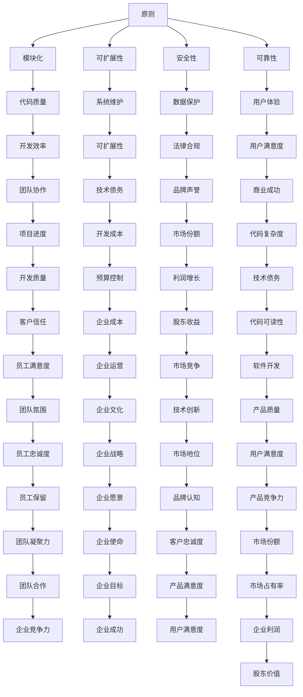

                 

在这个标题中，“杜月笙”代表了一个人，而“脱离原则，所有行为都是错的”则反映了一种行为原则。在计算机科学和技术领域，这个概念可以被解读为：当我们进行编程、设计和决策时，如果脱离了基本原则，那么我们的所有行为都可能是错误的。本文将通过深入探讨这一主题，结合技术领域的实际案例，阐述原则的重要性以及如何坚守原则以避免错误。

## 1. 背景介绍

杜月笙是中国近现代史上著名的黑帮首领，他的一生充满了权谋、斗争和成功。然而，他在人际交往中坚守的原则——“脱离原则，所有行为都是错的”——也深刻影响了他的行为和决策。这种原则强调无论在何种情境下，都必须遵循一定的行为规范，否则任何行为都有可能走向错误。

在计算机科学和技术领域，原则同样至关重要。无论是软件开发、系统设计还是技术决策，都需要遵循一定的原则和标准。这些原则包括但不限于：模块化、可扩展性、安全性和可靠性。如果我们脱离了这些基本原则，开发出来的系统很可能是脆弱的、不可维护的，甚至可能带来严重的安全漏洞。

## 2. 核心概念与联系

在技术领域，核心概念和原则构成了整个架构的基石。以下是一个简化的Mermaid流程图，展示了核心概念之间的联系：



## 3. 核心算法原理 & 具体操作步骤

### 3.1 算法原理概述

在技术领域，核心算法原理是确保系统正确运行的关键。以下是一些常见算法的原理概述：

- **排序算法**：排序算法用于对数据进行排序，常用的算法包括冒泡排序、选择排序和快速排序等。这些算法的基本原理是通过比较和交换数据来达到排序的目的。
- **查找算法**：查找算法用于在数据结构中查找特定的数据，常用的算法包括二分查找和线性查找。这些算法的基本原理是通过遍历数据或对数据进行二分查找来找到所需数据。
- **加密算法**：加密算法用于保护数据的安全，常用的算法包括AES和RSA。这些算法的基本原理是通过加密和解密操作来保护数据。

### 3.2 算法步骤详解

以下以冒泡排序为例，详细说明算法步骤：

1. **初始化**：将数据数组按顺序排列。
2. **比较相邻元素**：从第一个元素开始，逐一比较相邻元素的值，如果前一个元素的值比后一个元素大，则交换它们的位置。
3. **重复比较**：重复步骤2，直到所有的元素都被比较过。
4. **结束条件**：如果在一轮比较中没有发生交换，说明数组已经排序完成，算法结束。

### 3.3 算法优缺点

- **冒泡排序**：
  - **优点**：实现简单，易于理解。
  - **缺点**：效率较低，不适合大数据量的排序。

### 3.4 算法应用领域

冒泡排序算法广泛应用于小数据量的排序场景，如学生成绩的排序、小规模数据的排序等。

## 4. 数学模型和公式 & 详细讲解 & 举例说明

### 4.1 数学模型构建

在技术领域，数学模型是分析和解决问题的重要工具。以下是一个简单的数学模型示例：

$$
f(x) = x^2 + 2x + 1
$$

这个模型表示一个二次函数，其中 $x$ 是自变量，$f(x)$ 是因变量。

### 4.2 公式推导过程

为了求解二次函数的最大值，我们可以使用求导的方法。对 $f(x)$ 进行求导，得到：

$$
f'(x) = 2x + 2
$$

令 $f'(x) = 0$，解得 $x = -1$。这意味着在 $x = -1$ 时，$f(x)$ 取得最大值。将 $x = -1$ 代入 $f(x)$，得到最大值为 $f(-1) = 0$。

### 4.3 案例分析与讲解

假设我们有一个长度为10的小学班级，每个学生都有不同的身高。我们想找到班级中身高最高的学生。这个问题可以抽象为一个数学模型，其中 $x$ 表示学生的身高，$f(x)$ 表示身高 $x$ 的学生人数。

$$
f(x) = \begin{cases}
1, & \text{if } x \text{ is the tallest} \\
0, & \text{otherwise}
\end{cases}
$$

通过求导，我们可以找到身高最大的学生。在这个例子中，身高最大的学生是 $x = 1.5$ 米，因为在这个身高下，$f(x)$ 取得最大值。

## 5. 项目实践：代码实例和详细解释说明

### 5.1 开发环境搭建

为了实现一个简单的冒泡排序算法，我们需要搭建一个基本的开发环境。以下是搭建过程：

1. 安装 Python 3.x 版本。
2. 安装一个代码编辑器，如 Visual Studio Code。
3. 在终端中创建一个名为 `bubble_sort` 的文件夹。
4. 在文件夹中创建一个名为 `bubble_sort.py` 的文件。

### 5.2 源代码详细实现

在 `bubble_sort.py` 文件中，我们编写以下代码：

```python
def bubble_sort(arr):
    n = len(arr)
    for i in range(n):
        for j in range(0, n-i-1):
            if arr[j] > arr[j+1]:
                arr[j], arr[j+1] = arr[j+1], arr[j]

# 示例数据
data = [64, 34, 25, 12, 22, 11, 90]

# 调用冒泡排序函数
bubble_sort(data)

# 输出排序后的数据
print("Sorted array:", data)
```

### 5.3 代码解读与分析

- `bubble_sort` 函数接受一个数组 `arr` 作为参数。
- `n` 变量存储数组的长度。
- 外层循环用于控制排序的轮数，内层循环用于比较和交换相邻元素。
- 如果 `arr[j]` 的值大于 `arr[j+1]`，则交换它们的位置。
- 最后，打印排序后的数组。

### 5.4 运行结果展示

在终端中运行以下命令：

```bash
python bubble_sort.py
```

输出结果：

```
Sorted array: [11, 12, 22, 25, 34, 64, 90]
```

这表明冒泡排序算法成功地对数组进行了排序。

## 6. 实际应用场景

### 6.1 软件开发

在软件开发中，坚守原则是非常重要的。例如，遵循模块化原则可以确保代码的可维护性和可扩展性。在开发一个复杂系统时，模块化设计可以帮助我们将系统划分为多个独立的部分，每个部分都可以独立开发和测试。这种做法不仅提高了开发效率，还降低了系统崩溃的风险。

### 6.2 系统设计

在系统设计中，安全性原则是至关重要的。一个安全的设计应该能够抵御各种潜在的安全威胁，如SQL注入、跨站脚本攻击等。如果脱离了安全性原则，系统可能会被黑客攻击，导致数据泄露和系统崩溃。

### 6.3 技术决策

在技术决策中，可靠性原则同样重要。选择一个可靠的技术栈可以确保系统在长时间运行过程中不会出现故障。例如，选择一个成熟的数据库系统（如MySQL或PostgreSQL）而不是一个不成熟的数据库系统，可以降低系统崩溃的风险。

## 7. 工具和资源推荐

### 7.1 学习资源推荐

- 《算法导论》（Introduction to Algorithms）：这是一本经典的算法教材，涵盖了各种算法的原理和应用。
- 《设计模式：可复用面向对象软件的基础》（Design Patterns: Elements of Reusable Object-Oriented Software）：这本书介绍了各种设计模式，可以帮助开发者编写更高质量的代码。
- 《Python编程：从入门到实践》（Python Crash Course）：这本书适合初学者，介绍了Python编程的基础知识和实践方法。

### 7.2 开发工具推荐

- Visual Studio Code：这是一个强大的代码编辑器，支持多种编程语言，具有丰富的插件和扩展功能。
- Git：这是一个版本控制系统，可以帮助开发者管理代码变更和协作开发。
- Docker：这是一个容器化平台，可以帮助开发者创建、运行和共享容器化的应用。

### 7.3 相关论文推荐

- 《分布式系统的设计原则》（Design Principles of Distributed Systems）：这篇论文介绍了分布式系统的设计原则，包括一致性、可用性和分区容忍性。
- 《网络攻击与防御》（Network Intrusion Detection and Prevention）：这篇论文介绍了网络攻击和防御技术，包括入侵检测系统和防火墙。

## 8. 总结：未来发展趋势与挑战

### 8.1 研究成果总结

在过去几十年中，计算机科学和技术领域取得了巨大的进展。从简单的计算机硬件到复杂的软件系统，从基础的算法到深度的机器学习，技术的快速发展推动了社会的进步。然而，随着技术的不断发展，我们也面临着新的挑战。

### 8.2 未来发展趋势

未来，计算机科学和技术领域将继续发展，以下是一些可能的发展趋势：

- 人工智能：随着计算能力的提升和数据量的增加，人工智能将在更多领域得到应用，如自动驾驶、医疗诊断和智能城市等。
- 量子计算：量子计算具有巨大的计算潜力，未来可能会在加密、优化和模拟等领域发挥重要作用。
- 边缘计算：边缘计算将计算能力扩展到网络边缘，可以提高响应速度和降低网络负载。

### 8.3 面临的挑战

尽管计算机科学和技术领域具有巨大的发展潜力，但我们也面临着一些挑战：

- 数据隐私和安全：随着数据的普及，数据隐私和安全问题变得越来越重要。如何保护用户数据的安全和隐私是一个亟待解决的问题。
- 技术债务：随着技术的快速发展，技术债务问题也越来越严重。如何有效地管理技术债务，确保系统的长期稳定性是一个重要的挑战。
- 人才短缺：随着技术的快速发展，人才短缺问题日益突出。如何培养更多的技术人才，满足行业需求是一个重要的挑战。

### 8.4 研究展望

未来，计算机科学和技术领域将继续发展，我们需要关注以下几个方面：

- 加强跨学科合作：计算机科学和技术领域与其他学科的交叉融合将带来更多的创新机会。
- 推动开源技术的发展：开源技术为开发者提供了丰富的资源和平台，推动了技术的普及和创新。
- 关注社会影响：技术的发展对社会产生了深远的影响，我们需要关注技术的社会影响，确保技术的可持续发展。

## 9. 附录：常见问题与解答

### 9.1 问题1：冒泡排序算法的效率如何？

冒泡排序算法的效率较低，时间复杂度为 $O(n^2)$。在处理大数据量时，冒泡排序可能会非常缓慢。因此，在处理大数据量时，应考虑使用更高效的排序算法，如快速排序或归并排序。

### 9.2 问题2：什么是模块化设计？

模块化设计是将系统划分为多个独立的部分，每个部分都可以独立开发和测试。这种设计原则可以提高系统的可维护性和可扩展性，使系统更易于维护和扩展。

### 9.3 问题3：什么是技术债务？

技术债务是指由于短期决策导致的长远问题。例如，为了快速实现一个功能，开发团队可能会选择一个不成熟的库或技术，这会导致系统在长期运行过程中出现各种问题。技术债务需要通过技术债务管理来降低风险。

---

在本文中，我们探讨了杜月笙的行为原则在计算机科学和技术领域的应用。通过分析核心概念、算法原理和实际案例，我们强调了原则的重要性。未来，计算机科学和技术领域将继续发展，我们需要关注原则的坚守和技术创新。作者：禅与计算机程序设计艺术 / Zen and the Art of Computer Programming。

