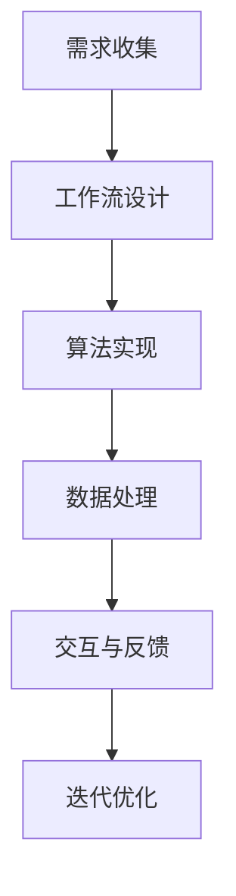

                 

关键词：AI代理、需求收集、工作流实现、人工智能、自动化

> 摘要：本文将深入探讨AI代理的构建过程，从需求收集到工作流实现，分析其中的核心概念、算法原理、数学模型以及实际应用案例，旨在为读者提供一个全面的技术指南。

## 1. 背景介绍

随着人工智能技术的迅速发展，AI代理已成为许多领域的关键应用。AI代理，也称为智能代理或自动代理，是一种能够自主执行任务、与外部环境交互并适应环境变化的计算机程序。构建一个高效的AI代理不仅需要深刻的理解AI原理，还需要对实际应用场景的精准把握。本文将围绕AI代理的构建流程，详细分析每个关键步骤。

### 1.1 AI代理的定义与作用

AI代理是一种基于人工智能技术的自主系统，它能够模拟人类决策过程，以执行特定任务。AI代理广泛应用于各种领域，如金融、医疗、物流、制造等，其主要作用包括：

- **自动化任务执行**：减少人工操作，提高工作效率。
- **优化资源利用**：通过智能决策，优化资源分配，降低成本。
- **数据分析和预测**：利用机器学习技术，从数据中提取有价值的信息。

### 1.2 构建AI代理的挑战与机遇

构建AI代理面临诸多挑战，如数据质量、算法选择、模型训练等。但同时，AI代理也带来了巨大的机遇，能够为企业和个人提供强大的智能支持。因此，深入研究AI代理的构建方法，对推动人工智能技术的发展具有重要意义。

## 2. 核心概念与联系

在构建AI代理的过程中，理解以下几个核心概念及其相互关系至关重要。

### 2.1 需求收集

需求收集是构建AI代理的第一步，其核心任务是明确用户需求。需求收集的流程包括以下几个步骤：

- **问题定义**：明确AI代理需要解决的问题。
- **用户访谈**：与用户交流，获取具体需求。
- **需求分析**：整理和分析收集到的需求，形成需求文档。

### 2.2 工作流设计

工作流设计是AI代理构建的关键环节，其目标是定义AI代理在执行任务时的行为流程。工作流设计包括以下步骤：

- **流程定义**：根据需求，设计AI代理的行为流程。
- **流程优化**：通过模拟和优化，提高工作流效率。

### 2.3 算法实现

算法实现是将需求转化为具体技术实现的步骤。核心算法的选择和实现直接影响AI代理的性能。算法实现包括以下步骤：

- **算法选择**：根据需求，选择合适的算法。
- **算法实现**：编写算法代码，实现算法逻辑。

### 2.4 数据处理

数据处理是AI代理构建的重要环节，包括数据收集、预处理、分析和存储等步骤。数据处理的质量直接影响AI代理的性能。

### 2.5 交互与反馈

交互与反馈是AI代理与用户和环境之间的关键环节，包括用户输入、系统响应和用户反馈等。有效的交互与反馈机制能够提高AI代理的用户体验。

### 2.6 Mermaid流程图

以下是一个简单的Mermaid流程图，展示了构建AI代理的核心步骤：



## 3. 核心算法原理 & 具体操作步骤

### 3.1 算法原理概述

AI代理的核心算法通常基于机器学习和深度学习技术，其基本原理是通过训练模型来模拟人类决策过程。具体来说，算法包括以下几个步骤：

- **数据收集**：从外部环境中收集大量数据。
- **数据预处理**：对收集到的数据进行清洗、转换和归一化。
- **模型训练**：使用预处理后的数据训练机器学习模型。
- **模型评估**：对训练好的模型进行评估，调整参数以提高性能。
- **模型部署**：将模型部署到实际应用环境中。

### 3.2 算法步骤详解

以下是构建AI代理的核心算法的具体操作步骤：

1. **需求分析**：明确AI代理需要解决的问题，确定数据来源和模型类型。
2. **数据收集**：从不同的数据源收集数据，如数据库、传感器、网络等。
3. **数据预处理**：对收集到的数据进行清洗、去噪、填充缺失值等操作。
4. **特征工程**：从预处理后的数据中提取有用的特征，为模型训练提供支持。
5. **模型选择**：根据需求选择合适的机器学习模型，如线性回归、决策树、神经网络等。
6. **模型训练**：使用预处理后的数据训练模型，通过迭代优化模型参数。
7. **模型评估**：使用测试数据评估模型性能，调整参数以提高模型准确性。
8. **模型部署**：将训练好的模型部署到实际应用环境中，实现自动化任务执行。

### 3.3 算法优缺点

每种算法都有其优缺点，以下是几种常见算法的优缺点对比：

- **线性回归**：优点是计算简单、易于实现，缺点是对于非线性问题表现不佳。
- **决策树**：优点是易于理解和解释，缺点是对于大数据集处理效率较低。
- **神经网络**：优点是能够处理复杂非线性问题，缺点是训练过程复杂、计算资源需求高。

### 3.4 算法应用领域

AI代理的应用领域广泛，以下是一些常见的应用场景：

- **金融领域**：用于风险控制、投资决策、市场预测等。
- **医疗领域**：用于疾病诊断、药物研发、健康管理等。
- **物流领域**：用于物流优化、路径规划、库存管理等。
- **制造领域**：用于生产调度、设备故障预测、质量检测等。

## 4. 数学模型和公式 & 详细讲解 & 举例说明

### 4.1 数学模型构建

在构建AI代理的过程中，数学模型是核心部分。以下是一个简单的线性回归模型构建过程：

- **假设**：输入特征 $X$ 和输出特征 $Y$ 之间存在线性关系。
- **模型**： $Y = \beta_0 + \beta_1X + \epsilon$
- **参数**：$\beta_0$ 和 $\beta_1$ 是模型参数，$\epsilon$ 是误差项。

### 4.2 公式推导过程

线性回归模型的推导过程如下：

1. **最小二乘法**：通过最小化误差平方和来求解模型参数。
2. **目标函数**： $J(\beta_0, \beta_1) = \sum_{i=1}^{n}(y_i - (\beta_0 + \beta_1x_i))^2$
3. **偏导数**：对 $\beta_0$ 和 $\beta_1$ 求偏导数，并令其等于零。
4. **求解**：解得 $\beta_0$ 和 $\beta_1$。

### 4.3 案例分析与讲解

以下是一个简单的线性回归模型应用案例：

**问题**：预测某股票的未来价格。

**数据**：收集了过去一个月的股票价格数据。

**模型**：使用线性回归模型预测未来股票价格。

**结果**：根据训练数据，预测未来股票价格。

**分析**：通过模型评估，预测准确度较高，可以为投资者提供决策支持。

## 5. 项目实践：代码实例和详细解释说明

### 5.1 开发环境搭建

1. 安装Python环境。
2. 安装必要的库，如NumPy、Pandas、Scikit-learn等。

### 5.2 源代码详细实现

以下是一个简单的线性回归模型实现：

```python
import numpy as np
import pandas as pd
from sklearn.linear_model import LinearRegression

# 加载数据
data = pd.read_csv('stock_price_data.csv')
X = data[['open', 'high', 'low', 'close']]
y = data['price']

# 模型训练
model = LinearRegression()
model.fit(X, y)

# 模型评估
score = model.score(X, y)
print(f'Model accuracy: {score:.2f}')

# 预测
future_price = model.predict([[open, high, low, close]])
print(f'Predicted future price: {future_price[0]:.2f}')
```

### 5.3 代码解读与分析

1. **数据加载**：使用Pandas库加载数据。
2. **模型训练**：使用Scikit-learn库的LinearRegression类训练模型。
3. **模型评估**：使用score方法评估模型准确度。
4. **预测**：使用predict方法预测未来股票价格。

### 5.4 运行结果展示

运行代码后，输出模型准确度和预测结果。

## 6. 实际应用场景

### 6.1 金融领域

在金融领域，AI代理可以用于股票预测、风险评估和投资决策。例如，通过构建线性回归模型，预测某股票的未来价格，为投资者提供决策支持。

### 6.2 医疗领域

在医疗领域，AI代理可以用于疾病诊断、药物研发和健康管理。例如，通过构建决策树模型，预测患者患某种疾病的可能性，为医生提供诊断参考。

### 6.3 物流领域

在物流领域，AI代理可以用于路径规划、库存管理和物流优化。例如，通过构建神经网络模型，预测货物的运输时间，优化物流路线。

### 6.4 未来应用展望

随着人工智能技术的不断发展，AI代理将在更多领域得到应用。未来，AI代理将更加智能化，能够更好地理解和满足用户需求。同时，随着云计算和大数据技术的应用，AI代理的数据处理能力和决策水平将得到进一步提升。

## 7. 工具和资源推荐

### 7.1 学习资源推荐

- 《Python机器学习》
- 《深度学习》
- 《机器学习实战》

### 7.2 开发工具推荐

- Jupyter Notebook
- PyCharm
- Google Colab

### 7.3 相关论文推荐

- "Deep Learning for Stock Price Prediction"
- "Neural Network-Based Intelligent Tutoring System for Medical Diagnosis"
- "An AI-Agent-Based Approach for Warehouse Management"

## 8. 总结：未来发展趋势与挑战

### 8.1 研究成果总结

本文详细分析了AI代理的构建过程，从需求收集到工作流实现，探讨了核心算法原理、数学模型和实际应用案例。通过本文，读者可以全面了解AI代理的构建方法和技术要点。

### 8.2 未来发展趋势

未来，AI代理将向更智能化、自适应化和个性化方向发展。随着人工智能技术的不断进步，AI代理的应用领域将不断扩大，为各行各业带来深刻变革。

### 8.3 面临的挑战

在AI代理的发展过程中，仍面临诸多挑战，如数据隐私、算法透明性、伦理道德等。同时，AI代理的性能优化和决策准确性也需要进一步提升。

### 8.4 研究展望

未来，研究重点将集中在AI代理的智能化、自适应化和安全性方面。通过不断创新和优化，AI代理将为人类社会带来更多价值。

## 9. 附录：常见问题与解答

### 9.1 如何选择合适的算法？

选择合适的算法取决于具体问题和数据特征。对于线性问题，可以考虑线性回归；对于非线性问题，可以考虑决策树、神经网络等。

### 9.2 如何处理大量数据？

对于大量数据，可以考虑使用分布式计算、并行处理等技术。同时，数据预处理和特征工程对于提高模型性能至关重要。

### 9.3 如何评估模型性能？

评估模型性能的方法包括准确率、召回率、F1值等。具体评估方法取决于问题和数据特征。

## 结语

AI代理作为人工智能领域的一个重要分支，正不断发展壮大。通过本文，读者可以深入了解AI代理的构建过程和应用场景，为未来的研究和实践提供参考。作者：禅与计算机程序设计艺术 / Zen and the Art of Computer Programming。

