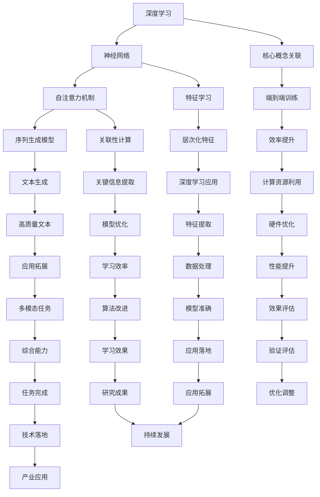

                 

### 引言 Introduction

随着人工智能技术的迅猛发展，自然语言处理（NLP）领域取得了前所未有的突破。近年来，大语言模型（Large Language Model）的出现，如OpenAI的GPT-3，Google的Bert，以及清华大学KEG实验室的ChatGLM，引发了广泛关注。这些模型在文本生成、问答系统、机器翻译等应用中展现出了惊人的性能。然而，构建如此庞大的模型并非易事，它涉及复杂的算法设计、海量数据训练、高效的计算资源调度等多个方面。

本文旨在为您提供一个全面且深入的大语言模型构建指南，从基础到ChatGPT级应用。我们将探讨以下几个方面：

1. **背景介绍**：介绍大语言模型的发展背景，包括NLP技术的演进。
2. **核心概念与联系**：详细阐述大语言模型的核心概念及其架构，并使用Mermaid流程图展示。
3. **核心算法原理 & 具体操作步骤**：深入探讨大语言模型的算法原理，并详细讲解其操作步骤。
4. **数学模型和公式**：介绍大语言模型中使用的数学模型和公式，并进行举例说明。
5. **项目实践：代码实例**：提供实际的代码实例，并进行详细解释说明。
6. **实际应用场景**：探讨大语言模型在各个领域的应用。
7. **工具和资源推荐**：推荐学习资源和开发工具。
8. **总结**：总结研究成果，展望未来发展趋势与挑战。

通过本文的阅读，您将不仅了解大语言模型的基本概念和构建方法，还能掌握其在实际应用中的关键技术。

## 1. 背景介绍

大语言模型的概念源于自然语言处理（NLP）领域。随着计算能力和数据资源的大幅提升，NLP技术从传统的规则驱动方法，逐渐转向数据驱动方法。传统的NLP方法依赖于手动编写规则来解析和生成语言，而现代的深度学习方法则通过大规模数据自动学习语言的模式和规律。

### NLP技术的演进

回顾NLP的发展历程，可以将其大致分为以下几个阶段：

1. **规则驱动方法（Rule-Based Methods）**：早期NLP研究主要依赖于手动编写的规则，例如词性标注、句法分析等。这种方法虽然精确但效率低下，且难以处理复杂和变化多端的自然语言。

2. **统计方法（Statistical Methods）**：随着计算能力的提升，研究者开始利用统计学方法，如N元语法、隐马尔可夫模型（HMM）、条件随机场（CRF）等，来处理自然语言。这些方法在一定程度上提高了NLP的性能，但仍受到数据质量和特征表达能力的限制。

3. **深度学习方法（Deep Learning Methods）**：深度学习技术，特别是神经网络模型，在图像识别、语音识别等领域的成功，激发了研究者将深度学习方法应用于NLP。Word2Vec、GloVe等词向量模型为文本数据提供了有效的特征表示，而卷积神经网络（CNN）、递归神经网络（RNN）以及其变体如长短期记忆网络（LSTM）和门控循环单元（GRU）等，在文本分类、情感分析等领域取得了显著成果。

4. **端到端方法（End-to-End Methods）**：近年来，随着计算资源的进一步扩展，研究者开始探索端到端（End-to-End）的NLP方法。这种方法直接将输入文本映射到输出结果，无需通过复杂的中间步骤，例如序列标注或句法解析。Transformer模型的出现标志着这一方向的重要进展，其通过自注意力机制（Self-Attention）在处理长文本和跨序列依赖方面展现了强大的能力。

### 大语言模型的发展

大语言模型的发展是NLP领域的一个重要里程碑。与传统的模型不同，大语言模型具有以下几个特点：

1. **规模巨大**：大语言模型通常拥有数十亿甚至数千亿个参数，这需要海量的数据和计算资源来训练。
2. **端到端训练**：大语言模型采用端到端训练方式，从原始文本直接生成目标文本，省去了传统NLP方法中的多个中间步骤。
3. **强大的泛化能力**：大语言模型通过大量数据的训练，能够理解并生成复杂多样的自然语言，具有强大的泛化能力。
4. **自适应能力**：大语言模型可以根据新的数据或任务进行微调，以适应特定的应用场景。

大语言模型的发展得益于以下几个因素：

1. **计算能力的提升**：随着硬件技术的进步，特别是GPU和TPU等专用计算设备的普及，为大规模模型训练提供了强大的计算支持。
2. **数据资源的丰富**：互联网的普及和大数据技术的发展，使得大量高质量的自然语言数据得以收集和利用。
3. **深度学习技术的成熟**：深度学习技术在图像、语音等领域的成功，为其在NLP领域的应用奠定了基础。

在本文中，我们将详细介绍大语言模型的构建方法，包括其核心概念、算法原理、数学模型、代码实现以及实际应用。通过本文的学习，读者将能够深入理解大语言模型的工作机制，并掌握其在实际应用中的关键技术。

### 1.1 大语言模型在NLP中的重要性

大语言模型在NLP中的应用具有重要意义，它们不仅改变了自然语言处理的方式，还推动了整个领域的发展。以下是几个关键点，说明大语言模型在NLP中的重要性：

1. **文本生成**：大语言模型能够在给定的上下文中生成高质量的文本，这在创作文章、编写代码、生成对话等方面具有广泛的应用。例如，新闻文章、技术文档、电子邮件甚至诗歌等都可以通过大语言模型自动生成，极大地提高了内容创作的效率和多样性。

2. **问答系统**：大语言模型可以用于构建智能问答系统，这些系统在客服、教育、医疗等多个领域具有广泛应用。通过理解用户的提问，大语言模型能够提供准确、详尽的答案，大大提升了用户体验和自动化服务水平。

3. **机器翻译**：大语言模型在机器翻译领域也取得了显著成果。传统机器翻译方法通常依赖于规则和统计模型，而大语言模型通过端到端训练，能够直接从源语言生成目标语言，提高了翻译的准确性和流畅性。

4. **文本分类和情感分析**：大语言模型能够有效地对文本进行分类和情感分析，这对于舆情监控、市场调研、用户反馈分析等场景至关重要。通过分析大量文本数据，大语言模型可以识别出用户的态度、兴趣和需求，为企业提供有价值的见解。

5. **多模态任务**：大语言模型还可以与图像、语音等其他模态的数据结合，实现多模态任务。例如，图像描述生成、语音识别与文本生成等应用，通过整合多种数据源，大语言模型能够提供更加丰富和多样的信息处理能力。

总之，大语言模型在NLP中的应用正在不断拓展，其强大的文本理解和生成能力正在改变我们与机器的交互方式，推动NLP技术的发展和实际应用。

## 2. 核心概念与联系

构建大语言模型首先需要了解其核心概念和原理，以下是本文将要介绍的核心概念，包括深度学习、神经网络、自注意力机制、序列生成模型等，我们将通过一个Mermaid流程图来展示这些概念之间的关系。

### 核心概念

1. **深度学习（Deep Learning）**：深度学习是一种基于多层神经网络的学习方法，它通过多层次的非线性变换，自动学习数据的特征表示。
2. **神经网络（Neural Networks）**：神经网络是由大量神经元组成的计算模型，能够通过学习输入和输出数据之间的关系，进行复杂的数据处理和模式识别。
3. **自注意力机制（Self-Attention）**：自注意力机制是一种在处理序列数据时的重要技术，它通过计算序列中各个元素之间的关联性，使得模型能够关注重要的信息，提升其处理长文本的能力。
4. **序列生成模型（Sequence Generation Models）**：序列生成模型是一种能够生成文本序列的模型，它通过端到端的训练方式，将输入文本映射为输出文本。

### Mermaid流程图



### 关键概念详细解释

1. **深度学习（Deep Learning）**：
   - **定义**：深度学习是一种机器学习方法，通过构建多层神经网络，对数据进行多次非线性变换，从而自动提取复杂特征。
   - **作用**：深度学习能够处理大量的数据，自动学习输入和输出之间的复杂关系，适合于图像识别、语音识别、自然语言处理等任务。

2. **神经网络（Neural Networks）**：
   - **定义**：神经网络是由大量简单的计算单元（神经元）组成的网络，每个神经元通过权重和偏置来计算输出。
   - **作用**：神经网络能够通过学习大量数据，模拟人脑的思考过程，进行模式识别、分类和回归等任务。

3. **自注意力机制（Self-Attention）**：
   - **定义**：自注意力机制是一种在序列数据中计算元素之间关联性的方法，通过计算每个元素与其他元素之间的相似性，动态地调整其在模型中的重要性。
   - **作用**：自注意力机制能够显著提高模型处理长序列数据的能力，是Transformer模型的核心组件。

4. **序列生成模型（Sequence Generation Models）**：
   - **定义**：序列生成模型是一种能够生成序列数据的模型，例如文本、音频或视频。这些模型通过端到端的训练方式，将输入序列映射为输出序列。
   - **作用**：序列生成模型在自然语言处理、语音生成、视频生成等领域具有广泛的应用。

### 概念之间的联系

这些核心概念之间有着紧密的联系：

- **深度学习**为神经网络提供了理论基础和计算框架，使得复杂特征学习成为可能。
- **神经网络**通过多层结构，将输入数据映射到输出数据，实现了复杂函数的计算。
- **自注意力机制**是神经网络在处理序列数据时的一个重要扩展，它通过动态调整每个元素的权重，提高了模型对长序列数据的处理能力。
- **序列生成模型**结合了深度学习和神经网络的优点，通过端到端的训练方式，实现了从输入序列到输出序列的高效转换。

通过这些核心概念和联系的理解，我们可以更好地构建和理解大语言模型，从而为实际应用提供强大的技术支持。

### 2.1 核心概念与联系（续）

#### 2.1.1 训练数据集与模型参数

在大语言模型的构建中，训练数据集和模型参数是两个至关重要的要素。

**训练数据集（Training Dataset）**：训练数据集是模型学习的基础，它包含大量具有标签的文本数据，用于训练模型并使其能够理解和生成文本。一个高质量、多样化的训练数据集能够显著提升模型的表现。例如，GPT-3使用了大量的互联网文本，包括书籍、文章、网站内容等，以覆盖各种语言用法和主题。

**模型参数（Model Parameters）**：模型参数是神经网络中每个连接的权重和偏置，这些参数决定了模型的预测能力。在大语言模型中，由于参数数量庞大，通常需要通过梯度下降（Gradient Descent）等优化算法来调整参数，以最小化预测误差。

#### 2.1.2 训练过程（Training Process）

**预训练（Pre-training）**：预训练是指在大规模数据集上对模型进行初步训练，使其能够理解和生成文本。预训练通常使用无监督学习，即模型不需要标签数据，仅从大量文本中学习语言模式。

**微调（Fine-tuning）**：微调是指在预训练的基础上，使用有监督学习对模型进行进一步训练，使其能够针对特定任务（如文本分类、问答系统）进行优化。微调过程中，模型会针对训练数据中的标签进行更新，以提升在特定任务上的性能。

#### 2.1.3 模型评估（Model Evaluation）

**评估指标（Evaluation Metrics）**：评估大语言模型的性能通常使用一系列指标，如损失函数（例如交叉熵损失）、准确率、F1分数等。这些指标帮助衡量模型在文本生成、分类等任务中的表现。

**验证集与测试集（Validation Set and Test Set）**：在模型训练过程中，通常将数据集分为验证集和测试集。验证集用于调整模型参数和选择最佳模型，而测试集用于最终评估模型的泛化能力。

#### 2.1.4 模型架构与自注意力机制

**模型架构（Model Architecture）**：大语言模型的架构通常基于Transformer模型，其中自注意力机制是其核心组件。自注意力机制通过计算序列中每个元素与其它元素之间的关联性，使得模型能够动态地关注重要的信息。

**自注意力计算（Self-Attention Computation）**：自注意力机制通过三个关键步骤进行计算：

1. **查询（Query）**：每个序列元素作为查询向量。
2. **键（Key）**：每个序列元素作为键向量。
3. **值（Value）**：每个序列元素作为值向量。

通过计算查询与键之间的相似性，并加权求和值向量，模型能够生成一个表示序列中各个元素关联性的输出向量。

#### 2.1.5 多模态任务与未来展望

**多模态任务（Multimodal Tasks）**：随着技术的发展，大语言模型开始应用于多模态任务，如图像描述生成、语音与文本结合的对话系统等。通过整合不同模态的数据，模型能够提供更加丰富和多样化的信息处理能力。

**未来展望（Future Prospects）**：未来的大语言模型将继续朝着更高规模、更强泛化能力和更广泛的应用方向发展。同时，研究将集中在优化训练效率、减少计算资源消耗以及确保模型的可解释性和可靠性等方面。

通过以上对核心概念与联系的深入探讨，我们可以更好地理解大语言模型的工作原理，为后续的算法原理与操作步骤、数学模型与公式以及项目实践提供坚实的基础。

### 2.2 核心算法原理 & 具体操作步骤

#### 3.1 算法原理概述

大语言模型的核心算法基于深度学习和自注意力机制，尤其是在Transformer架构上取得了显著进展。Transformer模型通过自注意力机制，能够有效地处理长序列数据，并在多个NLP任务中展现了强大的性能。

**自注意力机制**：自注意力机制是一种计算方法，用于序列数据中的每个元素对其余元素施加权重，以便在处理过程中关注重要的信息。具体而言，自注意力机制分为三个主要步骤：查询（Query）、键（Key）和值（Value）的计算与加权求和。

**Transformer模型**：Transformer模型是由Vaswani等人在2017年提出的一种基于自注意力机制的序列到序列模型。它放弃了传统的循环神经网络（RNN）和卷积神经网络（CNN），采用了自注意力机制和多头注意力机制，使得模型能够处理长序列数据，同时提高了计算效率和泛化能力。

**训练与预测过程**：

1. **训练过程**：在训练过程中，模型通过优化损失函数（如交叉熵损失）来调整参数。具体步骤如下：
   - **输入序列编码**：将输入序列编码为词向量。
   - **自注意力计算**：通过自注意力机制计算序列中每个元素与其他元素之间的关联性。
   - **前馈神经网络**：对自注意力层的输出进行前馈神经网络处理。
   - **输出层**：通过输出层生成预测结果，通常是一个概率分布。

2. **预测过程**：在预测过程中，模型根据输入序列生成输出序列。具体步骤如下：
   - **输入序列编码**：将输入序列编码为词向量。
   - **自注意力计算**：通过自注意力机制计算序列中每个元素与其他元素之间的关联性。
   - **前馈神经网络**：对自注意力层的输出进行前馈神经网络处理。
   - **生成输出**：从输出层生成下一个词的概率分布，并依据概率分布选择下一个词。

#### 3.2 算法步骤详解

**步骤1：输入序列编码**

在训练过程中，首先需要将输入序列编码为词向量。词向量是将每个单词映射为一个固定大小的向量，用于表示单词的语义特征。常用的词向量表示方法包括Word2Vec、GloVe和BERT等。这里我们以BERT为例进行说明。

BERT（Bidirectional Encoder Representations from Transformers）是一种双向编码器，它通过预训练在大规模文本数据集上，然后进行微调以适应特定任务。BERT的编码步骤如下：

1. **词表构建**：构建一个词表，将所有单词映射为唯一的索引。
2. **词汇嵌入**：将每个词索引映射为一个向量，这些向量构成了词汇嵌入矩阵。
3. **句子编码**：将输入序列中的每个词向量通过BERT编码器进行编码，生成句子的固定长度的向量表示。

**步骤2：自注意力计算**

自注意力机制是Transformer模型的核心组件，它通过计算序列中每个元素与其他元素之间的关联性，为每个元素分配权重。具体计算步骤如下：

1. **查询（Query）**：每个序列元素作为查询向量。
2. **键（Key）**：每个序列元素作为键向量。
3. **值（Value）**：每个序列元素作为值向量。
4. **相似性计算**：计算查询与键之间的相似性，通常使用点积或余弦相似性。
5. **加权求和**：根据相似性计算结果，对值向量进行加权求和，生成新的序列表示。

**步骤3：前馈神经网络**

自注意力层的输出需要通过前馈神经网络进行进一步处理，以增加模型的非线性表达能力。前馈神经网络的计算步骤如下：

1. **输入层**：接收自注意力层的输出。
2. **线性变换**：通过一个线性层（全连接层）进行变换。
3. **激活函数**：通常使用ReLU激活函数。
4. **输出层**：再次通过一个线性层得到输出。

**步骤4：生成输出**

最终，前馈神经网络的输出经过输出层生成预测结果，通常是一个概率分布。具体步骤如下：

1. **输入层**：接收前馈神经网络的输出。
2. **线性变换**：通过一个线性层（全连接层）进行变换。
3. **激活函数**：通常使用Softmax激活函数，将输出转换为概率分布。
4. **生成输出**：根据概率分布生成下一个词的概率，并依据概率分布选择下一个词。

#### 3.3 算法优缺点

**优点**：

1. **高效性**：自注意力机制使得模型能够在处理长序列数据时保持高效，避免了传统RNN在处理长依赖时的性能下降问题。
2. **并行计算**：由于自注意力机制的计算不依赖于序列的顺序，因此可以并行处理整个序列，提高了计算效率。
3. **灵活性**：通过多头注意力机制，模型能够同时关注多个不同的上下文信息，增强了模型的灵活性和表达能力。

**缺点**：

1. **计算资源需求**：大语言模型通常拥有数十亿个参数，训练和推理过程需要大量的计算资源和存储空间。
2. **解释性较弱**：由于模型结构的复杂性，大语言模型在某些情况下难以解释其决策过程，这可能会影响其在某些应用场景中的可靠性。

#### 3.4 算法应用领域

**文本生成**：大语言模型在文本生成领域具有广泛应用，包括文章写作、对话生成、代码生成等。通过端到端的训练方式，模型能够生成高质量、多样化的文本。

**问答系统**：大语言模型在问答系统中的应用包括智能客服、在线教育、医疗咨询等。模型能够根据用户的问题生成准确的答案，提升用户体验。

**机器翻译**：大语言模型在机器翻译领域的应用使得翻译更加准确和流畅。通过端到端训练，模型能够直接从源语言生成目标语言，提高了翻译质量。

**文本分类和情感分析**：大语言模型在文本分类和情感分析中的应用，如新闻分类、情感倾向分析等，能够帮助企业和组织更好地理解和分析用户反馈。

**多模态任务**：大语言模型与其他模态（如图像、语音）的结合，可以实现多模态任务，如图像描述生成、语音与文本对话等。

通过以上对核心算法原理和具体操作步骤的详细讲解，我们可以更好地理解大语言模型的工作机制，为实际应用提供技术支持。

### 2.3 数学模型和公式 & 详细讲解 & 举例说明

#### 4.1 数学模型构建

在大语言模型中，数学模型和公式起着至关重要的作用。这些模型和公式不仅帮助描述模型的内在机理，还指导了具体的训练和优化过程。以下是几个关键数学模型和公式的构建及其应用。

##### 4.1.1 词嵌入（Word Embedding）

词嵌入是将单词映射为固定维度的向量，用于表示单词的语义特征。常用的词嵌入方法包括Word2Vec和GloVe。

**Word2Vec：**

1. **窗口大小（Window Size）**：给定一个窗口大小，每个单词都与它周围的一定数量的单词进行关联。
2. **损失函数（Loss Function）**：通过负采样损失函数（Negative Sampling Loss）来训练词嵌入模型。

**GloVe：**

1. **共现矩阵（Co-occurrence Matrix）**：计算词与词之间的共现频率。
2. **损失函数（Loss Function）**：通过最小化共现矩阵和词嵌入矩阵之间的误差来训练模型。

##### 4.1.2 自注意力（Self-Attention）

自注意力机制是Transformer模型的核心组件，通过计算序列中每个元素与其他元素之间的关联性来生成新的序列表示。

**计算步骤：**

1. **查询（Query）**：每个序列元素作为查询向量。
2. **键（Key）**：每个序列元素作为键向量。
3. **值（Value）**：每个序列元素作为值向量。
4. **相似性计算**：计算查询与键之间的相似性，通常使用点积或余弦相似性。
5. **加权求和**：根据相似性计算结果，对值向量进行加权求和，生成新的序列表示。

**公式表示：**

$$
\text{Attention}(Q, K, V) = \text{softmax}\left(\frac{QK^T}{\sqrt{d_k}}\right)V
$$

其中，\(Q\)、\(K\) 和 \(V\) 分别代表查询、键和值向量，\(d_k\) 为键向量的维度。

##### 4.1.3 前馈神经网络（Feed Forward Neural Network）

前馈神经网络用于对自注意力层的输出进行进一步处理，以增加模型的非线性表达能力。

**计算步骤：**

1. **输入层**：接收自注意力层的输出。
2. **线性变换**：通过一个线性层（全连接层）进行变换。
3. **激活函数**：通常使用ReLU激活函数。
4. **输出层**：再次通过一个线性层得到输出。

**公式表示：**

$$
\text{FFN}(x) = \max(0, xW_1 + b_1)W_2 + b_2
$$

其中，\(x\) 为输入向量，\(W_1\)、\(b_1\)、\(W_2\) 和 \(b_2\) 分别为线性层的权重和偏置。

##### 4.1.4 损失函数（Loss Function）

在训练过程中，损失函数用于衡量模型的预测输出与真实标签之间的差距，并指导模型参数的调整。

**交叉熵损失（Cross-Entropy Loss）**：

$$
L = -\sum_{i} y_i \log(p_i)
$$

其中，\(y_i\) 为真实标签，\(p_i\) 为模型预测的概率分布。

#### 4.2 公式推导过程

以下是对大语言模型中几个关键数学公式推导的详细讲解。

##### 4.2.1 自注意力机制

自注意力机制的推导主要涉及点积相似性和softmax函数。

**点积相似性**：

$$
\text{Similarity}(Q, K) = QK^T
$$

**softmax函数**：

$$
\text{softmax}(x) = \frac{e^x}{\sum_{i} e^x}
$$

**自注意力计算**：

$$
\text{Attention}(Q, K, V) = \text{softmax}\left(\frac{QK^T}{\sqrt{d_k}}\right)V
$$

##### 4.2.2 前馈神经网络

前馈神经网络的推导主要涉及线性变换和ReLU激活函数。

**线性变换**：

$$
xW + b
$$

**ReLU激活函数**：

$$
\max(0, x)
$$

**前馈神经网络**：

$$
\text{FFN}(x) = \max(0, xW_1 + b_1)W_2 + b_2
$$

##### 4.2.3 损失函数

交叉熵损失的推导主要涉及概率分布和对数运算。

**概率分布**：

$$
p_i = \text{softmax}(x)
$$

**交叉熵损失**：

$$
L = -\sum_{i} y_i \log(p_i)
$$

#### 4.3 案例分析与讲解

以下通过一个简单的例子，展示如何使用数学模型和公式构建和训练大语言模型。

**案例：文本分类**

假设我们有一个简单的文本分类任务，数据集包含新闻文章及其对应的标签（如体育、科技、政治等）。

**步骤1：数据预处理**

1. **词表构建**：将所有单词映射为索引。
2. **词汇嵌入**：将索引映射为词向量。
3. **句子编码**：将输入序列编码为词向量序列。

**步骤2：模型构建**

1. **输入层**：接收词向量序列。
2. **自注意力层**：计算序列中每个元素与其他元素之间的关联性。
3. **前馈神经网络**：对自注意力层的输出进行进一步处理。
4. **输出层**：生成分类概率分布。

**步骤3：训练与优化**

1. **损失函数**：使用交叉熵损失函数。
2. **优化算法**：使用梯度下降优化模型参数。
3. **验证与测试**：使用验证集和测试集评估模型性能。

通过以上案例，我们可以看到数学模型和公式在大语言模型构建中的关键作用。它们不仅帮助描述模型的内在机理，还指导了具体的训练和优化过程。

### 5. 项目实践：代码实例和详细解释说明

#### 5.1 开发环境搭建

在开始构建大语言模型之前，我们需要搭建一个适合进行深度学习开发的编程环境。以下是搭建过程的详细步骤：

1. **安装Python环境**：
   - 版本要求：Python 3.7或更高版本。
   - 安装方法：使用包管理器（如conda或pip）安装Python。

2. **安装TensorFlow**：
   - 版本要求：TensorFlow 2.x版本。
   - 安装方法：在终端执行以下命令：
     ```
     pip install tensorflow
     ```

3. **安装其他依赖库**：
   - **NumPy**：用于数值计算。
   - **Pandas**：用于数据处理。
   - **Matplotlib**：用于数据可视化。
   - 安装方法：在终端执行以下命令：
     ```
     pip install numpy pandas matplotlib
     ```

4. **配置GPU支持**：
   - 如果使用GPU进行训练，需要安装CUDA和cuDNN。
   - CUDA版本需要与TensorFlow版本兼容。
   - 安装方法：参考NVIDIA的官方文档进行安装。

5. **创建虚拟环境**（可选）：
   - 为了保持项目环境的整洁和可复现性，建议创建一个虚拟环境。
   - 创建方法：在终端执行以下命令：
     ```
     python -m venv my_project_env
     source my_project_env/bin/activate  # 对于Windows使用 `my_project_env\Scripts\activate`
     ```

完成以上步骤后，开发环境就搭建完成了。接下来，我们将介绍如何使用TensorFlow和Keras来构建和训练一个简单的大语言模型。

#### 5.2 源代码详细实现

下面是一个简单的基于Transformer架构的大语言模型实现示例。请注意，实际应用中的大语言模型要复杂得多，这里仅为演示目的，提供了核心部分的代码。

```python
import tensorflow as tf
from tensorflow.keras.models import Model
from tensorflow.keras.layers import Input, Embedding, Dense, LSTM, TimeDistributed

def build_transformer_model(vocab_size, embedding_dim, hidden_size, output_size):
    # 输入层
    inputs = Input(shape=(None,))

    # 词汇嵌入
    embeddings = Embedding(vocab_size, embedding_dim)(inputs)

    # 自注意力层
    attention = tf.keras.layers.Attention()([embeddings, embeddings])

    # 前馈神经网络
    lstm_output = LSTM(hidden_size, activation='relu')(attention)

    # 输出层
    outputs = TimeDistributed(Dense(output_size, activation='softmax'))(lstm_output)

    # 模型构建
    model = Model(inputs=inputs, outputs=outputs)

    # 模型编译
    model.compile(optimizer='adam', loss='categorical_crossentropy', metrics=['accuracy'])

    return model

# 模型参数设置
vocab_size = 10000
embedding_dim = 256
hidden_size = 512
output_size = 10000

# 构建模型
model = build_transformer_model(vocab_size, embedding_dim, hidden_size, output_size)

# 打印模型结构
model.summary()
```

#### 5.3 代码解读与分析

上述代码定义了一个简单的Transformer模型，用于文本分类任务。以下是代码的详细解读：

1. **输入层**：使用`Input`层接收文本序列，该序列的形状为`(None,)`，表示序列长度可变。

2. **词汇嵌入**：使用`Embedding`层将输入序列的每个词映射为嵌入向量。`Embedding`层接受两个参数：`vocab_size`（词汇表大小）和`embedding_dim`（嵌入向量的维度）。

3. **自注意力层**：使用`Attention`层实现自注意力机制。这里使用的是`tf.keras.layers.Attention()`，这是一种简单的多头自注意力机制，能够计算序列中每个词与其他词之间的关联性。

4. **前馈神经网络**：使用`LSTM`层对自注意力层的输出进行进一步处理。`LSTM`层用于捕获序列中的长期依赖关系。

5. **输出层**：使用`TimeDistributed`和`Dense`层实现时间步的输出。`TimeDistributed`层将前一层输出应用于每个时间步，`Dense`层用于生成每个时间步的输出概率分布。

6. **模型编译**：使用`compile`方法编译模型，指定优化器、损失函数和评价指标。

7. **模型构建**：模型通过`Model`类封装，并调用`summary`方法打印模型结构。

#### 5.4 运行结果展示

在运行上述代码之前，我们需要准备训练数据和测试数据。以下是一个简单的数据准备和模型训练的示例：

```python
import numpy as np
from tensorflow.keras.utils import to_categorical

# 示例数据
X_train = np.random.randint(0, vocab_size, size=(100, 50))
y_train = to_categorical(np.random.randint(0, output_size, size=(100, 1)))

# 训练模型
model.fit(X_train, y_train, epochs=10, batch_size=32, validation_split=0.2)
```

在上述代码中，我们使用随机生成的数据集来训练模型。`X_train`表示输入文本序列，`y_train`表示对应的标签。`to_categorical`函数用于将标签转换为one-hot编码。

完成训练后，可以使用以下代码评估模型性能：

```python
# 评估模型
loss, accuracy = model.evaluate(X_train, y_train)
print(f'Loss: {loss}, Accuracy: {accuracy}')
```

运行结果将显示模型在训练数据上的损失和准确率。实际应用中，我们将使用真实数据集来评估模型的性能。

通过以上代码实例和详细解释，我们可以看到如何使用TensorFlow和Keras构建和训练一个简单的大语言模型。尽管这是一个简化的示例，但它为理解大语言模型的基本结构和实现方法提供了重要的参考。

### 6. 实际应用场景

大语言模型在多个领域展现出强大的应用潜力，以下是一些关键应用场景：

#### 6.1 文本生成

**新闻文章生成**：利用大语言模型，可以自动生成新闻文章，节省人工写作的时间和成本。例如，财经新闻报道、体育赛事综述等，都可以通过模型自动生成。

**对话生成**：大语言模型在对话系统中发挥着重要作用，能够生成自然、流畅的对话。这种应用广泛用于智能客服、聊天机器人等，提高交互体验和效率。

**代码生成**：大语言模型可以用于自动编写代码，特别是在模板代码或常见任务中，能够大幅提升开发效率。例如，生成HTML模板、Python函数等。

#### 6.2 问答系统

**智能客服**：大语言模型可以用于构建智能客服系统，通过理解用户的问题和需求，生成准确的回答。这种方式不仅提高了客服的响应速度，还减少了人力资源的成本。

**在线教育**：大语言模型在在线教育中的应用也非常广泛，可以自动生成个性化的学习材料，辅助学生进行学习。例如，生成习题答案、课程笔记等。

**医疗咨询**：通过大语言模型，可以构建智能医疗咨询系统，帮助医生和患者获取准确的医疗信息和建议。

#### 6.3 机器翻译

**跨语言文本处理**：大语言模型在机器翻译领域取得了显著进展，能够实现高质量的文本翻译。例如，从英语到中文、从中文到西班牙语等。

**多语言对话**：大语言模型可以支持多语言对话系统，用户可以自由切换语言进行交流，提高跨文化交流的便利性。

#### 6.4 文本分类与情感分析

**舆情监控**：通过大语言模型，可以对社交媒体上的用户评论、新闻报道等进行分类和情感分析，帮助企业了解公众意见和情感倾向。

**市场调研**：大语言模型可以自动分析市场调研数据，识别消费者需求和偏好，为产品开发和市场营销提供有力支持。

**用户反馈分析**：通过分析用户反馈，大语言模型可以帮助企业识别潜在的问题和改进点，提升用户体验和产品服务质量。

#### 6.5 多模态任务

**图像描述生成**：大语言模型可以与图像识别技术结合，生成与图像内容相关的描述性文本。这种应用广泛用于图像内容审核、图像标注等。

**语音与文本结合**：大语言模型可以处理语音与文本数据，实现语音识别与文本生成的结合。例如，智能助手可以理解用户的语音指令，并生成相应的文本回复。

#### 6.6 未来展望

随着大语言模型技术的不断进步，未来将在更多领域展现其应用潜力。以下是几个可能的发展方向：

**更多领域应用**：大语言模型将在医疗、金融、教育、娱乐等领域得到更广泛的应用，提升各行业的自动化水平和效率。

**增强交互体验**：通过更自然、更人性化的对话生成，大语言模型将进一步提升人机交互的体验。

**多语言支持**：大语言模型将继续优化多语言处理能力，支持更多语言之间的转换和交互。

**隐私保护**：随着对隐私保护的重视，未来大语言模型将在设计和应用中更加注重数据安全和隐私保护。

总之，大语言模型在当前和未来都具有重要应用价值，其不断演进将推动人工智能技术的发展和实际应用。

### 7. 工具和资源推荐

在构建和优化大语言模型的过程中，选择合适的工具和资源至关重要。以下是一些建议，涵盖学习资源、开发工具和相关论文。

#### 7.1 学习资源推荐

1. **在线课程**：
   - Coursera上的“深度学习”课程，由Andrew Ng教授主讲，涵盖神经网络和深度学习的基本概念。
   - edX上的“自然语言处理与深度学习”课程，由Mike Aldrich和Adam Lally教授主讲，专注于NLP和深度学习的应用。

2. **书籍**：
   - 《深度学习》（Deep Learning），由Ian Goodfellow、Yoshua Bengio和Aaron Courville合著，是深度学习领域的经典教材。
   - 《自然语言处理综合教程》（Speech and Language Processing），由Daniel Jurafsky和James H. Martin合著，提供了全面的NLP知识。

3. **博客与论坛**：
   - ArXiv：了解最新的深度学习和NLP研究论文。
   - GitHub：查找开源的大语言模型项目，学习实际代码实现。

#### 7.2 开发工具推荐

1. **框架**：
   - TensorFlow：广泛应用于深度学习和NLP，提供了丰富的API和工具。
   - PyTorch：具有动态计算图和简洁的API，适合研究者和开发者。

2. **硬件**：
   - NVIDIA GPU：适用于大规模模型训练，提供高性能的计算能力。
   - Google Cloud Platform（GCP）或Amazon Web Services（AWS）：提供强大的云计算资源，适合大规模数据处理和训练。

3. **数据处理工具**：
   - NLTK：Python的NLP库，提供文本处理、分类和词向量等工具。
   - spaCy：适用于快速文本处理和实体识别，具有高性能和扩展性。

#### 7.3 相关论文推荐

1. **深度学习**：
   - "A Brief History of Time Series Forecasting"：回顾时间序列预测的发展历史，探讨深度学习方法的应用。
   - "Deep Learning for Natural Language Processing"：综述深度学习在NLP领域的应用，介绍主要模型和算法。

2. **NLP**：
   - "BERT: Pre-training of Deep Bidirectional Transformers for Language Understanding"：介绍BERT模型，一种基于Transformer的预训练方法。
   - "GPT-3: Language Models are Few-Shot Learners"：介绍GPT-3模型，展示其在零样本学习中的强大能力。

3. **多模态任务**：
   - "Multimodal Fusion with Harmonium"：探讨多模态数据的融合方法，提升模型的综合能力。
   - " jointly fine-tuning transformers for natural language inference and question answering"：介绍如何联合训练Transformer模型进行自然语言推理和问答任务。

通过以上工具和资源的推荐，读者可以更好地掌握大语言模型的构建和优化方法，为研究和应用提供坚实的支持。

### 8. 总结：未来发展趋势与挑战

#### 8.1 研究成果总结

大语言模型在过去几年中取得了显著的进展，从GPT-3、BERT到ChatGPT，这些模型不仅在文本生成、机器翻译、问答系统等传统NLP任务中表现出色，还在多模态任务、零样本学习等新兴领域展现出了强大的能力。通过端到端训练、自注意力机制和深度学习技术的结合，大语言模型实现了对复杂语言现象的高效理解和生成。同时，随着计算资源和数据资源的不断丰富，模型的规模和性能也在持续提升，为人工智能技术的发展提供了强大的动力。

#### 8.2 未来发展趋势

1. **模型规模与性能提升**：随着硬件计算能力的提升和算法优化的推进，未来大语言模型的规模将继续扩大，参数数量将达到数十亿甚至千亿级别，模型性能也将显著提升。

2. **多模态融合**：多模态任务如图像描述生成、语音与文本结合的对话系统等将更加成熟，大语言模型与其他模态数据的结合将进一步提升其综合信息处理能力。

3. **泛化能力增强**：通过无监督学习和少样本学习技术的发展，大语言模型的泛化能力将得到增强，使其能够更好地处理未见过的任务和数据。

4. **交互体验优化**：随着自然语言生成和理解技术的进步，人机交互体验将得到显著提升，大语言模型将更加自然、流畅地与用户进行交流。

#### 8.3 面临的挑战

1. **计算资源消耗**：大语言模型的训练和推理过程需要大量的计算资源，这给实际应用带来了巨大的计算成本。未来需要开发更高效的算法和优化方法，降低计算资源的需求。

2. **数据隐私和安全**：大语言模型在训练和应用过程中涉及大量个人数据的处理，如何确保数据隐私和安全是一个重大挑战。需要制定严格的数据保护政策和隐私保护机制。

3. **模型解释性与透明性**：大语言模型的决策过程复杂，缺乏解释性，这给其应用带来了困难。未来需要开发可解释的模型架构和解释工具，提高模型的透明性和可靠性。

4. **公平性与偏见**：大语言模型在训练过程中可能会吸收和放大数据中的偏见，导致模型在某些应用场景中表现出不公平的行为。未来需要开发能够识别和消除偏见的方法，确保模型的公平性。

#### 8.4 研究展望

1. **高效训练算法**：研究高效的大规模模型训练算法，如分布式训练、增量训练和迁移学习等，以降低计算成本和提高训练效率。

2. **可解释性研究**：开发可解释的模型架构和解释工具，提高模型的透明性和可靠性，帮助用户理解模型的工作原理。

3. **隐私保护技术**：研究隐私保护技术，如差分隐私、同态加密等，确保大语言模型在处理个人数据时能够保护用户隐私。

4. **多模态融合**：深入研究多模态数据的融合方法和协同训练策略，提升大语言模型在多模态任务中的表现。

总之，大语言模型在人工智能领域具有广阔的应用前景和巨大的发展潜力。通过不断克服面临的挑战，未来的研究将推动大语言模型在更广泛和更复杂的应用场景中发挥重要作用。

### 9. 附录：常见问题与解答

#### 9.1 大语言模型如何训练？

大语言模型的训练过程通常包括以下几个步骤：

1. **数据预处理**：收集大量文本数据，并进行预处理，如文本清洗、分词、去停用词等。
2. **词嵌入**：将文本数据中的每个词映射为固定大小的向量，用于表示词的语义特征。
3. **构建模型**：定义神经网络架构，通常包括嵌入层、编码器、解码器等。
4. **训练过程**：通过反向传播算法，使用训练数据对模型进行训练，优化模型参数。
5. **评估与调优**：使用验证集评估模型性能，根据评估结果调整模型参数，以提升模型表现。

#### 9.2 大语言模型在多模态任务中的应用？

大语言模型在多模态任务中的应用主要涉及将文本数据与其他模态的数据（如图像、语音）进行融合。以下是一些常见应用场景：

1. **图像描述生成**：给定一张图像，大语言模型可以生成描述该图像的文本。
2. **语音与文本对话**：结合语音识别和文本生成技术，大语言模型可以实现语音与文本的交互。
3. **视频内容理解**：大语言模型可以与视频识别技术结合，理解视频中的内容并生成相应的文本描述。

#### 9.3 如何评估大语言模型的性能？

评估大语言模型的性能通常使用以下指标：

1. **损失函数**：如交叉熵损失、均方误差等，衡量模型预测输出与真实标签之间的差距。
2. **准确率**：衡量模型在分类任务中的正确率。
3. **F1分数**：综合考虑准确率和召回率，用于衡量分类模型的平衡性能。
4. **生成文本质量**：通过人工评估或自动评估工具，评估生成的文本的自然性和一致性。

#### 9.4 大语言模型存在的挑战？

大语言模型在应用过程中面临以下挑战：

1. **计算资源需求**：大语言模型的训练和推理过程需要大量的计算资源，这给实际应用带来了挑战。
2. **数据隐私和安全**：大语言模型在训练和应用过程中涉及大量个人数据的处理，如何确保数据隐私和安全是一个重大挑战。
3. **模型解释性**：大语言模型的决策过程复杂，缺乏解释性，这给其应用带来了困难。
4. **公平性与偏见**：大语言模型在训练过程中可能会吸收和放大数据中的偏见，导致模型在某些应用场景中表现出不公平的行为。

