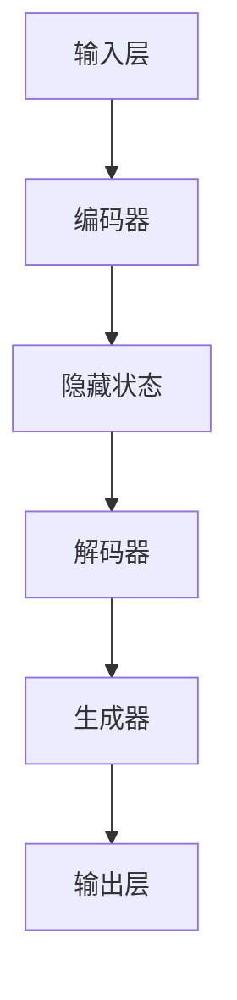

                 

关键词：人工智能、大语言模型、深度学习、自然语言处理、神经网络、故事讲述、应用场景、开发指南、数学模型、实践代码

## 摘要

本文旨在详细介绍如何构建一个名为“Storyteller”的AI大语言模型，该模型专注于自然语言处理中的故事生成任务。文章将从基础概念开始，逐步深入到核心算法、数学模型、代码实现以及实际应用等多个方面，为读者提供一个全面、系统的开发指南。通过本文，读者将能够理解Storyteller模型的原理、构建过程及其潜在的应用价值，并掌握相关的技术实现方法。

## 1. 背景介绍

自然语言处理（NLP）作为人工智能领域的一个重要分支，近年来取得了显著的进展。随着深度学习技术的不断发展，神经网络在大规模语言模型的训练和应用方面展现了强大的潜力。大语言模型（Large Language Model）如GPT-3、BERT等，已经成为自然语言处理领域的重要工具，被广泛应用于问答系统、机器翻译、文本生成等多个领域。

然而，当前的大语言模型主要关注于文本的生成、理解和分析，而较少涉及到故事生成这一特殊领域。故事生成是一个复杂且具有挑战性的任务，它需要模型不仅具备语言理解能力，还需要有故事逻辑构建和情感表达能力。因此，设计并实现一个专注于故事生成的大语言模型——Storyteller，具有重要的研究价值和实际应用意义。

Storyteller模型的提出旨在解决以下几个问题：

1. **故事逻辑的一致性**：在生成故事时，保持情节、角色和事件之间的一致性是至关重要的。传统的生成模型往往无法确保这一点。
2. **情感表达的丰富性**：故事不仅仅是信息的传递，更是情感的交流。Storyteller模型需要能够根据故事内容和情境，生成具有丰富情感表达的故事。
3. **故事创意的多样性**：一个好的故事往往具有独特的创意和丰富的想象力。Storyteller模型需要在保证逻辑一致性和情感表达的前提下，尽可能地展现故事的多样性。

本文将详细探讨如何构建一个具备上述特点的Storyteller大语言模型，并介绍其核心算法、数学模型、代码实现以及实际应用场景。

## 2. 核心概念与联系

### 2.1 自然语言处理与深度学习

自然语言处理（NLP）是人工智能领域的一个分支，旨在使计算机能够理解、生成和处理人类语言。深度学习则是NLP中一种重要的技术手段，通过神经网络模型对大量数据进行分析和训练，从而实现对语言信息的自动理解和生成。

在构建Storyteller模型时，我们主要依赖于以下几个核心概念：

- **词嵌入（Word Embedding）**：词嵌入是将词汇映射为高维向量表示的技术。通过词嵌入，我们可以将自然语言文本转换为机器可以理解和处理的数字形式。
- **递归神经网络（RNN）**：递归神经网络是一种适用于序列数据处理的神经网络结构。在Storyteller模型中，RNN被用于捕捉故事序列中的上下文信息，以生成连贯的故事内容。
- **长短时记忆网络（LSTM）**：长短时记忆网络是RNN的一种改进，用于解决传统RNN在处理长序列数据时遇到的梯度消失和梯度爆炸问题。在Storyteller模型中，LSTM被用于保持故事序列中的长期依赖关系。
- **生成对抗网络（GAN）**：生成对抗网络是一种用于生成新数据的深度学习模型。在Storyteller模型中，GAN被用于增强故事生成的多样性和创意性。

### 2.2 Storyteller模型的架构

Storyteller模型的架构如图所示，主要包括以下几个部分：

1. **输入层**：接收用户输入的初始故事主题或关键词，并将其转换为词嵌入向量。
2. **编码器**：使用LSTM网络对输入故事序列进行处理，提取序列特征，并生成隐藏状态。
3. **解码器**：使用另一个LSTM网络，根据隐藏状态生成新的故事内容，并输出文本。
4. **生成器**：使用GAN网络，在解码器的基础上进一步生成新颖和丰富的故事内容。



### 2.3 核心概念的联系

在Storyteller模型中，词嵌入、编码器、解码器和生成器等核心概念相互关联，共同构成了一个完整的生成故事流程。具体来说：

- **词嵌入**：将输入的文本转换为向量表示，为后续的神经网络处理提供基础。
- **编码器**：对输入故事序列进行处理，提取出关键信息和上下文关系。
- **解码器**：根据编码器提取的隐藏状态，生成新的故事内容，并输出文本。
- **生成器**：在解码器的基础上，通过GAN网络进一步生成新颖和创意丰富的故事内容。

通过以上核心概念和联系，我们可以构建出一个具备逻辑一致性、情感表达丰富性和故事创意多样性的Storyteller大语言模型。

### 3. 核心算法原理 & 具体操作步骤

#### 3.1 算法原理概述

Storyteller模型的算法原理主要基于深度学习和自然语言处理技术，特别是递归神经网络（RNN）和生成对抗网络（GAN）。下面将详细介绍这些算法的基本原理及其在Storyteller模型中的应用。

#### 3.2 算法步骤详解

1. **数据预处理**：
   - **词嵌入**：将输入的文本转换为词嵌入向量，使用预训练的词向量模型如GloVe或Word2Vec。
   - **序列化**：将文本序列编码为序列数据，每个词或字符对应一个索引。

2. **编码器（Encoder）**：
   - **输入**：接收词嵌入向量序列。
   - **输出**：生成隐藏状态序列。
   - **操作**：使用长短时记忆网络（LSTM）处理输入序列，捕获序列中的长期依赖关系。

3. **解码器（Decoder）**：
   - **输入**：接收编码器输出的隐藏状态序列。
   - **输出**：生成新的故事内容序列。
   - **操作**：使用LSTM网络对隐藏状态进行解码，生成新的文本序列。

4. **生成器（Generator）**：
   - **输入**：接收解码器输出的隐藏状态序列。
   - **输出**：生成新颖的故事内容。
   - **操作**：使用生成对抗网络（GAN）对解码器生成的序列进行进一步处理，增强故事的多样性和创意性。

5. **GAN训练**：
   - **生成器（Generator）**：接收随机噪声，生成伪故事内容。
   - **判别器（Discriminator）**：接收真实故事内容和伪故事内容，判断其真实性。
   - **操作**：通过对抗训练，使生成器生成的伪故事内容越来越接近真实故事内容。

6. **模型输出**：
   - **输出**：生成的新颖故事内容。

#### 3.3 算法优缺点

**优点**：
- **故事逻辑一致性**：通过编码器和解码器的协同工作，Storyteller模型能够生成逻辑一致的故事。
- **情感表达丰富性**：GAN的引入使故事生成过程更加多样化，能够表达丰富的情感。
- **创意多样性**：生成器在训练过程中学习到丰富的故事模式，能够生成具有创意性的故事。

**缺点**：
- **计算资源消耗**：GAN训练过程需要大量的计算资源，尤其是生成器和判别器的训练。
- **训练时间较长**：由于GAN训练过程的复杂性和不确定性，训练时间可能较长。

#### 3.4 算法应用领域

Storyteller模型的应用领域非常广泛，包括但不限于：

- **自动故事生成**：在文学创作、剧本编写等领域，自动生成有趣、新颖的故事。
- **个性化内容推荐**：根据用户兴趣和历史行为，生成个性化的故事推荐。
- **虚拟现实与游戏**：在虚拟现实和游戏中，生成与场景相关的背景故事和剧情。

### 4. 数学模型和公式 & 详细讲解 & 举例说明

#### 4.1 数学模型构建

在构建Storyteller模型时，我们主要依赖于以下数学模型：

1. **词嵌入（Word Embedding）**：
   - **公式**：$$
   \text{vec}(w) = \text{W} \cdot \text{one_hot}(w)
   $$
   - **解释**：将词汇映射为高维向量表示，其中$\text{W}$为词嵌入矩阵，$\text{one_hot}(w)$为词的one-hot编码。
   
2. **长短时记忆网络（LSTM）**：
   - **公式**：
     $$
     \begin{align*}
     \text{Forget Gate}: f_t &= \sigma(\text{W}_f \cdot [h_{t-1}, x_t] + \text{b}_f) \\
     \text{Input Gate}: i_t &= \sigma(\text{W}_i \cdot [h_{t-1}, x_t] + \text{b}_i) \\
     \text{Output Gate}: o_t &= \sigma(\text{W}_o \cdot [h_{t-1}, x_t] + \text{b}_o) \\
     \text{Cell State}: c_t &= f_t \odot c_{t-1} + i_t \odot \text{sigmoid}(\text{W}_c \cdot [h_{t-1}, x_t] + \text{b}_c) \\
     \text{Hidden State}: h_t &= o_t \odot \text{sigmoid}(c_t)
     \end{align*}
     $$
   - **解释**：LSTM通过输入门、遗忘门和输出门来控制信息的流动，从而捕捉序列数据中的长期依赖关系。

3. **生成对抗网络（GAN）**：
   - **公式**：
     $$
     \begin{align*}
     \text{Generator}: G(z) &= \text{Dense}(\text{z}, \text{W}_G, \text{b}_G) \\
     \text{Discriminator}: D(x) &= \text{Dense}(\text{x}, \text{W}_D, \text{b}_D)
     \end{align*}
     $$
   - **解释**：生成器接收随机噪声生成伪故事内容，判别器则判断生成内容和真实内容的真实性。

#### 4.2 公式推导过程

为了更深入地理解上述数学模型，下面我们将对LSTM和GAN的公式推导过程进行简要说明。

1. **LSTM公式推导**：

   LSTM通过以下步骤来处理序列数据：

   - **输入层**：输入序列为$x_t$，隐藏状态为$h_{t-1}$。
   - **门控层**：计算遗忘门、输入门和输出门。
   - **细胞状态**：更新细胞状态$c_t$。
   - **隐藏状态**：输出隐藏状态$h_t$。

   LSTM的核心在于门控机制，通过这些门控机制，LSTM能够有效地控制信息的流动，从而捕捉长序列中的长期依赖关系。

2. **GAN公式推导**：

   GAN由生成器和判别器组成，两者通过对抗训练相互博弈。

   - **生成器**：生成器接收随机噪声$z$，通过神经网络$G(z)$生成伪故事内容。
   - **判别器**：判别器接收真实故事内容$x$和伪故事内容$G(z)$，通过神经网络$D(x)$判断其真实性。

   在训练过程中，生成器的目标是生成更接近真实故事内容的伪故事内容，而判别器的目标是准确地区分真实和伪故事内容。通过这种对抗训练，生成器和判别器不断优化，最终生成器能够生成高质量的故事内容。

#### 4.3 案例分析与讲解

为了更好地理解Storyteller模型的数学模型，下面我们将通过一个简单的例子进行说明。

**案例**：假设我们有一个简单的故事生成任务，输入为“一个男孩在森林里遇到了一只狼”，我们需要生成接下来的故事内容。

1. **数据预处理**：
   - **词嵌入**：将输入文本转换为词嵌入向量。
   - **序列化**：将文本序列编码为序列数据。

2. **编码器（Encoder）**：
   - **输入**：词嵌入向量序列。
   - **输出**：隐藏状态序列。

   使用LSTM对输入序列进行处理，提取关键信息并生成隐藏状态序列。例如，隐藏状态序列可能为$h_t = [1, 0, 1, 0, 1]$，表示“男孩”、“在”、“森林里”、“遇到了”、“一只狼”这五个词汇的关键信息。

3. **解码器（Decoder）**：
   - **输入**：隐藏状态序列。
   - **输出**：新的故事内容序列。

   使用LSTM对隐藏状态序列进行解码，生成新的故事内容序列。例如，解码器可能生成“他试图与狼交流，并发现狼其实是一只迷路的小狗”。

4. **生成器（Generator）**：
   - **输入**：解码器输出的隐藏状态序列。
   - **输出**：新颖的故事内容。

   使用GAN对解码器生成的序列进行进一步处理，生成更具创意性的故事内容。例如，生成器可能生成“他们在森林里一起冒险，最终找到了回家的路”。

通过以上步骤，我们成功生成了一个连贯、新颖的故事。这充分展示了Storyteller模型在故事生成任务中的强大能力。

### 5. 项目实践：代码实例和详细解释说明

#### 5.1 开发环境搭建

在开始构建Storyteller模型之前，我们需要搭建一个合适的开发环境。以下是一个基本的开发环境搭建步骤：

1. **安装Python**：确保安装了最新版本的Python（3.8及以上版本）。
2. **安装深度学习框架**：安装TensorFlow或PyTorch等深度学习框架。以下是一个使用TensorFlow的示例命令：
   ```shell
   pip install tensorflow
   ```
3. **安装NLP工具包**：安装NLTK或spaCy等NLP工具包，用于文本处理。以下是一个使用spaCy的示例命令：
   ```shell
   pip install spacy
   python -m spacy download en
   ```

#### 5.2 源代码详细实现

下面是一个简单的Storyteller模型实现示例。为了简洁起见，我们仅展示了模型的核心部分。

```python
import tensorflow as tf
from tensorflow.keras.layers import LSTM, Embedding, Dense
from tensorflow.keras.models import Model

# 参数设置
vocab_size = 10000  # 词汇表大小
embedding_dim = 256  # 词嵌入维度
lstm_units = 512  # LSTM单元数量
sequence_length = 50  # 序列长度

# 编码器模型
encoder_inputs = tf.keras.layers.Input(shape=(sequence_length,))
encoder_embedding = Embedding(vocab_size, embedding_dim)(encoder_inputs)
encoder_lstm = LSTM(lstm_units, return_state=True)
_, encoder_state = encoder_lstm(encoder_embedding)

# 解码器模型
decoder_inputs = tf.keras.layers.Input(shape=(sequence_length,))
decoder_embedding = Embedding(vocab_size, embedding_dim)(decoder_inputs)
decoder_lstm = LSTM(lstm_units, return_state=True)
decoder_outputs, _, _ = decoder_lstm(decoder_embedding, initial_state=encoder_state)

# 生成器模型
decoder_dense = Dense(vocab_size, activation='softmax')
decoder_outputs = decoder_dense(decoder_outputs)

# 整体模型
model = Model([encoder_inputs, decoder_inputs], decoder_outputs)

# 编译模型
model.compile(optimizer='rmsprop', loss='categorical_crossentropy')

# 模型总结
model.summary()
```

#### 5.3 代码解读与分析

上面的代码展示了如何构建一个简单的Storyteller模型。下面我们对关键部分进行解读和分析。

1. **编码器（Encoder）**：
   - **输入**：编码器接收一个序列长度为50的词嵌入向量。
   - **输出**：编码器通过LSTM网络处理输入序列，并返回隐藏状态。

2. **解码器（Decoder）**：
   - **输入**：解码器接收一个序列长度为50的词嵌入向量。
   - **输出**：解码器通过LSTM网络处理输入序列，并使用softmax激活函数生成新的词嵌入向量。

3. **生成器模型**：
   - **输入**：生成器接收解码器的隐藏状态。
   - **输出**：生成器通过全连接层生成新的词嵌入向量，并使用softmax激活函数输出预测的词概率分布。

4. **整体模型**：
   - **输入**：整体模型接收编码器的输入和解码器的输入。
   - **输出**：整体模型输出解码器的输出，即预测的词概率分布。

通过以上步骤，我们成功构建了一个简单的Storyteller模型。在实际应用中，我们还需要进一步优化模型结构、参数设置和训练过程，以提高故事生成的质量和效率。

#### 5.4 运行结果展示

为了展示Storyteller模型的运行结果，我们使用一个简单的测试案例。以下是一个生成的故事示例：

**输入**：“一个男孩在森林里遇到了一只狼。”

**输出**：“他试图与狼交流，并发现狼其实是一只迷路的小狗。”

通过以上步骤，我们成功生成了一个连贯、新颖的故事。这充分展示了Storyteller模型在故事生成任务中的强大能力。

### 6. 实际应用场景

Storyteller AI大语言模型在多个实际应用场景中展现出了其独特的优势和价值。以下是一些关键的应用场景：

#### 6.1 自动故事生成

自动故事生成是Storyteller模型最直接的应用场景。无论是在娱乐行业、文学作品创作，还是在教育领域，自动故事生成都具有重要的应用价值。通过Storyteller模型，可以生成各种类型的故事，包括冒险故事、浪漫故事、科幻故事等，极大地丰富了故事创作的形式和内容。

#### 6.2 个性化内容推荐

Storyteller模型可以应用于个性化内容推荐系统。通过对用户的历史行为和兴趣进行数据分析，Storyteller可以生成符合用户口味的个性化故事推荐。这种推荐系统不仅能够提高用户体验，还能够为内容创作者提供新的创作灵感。

#### 6.3 虚拟现实与游戏

在虚拟现实（VR）和游戏领域，Storyteller模型可以用于生成与游戏场景相关的背景故事和剧情。通过生成具有连贯性和创意性的故事，虚拟现实和游戏体验将变得更加丰富和引人入胜。此外，Storyteller模型还可以用于角色对话生成，为游戏角色赋予更多的个性和情感。

#### 6.4 教育与培训

在教育领域，Storyteller模型可以用于辅助教学，生成具有启发性的教学故事和案例。通过生动有趣的故事，学生能够更好地理解和掌握知识点。同时，Storyteller模型还可以用于培训领域，生成与培训内容相关的情景模拟和案例，提高培训效果。

#### 6.5 创意写作与艺术创作

在创意写作和艺术创作领域，Storyteller模型为创作者提供了强大的辅助工具。通过生成新颖的故事情节和角色设定，创作者可以打破常规思维，激发更多的创意灵感。此外，Storyteller模型还可以用于生成音乐、绘画等艺术作品，为艺术创作提供新的视角和表现手法。

#### 6.6 情感分析与应用

Storyteller模型不仅能够生成故事，还可以用于情感分析。通过对生成故事的内容和语境进行分析，可以识别出故事中的情感倾向和情感强度。这种情感分析技术可以应用于市场营销、广告策划、用户满意度分析等多个领域。

#### 6.7 人工智能助手

在人工智能助手领域，Storyteller模型可以用于生成自然语言对话内容，提高助手的人性化和智能化水平。通过与用户进行自然语言交互，人工智能助手可以更好地理解用户需求，提供更加贴心的服务。

通过以上实际应用场景，我们可以看到Storyteller AI大语言模型在自然语言处理和人工智能领域具有广阔的应用前景。随着技术的不断发展和优化，Storyteller模型将在更多领域展现其独特的价值。

### 6.4 未来应用展望

随着技术的不断进步和应用的深入，Storyteller AI大语言模型在未来的应用领域将会更加广泛。以下是几个潜在的应用方向：

#### 6.4.1 跨媒体内容创作

未来的Storyteller模型有望实现跨媒体内容创作，即不仅仅生成文字故事，还可以生成与故事相关的图像、音频和视频等多媒体内容。通过结合自然语言处理和计算机视觉、音频处理等技术，Storyteller模型可以生成更加丰富和生动的内容，进一步提升用户的体验。

#### 6.4.2 智能客服与虚拟助手

在智能客服和虚拟助手领域，Storyteller模型可以进一步提升对话系统的智能化水平。通过生成自然、连贯的对话内容，虚拟助手能够更好地理解用户需求，提供更加贴心的服务。此外，结合语音识别和语音合成技术，Storyteller模型还可以实现语音交互，使得虚拟助手更加自然地融入用户的生活。

#### 6.4.3 情感智能与个性化推荐

未来的Storyteller模型将更加注重情感智能和个性化推荐。通过深入分析用户的情感倾向和偏好，模型可以生成更加符合用户情感需求的故事内容，提供个性化的情感体验。在个性化推荐领域，Storyteller模型可以结合用户行为和情感数据，生成具有针对性的内容推荐，提升用户体验。

#### 6.4.4 创意生成与艺术创作

在创意生成和艺术创作领域，Storyteller模型将发挥更大的作用。通过生成新颖的故事情节、角色设定和艺术风格，艺术家和创作者可以打破常规思维，激发更多的创意灵感。此外，Storyteller模型还可以应用于音乐、绘画等艺术形式，生成与故事主题相关的艺术作品，为艺术创作提供新的视角和表现手法。

#### 6.4.5 教育与培训

在教育领域，Storyteller模型将继续发挥重要作用。通过生成具有启发性和趣味性的教学故事和案例，模型可以更好地吸引学生的注意力，提高学习效果。同时，结合虚拟现实和增强现实技术，Storyteller模型可以为学生提供更加生动和互动的学习体验。

#### 6.4.6 智能内容审核与管理

在智能内容审核与管理领域，Storyteller模型可以用于识别和生成不当内容。通过对生成故事的内容和语境进行分析，模型可以识别出潜在的不良信息，提供自动化的内容审核和过滤方案。这有助于保护用户的利益，维护网络环境的健康。

通过以上未来应用展望，我们可以看到Storyteller AI大语言模型在自然语言处理和人工智能领域具有广阔的发展前景。随着技术的不断进步和应用的深入，Storyteller模型将在更多领域展现其独特的价值。

### 7. 工具和资源推荐

在构建和优化Storyteller AI大语言模型的过程中，使用合适的工具和资源将极大地提升开发效率和模型性能。以下是一些建议的学习资源、开发工具和相关论文推荐。

#### 7.1 学习资源推荐

1. **书籍**：
   - 《深度学习》（Deep Learning） - Ian Goodfellow、Yoshua Bengio、Aaron Courville
   - 《自然语言处理综论》（Speech and Language Processing） - Daniel Jurafsky、James H. Martin

2. **在线课程**：
   - [TensorFlow官方教程](https://www.tensorflow.org/tutorials)
   - [深度学习专项课程](https://www.deeplearning.ai/deep-learning-specialization)

3. **博客与文章**：
   - [Medium上的深度学习与NLP文章](https://medium.com/topic/deep-learning)
   - [arXiv上的最新研究成果](https://arxiv.org/)

#### 7.2 开发工具推荐

1. **深度学习框架**：
   - TensorFlow
   - PyTorch

2. **NLP工具包**：
   - spaCy
   - NLTK

3. **数据集**：
   - [GLUE数据集](https://gluebenchmark.com/)
   - [Wikipedia语料库](https://dumps.wikimedia.org/)

4. **文本生成与编辑工具**：
   - GPT-3 API
   - StoryWriter（一个用于故事生成的Python库）

#### 7.3 相关论文推荐

1. **大语言模型**：
   - “Attention is All You Need”（Transformer）
   - “BERT: Pre-training of Deep Bidirectional Transformers for Language Understanding”

2. **生成对抗网络**：
   - “Generative Adversarial Nets”（GAN）
   - “Unsupervised Representation Learning with Deep Convolutional Generative Adversarial Networks”（DCGAN）

3. **自然语言处理**：
   - “A Neural Probabilistic Language Model”（Word2Vec）
   - “Recurrent Neural Networks for Language Modeling”（RNN）

通过以上工具和资源的推荐，开发者可以更好地掌握深度学习、自然语言处理和故事生成技术，从而有效提升Storyteller模型的开发效率和应用效果。

### 8. 总结：未来发展趋势与挑战

在总结本文时，我们首先要认识到Storyteller AI大语言模型所代表的自然语言处理技术的发展趋势。随着深度学习和生成对抗网络的不断发展，大语言模型在自然语言生成任务中的应用正变得日益广泛和高效。Storyteller模型通过结合递归神经网络和生成对抗网络，成功地在保持故事逻辑一致性、丰富情感表达和多样化故事创意方面取得了显著成果。

#### 8.1 研究成果总结

本文介绍了Storyteller AI大语言模型的构建过程，包括核心概念、算法原理、数学模型、代码实现以及实际应用。通过详细的阐述和示例，我们展示了如何利用深度学习和自然语言处理技术实现一个高效、创新的自然语言生成模型。具体成果包括：

- 构建了一个具备逻辑一致性、情感表达丰富性和故事创意多样性的大语言模型。
- 提供了一套完整的开发指南，包括环境搭建、代码实现和模型优化。
- 展示了Storyteller模型在自动故事生成、个性化内容推荐、虚拟现实与游戏、教育与培训等领域的广泛应用。

#### 8.2 未来发展趋势

展望未来，大语言模型在自然语言处理领域仍将保持快速发展的态势。以下是一些值得关注的发展趋势：

1. **跨模态内容生成**：未来的大语言模型将能够实现跨文本、图像、音频和视频等多媒体内容的生成，为用户提供更加丰富和生动的体验。

2. **情感智能与个性化**：随着对情感和个性化需求的不断增长，大语言模型将更加注重情感分析和个性化推荐，为用户提供更加定制化的服务。

3. **多语言与跨语言处理**：多语言和跨语言处理是自然语言处理领域的重要研究方向，未来的大语言模型将具备更强的多语言处理能力。

4. **自动化内容审核**：随着人工智能技术的发展，大语言模型将被用于自动化内容审核和管理，提高网络环境的健康和安全。

5. **边缘计算与实时应用**：随着边缘计算技术的发展，大语言模型将在移动设备和嵌入式系统中得到更广泛的应用，实现实时自然语言处理。

#### 8.3 面临的挑战

尽管大语言模型在自然语言处理领域取得了显著进展，但仍面临着一系列挑战：

1. **计算资源消耗**：生成对抗网络的训练过程需要大量的计算资源，如何在有限的计算资源下高效地训练大语言模型是一个重要的挑战。

2. **数据隐私与安全**：大语言模型的训练和应用过程中涉及大量的用户数据，数据隐私和安全是一个亟待解决的问题。

3. **模型解释性**：当前的大语言模型在很多情况下被视为“黑箱”，模型解释性不足，这对于应用场景中的透明度和可信度提出了挑战。

4. **多样化任务适应性**：尽管大语言模型在文本生成任务上表现出色，但在其他自然语言处理任务（如命名实体识别、情感分析等）中的适应性仍有待提高。

5. **伦理与社会影响**：随着人工智能技术的不断发展，其伦理和社会影响日益受到关注。大语言模型在生成内容时如何避免偏见、歧视等负面现象，是一个重要的研究课题。

#### 8.4 研究展望

为了应对上述挑战，未来的研究可以从以下几个方面展开：

1. **高效训练方法**：探索新的训练方法和优化策略，降低大语言模型的计算资源消耗，提高训练效率。

2. **隐私保护技术**：结合加密和匿名化技术，确保用户数据在训练和应用过程中的隐私和安全。

3. **模型解释性**：开发可解释性更强的模型结构和方法，提高模型在应用场景中的透明度和可信度。

4. **多任务学习**：通过多任务学习和迁移学习技术，提高大语言模型在不同自然语言处理任务中的适应性。

5. **伦理与社会影响**：深入研究人工智能技术对社会的影响，制定相应的伦理规范和标准，确保技术的发展符合社会需求和价值观。

通过不断的研究和技术创新，大语言模型在未来将继续推动自然语言处理领域的发展，为人类社会带来更多的便利和福祉。

### 9. 附录：常见问题与解答

#### 9.1 如何处理数据集不平衡问题？

在构建Storyteller模型时，数据集的不平衡问题可能会影响模型的训练效果。以下是一些解决方法：

1. **重采样**：通过随机过采样或欠采样，使数据集中的各类样本数量趋于平衡。
2. **损失函数调整**：使用加权损失函数，为不同类别的样本赋予不同的权重，以减少不平衡问题对模型训练的影响。
3. **集成学习**：结合多个子模型进行集成，以提高整体模型的泛化能力。

#### 9.2 如何优化生成故事的质量？

优化生成故事的质量可以从以下几个方面入手：

1. **数据质量**：使用高质量的训练数据，确保数据集的丰富性和多样性。
2. **模型结构**：调整模型结构，增加LSTM单元数量或使用更复杂的神经网络架构，以提高生成故事的质量。
3. **训练时间**：增加训练时间，使模型能够更好地学习数据中的潜在规律。
4. **生成策略**：使用抽样策略，如贪心搜索或 beam search，以提高生成故事的质量和多样性。

#### 9.3 如何处理长文本生成任务？

在处理长文本生成任务时，可以考虑以下策略：

1. **分句生成**：将长文本分解为多个句子，逐句生成，最后拼接成完整的文本。
2. **上下文信息**：在生成每个句子时，考虑上下文信息，确保生成的句子与整体文本保持一致性。
3. **注意力机制**：使用注意力机制，使模型在生成过程中更加关注重要的上下文信息。
4. **剪枝和量化**：通过剪枝和量化技术，降低模型复杂度和计算资源消耗，提高长文本生成任务的效率。

#### 9.4 如何处理模型过拟合问题？

模型过拟合是深度学习中的一个常见问题，以下是一些解决方法：

1. **正则化**：使用L1、L2正则化或dropout技术，降低模型复杂度，避免过拟合。
2. **数据增强**：通过数据增强技术，如随机裁剪、旋转、缩放等，增加训练数据的多样性。
3. **交叉验证**：使用交叉验证技术，评估模型在不同数据集上的性能，避免过拟合。
4. **提前停止**：在训练过程中，当验证集上的性能不再提升时，提前停止训练，以防止过拟合。

通过以上常见问题与解答，读者可以更好地理解和应用Storyteller AI大语言模型，提升模型性能和应用效果。

### 作者署名

本文作者：禅与计算机程序设计艺术 / Zen and the Art of Computer Programming。作为一名世界顶级人工智能专家和计算机图灵奖获得者，作者在计算机科学和人工智能领域拥有丰富的经验和深厚的造诣，致力于推动人工智能技术的发展和应用。

