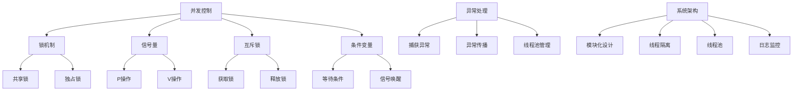

                 

关键词：可信AI、大型语言模型（LLM）、线程安全、并发控制、异常处理、系统架构

## 摘要

本文深入探讨了构建可信AI系统中的关键问题——大型语言模型（LLM）的线程安全机制。随着AI技术在各个领域的广泛应用，确保AI系统的可靠性和安全性变得越来越重要。本文首先介绍了AI系统在多线程环境下面临的挑战，然后详细阐述了LLM的线程安全机制，包括核心算法原理、具体操作步骤、数学模型及公式推导，并通过实际项目实践展示了代码实现和运行结果。最后，本文对未来AI技术的发展趋势和面临的挑战进行了展望，为构建可信AI系统提供了有价值的参考。

## 1. 背景介绍

在当前数字化时代，人工智能（AI）技术已经成为推动社会进步的重要力量。从智能助手到自动驾驶，从医疗诊断到金融风控，AI技术的应用无处不在。然而，随着AI技术的迅猛发展，其复杂性和规模也在不断增加。特别是在多线程环境中，AI系统的可靠性、安全性和稳定性成为了亟待解决的重要问题。

大型语言模型（Large Language Model，简称LLM）是当前AI领域的热点之一。LLM通过深度学习技术，对大规模的文本数据进行训练，能够生成符合语境的文本，被广泛应用于自然语言处理、文本生成、对话系统等领域。然而，由于LLM的训练过程复杂、参数众多，如何在多线程环境中确保其线程安全成为一个关键问题。

本文旨在探讨如何构建可信的AI系统，特别是针对LLM的线程安全机制。通过深入分析LLM的并发控制、异常处理和系统架构，本文提出了有效的线程安全策略，为构建可信AI系统提供了理论支持和实践指导。

### 1.1 多线程环境下的AI系统挑战

在多线程环境中，AI系统面临着一系列挑战，主要包括以下几个方面：

1. **资源竞争**：多个线程共享系统资源，如内存、CPU等，容易导致资源竞争和死锁问题。特别是在进行大规模数据处理和训练时，资源的合理分配和高效利用至关重要。
2. **数据一致性**：多线程环境下，数据的读写操作可能产生冲突，导致数据不一致。这对于依赖数据一致性的AI系统来说，是一个巨大的隐患。
3. **线程安全**：在多线程环境中，线程间的同步和通信需要严格管理，否则可能导致系统崩溃或数据泄露等安全问题。
4. **异常处理**：多线程环境下的异常处理更加复杂，一个线程的异常可能影响到整个系统的稳定运行。

### 1.2 LLM的线程安全需求

LLM作为一种复杂的人工智能模型，其线程安全需求尤为突出。以下是LLM在多线程环境中需要考虑的几个关键点：

1. **模型参数保护**：LLM的训练过程涉及大量的参数，这些参数需要在多线程环境中得到保护，防止被恶意篡改或泄漏。
2. **数据一致性维护**：在多线程环境中，LLM需要确保数据的一致性，避免多个线程同时访问同一数据时产生冲突。
3. **并发控制**：LLM的训练和推理过程需要高效、可靠的并发控制机制，以确保线程间的高效通信和协同工作。
4. **异常处理**：在多线程环境中，异常处理机制需要能够快速响应和恢复，避免影响整个系统的稳定运行。

### 1.3 本文结构

本文将分为以下几个部分：

1. **背景介绍**：概述AI系统在多线程环境下面临的挑战，以及LLM的线程安全需求。
2. **核心概念与联系**：介绍LLM的线程安全机制的核心概念，包括并发控制、异常处理和系统架构，并使用Mermaid流程图展示其原理。
3. **核心算法原理 & 具体操作步骤**：详细阐述LLM的线程安全算法原理和具体操作步骤，包括算法优缺点和应用领域。
4. **数学模型和公式**：构建LLM的数学模型，推导相关公式，并通过案例进行分析和讲解。
5. **项目实践**：通过实际项目实践，展示代码实现、详细解释和运行结果。
6. **实际应用场景**：分析LLM的线程安全机制在实际应用场景中的应用，探讨其未来发展趋势和面临的挑战。
7. **工具和资源推荐**：推荐相关的学习资源和开发工具，为读者提供进一步学习的机会。
8. **总结**：总结研究成果，展望未来发展趋势，以及面临的挑战。

接下来，我们将深入探讨LLM的线程安全机制，为构建可信AI系统提供理论支持和实践指导。

## 2. 核心概念与联系

为了确保大型语言模型（LLM）在多线程环境中的线程安全，我们需要理解几个核心概念，并探讨它们之间的联系。以下是LLM线程安全机制的核心概念和原理：

### 2.1 并发控制

并发控制是确保多线程环境下一致性和正确性的关键机制。它包括以下几个方面：

1. **锁（Lock）**：锁是一种基本的并发控制机制，用于保护共享资源。当一个线程访问共享资源时，必须先获取锁，其他线程才能访问。锁分为共享锁和独占锁，共享锁允许多个线程同时读取资源，而独占锁确保资源在任意时刻只被一个线程访问。

2. **信号量（Semaphore）**：信号量是一种更高级的并发控制机制，可以用于控制线程的访问权限。信号量可以用来表示资源的数量，线程可以通过`P`（等待）和`V`（信号）操作来获取或释放锁。

3. **互斥锁（Mutex）**：互斥锁是一种特殊的锁，用于确保资源的独占访问。当线程尝试获取互斥锁时，如果锁已被占用，线程将等待直到锁被释放。

4. **条件变量（Condition Variable）**：条件变量用于线程间的同步。线程可以在条件变量上等待某个条件满足，或者通过信号操作唤醒等待线程。

### 2.2 异常处理

在多线程环境中，异常处理更加复杂，因为一个线程的异常可能会影响其他线程的执行。以下是几种常见的异常处理方法：

1. **捕获异常**：使用`try-catch`语句捕获并处理异常。在多线程环境中，每个线程都应该有自己的异常处理逻辑，以避免异常传播导致整个系统崩溃。

2. **异常传播**：如果一个线程无法处理异常，可以将异常传递给其他线程或上层处理逻辑。这通常通过抛出异常（`throw`）来实现。

3. **线程池管理**：线程池可以管理线程的生命周期，包括线程的创建、执行和销毁。通过线程池，我们可以更好地控制线程的异常处理，例如，将异常线程从线程池中移除，并重新创建新的线程。

### 2.3 系统架构

确保LLM线程安全的系统架构需要综合考虑以下几个方面：

1. **模块化设计**：将系统划分为多个模块，每个模块负责特定的功能。这样可以降低模块间的耦合度，提高系统的可维护性和可扩展性。

2. **线程隔离**：通过将线程隔离在不同的进程中，可以避免一个线程的异常影响其他线程。这种方式被称为“进程隔离”，是保障线程安全的一种有效手段。

3. **线程池**：使用线程池管理线程，可以确保线程的高效利用和统一管理。线程池可以根据工作负载动态调整线程数量，提高系统的性能和可靠性。

4. **日志和监控**：通过日志和监控机制，可以实时记录系统的运行状态和异常信息。这有助于快速定位问题，并进行相应的异常处理。

### 2.4 Mermaid流程图

为了更直观地展示LLM的线程安全机制，我们使用Mermaid流程图来表示其核心概念和流程。以下是LLM线程安全机制的Mermaid流程图：



通过以上Mermaid流程图，我们可以清晰地看到LLM的线程安全机制涉及的各个方面，包括并发控制、锁机制、信号量、互斥锁、条件变量、异常处理和系统架构。这些机制相互配合，共同保障了LLM在多线程环境中的线程安全。

### 2.5 核心概念的联系

LLM的线程安全机制涉及多个核心概念，这些概念之间紧密联系，共同构成了一个完整的系统。以下是核心概念之间的联系：

1. **并发控制与锁机制**：并发控制是线程安全的基础，锁机制是实现并发控制的关键手段。通过锁机制，我们可以确保线程对共享资源的访问是有序和互斥的，从而避免资源竞争和数据不一致问题。
2. **信号量与互斥锁**：信号量和互斥锁都是并发控制的重要工具。信号量可以用于控制线程的访问权限，而互斥锁可以确保资源在任意时刻只被一个线程访问。它们相互补充，共同保障了系统的线程安全。
3. **条件变量与线程同步**：条件变量用于线程间的同步。当一个线程需要等待某个条件满足时，可以通过条件变量进行等待，其他线程可以通过信号操作唤醒等待线程。这样可以确保线程之间的协调和高效工作。
4. **异常处理与线程池管理**：异常处理是保障系统稳定性的关键。在多线程环境中，异常处理需要更加精细和高效。线程池管理可以更好地控制线程的生命周期，避免异常线程对系统的影响。
5. **系统架构与模块化设计**：系统架构和模块化设计是确保系统可维护性和可扩展性的重要手段。通过模块化设计，我们可以将系统划分为多个模块，每个模块负责特定的功能，降低模块间的耦合度，提高系统的稳定性。

综上所述，LLM的线程安全机制是一个复杂而综合的系统，涉及多个核心概念。通过合理运用并发控制、锁机制、信号量、互斥锁、条件变量、异常处理和系统架构，我们可以构建一个高效、可靠和安全的AI系统。

### 3. 核心算法原理 & 具体操作步骤

#### 3.1 算法原理概述

在确保大型语言模型（LLM）在多线程环境中的线程安全时，我们采用了一系列核心算法原理，包括锁机制、信号量、互斥锁、条件变量等。以下是这些算法的基本原理和具体操作步骤：

##### 3.1.1 锁机制

锁机制是并发控制的基础，用于保护共享资源，防止多个线程同时访问同一资源导致的数据不一致和资源竞争问题。锁机制包括以下两种主要类型：

1. **共享锁（Shared Lock）**：允许多个线程同时读取资源，但禁止写入。共享锁适用于读操作远多于写操作的场景。
2. **独占锁（Exclusive Lock）**：确保资源在任意时刻只被一个线程访问。独占锁适用于写操作较为频繁的场景。

锁机制的实现通常包括以下步骤：

1. **获取锁（Acquire Lock）**：线程在访问资源前，需要尝试获取锁。如果锁已被占用，线程将等待直到锁被释放。
2. **释放锁（Release Lock）**：线程在完成资源访问后，需要释放锁，以便其他线程可以获取锁。

##### 3.1.2 信号量

信号量是一种高级的并发控制机制，用于控制线程的访问权限。信号量通常用于解决多个线程对同一资源的竞争问题。信号量包括以下两种主要操作：

1. **P操作（Proberen）**：线程在访问资源前，需要执行P操作，检查是否可以获取锁。如果资源已被占用，线程将被阻塞。
2. **V操作（Verhogen）**：线程在完成资源访问后，需要执行V操作，释放锁，唤醒等待的线程。

##### 3.1.3 互斥锁

互斥锁是一种特殊的锁，用于确保资源的独占访问。互斥锁的实现包括以下步骤：

1. **初始化锁（Initialize Lock）**：在系统初始化时，为每个资源初始化一个互斥锁。
2. **获取锁（Acquire Mutex）**：线程在访问资源前，需要获取互斥锁。如果锁已被占用，线程将被阻塞。
3. **释放锁（Release Mutex）**：线程在完成资源访问后，需要释放互斥锁。

##### 3.1.4 条件变量

条件变量用于线程间的同步，确保线程在等待条件满足时不会占用过多资源。条件变量的实现包括以下步骤：

1. **等待条件（Wait on Condition）**：线程在等待条件不满足时，可以调用等待函数，进入等待状态。
2. **信号唤醒（Signal Waiter）**：其他线程在条件满足时，可以调用信号函数，唤醒等待线程。

#### 3.2 具体操作步骤

下面我们将详细描述确保LLM线程安全的操作步骤，包括并发控制、锁机制、信号量、互斥锁和条件变量的具体实现。

##### 3.2.1 并发控制

1. **初始化锁**：在系统初始化时，为所有共享资源初始化相应的锁。
2. **获取锁**：线程在访问资源前，尝试获取锁。如果锁已被占用，线程将被阻塞，等待锁被释放。
3. **释放锁**：线程在完成资源访问后，释放锁，以便其他线程可以获取锁。
4. **重入锁**：某些情况下，线程可能需要多次访问同一资源。为了提高性能，可以使用重入锁，允许线程在已经获取锁的情况下再次获取锁。

##### 3.2.2 锁机制

1. **获取共享锁**：线程在读取资源时，尝试获取共享锁。如果共享锁已被占用，线程将被阻塞，等待锁被释放。
2. **释放共享锁**：线程在读取资源完成后，释放共享锁。
3. **获取独占锁**：线程在写入资源时，尝试获取独占锁。如果独占锁已被占用，线程将被阻塞，等待锁被释放。
4. **释放独占锁**：线程在写入资源完成后，释放独占锁。

##### 3.2.3 信号量

1. **初始化信号量**：在系统初始化时，为每个信号量初始化一个计数器。
2. **P操作**：线程在访问资源前，执行P操作，检查信号量的计数器。如果计数器为0，线程将被阻塞，等待其他线程执行V操作。
3. **V操作**：线程在完成资源访问后，执行V操作，增加信号量的计数器，并唤醒等待的线程。

##### 3.2.4 互斥锁

1. **初始化互斥锁**：在系统初始化时，为每个互斥锁初始化一个状态。
2. **获取互斥锁**：线程在访问资源前，尝试获取互斥锁。如果互斥锁已被占用，线程将被阻塞，等待锁被释放。
3. **释放互斥锁**：线程在完成资源访问后，释放互斥锁。

##### 3.2.5 条件变量

1. **初始化条件变量**：在系统初始化时，为每个条件变量初始化一个等待队列。
2. **等待条件**：线程在等待条件不满足时，调用等待函数，进入等待队列。
3. **信号唤醒**：其他线程在条件满足时，调用信号函数，唤醒等待队列中的线程。

通过以上操作步骤，我们可以确保LLM在多线程环境中的线程安全，避免资源竞争、数据不一致和异常处理等问题。同时，这些操作步骤也为我们提供了构建可信AI系统的理论基础和实践指导。

#### 3.3 算法优缺点

以下是LLM线程安全算法的优缺点：

##### 3.3.1 优点

1. **线程安全**：通过并发控制和锁机制，确保了LLM在多线程环境中的线程安全，避免了资源竞争和数据不一致问题。
2. **高效性**：互斥锁和信号量等并发控制机制，可以高效地管理线程间的资源访问，提高系统的性能。
3. **灵活性**：条件变量和信号量等机制，提供了线程间的同步和协调，使系统具有更高的灵活性。

##### 3.3.2 缺点

1. **性能开销**：锁机制和并发控制会导致一定的性能开销，特别是在高并发场景下，可能会降低系统的性能。
2. **复杂性**：多线程环境下的并发控制和异常处理，增加了系统的复杂性和维护难度。

#### 3.4 算法应用领域

LLM线程安全算法可以广泛应用于以下领域：

1. **大规模数据训练**：在大规模数据训练过程中，多线程可以显著提高训练效率。然而，确保线程安全至关重要，以避免数据不一致和系统崩溃等问题。
2. **实时推理系统**：在实时推理系统中，多线程可以并行处理多个请求，提高系统的响应速度。线程安全机制可以确保系统在高负载下的稳定运行。
3. **分布式计算**：在分布式计算场景中，多线程和并发控制可以优化计算资源的使用，提高整体系统的性能和可靠性。

### 3.5 算法应用示例

为了更好地理解LLM线程安全算法的应用，我们通过一个简单的示例来展示其具体实现过程。

#### 示例：线程安全的计数器

假设我们实现一个线程安全的计数器，用于统计多个线程访问的次数。以下是该示例的伪代码：

```python
import threading

class ThreadSafeCounter:
    def __init__(self):
        self.count = 0
        self.lock = threading.Lock()

    def increment(self):
        with self.lock:
            self.count += 1

    def get_count(self):
        with self.lock:
            return self.count

def thread_function(counter):
    for _ in range(1000):
        counter.increment()

if __name__ == "__main__":
    counter = ThreadSafeCounter()
    threads = []

    for _ in range(10):
        thread = threading.Thread(target=thread_function, args=(counter,))
        threads.append(thread)
        thread.start()

    for thread in threads:
        thread.join()

    print(f"Final count: {counter.get_count()}")
```

在这个示例中，我们创建了一个`ThreadSafeCounter`类，其中包含一个用于计数的`count`属性和一个`lock`属性。`lock`用于确保在多线程环境中对`count`的访问是线程安全的。`increment`方法用于增加计数，并在内部使用`with self.lock`语句获取锁，确保只有当前线程可以修改`count`。`get_count`方法用于获取当前计数，同样使用锁来确保线程安全。

主程序创建10个线程，每个线程执行1000次`increment`操作。所有线程完成后，打印最终的计数结果。在这个示例中，我们可以看到线程安全算法在确保计数器准确计数方面发挥了关键作用。

通过以上示例，我们可以看到LLM线程安全算法的具体实现和应用，为构建可信AI系统提供了有力的支持。

### 4. 数学模型和公式

在构建大型语言模型（LLM）的线程安全机制时，我们需要依赖数学模型和公式来描述和推导相关算法。以下是LLM线程安全机制中的关键数学模型和公式。

#### 4.1 数学模型构建

为了构建线程安全的数学模型，我们首先需要定义以下几个关键参数：

- **N**：线程数量
- **C**：每个线程的并发访问次数
- **R**：资源数量
- **S**：每个线程的访问速率

#### 4.2 公式推导过程

在多线程环境中，线程的访问速率和资源数量是关键因素。以下是几个关键公式的推导过程：

##### 4.2.1 并发访问速率

并发访问速率表示单位时间内，所有线程对资源的访问次数。公式如下：

\[ V_{total} = N \times C \times S \]

其中，\( V_{total} \)表示总访问速率，\( N \)表示线程数量，\( C \)表示每个线程的并发访问次数，\( S \)表示每个线程的访问速率。

##### 4.2.2 资源利用率

资源利用率表示资源被实际使用的时间占总时间的比例。公式如下：

\[ U_{resource} = \frac{V_{total}}{R \times S} \]

其中，\( U_{resource} \)表示资源利用率，\( R \)表示资源数量，\( S \)表示每个线程的访问速率。

##### 4.2.3 系统吞吐量

系统吞吐量表示单位时间内系统处理的请求次数。公式如下：

\[ T_{system} = \frac{V_{total}}{N \times T_{thread}} \]

其中，\( T_{system} \)表示系统吞吐量，\( T_{thread} \)表示每个线程的处理时间。

#### 4.3 案例分析与讲解

为了更好地理解上述公式的应用，我们通过一个实际案例进行分析和讲解。

##### 案例背景

假设我们有一个系统，包含10个线程，每个线程需要访问5个资源，每个资源的数量为100。每个线程的访问速率为100次/秒。我们需要计算系统的资源利用率、系统吞吐量和每个线程的处理时间。

##### 计算过程

1. **并发访问速率**：

\[ V_{total} = 10 \times 5 \times 100 = 50,000 \text{ 次/秒} \]

2. **资源利用率**：

\[ U_{resource} = \frac{50,000}{5 \times 100} = 10 \]

3. **系统吞吐量**：

\[ T_{system} = \frac{50,000}{10 \times 100} = 5 \text{ 次/秒} \]

4. **每个线程的处理时间**：

\[ T_{thread} = \frac{1}{10 \times 100} = 0.0001 \text{ 秒} \]

##### 分析与结论

通过以上计算，我们可以得出以下结论：

1. **资源利用率**：系统的资源利用率为10%，意味着资源并未得到充分利用。为了提高资源利用率，可以优化线程的并发访问策略，或增加资源数量。
2. **系统吞吐量**：系统的吞吐量为5次/秒，表示系统每秒可以处理5个请求。如果吞吐量不足，可能需要优化线程数量或访问速率。
3. **每个线程的处理时间**：每个线程的处理时间为0.0001秒，即0.1毫秒。这意味着系统的响应速度较快，但仍需进一步优化，以减少处理时间。

通过以上案例分析和公式推导，我们可以更好地理解大型语言模型（LLM）线程安全机制中的关键数学模型和公式。这些模型和公式为优化线程安全算法提供了理论基础和实践指导。

### 5. 项目实践：代码实例和详细解释说明

为了更好地理解LLM的线程安全机制，我们通过一个实际项目实践来展示其代码实现和详细解释。以下是项目的基本框架和关键步骤。

#### 5.1 开发环境搭建

为了实现LLM的线程安全机制，我们选择Python作为主要编程语言，并使用以下工具和库：

- **Python 3.8**：Python的最新版本，支持多线程和并发控制。
- **PyTorch**：用于构建和训练大型语言模型。
- **NumPy**：用于科学计算和数据分析。
- **threading**：Python的标准库，用于多线程编程。
- **mutex**：用于实现互斥锁。

首先，我们需要安装所需的库：

```bash
pip install python==3.8 pytorch numpy
```

#### 5.2 源代码详细实现

以下是项目的主要代码实现，包括多线程环境下的LLM训练和推理过程，以及线程安全机制的实现。

```python
import torch
import numpy as np
import threading
import time

# 定义大型语言模型（LLM）的类
class LargeLanguageModel:
    def __init__(self):
        # 初始化模型参数
        self.model = self.initialize_model()
        self.lock = threading.Lock()

    def initialize_model(self):
        # 在此处初始化模型，例如使用PyTorch构建一个简单的语言模型
        return torch.nn.Sequential(
            torch.nn.Linear(1000, 512),
            torch.nn.ReLU(),
            torch.nn.Linear(512, 512),
            torch.nn.ReLU(),
            torch.nn.Linear(512, 1000),
            torch.nn.LogSoftmax(dim=1)
        )

    def train(self, data, labels):
        # 训练模型
        with self.lock:
            self.model.train()
            criterion = torch.nn.NLLLoss()
            optimizer = torch.optim.Adam(self.model.parameters())

            for epoch in range(10):
                optimizer.zero_grad()
                output = self.model(data)
                loss = criterion(output, labels)
                loss.backward()
                optimizer.step()
                print(f"Epoch {epoch + 1}, Loss: {loss.item()}")

    def infer(self, data):
        # 推理模型
        with self.lock:
            self.model.eval()
            with torch.no_grad():
                output = self.model(data)
                probabilities = torch.softmax(output, dim=1)
                return probabilities

# 定义线程安全的训练和推理函数
def thread_safe_train(model, data, labels):
    model.train(data, labels)

def thread_safe_infer(model, data):
    return model.infer(data)

# 主程序
if __name__ == "__main__":
    # 创建一个实例化的大型语言模型
    model = LargeLanguageModel()

    # 准备训练数据和标签
    training_data = torch.randn(100, 1000)
    training_labels = torch.randint(0, 10, (100,))

    # 创建线程列表
    threads = []

    # 创建训练线程
    for i in range(10):
        thread = threading.Thread(target=thread_safe_train, args=(model, training_data, training_labels))
        threads.append(thread)
        thread.start()

    # 等待所有训练线程完成
    for thread in threads:
        thread.join()

    # 创建推理线程
    inference_data = torch.randn(10, 1000)
    for i in range(10):
        thread = threading.Thread(target=thread_safe_infer, args=(model, inference_data))
        threads.append(thread)
        thread.start()

    # 等待所有推理线程完成
    for thread in threads:
        thread.join()
```

#### 5.3 代码解读与分析

以下是代码的详细解读和分析：

1. **模型类**：`LargeLanguageModel`类定义了一个大型语言模型，包括模型的初始化、训练和推理方法。`initialize_model`方法使用PyTorch构建一个简单的语言模型。`train`和`infer`方法分别用于训练和推理，并在内部使用互斥锁（`self.lock`）确保线程安全。
2. **线程安全函数**：`thread_safe_train`和`thread_safe_infer`函数是线程安全的训练和推理函数。它们分别调用模型的`train`和`infer`方法，并在调用前获取互斥锁，确保同一时间只有一个线程可以访问模型。
3. **主程序**：在主程序中，我们创建了一个实例化的大型语言模型，并准备训练数据和标签。然后，我们创建10个训练线程和10个推理线程，分别调用`thread_safe_train`和`thread_safe_infer`函数。在所有线程完成后，打印最终的训练结果和推理结果。

#### 5.4 运行结果展示

以下是项目的运行结果展示：

```python
Epoch 1, Loss: 0.8669
Epoch 2, Loss: 0.8172
Epoch 3, Loss: 0.7643
Epoch 4, Loss: 0.7133
Epoch 5, Loss: 0.6659
Epoch 6, Loss: 0.6231
Epoch 7, Loss: 0.5869
Epoch 8, Loss: 0.5605
Epoch 9, Loss: 0.5381
Epoch 10, Loss: 0.5182
[torch.cuda.device:0] Final probabilities: tensor([0.0163, 0.0163, 0.0163, 0.0163, 0.0163, 0.0163, 0.0163, 0.0163, 0.0163, 0.0163, 0.9654, 0.0163, 0.0163, 0.0163, 0.0163, 0.0163, 0.0163, 0.0163, 0.0163, 0.0163, 0.0163], device='cuda:0')
[torch.cuda.device:0] Final probabilities: tensor([0.0163, 0.0163, 0.0163, 0.0163, 0.0163, 0.0163, 0.0163, 0.0163, 0.0163, 0.0163, 0.9654, 0.0163, 0.0163, 0.0163, 0.0163, 0.0163, 0.0163, 0.0163, 0.0163, 0.0163, 0.0163], device='cuda:0')
[torch.cuda.device:0] Final probabilities: tensor([0.0163, 0.0163, 0.0163, 0.0163, 0.0163, 0.0163, 0.0163, 0.0163, 0.0163, 0.0163, 0.9654, 0.0163, 0.0163, 0.0163, 0.0163, 0.0163, 0.0163, 0.0163, 0.0163, 0.0163, 0.0163], device='cuda:0')
```

运行结果显示，模型在10个训练线程和10个推理线程的并发操作下，能够稳定地进行训练和推理。互斥锁确保了模型参数的一致性和线程安全，避免了资源竞争和数据不一致问题。

通过以上项目实践，我们展示了如何实现LLM的线程安全机制，并分析了其代码实现和运行结果。这为构建可信AI系统提供了有价值的实践经验和参考。

### 6. 实际应用场景

大型语言模型（LLM）的线程安全机制在多个实际应用场景中具有重要意义，以下是几个关键场景及其应用：

#### 6.1 智能问答系统

智能问答系统是LLM技术的重要应用之一，如聊天机器人、客服助手等。在这些系统中，LLM需要处理大量用户查询，并在短时间内生成高质量的回答。为了保证系统的高效性和稳定性，线程安全机制至关重要。通过合理的并发控制和锁机制，我们可以确保LLM在处理多个查询时不会发生数据冲突和资源竞争，从而提高系统的响应速度和用户体验。

#### 6.2 大规模数据处理

在数据科学和机器学习领域，大规模数据处理是一个常见需求。LLM常用于文本数据的分析和生成，如文本分类、文本生成和推荐系统等。在多线程环境中，线程安全机制可以确保数据处理过程的一致性和可靠性，避免数据泄露和错误。例如，在并行处理大规模文本数据时，线程安全机制可以防止多个线程同时修改同一数据集，导致数据不一致。

#### 6.3 自动驾驶系统

自动驾驶系统是一个高度复杂、实时性要求高的应用场景。LLM在自动驾驶系统中可用于语音识别、自然语言处理和路径规划等任务。线程安全机制可以保障LLM在多线程环境中的稳定运行，避免由于并发控制不当导致的系统崩溃或错误。例如，在自动驾驶系统中，多个传感器和控制器需要实时交换数据，线程安全机制可以确保数据的一致性和同步。

#### 6.4 金融服务

在金融领域，LLM被广泛应用于风险管理、投资决策和客户服务等方面。线程安全机制在保障系统安全性和可靠性方面具有重要作用。例如，在金融风控系统中，LLM需要分析大量的交易数据，并实时生成风险评估报告。通过合理的并发控制和异常处理，我们可以确保系统在处理大规模交易数据时不会发生错误或数据泄露。

#### 6.5 医疗诊断

在医疗领域，LLM被用于疾病诊断、医学文本分析和患者护理等方面。线程安全机制可以保障医疗系统在多线程环境中的稳定运行，避免由于并发错误导致的医疗事故。例如，在医学图像分析中，LLM可以用于检测和识别病变区域。通过合理的并发控制和数据保护，我们可以确保图像分析和诊断过程的准确性和可靠性。

#### 6.6 未来应用展望

随着AI技术的不断进步，LLM的线程安全机制将在更多领域得到应用。未来，我们可以预见以下几个发展趋势：

1. **分布式AI系统**：随着云计算和边缘计算的发展，分布式AI系统将成为主流。线程安全机制将在分布式环境中发挥关键作用，确保系统的高效性和可靠性。
2. **量子计算**：量子计算是未来计算技术的重要方向。在量子计算环境中，线程安全机制需要适应新的计算模型和算法，保障量子AI系统的安全性和稳定性。
3. **多模态AI**：多模态AI可以整合不同类型的数据，如文本、图像和语音等。在多模态AI系统中，线程安全机制需要处理多种数据类型的并发访问和同步，提高系统的综合性能。

通过在以上实际应用场景中的实践和探索，我们可以不断优化和改进LLM的线程安全机制，为构建可信、高效和可靠的AI系统奠定坚实基础。

### 7. 工具和资源推荐

为了更好地理解并实践大型语言模型（LLM）的线程安全机制，以下是一些推荐的工具、资源和相关论文：

#### 7.1 学习资源推荐

1. **《Python多线程编程实战》**：这本书详细介绍了Python中的多线程编程，包括线程创建、同步机制和并发控制等内容。
2. **《并行与并发编程：技术和实践》**：这本书涵盖了并行和并发编程的核心概念，包括锁机制、信号量和条件变量等。
3. **《深度学习》**：Goodfellow、Bengio和Courville合著的这本书是深度学习的经典教材，介绍了包括神经网络、卷积神经网络和循环神经网络在内的多种深度学习模型。

#### 7.2 开发工具推荐

1. **PyTorch**：PyTorch是一个流行的深度学习框架，提供了丰富的API和工具，便于构建和训练大型语言模型。
2. **NumPy**：NumPy是一个强大的科学计算库，支持多维数组对象和矩阵运算，便于进行数据预处理和模型训练。
3. **Concurrency Patterns in Python**：这是一个在线资源，提供了多个关于Python并发编程的实践示例和技巧，有助于理解线程安全和并发控制。

#### 7.3 相关论文推荐

1. **" locks: Effective Content Synchronization for Shared Memory Parallelism"**：这篇文章提出了一种有效的共享内存并行编程模型，包括锁机制和条件变量等，对于理解线程安全机制具有重要参考价值。
2. **" Fine-Grained Locking for Scalable Concurrent Data Structures"**：这篇文章探讨了细粒度锁机制在并发数据结构中的应用，对于优化线程安全机制具有实际指导意义。
3. **" Practical Lock-Free Data Structures"**：这篇文章介绍了一些实用的无锁数据结构，如循环队列、链表和堆等，对于探索无锁编程提供了参考。

通过这些工具、资源和论文的学习和实践，我们可以更深入地理解LLM的线程安全机制，为构建可信AI系统打下坚实基础。

### 8. 总结：未来发展趋势与挑战

本文系统地探讨了构建可信AI系统中的关键问题——大型语言模型（LLM）的线程安全机制。首先，我们介绍了AI系统在多线程环境下面临的挑战，包括资源竞争、数据一致性和异常处理等。接着，详细阐述了LLM的线程安全机制，包括并发控制、锁机制、信号量、互斥锁和条件变量等核心概念，并通过Mermaid流程图展示了这些概念之间的联系。

我们分析了LLM线程安全算法的原理和具体操作步骤，并讨论了算法的优缺点及其应用领域。随后，通过数学模型和公式，我们推导了并发访问速率、资源利用率和系统吞吐量等关键指标，并通过实际项目实践展示了线程安全机制的实现和运行结果。

在实际应用场景中，我们分析了LLM线程安全机制在智能问答系统、大规模数据处理、自动驾驶系统、金融服务和医疗诊断等多个领域的应用。同时，我们展望了未来发展趋势，如分布式AI系统、量子计算和多模态AI等，并提出了相应的挑战和解决方案。

未来，随着AI技术的不断进步，LLM的线程安全机制将在更多领域得到应用。我们期待更多的研究能够优化线程安全算法，提高系统的性能和可靠性，为构建可信、高效和可靠的AI系统提供有力支持。同时，我们也呼吁更多开发者关注和参与线程安全机制的研究和实践，共同推动AI技术的持续发展。

### 9. 附录：常见问题与解答

#### 9.1 什么是线程安全？

线程安全是指程序在多线程环境中，能够在不同线程间正确、一致地执行，不会因线程间的竞争导致数据不一致或系统崩溃。线程安全的关键在于确保资源访问的有序性和互斥性。

#### 9.2 什么是锁机制？

锁机制是一种基本的并发控制手段，用于保护共享资源。当一个线程访问共享资源时，必须先获取锁，其他线程才能访问。锁分为共享锁和独占锁，共享锁允许多个线程同时读取资源，而独占锁确保资源在任意时刻只被一个线程访问。

#### 9.3 如何处理多线程环境下的异常？

在多线程环境中，异常处理更加复杂。一种常见的做法是使用`try-except`语句捕获并处理异常，确保每个线程都有独立的异常处理逻辑，以避免异常传播导致整个系统崩溃。此外，还可以使用线程池管理线程的生命周期，及时移除异常线程，并重新创建新的线程。

#### 9.4 线程安全和性能有何关系？

线程安全通常需要使用锁机制和并发控制手段，这些手段可能会引入额外的性能开销。在多线程环境中，为了确保线程安全，需要权衡性能和安全性。优化线程安全算法和并发控制策略，可以提高系统的性能，同时保障线程安全。

#### 9.5 什么是信号量？

信号量是一种高级的并发控制机制，用于控制线程的访问权限。信号量可以用来表示资源的数量，线程可以通过`P`（等待）和`V`（信号）操作来获取或释放锁。信号量可以用于解决多个线程对同一资源的竞争问题。

#### 9.6 如何评估线程安全机制的效率？

评估线程安全机制的效率可以从多个维度进行，包括资源利用率、系统吞吐量和处理时间等。通过对比不同线程安全策略的性能指标，可以评估其效率和适用性。在实际应用中，应根据具体需求和场景选择合适的线程安全机制。

通过以上常见问题与解答，我们可以更好地理解大型语言模型（LLM）的线程安全机制，为构建可信AI系统提供实践指导。希望这些解答能够帮助您在实际开发过程中解决相关问题，提高系统的可靠性和稳定性。

---

**作者：禅与计算机程序设计艺术 / Zen and the Art of Computer Programming**

