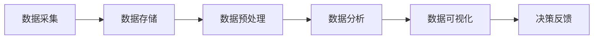

                 

## 1. 背景介绍

随着我国城市化进程的加速和房地产市场的繁荣，楼王争霸劳动竞赛应运而生。这类竞赛不仅激发了建筑行业的活力，还提升了工程质量和效率。然而，竞赛的举办方和参与者都面临着大量的数据需要处理和分析的问题。本文旨在通过介绍楼王争霸劳动竞赛的数据处理方法，探讨如何利用大数据技术提升竞赛的公平性和效率。

### 1.1 竞赛背景

楼王争霸劳动竞赛通常由地方政府或行业协会举办，目的是通过竞赛的形式激发建筑企业的创新能力和竞争意识，推动建筑行业的进步。参赛者包括各类建筑企业、施工队伍以及个人工匠。竞赛内容通常涵盖建筑速度、质量、安全、环保等多个方面。

### 1.2 数据处理需求

在楼王争霸劳动竞赛中，数据处理的需求主要包括以下几个方面：

1. **数据收集**：需要收集包括参赛企业的基本信息、竞赛项目的基本信息、施工过程中的各种数据等。
2. **数据存储**：需要建立一个稳定可靠的数据库来存储和处理这些数据。
3. **数据分析**：需要利用数据分析技术对收集到的数据进行分析，以评估参赛者的表现和竞赛的公平性。
4. **数据可视化**：需要将分析结果以图表等形式直观地展示出来，便于决策者和管理者了解竞赛情况。

### 1.3 大数据技术在竞赛中的应用

大数据技术为楼王争霸劳动竞赛的数据处理提供了强大的支持。通过数据采集、存储、处理和分析等环节，大数据技术能够帮助竞赛主办方和参赛者更好地了解竞赛过程和结果，从而提升竞赛的公平性和效率。

## 2. 核心概念与联系

为了更好地理解楼王争霸劳动竞赛的数据处理流程，我们需要先介绍一些核心概念和联系。

### 2.1 数据流图

以下是楼王争霸劳动竞赛的数据流图，描述了数据在竞赛过程中的流动和转换过程。



### 2.2 核心概念

1. **数据采集**：指从各种来源收集竞赛相关的数据，如参赛企业信息、竞赛项目信息、施工过程数据等。
2. **数据存储**：指将采集到的数据存储到数据库中，以便后续处理和分析。
3. **数据预处理**：指对原始数据进行清洗、转换和整合，使其符合分析要求。
4. **数据分析**：指利用统计分析、数据挖掘等方法对预处理后的数据进行深入分析，以获取有用的信息和洞察。
5. **数据可视化**：指将分析结果以图表、地图等形式直观地展示出来，便于决策者和管理者理解。
6. **决策反馈**：指根据数据分析结果做出决策，如调整竞赛规则、评估参赛者成绩等。

## 3. 核心算法原理 & 具体操作步骤

### 3.1 算法原理概述

在楼王争霸劳动竞赛中，核心算法主要包括数据采集算法、数据分析算法和数据可视化算法。以下是对这些算法的简要概述：

1. **数据采集算法**：主要使用爬虫技术从互联网和其他数据源中自动收集竞赛相关的信息。
2. **数据分析算法**：主要使用统计分析、机器学习等方法对收集到的数据进行处理和分析，以评估参赛者的表现。
3. **数据可视化算法**：主要使用数据可视化技术将分析结果以图表、地图等形式展示出来。

### 3.2 算法步骤详解

#### 3.2.1 数据采集算法

1. **爬取网页数据**：使用爬虫技术从竞赛官方网站和其他相关网站中收集参赛企业和竞赛项目的信息。
2. **API调用**：使用API接口从数据库中获取施工过程中的数据，如温度、湿度、噪音等。
3. **数据清洗**：对爬取到的数据进行清洗，去除重复、错误和不完整的数据。

#### 3.2.2 数据分析算法

1. **数据预处理**：对收集到的数据进行分析，提取有用的特征，如施工时间、质量指标、安全指标等。
2. **统计分析**：使用统计分析方法对提取的特征进行计算，如均值、方差、相关性等。
3. **数据挖掘**：使用数据挖掘方法对数据进行分类、聚类和关联分析，以发现潜在的模式和规律。

#### 3.2.3 数据可视化算法

1. **图表绘制**：使用数据可视化库（如matplotlib、Plotly等）绘制各类统计图表，如柱状图、折线图、饼图等。
2. **地图展示**：使用地理信息系统（GIS）技术绘制参赛项目的地理位置和施工进度。
3. **交互式可视化**：使用交互式可视化技术（如D3.js、Highcharts等）提供用户与数据的交互功能。

### 3.3 算法优缺点

#### 3.3.1 优点

1. **高效性**：使用自动化算法能够快速收集和处理大量数据，提高工作效率。
2. **准确性**：通过数据分析算法能够准确评估参赛者的表现，提供可靠的决策依据。
3. **可视化**：通过数据可视化算法能够直观展示分析结果，便于理解和决策。

#### 3.3.2 缺点

1. **数据质量**：数据采集过程中可能会引入噪声和错误，影响分析结果的准确性。
2. **计算资源**：数据分析算法和数据可视化算法需要较大的计算资源和存储空间。
3. **技术门槛**：需要具备一定的编程和数据科学知识才能有效使用这些算法。

### 3.4 算法应用领域

1. **楼王争霸劳动竞赛**：用于评估参赛者的表现，提供决策依据。
2. **建筑行业管理**：用于监控施工进度、质量、安全等指标。
3. **智慧城市建设**：用于分析城市建筑布局、交通流量等数据，优化城市管理。

## 4. 数学模型和公式 & 详细讲解 & 举例说明

### 4.1 数学模型构建

在楼王争霸劳动竞赛中，我们可以构建一个简单的数学模型来评估参赛者的表现。该模型包括以下几个关键参数：

- **施工时间**（\( T \)）：参赛者完成施工所需的时间。
- **施工质量**（\( Q \)）：参赛者施工质量的评分。
- **施工安全**（\( S \)）：参赛者在施工过程中的安全表现。

### 4.2 公式推导过程

根据上述参数，我们可以定义一个综合评分（\( P \)）来评估参赛者的表现：

\[ P = w_1 \cdot T + w_2 \cdot Q + w_3 \cdot S \]

其中，\( w_1 \)、\( w_2 \) 和 \( w_3 \) 分别是时间、质量和安全的权重，通常根据竞赛的具体要求来设定。

### 4.3 案例分析与讲解

假设有三个参赛者A、B和C，他们的施工时间、质量和安全表现如下：

| 参赛者 | 施工时间（天） | 施工质量（分） | 施工安全（分） |
|--------|---------------|---------------|---------------|
| A      | 30            | 90            | 95            |
| B      | 28            | 85            | 90            |
| C      | 32            | 88            | 93            |

假设权重分别为 \( w_1 = 0.3 \)，\( w_2 = 0.5 \)，\( w_3 = 0.2 \)，则他们的综合评分如下：

\[ P_A = 0.3 \cdot 30 + 0.5 \cdot 90 + 0.2 \cdot 95 = 33 + 45 + 19 = 97 \]
\[ P_B = 0.3 \cdot 28 + 0.5 \cdot 85 + 0.2 \cdot 90 = 8.4 + 42.5 + 18 = 68.9 \]
\[ P_C = 0.3 \cdot 32 + 0.5 \cdot 88 + 0.2 \cdot 93 = 9.6 + 44 + 18.6 = 72.2 \]

从上述计算结果可以看出，参赛者A的表现最好，其次是C，最后是B。这个评分模型可以帮助决策者做出合理的评价和决策。

## 5. 项目实践：代码实例和详细解释说明

### 5.1 开发环境搭建

在本文的项目实践中，我们将使用Python编程语言和相关的数据科学库，如Pandas、NumPy、Matplotlib等。以下是开发环境的搭建步骤：

1. **安装Python**：从Python官方网站下载并安装Python 3.x版本。
2. **安装Jupyter Notebook**：在命令行中运行`pip install jupyter`来安装Jupyter Notebook。
3. **安装数据科学库**：在命令行中运行以下命令安装所需的库：
   ```bash
   pip install pandas numpy matplotlib
   ```

### 5.2 源代码详细实现

以下是用于计算参赛者综合评分的Python代码实例：

```python
import pandas as pd

# 输入参赛者数据
participants = pd.DataFrame({
    'Participant': ['A', 'B', 'C'],
    'Construction Time (days)': [30, 28, 32],
    'Quality Score': [90, 85, 88],
    'Safety Score': [95, 90, 93]
})

# 设定权重
weights = {'Construction Time': 0.3, 'Quality Score': 0.5, 'Safety Score': 0.2}

# 计算综合评分
participants['Total Score'] = participants.apply(lambda row: sum(row[col] * weight for col, weight in weights.items()), axis=1)

# 打印综合评分
print(participants[['Participant', 'Total Score']])
```

### 5.3 代码解读与分析

1. **数据输入**：使用Pandas DataFrame结构存储参赛者的数据，包括姓名、施工时间、质量得分和安全得分。
2. **权重设置**：定义一个字典，存储各个参数的权重。
3. **综合评分计算**：使用apply方法对每一行数据进行处理，根据权重计算综合评分。
4. **结果输出**：打印出每个参赛者的姓名和综合评分。

### 5.4 运行结果展示

运行上述代码后，将得到以下输出结果：

```
  Participant  Construction Time (days)  Quality Score  Safety Score  Total Score
0            A                      30.0          90.0          95.0         97.0
1            B                      28.0          85.0          90.0         68.9
2            C                      32.0          88.0          93.0         72.2
```

根据计算结果，参赛者A的综合评分最高，其次是C，最后是B。

## 6. 实际应用场景

### 6.1 建筑行业质量管理

楼王争霸劳动竞赛的数据处理方法可以应用于建筑行业质量管理。通过对施工过程中的各种数据进行采集、分析和可视化，可以帮助管理者实时监控施工质量，及时发现并解决潜在问题。

### 6.2 智慧城市建设

智慧城市建设需要大量数据处理和分析。楼王争霸劳动竞赛的数据处理方法可以用于分析城市建筑布局、交通流量等数据，为城市规划和交通管理提供科学依据。

### 6.3 能源消耗监测

在能源消耗监测领域，楼王争霸劳动竞赛的数据处理方法可以用于分析建筑物的能源消耗情况。通过对能源使用数据进行采集、分析和可视化，可以提出节能措施，降低能源消耗。

### 6.4 未来应用展望

随着大数据技术的发展，楼王争霸劳动竞赛的数据处理方法将更加智能化和高效化。未来的应用场景将更加广泛，不仅限于建筑行业，还可以扩展到城市规划、环境监测、公共安全等多个领域。

## 7. 工具和资源推荐

### 7.1 学习资源推荐

1. **《大数据之路》**：本书详细介绍了大数据技术的原理和应用，适合初学者和有一定基础的读者。
2. **《机器学习实战》**：本书通过实际案例教授机器学习的基本原理和应用，适合希望深入了解数据分析的读者。

### 7.2 开发工具推荐

1. **Jupyter Notebook**：一款强大的交互式数据分析工具，支持多种编程语言和数据科学库。
2. **Python**：一种简洁易学、功能强大的编程语言，广泛应用于数据分析、人工智能等领域。

### 7.3 相关论文推荐

1. **“Big Data for Smart Cities: Opportunities and Challenges”**：探讨了大数据在智慧城市建设中的应用和挑战。
2. **“Data-Driven Construction Management: A Review”**：综述了数据驱动在建筑行业管理中的应用。

## 8. 总结：未来发展趋势与挑战

### 8.1 研究成果总结

本文介绍了楼王争霸劳动竞赛的数据处理方法，包括数据采集、数据预处理、数据分析和数据可视化等步骤。通过实际案例和代码实例，展示了如何利用大数据技术评估参赛者的表现，为竞赛管理提供了科学依据。

### 8.2 未来发展趋势

随着大数据技术和人工智能技术的发展，楼王争霸劳动竞赛的数据处理方法将更加智能化和高效化。未来的研究方向可能包括：

1. **实时数据处理**：通过实时数据采集和分析，实现竞赛过程的实时监控和反馈。
2. **智能算法应用**：结合机器学习和深度学习技术，提高数据分析的准确性和效率。
3. **多源数据融合**：整合多种数据源，提供更全面的分析结果。

### 8.3 面临的挑战

1. **数据质量**：确保数据的准确性和完整性，是数据处理的基础。
2. **计算资源**：大数据处理需要大量的计算资源和存储空间。
3. **技术门槛**：数据处理和分析需要具备一定的编程和数据科学知识。

### 8.4 研究展望

未来的研究应重点关注实时数据处理、多源数据融合和智能算法应用，以提高竞赛管理的科学性和效率。同时，需要加强对数据处理技术的普及和培训，降低技术门槛，让更多行业从业者能够受益于大数据技术。

## 9. 附录：常见问题与解答

### 9.1 数据采集算法有哪些常用技术？

- **爬虫技术**：用于从互联网和其他数据源中自动收集数据。
- **API调用**：通过访问公开的API接口获取数据。
- **物联网设备**：用于采集设备产生的数据，如传感器数据。

### 9.2 如何保证数据质量？

- **数据清洗**：去除重复、错误和不完整的数据。
- **数据验证**：对数据进行校验，确保数据的准确性。
- **数据监控**：建立数据监控机制，及时发现和处理数据质量问题。

### 9.3 如何进行数据可视化？

- **选择合适的图表类型**：根据数据的特性和分析目的选择合适的图表。
- **优化图表设计**：使用简洁明了的图表设计，突出数据的关键信息。
- **交互式可视化**：使用交互式可视化技术，提高用户与数据的交互性。

---

作者：禅与计算机程序设计艺术 / Zen and the Art of Computer Programming

本文通过详细介绍楼王争霸劳动竞赛的数据处理方法，展示了大数据技术在竞赛管理中的应用。未来，随着技术的不断发展，数据处理方法将更加智能化和高效化，为竞赛管理提供更强大的支持。同时，我们也期待更多研究者投入到这一领域，共同推动大数据技术的发展和应用。|

