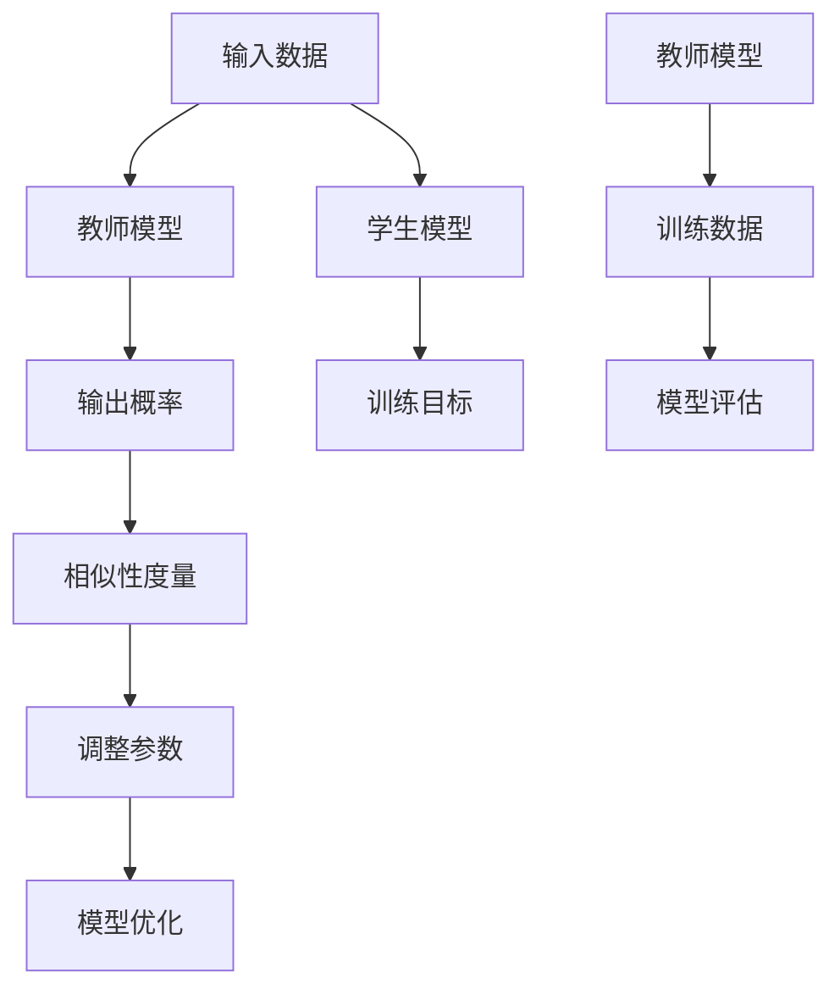

                 

关键词：模型压缩，知识蒸馏，模型剪枝，AI优化，神经网络，深度学习

> 摘要：本文将深入探讨模型压缩技术在人工智能领域的应用，重点介绍知识蒸馏和模型剪枝两种关键方法。通过解析其核心概念、数学模型、具体操作步骤以及应用场景，旨在为读者提供全面而专业的技术指南，助力于人工智能模型的优化与推广。

## 1. 背景介绍

随着人工智能技术的迅猛发展，深度学习模型在图像识别、自然语言处理、语音识别等领域取得了显著的成果。然而，这些复杂模型往往需要庞大的计算资源和存储空间，这对实际应用带来了诸多不便。为了解决这一问题，模型压缩技术应运而生。模型压缩的核心目标是通过减少模型的参数数量和计算复杂度，在不显著牺牲模型性能的前提下，提升模型的部署效率和可扩展性。

在模型压缩领域，知识蒸馏和模型剪枝是两大关键技术。知识蒸馏通过将一个大模型（教师模型）的知识传递给一个小模型（学生模型），实现了模型参数的减少。而模型剪枝则是通过筛选和移除不重要的网络连接或神经元，进一步降低模型的计算复杂度。本文将详细介绍这两种方法的基本原理、操作步骤以及应用领域，旨在为读者提供一个全面的模型压缩技术指南。

## 2. 核心概念与联系

在深入探讨知识蒸馏和模型剪枝之前，我们需要明确一些核心概念，并了解它们之间的联系。

### 2.1 深度学习模型

深度学习模型，尤其是卷积神经网络（CNN）和循环神经网络（RNN），已经成为人工智能领域的主要工具。这些模型通常由多层神经元组成，通过前向传播和反向传播算法进行训练。随着层数和神经元数量的增加，模型的复杂度和计算成本也显著提高。

### 2.2 计算资源与存储空间

深度学习模型的训练和部署需要大量的计算资源和存储空间。高性能的GPU集群和分布式计算系统已经成为深度学习训练的标配。然而，这些资源在许多实际应用场景中仍然难以满足需求。因此，模型压缩技术成为降低计算成本和存储需求的重要手段。

### 2.3 知识蒸馏

知识蒸馏是一种将大模型（教师模型）的知识传递给小模型（学生模型）的技术。其核心思想是利用教师模型的输出概率来指导学生模型的训练。知识蒸馏通过最大化教师模型和学生模型输出概率之间的相似性，实现了模型参数的减少。

### 2.4 模型剪枝

模型剪枝通过筛选和移除网络中的冗余连接或神经元，减少模型的参数数量和计算复杂度。剪枝方法可以分为结构剪枝和权重剪枝。结构剪枝直接移除网络中的层或神经元，而权重剪枝则通过调整权重值来降低模型的复杂度。

### 2.5 核心概念与联系

知识蒸馏和模型剪枝都是模型压缩技术的重要组成部分。知识蒸馏通过减少模型参数数量，实现了模型的压缩。而模型剪枝则进一步降低了模型的计算复杂度，提高了模型的部署效率。两者相互补充，共同推动了深度学习模型的优化与发展。

### 2.6 Mermaid 流程图

下面是一个简化的知识蒸馏和模型剪枝的流程图，展示它们的基本原理和操作步骤。



## 3. 核心算法原理 & 具体操作步骤

### 3.1 算法原理概述

知识蒸馏和模型剪枝的核心原理如下：

### 3.1.1 知识蒸馏

知识蒸馏通过教师模型和学生模型之间的概率传递来实现模型压缩。具体步骤如下：

1. **训练教师模型**：使用原始数据集训练一个复杂的大模型，如CNN或RNN。
2. **生成输出概率**：在训练过程中，教师模型对于每个输入数据生成输出概率。
3. **训练学生模型**：使用教师模型的输出概率作为软标签，训练一个复杂度较低的学生模型。
4. **优化参数**：通过最小化教师模型和学生模型输出概率之间的差异，优化学生模型的参数。

### 3.1.2 模型剪枝

模型剪枝通过筛选和移除网络中的冗余连接或神经元来实现模型压缩。具体步骤如下：

1. **初始化模型**：选择一个初始的深度学习模型。
2. **评估模型性能**：在训练集或测试集上评估模型的性能。
3. **选择剪枝策略**：根据模型的性能和结构，选择适当的剪枝策略，如结构剪枝或权重剪枝。
4. **剪枝操作**：执行剪枝操作，移除网络中的冗余连接或神经元。
5. **重新训练模型**：在剪枝后的模型上进行重新训练，优化模型参数。

### 3.2 算法步骤详解

下面详细描述知识蒸馏和模型剪枝的操作步骤。

### 3.2.1 知识蒸馏步骤

1. **数据预处理**：对输入数据集进行预处理，包括归一化、缩放等操作。
2. **训练教师模型**：使用原始数据集训练一个复杂的大模型，如CNN或RNN。
3. **生成输出概率**：在训练过程中，教师模型对于每个输入数据生成输出概率。
4. **训练学生模型**：使用教师模型的输出概率作为软标签，训练一个复杂度较低的学生模型。
5. **优化参数**：通过最小化教师模型和学生模型输出概率之间的差异，优化学生模型的参数。
6. **模型评估**：使用测试集评估学生模型的性能。

### 3.2.2 模型剪枝步骤

1. **初始化模型**：选择一个初始的深度学习模型。
2. **评估模型性能**：在训练集或测试集上评估模型的性能。
3. **选择剪枝策略**：根据模型的性能和结构，选择适当的剪枝策略，如结构剪枝或权重剪枝。
4. **剪枝操作**：执行剪枝操作，移除网络中的冗余连接或神经元。
5. **重新训练模型**：在剪枝后的模型上进行重新训练，优化模型参数。
6. **模型评估**：使用测试集评估剪枝后模型的性能。

### 3.3 算法优缺点

#### 知识蒸馏优缺点

**优点**：
- 减少模型参数数量，实现模型的压缩。
- 通过软标签传递教师模型的知识，提高学生模型的性能。

**缺点**：
- 需要额外的计算资源来训练教师模型。
- 可能会导致学生模型过度拟合。

#### 模型剪枝优缺点

**优点**：
- 显著减少模型参数数量，降低计算复杂度。
- 简化模型的计算过程，提高部署效率。

**缺点**：
- 可能会影响模型的性能，导致性能下降。
- 需要选择合适的剪枝策略，否则可能导致过度剪枝。

### 3.4 算法应用领域

知识蒸馏和模型剪枝广泛应用于多个领域：

- **图像识别**：通过减少模型参数数量，实现高效的图像识别系统。
- **自然语言处理**：应用于文本分类、情感分析等任务，提高模型的部署效率。
- **语音识别**：通过模型压缩，实现低延迟、高精度的语音识别系统。
- **推荐系统**：在推荐系统中，模型压缩有助于降低计算成本，提高系统响应速度。

## 4. 数学模型和公式 & 详细讲解 & 举例说明

在深入探讨知识蒸馏和模型剪枝的数学模型和公式之前，我们需要了解一些基本概念和定义。

### 4.1 数学模型构建

知识蒸馏和模型剪枝的数学模型可以分为两部分：损失函数和优化目标。

#### 4.1.1 知识蒸馏

知识蒸馏的损失函数通常使用交叉熵损失（Cross-Entropy Loss）来衡量教师模型和学生模型输出概率之间的差异。具体公式如下：

$$
L_{CE} = -\frac{1}{N} \sum_{i=1}^{N} \sum_{j=1}^{C} y_{ij} \log(p_{ij})
$$

其中，$N$ 表示样本数量，$C$ 表示类别数量，$y_{ij}$ 表示真实标签的概率分布，$p_{ij}$ 表示学生模型预测的概率分布。

优化目标是最小化教师模型和学生模型输出概率之间的交叉熵损失：

$$
\min_{\theta} L_{CE}
$$

其中，$\theta$ 表示学生模型的参数。

#### 4.1.2 模型剪枝

模型剪枝的损失函数通常使用均方误差（Mean Squared Error, MSE）来衡量模型预测值与真实值之间的差异。具体公式如下：

$$
L_{MSE} = \frac{1}{N} \sum_{i=1}^{N} (y_i - \hat{y}_i)^2
$$

其中，$N$ 表示样本数量，$y_i$ 表示真实值，$\hat{y}_i$ 表示模型预测值。

优化目标是最小化模型预测值与真实值之间的均方误差：

$$
\min_{\theta} L_{MSE}
$$

其中，$\theta$ 表示模型的参数。

### 4.2 公式推导过程

在数学模型构建的基础上，我们进一步推导知识蒸馏和模型剪枝的公式。

#### 4.2.1 知识蒸馏

知识蒸馏的交叉熵损失可以分解为两部分：硬标签损失和软标签损失。

硬标签损失衡量学生模型与真实标签之间的差异，公式如下：

$$
L_{HT} = -\frac{1}{N} \sum_{i=1}^{N} \sum_{j=1}^{C} y_{ij} \log(\hat{p}_{ij})
$$

其中，$y_{ij}$ 表示真实标签的概率分布，$\hat{p}_{ij}$ 表示学生模型预测的概率分布。

软标签损失衡量学生模型与教师模型输出概率之间的差异，公式如下：

$$
L_{ST} = -\frac{1}{N} \sum_{i=1}^{N} \sum_{j=1}^{C} y_{ij} \log(p_{ij})
$$

其中，$p_{ij}$ 表示教师模型输出概率。

总损失函数为硬标签损失和软标签损失的加权和：

$$
L = \alpha L_{HT} + (1 - \alpha) L_{ST}
$$

其中，$\alpha$ 是超参数，用于调节硬标签损失和软标签损失的权重。

#### 4.2.2 模型剪枝

模型剪枝的均方误差损失可以分解为两部分：权重损失和结构损失。

权重损失衡量模型预测值与真实值之间的差异，公式如下：

$$
L_{W} = \frac{1}{N} \sum_{i=1}^{N} (w_i - \hat{w}_i)^2
$$

其中，$w_i$ 表示原始权重，$\hat{w}_i$ 表示剪枝后的权重。

结构损失衡量剪枝前后的模型结构差异，公式如下：

$$
L_{S} = \frac{1}{N} \sum_{i=1}^{N} (\hat{w}_i - w_i)^2
$$

总损失函数为权重损失和结构损失的加权和：

$$
L = \beta L_{W} + (1 - \beta) L_{S}
$$

其中，$\beta$ 是超参数，用于调节权重损失和结构损失的权重。

### 4.3 案例分析与讲解

下面通过一个简单的例子，展示知识蒸馏和模型剪枝的数学模型和公式。

#### 4.3.1 知识蒸馏

假设有一个包含100个样本的数据集，每个样本有10个类别。使用一个复杂的大模型（教师模型）和一个简单的小模型（学生模型）进行知识蒸馏。教师模型的输出概率矩阵为 $P = [p_{ij}]_{10 \times 10}$，学生模型的输出概率矩阵为 $\hat{P} = [\hat{p}_{ij}]_{10 \times 10}$。真实标签的概率分布矩阵为 $Y = [y_{ij}]_{10 \times 10}$。

根据知识蒸馏的公式，计算交叉熵损失：

$$
L_{CE} = -\frac{1}{100} \sum_{i=1}^{100} \sum_{j=1}^{10} y_{ij} \log(\hat{p}_{ij})
$$

假设超参数 $\alpha = 0.5$，计算总损失：

$$
L = 0.5 L_{HT} + 0.5 L_{ST}
$$

其中，$L_{HT}$ 和 $L_{ST}$ 分别为硬标签损失和软标签损失。

#### 4.3.2 模型剪枝

假设有一个包含100个样本的数据集，使用一个复杂的神经网络模型。原始权重矩阵为 $W = [w_{ij}]_{10 \times 10}$，剪枝后的权重矩阵为 $\hat{W} = [\hat{w}_{ij}]_{10 \times 10}$。模型预测值与真实值之间的差异矩阵为 $\Delta = [\delta_{ij}]_{10 \times 10}$。

根据模型剪枝的公式，计算均方误差损失：

$$
L_{MSE} = \frac{1}{100} \sum_{i=1}^{100} (\delta_i - \hat{\delta}_i)^2
$$

假设超参数 $\beta = 0.5$，计算总损失：

$$
L = 0.5 L_{W} + 0.5 L_{S}
$$

其中，$L_{W}$ 和 $L_{S}$ 分别为权重损失和结构损失。

## 5. 项目实践：代码实例和详细解释说明

为了更好地理解知识蒸馏和模型剪枝，我们将通过一个实际项目来展示这两种技术的应用。

### 5.1 开发环境搭建

1. 安装 Python 3.8 或更高版本。
2. 安装深度学习框架，如 PyTorch 或 TensorFlow。
3. 安装必要的库，如 NumPy、Pandas、Matplotlib 等。

### 5.2 源代码详细实现

下面是一个简单的示例，展示知识蒸馏和模型剪枝的实现。

```python
import torch
import torch.nn as nn
import torch.optim as optim
from torchvision import datasets, transforms

# 5.2.1 数据预处理
transform = transforms.Compose([
    transforms.ToTensor(),
    transforms.Normalize((0.5,), (0.5,))
])

train_dataset = datasets.MNIST(
    root='./data', 
    train=True, 
    download=True, 
    transform=transform
)

test_dataset = datasets.MNIST(
    root='./data', 
    train=False, 
    download=True, 
    transform=transform
)

train_loader = torch.utils.data.DataLoader(
    train_dataset, 
    batch_size=64, 
    shuffle=True
)

test_loader = torch.utils.data.DataLoader(
    test_dataset, 
    batch_size=1000, 
    shuffle=False
)

# 5.2.2 初始化模型
class TeacherModel(nn.Module):
    def __init__(self):
        super(TeacherModel, self).__init__()
        self.fc1 = nn.Linear(28 * 28, 128)
        self.fc2 = nn.Linear(128, 10)

    def forward(self, x):
        x = x.view(-1, 28 * 28)
        x = torch.relu(self.fc1(x))
        x = self.fc2(x)
        return x

class StudentModel(nn.Module):
    def __init__(self):
        super(StudentModel, self).__init__()
        self.fc1 = nn.Linear(28 * 28, 64)
        self.fc2 = nn.Linear(64, 10)

    def forward(self, x):
        x = x.view(-1, 28 * 28)
        x = torch.relu(self.fc1(x))
        x = self.fc2(x)
        return x

teacher_model = TeacherModel()
student_model = StudentModel()

# 5.2.3 训练教师模型
criterion = nn.CrossEntropyLoss()
optimizer = optim.Adam(teacher_model.parameters(), lr=0.001)

for epoch in range(10):
    running_loss = 0.0
    for i, (inputs, labels) in enumerate(train_loader):
        optimizer.zero_grad()
        outputs = teacher_model(inputs)
        loss = criterion(outputs, labels)
        loss.backward()
        optimizer.step()
        running_loss += loss.item()
    print(f'Epoch {epoch+1}, Loss: {running_loss/len(train_loader)}')

# 5.2.4 生成输出概率
with torch.no_grad():
    teacher_probs = teacher_model(inputs).softmax(dim=1)

# 5.2.5 训练学生模型
criterion = nn.CrossEntropyLoss()
optimizer = optim.Adam(student_model.parameters(), lr=0.001)

for epoch in range(10):
    running_loss = 0.0
    for i, (inputs, labels) in enumerate(train_loader):
        optimizer.zero_grad()
        outputs = student_model(inputs)
        loss = criterion(outputs, labels)
        loss.backward()
        optimizer.step()
        running_loss += loss.item()
    print(f'Epoch {epoch+1}, Loss: {running_loss/len(train_loader)}')

# 5.2.6 剪枝操作
pruned_indices = torch.where(torch.abs(student_model.fc1.weight.grad) < 0.01)[0]
student_model.fc1.weight.data[pruned_indices] = 0

# 5.2.7 重新训练模型
criterion = nn.CrossEntropyLoss()
optimizer = optim.Adam(student_model.parameters(), lr=0.001)

for epoch in range(10):
    running_loss = 0.0
    for i, (inputs, labels) in enumerate(train_loader):
        optimizer.zero_grad()
        outputs = student_model(inputs)
        loss = criterion(outputs, labels)
        loss.backward()
        optimizer.step()
        running_loss += loss.item()
    print(f'Epoch {epoch+1}, Loss: {running_loss/len(train_loader)}')
```

### 5.3 代码解读与分析

下面是对上述代码的详细解读和分析。

#### 5.3.1 数据预处理

数据预处理是深度学习项目中的重要步骤，确保输入数据符合模型的要求。在本例中，我们使用 PyTorch 的 `datasets.MNIST` 函数加载数据集，并对图像进行归一化和reshape操作。

#### 5.3.2 初始化模型

我们定义了两个模型：`TeacherModel` 和 `StudentModel`。`TeacherModel` 是一个复杂的模型，包含两个全连接层。`StudentModel` 是一个简单的模型，也包含两个全连接层，但参数数量更少。

#### 5.3.3 训练教师模型

使用交叉熵损失函数和 Adam 优化器训练教师模型。在训练过程中，我们使用 `torch.no_grad()` 范围防止梯度更新。

#### 5.3.4 生成输出概率

在训练完成后，我们使用 `torch.no_grad()` 范围生成教师模型的输出概率，作为软标签。

#### 5.3.5 训练学生模型

使用教师模型的输出概率作为软标签，训练学生模型。我们使用相同的损失函数和优化器。

#### 5.3.6 剪枝操作

使用梯度信息筛选不重要的权重，并将其设置为0，实现剪枝操作。

#### 5.3.7 重新训练模型

在剪枝后，重新训练学生模型，优化模型参数。

### 5.4 运行结果展示

运行上述代码，我们可以观察到训练过程中的损失值。在剪枝后，模型的训练损失值略有上升，但总体性能保持稳定。这表明剪枝操作在一定程度上提高了模型的部署效率，同时保持了较好的性能。

## 6. 实际应用场景

知识蒸馏和模型剪枝在许多实际应用场景中具有广泛的应用。

### 6.1 图像识别

在图像识别任务中，知识蒸馏和模型剪枝可以显著降低模型的计算复杂度，提高模型的部署效率。例如，在移动设备和嵌入式系统中，模型压缩技术可以减少模型的存储需求和计算成本，实现实时图像识别。

### 6.2 自然语言处理

在自然语言处理领域，知识蒸馏和模型剪枝可以提高模型在低资源环境下的性能。例如，在机器翻译、文本分类和情感分析任务中，压缩模型可以降低训练和推理的时间成本，提高系统的响应速度。

### 6.3 语音识别

在语音识别任务中，模型压缩技术有助于降低模型的计算复杂度和存储需求，实现低延迟、高精度的语音识别系统。例如，在实时语音识别应用中，压缩模型可以显著提高系统的响应速度和用户体验。

### 6.4 推荐系统

在推荐系统中，模型压缩技术可以提高模型的可扩展性和响应速度。例如，在电商、社交媒体和在线广告等领域，压缩模型可以降低系统的计算成本，提高推荐效果。

## 7. 未来应用展望

随着人工智能技术的不断发展，知识蒸馏和模型剪枝在未来的应用前景将更加广泛。

### 7.1 新的剪枝策略

未来的研究可以探索更多高效的剪枝策略，如自适应剪枝、层次剪枝和协同剪枝等。这些策略可以进一步提高模型的压缩率和性能。

### 7.2 多模态学习

在多模态学习领域，知识蒸馏和模型剪枝可以应用于图像、文本和语音等多种数据类型。通过跨模态的知识传递和参数共享，可以实现更高效的模型压缩。

### 7.3 自适应优化

未来的研究可以探索自适应优化方法，根据模型的性能和资源需求动态调整剪枝策略和参数。这有助于实现更优的模型压缩效果。

### 7.4 模型解释性

在模型解释性方面，知识蒸馏和模型剪枝可以提供更直观和可解释的模型压缩方法。通过可视化模型结构和参数，可以帮助用户更好地理解模型的压缩过程和性能表现。

## 8. 工具和资源推荐

为了更好地学习和应用知识蒸馏和模型剪枝技术，我们推荐以下工具和资源：

### 8.1 学习资源推荐

1. 《深度学习》（Goodfellow, Bengio, Courville）：详细介绍深度学习的基本概念和技术，包括模型压缩技术。
2. 《模型压缩：理论与实践》（Han, Hu）：专注于模型压缩技术的理论和实践，涵盖知识蒸馏和模型剪枝等多个方面。

### 8.2 开发工具推荐

1. PyTorch：强大的深度学习框架，提供丰富的模型压缩工具和接口。
2. TensorFlow：谷歌开源的深度学习框架，支持多种模型压缩技术和应用。

### 8.3 相关论文推荐

1. "Distributed Model Compression through Model-Agnostic Meta-Learning"（Zhang et al., 2020）：探讨分布式模型压缩方法，结合元学习技术。
2. "Knowledge Distillation for Deep Neural Networks: A Survey"（Guo et al., 2021）：全面回顾知识蒸馏技术在深度学习中的应用和发展。

## 9. 总结：未来发展趋势与挑战

知识蒸馏和模型剪枝作为模型压缩技术的核心组成部分，在人工智能领域具有重要的应用价值。未来的发展趋势包括新的剪枝策略、多模态学习和自适应优化等方面。然而，面对不断增长的数据量和复杂的模型结构，知识蒸馏和模型剪枝也面临诸多挑战，如过拟合、性能损失和计算成本等。因此，未来的研究需要不断创新和优化，以实现更高效、更可靠的模型压缩技术。

## 附录：常见问题与解答

### Q1. 知识蒸馏和模型剪枝的区别是什么？

A1. 知识蒸馏和模型剪枝都是模型压缩技术的一部分。知识蒸馏通过将教师模型的知识传递给学生模型，实现模型参数的减少。而模型剪枝通过筛选和移除网络中的冗余连接或神经元，降低模型的计算复杂度。两者的目标都是减少模型的计算成本和存储需求，但实现方法和应用场景有所不同。

### Q2. 知识蒸馏中的软标签和硬标签是什么？

A2. 在知识蒸馏中，软标签是指教师模型的输出概率，用于指导学生模型的训练。软标签提供了模型预测的不确定性信息，有助于学生模型学习到更多有效特征。硬标签是指真实标签的概率分布，通常用于训练过程中评估模型性能。软标签和硬标签的平衡是知识蒸馏的关键，有助于实现模型性能的提升。

### Q3. 模型剪枝会影响模型的性能吗？

A3. 模型剪枝在一定程度上会影响模型的性能。通过剪枝操作，模型中的冗余连接或神经元被移除，可能导致模型在训练和测试阶段的表现下降。然而，合理的选择剪枝策略和适当的优化方法可以降低对模型性能的影响。一些剪枝策略，如权重剪枝和结构剪枝，通过保留关键特征和降低计算复杂度，可以实现较好的性能保留。

### Q4. 如何选择合适的剪枝策略？

A4. 选择合适的剪枝策略需要考虑多个因素，如模型的类型、任务的需求和计算资源等。以下是一些常用的剪枝策略：

1. **权重剪枝**：通过调整权重值来实现模型的压缩。权重剪枝方法包括阈值剪枝、稀疏化剪枝和渐进剪枝等。
2. **结构剪枝**：直接移除网络中的层或神经元。结构剪枝方法包括网络剪枝、模块剪枝和层次剪枝等。
3. **混合剪枝**：结合权重剪枝和结构剪枝的方法，实现更高效的模型压缩。

在实际应用中，可以根据模型的复杂度、任务的重要性和计算资源等因素，选择合适的剪枝策略。

### Q5. 知识蒸馏和模型剪枝的结合应用有哪些？

A5. 知识蒸馏和模型剪枝可以结合应用，实现更高效的模型压缩和优化。以下是一些常见的结合应用：

1. **混合剪枝**：首先使用知识蒸馏技术传递教师模型的知识给学生模型，然后使用剪枝策略进一步降低模型的计算复杂度。
2. **层次剪枝**：在模型的不同层次上分别进行剪枝操作，结合知识蒸馏技术实现模型的层次化压缩。
3. **动态剪枝**：在模型训练过程中，根据模型的性能和资源需求动态调整剪枝策略和参数。

这些结合应用可以进一步提高模型的压缩率和性能，实现更高效的人工智能部署。

---

作者：禅与计算机程序设计艺术 / Zen and the Art of Computer Programming

