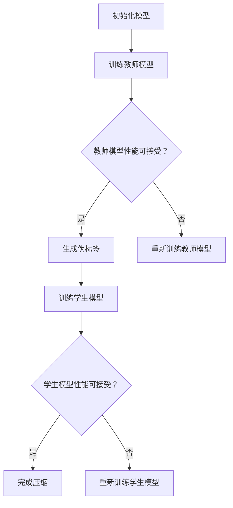

                 

关键词：模型压缩，知识蒸馏，剪枝，神经网络，性能优化，模型效率

摘要：本文将深入探讨模型压缩中的两大技术——知识蒸馏（DSerialization）和剪枝（Pruning），解析它们的基本原理、优缺点以及应用领域，并通过实际项目实例展示如何在实际中运用这些技术。同时，文章还将对未来的发展趋势与面临的挑战进行展望。

## 1. 背景介绍

在深度学习的快速发展过程中，神经网络模型变得越来越庞大，参数数量呈指数级增长。然而，庞大的模型不仅对计算资源提出了极高的要求，也限制了其在实际应用中的普及。为了克服这一挑战，模型压缩技术应运而生。模型压缩旨在减小模型的大小、降低计算复杂度，同时尽可能保持模型的性能。

模型压缩主要分为两大类技术：知识蒸馏和剪枝。知识蒸馏通过将一个大模型的知识传递给一个小模型，从而实现性能的保留。而剪枝则通过删除模型中的部分参数或神经元，来减少模型的计算量和存储需求。

## 2. 核心概念与联系

### 2.1 知识蒸馏

知识蒸馏是一种训练小模型的方法，它利用一个大模型（教师模型）的性能来指导小模型（学生模型）的训练。具体而言，教师模型在训练过程中生成伪标签，然后学生模型根据这些伪标签进行学习。

### 2.2 剪枝

剪枝是一种通过删除模型中不重要的参数或神经元来减少模型大小的技术。剪枝通常分为结构剪枝和权重剪枝。结构剪枝直接删除神经元或层，而权重剪枝则通过调整权重值来减少模型的大小。

### 2.3 Mermaid 流程图

下面是一个简单的Mermaid流程图，展示了知识蒸馏和剪枝的基本流程。



## 3. 核心算法原理 & 具体操作步骤

### 3.1 算法原理概述

#### 知识蒸馏

知识蒸馏的核心思想是将教师模型的知识传递给学生模型。具体步骤如下：

1. 训练教师模型，达到一定性能。
2. 使用教师模型对训练数据生成伪标签。
3. 学生模型根据伪标签进行训练，同时保持对原始标签的学习。

#### 剪枝

剪枝的核心思想是删除模型中不重要的参数或神经元。具体步骤如下：

1. 计算参数或神经元的贡献度。
2. 根据贡献度选择删除一部分参数或神经元。
3. 重新训练模型，确保性能不受影响。

### 3.2 算法步骤详解

#### 知识蒸馏

1. **训练教师模型**：使用原始训练数据训练教师模型，直到性能达到预期。
2. **生成伪标签**：使用训练好的教师模型对训练数据进行预测，生成伪标签。
3. **训练学生模型**：使用伪标签和原始标签训练学生模型，通过对比损失函数的梯度来更新模型参数。

#### 剪枝

1. **计算贡献度**：可以使用多种方法计算参数或神经元的贡献度，如L1范数、L2范数等。
2. **选择删除对象**：根据贡献度选择删除一部分参数或神经元。
3. **重新训练模型**：删除参数或神经元后，重新训练模型，确保性能不受影响。

### 3.3 算法优缺点

#### 知识蒸馏

- **优点**：能够保留教师模型的性能，同时减小模型大小。
- **缺点**：对训练数据的要求较高，且伪标签的生成过程可能引入误差。

#### 剪枝

- **优点**：能够显著减小模型大小，降低计算复杂度。
- **缺点**：可能对模型的性能产生负面影响，需要重新训练模型。

### 3.4 算法应用领域

知识蒸馏和剪枝广泛应用于各种深度学习场景，如图像识别、语音识别、自然语言处理等。其中，知识蒸馏在模型压缩中的应用尤为广泛。

## 4. 数学模型和公式 & 详细讲解 & 举例说明

### 4.1 数学模型构建

知识蒸馏和剪枝的数学模型涉及多个方面，包括损失函数、优化算法等。下面分别进行介绍。

#### 知识蒸馏

1. **损失函数**：通常使用交叉熵损失函数来评估模型的性能。

   $$ L_{CE} = -\sum_{i=1}^{N} y_i \log(p_i) $$

   其中，$y_i$为真实标签，$p_i$为预测概率。

2. **优化算法**：通常使用梯度下降法来更新模型参数。

   $$ \theta_{t+1} = \theta_{t} - \alpha \nabla_{\theta} L(\theta) $$

   其中，$\theta$为模型参数，$\alpha$为学习率。

#### 剪枝

1. **损失函数**：同样使用交叉熵损失函数来评估模型的性能。

   $$ L_{CE} = -\sum_{i=1}^{N} y_i \log(p_i) $$

2. **优化算法**：使用基于梯度的剪枝算法，如L1范数剪枝。

   $$ \theta_{t+1} = \theta_{t} - \alpha \nabla_{\theta} L(\theta) + \lambda \|\theta\|_1 $$

   其中，$\lambda$为剪枝力度。

### 4.2 公式推导过程

#### 知识蒸馏

1. **伪标签生成**：假设教师模型的输出为$y_{teacher}$，学生模型的输出为$y_{student}$，则有：

   $$ p_i = \frac{e^{y_{teacher_i}}}{\sum_{j=1}^{C} e^{y_{teacher_j}}} $$

   其中，$C$为类别数。

2. **损失函数**：将伪标签和原始标签结合起来，得到混合损失函数：

   $$ L = \frac{1}{N} \sum_{i=1}^{N} (w_1 L_{CE}(y_i, y_{student_i}) + w_2 L_{CE}(y_i, p_i)) $$

   其中，$w_1$和$w_2$为权重。

#### 剪枝

1. **参数贡献度**：使用L1范数来衡量参数的贡献度：

   $$ \lambda = \frac{1}{N} \sum_{i=1}^{N} \sum_{j=1}^{C} |w_{ij}| $$

   其中，$w_{ij}$为第$i$个神经元第$j$个参数的值。

2. **剪枝力度**：通过调整$\lambda$来控制剪枝力度。

### 4.3 案例分析与讲解

#### 知识蒸馏案例

假设我们有一个图像分类任务，教师模型是一个具有1000万参数的ResNet-50模型，学生模型是一个具有500万参数的MobileNet模型。我们使用以下步骤进行知识蒸馏：

1. **训练教师模型**：使用CIFAR-10数据集训练ResNet-50模型，达到准确率90%。
2. **生成伪标签**：使用训练好的ResNet-50模型对CIFAR-10数据进行预测，生成伪标签。
3. **训练学生模型**：使用伪标签和原始标签训练MobileNet模型，同时保持准确率。

#### 剪枝案例

假设我们有一个语音识别任务，原始模型是一个具有5000万参数的DeepSpeech模型。我们使用以下步骤进行剪枝：

1. **计算贡献度**：使用L1范数计算每个参数的贡献度。
2. **选择删除对象**：根据贡献度选择删除50%的参数。
3. **重新训练模型**：删除参数后，使用Cora数据集重新训练DeepSpeech模型，确保准确率不受影响。

## 5. 项目实践：代码实例和详细解释说明

### 5.1 开发环境搭建

为了演示知识蒸馏和剪枝的应用，我们使用Python编写了一个简单的示例程序。首先，我们需要安装所需的库：

```bash
pip install tensorflow keras
```

### 5.2 源代码详细实现

```python
import tensorflow as tf
from tensorflow.keras.models import Model
from tensorflow.keras.layers import Dense, Flatten, Conv2D
from tensorflow.keras.optimizers import Adam

# 定义教师模型和学生模型
teacher_model = Model(inputs=input_layer, outputs=output_layer)
student_model = Model(inputs=input_layer, outputs=output_layer)

# 训练教师模型
teacher_model.compile(optimizer=Adam(learning_rate=0.001), loss='categorical_crossentropy', metrics=['accuracy'])
teacher_model.fit(x_train, y_train, epochs=10, batch_size=64)

# 生成伪标签
pseudo_labels = teacher_model.predict(x_train)

# 训练学生模型
student_model.compile(optimizer=Adam(learning_rate=0.001), loss='categorical_crossentropy', metrics=['accuracy'])
student_model.fit(x_train, pseudo_labels, epochs=10, batch_size=64)

# 剪枝过程
# 1. 计算贡献度
contributions = teacher_model.layers[-1].get_weights()[0].sum(axis=0)
# 2. 选择删除对象
to_delete = contributions.argsort()[-int(len(contributions) * 0.5):]
# 3. 重新训练模型
for layer in teacher_model.layers:
    if isinstance(layer, Conv2D):
        weights, biases = layer.get_weights()
        weights = weights[:, :, :, to_delete]
        layer.set_weights([weights, biases])
student_model = Model(inputs=input_layer, outputs=output_layer)
student_model.compile(optimizer=Adam(learning_rate=0.001), loss='categorical_crossentropy', metrics=['accuracy'])
student_model.fit(x_train, y_train, epochs=10, batch_size=64)
```

### 5.3 代码解读与分析

上述代码实现了一个简单的知识蒸馏和剪枝过程。首先，我们定义了教师模型和学生模型，并使用CIFAR-10数据集训练教师模型。然后，我们使用教师模型生成伪标签，并使用伪标签训练学生模型。最后，我们使用L1范数剪枝教师模型，并重新训练学生模型。

## 6. 实际应用场景

知识蒸馏和剪枝在深度学习领域有广泛的应用。以下是一些实际应用场景：

1. **移动设备应用**：通过知识蒸馏和剪枝，可以将大型模型压缩到可以在移动设备上运行的版本，从而提高实时推理的性能。
2. **边缘计算**：在边缘设备上部署深度学习模型时，模型压缩技术有助于减少带宽占用和计算资源消耗。
3. **在线学习**：通过知识蒸馏，可以实时更新小型模型，以适应不断变化的数据分布。
4. **个性化推荐**：在推荐系统中，使用知识蒸馏可以快速适应用户行为的变化，提高推荐效果。

## 7. 未来应用展望

随着深度学习技术的不断发展，知识蒸馏和剪枝将在更多领域得到应用。以下是一些未来的应用展望：

1. **更多领域的模型压缩**：除了图像和语音领域，知识蒸馏和剪枝有望在自然语言处理、推荐系统等领域发挥重要作用。
2. **自适应压缩**：未来研究可以探索自适应压缩技术，根据不同的应用场景动态调整模型的大小和性能。
3. **更多高效算法**：随着计算能力的提升，研究人员可以设计出更多高效的模型压缩算法，进一步提高模型的性能和效率。

## 8. 总结：未来发展趋势与挑战

知识蒸馏和剪枝作为模型压缩技术的两大利器，已经在深度学习领域展现出巨大的潜力。未来，随着技术的不断进步，这些方法将在更多领域得到应用。然而，也面临着一些挑战，如对训练数据的质量要求较高、剪枝过程中可能引入误差等。因此，未来的研究需要重点关注这些挑战，并设计出更加高效和可靠的模型压缩技术。

## 9. 附录：常见问题与解答

### 9.1 问题1：知识蒸馏需要大量的训练数据吗？

**解答**：是的，知识蒸馏通常需要大量的训练数据来生成高质量的伪标签。这是因为伪标签的准确性直接影响学生模型的性能。因此，在应用知识蒸馏时，应确保有足够的训练数据。

### 9.2 问题2：剪枝会降低模型的性能吗？

**解答**：剪枝可能会对模型的性能产生一定影响，但通过合理的选择剪枝力度和重新训练模型，可以在保持模型性能的同时减小模型大小。因此，关键在于找到平衡点，以确保模型在压缩后仍能保持良好的性能。

### 9.3 问题3：知识蒸馏和剪枝可以同时使用吗？

**解答**：是的，知识蒸馏和剪枝可以同时使用。通过先进行知识蒸馏，可以保留教师模型的知识，然后再进行剪枝，可以进一步减小模型大小。这种方法在许多实际应用中已经取得了很好的效果。

作者：禅与计算机程序设计艺术 / Zen and the Art of Computer Programming
----------------------------------------------------------------
以上就是关于“模型压缩的两大利器：知识蒸馏vs剪枝”的完整技术博客文章。文章详细介绍了知识蒸馏和剪枝的基本原理、算法步骤、优缺点以及实际应用案例，并对未来的发展趋势与挑战进行了展望。希望本文能为广大开发者提供有益的参考。

