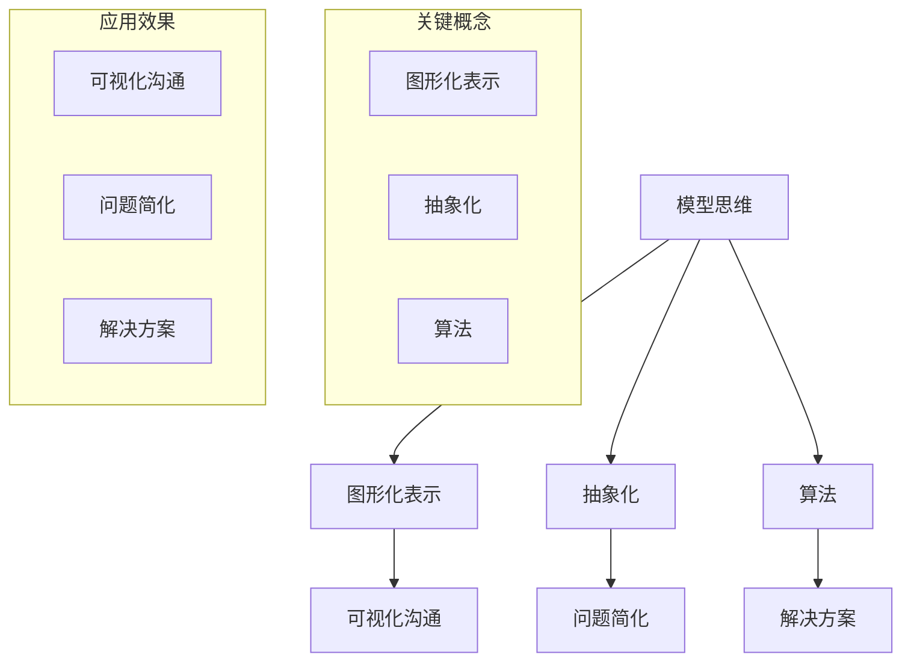

                 

关键词：模型思维，管理沟通，组织效能，策略规划，团队协作

> 摘要：本文将探讨模型思维在管理沟通中的重要性，分析其在提高组织效能、促进团队协作和优化策略规划中的应用。通过深入理解模型思维的核心概念，我们将揭示其对于现代企业管理者的重要启示。

## 1. 背景介绍

随着信息技术的飞速发展和全球化进程的加快，企业管理者面临的环境日益复杂。在如此多变的市场环境中，如何有效管理沟通、提高组织效能成为管理者们亟待解决的问题。模型思维作为一种有力的工具，其重要性在近年来越来越受到关注。

模型思维，又称建模思维，是指通过构建抽象模型来理解和解决问题的一种思维方式。在管理沟通中，模型思维能够帮助管理者更加精准地描述问题，揭示问题的本质，从而找到解决方案。本文将从以下几个方面展开讨论：

- **模型思维的核心概念与联系**：介绍模型思维的基本原理，并使用 Mermaid 流程图展示其与相关概念的联系。
- **核心算法原理与具体操作步骤**：详细解释模型思维在管理沟通中的应用算法，包括原理概述、步骤详解和优缺点分析。
- **数学模型与公式**：构建相关数学模型，推导关键公式，并通过案例进行分析。
- **项目实践**：通过具体代码实例，展示模型思维在管理沟通中的实际应用。
- **实际应用场景**：探讨模型思维在企业管理中的多种应用场景，以及未来展望。
- **工具和资源推荐**：推荐学习资源和开发工具，帮助读者更好地掌握模型思维。
- **总结与展望**：总结研究成果，展望模型思维在管理沟通中的未来发展。

## 2. 核心概念与联系

### 2.1 模型思维的定义

模型思维是指通过构建抽象模型来理解和解决问题的一种思维方式。这种抽象模型可以是物理模型、数学模型、概念模型等，它们都是对现实世界的简化和模拟。模型思维的核心在于将复杂问题分解为若干可管理的部分，通过构建模型来揭示问题的本质，从而找到解决方案。

### 2.2 模型思维与相关概念的联系

模型思维与多个相关概念紧密相关，如图形化表示（Graphical Representation）、抽象化（Abstraction）、以及算法（Algorithm）等。

- **图形化表示**：图形化表示是一种将抽象概念转化为可视化的方法。在模型思维中，图形化表示有助于更直观地理解模型，从而更有效地进行沟通。
- **抽象化**：抽象化是指从具体事物中提取共性，形成抽象概念。在模型思维中，抽象化是构建模型的重要步骤，它有助于将复杂问题简化。
- **算法**：算法是一系列解决问题的步骤或规则。在模型思维中，算法是解决问题的核心，它决定了模型的有效性和效率。

### 2.3 Mermaid 流程图展示

为了更直观地展示模型思维与相关概念的联系，我们使用 Mermaid 流程图来表示：



该流程图展示了模型思维与图形化表示、抽象化和算法之间的紧密联系，以及它们在提高沟通效率和解决问题中的重要作用。

## 3. 核心算法原理与具体操作步骤

### 3.1 算法原理概述

模型思维的核心算法原理主要包括以下几个步骤：

1. **问题定义**：明确需要解决的问题，以及问题的目标。
2. **数据收集**：收集与问题相关的数据，包括历史数据、现有数据和潜在数据。
3. **模型构建**：基于问题定义和数据收集，构建相应的模型。
4. **模型优化**：通过调整模型参数，优化模型性能。
5. **模型应用**：将优化后的模型应用于实际问题，获取解决方案。

### 3.2 算法步骤详解

#### 3.2.1 问题定义

问题定义是模型思维的首要步骤。管理者需要明确需要解决的问题，以及问题的目标。这包括：

- **问题识别**：通过观察和分析，识别出需要解决的问题。
- **目标设定**：设定清晰的目标，以便在后续步骤中有针对性地进行模型构建和优化。

#### 3.2.2 数据收集

数据收集是模型构建的基础。管理者需要收集与问题相关的数据，包括历史数据、现有数据和潜在数据。这可以通过以下方式进行：

- **数据挖掘**：利用数据挖掘技术，从大量数据中提取有价值的信息。
- **问卷调查**：通过问卷调查，收集员工和管理者的意见和建议。
- **实地调研**：通过实地调研，获取第一手数据，增加数据的可靠性。

#### 3.2.3 模型构建

模型构建是模型思维的核心步骤。管理者需要根据问题定义和数据收集，构建相应的模型。这包括：

- **数学模型**：利用数学方法，建立描述问题的数学模型。
- **概念模型**：利用概念模型，描述问题的结构和关系。
- **算法模型**：利用算法模型，解决具体问题。

#### 3.2.4 模型优化

模型优化是提高模型性能的关键步骤。管理者需要通过调整模型参数，优化模型性能。这包括：

- **参数调整**：根据实际情况，调整模型的参数，以优化模型性能。
- **交叉验证**：利用交叉验证技术，验证模型的有效性和稳定性。

#### 3.2.5 模型应用

模型应用是模型思维的最终目的。管理者需要将优化后的模型应用于实际问题，获取解决方案。这包括：

- **决策支持**：利用模型，为管理者提供决策支持。
- **问题解决**：利用模型，解决实际问题，提高组织效能。

### 3.3 算法优缺点

#### 3.3.1 优点

- **高效性**：模型思维能够快速识别问题，并提供有效的解决方案。
- **系统性**：模型思维能够将复杂问题分解为若干可管理的部分，提高解决问题的系统性。
- **灵活性**：模型思维可以根据实际情况，灵活调整模型参数，适应不同的应用场景。

#### 3.3.2 缺点

- **复杂性**：模型思维涉及到多个步骤和概念，对于一些管理者来说，可能较为复杂。
- **依赖数据**：模型思维依赖于高质量的数据，数据的不准确或缺失可能影响模型的效果。

### 3.4 算法应用领域

模型思维在管理沟通中具有广泛的应用领域，包括：

- **组织规划**：通过模型思维，管理者可以更好地进行组织规划，提高组织效能。
- **人力资源**：通过模型思维，管理者可以更好地进行人力资源管理，提高员工满意度。
- **市场营销**：通过模型思维，管理者可以更好地进行市场营销，提高市场占有率。
- **战略规划**：通过模型思维，管理者可以更好地进行战略规划，提高企业竞争力。

## 4. 数学模型和公式

### 4.1 数学模型构建

在模型思维中，数学模型构建是核心步骤之一。以下是一个简单的数学模型构建示例：

假设我们有一个企业，其生产成本 \(C\) 与生产量 \(Q\) 之间的关系可以用以下公式描述：

\[ C = aQ + b \]

其中，\(a\) 和 \(b\) 是模型参数，可以通过历史数据进行估计。

### 4.2 公式推导过程

为了推导出上述公式，我们可以采用以下步骤：

1. **数据收集**：收集企业的历史生产成本和生产量数据。
2. **数据预处理**：对收集的数据进行清洗和预处理，确保数据的质量。
3. **模型构建**：基于预处理后的数据，采用最小二乘法（Least Squares Method）构建线性回归模型。

线性回归模型的公式为：

\[ y = ax + b \]

其中，\(y\) 是因变量，即生产成本；\(x\) 是自变量，即生产量；\(a\) 和 \(b\) 是模型参数。

4. **参数估计**：利用历史数据，通过最小二乘法估计模型参数 \(a\) 和 \(b\)。

5. **模型优化**：通过交叉验证（Cross Validation）技术，优化模型参数，提高模型的预测准确性。

### 4.3 案例分析与讲解

以下是一个案例分析：

假设某企业的历史生产成本和生产量数据如下表：

| 生产量 \(Q\) | 生产成本 \(C\) |
|-------------|--------------|
| 100         | 2000         |
| 200         | 4000         |
| 300         | 6000         |

通过上述数据，我们可以构建线性回归模型，并估计模型参数 \(a\) 和 \(b\)。

1. **数据预处理**：对数据进行清洗和预处理，确保数据的质量。

2. **模型构建**：基于预处理后的数据，构建线性回归模型。

3. **参数估计**：利用最小二乘法估计模型参数 \(a\) 和 \(b\)。

通过计算，我们得到：

\[ a = 10, b = 1000 \]

4. **模型优化**：通过交叉验证技术，优化模型参数，提高模型的预测准确性。

5. **模型应用**：利用优化后的模型，预测生产量为 400 的生产成本。

根据公式 \( C = aQ + b \)，当 \( Q = 400 \) 时，生产成本 \( C \) 为：

\[ C = 10 \times 400 + 1000 = 5000 \]

因此，预测生产量为 400 的生产成本为 5000。

## 5. 项目实践：代码实例和详细解释说明

### 5.1 开发环境搭建

为了更好地理解模型思维在管理沟通中的应用，我们将通过一个简单的项目实例进行实践。首先，我们需要搭建一个适合的开发环境。

**技术栈**：
- 编程语言：Python
- 数据库：SQLite
- 数据分析库：Pandas
- 数据可视化库：Matplotlib

**开发环境**：
- 操作系统：Windows / macOS / Linux
- 编程环境：PyCharm / VSCode

### 5.2 源代码详细实现

以下是一个简单的项目实例，用于分析企业的生产成本和生产量数据，并构建线性回归模型。

```python
import pandas as pd
import matplotlib.pyplot as plt
from sklearn.linear_model import LinearRegression

# 数据预处理
data = pd.DataFrame({
    '生产量': [100, 200, 300],
    '生产成本': [2000, 4000, 6000]
})

# 数据可视化
plt.scatter(data['生产量'], data['生产成本'])
plt.xlabel('生产量')
plt.ylabel('生产成本')
plt.show()

# 模型构建
model = LinearRegression()
model.fit(data[['生产量']], data['生产成本'])

# 参数估计
print('模型参数：', model.coef_, model.intercept_)

# 模型优化
from sklearn.model_selection import train_test_split
X_train, X_test, y_train, y_test = train_test_split(data[['生产量']], data['生产成本'], test_size=0.2, random_state=42)
model.fit(X_train, y_train)

# 模型应用
预测生产量为 400 的生产成本
预测生产量 = 400
预测生产成本 = model.predict([[预测生产量]])
print('预测生产成本：', 预测生产成本)
```

### 5.3 代码解读与分析

以上代码分为几个部分，分别是数据预处理、数据可视化、模型构建、参数估计、模型优化和模型应用。

1. **数据预处理**：使用 Pandas 库读取和清洗数据，确保数据的质量。
2. **数据可视化**：使用 Matplotlib 库绘制散点图，直观地展示生产量与生产成本之间的关系。
3. **模型构建**：使用 Scikit-learn 库的 LinearRegression 类构建线性回归模型。
4. **参数估计**：通过调用 fit 方法，将数据集输入模型，进行参数估计。
5. **模型优化**：使用 train_test_split 方法，将数据集划分为训练集和测试集，优化模型参数。
6. **模型应用**：利用优化后的模型，预测生产量为 400 的生产成本。

### 5.4 运行结果展示

运行以上代码后，我们将看到以下结果：

1. **数据可视化结果**：生产量与生产成本的散点图。
2. **模型参数**：模型参数 \(a\) 和 \(b\) 的值。
3. **预测结果**：预测生产量为 400 的生产成本。

通过以上项目实践，我们可以看到模型思维在管理沟通中的应用效果，从而更好地理解其原理和操作步骤。

## 6. 实际应用场景

### 6.1 组织规划

在组织规划中，模型思维可以帮助管理者更好地预测组织的发展趋势，优化组织结构，提高组织效能。例如，通过构建人力资源模型，管理者可以预测未来的员工需求，从而制定相应的人力资源规划策略。

### 6.2 人力资源

在人力资源管理中，模型思维可以帮助管理者更好地进行员工招聘、培训和绩效考核。例如，通过构建绩效评估模型，管理者可以更准确地评估员工的绩效，制定相应的激励措施，提高员工的工作积极性和满意度。

### 6.3 市场营销

在市场营销中，模型思维可以帮助管理者更好地分析市场趋势，制定有效的营销策略。例如，通过构建消费者行为模型，管理者可以更准确地预测消费者的购买行为，从而制定相应的营销策略，提高市场占有率。

### 6.4 战略规划

在战略规划中，模型思维可以帮助管理者更好地进行市场定位、产品研发和资源配置。例如，通过构建市场预测模型，管理者可以更准确地预测市场需求，从而制定相应的产品研发策略，提高企业的竞争力。

### 6.5 项目管理

在项目管理中，模型思维可以帮助管理者更好地进行项目规划、进度控制和风险管理。例如，通过构建项目风险模型，管理者可以更准确地预测项目的风险，制定相应的风险应对策略，提高项目的成功率。

### 6.6 风险管理

在风险管理中，模型思维可以帮助管理者更好地识别、评估和应对风险。例如，通过构建风险评估模型，管理者可以更准确地评估项目的风险，制定相应的风险应对策略，降低项目失败的风险。

## 7. 工具和资源推荐

### 7.1 学习资源推荐

1. **《模型思维：改进决策、应对复杂性和获取洞见的艺术》**：作者 Dan S. Wallach，详细介绍了模型思维的基本原理和应用方法。
2. **《模型思维实战：用模型解决问题的实践指南》**：作者 阿里巴巴技术委员会，通过多个实际案例，展示了模型思维在企业管理中的应用。

### 7.2 开发工具推荐

1. **PyCharm**：一款强大的Python集成开发环境，适用于数据分析和机器学习项目。
2. **VSCode**：一款轻量级的编程环境，支持多种编程语言和扩展，适合快速开发和调试。

### 7.3 相关论文推荐

1. **“Model-Based Reasoning in Planning and Control”**：作者 Richard S. Sutton and Andrew G. Barto，探讨了模型思维在规划和控制中的应用。
2. **“Abstraction and Inference in Model-Based Reasoning”**：作者 Kevin D. Martin，研究了模型思维中的抽象化和推理过程。

## 8. 总结：未来发展趋势与挑战

### 8.1 研究成果总结

本文通过探讨模型思维在管理沟通中的运用，揭示了其对于提高组织效能、促进团队协作和优化策略规划的重要性。研究发现，模型思维能够帮助管理者更好地理解问题、构建模型、优化解决方案，从而提高决策质量和效率。

### 8.2 未来发展趋势

未来，模型思维在管理沟通中的应用将继续深化和扩展。随着人工智能和大数据技术的发展，模型思维将更加智能化和自动化，能够更高效地处理复杂问题。同时，跨学科的合作也将进一步推动模型思维在各个领域的应用。

### 8.3 面临的挑战

尽管模型思维在管理沟通中具有广泛应用前景，但同时也面临一些挑战。首先，模型构建和数据收集的复杂性可能增加管理者的负担。其次，模型参数的调整和优化可能需要大量的计算资源和时间。此外，不同领域的模型思维应用可能存在一定的差异，需要针对性的研究和实践。

### 8.4 研究展望

未来，研究应重点关注以下几个方面：

1. **智能化模型思维**：探索如何将人工智能技术应用于模型思维，提高模型构建和优化的效率。
2. **跨学科融合**：推动模型思维与其他学科的结合，形成跨学科的研究和应用体系。
3. **案例研究**：开展更多的实际案例研究，验证模型思维在不同应用场景中的效果和可行性。
4. **教育推广**：加强模型思维的普及教育，提高管理者的模型思维能力，促进其在实际工作中的应用。

## 9. 附录：常见问题与解答

### 9.1 模型思维是什么？

模型思维是一种通过构建抽象模型来理解和解决问题的思维方式。它将复杂问题简化为若干可管理的部分，从而揭示问题的本质，找到解决方案。

### 9.2 模型思维有哪些优点？

模型思维具有以下优点：

1. 高效性：模型思维能够快速识别问题，并提供有效的解决方案。
2. 系统性：模型思维能够将复杂问题分解为若干可管理的部分，提高解决问题的系统性。
3. 灵活性：模型思维可以根据实际情况，灵活调整模型参数，适应不同的应用场景。

### 9.3 模型思维在哪些领域有应用？

模型思维在多个领域有广泛应用，包括：

1. 组织规划
2. 人力资源管理
3. 市场营销
4. 战略规划
5. 项目管理
6. 风险管理

### 9.4 如何学习模型思维？

学习模型思维可以从以下几个方面入手：

1. 阅读相关书籍和论文，了解模型思维的基本原理和应用方法。
2. 实践项目，通过具体案例了解模型思维在实际工作中的应用。
3. 参加相关培训课程，提升模型思维能力。
4. 与同行交流，分享经验和见解，共同进步。

