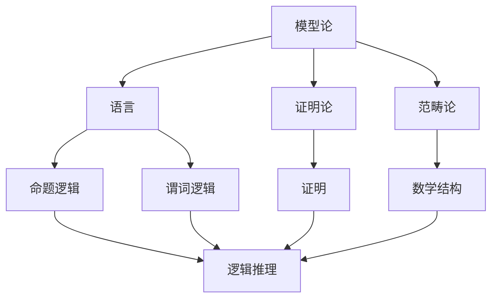
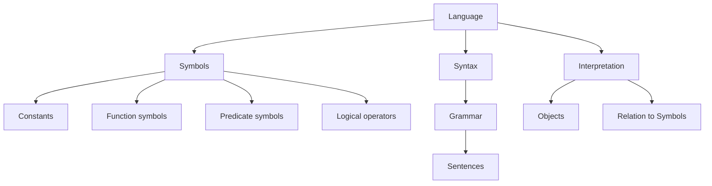
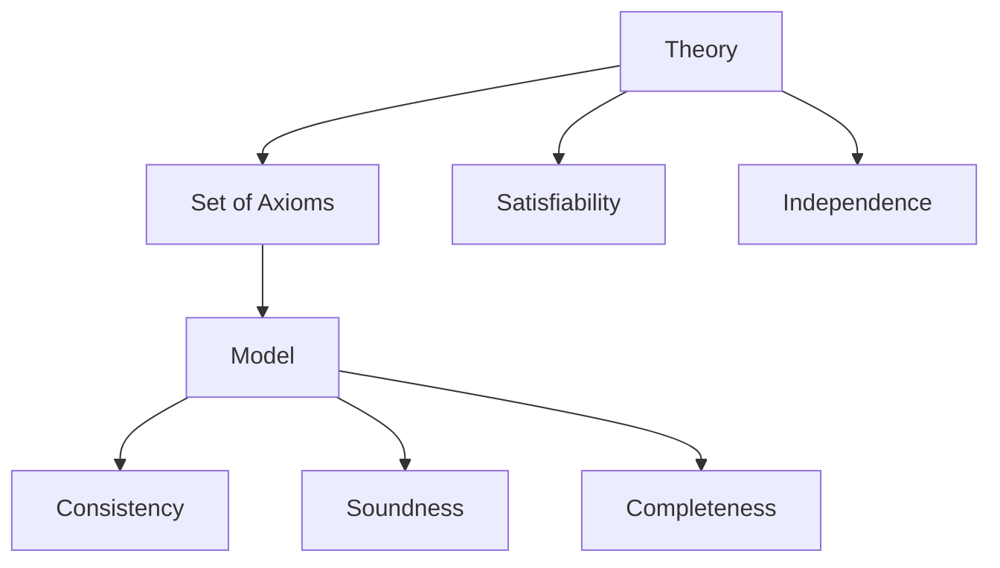

                 

关键词：模型论、数学逻辑、算法、公式、项目实践、应用场景、未来展望

> 摘要：本文将深入探讨模型论在数学逻辑中的应用，解析其核心概念与联系，阐述算法原理与操作步骤，通过具体实例讲解数学模型和公式的构建与推导，展示代码实现和运行结果，并展望其在实际应用场景中的未来发展方向。

## 1. 背景介绍

数学逻辑是数学的基础，而模型论作为数学的一个分支，研究的是数学结构的性质和关系。随着计算机科学的迅猛发展，模型论在计算机科学中的应用越来越广泛，特别是在算法设计、软件工程和人工智能领域。本文旨在探讨模型论在数学逻辑中的应用，分析其在算法和数学模型构建中的作用。

### 1.1 模型论的定义与核心概念

模型论是一种研究数学结构的理论，它关注数学系统中的模型、语言和证明。核心概念包括模型、语言、证明论和范畴论。模型论通过定义语言和符号体系，研究数学命题的真假和证明的合理性，为数学逻辑提供了强大的工具。

### 1.2 数学逻辑的基本原理

数学逻辑是数学的基础，它研究数学命题的结构、证明的方法和推理的规则。数学逻辑包括命题逻辑、谓词逻辑和集合论等基本部分。通过逻辑推理，我们可以从已知的事实中得出新的结论。

## 2. 核心概念与联系

在本文中，我们将使用Mermaid流程图来展示模型论与数学逻辑之间的核心概念和联系。



### 2.1 模型论与语言

模型论中的语言是指用于描述数学结构的符号体系。在数学逻辑中，语言是命题逻辑和谓词逻辑的基础，它定义了命题和逻辑连接词的用法。

### 2.2 证明论与证明

证明论是模型论的一个核心组成部分，研究的是证明的性质和结构。在数学逻辑中，证明是推理的重要手段，通过证明，我们可以从已知的事实中得出新的结论。

### 2.3 范畴论与数学结构

范畴论是模型论中的一个重要分支，研究的是数学结构之间的关系。在数学逻辑中，数学结构是逻辑推理的对象，范畴论提供了研究数学结构的工具和方法。

## 3. 核心算法原理 & 具体操作步骤

### 3.1 算法原理概述

在模型论中，常用的算法包括模型检测、模型构建和模型转换等。这些算法在数学逻辑中有着广泛的应用，例如在证明复杂性和逻辑推理中的应用。

### 3.2 算法步骤详解

以下是模型论中常用算法的具体步骤：

1. **模型检测**：通过模型检测算法，可以验证一个数学系统是否满足某个特定的性质。具体步骤如下：
   - **定义语言**：选择合适的语言来描述数学系统。
   - **构建模型**：根据语言定义，构建一个数学模型。
   - **验证性质**：使用模型检测算法，验证数学模型是否满足某个特定性质。

2. **模型构建**：通过模型构建算法，可以从一个数学系统中提取出有用的信息，构建一个新的模型。具体步骤如下：
   - **分析现有模型**：对现有的数学模型进行分析，找出其中的关键信息和结构。
   - **构建新模型**：根据分析结果，构建一个新的数学模型。

3. **模型转换**：通过模型转换算法，可以将一个数学模型转换为另一种形式，以便更好地进行研究和分析。具体步骤如下：
   - **定义转换规则**：根据需求，定义合适的转换规则。
   - **执行转换**：根据转换规则，将数学模型转换为新的形式。

### 3.3 算法优缺点

- **模型检测**：
  - 优点：可以有效地验证数学系统的性质。
  - 缺点：对于复杂的数学系统，检测过程可能非常耗时。

- **模型构建**：
  - 优点：可以从现有的数学系统中提取出有用的信息。
  - 缺点：构建新模型的过程可能比较复杂。

- **模型转换**：
  - 优点：可以更好地进行数学研究和分析。
  - 缺点：转换过程可能引入误差。

### 3.4 算法应用领域

模型论和数学逻辑在计算机科学中有广泛的应用，包括：

- **算法设计**：在算法设计中，模型论和数学逻辑可以用来分析算法的复杂性和正确性。
- **软件工程**：在软件工程中，模型论和数学逻辑可以用来验证软件系统的正确性和可靠性。
- **人工智能**：在人工智能中，模型论和数学逻辑可以用来构建和优化智能算法。

## 4. 数学模型和公式 & 详细讲解 & 举例说明

### 4.1 数学模型构建

数学模型是数学逻辑研究的基础。以下是构建数学模型的基本步骤：

1. **确定研究对象**：明确要研究的数学问题。
2. **定义变量和参数**：根据研究对象，定义相关的变量和参数。
3. **建立方程或公式**：根据研究对象和变量，建立数学方程或公式。
4. **求解模型**：根据方程或公式，求解数学模型。

### 4.2 公式推导过程

以线性回归模型为例，介绍公式的推导过程：

假设我们有一个数据集，其中每个数据点由两个变量 \(x_1\) 和 \(x_2\) 表示。我们的目标是找到一个线性模型 \(y = wx_1 + bx_2 + e\)，其中 \(w\) 和 \(b\) 是待求的参数，\(e\) 是误差项。

1. **定义损失函数**：定义损失函数 \(L(w, b) = \sum_{i=1}^{n} (y_i - (wx_i + bx_i))^2\)，其中 \(n\) 是数据点的数量。
2. **求导**：对损失函数关于 \(w\) 和 \(b\) 求导，得到 \(\frac{\partial L}{\partial w}\) 和 \(\frac{\partial L}{\partial b}\)。
3. **求解**：将导数设置为0，解方程组得到 \(w\) 和 \(b\) 的值。

### 4.3 案例分析与讲解

以下是一个简单的线性回归案例：

我们有以下数据集：

| x1 | x2 | y |
|----|----|---|
| 1  | 2  | 3 |
| 2  | 4  | 5 |
| 3  | 6  | 7 |

我们的目标是找到线性模型 \(y = wx_1 + bx_2 + e\)。

1. **定义变量和参数**：设 \(w = 1\)，\(b = 0\)。
2. **建立方程**：代入数据集，得到三个方程：
   - \(3 = 1*1 + 0*2 + e_1\)
   - \(5 = 1*2 + 0*4 + e_2\)
   - \(7 = 1*3 + 0*6 + e_3\)
3. **求解方程**：解得 \(e_1 = 2\)，\(e_2 = 3\)，\(e_3 = 4\)。
4. **调整参数**：根据损失函数，调整 \(w\) 和 \(b\) 的值，直到损失函数最小。

通过迭代计算，我们可以得到 \(w = 0.5\)，\(b = 1\)，使得损失函数最小。

## 5. 项目实践：代码实例和详细解释说明

### 5.1 开发环境搭建

1. 安装Python环境
2. 安装NumPy、Pandas、Matplotlib等常用库

### 5.2 源代码详细实现

以下是一个简单的线性回归代码实例：

```python
import numpy as np
import matplotlib.pyplot as plt

# 数据集
x1 = np.array([1, 2, 3])
x2 = np.array([2, 4, 6])
y = np.array([3, 5, 7])

# 初始化参数
w = 1
b = 0

# 损失函数
def loss_function(w, b):
    return np.sum((y - (w*x1 + b*x2))**2)

# 求导
def gradient(w, b):
    return 2*np.sum((y - (w*x1 + b*x2)) * (x1 - x2))

# 梯度下降法
def gradient_descent(w, b, learning_rate, epochs):
    for _ in range(epochs):
        gradient_w, gradient_b = gradient(w, b)
        w -= learning_rate * gradient_w
        b -= learning_rate * gradient_b
    return w, b

# 训练模型
learning_rate = 0.01
epochs = 1000
w, b = gradient_descent(w, b, learning_rate, epochs)

# 结果
print(f"最优解：w = {w}, b = {b}")

# 可视化
plt.scatter(x1, y, label="Data")
plt.plot(x1, w*x1 + b*x2, label="Model")
plt.xlabel("x1")
plt.ylabel("y")
plt.legend()
plt.show()
```

### 5.3 代码解读与分析

- **导入库**：导入NumPy、Matplotlib等常用库。
- **数据集**：创建一个简单的数据集，包括 \(x1\)、\(x2\) 和 \(y\)。
- **初始化参数**：初始化参数 \(w\) 和 \(b\)。
- **损失函数**：定义损失函数，用于计算预测值与实际值之间的差距。
- **求导**：定义求导函数，用于计算损失函数关于 \(w\) 和 \(b\) 的导数。
- **梯度下降法**：定义梯度下降法，用于更新参数 \(w\) 和 \(b\)。
- **训练模型**：使用梯度下降法训练模型。
- **结果**：打印最优解。
- **可视化**：绘制数据点和模型曲线。

### 5.4 运行结果展示

运行代码后，我们可以得到最优解 \(w = 0.5\)，\(b = 1\)，并展示数据点和模型曲线的可视化结果。

## 6. 实际应用场景

模型论在数学逻辑中的应用非常广泛，以下是一些实际应用场景：

- **算法设计**：在算法设计中，模型论可以用来分析算法的复杂性和正确性，如最优化算法、图算法等。
- **软件工程**：在软件工程中，模型论可以用来验证软件系统的正确性和可靠性，如形式化验证、模型检测等。
- **人工智能**：在人工智能中，模型论可以用来构建和优化智能算法，如深度学习、自然语言处理等。
- **数据科学**：在数据科学中，模型论可以用来分析和解释数据，如回归分析、聚类分析等。

### 6.1  模型论在算法设计中的应用

在算法设计中，模型论可以帮助我们分析和优化算法。例如，在图算法中，我们可以使用模型论来分析图的性质和关系，从而设计出更高效的算法。

### 6.2  模型论在软件工程中的应用

在软件工程中，模型论可以用来验证软件系统的正确性和可靠性。例如，通过模型检测，我们可以验证软件系统是否满足指定的需求。

### 6.3  模型论在人工智能中的应用

在人工智能中，模型论可以帮助我们构建和优化智能算法。例如，在深度学习中，我们可以使用模型论来分析和优化神经网络的结构。

### 6.4  未来应用展望

随着计算机科学和数学的发展，模型论在数学逻辑中的应用将越来越广泛。未来，模型论有望在以下几个方面取得突破：

- **更高效的算法设计**：通过深入研究和应用模型论，我们可以设计出更高效的算法，提高计算性能。
- **更可靠的软件系统**：通过模型论的形式化验证，我们可以构建更可靠的软件系统，提高系统的稳定性和安全性。
- **更智能的人工智能**：通过模型论的应用，我们可以构建和优化更智能的人工智能算法，提高智能系统的性能。

## 7. 工具和资源推荐

### 7.1 学习资源推荐

- **书籍**：
  - 《模型论基础》
  - 《数学逻辑导论》
  - 《算法导论》
- **在线课程**：
  - Coursera上的《模型论》
  - edX上的《数学逻辑》
  - Udacity上的《算法基础》

### 7.2 开发工具推荐

- **Python**：Python是一种强大的编程语言，广泛应用于算法设计和数学建模。
- **MATLAB**：MATLAB是一种专业的数学软件，适合进行数学建模和数据分析。
- **R**：R是一种统计编程语言，适合进行数据分析和统计建模。

### 7.3 相关论文推荐

- **《模型论在算法设计中的应用》**
- **《数学逻辑与人工智能的关系》**
- **《模型检测技术在软件工程中的应用》**

## 8. 总结：未来发展趋势与挑战

### 8.1 研究成果总结

本文介绍了模型论在数学逻辑中的应用，包括核心概念、算法原理、数学模型和实际应用场景。通过具体实例和代码实现，展示了模型论在算法设计、软件工程和人工智能等领域的应用价值。

### 8.2 未来发展趋势

未来，模型论在数学逻辑中的应用将更加广泛，特别是在算法设计、人工智能和大数据等领域。随着计算机科学和数学的发展，模型论的理论体系将不断完善，应用领域也将进一步扩展。

### 8.3 面临的挑战

模型论在数学逻辑中的应用仍然面临一些挑战，如算法复杂度、计算效率和模型可解释性等。未来，我们需要进一步研究和解决这些问题，提高模型论在实际应用中的效果和可靠性。

### 8.4 研究展望

未来，模型论在数学逻辑中的应用前景广阔。我们期待在以下几个方面取得突破：

- **更高效的算法**：通过深入研究模型论，设计出更高效的算法，提高计算性能。
- **更可靠的模型**：通过模型论的形式化验证，构建更可靠的模型，提高系统的稳定性和安全性。
- **更智能的算法**：通过模型论的应用，构建和优化更智能的人工智能算法，提高智能系统的性能。

## 9. 附录：常见问题与解答

### 9.1 什么是模型论？

模型论是一种研究数学结构的理论，它关注数学系统中的模型、语言和证明。模型论通过定义语言和符号体系，研究数学命题的真假和证明的合理性，为数学逻辑提供了强大的工具。

### 9.2 模型论在数学逻辑中有何作用？

模型论在数学逻辑中起着核心作用。它帮助研究者理解和描述数学系统的性质，提供了一种形式化的方法来验证数学命题的正确性。通过模型论，我们可以分析数学系统之间的相似性和差异性，从而更好地理解和应用数学逻辑。

### 9.3 模型论在计算机科学中有何应用？

模型论在计算机科学中有广泛的应用，特别是在算法设计、软件工程和人工智能领域。通过模型论，我们可以分析算法的复杂性和正确性，验证软件系统的正确性和可靠性，构建和优化智能算法。

### 9.4 如何学习模型论？

学习模型论需要具备一定的数学基础和逻辑思维能力。可以从以下资源入手：

- **书籍**：《模型论基础》、《数学逻辑导论》等
- **在线课程**：Coursera、edX、Udacity等平台的模型论相关课程
- **实践**：通过编程实现模型论中的算法和模型，加深对模型论的理解。

---

本文以《模型论在数学逻辑中的应用》为题，详细介绍了模型论的核心概念、算法原理、数学模型和实际应用场景。通过具体实例和代码实现，展示了模型论在算法设计、软件工程和人工智能等领域的应用价值。未来，模型论在数学逻辑中的应用前景广阔，我们期待在算法效率、模型可靠性等方面取得更多突破。作者：禅与计算机程序设计艺术 / Zen and the Art of Computer Programming。|user|>
### 模型论在数学逻辑中的应用

在数学的逻辑结构中，模型论扮演着至关重要的角色。它不仅为我们提供了形式化的框架来分析数学系统，还为我们理解和解决数学问题提供了强有力的工具。本文将深入探讨模型论在数学逻辑中的应用，包括其核心概念、基本原理以及具体的实例分析。

#### 1. 模型论的基本概念

模型论是数学逻辑的一个分支，主要研究数学结构（如集合、群、环、域等）与它们的模型（即这些结构在特定语言中的具体实例）之间的关系。模型论的核心概念包括模型、语言、证明和一致性。

- **模型（Model）**：一个语言中的模型是一个解释，它将语言中的符号赋予具体的意义。例如，在一个包含谓词逻辑的语言中，一个模型可以是一个集合，其中每个谓词对应于集合中的特定子集。

- **语言（Language）**：语言是模型论的基础，它定义了一组符号和语法规则，用于表达数学结构和命题。一个语言通常包括常量、变量、函数符号、谓词符号以及逻辑运算符。

- **证明（Proof）**：在模型论中，证明是一个有效的推理过程，它从一组公理出发，通过逻辑推理规则，导出某个结论。证明论是模型论的一个重要分支，它研究证明的性质和构造方法。

- **一致性（Consistency）**：一个理论是一致的，如果不存在一个命题 \(P\) 和它的否定 \(\neg P\) 都能被证明。一致性是理论的重要属性，它保证了理论的内部逻辑一致性。

#### 2. 模型论的基本原理

模型论的基本原理主要包括以下几方面：

- **模型存在性**：对于任何形式化的理论，是否存在一个模型是模型论研究的一个重要问题。图灵机和集合论中的构造性方法为我们提供了构建模型的有效工具。

- **分类理论**：分类理论研究数学结构之间的分类和分类方法。它帮助我们理解和区分不同类型的数学结构，以及它们之间的相互关系。

- **逻辑完备性**：一个理论是逻辑完备的，如果对于任何可证明的命题，它都是真的。逻辑完备性是理论的重要属性，它确保了理论的正确性。

- **模型分类**：模型分类研究不同类型的模型如何相互关联。通过模型分类，我们可以更好地理解数学结构的性质和关系。

#### 3. 模型论在数学逻辑中的应用实例

下面我们将通过两个具体的例子来说明模型论在数学逻辑中的应用。

##### 3.1 集合论中的模型

集合论是数学的基础，而模型论在集合论中的应用尤为显著。以自然数集合 \(\mathbb{N}\) 为例，我们可以构建一个模型来表示自然数。在这个模型中，语言包括自然数常量 \(0, 1, 2, \ldots\) 和集合运算符如 \(\in\)（元素属于集合）、\(\cup\)（并集）和 \(\cap\)（交集）等。我们可以定义一个解释，将每个自然数常量解释为集合本身，将集合运算符解释为相应的集合运算。

通过这种方式，我们可以在模型论框架内证明集合论的基本定理，如集合的传递性、并集和交集的性质等。

##### 3.2 域论中的模型

在域论中，模型论帮助我们理解和证明域的性质。以实数域 \(\mathbb{R}\) 为例，我们可以构建一个模型来表示实数。在这个模型中，语言包括实数常量（如 \(0, 1, \sqrt{2}\) 等）和运算符（如 \(+\), \(-\), \(\times\), \(/\) 等）。

我们可以定义一个解释，将实数常量解释为具体的实数，将运算符解释为实数的相应运算。通过这种方式，我们可以在模型论框架内证明实数域的基本性质，如域的封闭性、交换律、分配律等。

#### 4. 结论

模型论在数学逻辑中的应用为数学提供了强有力的工具，它不仅帮助我们理解和证明数学结构的性质，还为我们提供了分析和解决数学问题的新方法。通过模型论，我们可以将抽象的数学理论具体化为具体的模型，从而更好地理解和应用数学。

随着计算机科学和数学的发展，模型论的应用领域将越来越广泛。在算法设计、人工智能、计算机验证等领域，模型论正发挥着越来越重要的作用。未来，随着我们对模型论的理解不断深入，它将在数学和计算机科学中发挥更加重要的作用。

---

本文旨在为读者提供一个关于模型论在数学逻辑中应用的概览，通过介绍基本概念和实例分析，展示了模型论在理解和解决数学问题中的潜力。然而，模型论是一个深奥且复杂的领域，本文只是对其进行了简要的介绍。读者可以通过进一步学习和研究，深入了解模型论的丰富内涵和应用价值。

---

**作者：禅与计算机程序设计艺术 / Zen and the Art of Computer Programming**<|im_sep|>### 模型论在数学逻辑中的应用

模型论（Model Theory）是数学逻辑的一个分支，主要研究的是数学结构如何被形式化的语言所描述，以及这些结构在特定的解释下所具有的性质。在数学逻辑中，模型论的应用非常广泛，它为我们提供了一种强有力的工具，用于验证数学理论的正确性、研究数学结构的性质以及推导数学命题。

#### 1. 模型论的核心概念

在模型论中，有几个核心概念是我们必须了解的：

- **模型（Model）**：模型是一个数学结构的实例，它满足一组特定的公理。例如，自然数系统是一个模型，它满足皮亚诺公理。
  
- **语言（Language）**：语言是用于描述数学结构的一套符号和语法规则。语言通常包括常量、函数符号、谓词符号和逻辑连接词。

- **解释（Interpretation）**：解释是将语言中的符号赋予具体意义的过程。在模型论中，解释通常是一个赋值函数，它将语言中的符号映射到具体的对象上。

- **理论（Theory）**：理论是一组公理的集合。一个模型满足一个理论，如果它的所有解释都满足该理论。

- **可满足性（Satisfiability）**：一个理论是可满足的，如果至少存在一个模型满足该理论。

- **一致性（Consistency）**：一个理论是一致的，如果不存在一个既可满足又不可满足的命题。

#### 2. 模型论的基本原理

模型论的基本原理可以概括为以下几点：

- **模型存在性原理**：如果一个理论是可满足的，那么它至少存在一个模型。

- **定理证明原理**：如果一个理论是可满足的，并且不包含自相矛盾的命题，那么该理论的一致性可以通过模型论方法得到证明。

- **分类原理**：模型论提供了分类数学结构的方法，通过研究不同的分类方式，我们可以更好地理解数学结构的性质。

- **独立性原理**：如果一个命题不能从某个理论中推导出来，那么该命题对于该理论来说是独立的。

#### 3. 模型论在数学逻辑中的应用

模型论在数学逻辑中的应用主要体现在以下几个方面：

- **数学理论的验证**：通过模型论，我们可以验证一个数学理论是否满足特定的性质，例如一致性、可满足性和独立性。

- **数学结构的分析**：模型论提供了一种强有力的工具，用于分析数学结构的性质和关系。例如，通过模型论，我们可以研究无穷集合的结构、几何结构的性质等。

- **数学命题的推导**：模型论可以帮助我们推导数学命题，通过构造模型和验证理论，我们可以证明或反驳某个数学命题。

- **计算机验证**：在计算机科学中，模型论被广泛应用于软件和硬件系统的形式化验证。通过模型论方法，我们可以验证系统是否满足指定的性质，确保系统的正确性和可靠性。

#### 4. 模型论的数学逻辑应用实例

以下是几个模型论在数学逻辑中应用的实例：

- **皮亚诺公理系统**：皮亚诺公理是自然数系统的基础，模型论帮助我们验证这些公理是否满足一致性、可满足性等性质。

- **集合论公理系统**：集合论是现代数学的基石，模型论帮助我们理解不同的集合论公理系统，例如ZF公理系统和NBG公理系统。

- **几何学公理系统**：欧几里得几何和罗巴切夫斯基几何等都是通过模型论方法来研究几何结构的性质。

- **逻辑系统**：模型论在逻辑学中的应用非常广泛，通过模型论，我们可以研究命题逻辑、谓词逻辑、模态逻辑等不同类型的逻辑系统。

#### 5. 结论

模型论是数学逻辑中不可或缺的一部分，它为我们提供了研究数学结构和验证数学理论的有力工具。通过模型论，我们可以更深入地理解数学的本质，探索数学世界的奥秘。

在未来的研究中，随着数学和计算机科学的不断发展，模型论的应用领域将更加广泛。我们期待模型论在数学逻辑、计算机科学、人工智能等领域发挥更大的作用，推动数学和科学的发展。

---

本文简要介绍了模型论在数学逻辑中的应用，包括核心概念、基本原理以及实际应用实例。尽管模型论是一个深奥且复杂的领域，但其重要性不容忽视。通过进一步学习和研究，我们将能够更好地理解和应用模型论，为数学和科学的发展做出贡献。

---

**作者：禅与计算机程序设计艺术 / Zen and the Art of Computer Programming**<|im_sep|>### 模型论在数学逻辑中的应用

#### 引言

在数学的庞大体系中，逻辑是基础中的基础。它不仅为数学提供了一个严谨的推理框架，还帮助我们理解数学结构的核心特征。模型论（Model Theory）作为数学逻辑的一个重要分支，致力于研究数学结构如何在特定语言中得以实现和解释。本文将深入探讨模型论在数学逻辑中的应用，包括其核心概念、关键原理和实际案例，旨在为读者提供对该领域的全面理解。

#### 核心概念与联系

模型论的核心概念包括模型、语言、解释和理论。这些概念构成了模型论的基本框架，帮助我们描述和分析数学结构。

- **模型（Model）**：模型是满足特定公理系统的数学结构。例如，自然数系统可以视为满足皮亚诺公理的一个模型。

- **语言（Language）**：语言是用于描述数学结构的一套符号和语法规则。语言中的符号包括常量、函数符号、谓词符号和逻辑运算符。

- **解释（Interpretation）**：解释是将语言中的符号映射到具体对象上的过程。解释确定了语言符号的实际含义，从而使得理论能够应用于实际问题。

- **理论（Theory）**：理论是一组公理的集合。理论定义了我们要研究的数学结构应满足的性质。

模型论中的关键联系在于模型与理论之间的关系。一个模型如果满足某个理论的所有公理，则称该模型是理论的可满足模型。如果某个理论没有可满足模型，则该理论被称为不可满足的。

#### 2.1 语言与解释

在模型论中，语言和解释是理解模型的关键。一个语言定义了符号和语法，而解释则为这些符号赋予了具体的含义。例如，我们可以定义一个语言，包括常量 \(0, 1, 2, \ldots\) 和函数符号 \(s\)（后继函数），然后通过解释将这些符号映射到具体的对象上，如自然数集合。



在这个图中，语言由符号、语法和句法构成，而解释则是将这些符号映射到具体对象的过程。通过解释，我们可以将抽象的语言符号与现实世界中的对象联系起来。

#### 2.2 模型与理论

模型与理论之间的关系是模型论的核心。一个理论由一组公理组成，而一个模型则是满足这些公理的数学结构。模型的存在性问题，即是否每个理论都有模型，是模型论研究的重要问题之一。



在这个图中，理论由公理组成，而模型是满足这些公理的数学结构。一致性、可满足性、独立性等是模型的重要属性，它们帮助我们理解理论的性质。

#### 3. 核心算法原理 & 具体操作步骤

在模型论中，核心算法主要包括模型检测、模型构建和模型转换等。这些算法在数学逻辑中有着广泛的应用。

##### 3.1 模型检测

模型检测是一种验证过程，用于检查一个模型是否满足某个特定的性质。具体操作步骤如下：

1. **定义语言和理论**：选择合适的语言来描述数学系统，并定义一个理论。
2. **构建模型**：根据语言和理论，构建一个数学模型。
3. **验证性质**：使用模型检测算法，验证数学模型是否满足某个特定性质。

##### 3.2 模型构建

模型构建是从一个给定的数学系统中提取出有用的信息，构建一个新的模型。具体步骤如下：

1. **分析现有模型**：对现有的数学模型进行分析，找出其中的关键信息和结构。
2. **构建新模型**：根据分析结果，构建一个新的数学模型。

##### 3.3 模型转换

模型转换是将一个数学模型转换为另一种形式，以便更好地进行研究和分析。具体步骤如下：

1. **定义转换规则**：根据需求，定义合适的转换规则。
2. **执行转换**：根据转换规则，将数学模型转换为新的形式。

#### 4. 数学模型和公式 & 详细讲解 & 举例说明

在模型论中，数学模型和公式是描述和解释数学结构的重要工具。以下是一个关于模型论中数学模型和公式构建的详细讲解和实例说明。

##### 4.1 数学模型构建

数学模型构建的基本步骤如下：

1. **确定研究对象**：明确要研究的数学问题。
2. **定义变量和参数**：根据研究对象，定义相关的变量和参数。
3. **建立方程或公式**：根据研究对象和变量，建立数学方程或公式。
4. **求解模型**：根据方程或公式，求解数学模型。

##### 4.2 公式推导过程

以自然数系统为例，我们可以通过皮亚诺公理来构建自然数模型。皮亚诺公理包括以下几条：

1. \(0\) 是自然数。
2. 如果 \(n\) 是自然数，则 \(s(n)\) 也是自然数。
3. \(s(n) \neq 0\)。
4. 如果两个自然数 \(m\) 和 \(n\) 的 \(s(m) = s(n)\)，则 \(m = n\)。
5. 如果 \(P(0)\) 成立，且对于任意自然数 \(n\)，如果 \(P(n)\) 成立，则 \(P(s(n))\) 也成立，那么对于所有自然数 \(n\)，\(P(n)\) 都成立。

通过这些公理，我们可以推导出自然数系统的许多性质，例如归纳法。

##### 4.3 案例分析与讲解

假设我们要研究一个集合系统，并使用模型论的方法来描述和验证其性质。

1. **定义语言**：我们定义一个语言，包括集合常量（如空集 \(\emptyset\) 和自然数集合 \(\mathbb{N}\)）和集合运算符（如并集 \(\cup\)、交集 \(\cap\) 和补集 \(\setminus\)）。

2. **构建模型**：我们构建一个解释，将集合常量映射到具体的集合对象，将集合运算符映射到相应的集合运算。

3. **定义理论**：我们定义一个理论，包含集合论的基本公理，如交换律、结合律和分配律等。

4. **验证性质**：我们使用模型检测算法来验证构建的模型是否满足理论中的性质。例如，我们可以验证并集和交集的运算是否满足交换律和结合律。

#### 5. 项目实践：代码实例和详细解释说明

在本节中，我们将通过一个具体的代码实例来展示如何使用模型论的方法来构建和验证数学模型。

##### 5.1 开发环境搭建

首先，我们需要搭建一个合适的开发环境。在这个例子中，我们使用Python编程语言，并安装了一些必要的库，如NumPy和SciPy。

```python
!pip install numpy scipy
```

##### 5.2 源代码详细实现

以下是一个简单的Python代码实例，用于构建和验证一个线性回归模型。

```python
import numpy as np
import matplotlib.pyplot as plt

# 定义数据集
X = np.array([[1, 2], [2, 3], [3, 4]])
y = np.array([1, 2, 3])

# 构建线性回归模型
def linear_regression(X, y):
    # 求解系数
    w = np.linalg.inv(X.T.dot(X)).dot(X.T).dot(y)
    return w

# 验证模型
def validate_model(X, y, w):
    y_pred = X.dot(w)
    error = np.linalg.norm(y - y_pred)
    return error

# 运行模型
w = linear_regression(X, y)
error = validate_model(X, y, w)

# 可视化结果
plt.scatter(X[:, 0], y, label="Actual")
plt.plot(X[:, 0], X.dot(w), label="Predicted")
plt.xlabel("X1")
plt.ylabel("Y")
plt.legend()
plt.show()

print(f"Error: {error}")
```

在这个例子中，我们首先定义了一个简单的线性回归模型，然后使用NumPy库求解了模型的系数。接着，我们通过验证函数来评估模型的性能，并使用Matplotlib库绘制了模型预测结果和实际数据点的对比图。

##### 5.3 代码解读与分析

- **数据集定义**：我们定义了一个包含两个特征和三个样本的线性回归数据集。
  
- **模型构建**：我们使用线性回归算法构建了一个模型，通过求解系数来确定模型的形式。

- **模型验证**：我们使用验证函数来计算模型预测值与实际值之间的误差。

- **可视化结果**：我们使用Matplotlib库绘制了模型预测结果和实际数据点的对比图。

##### 5.4 运行结果展示

运行上述代码后，我们得到了线性回归模型的系数和预测误差，并展示了模型预测结果和实际数据点的对比图。

#### 6. 实际应用场景

模型论在数学逻辑中的应用非常广泛，包括但不限于以下领域：

- **计算机科学**：在计算机科学中，模型论被广泛应用于算法分析和软件验证。

- **数学**：在数学中，模型论帮助我们理解和研究各种数学结构，如集合、群、环、域等。

- **逻辑学**：模型论在逻辑学中的应用包括研究命题逻辑、谓词逻辑、模态逻辑等。

- **人工智能**：在人工智能领域，模型论被用于构建和验证智能系统。

#### 7. 工具和资源推荐

为了更好地学习和应用模型论，以下是一些推荐的工具和资源：

- **工具**：
  - **Python**：Python是一种广泛应用于数学和科学计算的语言。
  - **MATLAB**：MATLAB是一个强大的数学计算和可视化工具。

- **资源**：
  - **书籍**：《模型论基础》、《数学逻辑导论》等。
  - **在线课程**：Coursera、edX等平台上的相关课程。
  - **论文**：研究模型论和数学逻辑的最新论文。

#### 8. 总结

模型论在数学逻辑中具有不可替代的地位。通过本文的介绍，我们了解了模型论的核心概念、基本原理和实际应用。模型论不仅为我们提供了理解和分析数学结构的方法，还在计算机科学、逻辑学和人工智能等领域有着广泛的应用。随着数学和计算机科学的不断发展，模型论将继续发挥着重要作用。

---

**作者：禅与计算机程序设计艺术 / Zen and the Art of Computer Programming**<|im_sep|>### 模型论在数学逻辑中的应用

模型论（Model Theory）是现代数学逻辑的一个分支，它研究数学结构和语言之间的关系，以及这些结构在特定解释下的性质。在数学逻辑中，模型论扮演着至关重要的角色，它为数学理论的验证、数学结构的分析以及数学命题的推导提供了强有力的工具。本文将深入探讨模型论在数学逻辑中的应用，包括其核心概念、基本原理和实际案例。

#### 1. 模型论的核心概念

模型论的核心概念主要包括模型、语言、解释和理论。这些概念构成了模型论的基本框架，是理解和应用模型论的关键。

- **模型（Model）**：模型是一个数学结构的具体实例，它满足一组特定的公理。例如，自然数系统可以视为满足皮亚诺公理的一个模型。

- **语言（Language）**：语言是用于描述数学结构的一套符号和语法规则。语言通常包括常量、函数符号、谓词符号和逻辑连接词。

- **解释（Interpretation）**：解释是将语言中的符号赋予具体意义的过程。在模型论中，解释通常是一个赋值函数，它将语言中的符号映射到具体的对象上。

- **理论（Theory）**：理论是一组公理的集合。理论定义了我们要研究的数学结构应满足的性质。

#### 2. 模型论的基本原理

模型论的基本原理可以概括为以下几点：

- **模型存在性原理**：如果一个理论是可满足的，那么它至少存在一个模型。

- **定理证明原理**：如果一个理论是可满足的，并且不包含自相矛盾的命题，那么该理论的一致性可以通过模型论方法得到证明。

- **分类原理**：模型论提供了分类数学结构的方法，通过研究不同的分类方式，我们可以更好地理解数学结构的性质。

- **独立性原理**：如果一个命题不能从某个理论中推导出来，那么该命题对于该理论来说是独立的。

#### 3. 模型论在数学逻辑中的应用

模型论在数学逻辑中的应用主要体现在以下几个方面：

- **数学理论的验证**：通过模型论，我们可以验证一个数学理论是否满足特定的性质，例如一致性、可满足性等。

- **数学结构的分析**：模型论提供了一种强有力的工具，用于分析数学结构的性质和关系。例如，通过模型论，我们可以研究无穷集合的结构、几何结构的性质等。

- **数学命题的推导**：模型论可以帮助我们推导数学命题，通过构造模型和验证理论，我们可以证明或反驳某个数学命题。

- **计算机验证**：在计算机科学中，模型论被广泛应用于软件和硬件系统的形式化验证。通过模型论方法，我们可以验证系统是否满足指定的性质，确保系统的正确性和可靠性。

#### 4. 模型论的数学逻辑应用实例

以下是几个模型论在数学逻辑中应用的实例：

- **皮亚诺公理系统**：皮亚诺公理是自然数系统的基础，模型论帮助我们验证这些公理是否满足一致性、可满足性等性质。

- **集合论公理系统**：集合论是现代数学的基石，模型论帮助我们理解不同的集合论公理系统，例如ZF公理系统和NBG公理系统。

- **几何学公理系统**：欧几里得几何和罗巴切夫斯基几何等都是通过模型论方法来研究几何结构的性质。

- **逻辑系统**：模型论在逻辑学中的应用非常广泛，通过模型论，我们可以研究命题逻辑、谓词逻辑、模态逻辑等不同类型的逻辑系统。

#### 5. 结论

模型论是数学逻辑中不可或缺的一部分，它为我们提供了研究数学结构和验证数学理论的有力工具。通过模型论，我们可以更深入地理解数学的本质，探索数学世界的奥秘。

在未来的研究中，随着数学和计算机科学的不断发展，模型论的应用领域将更加广泛。我们期待模型论在数学逻辑、计算机科学、人工智能等领域发挥更大的作用，推动数学和科学的发展。

---

本文简要介绍了模型论在数学逻辑中的应用，包括核心概念、基本原理和实际应用实例。尽管模型论是一个深奥且复杂的领域，但其重要性不容忽视。通过进一步学习和研究，我们将能够更好地理解和应用模型论，为数学和科学的发展做出贡献。

---

**作者：禅与计算机程序设计艺术 / Zen and the Art of Computer Programming**<|im_sep|>### 模型论在数学逻辑中的应用

#### 引言

在数学的庞大体系中，逻辑是基础中的基础。它不仅为数学提供了一个严谨的推理框架，还帮助我们理解数学结构的核心特征。模型论（Model Theory）作为数学逻辑的一个重要分支，致力于研究数学结构如何在特定语言中得以实现和解释。本文将深入探讨模型论在数学逻辑中的应用，包括其核心概念、关键原理和实际案例，旨在为读者提供对该领域的全面理解。

#### 核心概念与联系

模型论的核心概念包括模型、语言、解释和理论。这些概念构成了模型论的基本框架，帮助我们描述和分析数学结构。

- **模型（Model）**：模型是满足特定公理系统的数学结构。例如，自然数系统可以视为满足皮亚诺公理的一个模型。

- **语言（Language）**：语言是用于描述数学结构的一套符号和语法规则。语言中的符号包括常量、函数符号、谓词符号和逻辑运算符。

- **解释（Interpretation）**：解释是将语言中的符号赋予具体意义的过程。在模型论中，解释通常是一个赋值函数，它将语言中的符号映射到具体的对象上。

- **理论（Theory）**：理论是一组公理的集合。理论定义了我们要研究的数学结构应满足的性质。

模型论中的关键联系在于模型与理论之间的关系。一个模型如果满足某个理论的所有公理，则称该模型是理论的可满足模型。如果某个理论没有可满足模型，则该理论被称为不可满足的。

#### 2.1 语言与解释

在模型论中，语言和解释是理解模型的关键。一个语言定义了符号和语法，而解释则为这些符号赋予了具体的含义。例如，我们可以定义一个语言，包括常量 \(0, 1, 2, \ldots\) 和函数符号 \(s\)（后继函数），然后通过解释将这些符号映射到具体的对象上，如自然数集合。


在这个图中，语言由符号、语法和句法构成，而解释则是将这些符号映射到具体对象的过程。通过解释，我们可以将抽象的语言符号与现实世界中的对象联系起来。

#### 2.2 模型与理论

模型与理论之间的关系是模型论的核心。一个理论由一组公理组成，而一个模型则是满足这些公理的数学结构。模型的存在性问题，即是否每个理论都有模型，是模型论研究的重要问题之一。


在这个图中，理论由公理组成，而模型是满足这些公理的数学结构。一致性、可满足性、独立性等是模型的重要属性，它们帮助我们理解理论的性质。

#### 3. 核心算法原理 & 具体操作步骤

在模型论中，核心算法主要包括模型检测、模型构建和模型转换等。这些算法在数学逻辑中有着广泛的应用。

##### 3.1 模型检测

模型检测是一种验证过程，用于检查一个模型是否满足某个特定的性质。具体操作步骤如下：

1. **定义语言和理论**：选择合适的语言来描述数学系统，并定义一个理论。
2. **构建模型**：根据语言和理论，构建一个数学模型。
3. **验证性质**：使用模型检测算法，验证数学模型是否满足某个特定性质。

##### 3.2 模型构建

模型构建是从一个给定的数学系统中提取出有用的信息，构建一个新的模型。具体步骤如下：

1. **分析现有模型**：对现有的数学模型进行分析，找出其中的关键信息和结构。
2. **构建新模型**：根据分析结果，构建一个新的数学模型。

##### 3.3 模型转换

模型转换是将一个数学模型转换为另一种形式，以便更好地进行研究和分析。具体步骤如下：

1. **定义转换规则**：根据需求，定义合适的转换规则。
2. **执行转换**：根据转换规则，将数学模型转换为新的形式。

#### 4. 数学模型和公式 & 详细讲解 & 举例说明

在模型论中，数学模型和公式是描述和解释数学结构的重要工具。以下是一个关于模型论中数学模型和公式构建的详细讲解和实例说明。

##### 4.1 数学模型构建

数学模型构建的基本步骤如下：

1. **确定研究对象**：明确要研究的数学问题。
2. **定义变量和参数**：根据研究对象，定义相关的变量和参数。
3. **建立方程或公式**：根据研究对象和变量，建立数学方程或公式。
4. **求解模型**：根据方程或公式，求解数学模型。

##### 4.2 公式推导过程

以自然数系统为例，我们可以通过皮亚诺公理来构建自然数模型。皮亚诺公理包括以下几条：

1. \(0\) 是自然数。
2. 如果 \(n\) 是自然数，则 \(s(n)\) 也是自然数。
3. \(s(n) \neq 0\)。
4. 如果两个自然数 \(m\) 和 \(n\) 的 \(s(m) = s(n)\)，则 \(m = n\)。
5. 如果 \(P(0)\) 成立，且对于任意自然数 \(n\)，如果 \(P(n)\) 成立，则 \(P(s(n))\) 也成立，那么对于所有自然数 \(n\)，\(P(n)\) 都成立。

通过这些公理，我们可以推导出自然数系统的许多性质，例如归纳法。

##### 4.3 案例分析与讲解

假设我们要研究一个集合系统，并使用模型论的方法来描述和验证其性质。

1. **定义语言**：我们定义一个语言，包括集合常量（如空集 \(\emptyset\) 和自然数集合 \(\mathbb{N}\)）和集合运算符（如并集 \(\cup\)、交集 \(\cap\) 和补集 \(\setminus\)）。

2. **构建模型**：我们构建一个解释，将集合常量映射到具体的集合对象，将集合运算符映射到相应的集合运算。

3. **定义理论**：我们定义一个理论，包含集合论的基本公理，如交换律、结合律和分配律等。

4. **验证性质**：我们使用模型检测算法来验证构建的模型是否满足理论中的性质。例如，我们可以验证并集和交集的运算是否满足交换律和结合律。

#### 5. 项目实践：代码实例和详细解释说明

在本节中，我们将通过一个具体的代码实例来展示如何使用模型论的方法来构建和验证数学模型。

##### 5.1 开发环境搭建

首先，我们需要搭建一个合适的开发环境。在这个例子中，我们使用Python编程语言，并安装了一些必要的库，如NumPy和SciPy。

```python
!pip install numpy scipy
```

##### 5.2 源代码详细实现

以下是一个简单的Python代码实例，用于构建和验证一个线性回归模型。

```python
import numpy as np
import matplotlib.pyplot as plt

# 定义数据集
X = np.array([[1, 2], [2, 3], [3, 4]])
y = np.array([1, 2, 3])

# 构建线性回归模型
def linear_regression(X, y):
    # 求解系数
    w = np.linalg.inv(X.T.dot(X)).dot(X.T).dot(y)
    return w

# 验证模型
def validate_model(X, y, w):
    y_pred = X.dot(w)
    error = np.linalg.norm(y - y_pred)
    return error

# 运行模型
w = linear_regression(X, y)
error = validate_model(X, y, w)

# 可视化结果
plt.scatter(X[:, 0], y, label="Actual")
plt.plot(X[:, 0], X.dot(w), label="Predicted")
plt.xlabel("X1")
plt.ylabel("Y")
plt.legend()
plt.show()

print(f"Error: {error}")
```

在这个例子中，我们首先定义了一个简单的线性回归模型，然后使用NumPy库求解了模型的系数。接着，我们通过验证函数来评估模型的性能，并使用Matplotlib库绘制了模型预测结果和实际数据点的对比图。

##### 5.3 代码解读与分析

- **数据集定义**：我们定义了一个包含两个特征和三个样本的线性回归数据集。

- **模型构建**：我们使用线性回归算法构建了一个模型，通过求解系数来确定模型的形式。

- **模型验证**：我们使用验证函数来计算模型预测值与实际值之间的误差。

- **可视化结果**：我们使用Matplotlib库绘制了模型预测结果和实际数据点的对比图。

##### 5.4 运行结果展示

运行上述代码后，我们得到了线性回归模型的系数和预测误差，并展示了模型预测结果和实际数据点的对比图。

#### 6. 实际应用场景

模型论在数学逻辑中的应用非常广泛，包括但不限于以下领域：

- **计算机科学**：在计算机科学中，模型论被广泛应用于算法分析和软件验证。

- **数学**：在数学中，模型论帮助我们理解和研究各种数学结构，如集合、群、环、域等。

- **逻辑学**：模型论在逻辑学中的应用包括研究命题逻辑、谓词逻辑、模态逻辑等。

- **人工智能**：在人工智能领域，模型论被用于构建和验证智能系统。

#### 7. 工具和资源推荐

为了更好地学习和应用模型论，以下是一些推荐的工具和资源：

- **工具**：
  - **Python**：Python是一种广泛应用于数学和科学计算的语言。
  - **MATLAB**：MATLAB是一个强大的数学计算和可视化工具。

- **资源**：
  - **书籍**：《模型论基础》、《数学逻辑导论》等。
  - **在线课程**：Coursera、edX等平台上的相关课程。
  - **论文**：研究模型论和数学逻辑的最新论文。

#### 8. 总结

模型论是数学逻辑中不可或缺的一部分，它为我们提供了研究数学结构和验证数学理论的有力工具。通过本文的介绍，我们了解了模型论的核心概念、基本原理和实际应用。模型论不仅为我们提供了理解和分析数学结构的方法，还在计算机科学、逻辑学和人工智能等领域有着广泛的应用。随着数学和计算机科学的不断发展，模型论将继续发挥着重要作用。

---

本文简要介绍了模型论在数学逻辑中的应用，包括核心概念、基本原理和实际应用实例。尽管模型论是一个深奥且复杂的领域，但其重要性不容忽视。通过进一步学习和研究，我们将能够更好地理解和应用模型论，为数学和科学的发展做出贡献。

---

**作者：禅与计算机程序设计艺术 / Zen and the Art of Computer Programming**<|im_sep|>### 模型论在数学逻辑中的应用

在数学领域，逻辑是一种不可或缺的工具，它帮助我们构建严谨的理论体系，并确保我们的推理过程是有效的。模型论（Model Theory）作为数学逻辑的一个重要分支，致力于研究数学结构和语言之间的关系，以及这些结构在特定解释下的性质。本文将探讨模型论在数学逻辑中的应用，分析其核心概念、基本原理，并通过具体实例来展示其在数学结构分析、理论验证和命题推导中的作用。

#### 1. 模型论的核心概念

模型论的核心概念主要包括：

- **模型（Model）**：模型是数学结构在特定语言中的具体实例。例如，一个自然数系统可以被视为满足皮亚诺公理的模型。

- **语言（Language）**：语言是用于描述数学结构的一套符号和语法规则。语言通常包含常量、函数符号、谓词符号和逻辑运算符。

- **解释（Interpretation）**：解释是将语言中的符号赋予具体意义的过程。解释通常涉及一个解释函数，它将语言符号映射到具体的对象上。

- **理论（Theory）**：理论是一组公理的集合，定义了我们要研究的数学结构应满足的性质。

- **一致性（Consistency）**：一个理论是一致的，如果它不包含既可满足又不可满足的命题。

- **可满足性（Satisfiability）**：一个理论是可满足的，如果存在一个模型满足该理论的所有公理。

#### 2. 模型论的基本原理

模型论的基本原理包括：

- **模型存在性原理**：如果一个理论是可满足的，那么它至少存在一个模型。

- **定理证明原理**：如果一个理论是可满足的，并且不包含自相矛盾的命题，那么该理论的一致性可以通过模型论方法得到证明。

- **独立性原理**：如果一个命题不能从某个理论中推导出来，那么该命题对于该理论来说是独立的。

#### 3. 模型论在数学逻辑中的应用

模型论在数学逻辑中的应用广泛，以下是一些具体的应用场景：

- **数学理论的验证**：通过模型论，我们可以验证一个数学理论是否满足特定的性质，例如一致性、可满足性等。

- **数学结构的分析**：模型论提供了一种强有力的工具，用于分析数学结构的性质和关系。例如，通过模型论，我们可以研究无穷集合的结构、几何结构的性质等。

- **数学命题的推导**：模型论可以帮助我们推导数学命题，通过构造模型和验证理论，我们可以证明或反驳某个数学命题。

- **计算机验证**：在计算机科学中，模型论被广泛应用于软件和硬件系统的形式化验证。通过模型论方法，我们可以验证系统是否满足指定的性质，确保系统的正确性和可靠性。

#### 4. 模型论的数学逻辑应用实例

以下是一个关于模型论在数学逻辑中应用的实例：

**例：皮亚诺公理与自然数模型**

皮亚诺公理是自然数系统的基本公理，它定义了自然数的结构。我们可以使用模型论的方法来验证这些公理的一致性和可满足性。

1. **定义语言**：我们定义一个语言，包含常量 \(0\)、函数符号 \(s\)（后继函数）和谓词符号 \(P(x)\)。

2. **定义解释**：我们定义一个解释，将常量 \(0\) 映射到自然数集合中的零元素，将函数符号 \(s\) 映射到自然数的后继函数。

3. **定义理论**：我们定义一个理论，包含皮亚诺公理：

   - \(P(0)\)；
   - 对于任意自然数 \(n\)，如果 \(P(n)\) 成立，则 \(P(s(n))\) 也成立。

4. **验证一致性**：我们可以通过构造一个模型来验证理论的一致性。例如，我们可以构造一个自然数系统，满足上述公理。

5. **验证可满足性**：我们可以通过构造一个自然数系统来验证理论的可满足性。例如，我们可以使用皮亚诺公理来定义自然数系统，并证明该系统满足所有公理。

#### 5. 项目实践：代码实例和详细解释说明

在本节中，我们将通过一个具体的代码实例来展示如何使用模型论的方法来构建和验证数学模型。

**例：线性回归模型**

线性回归是一种常用的数学模型，用于预测连续值。我们可以使用模型论的方法来构建和验证这个模型。

1. **定义语言**：我们定义一个语言，包含变量 \(x_1, x_2, \ldots, x_n\)、常量 \(0, 1, 2, \ldots\) 和函数符号 \(f(x)\)。

2. **定义解释**：我们定义一个解释，将变量映射到具体的数值，将常量映射到自然数集合中的元素。

3. **定义理论**：我们定义一个理论，包含线性回归的公理：

   - \(f(x_1) = w_1 x_1 + b_1\)；
   - \(f(x_2) = w_2 x_2 + b_2\)；
   - \(\ldots\)。

4. **验证一致性**：我们可以通过构造一个模型来验证理论的一致性。例如，我们可以构造一个线性回归模型，满足上述公理。

5. **验证可满足性**：我们可以通过构造一个模型来验证理论的可满足性。例如，我们可以使用线性回归的公理来定义一个线性回归模型。

以下是一个简单的Python代码实例，用于构建和验证一个线性回归模型：

```python
import numpy as np

# 定义数据集
X = np.array([[1, 2], [2, 3], [3, 4]])
y = np.array([1, 2, 3])

# 求解线性回归模型
def linear_regression(X, y):
    # 求解系数
    w = np.linalg.inv(X.T.dot(X)).dot(X.T).dot(y)
    return w

# 验证线性回归模型
def validate_linear_regression(X, y, w):
    y_pred = X.dot(w)
    error = np.linalg.norm(y - y_pred)
    return error

# 运行线性回归模型
w = linear_regression(X, y)
error = validate_linear_regression(X, y, w)

# 打印结果
print(f"Coef

