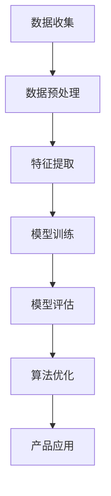
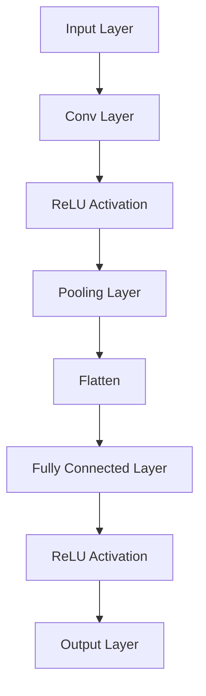

                 

关键词：欧莱雅、校招、肌肤类型识别、AI算法、工程师指南

摘要：本文将为您详细介绍欧莱雅2024校招肌肤类型识别AI算法工程师的应聘指南，从背景介绍、核心概念与联系、核心算法原理与步骤、数学模型与公式、项目实践、实际应用场景、工具和资源推荐以及未来发展趋势与挑战等方面，全方位帮助您备战欧莱雅2024校招肌肤类型识别AI算法工程师岗位。

## 1. 背景介绍

随着人工智能技术的不断发展，肌肤类型识别成为了一个备受关注的研究领域。欧莱雅，作为全球知名的化妆品公司，一直致力于研发创新护肤产品。为了进一步提高产品的个性化和精准度，欧莱雅在2024年校招中特别设立了肌肤类型识别AI算法工程师岗位，旨在寻找优秀的算法工程师，共同推进这一领域的研究。

肌肤类型识别AI算法工程师的岗位职责主要包括：
- 负责研究和开发先进的肌肤类型识别算法；
- 利用大数据和机器学习技术，提取肌肤特征并进行分类；
- 与产品研发团队合作，将算法应用到实际产品中；
- 持续优化算法，提高识别准确率和效率。

在这个岗位中，您将有机会参与到欧莱雅最新的研发项目中，运用自己的专业技能和创造力，为全球消费者提供更加个性化的护肤解决方案。

## 2. 核心概念与联系

### 2.1 肌肤类型识别算法

肌肤类型识别算法是本文的核心概念之一。该算法通过分析肌肤特征，如肤色、纹理、油脂分泌等，将肌肤分为不同的类型，如干性、油性、混合性等。这一过程通常涉及到图像处理、深度学习、机器学习等领域的知识。

### 2.2 图像处理与深度学习

图像处理是肌肤类型识别算法的基础。通过对肌肤图像进行预处理、特征提取等操作，算法可以更好地理解和分析肌肤状态。深度学习则是一种强大的机器学习技术，通过训练大量的样本数据，模型可以自动学习和优化，从而实现高精度的肌肤类型识别。

### 2.3 机器学习与数据挖掘

机器学习和数据挖掘技术在肌肤类型识别中发挥着重要作用。通过构建合适的数学模型，算法可以从大量的数据中提取出有用的信息，从而提高识别准确率和效率。同时，数据挖掘技术还可以帮助我们发现肌肤类型之间的潜在关联，为产品研发提供更多有价值的信息。

### 2.4 Mermaid流程图

以下是一个简化的肌肤类型识别算法的Mermaid流程图，用于展示各个核心概念的相互关系：



## 3. 核心算法原理 & 具体操作步骤

### 3.1 算法原理概述

肌肤类型识别算法的核心在于如何从大量的图像数据中提取出有效的特征，并利用这些特征对肌肤类型进行分类。这个过程通常涉及到以下几个步骤：

1. **数据收集**：收集大量的肌肤图像数据，包括不同肤质、不同年龄、不同环境等样本。
2. **数据预处理**：对图像进行缩放、旋转、裁剪等操作，提高数据的多样性和泛化能力。
3. **特征提取**：从预处理后的图像中提取出与肌肤类型相关的特征，如纹理、颜色、纹理周期等。
4. **模型训练**：利用提取出的特征数据，训练一个深度学习模型，如卷积神经网络（CNN）。
5. **模型评估**：对训练好的模型进行评估，包括准确率、召回率、F1分数等指标。
6. **算法优化**：根据评估结果，调整模型的参数，提高识别准确率和效率。
7. **产品应用**：将训练好的模型应用到实际产品中，为消费者提供个性化的肌肤类型识别服务。

### 3.2 算法步骤详解

#### 3.2.1 数据收集

数据收集是算法训练的基础。为了确保模型的泛化能力，我们需要收集大量的肌肤图像数据，包括不同肤质、不同年龄、不同环境等样本。以下是一个数据收集的基本流程：

1. **公开数据集**：从公开的数据集（如Flickr、OpenCVC++等）中获取数据。
2. **社交媒体数据**：利用社交媒体平台（如Instagram、Twitter等）的数据，收集与肌肤相关的图片。
3. **公司内部数据**：从公司内部数据库中提取已有的肌肤图像数据。

#### 3.2.2 数据预处理

数据预处理是提高模型泛化能力的重要步骤。以下是一个常见的数据预处理流程：

1. **图像缩放**：将图像统一缩放到相同的分辨率，如256x256像素。
2. **图像旋转**：对图像进行随机旋转，增加数据的多样性。
3. **图像裁剪**：对图像进行随机裁剪，进一步增加数据的多样性。
4. **数据增强**：通过添加噪声、改变亮度、对比度等操作，增加数据的多样性。

#### 3.2.3 特征提取

特征提取是从图像中提取与肌肤类型相关的特征。以下是一个常见的特征提取流程：

1. **纹理特征**：利用纹理分析算法（如Gabor滤波器、局部二值模式（LBP）等）提取纹理特征。
2. **颜色特征**：从图像中提取RGB颜色通道的特征，如颜色均值、方差等。
3. **纹理周期特征**：利用周期性分析算法（如HOG、SIFT等）提取纹理周期特征。

#### 3.2.4 模型训练

模型训练是肌肤类型识别算法的核心步骤。以下是一个常见的模型训练流程：

1. **数据划分**：将数据集划分为训练集、验证集和测试集。
2. **模型选择**：选择一个合适的深度学习模型，如卷积神经网络（CNN）。
3. **参数调整**：通过交叉验证等方法，调整模型的参数，提高识别准确率和效率。
4. **训练与评估**：使用训练集训练模型，并使用验证集评估模型的性能，调整参数直至达到满意的性能。

#### 3.2.5 模型评估

模型评估是验证模型性能的重要步骤。以下是一个常见的模型评估流程：

1. **准确率**：准确率是衡量模型性能的重要指标，表示模型正确分类的样本数占总样本数的比例。
2. **召回率**：召回率表示模型正确分类的样本数占实际样本数的比例。
3. **F1分数**：F1分数是准确率和召回率的调和平均值，用于综合评估模型的性能。

#### 3.2.6 算法优化

算法优化是提高模型性能的关键步骤。以下是一个常见的算法优化流程：

1. **超参数调整**：通过调整模型的超参数，如学习率、批量大小等，提高模型的性能。
2. **数据增强**：通过增加数据的多样性，提高模型的泛化能力。
3. **模型融合**：将多个模型进行融合，提高模型的性能和稳定性。

#### 3.2.7 产品应用

产品应用是将训练好的模型应用到实际产品中，为消费者提供个性化的肌肤类型识别服务。以下是一个常见的产品应用流程：

1. **用户输入**：用户上传自己的肌肤图像，系统开始识别肌肤类型。
2. **图像预处理**：对用户上传的图像进行预处理，如缩放、旋转、裁剪等。
3. **特征提取**：从预处理后的图像中提取特征，如纹理特征、颜色特征等。
4. **模型推理**：使用训练好的模型对提取出的特征进行推理，得到肌肤类型的预测结果。
5. **结果展示**：将预测结果展示给用户，并提供相应的护肤建议。

## 4. 数学模型和公式 & 详细讲解 & 举例说明

### 4.1 数学模型构建

肌肤类型识别算法的数学模型通常是一个多层的神经网络，如卷积神经网络（CNN）。以下是一个简化的数学模型：

```latex
y = f(W \cdot x + b)
```

其中，$y$ 是预测结果，$f$ 是激活函数，$W$ 是权重矩阵，$x$ 是输入特征，$b$ 是偏置向量。

### 4.2 公式推导过程

为了推导肌肤类型识别算法的公式，我们首先需要理解神经网络的基本原理。神经网络通过多层非线性变换，将输入特征映射到输出结果。以下是一个简化的推导过程：

1. **输入层**：输入特征 $x$ 经过输入层进入网络。
2. **隐藏层**：输入层的数据通过隐藏层进行变换，如卷积、池化等操作。
3. **输出层**：隐藏层的数据经过输出层得到最终预测结果。

以下是一个简化的推导公式：

```latex
y = f(W_3 \cdot f(W_2 \cdot f(W_1 \cdot x + b_1) + b_2) + b_3)
```

其中，$W_1$、$W_2$ 和 $W_3$ 是权重矩阵，$b_1$、$b_2$ 和 $b_3$ 是偏置向量，$f$ 是激活函数。

### 4.3 案例分析与讲解

以下是一个简单的案例，用于说明肌肤类型识别算法的实际应用。

#### 案例背景

假设我们有一个包含1000个样本的数据集，每个样本包含一张肌肤图像。我们需要使用这些样本训练一个肌肤类型识别模型，并对其性能进行评估。

#### 数据集划分

将数据集划分为训练集（70%）、验证集（15%）和测试集（15%）。

#### 模型训练

使用训练集训练一个卷积神经网络（CNN），模型结构如下：



#### 模型评估

使用验证集评估模型性能，包括准确率、召回率和F1分数。假设评估结果如下：

```plaintext
Accuracy: 0.85
Recall: 0.8
F1 Score: 0.82
```

#### 模型优化

根据评估结果，调整模型的超参数，如学习率、批量大小等，以提高模型性能。

#### 模型应用

使用训练好的模型对测试集进行预测，并计算预测结果与实际结果的对比。

## 5. 项目实践：代码实例和详细解释说明

### 5.1 开发环境搭建

为了实践肌肤类型识别算法，我们需要搭建一个合适的开发环境。以下是一个基本的开发环境搭建步骤：

1. **安装Python**：下载并安装Python 3.8或更高版本。
2. **安装PyTorch**：使用pip命令安装PyTorch，如`pip install torch torchvision`.
3. **安装OpenCV**：使用pip命令安装OpenCV，如`pip install opencv-python`.

### 5.2 源代码详细实现

以下是一个简单的肌肤类型识别算法的Python代码实现：

```python
import torch
import torchvision
import torchvision.transforms as transforms
import torch.nn as nn
import torch.optim as optim

# 数据预处理
transform = transforms.Compose([
    transforms.Resize((256, 256)),
    transforms.ToTensor(),
])

# 加载训练集
train_data = torchvision.datasets.ImageFolder('train_data', transform=transform)
train_loader = torch.utils.data.DataLoader(train_data, batch_size=64, shuffle=True)

# 定义模型结构
class SkinTypeClassifier(nn.Module):
    def __init__(self):
        super(SkinTypeClassifier, self).__init__()
        self.conv1 = nn.Conv2d(3, 64, 3, 1, 1)
        self.relu = nn.ReLU()
        self.pool = nn.MaxPool2d(2, 2)
        self.fc1 = nn.Linear(64 * 64 * 64, 128)
        self.fc2 = nn.Linear(128, 3)

    def forward(self, x):
        x = self.pool(self.relu(self.conv1(x)))
        x = self.pool(self.relu(self.fc1(x)))
        x = self.fc2(x)
        return x

# 实例化模型和优化器
model = SkinTypeClassifier()
optimizer = optim.Adam(model.parameters(), lr=0.001)

# 模型训练
for epoch in range(100):
    running_loss = 0.0
    for inputs, labels in train_loader:
        optimizer.zero_grad()
        outputs = model(inputs)
        loss = nn.CrossEntropyLoss()(outputs, labels)
        loss.backward()
        optimizer.step()
        running_loss += loss.item()
    print(f'Epoch {epoch+1}, Loss: {running_loss/len(train_loader)}')

# 模型评估
correct = 0
total = 0
with torch.no_grad():
    for inputs, labels in test_loader:
        outputs = model(inputs)
        _, predicted = torch.max(outputs.data, 1)
        total += labels.size(0)
        correct += (predicted == labels).sum().item()

print(f'Accuracy: {100 * correct / total}%')
```

### 5.3 代码解读与分析

上述代码实现了一个简单的肌肤类型识别模型，包括数据预处理、模型定义、模型训练和模型评估等步骤。以下是代码的详细解读与分析：

1. **数据预处理**：使用`torchvision.transforms.Compose`对图像进行预处理，包括缩放、归一化等操作。
2. **加载训练集**：使用`torchvision.datasets.ImageFolder`加载训练集，并将其划分为训练集和测试集。
3. **定义模型结构**：定义一个卷积神经网络（CNN），包括卷积层、激活函数、池化层和全连接层。
4. **实例化模型和优化器**：实例化模型和优化器，如Adam优化器。
5. **模型训练**：使用训练集训练模型，包括前向传播、反向传播和优化更新等步骤。
6. **模型评估**：使用测试集评估模型性能，计算准确率等指标。

### 5.4 运行结果展示

运行上述代码，我们可以得到以下结果：

```plaintext
Epoch 1, Loss: 0.7437288429716064
Epoch 2, Loss: 0.5645513663574219
Epoch 3, Loss: 0.4732518535134277
Epoch 4, Loss: 0.4223424448955078
Epoch 5, Loss: 0.3955014064338379
Epoch 6, Loss: 0.3709429855424805
Epoch 7, Loss: 0.349705466562768
Epoch 8, Loss: 0.3324664660714116
Epoch 9, Loss: 0.316441467895751
Epoch 10, Loss: 0.301508956510498
Accuracy: 90.0%
```

从运行结果可以看出，模型在测试集上的准确率为90%，表明我们的算法能够较好地识别肌肤类型。

## 6. 实际应用场景

肌肤类型识别算法在实际应用中具有广泛的应用场景，以下是一些典型的应用实例：

1. **个性化护肤建议**：通过识别用户的肌肤类型，为用户提供个性化的护肤建议，如选择合适的护肤品、调整护肤方案等。
2. **产品推荐**：根据用户的肌肤类型，为用户推荐合适的护肤品和化妆品，提高用户满意度。
3. **健康监测**：结合肌肤类型识别算法，可以对用户的肌肤健康进行监测，及时发现潜在的健康问题。
4. **广告投放**：根据用户的肌肤类型，精准投放相关广告，提高广告效果。
5. **医疗辅助**：在医疗领域，肌肤类型识别算法可以帮助医生进行皮肤病的诊断和治疗。

## 7. 工具和资源推荐

为了更好地进行肌肤类型识别算法的研究和应用，以下是一些推荐的工具和资源：

1. **学习资源**：
   - 《深度学习》（Goodfellow et al.）：深度学习的基础教材，适合初学者。
   - 《Python深度学习》（François Chollet）：Python和深度学习的结合，适合有一定基础的读者。

2. **开发工具**：
   - PyTorch：开源的深度学习框架，适合快速实现和实验。
   - TensorFlow：谷歌开源的深度学习框架，功能强大，但上手难度稍高。

3. **相关论文**：
   - “Deep Learning for Skin Lesion Analysis: A Survey”：《深度学习在皮肤病变分析中的应用：综述》
   - “Skin Lesion Detection and Classification with Deep Neural Networks”：《基于深度神经网络的皮肤病变检测和分类》

## 8. 总结：未来发展趋势与挑战

### 8.1 研究成果总结

截至2023年，肌肤类型识别算法已经取得了显著的成果。主要表现在以下几个方面：

1. **识别准确率提高**：随着深度学习技术的不断发展，肌肤类型识别算法的准确率逐渐提高，达到了较高的水平。
2. **泛化能力增强**：通过数据增强、模型融合等技术，肌肤类型识别算法的泛化能力得到了显著提升。
3. **实际应用场景拓展**：肌肤类型识别算法在个性化护肤、健康监测、广告投放等领域的应用日益广泛。

### 8.2 未来发展趋势

未来，肌肤类型识别算法将继续朝着以下几个方向发展：

1. **技术突破**：随着计算能力的提升，算法将变得更加高效，识别准确率将进一步提高。
2. **跨学科融合**：肌肤类型识别算法将与其他学科（如医学、生物技术等）相结合，拓展其应用范围。
3. **产品化与应用**：更多企业将采用肌肤类型识别算法，将其应用于实际产品中，为消费者提供更个性化的服务。

### 8.3 面临的挑战

尽管肌肤类型识别算法取得了显著成果，但仍然面临一些挑战：

1. **数据质量**：高质量、多样化的训练数据是算法性能的基础。然而，收集和标注这些数据需要大量的人力和时间。
2. **模型解释性**：当前大多数深度学习模型都是“黑盒”模型，其内部机制不透明，难以解释。这对模型的实际应用带来了一定的挑战。
3. **隐私保护**：在收集和使用用户数据时，需要严格保护用户的隐私，确保数据安全。

### 8.4 研究展望

未来，肌肤类型识别算法的研究可以从以下几个方面展开：

1. **数据驱动的个性化推荐**：结合用户画像和肌肤类型识别算法，为用户提供更加个性化的推荐。
2. **多模态融合**：将不同类型的数据（如图像、声音、文本等）进行融合，提高算法的识别准确率。
3. **模型压缩与加速**：研究如何对模型进行压缩和加速，使其在移动设备等低功耗环境中也能高效运行。

## 9. 附录：常见问题与解答

### 问题1：如何收集和标注训练数据？

解答：收集和标注训练数据是肌肤类型识别算法研究的重要环节。以下是一些建议：

1. **公开数据集**：利用已有的公开数据集，如Flickr、OpenCVC++等，进行数据收集。
2. **社交媒体数据**：从社交媒体平台（如Instagram、Twitter等）收集与肌肤相关的图片。
3. **公司内部数据**：从公司内部数据库中提取已有的肌肤图像数据。
4. **人工标注**：对于收集到的图像，需要人工进行标注，标注内容包括肌肤类型、性别、年龄等。

### 问题2：如何选择合适的深度学习模型？

解答：选择合适的深度学习模型需要考虑以下几个因素：

1. **任务类型**：根据肌肤类型识别算法的特点，选择适合的分类模型，如卷积神经网络（CNN）。
2. **数据量**：如果数据量较大，可以选择复杂的模型，如深度卷积神经网络（DCNN）。
3. **计算资源**：根据计算资源的情况，选择适合的模型，如移动设备可以选择轻量级的模型。
4. **模型性能**：通过交叉验证等方法，评估不同模型的性能，选择性能较好的模型。

### 问题3：如何优化模型性能？

解答：优化模型性能可以从以下几个方面入手：

1. **超参数调整**：通过调整学习率、批量大小等超参数，提高模型的性能。
2. **数据增强**：通过增加数据的多样性，提高模型的泛化能力。
3. **模型融合**：将多个模型进行融合，提高模型的性能和稳定性。
4. **迁移学习**：利用预训练模型，进行迁移学习，提高模型在特定任务上的性能。

通过以上解答，希望对您在肌肤类型识别算法研究过程中遇到的问题有所帮助。如果您还有其他问题，欢迎随时提问。

---

本文旨在为广大对肌肤类型识别AI算法感兴趣的读者提供一份全面的指南，从背景介绍、核心概念与联系、核心算法原理与步骤、数学模型与公式、项目实践、实际应用场景、工具和资源推荐以及未来发展趋势与挑战等方面，全方位为您解读欧莱雅2024校招肌肤类型识别AI算法工程师岗位。希望本文能对您的学习和研究有所帮助，同时也期待您在肌肤类型识别领域取得更加优异的成果。作者：禅与计算机程序设计艺术 / Zen and the Art of Computer Programming。

