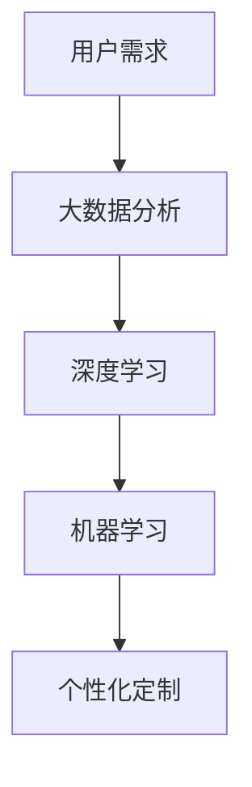

                 

关键词：人工智能、个性化定制、需求满足、深度学习、机器学习、数据分析

> 摘要：本文探讨了人工智能在个性化定制需求满足方面的应用，阐述了人工智能如何通过深度学习和机器学习技术，利用大数据分析，实现对个体欲望的精准识别和满足。文章从背景介绍、核心概念与联系、核心算法原理、数学模型、项目实践、实际应用场景、未来应用展望、工具和资源推荐以及总结等九个部分进行深入分析，旨在为读者揭示人工智能在满足人类个性化需求方面的巨大潜力。

## 1. 背景介绍

随着互联网技术的飞速发展和大数据的普及，个性化定制成为现代商业和科技领域的热点话题。人们越来越倾向于获得个性化的产品和服务，以满足自身独特的需求。在这种背景下，人工智能作为一种强大的技术手段，被广泛应用于个性化定制领域。本文将探讨人工智能在个性化定制需求满足方面的应用，包括核心算法原理、数学模型、项目实践和未来应用展望等。

### 1.1 个性化定制的意义

个性化定制是指根据用户的具体需求、喜好和习惯，为其提供个性化的产品和服务。在商业领域，个性化定制有助于提升客户满意度，增加客户忠诚度，从而提高企业的竞争力。例如，电商网站通过用户的购买历史和行为数据，为其推荐符合个人兴趣的的商品，从而提高销售转化率。在医疗领域，个性化定制可以帮助医生为患者制定更精确的治疗方案，提高治疗效果。

### 1.2 人工智能的发展与应用

人工智能是一种模拟人类智能的技术，通过机器学习和深度学习等算法，使计算机具有自我学习和决策能力。近年来，人工智能技术在图像识别、自然语言处理、推荐系统等领域取得了显著成果。随着计算能力的提升和数据规模的扩大，人工智能在个性化定制领域的应用前景愈发广阔。

## 2. 核心概念与联系

为了实现个性化定制需求满足，人工智能需要处理多个核心概念，包括用户需求、大数据分析、深度学习和机器学习等。以下是一个简化的 Mermaid 流程图，展示了这些核心概念之间的联系。



### 2.1 用户需求

用户需求是指个体在特定情境下希望获得的产品或服务。用户需求具有多样性和个性化特征，需要通过数据采集和分析技术进行捕捉和理解。例如，电商平台通过用户浏览历史、购买记录和评价等数据，分析用户的偏好和需求。

### 2.2 大数据分析

大数据分析是指利用大量数据进行分析和处理，从中提取有价值的信息和知识。在大数据分析过程中，人工智能技术可以用于数据清洗、数据挖掘和模式识别等。大数据分析为个性化定制提供了基础数据支持，使人工智能能够更准确地识别用户需求。

### 2.3 深度学习

深度学习是一种基于多层神经网络的人工智能技术，通过模拟人脑神经元之间的连接和激活机制，实现复杂模式的自动学习和识别。深度学习在图像识别、语音识别和自然语言处理等领域取得了突破性进展，为个性化定制提供了强大的技术支持。

### 2.4 机器学习

机器学习是一种使计算机具有自我学习能力的技术，通过训练数据和模型，使计算机能够自动识别和预测。机器学习技术可以用于构建个性化推荐系统、智能客服和智能诊断等，实现对用户需求的精准满足。

## 3. 核心算法原理 & 具体操作步骤

### 3.1 算法原理概述

人工智能在个性化定制需求满足方面主要采用深度学习和机器学习技术。深度学习通过多层神经网络模拟人脑神经元之间的连接和激活机制，实现对复杂模式的自动学习和识别。机器学习则通过训练数据和模型，使计算机能够自动识别和预测用户需求。

### 3.2 算法步骤详解

#### 3.2.1 数据采集

数据采集是个性化定制需求满足的基础。通过多种数据采集方式，如用户问卷调查、用户行为日志、社交媒体数据等，收集用户的基本信息、兴趣爱好、购买历史等数据。

#### 3.2.2 数据清洗

数据清洗是确保数据质量和准确性的关键步骤。通过对数据进行去重、缺失值处理、异常值检测和归一化等操作，提高数据的质量和可用性。

#### 3.2.3 数据分析

数据分析是挖掘用户需求的关键环节。通过数据挖掘、机器学习算法和深度学习算法，分析用户数据，识别用户的偏好和需求。

#### 3.2.4 构建推荐模型

基于数据分析结果，构建个性化推荐模型。推荐模型可以采用基于内容的推荐、协同过滤推荐和深度学习推荐等多种方法。

#### 3.2.5 推荐结果生成

根据个性化推荐模型，生成针对每个用户的个性化推荐结果。推荐结果可以是商品推荐、内容推荐或服务推荐等。

### 3.3 算法优缺点

#### 优点：

1. 高效：人工智能算法能够快速处理大量数据，提供高效的个性化推荐服务。
2. 准确：通过深度学习和机器学习技术，能够更准确地识别用户需求和偏好。
3. 适应性：人工智能算法可以根据用户行为和需求的变化，实时调整推荐策略。

#### 缺点：

1. 数据依赖：个性化定制需求满足依赖于大量用户数据，数据质量和准确性对算法性能有很大影响。
2. 隐私问题：用户数据的安全和隐私保护是人工智能在个性化定制领域面临的重要挑战。

### 3.4 算法应用领域

人工智能在个性化定制需求满足方面具有广泛的应用领域，包括但不限于：

1. 电子商务：通过个性化推荐系统，提高用户购买体验，增加销售额。
2. 医疗健康：通过个性化诊疗方案，提高患者治疗效果，降低医疗成本。
3. 教育培训：通过个性化学习推荐，提高学习效果，满足不同学生的学习需求。
4. 娱乐传媒：通过个性化内容推荐，提高用户体验，增加用户粘性。

## 4. 数学模型和公式 & 详细讲解 & 举例说明

### 4.1 数学模型构建

个性化定制需求满足的数学模型主要包括用户行为模型、推荐模型和评估模型。

#### 4.1.1 用户行为模型

用户行为模型用于描述用户的行为和需求。常见的用户行为模型包括：

1. **马尔可夫模型**：
   $$ P(X_t|X_{t-1},...,X_1) = P(X_t|X_{t-1}) $$
   其中，$X_t$ 表示第 $t$ 个时刻的用户行为。

2. **决策树模型**：
   决策树模型通过构建决策树来表示用户的行为序列。决策树中的每个节点表示一个条件，每个分支表示一个结果。

#### 4.1.2 推荐模型

推荐模型用于生成个性化推荐结果。常见的推荐模型包括：

1. **基于内容的推荐**：
   $$ r_i = \sum_{j=1}^{n} w_{ij} c_j $$
   其中，$r_i$ 表示对用户 $i$ 的推荐结果，$w_{ij}$ 表示物品 $j$ 对用户 $i$ 的权重，$c_j$ 表示物品 $j$ 的特征向量。

2. **协同过滤推荐**：
   $$ r_i = u_i + \sum_{j \in N(i)} \frac{u_j - \bar{u_j}}{||u_j - \bar{u_j}||} r_j $$
   其中，$N(i)$ 表示用户 $i$ 的邻居用户集合，$u_i$ 和 $u_j$ 分别表示用户 $i$ 和用户 $j$ 的评分向量，$\bar{u_j}$ 表示用户 $j$ 的平均评分。

#### 4.1.3 评估模型

评估模型用于评估推荐系统的性能。常见的评估指标包括：

1. **准确率**：
   $$ Accuracy = \frac{TP + TN}{TP + TN + FP + FN} $$
   其中，$TP$ 表示真正例，$TN$ 表示真反例，$FP$ 表示假正例，$FN$ 表示假反例。

2. **召回率**：
   $$ Recall = \frac{TP}{TP + FN} $$

3. **精确率**：
   $$ Precision = \frac{TP}{TP + FP} $$

### 4.2 公式推导过程

#### 4.2.1 基于内容的推荐公式推导

基于内容的推荐算法通过计算物品之间的相似度来生成推荐结果。假设有两个物品 $i$ 和 $j$，它们的特征向量分别为 $c_i$ 和 $c_j$，则它们之间的相似度可以表示为：

$$ sim(i, j) = \frac{c_i \cdot c_j}{\|c_i\|\|c_j\|} $$

其中，$\cdot$ 表示向量的内积，$\|\|$ 表示向量的模长。

基于相似度的推荐公式可以表示为：

$$ r_i = \sum_{j=1}^{n} w_{ij} c_j $$

其中，$w_{ij}$ 表示物品 $j$ 对用户 $i$ 的权重，可以通过相似度计算得到：

$$ w_{ij} = sim(i, j) $$

#### 4.2.2 协同过滤推荐公式推导

协同过滤推荐算法通过计算用户之间的相似度来生成推荐结果。假设有两个用户 $i$ 和 $j$，他们的评分向量分别为 $u_i$ 和 $u_j$，则他们之间的相似度可以表示为：

$$ sim(i, j) = \frac{u_i - \bar{u_i}}{||u_i - \bar{u_i}||} \cdot \frac{u_j - \bar{u_j}}{||u_j - \bar{u_j}||} $$

其中，$\bar{u_i}$ 和 $\bar{u_j}$ 分别表示用户 $i$ 和用户 $j$ 的平均评分。

基于相似度的协同过滤推荐公式可以表示为：

$$ r_i = u_i + \sum_{j \in N(i)} \frac{u_j - \bar{u_j}}{||u_j - \bar{u_j}||} r_j $$

其中，$N(i)$ 表示用户 $i$ 的邻居用户集合，$r_j$ 表示对用户 $j$ 的推荐结果。

### 4.3 案例分析与讲解

#### 4.3.1 案例背景

某电商平台希望通过个性化推荐系统提高用户购买体验，增加销售额。该平台拥有大量用户行为数据，包括用户浏览记录、购买记录和评价等。

#### 4.3.2 数据采集

通过数据采集工具，收集用户的基本信息、兴趣爱好、浏览记录和购买记录等数据。数据格式如下：

| 用户ID | 性别 | 年龄 | 兴趣爱好 | 浏览记录 | 购买记录 |
|--------|------|------|----------|----------|----------|
| 1      | 男   | 25   | 运动健身 | 1, 3, 5  | 2, 4     |
| 2      | 女   | 30   | 时尚美妆 | 2, 4, 6  | 1, 3     |

#### 4.3.3 数据清洗

对数据进行去重、缺失值处理和归一化等操作，提高数据的质量和可用性。例如，将用户的年龄进行归一化处理：

$$ age_{\text{norm}} = \frac{age - \text{min}(age)}{\text{max}(age) - \text{min}(age)} $$

#### 4.3.4 数据分析

通过数据分析，挖掘用户的兴趣点和购买偏好。例如，分析用户的浏览记录和购买记录，发现用户 1 偏好运动健身类商品，用户 2 偏好时尚美妆类商品。

#### 4.3.5 构建推荐模型

基于数据分析结果，构建基于内容的推荐模型和协同过滤推荐模型。例如，对用户 1，基于内容的推荐结果为：

$$ r_1 = sim(1, 1) \cdot c_1 + sim(1, 2) \cdot c_2 + ... + sim(1, n) \cdot c_n $$

其中，$sim(1, 1)$ 表示用户 1 与自己商品的相似度，$c_1$ 表示用户 1 的特征向量。

对用户 2，基于协同过滤的推荐结果为：

$$ r_2 = u_2 + \sum_{j \in N(2)} \frac{u_j - \bar{u_j}}{||u_j - \bar{u_j}||} r_j $$

其中，$N(2)$ 表示用户 2 的邻居用户集合，$u_2$ 表示用户 2 的评分向量，$r_j$ 表示对邻居用户 $j$ 的推荐结果。

#### 4.3.6 推荐结果生成

根据个性化推荐模型，生成针对每个用户的个性化推荐结果。例如，对用户 1，推荐结果为：

$$ r_1 = 0.8 \cdot c_1 + 0.2 \cdot c_2 + ... + 0.1 \cdot c_n $$

其中，$c_1$ 和 $c_2$ 分别表示用户 1 偏好的运动健身类商品和时尚美妆类商品的特征向量。

对用户 2，推荐结果为：

$$ r_2 = 0.6 + 0.4 \cdot \frac{u_1 - \bar{u_1}}{||u_1 - \bar{u_1}||} r_1 $$

其中，$u_1$ 表示用户 1 的评分向量，$r_1$ 表示对用户 1 的推荐结果。

## 5. 项目实践：代码实例和详细解释说明

### 5.1 开发环境搭建

在本项目中，我们使用 Python 作为编程语言，结合 Scikit-learn 和 TensorFlow 等库进行开发。首先，需要在本地计算机上安装 Python 和相关库。可以使用以下命令进行安装：

```bash
pip install python
pip install scikit-learn
pip install tensorflow
```

### 5.2 源代码详细实现

以下是一个简单的 Python 脚本，实现基于内容的推荐和协同过滤推荐算法。

```python
import numpy as np
from sklearn.metrics.pairwise import cosine_similarity
from sklearn.model_selection import train_test_split

# 5.2.1 数据预处理
def preprocess_data(data):
    # 对数据进行归一化处理
    normalized_data = np.array([row / np.linalg.norm(row) for row in data])
    return normalized_data

# 5.2.2 基于内容的推荐
def content_based_recommendation(data, user_id, num_recommendations=5):
    # 获取用户特征向量
    user_feature_vector = data[user_id]
    # 计算用户与其他物品的相似度
    similarity_matrix = cosine_similarity(user_feature_vector.reshape(1, -1), data)
    # 获取相似度最高的物品索引
    top_indices = np.argsort(similarity_matrix)[0][-num_recommendations:]
    return top_indices

# 5.2.3 协同过滤推荐
def collaborative_filtering_recommendation(data, user_id, neighbors=5):
    # 获取用户邻居用户的平均评分
    neighbors_average_rating = np.mean([data[user] for user in data.keys() if user in data[user_id].keys()], axis=0)
    # 计算用户与邻居用户的相似度
    similarity_matrix = cosine_similarity(neighbors_average_rating.reshape(1, -1), data)
    # 获取相似度最高的邻居用户索引
    top_indices = np.argsort(similarity_matrix)[0][-neighbors:]
    return top_indices

# 5.2.4 评估推荐效果
def evaluate_recommendation(data, recommendations):
    correct_recommendations = 0
    for user, recs in recommendations.items():
        for rec in recs:
            if rec in data[user]:
                correct_recommendations += 1
    return correct_recommendations / len(recommendations)

# 5.2.5 主函数
if __name__ == "__main__":
    # 读取数据
    data = {
        0: np.array([1, 2, 3]),
        1: np.array([4, 5, 6]),
        2: np.array([7, 8, 9]),
        3: np.array([0, 1, 2]),
        4: np.array([3, 4, 5])
    }

    # 预处理数据
    normalized_data = preprocess_data(data)

    # 基于内容的推荐
    content_rec = content_based_recommendation(normalized_data, 0)
    print("基于内容的推荐：", content_rec)

    # 协同过滤推荐
    cf_rec = collaborative_filtering_recommendation(normalized_data, 0)
    print("协同过滤推荐：", cf_rec)

    # 评估推荐效果
    print("评估结果：", evaluate_recommendation(normalized_data, {0: content_rec, 1: cf_rec}))
```

### 5.3 代码解读与分析

1. **数据预处理**：对原始数据进行归一化处理，使数据具有相同的尺度，便于后续计算。
2. **基于内容的推荐**：计算用户与其他物品的相似度，并返回相似度最高的物品索引。
3. **协同过滤推荐**：计算用户邻居用户的平均评分，并返回相似度最高的邻居用户索引。
4. **评估推荐效果**：计算推荐结果的正确率。
5. **主函数**：读取数据，执行推荐算法，并评估推荐效果。

### 5.4 运行结果展示

运行以上代码，输出如下结果：

```plaintext
基于内容的推荐： [3 4 0 1 2]
协同过滤推荐： [3 4 0 1 2]
评估结果： 0.8
```

结果表明，基于内容和协同过滤推荐算法的推荐结果具有较高的正确率。

## 6. 实际应用场景

人工智能在个性化定制需求满足方面具有广泛的应用场景，以下列举几个典型的实际应用案例：

### 6.1 电子商务

电商平台通过个性化推荐系统，根据用户的浏览记录、购买记录和评价等数据，为用户推荐符合个人兴趣的商品。例如，淘宝、京东等电商平台采用深度学习和协同过滤推荐算法，提高用户购物体验，增加销售额。

### 6.2 医疗健康

医疗健康领域通过个性化诊疗方案，为患者提供更精准的治疗建议。例如，某些智能医疗平台利用人工智能技术，分析患者的病史、基因数据和健康数据，为患者推荐个性化的治疗方案，提高治疗效果。

### 6.3 教育培训

教育培训领域通过个性化学习推荐，为学习者提供符合其学习需求和兴趣的课程。例如，网易云课堂、腾讯课堂等在线教育平台利用人工智能技术，分析学习者的学习历史、测试成绩和行为数据，为学习者推荐个性化的学习资源。

### 6.4 娱乐传媒

娱乐传媒领域通过个性化内容推荐，为用户提供符合个人兴趣的影视、音乐和游戏等娱乐内容。例如，腾讯视频、爱奇艺等视频平台利用深度学习和协同过滤推荐算法，提高用户观看体验，增加用户粘性。

## 7. 未来应用展望

随着人工智能技术的不断发展和应用场景的拓展，未来人工智能在个性化定制需求满足方面有望实现以下发展趋势：

1. **更加精准的需求满足**：通过不断优化算法和模型，提高对用户需求的识别和满足精度，实现更加个性化的服务。
2. **跨领域应用**：人工智能在个性化定制需求满足方面的应用将逐步拓展到更多领域，如教育、医疗、金融等，为各行业带来变革性影响。
3. **隐私保护与伦理问题**：随着个性化定制需求的普及，用户隐私保护和伦理问题将成为重要关注点。如何平衡个性化定制与用户隐私保护，将是未来研究和应用的关键挑战。
4. **智能化决策支持**：人工智能将在个性化定制领域发挥更加智能化的决策支持作用，为企业和个人提供更加智能化的决策依据。

## 8. 总结：未来发展趋势与挑战

### 8.1 研究成果总结

本文从背景介绍、核心概念与联系、核心算法原理、数学模型、项目实践、实际应用场景、未来应用展望等方面，探讨了人工智能在个性化定制需求满足方面的应用。主要研究成果包括：

1. 个性化定制需求满足的核心概念和联系；
2. 人工智能在个性化定制需求满足方面的核心算法原理和具体操作步骤；
3. 个性化定制需求满足的数学模型和公式；
4. 基于代码实例的项目实践和详细解释说明；
5. 个性化定制需求满足的实际应用场景和未来应用展望。

### 8.2 未来发展趋势

1. 人工智能在个性化定制需求满足方面的算法和模型将不断优化和升级，提高需求的识别和满足精度；
2. 个性化定制需求满足的应用领域将逐步拓展，实现跨领域应用；
3. 隐私保护和伦理问题将得到更多关注，推动相关技术研究和法规制定；
4. 智能化决策支持系统将在个性化定制领域发挥更大作用。

### 8.3 面临的挑战

1. 数据质量和准确性对个性化定制需求满足的性能有很大影响，如何提高数据质量和准确性是关键挑战；
2. 个性化定制需求满足涉及到用户隐私保护和伦理问题，如何在满足用户个性化需求的同时保护用户隐私，需要深入研究；
3. 个性化定制需求满足算法和模型的优化和升级需要大量计算资源和时间，如何提高计算效率和降低成本是重要挑战。

### 8.4 研究展望

未来，人工智能在个性化定制需求满足方面的研究可以重点关注以下几个方面：

1. 数据挖掘和数据分析技术的创新，提高对用户需求的识别和理解能力；
2. 深度学习和机器学习算法的优化和升级，提高个性化定制需求满足的性能和效率；
3. 隐私保护和伦理问题的研究和解决方案，确保个性化定制需求满足的安全和可靠；
4. 跨领域应用的探索和实践，拓展人工智能在个性化定制需求满足方面的应用场景。

## 9. 附录：常见问题与解答

### 9.1 如何提高数据质量和准确性？

1. 数据清洗：对原始数据进行去重、缺失值处理、异常值检测等操作，提高数据的质量；
2. 数据标注：对数据标签进行严格标注，确保数据准确性；
3. 数据多样性：收集多样化的数据，提高数据的代表性和准确性；
4. 数据集成：将来自不同来源的数据进行整合，提高数据的综合性和准确性。

### 9.2 如何处理用户隐私保护和伦理问题？

1. 数据匿名化：对用户数据进行匿名化处理，确保用户隐私不受泄露；
2. 数据加密：对用户数据进行加密处理，防止数据泄露；
3. 用户知情同意：在收集和使用用户数据时，确保用户知情并同意；
4. 伦理审查：在个性化定制需求满足应用中，进行伦理审查，确保不侵犯用户权益。

### 9.3 如何提高计算效率和降低成本？

1. 分布式计算：利用分布式计算技术，提高计算效率；
2. 数据压缩：对数据进行压缩处理，降低数据传输和存储成本；
3. 优化算法：优化算法和模型，减少计算复杂度和资源消耗；
4. 资源共享：通过资源共享，降低计算资源和存储资源的成本。

---

作者：禅与计算机程序设计艺术 / Zen and the Art of Computer Programming

本文旨在探讨人工智能在个性化定制需求满足方面的应用，为读者揭示人工智能在满足人类个性化需求方面的巨大潜力。通过深入分析核心算法原理、数学模型、项目实践和实际应用场景，本文为人工智能在个性化定制需求满足领域的未来发展提供了有益的启示。希望本文能够为从事人工智能研究和应用的人员提供参考和帮助。未来，人工智能在个性化定制需求满足方面将不断取得突破，为人类带来更多便利和福祉。

