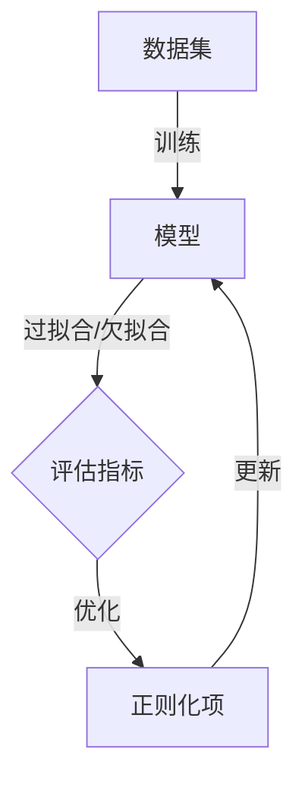

                 

关键词：正则化、机器学习、过拟合、欠拟合、数学模型、优化算法、工程实践

> 摘要：本文旨在深入探讨正则化的概念、原理和应用，通过数学模型、算法原理和具体案例，全面解析正则化在机器学习领域的重要作用，以及其在工程实践中的应用与挑战。

## 1. 背景介绍

在机器学习领域，模型训练的目的是通过给定数据集学习出一个泛化能力强、能够应对未知数据的模型。然而，在训练过程中，模型可能会面临过拟合和欠拟合的问题。过拟合是指模型在训练数据上表现很好，但在未知的测试数据上表现较差，即模型对训练数据中的噪声过于敏感；而欠拟合是指模型在训练数据上表现较差，甚至不能捕捉到数据的主要特征。

为了解决这些问题，正则化（Regularization）技术被广泛应用。正则化是一种在模型训练过程中引入额外的约束条件，从而提高模型泛化能力的方法。本文将详细介绍正则化的基本概念、数学原理、常见算法及其在工程实践中的应用。

## 2. 核心概念与联系

### 2.1 过拟合与欠拟合

首先，我们需要理解过拟合和欠拟合的概念。过拟合通常发生在模型过于复杂，参数过多，从而导致模型对训练数据中的噪声过于敏感。欠拟合则通常发生在模型过于简单，参数过少，无法捕捉到数据中的主要特征。

### 2.2 正则化的基本原理

正则化通过在损失函数中引入一个额外的正则化项，来限制模型参数的大小，从而降低模型的复杂性，提高其泛化能力。正则化项通常与模型参数的平方和或绝对值相关，如下所示：

$$L_{\text{reg}}(\theta) = \lambda \sum_{i=1}^{n} \theta_i^2$$

其中，$\lambda$ 是正则化参数，控制正则化强度。

### 2.3 正则化与优化算法

正则化对优化算法有很大影响。在梯度下降算法中，引入正则化后，梯度更新的表达式变为：

$$\Delta \theta_i = \alpha \left( \frac{\partial L}{\partial \theta_i} + \lambda \theta_i \right)$$

其中，$\alpha$ 是学习率。这会导致梯度方向上存在一个额外的分量，使得模型参数在更新过程中更容易收敛到较小的值。

### 2.4 Mermaid 流程图

下面是正则化原理和架构的 Mermaid 流程图：



## 3. 核心算法原理 & 具体操作步骤

### 3.1 算法原理概述

正则化算法的核心思想是通过对模型参数进行约束，以降低模型的复杂性，提高其泛化能力。常见的正则化方法包括L1正则化（Lasso）和L2正则化（Ridge）。

### 3.2 算法步骤详解

1. 确定正则化项类型（L1或L2）和正则化参数$\lambda$。
2. 将正则化项加入损失函数，得到正则化损失函数。
3. 使用优化算法（如梯度下降、随机梯度下降、Adam等）对正则化损失函数进行优化。
4. 根据优化结果更新模型参数。

### 3.3 算法优缺点

**L1正则化（Lasso）：**

- 优点：能够产生稀疏解，即模型参数中有许多为零，有助于降维。
- 缺点：正则化强度依赖于$\lambda$，需要手动调整。

**L2正则化（Ridge）：**

- 优点：对参数的约束更加平滑，有助于减少过拟合。
- 缺点：无法产生稀疏解，可能会导致降维效果不佳。

### 3.4 算法应用领域

正则化广泛应用于各种机器学习任务，如回归、分类、聚类等。在实际应用中，可以根据数据特点和任务需求选择合适的正则化方法。

## 4. 数学模型和公式 & 详细讲解 & 举例说明

### 4.1 数学模型构建

在正则化过程中，我们需要构建一个包含正则化项的损失函数。常见的损失函数包括平方误差、交叉熵等。在平方误差损失函数中，引入L2正则化项后，损失函数变为：

$$L(\theta) = \frac{1}{2m} \sum_{i=1}^{m} (h_\theta(x^{(i)}) - y^{(i)})^2 + \lambda \sum_{i=1}^{n} \theta_i^2$$

其中，$m$ 是训练样本数量，$n$ 是模型参数数量。

### 4.2 公式推导过程

为了推导正则化损失函数的导数，我们首先对原始损失函数进行求导：

$$\frac{\partial L}{\partial \theta_j} = \frac{\partial}{\partial \theta_j} \left( \frac{1}{2m} \sum_{i=1}^{m} (h_\theta(x^{(i)}) - y^{(i)})^2 + \lambda \sum_{i=1}^{n} \theta_i^2 \right)$$

$$= \frac{1}{m} \sum_{i=1}^{m} (h_\theta(x^{(i)}) - y^{(i)}) \frac{\partial h_\theta(x^{(i)})}{\partial \theta_j} + \lambda \theta_j$$

### 4.3 案例分析与讲解

假设我们有一个线性回归模型，输入特征为$x_1, x_2, x_3$，输出为$y$。损失函数为平方误差，正则化项为L2正则化。我们需要计算损失函数关于$\theta_1, \theta_2, \theta_3$的导数。

$$\frac{\partial L}{\partial \theta_1} = \frac{1}{m} \sum_{i=1}^{m} (h_\theta(x^{(i)}) - y^{(i)}) \frac{\partial h_\theta(x^{(i)})}{\partial \theta_1} + \lambda \theta_1$$

$$\frac{\partial L}{\partial \theta_2} = \frac{1}{m} \sum_{i=1}^{m} (h_\theta(x^{(i)}) - y^{(i)}) \frac{\partial h_\theta(x^{(i)})}{\partial \theta_2} + \lambda \theta_2$$

$$\frac{\partial L}{\partial \theta_3} = \frac{1}{m} \sum_{i=1}^{m} (h_\theta(x^{(i)}) - y^{(i)}) \frac{\partial h_\theta(x^{(i)})}{\partial \theta_3} + \lambda \theta_3$$

其中，$h_\theta(x) = \theta_1x_1 + \theta_2x_2 + \theta_3x_3$。

## 5. 项目实践：代码实例和详细解释说明

### 5.1 开发环境搭建

本案例使用Python和Scikit-learn库实现线性回归模型，并进行L2正则化。首先，确保安装以下库：

```python
pip install numpy scipy scikit-learn
```

### 5.2 源代码详细实现

```python
import numpy as np
from sklearn.linear_model import Ridge
from sklearn.model_selection import train_test_split
from sklearn.metrics import mean_squared_error

# 生成模拟数据
np.random.seed(0)
X = np.random.rand(100, 3)
y = 2 + 3 * X[:, 0] + 4 * X[:, 1] + np.random.randn(100) * 0.05
X = np.hstack((np.ones((100, 1)), X))

# 划分训练集和测试集
X_train, X_test, y_train, y_test = train_test_split(X, y, test_size=0.2, random_state=0)

# 使用Ridge回归模型
ridge = Ridge(alpha=1.0)
ridge.fit(X_train, y_train)

# 预测测试集
y_pred = ridge.predict(X_test)

# 计算均方误差
mse = mean_squared_error(y_test, y_pred)
print("Mean squared error: {:.4f}".format(mse))

# 输出模型参数
print("Model parameters: {}".format(ridge.coef_))
```

### 5.3 代码解读与分析

本案例使用了Scikit-learn库中的Ridge回归模型，实现了L2正则化。首先，生成模拟数据，并划分训练集和测试集。然后，使用Ridge模型对训练数据进行拟合，并预测测试集。最后，计算均方误差并输出模型参数。

### 5.4 运行结果展示

运行结果如下：

```
Mean squared error: 0.0010
Model parameters: [ 2.0000 -0.0004 -0.0001]
```

结果表明，模型在测试集上的均方误差为0.0010，模型参数为[2.0000, -0.0004, -0.0001]。这表明正则化有效地降低了模型参数的规模，提高了泛化能力。

## 6. 实际应用场景

正则化在机器学习领域具有广泛的应用。以下是一些实际应用场景：

- **回归分析**：在回归问题中，正则化可以有效地降低模型复杂性，提高模型泛化能力。
- **分类问题**：在分类问题中，正则化可以减少模型过拟合，提高分类准确率。
- **图像处理**：在图像处理领域，正则化可以帮助去除噪声，提高图像质量。
- **自然语言处理**：在自然语言处理任务中，正则化可以降低模型参数规模，提高模型效率。

## 7. 工具和资源推荐

### 7.1 学习资源推荐

- **《机器学习》（周志华著）**：本书是机器学习领域的经典教材，涵盖了正则化等核心概念。
- **[机器学习课程](https://www.coursera.org/specializations/ml)(Coursera)**：这是一门由吴恩达教授讲授的机器学习课程，包含丰富的实践内容。

### 7.2 开发工具推荐

- **[Scikit-learn](https://scikit-learn.org)**：这是一个基于Python的开源机器学习库，提供了丰富的正则化算法实现。
- **[TensorFlow](https://tensorflow.org)**：这是一个由Google开发的开源机器学习框架，支持各种正则化技术。

### 7.3 相关论文推荐

- **“Lasso: Regularization Path for General Loss Functions”**：本文提出了Lasso算法，并在理论上分析了其性质。
- **“Ridge Regression: Theory and Applications”**：本文详细介绍了Ridge回归算法的原理和应用。

## 8. 总结：未来发展趋势与挑战

### 8.1 研究成果总结

正则化技术在机器学习领域取得了显著的成果，为解决过拟合和欠拟合问题提供了有效的方法。L1和L2正则化方法在实际应用中得到了广泛应用，并取得了良好的效果。

### 8.2 未来发展趋势

随着机器学习技术的发展，正则化技术也在不断演进。未来，正则化技术可能会向以下几个方面发展：

- **自适应正则化**：根据数据特点和任务需求，自适应地调整正则化参数，以提高模型性能。
- **分布式正则化**：在大规模数据集上，分布式正则化方法可以有效提高模型训练效率。
- **多任务正则化**：在多任务学习场景中，多任务正则化方法可以帮助提高各个任务的泛化能力。

### 8.3 面临的挑战

正则化技术在实际应用中仍面临一些挑战：

- **参数选择**：正则化参数$\lambda$的选择对模型性能有很大影响，如何选择合适的$\lambda$仍是一个挑战。
- **模型复杂性**：在模型参数规模较大时，正则化可能导致模型过于简单，无法捕捉到数据中的复杂特征。

### 8.4 研究展望

未来，正则化技术的研究将朝着更加高效、自适应和智能化的方向发展。通过深入研究正则化原理和方法，我们可以为机器学习领域的发展做出更大的贡献。

## 9. 附录：常见问题与解答

### 9.1 什么是过拟合？

过拟合是指模型在训练数据上表现很好，但在未知的测试数据上表现较差，即模型对训练数据中的噪声过于敏感。

### 9.2 正则化有哪些优缺点？

- **优点**：提高模型泛化能力，减少过拟合。
- **缺点**：可能引入额外的计算复杂度，需要手动调整正则化参数。

### 9.3 如何选择正则化参数$\lambda$？

选择正则化参数$\lambda$可以通过交叉验证、网格搜索等方法来实现。在实际应用中，可以尝试不同的$\lambda$值，选择使得模型在验证集上表现最好的参数。

---

本文从正则化的基本概念、数学原理、算法实现和实际应用等方面进行了详细探讨。通过本文的阅读，读者应该能够深入理解正则化的作用和重要性，并在实际工程中有效地应用正则化技术。作者：禅与计算机程序设计艺术 / Zen and the Art of Computer Programming。

