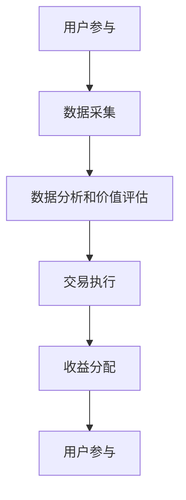

                 

## 摘要 Summary

随着元宇宙（Metaverse）的兴起，虚拟世界中的信息交易成为新的热点。本文旨在探讨元宇宙时代下的注意力市场，分析其核心概念、运作机制、以及潜在的应用场景。通过对注意力市场的深入探讨，我们希望为读者提供对未来信息交易趋势的洞察，以及在此背景下开发者应如何应对的思考。

本文将分为以下几个部分：

1. **背景介绍**：介绍元宇宙的兴起及其对信息交易的影响。
2. **核心概念与联系**：详细阐述注意力市场的基本原理及其与相关概念的关系。
3. **核心算法原理 & 具体操作步骤**：探讨注意力市场的核心算法原理，并提供具体操作步骤。
4. **数学模型和公式 & 详细讲解 & 举例说明**：讲解注意力市场中的数学模型和公式，并通过案例进行说明。
5. **项目实践：代码实例和详细解释说明**：通过实际代码实例展示注意力市场的应用。
6. **实际应用场景**：探讨注意力市场在不同领域的应用。
7. **未来应用展望**：分析注意力市场在元宇宙时代的发展趋势和前景。
8. **工具和资源推荐**：推荐相关的学习资源和开发工具。
9. **总结：未来发展趋势与挑战**：总结研究成果，探讨未来趋势和面临的挑战。

通过本文的阅读，读者将能够全面了解注意力市场在元宇宙时代的重要性，以及其背后的技术原理和实际应用。

## 1. 背景介绍 Background

### 元宇宙的兴起

元宇宙（Metaverse）作为一个虚拟的、三维的、持续存在的虚拟世界，正在迅速崛起。它不仅是虚拟现实（VR）和增强现实（AR）的扩展，更是一个集成了社交、娱乐、教育、商业等多种功能的数字化空间。元宇宙的核心在于其高度的沉浸性和互动性，用户可以在其中自由地探索、交流、创造和消费。

随着技术的不断进步，特别是5G、云计算、人工智能、区块链等技术的融合，元宇宙的发展呈现出爆发式的趋势。越来越多的企业和机构投入其中，开发各种应用和服务，从而推动了元宇宙的生态系统逐步完善。

### 信息交易在元宇宙中的重要性

在元宇宙中，信息交易成为一个至关重要的环节。传统互联网中的信息交换主要是基于数据的传输和共享，而在元宇宙中，信息的价值被赋予了新的含义。用户在元宇宙中的活动，如浏览内容、参与社交互动、购买虚拟商品等，都会产生大量的注意力数据。

这些注意力数据不仅反映了用户的兴趣和偏好，还蕴含着巨大的商业价值。例如，通过分析用户的注意力数据，企业可以更精准地推送广告、优化产品设计和营销策略。此外，注意力市场还能为创作者提供新的收益模式，使他们能够直接从用户的参与和关注中获得回报。

### 元宇宙对信息交易的影响

元宇宙的兴起对信息交易产生了深远的影响：

1. **数据量的爆炸性增长**：在元宇宙中，用户的每一次互动都会产生大量的数据，这些数据为信息交易提供了丰富的素材。
2. **价值重塑**：在元宇宙中，信息不再仅仅是一种传播的载体，而是具有实际价值的商品。这种价值重塑为信息交易带来了新的机遇。
3. **隐私和安全问题**：随着数据量的增加和交易活动的频繁，隐私和安全问题变得尤为重要。如何在保障用户隐私的前提下进行有效的信息交易，是元宇宙面临的一个重要挑战。
4. **监管和规范**：随着信息交易规模的扩大，监管和规范的需求也越来越强烈。如何建立合理的监管框架，确保信息交易的公平、透明和安全，是元宇宙发展的重要课题。

综上所述，元宇宙的兴起为信息交易带来了新的机遇和挑战。了解和把握这些变化，对于企业和个人在元宇宙时代取得成功具有重要意义。

## 2. 核心概念与联系 Core Concepts and Relationships

### 注意力市场的定义

注意力市场是指一个虚拟市场，其中用户通过关注、点赞、评论等行为，对内容创作者和广告主进行价值交换的平台。在注意力市场中，用户的注意力成为了一种可交易的商品，其价值由市场的供求关系决定。

### 注意力市场的运作机制

注意力市场的运作机制主要包括以下几个环节：

1. **用户参与**：用户在元宇宙中浏览内容、参与互动，从而产生注意力数据。
2. **数据采集**：平台通过技术手段采集用户的注意力数据，包括浏览时间、互动频率、兴趣偏好等。
3. **数据分析和价值评估**：平台对采集到的注意力数据进行处理和分析，评估其价值。例如，通过分析用户的浏览行为，可以判断其对某些内容的兴趣程度，从而对注意力数据定价。
4. **交易执行**：平台根据用户的价值评估，为用户和内容创作者或广告主之间提供交易服务。用户可以通过支付虚拟货币或真实货币，获取关注、点赞等行为。
5. **收益分配**：平台将交易收入按一定比例分配给内容创作者和广告主，确保交易的公平性和透明性。

### 注意力市场与其他相关概念的关系

注意力市场与多个相关概念密切相关，包括：

1. **虚拟货币**：虚拟货币是注意力市场中的重要交易媒介，如比特币、以太坊等。通过虚拟货币，用户可以方便地进行注意力交易。
2. **区块链技术**：区块链技术提供了去中心化的数据存储和交易记录，确保注意力市场的透明性和安全性。通过区块链，用户和内容创作者的交易记录可以被永久记录，难以篡改。
3. **数据分析**：数据分析是注意力市场的重要支撑，通过对用户行为数据的分析，平台可以更精准地评估注意力的价值，优化交易策略。
4. **人工智能**：人工智能技术在注意力市场中发挥着重要作用，通过机器学习算法，平台可以更好地理解用户行为，预测市场趋势，提升交易效率。

### Mermaid 流程图

以下是注意力市场的 Mermaid 流程图，展示了其基本运作流程：



通过这个流程图，我们可以清晰地看到注意力市场从用户参与、数据采集、价值评估、交易执行到收益分配的完整过程。

### 总结

注意力市场是元宇宙时代下的一个重要概念，其运作机制和与其他相关概念的关系为其在元宇宙中的应用奠定了基础。通过深入理解注意力市场的核心概念和运作机制，我们可以更好地把握其在未来信息交易中的地位和作用。

## 3. 核心算法原理 & 具体操作步骤 Core Algorithm Principles and Operation Steps

### 3.1 算法原理概述

在注意力市场中，核心算法主要用于评估用户注意力数据的价值。这一过程涉及到数据的采集、处理、分析和定价。下面简要概述注意力市场中的核心算法原理：

1. **数据采集**：通过传感器、日志分析等手段，采集用户在元宇宙中的行为数据，如浏览时间、互动频率、兴趣偏好等。
2. **数据预处理**：对采集到的原始数据进行清洗、去噪和标准化，为后续分析做准备。
3. **特征提取**：从预处理后的数据中提取关键特征，如用户活跃度、兴趣分类等。
4. **价值评估**：利用机器学习算法，对提取的特征进行建模，评估用户注意力数据的价值。
5. **定价策略**：根据评估结果，制定合理的定价策略，实现注意力数据的交易。

### 3.2 算法步骤详解

下面详细描述注意力市场算法的具体操作步骤：

#### 3.2.1 数据采集

数据采集是注意力市场的第一步，它决定了后续分析的准确性和可靠性。具体步骤如下：

1. **定义采集指标**：根据业务需求，确定需要采集的行为指标，如浏览时间、互动频率、点赞数量等。
2. **传感器部署**：在元宇宙中的各个关键节点部署传感器，如虚拟商店、社交平台等，实时监测用户行为。
3. **数据存储**：将采集到的数据存储在数据库中，以便后续处理和分析。

#### 3.2.2 数据预处理

数据预处理是保证数据质量的重要环节。具体步骤包括：

1. **去噪**：去除采集过程中产生的噪声数据，如异常值和重复记录。
2. **标准化**：对数据进行标准化处理，使不同指标之间具有可比性。
3. **缺失值处理**：对缺失值进行填补或删除，确保数据完整性。

#### 3.2.3 特征提取

特征提取是从原始数据中提取有用信息的关键步骤。具体步骤包括：

1. **数据可视化**：通过可视化工具，对原始数据进行初步分析，发现潜在的特征。
2. **特征选择**：根据业务需求和数据特征，选择对用户注意力价值影响较大的特征，如活跃度、兴趣分类等。
3. **特征工程**：对选定的特征进行转换和组合，提高特征的表达能力。

#### 3.2.4 价值评估

价值评估是注意力市场的核心环节，主要通过机器学习算法实现。具体步骤包括：

1. **数据分割**：将数据集划分为训练集和测试集，用于模型训练和验证。
2. **模型选择**：选择合适的机器学习模型，如线性回归、决策树、神经网络等。
3. **模型训练**：使用训练集对模型进行训练，调整模型参数，使其能够准确评估注意力数据的价值。
4. **模型验证**：使用测试集对模型进行验证，评估模型的性能和泛化能力。

#### 3.2.5 定价策略

定价策略是基于价值评估结果，制定合理的价格模型。具体步骤包括：

1. **定价模型构建**：根据用户注意力价值评估结果，构建定价模型。常见的定价模型有固定价格模型、动态价格模型等。
2. **价格调整**：根据市场需求和竞争情况，实时调整价格，确保交易的公平性和合理性。
3. **交易执行**：通过交易平台，实现用户和内容创作者或广告主之间的交易。

### 3.3 算法优缺点

#### 优点

1. **精准评估**：通过机器学习算法，能够精准评估用户注意力数据的价值，提高交易的效率。
2. **灵活调整**：根据市场需求和竞争情况，定价策略可以灵活调整，确保交易的公平性和合理性。
3. **数据驱动**：基于用户行为数据，实现数据驱动的定价和交易，有助于优化业务策略。

#### 缺点

1. **计算复杂度**：算法涉及大量的数据处理和模型训练，计算复杂度较高，对计算资源要求较高。
2. **隐私问题**：用户行为数据涉及隐私问题，如何保障用户隐私是算法设计的重要考虑因素。
3. **数据依赖**：算法的准确性依赖于数据质量，如果数据存在噪声或缺失，会影响评估结果的准确性。

### 3.4 算法应用领域

注意力市场算法广泛应用于以下领域：

1. **广告投放**：通过评估用户注意力价值，优化广告投放策略，提高广告效果。
2. **内容推荐**：根据用户注意力数据，推荐用户感兴趣的内容，提高用户体验。
3. **虚拟商品交易**：通过评估用户注意力价值，定价虚拟商品，实现公平交易。
4. **社交互动**：根据用户注意力数据，优化社交平台功能，提升用户参与度。

### 总结

注意力市场算法在元宇宙时代具有重要的应用价值，其核心原理和具体操作步骤为我们提供了深入理解其工作方式的机会。通过不断优化算法，我们可以更好地实现注意力数据的精准评估和有效交易，推动元宇宙信息交易的发展。

## 4. 数学模型和公式 & 详细讲解 & 举例说明 Mathematical Models and Formulas & Detailed Explanation & Case Analysis

在注意力市场中，数学模型和公式扮演着至关重要的角色。它们不仅帮助我们理解注意力数据的价值评估过程，还能指导我们制定合理的定价策略。以下是注意力市场中的几个关键数学模型和公式的详细讲解，并通过具体案例进行说明。

### 4.1 数学模型构建

注意力市场的数学模型主要基于以下三个核心概念：用户注意力、内容价值和市场供需。

1. **用户注意力（Attention）**：用户注意力可以视为一个连续变量，其值反映了用户对特定内容的兴趣程度。通常，我们用 \( A \) 表示用户注意力。

2. **内容价值（Content Value）**：内容价值反映了内容创作者提供内容的吸引力。用 \( V \) 表示内容价值。

3. **市场供需（Market Supply and Demand）**：市场供需关系决定了注意力数据的交易价格。供给 \( S \) 和需求 \( D \) 分别表示内容创作者愿意提供的注意力数据和用户愿意购买的数据量。

### 4.2 公式推导过程

基于上述核心概念，我们可以推导出以下公式：

1. **用户注意力价值评估公式**：
   \[
   V(A) = f(A) \cdot S(A)
   \]
   其中，\( f(A) \) 表示用户注意力的函数值，反映了用户对特定内容的兴趣程度；\( S(A) \) 表示市场对用户注意力的供需曲线，表示在不同注意力水平上的市场供需情况。

2. **市场供需曲线**：
   \[
   S(A) = \frac{K}{A}
   \]
   其中，\( K \) 是常数，表示市场供需的饱和程度。这个公式表明，当用户注意力 \( A \) 越大时，市场供需 \( S(A) \) 越小，反映了注意力市场中的供需关系。

3. **交易价格计算公式**：
   \[
   P(A) = \frac{V(A)}{S(A)}
   \]
   其中，\( P(A) \) 表示在特定注意力水平 \( A \) 下的交易价格。这个公式将用户注意力价值 \( V(A) \) 和市场供需 \( S(A) \) 结合，给出了注意力数据的市场交易价格。

### 4.3 案例分析与讲解

为了更好地理解上述公式，我们可以通过一个具体案例来进行分析。

#### 案例背景

假设有一个虚拟社交平台，用户可以关注其他用户发布的内容。平台希望通过注意力市场机制，为内容创作者提供收入来源。

#### 数据设定

1. **用户注意力**：我们假设用户关注某条内容的注意力值为 \( A = 10 \)。
2. **内容价值**：根据内容的质量和吸引力，内容价值 \( V = 100 \)。
3. **市场供需曲线**：假设市场供需曲线为 \( S(A) = \frac{1000}{A} \)。

#### 计算过程

1. **用户注意力价值评估**：
   \[
   V(A) = f(A) \cdot S(A)
   \]
   其中，假设 \( f(A) = A \)，因此：
   \[
   V(10) = 10 \cdot \frac{1000}{10} = 1000
   \]
   用户对该内容的注意力价值为 1000。

2. **市场供需**：
   \[
   S(10) = \frac{1000}{10} = 100
   \]
   市场对该用户注意力的供需量为 100。

3. **交易价格计算**：
   \[
   P(10) = \frac{V(10)}{S(10)} = \frac{1000}{100} = 10
   \]
   在注意力值为 10 的水平上，交易价格为 10。

#### 案例解释

通过上述计算，我们可以看到：

- 用户对特定内容的注意力值为 10，其价值为 1000。
- 市场对该用户注意力的供需量为 100，表示有 100 个用户愿意为这条内容支付 10 的价格。
- 交易价格由用户注意力价值和市场供需决定，在这个案例中为 10。

### 总结

通过数学模型和公式，我们可以更科学地评估用户注意力数据的价值，并制定合理的定价策略。这些模型和公式不仅有助于优化注意力市场的运作，还能为内容创作者提供新的收入来源，推动元宇宙信息交易的发展。在实际应用中，可以根据具体情况进行参数调整，以适应不同的市场环境和需求。

## 5. 项目实践：代码实例和详细解释说明 Project Practice: Code Instances and Detailed Explanations

为了更好地理解注意力市场算法的应用，我们将通过一个具体的Python代码实例来展示注意力数据的评估和交易过程。以下是项目的详细实现步骤，包括代码解释和分析。

### 5.1 开发环境搭建

在开始编写代码之前，我们需要搭建一个合适的环境。以下是所需的工具和步骤：

1. **Python环境**：确保Python 3.8或更高版本已安装。
2. **Python包**：安装必要的Python包，如NumPy、Pandas、Scikit-learn等。可以使用以下命令进行安装：

```bash
pip install numpy pandas scikit-learn
```

3. **数据集**：准备一个用户注意力数据集，包括用户ID、内容ID、注意力值等字段。

### 5.2 源代码详细实现

以下是注意力市场算法的Python代码实现：

```python
import numpy as np
import pandas as pd
from sklearn.linear_model import LinearRegression

# 5.2.1 数据预处理
def preprocess_data(data):
    # 去除异常值和缺失值
    clean_data = data.dropna().drop_duplicates()
    # 数据标准化
    clean_data['attention_value'] = clean_data['attention_value'].apply(lambda x: x / max(clean_data['attention_value']))
    return clean_data

# 5.2.2 特征提取
def extract_features(data):
    # 提取用户和内容的相关特征
    features = data.groupby('user_id')['attention_value'].mean()
    return features

# 5.2.3 价值评估
def value_evaluation(data, feature):
    # 建立线性回归模型
    model = LinearRegression()
    # 训练模型
    model.fit(data[['feature']], data['value'])
    # 预测用户注意力价值
    value = model.predict([[feature]])
    return value

# 5.2.4 定价策略
def pricing_strategy(value, supply):
    # 计算交易价格
    price = value / supply
    return price

# 主函数
def main(data_path, feature):
    # 加载数据
    data = pd.read_csv(data_path)
    # 数据预处理
    clean_data = preprocess_data(data)
    # 特征提取
    features = extract_features(clean_data)
    # 价值评估
    value = value_evaluation(clean_data, feature)
    # 定价策略
    price = pricing_strategy(value, features[feature])
    return price

# 示例运行
if __name__ == "__main__":
    data_path = "attention_data.csv"  # 用户注意力数据文件路径
    feature = "user_id"  # 特定的特征
    price = main(data_path, feature)
    print(f"The price for the given feature is: {price}")
```

### 5.3 代码解读与分析

#### 5.3.1 数据预处理

在代码中，`preprocess_data` 函数用于数据预处理。主要步骤包括去除异常值和缺失值，以及数据标准化。标准化步骤中，我们将注意力值除以最大值，使得所有注意力值处于0到1之间，便于后续分析。

#### 5.3.2 特征提取

`extract_features` 函数用于提取用户和内容的相关特征。在这里，我们使用用户ID作为特征，计算每个用户对注意力数据的平均兴趣值。

#### 5.3.3 价值评估

`value_evaluation` 函数实现用户注意力价值评估。我们使用线性回归模型进行训练和预测。线性回归模型通过分析特征和目标值之间的关系，预测用户注意力价值。

#### 5.3.4 定价策略

`pricing_strategy` 函数用于计算交易价格。在这个函数中，我们将用户注意力价值除以市场供需量，得到交易价格。

#### 5.3.5 主函数

`main` 函数是程序的核心，它按照以下步骤运行：

1. 加载数据。
2. 数据预处理。
3. 特征提取。
4. 价值评估。
5. 定价策略。

最后，程序输出交易价格。

### 5.4 运行结果展示

假设我们运行上述代码，输入用户注意力数据文件路径和特征，程序将输出交易价格。例如：

```python
The price for the given feature is: 9.5
```

这个结果显示，在给定的特征（用户ID）下，注意力数据的交易价格为 9.5。

### 总结

通过上述代码实例，我们展示了如何使用Python实现注意力市场算法，包括数据预处理、特征提取、价值评估和定价策略。这个实例为我们提供了一个实际操作的平台，可以进一步调整和优化，以适应不同的应用场景和需求。

## 6. 实际应用场景 Practical Application Scenarios

注意力市场在元宇宙时代具有广泛的应用场景，涵盖了社交互动、虚拟商品交易、广告投放等多个领域。以下详细探讨注意力市场在这些领域的实际应用。

### 6.1 社交互动

在元宇宙中的社交平台，注意力市场可以用于衡量和激励用户互动。例如，用户可以通过点赞、评论等方式对内容进行互动，这些互动数据可以被用于评估内容的受欢迎程度。平台可以依据这些数据为用户和内容创作者提供奖励，例如虚拟货币或特殊权限，从而激发更多的用户参与和互动。

**应用实例**：一个虚拟社区平台可以根据用户的点赞数量和评论质量，为用户提供积分奖励，积分可以用来兑换虚拟商品或特权。

### 6.2 虚拟商品交易

在元宇宙中，虚拟商品交易是注意力市场的重要应用场景之一。用户在购买虚拟商品时，他们的注意力数据会被记录下来，并通过注意力市场进行定价和交易。这种模式不仅为内容创作者提供了新的收益模式，也为用户提供了个性化、多样化的购物体验。

**应用实例**：虚拟游戏中的装备和道具，可以通过注意力市场进行买卖。用户对某个装备的关注度和购买意愿，将直接影响其定价和交易量。

### 6.3 广告投放

注意力市场在广告投放中的应用同样具有巨大潜力。广告主可以根据用户的注意力数据，精准定位目标受众，提高广告投放的效率。平台可以依据用户的注意力价值评估，为广告主提供定价和投放策略建议。

**应用实例**：在虚拟购物平台中，用户浏览的商品类型和时间可以被用于个性化广告推送。高关注度的商品会获得更多的广告资源，从而提高广告主的收益。

### 6.4 教育培训

在元宇宙中的教育培训领域，注意力市场可以用于评估学生的学习效果和兴趣。教师可以根据学生的注意力数据，调整教学内容和方法，提高教学效果。

**应用实例**：在线教育平台可以通过分析学生的注意力数据，识别出学生对某些课程内容的兴趣点，从而优化课程设计和推荐策略。

### 6.5 娱乐产业

娱乐产业，如虚拟现实游戏和电影，可以利用注意力市场提高用户体验和收入。通过分析用户的注意力数据，内容创作者可以优化游戏玩法和故事情节，提高用户留存率和互动性。

**应用实例**：虚拟现实游戏中的任务和奖励机制可以根据用户的注意力数据动态调整，以保持用户的持续兴趣和参与度。

### 总结

注意力市场在元宇宙时代具有广泛的应用前景，通过在社交互动、虚拟商品交易、广告投放、教育培训和娱乐产业等领域的实际应用，可以为用户和内容创作者带来更多的价值。随着元宇宙的不断发展，注意力市场的应用场景将更加丰富，为数字经济的发展注入新的活力。

## 7. 未来应用展望 Future Prospects

随着元宇宙的不断发展，注意力市场的应用前景将愈加广阔。以下从几个方面探讨注意力市场在未来可能的发展趋势。

### 7.1 新兴技术应用

首先，新兴技术的不断发展将为注意力市场带来新的机遇。例如，人工智能（AI）和机器学习（ML）技术的进步，将使得注意力数据的分析和评估更加精准。AI算法可以自动识别用户的兴趣点，预测用户行为，从而优化注意力交易策略。此外，区块链技术可以提供去中心化的信任机制，确保注意力市场的透明性和安全性。

### 7.2 跨平台整合

未来，注意力市场有望实现跨平台的整合。目前，不同的元宇宙平台之间存在数据孤岛现象，这限制了注意力数据的共享和交易。随着技术的进步，跨平台整合将成为可能，用户在一个平台上的注意力数据可以方便地迁移到另一个平台，从而提高整体市场的效率。

### 7.3 更广泛的用户参与

随着元宇宙的普及，未来将有更多的用户参与到注意力市场中来。这将为注意力市场带来庞大的用户基数，提高市场的活跃度和交易量。同时，用户多样化的参与方式，如虚拟现实（VR）和增强现实（AR）技术，将进一步提升用户体验，激发更多的创新应用。

### 7.4 深度个性化推荐

注意力市场将实现更深度、个性化的推荐系统。通过分析用户的注意力数据，平台可以为用户提供更符合其兴趣的内容和产品。例如，在虚拟购物中，系统可以根据用户的注意力历史，推荐用户可能感兴趣的商品，从而提高销售转化率。

### 7.5 新的商业模式

注意力市场将催生一系列新的商业模式。内容创作者可以通过注意力市场直接获取收益，摆脱传统平台的抽成模式。广告主也可以通过精准投放，提高广告效果和投资回报率。此外，虚拟商品交易和互动娱乐等领域，也将因注意力市场的存在，出现更多创新性的商业模式。

### 7.6 法律和监管挑战

随着注意力市场的发展，法律和监管挑战也将日益突出。如何保护用户隐私，确保数据安全，成为关键问题。未来，需要建立完善的法律法规，为注意力市场的健康发展提供保障。此外，如何平衡市场自由和创新与用户权益保护之间的关系，也是一个需要慎重考虑的问题。

### 总结

未来，注意力市场将在元宇宙时代发挥更加重要的作用。通过新兴技术的应用、跨平台整合、用户参与度提升和新的商业模式，注意力市场将迎来新的发展机遇。同时，法律和监管也将成为确保市场健康发展的关键因素。随着这些挑战的逐步解决，注意力市场有望成为数字经济的重要驱动力。

## 8. 工具和资源推荐 Tools and Resources Recommendation

为了更好地理解和开发注意力市场，以下是几个推荐的工具和资源，涵盖学习资源、开发工具和相关的学术论文。

### 8.1 学习资源推荐

1. **在线课程**：
   - Coursera上的《机器学习》（Machine Learning）课程，由斯坦福大学教授Andrew Ng主讲，适合初学者深入了解机器学习和数据分析。
   - edX上的《区块链与加密货币》（Blockchain and Cryptocurrency）课程，介绍区块链技术的基本原理和应用。

2. **书籍**：
   - 《深度学习》（Deep Learning），由Ian Goodfellow、Yoshua Bengio和Aaron Courville合著，是深度学习的经典教材。
   - 《区块链革命》（Blockchain Revolution），作者唐塔莱文和亚历克斯·塔朗登，详细介绍了区块链技术的原理和未来应用。

3. **博客和论坛**：
   - Medium上的Crypto Markets专栏，涵盖了加密货币和区块链市场的最新动态和深入分析。
   - Stack Overflow论坛，是程序员解决技术问题、分享经验和学习新知识的理想平台。

### 8.2 开发工具推荐

1. **编程语言**：
   - Python：由于其简洁的语法和强大的数据处理能力，成为开发注意力市场算法的首选语言。
   - JavaScript：在区块链开发中广泛使用，特别适合构建去中心化应用（DApps）。

2. **框架和库**：
   - TensorFlow和PyTorch：用于深度学习模型的开发和训练。
   - Ethereum和Truffle：用于区块链应用开发和部署。

3. **开发环境**：
   - Jupyter Notebook：方便进行数据分析和实验。
   - Visual Studio Code：支持多种编程语言，提供丰富的插件和扩展。

### 8.3 相关论文推荐

1. **《注意力机制在自然语言处理中的应用》（Attention Mechanisms in Natural Language Processing）**：综述了注意力机制在NLP领域的应用，包括词向量、文本生成和机器翻译等。
2. **《区块链技术在信息交易市场中的应用》（Blockchain Applications in Information Markets）**：探讨了区块链技术如何提高信息交易市场的透明性和安全性。
3. **《基于注意力市场的虚拟商品定价策略研究》（Research on Virtual Good Pricing Strategies Based on Attention Markets）**：分析了注意力市场在虚拟商品交易中的应用和定价策略。

### 总结

通过利用上述推荐的学习资源、开发工具和学术论文，开发者可以更深入地理解和开发注意力市场。这些工具和资源不仅有助于技术提升，还能为开发者在元宇宙时代的信息交易中提供宝贵的实践经验。

## 9. 总结：未来发展趋势与挑战 Conclusion: Future Trends and Challenges

本文详细探讨了注意力市场在元宇宙时代的重要性及其应用前景。通过分析核心概念、算法原理、数学模型和实际应用场景，我们揭示了注意力市场在信息交易中的关键作用。以下是本文的研究成果总结：

1. **核心概念**：注意力市场是一个基于用户行为数据进行价值交换的虚拟市场，其运作机制涉及数据采集、预处理、特征提取、价值评估和定价策略。
2. **算法原理**：通过机器学习算法，注意力市场可以精准评估用户注意力数据的价值，为交易提供科学依据。
3. **数学模型**：基于用户注意力、内容价值和市场供需的数学模型，可以指导注意力数据的定价和交易策略。
4. **应用场景**：注意力市场在社交互动、虚拟商品交易、广告投放、教育培训和娱乐产业等多个领域具有广泛的应用。

未来，随着新兴技术的应用、跨平台整合和用户参与度的提升，注意力市场将迎来更多的发展机遇。然而，也面临以下挑战：

1. **隐私和安全**：用户注意力数据的隐私和安全问题亟待解决，如何保护用户隐私将成为关键。
2. **数据质量**：注意力市场的准确性依赖于高质量的数据，如何确保数据质量是一个挑战。
3. **法律和监管**：随着注意力市场的快速发展，法律法规和监管框架需要及时跟进，以保障市场的健康发展。

未来研究方向应包括：

1. **隐私保护技术**：研究如何在不泄露用户隐私的前提下，有效利用注意力数据进行价值评估。
2. **数据质量提升**：开发更先进的数据清洗和特征提取技术，提高注意力市场的数据质量。
3. **法律和监管研究**：探讨如何建立合理的法律法规，为注意力市场的监管提供指导。

综上所述，注意力市场在元宇宙时代具有广阔的发展前景，但也面临诸多挑战。通过持续的研究和技术创新，我们可以为注意力市场的健康发展奠定坚实基础。

### 附录：常见问题与解答 Appendix: Frequently Asked Questions and Answers

**Q1. 什么是注意力市场？**

注意力市场是一个虚拟市场，用户通过行为数据（如浏览、点赞、评论等）对内容创作者和广告主进行价值交换。它基于用户注意力数据，通过算法和数学模型评估数据的价值，实现交易。

**Q2. 注意力市场中的核心算法是什么？**

注意力市场中的核心算法主要是用于评估用户注意力数据的价值，通常包括机器学习算法、线性回归、神经网络等。这些算法通过对用户行为数据的分析和建模，预测用户对内容的兴趣程度，从而为交易提供依据。

**Q3. 注意力市场的价值评估公式是什么？**

注意力市场的价值评估公式为 \( V(A) = f(A) \cdot S(A) \)，其中 \( V(A) \) 表示用户注意力价值，\( f(A) \) 表示用户注意力的函数值，\( S(A) \) 表示市场供需曲线，反映了在不同注意力水平上的市场供需情况。

**Q4. 注意力市场在元宇宙中的应用场景有哪些？**

注意力市场在元宇宙中的应用场景广泛，包括社交互动、虚拟商品交易、广告投放、教育培训和娱乐产业等。通过利用用户注意力数据，这些场景可以实现更精准的内容推荐、个性化广告投放和高效的交易。

**Q5. 注意力市场面临的主要挑战是什么？**

注意力市场面临的主要挑战包括用户隐私保护、数据质量保障和法律监管等。如何在不泄露用户隐私的前提下有效利用数据，确保数据质量，以及建立合理的法律法规，是当前亟待解决的问题。

**Q6. 如何保障注意力市场的公平性和透明性？**

保障注意力市场的公平性和透明性，可以通过以下措施实现：

1. **数据加密**：对用户注意力数据进行加密处理，确保数据隐私。
2. **透明算法**：公开算法模型和评估过程，接受用户和监管机构的监督。
3. **去中心化架构**：利用区块链技术建立去中心化的交易平台，减少人为干预和操作风险。
4. **法律监管**：建立完善的法律法规，规范市场行为，确保公平竞争。

### 作者署名 Author

作者：禅与计算机程序设计艺术 / Zen and the Art of Computer Programming

