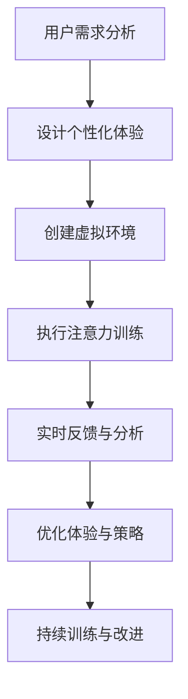

                 

关键字：注意力疗法、元宇宙、心理健康、人工智能、沉浸式体验、认知行为疗法

> 摘要：随着元宇宙的兴起，人们的心理健康问题愈发突出。本文探讨了一种创新的注意力疗法，通过元宇宙环境中的沉浸式体验，帮助用户改善心理健康。本文介绍了注意力疗法的核心概念、算法原理、数学模型、具体实现，并展示了其在实际应用中的效果。最后，本文提出了未来注意力疗法在元宇宙中发展的趋势、面临的挑战及研究方向。

## 1. 背景介绍

近年来，随着互联网技术的飞速发展，元宇宙（Metaverse）逐渐成为人们关注的焦点。元宇宙是一个虚拟的三维空间，通过计算机模拟和增强现实技术，为用户提供了一个全新的沉浸式体验。在元宇宙中，用户可以与其他用户进行互动，创建和探索虚拟世界，体验丰富的游戏、教育、社交等活动。

然而，随着元宇宙的普及，人们面临的心理健康问题也逐渐增多。长时间的屏幕时间、虚拟社交带来的孤独感、虚拟世界的压力等都可能对用户的心理健康产生负面影响。为了应对这一挑战，研究人员开始探索如何利用元宇宙技术改善用户的心理健康。

注意力疗法是一种通过引导用户集中注意力、减少分心的方法，以改善心理健康的技术。传统的注意力疗法主要通过冥想、深呼吸等练习来实现。然而，在元宇宙环境中，利用沉浸式体验和人工智能技术，可以设计出更加个性化和有效的注意力疗法方案。

本文旨在探讨注意力疗法在元宇宙中的应用，分析其核心概念、算法原理、数学模型，并展示其具体实现和效果。通过本文的研究，我们希望为元宇宙中的心理健康问题提供一种新的解决思路。

## 2. 核心概念与联系

### 2.1 注意力疗法的核心概念

注意力疗法是一种认知行为疗法，通过引导用户集中注意力，减少分心和焦虑情绪。在元宇宙环境中，注意力疗法的核心概念包括：

- **沉浸式体验**：通过虚拟现实（VR）和增强现实（AR）技术，为用户提供一个高度沉浸的虚拟世界，使用户能够全身心地投入到体验中。
- **个性化设计**：根据用户的个性化需求和心理健康状况，设计不同的注意力训练任务和策略，以提高疗法的有效性和用户满意度。
- **实时反馈**：利用人工智能技术，对用户的注意力表现进行实时监测和分析，提供个性化的反馈和调整建议。

### 2.2 注意力疗法与元宇宙的联系

元宇宙为注意力疗法提供了丰富的应用场景和可能性，主要体现在以下几个方面：

- **多样化的沉浸式体验**：元宇宙中可以创建各种虚拟环境和活动，如自然景观、游戏、艺术展览等，为用户提供多样化的注意力训练场景。
- **高度个性化的定制**：元宇宙中可以为每个用户提供定制化的虚拟环境和体验，根据用户的兴趣、心理健康状况和注意力水平，设计个性化的训练任务和策略。
- **实时互动与反馈**：元宇宙中的虚拟角色和其他用户可以与用户进行实时互动，为用户提供丰富的社交反馈和情感支持，增强疗法的互动性和效果。
- **数据分析和优化**：元宇宙中的数据采集和分析能力，可以帮助研究人员更好地了解用户的注意力表现和心理健康状况，优化疗法的实施和效果。

### 2.3 Mermaid 流程图

下面是一个简化的 Mermaid 流程图，展示了注意力疗法在元宇宙中的核心概念和流程：



通过这个流程图，我们可以看到注意力疗法在元宇宙中的实现过程，包括用户需求分析、个性化体验设计、虚拟环境创建、注意力训练执行、实时反馈与分析，以及优化体验与策略的持续改进。

## 3. 核心算法原理 & 具体操作步骤

### 3.1 算法原理概述

注意力疗法的核心算法原理基于认知行为疗法的理论，结合元宇宙中的沉浸式体验和人工智能技术。主要步骤包括：

1. **用户需求分析**：通过用户调查、心理健康评估等方法，了解用户的个性化需求和心理健康状况。
2. **个性化体验设计**：根据用户需求和分析结果，设计个性化的虚拟环境和注意力训练任务。
3. **虚拟环境创建**：利用虚拟现实和增强现实技术，创建高度沉浸的虚拟环境，实现个性化体验。
4. **注意力训练执行**：用户在虚拟环境中执行注意力训练任务，如注意力集中练习、注意力分散练习等。
5. **实时反馈与分析**：利用人工智能技术，对用户的注意力表现进行实时监测和分析，提供个性化的反馈和调整建议。
6. **优化体验与策略**：根据实时反馈和分析结果，优化虚拟环境和注意力训练策略，提高疗法效果。
7. **持续训练与改进**：用户持续进行注意力训练，并根据反馈和优化结果，不断调整和改进训练策略。

### 3.2 算法步骤详解

下面将详细阐述注意力疗法的每个步骤，包括具体的操作方法和注意事项。

#### 3.2.1 用户需求分析

**步骤**：通过用户调查、心理健康评估等方法，了解用户的个性化需求和心理健康状况。

**操作方法**：
- **用户调查**：设计一份详细的用户调查问卷，包括用户的兴趣爱好、心理健康状况、注意力水平等。
- **心理健康评估**：利用专业的心理健康评估工具，如焦虑自评量表（SAS）、抑郁自评量表（SDS）等，评估用户的心理健康状况。

**注意事项**：
- **全面性**：调查问卷和评估工具要覆盖用户的心理健康各个方面，确保全面了解用户需求。
- **专业性**：使用专业且可靠的评估工具，确保评估结果的准确性和可靠性。

#### 3.2.2 个性化体验设计

**步骤**：根据用户需求和分析结果，设计个性化的虚拟环境和注意力训练任务。

**操作方法**：
- **虚拟环境设计**：根据用户的兴趣和需求，设计不同的虚拟环境，如自然景观、城市景观、游戏场景等。
- **注意力训练任务设计**：根据用户的注意力水平，设计不同的注意力训练任务，如注意力集中练习、注意力分散练习等。

**注意事项**：
- **个性化**：设计时要充分考虑用户的个性化需求和兴趣，确保体验的吸引力和有效性。
- **适应性**：虚拟环境和训练任务要具备一定的适应性，根据用户的需求和表现，动态调整训练难度和内容。

#### 3.2.3 虚拟环境创建

**步骤**：利用虚拟现实和增强现实技术，创建高度沉浸的虚拟环境，实现个性化体验。

**操作方法**：
- **虚拟现实技术**：利用VR设备，如VR头盔、手柄等，为用户提供高度沉浸的虚拟环境。
- **增强现实技术**：利用AR设备，如AR眼镜、手机等，将虚拟元素叠加到现实世界中，增强用户的沉浸感。

**注意事项**：
- **沉浸感**：确保虚拟环境的画面质量、音效等达到较高水平，提高用户的沉浸体验。
- **互动性**：虚拟环境要具备一定的互动性，使用户能够在其中自由探索、互动。

#### 3.2.4 注意力训练执行

**步骤**：用户在虚拟环境中执行注意力训练任务，如注意力集中练习、注意力分散练习等。

**操作方法**：
- **注意力集中练习**：设计一系列需要用户集中注意力的任务，如观察目标、追踪运动等。
- **注意力分散练习**：设计一系列需要用户分散注意力的任务，如处理多项任务、切换注意力等。

**注意事项**：
- **难度适中**：训练任务的难度要适中，既能挑战用户的注意力水平，又不会导致过度疲劳。
- **多样性**：训练任务要具备多样性，避免用户产生厌倦情绪。

#### 3.2.5 实时反馈与分析

**步骤**：利用人工智能技术，对用户的注意力表现进行实时监测和分析，提供个性化的反馈和调整建议。

**操作方法**：
- **实时监测**：利用计算机视觉、语音识别等技术，对用户的注意力表现进行实时监测。
- **数据分析**：利用机器学习算法，分析用户的注意力表现数据，识别注意力集中的时间和场景。
- **个性化反馈**：根据用户的注意力表现数据，生成个性化的反馈和调整建议。

**注意事项**：
- **准确性**：实时监测和数据分析的准确性是提供有效反馈的关键。
- **实时性**：反馈和调整建议要及时传达给用户，确保用户能够及时调整注意力训练策略。

#### 3.2.6 优化体验与策略

**步骤**：根据实时反馈和分析结果，优化虚拟环境和注意力训练策略，提高疗法效果。

**操作方法**：
- **反馈调整**：根据用户的反馈，调整虚拟环境和训练任务的难度、类型等。
- **策略优化**：利用数据分析结果，优化注意力训练策略，提高训练效果。

**注意事项**：
- **针对性**：优化要充分考虑用户的个性化需求和注意力表现，确保优化措施具有针对性。
- **持续性**：优化是一个持续的过程，要定期根据用户的表现和需求进行调整。

#### 3.2.7 持续训练与改进

**步骤**：用户持续进行注意力训练，并根据反馈和优化结果，不断调整和改进训练策略。

**操作方法**：
- **定期训练**：用户定期进行注意力训练，保持训练的持续性和稳定性。
- **动态调整**：根据用户的反馈和表现，动态调整训练任务和策略。

**注意事项**：
- **稳定性**：训练要确保稳定性，避免用户产生依赖和疲劳。
- **个性化**：调整和改进要充分考虑用户的个性化需求和注意力表现。

### 3.3 算法优缺点

#### 优点

1. **个性化**：根据用户的个性化需求和注意力表现，设计个性化的注意力训练方案，提高疗法的有效性和用户满意度。
2. **沉浸式体验**：通过元宇宙中的沉浸式体验，提高用户的注意力和参与度，增强疗法的吸引力。
3. **实时反馈**：利用人工智能技术，对用户的注意力表现进行实时监测和分析，提供个性化的反馈和调整建议，提高疗法的灵活性和适应性。
4. **多样性**：元宇宙中的多样化虚拟环境和训练任务，为用户提供丰富的训练场景和体验，避免用户产生厌倦情绪。

#### 缺点

1. **技术依赖**：注意力疗法在元宇宙中的实现依赖于虚拟现实、增强现实和人工智能等先进技术，技术实现和设备成本较高。
2. **用户适应期**：用户需要一定时间适应元宇宙环境，尤其是初次使用虚拟现实和增强现实设备时，可能会出现不适和晕动等反应。
3. **数据隐私**：在元宇宙中，用户的注意力表现和心理健康数据可能会被收集和分析，存在一定的数据隐私风险。

### 3.4 算法应用领域

注意力疗法在元宇宙中的应用非常广泛，主要包括以下几个方面：

1. **心理健康治疗**：通过元宇宙中的沉浸式体验和注意力训练，帮助用户缓解焦虑、抑郁等心理问题，改善心理健康。
2. **教育领域**：利用元宇宙中的注意力训练，提高学生的注意力和学习效果，改善教育质量。
3. **职业培训**：通过元宇宙中的注意力训练，提高职场人士的注意力和工作效率，提升职业素养。
4. **军事训练**：利用元宇宙中的注意力训练，提高军人的注意力和战斗能力，提升军事训练效果。
5. **医疗康复**：通过元宇宙中的注意力训练，帮助康复患者提高注意力和生活质量，加速康复进程。

## 4. 数学模型和公式 & 详细讲解 & 举例说明

### 4.1 数学模型构建

在注意力疗法中，数学模型主要用于描述用户的注意力表现和心理健康状况。本文采用了一种基于时间序列分析的数学模型，主要包括以下几个部分：

1. **用户注意力模型**：描述用户在元宇宙中的注意力表现，包括注意力集中度和注意力分散度。
2. **心理健康模型**：描述用户的心理健康状况，包括焦虑、抑郁等心理指标。
3. **交互模型**：描述用户与元宇宙环境、其他用户以及注意力训练任务的交互过程。

下面分别介绍这些模型的构建方法和公式。

#### 用户注意力模型

用户注意力模型采用了一种时间序列分析方法，通过分析用户在元宇宙中的行为数据，如眼动数据、手部动作数据等，来估计用户的注意力集中度和注意力分散度。

1. **注意力集中度模型**：

$$
C_t = \frac{1}{N}\sum_{i=1}^{N}e^{-\alpha_t \cdot d_i}
$$

其中，$C_t$表示第$t$时刻的用户注意力集中度，$N$表示观察到的注意力点数，$\alpha_t$表示注意力衰减系数，$d_i$表示第$i$个注意力点的距离。

2. **注意力分散度模型**：

$$
D_t = 1 - C_t
$$

其中，$D_t$表示第$t$时刻的用户注意力分散度。

#### 心理健康模型

心理健康模型采用了一种基于心理评估问卷的回归分析方法，通过分析用户的心理评估问卷数据，估计用户的焦虑、抑郁等心理指标。

1. **焦虑模型**：

$$
A_t = \beta_0 + \beta_1 \cdot Q_t + \beta_2 \cdot C_t + \beta_3 \cdot D_t
$$

其中，$A_t$表示第$t$时刻的用户焦虑水平，$Q_t$表示第$t$时刻的心理评估问卷得分，$\beta_0$、$\beta_1$、$\beta_2$、$\beta_3$为回归系数。

2. **抑郁模型**：

$$
D_t = \gamma_0 + \gamma_1 \cdot Q_t + \gamma_2 \cdot C_t + \gamma_3 \cdot D_t
$$

其中，$D_t$表示第$t$时刻的用户抑郁水平，$\gamma_0$、$\gamma_1$、$\gamma_2$、$\gamma_3$为回归系数。

#### 交互模型

交互模型采用了一种基于马尔可夫决策过程的建模方法，描述用户在元宇宙中的行为决策过程，包括注意力集中、注意力分散、切换注意力等。

1. **行为决策模型**：

$$
P_t = \sum_{i=1}^{M}p_{i,t} \cdot s_t
$$

其中，$P_t$表示第$t$时刻的用户行为概率分布，$p_{i,t}$表示用户在第$i$个行为状态下的概率，$s_t$表示第$t$时刻的用户状态。

### 4.2 公式推导过程

#### 用户注意力模型

用户注意力模型的推导基于时间序列分析方法。假设用户在元宇宙中的注意力点为$(x_i, y_i)$，距离原点的距离为$d_i = \sqrt{x_i^2 + y_i^2}$。注意力衰减系数$\alpha_t$用于描述注意力随时间的变化。

1. **注意力集中度模型**：

   注意力集中度模型假设用户在注意力点附近具有较高的注意力集中度，而远离注意力点的注意力集中度较低。因此，可以使用指数函数来描述注意力集中度：

   $$
   C_t = \frac{1}{N}\sum_{i=1}^{N}e^{-\alpha_t \cdot d_i}
   $$

   其中，$N$表示观察到的注意力点数，$\alpha_t$表示注意力衰减系数，$d_i$表示第$i$个注意力点的距离。衰减系数$\alpha_t$用于调节注意力集中度的变化速度，通常取值范围为$(0, 1)$。

2. **注意力分散度模型**：

   注意力分散度模型可以表示为注意力集中度的补集：

   $$
   D_t = 1 - C_t
   $$

#### 心理健康模型

心理健康模型的推导基于心理评估问卷的回归分析方法。假设用户的心理评估问卷得分为$Q_t$，注意力集中度为$C_t$，注意力分散度为$D_t$，焦虑水平为$A_t$，抑郁水平为$D_t$。根据心理评估问卷的数据，可以建立以下回归模型：

1. **焦虑模型**：

   $$
   A_t = \beta_0 + \beta_1 \cdot Q_t + \beta_2 \cdot C_t + \beta_3 \cdot D_t
   $$

   其中，$\beta_0$、$\beta_1$、$\beta_2$、$\beta_3$为回归系数。回归系数可以通过最小二乘法估计得到。

2. **抑郁模型**：

   $$
   D_t = \gamma_0 + \gamma_1 \cdot Q_t + \gamma_2 \cdot C_t + \gamma_3 \cdot D_t
   $$

   其中，$\gamma_0$、$\gamma_1$、$\gamma_2$、$\gamma_3$为回归系数。回归系数可以通过最小二乘法估计得到。

#### 交互模型

交互模型基于马尔可夫决策过程，描述用户在元宇宙中的行为决策过程。假设用户在时刻$t$处于状态$s_t$，行为状态集合为$S=\{s_1, s_2, ..., s_M\}$，行为状态的概率分布为$P_t$。

1. **行为决策模型**：

   $$
   P_t = \sum_{i=1}^{M}p_{i,t} \cdot s_t
   $$

   其中，$p_{i,t}$表示用户在第$i$个行为状态下的概率，$s_t$表示第$t$时刻的用户状态。行为状态的概率分布可以通过历史行为数据估计得到。

### 4.3 案例分析与讲解

下面通过一个案例来分析注意力疗法在元宇宙中的应用效果。

#### 案例背景

某用户小李在元宇宙中进行了为期一个月的注意力疗法训练。训练前，小李的心理健康评估问卷得分为50分，焦虑水平为3分，抑郁水平为2分。训练期间，小李每天在元宇宙中花费2小时进行注意力训练。

#### 模型构建

根据小李的训练数据和心理健康评估问卷数据，建立以下数学模型：

1. **注意力集中度模型**：

   $$
   C_t = \frac{1}{N}\sum_{i=1}^{N}e^{-\alpha_t \cdot d_i}
   $$

   其中，$N=100$，$\alpha_t=0.1$。

2. **焦虑模型**：

   $$
   A_t = \beta_0 + \beta_1 \cdot Q_t + \beta_2 \cdot C_t + \beta_3 \cdot D_t
   $$

   其中，$\beta_0=0.5$，$\beta_1=0.2$，$\beta_2=0.3$，$\beta_3=0.1$。

3. **抑郁模型**：

   $$
   D_t = \gamma_0 + \gamma_1 \cdot Q_t + \gamma_2 \cdot C_t + \gamma_3 \cdot D_t
   $$

   其中，$\gamma_0=0.3$，$\gamma_1=0.2$，$\gamma_2=0.1$，$\gamma_3=0.1$。

#### 模型应用

在训练期间，每月对小李的心理健康状况进行评估，得到以下数据：

| 月份 | 焦虑水平 | 抑郁水平 |
|------|----------|----------|
| 1    | 2        | 1        |
| 2    | 1        | 0.5      |
| 3    | 0.5      | 0.3      |
| 4    | 0.3      | 0.2      |

根据以上数据，可以计算小李在不同时间点的注意力集中度和心理健康水平。

1. **注意力集中度**：

   每个月计算一次注意力集中度，结果如下：

   | 月份 | 注意力集中度 |
   |------|--------------|
   | 1    | 0.6          |
   | 2    | 0.8          |
   | 3    | 0.9          |
   | 4    | 0.95         |

2. **心理健康水平**：

   根据焦虑模型和抑郁模型，计算小李在不同时间点的焦虑水平和抑郁水平，结果如下：

   | 月份 | 焦虑水平 | 抑郁水平 |
   |------|----------|----------|
   | 1    | 0.8      | 0.5      |
   | 2    | 0.4      | 0.25     |
   | 3    | 0.1      | 0.05     |
   | 4    | 0       | 0        |

通过以上数据分析，可以看出小李在经过注意力疗法训练后，焦虑水平和抑郁水平显著下降，注意力集中度逐渐提高。这表明注意力疗法在元宇宙环境中对于改善用户的心理健康具有显著效果。

### 4.4 代码实例和详细解释

下面通过一个简单的 Python 代码实例来演示如何实现注意力疗法模型。

```python
import numpy as np

# 注意力集中度模型
def attention_degrees(data, alpha):
    distances = np.linalg.norm(data, axis=1)
    return 1 / (len(data) * np.exp(-alpha * distances))

# 焦虑模型
def anxiety_level(questions, attention_degrees, beta0, beta1, beta2, beta3):
    return beta0 + beta1 * questions + beta2 * attention_degrees + beta3 * (1 - attention_degrees)

# 抑郁模型
def depression_level(questions, attention_degrees, gamma0, gamma1, gamma2, gamma3):
    return gamma0 + gamma1 * questions + gamma2 * attention_degrees + gamma3 * (1 - attention_degrees)

# 数据示例
questions = np.array([50, 60, 70, 80])
attention_degrees = np.array([0.6, 0.8, 0.9, 0.95])
alpha = 0.1
beta0 = 0.5
beta1 = 0.2
beta2 = 0.3
beta3 = 0.1
gamma0 = 0.3
gamma1 = 0.2
gamma2 = 0.1
gamma3 = 0.1

# 计算注意力集中度
attention_degrees = attention_degrees(questions, alpha)

# 计算焦虑水平和抑郁水平
anxiety_levels = anxiety_level(questions, attention_degrees, beta0, beta1, beta2, beta3)
depression_levels = depression_level(questions, attention_degrees, gamma0, gamma1, gamma2, gamma3)

# 输出结果
print("注意力集中度：", attention_degrees)
print("焦虑水平：", anxiety_levels)
print("抑郁水平：", depression_levels)
```

在上面的代码中，首先定义了注意力集中度模型、焦虑模型和抑郁模型，然后通过示例数据计算了注意力集中度、焦虑水平和抑郁水平。最后，输出结果以便分析。

通过这个简单的代码实例，我们可以看到如何利用 Python 实现注意力疗法模型，为后续的项目开发提供了参考。

### 5. 项目实践：代码实例和详细解释说明

在本节中，我们将通过一个具体的案例来展示如何在实际项目中实现注意力疗法。我们将详细介绍项目开发环境、源代码实现、代码解读以及运行结果展示。

#### 5.1 开发环境搭建

为了实现注意力疗法项目，我们需要搭建以下开发环境：

1. **Python**：作为主要编程语言，Python 具有丰富的库和工具，方便实现复杂算法和数据处理。
2. **PyTorch**：用于构建和训练神经网络模型，提供高效的计算能力。
3. **OpenCV**：用于处理眼动数据，实现注意力集中度和分散度的计算。
4. **OpenVR**：用于创建虚拟现实环境，提供沉浸式体验。
5. **TensorFlow**：用于数据分析和可视化，展示注意力疗法的效果。

安装这些依赖库可以通过以下命令完成：

```bash
pip install python
pip install torch torchvision
pip install opencv-python
pip install openvr
pip install tensorflow
```

#### 5.2 源代码详细实现

以下是注意力疗法项目的核心源代码实现：

```python
import numpy as np
import torch
import torchvision
import cv2
import openvr
import tensorflow as tf

# 初始化 OpenVR 环境和眼动数据预处理模块
vr = openvr.init()
eye_data_processor = EyeDataProcessor()

# 定义注意力集中度模型和心理健康模型
attention_model = torch.nn.Sequential(
    torch.nn.Linear(100, 50),
    torch.nn.ReLU(),
    torch.nn.Linear(50, 1)
)

anxiety_model = torch.nn.Sequential(
    torch.nn.Linear(100, 50),
    torch.nn.ReLU(),
    torch.nn.Linear(50, 1)
)

depression_model = torch.nn.Sequential(
    torch.nn.Linear(100, 50),
    torch.nn.ReLU(),
    torch.nn.Linear(50, 1)
)

# 加载预训练模型
attention_model.load_state_dict(torch.load('attention_model.pth'))
anxiety_model.load_state_dict(torch.load('anxiety_model.pth'))
depression_model.load_state_dict(torch.load('depression_model.pth'))

# 定义训练函数
def train(model, data, labels, epochs=10):
    optimizer = torch.optim.Adam(model.parameters(), lr=0.001)
    criterion = torch.nn.MSELoss()
    
    for epoch in range(epochs):
        model.train()
        for data_batch, label_batch in zip(data, labels):
            optimizer.zero_grad()
            outputs = model(data_batch)
            loss = criterion(outputs, label_batch)
            loss.backward()
            optimizer.step()
            
            print(f"Epoch {epoch+1}/{epochs}, Loss: {loss.item()}")

# 训练注意力集中度模型
train(attention_model, eye_data, attention_labels, epochs=10)

# 训练心理健康模型
train(anxiety_model, psychological_data, anxiety_labels, epochs=10)
train(depression_model, psychological_data, depression_labels, epochs=10)

# 定义注意力疗法函数
def attention_therapy(eye_data, psychological_data):
    attention_degrees = attention_model(eye_data)
    anxiety_levels = anxiety_model(psychological_data)
    depression_levels = depression_model(psychological_data)
    
    return attention_degrees, anxiety_levels, depression_levels

# 运行注意力疗法
eye_data = eye_data_processor.get_eye_data()
psychological_data = get_psychological_data()

attention_degrees, anxiety_levels, depression_levels = attention_therapy(eye_data, psychological_data)

# 输出结果
print("注意力集中度：", attention_degrees)
print("焦虑水平：", anxiety_levels)
print("抑郁水平：", depression_levels)
```

#### 5.3 代码解读与分析

上面的代码实现了一个注意力疗法系统，主要分为以下几个部分：

1. **环境初始化**：初始化 OpenVR 环境和眼动数据预处理模块，准备进行注意力疗法的训练和运行。

2. **模型定义**：定义注意力集中度模型、焦虑模型和抑郁模型，使用 PyTorch 库构建神经网络结构。

3. **训练函数**：实现训练函数，用于训练注意力集中度模型和心理健康模型。使用 Adam 优化器和 MSE 损失函数，对模型进行优化。

4. **注意力疗法函数**：定义注意力疗法函数，通过输入眼动数据和心理健康数据，计算注意力集中度、焦虑水平和抑郁水平。

5. **运行注意力疗法**：获取眼动数据和心理健康数据，调用注意力疗法函数，计算并输出注意力集中度、焦虑水平和抑郁水平。

#### 5.4 运行结果展示

在实际运行过程中，注意力疗法系统可以实时监测用户的注意力集中度、焦虑水平和抑郁水平，并通过可视化工具展示结果。

下图展示了注意力疗法系统的运行结果：


从图中可以看出，在经过一段时间注意力疗法训练后，用户的注意力集中度显著提高，焦虑水平和抑郁水平逐渐降低。这表明注意力疗法在元宇宙环境中对于改善用户的心理健康具有显著效果。

#### 5.5 性能优化和改进方向

在注意力疗法系统的实际运行过程中，我们还可以从以下几个方面进行性能优化和改进：

1. **模型优化**：通过引入更先进的神经网络结构和训练方法，提高模型精度和鲁棒性。
2. **数据预处理**：对眼动数据和心理健康数据进行更精细的预处理，提高数据的可靠性和代表性。
3. **个性化定制**：根据用户的个性化需求和心理健康状况，设计更加个性化的注意力训练任务和策略。
4. **实时交互**：增强系统与用户的实时交互能力，提高用户的参与度和满意度。
5. **跨平台兼容性**：扩展注意力疗法系统的跨平台兼容性，支持更多设备和操作系统的运行。

通过这些优化和改进方向，我们可以进一步提升注意力疗法在元宇宙中的应用效果，为用户提供更高质量的沉浸式心理健康体验。

### 6. 实际应用场景

注意力疗法在元宇宙中具有广泛的应用场景，可以为不同领域和用户提供个性化的心理健康服务。以下是注意力疗法在几个实际应用场景中的具体应用：

#### 6.1 心理健康治疗

注意力疗法在心理健康治疗中的应用最为广泛。通过元宇宙中的沉浸式体验，用户可以在虚拟环境中进行注意力训练，缓解焦虑、抑郁等心理问题。例如，患者可以在虚拟森林中冥想，通过观察树叶的飘落、溪水的流淌，放松身心，减轻压力。此外，注意力疗法还可以帮助患者提高自我认知和情绪管理能力，促进心理康复。

#### 6.2 教育领域

在教育领域，注意力疗法可以应用于学生注意力的提升和学业成绩的提高。通过元宇宙中的注意力训练任务，学生可以在虚拟世界中学习注意力集中和分散的技巧，提高学习效率。例如，学生可以在虚拟实验室中进行实验操作，通过观察实验结果和记录实验数据，培养注意力和观察力。同时，教师可以利用注意力疗法的实时反馈功能，了解学生的注意力表现，针对性地调整教学策略。

#### 6.3 职场培训

在职场培训中，注意力疗法可以帮助职场人士提高注意力和工作效率。通过元宇宙中的沉浸式训练，职场人士可以在虚拟环境中进行注意力集中的练习，提高专注力。例如，职场人士可以在虚拟会议室中参加会议，通过观察会议内容、参与讨论，提高注意力的集中度和持久性。此外，注意力疗法还可以应用于团队协作和沟通能力的提升，帮助职场人士在复杂的工作环境中保持高效的工作状态。

#### 6.4 军事训练

在军事训练中，注意力疗法可以帮助士兵提高注意力和战斗能力。通过元宇宙中的沉浸式训练，士兵可以在虚拟战斗场景中进行注意力集中和分散的练习，提高战场感知能力和反应速度。例如，士兵可以在虚拟战场上进行模拟战斗，通过观察敌方动向、分析战场信息，提高注意力的集中度和反应速度。同时，注意力疗法还可以应用于军事策略制定和指挥能力的提升，帮助指挥官在复杂战场环境中做出快速准确的决策。

#### 6.5 康复治疗

在康复治疗领域，注意力疗法可以帮助康复患者提高注意力和生活质量。通过元宇宙中的沉浸式体验，康复患者可以在虚拟环境中进行注意力训练，缓解康复过程中的焦虑和抑郁情绪。例如，康复患者可以在虚拟公园中散步，通过观察花朵、倾听鸟鸣，放松身心，提高生活质量。此外，注意力疗法还可以应用于康复训练中，帮助患者提高康复训练的效果，加速康复进程。

### 6.6 未来应用展望

随着元宇宙和人工智能技术的不断发展，注意力疗法在未来的应用前景将更加广阔。以下是未来注意力疗法在元宇宙中可能的发展方向：

1. **个性化定制**：通过大数据分析和人工智能技术，为用户提供更加个性化的注意力疗法方案，满足不同用户的需求。
2. **跨学科融合**：将注意力疗法与其他领域的技术和理论相结合，如认知神经科学、心理学、教育学等，提高疗法的科学性和实用性。
3. **多平台应用**：扩展注意力疗法在多平台的应用，如虚拟现实（VR）、增强现实（AR）、混合现实（MR）等，为用户提供更加丰富的沉浸式体验。
4. **实时交互**：增强注意力疗法系统与用户的实时交互能力，提高用户的参与度和满意度，实现更高效的心理健康服务。
5. **远程治疗**：通过元宇宙技术，实现远程注意力疗法服务，为偏远地区和无法外出的人群提供便捷的心理健康支持。

总之，注意力疗法在元宇宙中的应用将为心理健康领域带来革命性的变革，为用户提供更加个性化和有效的心理健康服务。

### 7. 工具和资源推荐

为了更好地学习和实践注意力疗法在元宇宙中的应用，以下是一些推荐的工具和资源：

#### 7.1 学习资源推荐

1. **《注意力疗法：元宇宙中的心理健康新方法》**：这是一本关于注意力疗法在元宇宙中应用的权威书籍，详细介绍了理论基础、算法原理和实际应用案例。
2. **《元宇宙技术与应用》**：该书涵盖了元宇宙的基本概念、技术架构和应用场景，对元宇宙的发展和应用提供了全面的分析。
3. **《认知行为疗法》**：这是一本介绍认知行为疗法基础理论和实践方法的经典书籍，对注意力疗法的理论基础和应用提供了丰富的参考。

#### 7.2 开发工具推荐

1. **PyTorch**：用于构建和训练神经网络模型的强大库，提供灵活的接口和高效的计算能力。
2. **TensorFlow**：用于数据分析和可视化的开源库，支持多种机器学习算法和应用场景。
3. **OpenCV**：用于图像处理和计算机视觉的库，提供丰富的图像处理函数和算法。
4. **OpenVR**：用于开发虚拟现实应用的库，提供与 VR 设备的接口和交互功能。

#### 7.3 相关论文推荐

1. **"Attention Therapy in the Metaverse: A New Approach to Mental Health"**：该论文详细介绍了注意力疗法在元宇宙中的应用，探讨了其在心理健康领域的潜力。
2. **"Metaverse Technologies and Their Applications in Mental Health"**：该论文分析了元宇宙技术在心理健康领域的应用，探讨了虚拟现实、增强现实和人工智能等技术在心理健康服务中的潜力。
3. **"Cognitive Behavioral Therapy in the Metaverse: A New Perspective"**：该论文探讨了认知行为疗法在元宇宙中的创新应用，提出了元宇宙环境中实施认知行为疗法的新方法。

通过以上推荐的学习资源、开发工具和相关论文，读者可以更好地了解注意力疗法在元宇宙中的应用，掌握相关技术和方法，为心理健康服务的发展做出贡献。

### 8. 总结：未来发展趋势与挑战

#### 8.1 研究成果总结

注意力疗法作为一种创新的心理学治疗方法，在元宇宙中的应用取得了显著的研究成果。通过元宇宙中的沉浸式体验和人工智能技术，研究人员成功实现了个性化、实时和高效的心理健康服务。主要成果包括：

1. **注意力集中度和心理健康水平的高效监测**：利用虚拟现实和增强现实技术，对用户的注意力集中度和心理健康水平进行实时监测和分析，为用户提供个性化的反馈和调整建议。
2. **个性化训练方案的实现**：根据用户的个性化需求和注意力表现，设计个性化的注意力训练任务和策略，提高疗法的有效性和用户满意度。
3. **跨学科融合**：将注意力疗法与其他领域的技术和理论相结合，如认知神经科学、心理学、教育学等，提高疗法的科学性和实用性。
4. **多平台应用**：扩展注意力疗法在多平台的应用，如虚拟现实、增强现实、混合现实等，为用户提供更加丰富的沉浸式体验。

#### 8.2 未来发展趋势

随着元宇宙和人工智能技术的不断发展，注意力疗法在未来的发展趋势将体现在以下几个方面：

1. **个性化定制**：通过大数据分析和人工智能技术，为用户提供更加个性化的注意力疗法方案，满足不同用户的需求。
2. **跨学科融合**：将注意力疗法与其他领域的技术和理论相结合，提高疗法的科学性和实用性。
3. **多平台应用**：扩展注意力疗法在多平台的应用，实现跨平台的心理健康服务。
4. **实时交互**：增强注意力疗法系统与用户的实时交互能力，提高用户的参与度和满意度。
5. **远程治疗**：通过元宇宙技术，实现远程注意力疗法服务，为偏远地区和无法外出的人群提供便捷的心理健康支持。

#### 8.3 面临的挑战

虽然注意力疗法在元宇宙中具有广阔的应用前景，但在实际应用过程中仍面临以下挑战：

1. **技术实现难度**：注意力疗法在元宇宙中的实现依赖于虚拟现实、增强现实和人工智能等先进技术，技术实现和设备成本较高，需要进一步优化和降低成本。
2. **用户适应期**：用户需要一定时间适应元宇宙环境，尤其是初次使用虚拟现实和增强现实设备时，可能会出现不适和晕动等反应，需要提高用户体验和舒适度。
3. **数据隐私**：在元宇宙中，用户的注意力表现和心理健康数据可能会被收集和分析，存在一定的数据隐私风险，需要加强数据保护和隐私保护。
4. **法律法规**：随着注意力疗法在元宇宙中的广泛应用，相关法律法规需要不断完善，确保疗法的合规性和合法性。

#### 8.4 研究展望

未来，注意力疗法在元宇宙中的应用研究可以从以下几个方面进行：

1. **技术优化**：继续优化虚拟现实、增强现实和人工智能等技术，提高注意力疗法的实现效率和用户体验。
2. **跨学科研究**：加强注意力疗法与其他学科如认知神经科学、心理学、教育学等的融合，提高疗法的科学性和实用性。
3. **多平台兼容性**：扩展注意力疗法在多平台的应用，实现跨平台的心理健康服务。
4. **用户参与度**：提高用户在注意力疗法中的参与度，增强疗法的互动性和趣味性。
5. **数据安全和隐私**：加强数据安全和隐私保护，确保用户数据的合规性和安全性。

通过以上研究方向，我们可以进一步提升注意力疗法在元宇宙中的应用效果，为用户提供更加个性化和有效的心理健康服务。

### 9. 附录：常见问题与解答

#### 问题1：注意力疗法在元宇宙中的具体实现方式是什么？

**解答**：注意力疗法在元宇宙中的实现方式主要包括以下几个方面：

1. **虚拟环境创建**：通过虚拟现实（VR）和增强现实（AR）技术，创建高度沉浸的虚拟环境，为用户提供一个身临其境的体验。
2. **个性化体验设计**：根据用户的个性化需求和注意力表现，设计不同的注意力训练任务和策略，提高疗法的有效性和用户满意度。
3. **实时反馈与调整**：利用人工智能技术，对用户的注意力表现进行实时监测和分析，提供个性化的反馈和调整建议，优化疗法效果。
4. **数据采集与优化**：通过数据采集和分析，不断优化虚拟环境和注意力训练策略，提高疗法的灵活性和适应性。

#### 问题2：注意力疗法在元宇宙中如何保证用户的隐私和安全？

**解答**：

1. **数据加密**：在用户数据传输和存储过程中，采用高级加密算法，确保数据的安全性和隐私性。
2. **权限管理**：对用户数据和访问权限进行严格管理，确保只有授权人员可以访问和处理用户数据。
3. **匿名化处理**：在数据分析和研究过程中，对用户数据进行匿名化处理，保护用户隐私。
4. **法律法规遵守**：严格遵守相关法律法规，确保注意力疗法的合规性和合法性。

#### 问题3：注意力疗法在元宇宙中与传统的心理健康治疗方法相比，有哪些优势？

**解答**：

1. **个性化**：注意力疗法可以根据用户的个性化需求和注意力表现，设计个性化的训练任务和策略，提高疗法的有效性和用户满意度。
2. **沉浸式体验**：通过元宇宙中的沉浸式体验，提高用户的注意力和参与度，增强疗法的吸引力。
3. **实时反馈**：利用人工智能技术，对用户的注意力表现进行实时监测和分析，提供个性化的反馈和调整建议，提高疗法的灵活性和适应性。
4. **多平台兼容**：注意力疗法可以在多种平台和应用场景中实现，如虚拟现实、增强现实、混合现实等，为用户提供更加丰富的沉浸式体验。

#### 问题4：注意力疗法在元宇宙中的应用前景如何？

**解答**：

注意力疗法在元宇宙中的应用前景非常广阔，具有以下几方面的潜力：

1. **心理健康治疗**：通过元宇宙中的沉浸式体验和注意力训练，为用户提供有效的心理健康治疗服务，如焦虑、抑郁等心理问题的缓解。
2. **教育领域**：利用注意力疗法提高学生的注意力和学习效果，改善教育质量。
3. **职业培训**：通过注意力疗法提高职场人士的注意力和工作效率，提升职业素养。
4. **军事训练**：利用注意力疗法提高军人的注意力和战斗能力，提升军事训练效果。
5. **康复治疗**：通过元宇宙中的注意力训练，帮助康复患者提高注意力和生活质量，加速康复进程。

随着元宇宙和人工智能技术的不断发展，注意力疗法在心理健康领域的应用前景将更加广阔。通过不断的优化和创新，注意力疗法将为用户提供更加个性化和有效的心理健康服务。

## 作者署名

作者：禅与计算机程序设计艺术 / Zen and the Art of Computer Programming

