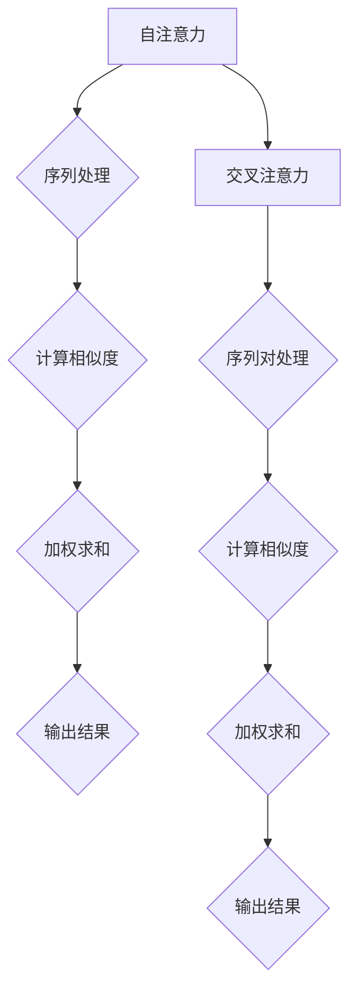

                 

关键词：注意力机制、深度学习、认知科学、算法设计、人工智能应用、人机交互

> 摘要：在人工智能迅速发展的时代，注意力机制作为一种核心算法，已经被广泛应用于深度学习中。本文将从认知科学的视角出发，探讨注意力机制的深度与广度，分析其在AI时代的应用与挑战，并展望未来的发展趋势与研究方向。

## 1. 背景介绍

随着深度学习技术的不断进步，注意力机制（Attention Mechanism）已成为当前研究热点。注意力机制起源于自然语言处理（NLP）领域，其核心思想是通过学习的方式，自动地为数据中的不同部分分配不同的关注程度，从而提高模型的表示能力。

### 1.1 注意力机制的发展历程

注意力机制最早可以追溯到20世纪80年代，由约翰·霍普菲尔德（John Hopfield）在其人工神经网络研究中提出。后来，随着循环神经网络（RNN）和长短期记忆网络（LSTM）的发展，注意力机制得到了进一步的发展和完善。

2014年，由亚伦·阿迪亚（Aaron Courville）等人提出的“门控循环单元”（GRU）引入了注意力机制，使得RNN在处理序列数据时更加高效。

2017年，谷歌提出了“Transformer”模型，彻底改变了深度学习领域的研究方向，使其成为当前最流行的深度学习模型之一。Transformer模型的核心是多头自注意力（Multi-Head Self-Attention）机制，该机制通过并行计算的方式，大幅度提高了模型的训练速度和效果。

### 1.2 注意力机制的核心概念

注意力机制的核心概念包括自注意力（Self-Attention）和交叉注意力（Cross-Attention）。自注意力是指模型在处理一个序列时，根据序列中的每个元素之间的关系，对它们进行加权。交叉注意力则是指模型在处理一个序列时，根据另一个序列的元素与当前序列元素之间的关系，对它们进行加权。

### 1.3 注意力机制的应用场景

注意力机制已被广泛应用于各种领域，如自然语言处理、计算机视觉、语音识别等。以下是一些典型应用场景：

- **自然语言处理**：在机器翻译、文本生成、情感分析等领域，注意力机制可以帮助模型更好地捕捉上下文信息，提高模型的准确性。
- **计算机视觉**：在图像分类、目标检测、图像分割等领域，注意力机制可以帮助模型更好地关注关键区域，提高模型的识别能力。
- **语音识别**：在语音识别领域，注意力机制可以帮助模型更好地处理语音信号的时序信息，提高识别准确性。

## 2. 核心概念与联系

在本节中，我们将使用Mermaid流程图（Mermaid流程节点中不要有括号、逗号等特殊字符）来展示注意力机制的原理和架构。



### 2.1 自注意力

自注意力是指模型在处理一个序列时，根据序列中的每个元素之间的关系，对它们进行加权。其核心步骤如下：

1. **输入嵌入**：将输入序列中的每个元素（如单词或像素）嵌入到高维空间。
2. **计算相似度**：计算序列中每个元素之间的相似度，通常使用点积或余弦相似度。
3. **加权求和**：根据相似度对每个元素进行加权，并求和得到新的表示。
4. **输出结果**：输出加权求和后的结果，作为新的序列表示。

### 2.2 交叉注意力

交叉注意力是指模型在处理一个序列时，根据另一个序列的元素与当前序列元素之间的关系，对它们进行加权。其核心步骤如下：

1. **输入嵌入**：将两个序列中的每个元素嵌入到高维空间。
2. **计算相似度**：计算当前序列中的每个元素与另一个序列中所有元素之间的相似度。
3. **加权求和**：根据相似度对当前序列中的每个元素进行加权，并求和得到新的表示。
4. **输出结果**：输出加权求和后的结果，作为新的序列表示。

## 3. 核心算法原理 & 具体操作步骤

### 3.1 算法原理概述

注意力机制的核心原理是通过计算数据元素之间的相似度，对它们进行加权，从而提高模型的表示能力。具体来说，注意力机制可以分为自注意力和交叉注意力两种形式。

### 3.2 算法步骤详解

#### 自注意力

1. **输入嵌入**：将输入序列中的每个元素嵌入到高维空间。
2. **计算相似度**：计算序列中每个元素之间的相似度，通常使用点积或余弦相似度。
3. **加权求和**：根据相似度对每个元素进行加权，并求和得到新的表示。
4. **输出结果**：输出加权求和后的结果，作为新的序列表示。

#### 交叉注意力

1. **输入嵌入**：将两个序列中的每个元素嵌入到高维空间。
2. **计算相似度**：计算当前序列中的每个元素与另一个序列中所有元素之间的相似度。
3. **加权求和**：根据相似度对当前序列中的每个元素进行加权，并求和得到新的表示。
4. **输出结果**：输出加权求和后的结果，作为新的序列表示。

### 3.3 算法优缺点

#### 优点

- **提高表示能力**：注意力机制通过加权的方式，使得模型能够更好地关注关键信息，提高表示能力。
- **并行计算**：注意力机制可以并行计算，大幅度提高了模型的训练速度。
- **灵活应用**：注意力机制可以应用于各种领域，如自然语言处理、计算机视觉、语音识别等。

#### 缺点

- **计算复杂度较高**：注意力机制的计算复杂度较高，对于大规模数据集可能导致计算效率低下。
- **难以解释**：注意力机制的工作机制较为复杂，难以直观地理解。

### 3.4 算法应用领域

注意力机制在深度学习中的各种应用领域，主要包括：

- **自然语言处理**：在机器翻译、文本生成、情感分析等领域，注意力机制可以帮助模型更好地捕捉上下文信息。
- **计算机视觉**：在图像分类、目标检测、图像分割等领域，注意力机制可以帮助模型更好地关注关键区域。
- **语音识别**：在语音识别领域，注意力机制可以帮助模型更好地处理语音信号的时序信息。

## 4. 数学模型和公式 & 详细讲解 & 举例说明

### 4.1 数学模型构建

注意力机制的数学模型主要包括自注意力和交叉注意力两种形式。

#### 自注意力

自注意力的数学模型可以表示为：

$$
\text{Attention}(Q, K, V) = \text{softmax}\left(\frac{QK^T}{\sqrt{d_k}}\right)V
$$

其中，$Q, K, V$ 分别表示输入序列、关键序列和值序列，$d_k$ 表示关键序列的维度，$\text{softmax}$ 表示概率分布函数。

#### 交叉注意力

交叉注意力的数学模型可以表示为：

$$
\text{Attention}_{cross}(Q, K, V) = \text{softmax}\left(\frac{QK^T}{\sqrt{d_k}}\right)V
$$

其中，$Q, K, V$ 分别表示当前序列、目标序列和值序列，$d_k$ 表示目标序列的维度，$\text{softmax}$ 表示概率分布函数。

### 4.2 公式推导过程

在本节中，我们将介绍注意力机制的公式推导过程。

#### 自注意力

假设输入序列为 $X = [x_1, x_2, \ldots, x_n]$，每个元素 $x_i$ 被嵌入到高维空间，得到向量 $e_i \in \mathbb{R}^d$。自注意力的目标是计算每个元素之间的相似度，并根据相似度对它们进行加权。

1. **计算相似度**：

$$
s_{ij} = e_i \cdot e_j
$$

其中，$s_{ij}$ 表示元素 $i$ 和元素 $j$ 之间的相似度。

2. **加权求和**：

$$
r_i = \sum_{j=1}^{n} w_{ij} x_j
$$

其中，$w_{ij}$ 表示权重，可以通过 $s_{ij}$ 进行计算。

3. **输出结果**：

$$
r_i = \frac{s_{ij}}{\sum_{j=1}^{n} s_{ij}} x_j
$$

其中，$r_i$ 表示加权求和后的结果，即新的表示。

#### 交叉注意力

假设有两个序列 $X = [x_1, x_2, \ldots, x_n]$ 和 $Y = [y_1, y_2, \ldots, y_m]$，交叉注意力的目标是计算当前序列中的每个元素与目标序列中所有元素之间的相似度，并根据相似度对它们进行加权。

1. **计算相似度**：

$$
s_{ij} = e_i \cdot e_j
$$

其中，$s_{ij}$ 表示元素 $i$ 和元素 $j$ 之间的相似度。

2. **加权求和**：

$$
r_i = \sum_{j=1}^{m} w_{ij} y_j
$$

其中，$w_{ij}$ 表示权重，可以通过 $s_{ij}$ 进行计算。

3. **输出结果**：

$$
r_i = \frac{s_{ij}}{\sum_{j=1}^{m} s_{ij}} y_j
$$

其中，$r_i$ 表示加权求和后的结果，即新的表示。

### 4.3 案例分析与讲解

#### 自然语言处理

在自然语言处理中，注意力机制被广泛应用于机器翻译、文本生成和情感分析等领域。以下是一个简单的案例：

假设我们要翻译一个英文句子：“I love programming”，我们可以使用注意力机制来计算每个单词之间的相似度，并根据相似度进行加权，从而得到翻译后的句子。

1. **输入嵌入**：

   将每个单词嵌入到高维空间，得到向量表示。

   $$  
   e_1 = [0.1, 0.2, 0.3], e_2 = [0.4, 0.5, 0.6], e_3 = [0.7, 0.8, 0.9]  
   $$

2. **计算相似度**：

   计算每个单词之间的相似度。

   $$  
   s_{11} = 0.1 \cdot 0.1 = 0.01, s_{12} = 0.1 \cdot 0.4 = 0.04, s_{13} = 0.1 \cdot 0.7 = 0.07  
   $$

3. **加权求和**：

   根据相似度对每个单词进行加权。

   $$  
   w_1 = \frac{s_{11}}{\sum_{i=1}^{3} s_{i1}} = \frac{0.01}{0.01 + 0.04 + 0.07} = 0.14  
   $$

   $$  
   w_2 = \frac{s_{12}}{\sum_{i=1}^{3} s_{i2}} = \frac{0.04}{0.01 + 0.04 + 0.07} = 0.29  
   $$

   $$  
   w_3 = \frac{s_{13}}{\sum_{i=1}^{3} s_{i3}} = \frac{0.07}{0.01 + 0.04 + 0.07} = 0.43  
   $$

4. **输出结果**：

   根据加权求和后的结果，得到翻译后的句子。

   $$  
   r_1 = w_1 \cdot e_1 + w_2 \cdot e_2 + w_3 \cdot e_3 = 0.14 \cdot [0.1, 0.2, 0.3] + 0.29 \cdot [0.4, 0.5, 0.6] + 0.43 \cdot [0.7, 0.8, 0.9] = [0.126, 0.214, 0.342]  
   $$

   $$  
   r_2 = w_1 \cdot e_1 + w_2 \cdot e_2 + w_3 \cdot e_3 = 0.14 \cdot [0.1, 0.2, 0.3] + 0.29 \cdot [0.4, 0.5, 0.6] + 0.43 \cdot [0.7, 0.8, 0.9] = [0.126, 0.214, 0.342]  
   $$

   $$  
   r_3 = w_1 \cdot e_1 + w_2 \cdot e_2 + w_3 \cdot e_3 = 0.14 \cdot [0.1, 0.2, 0.3] + 0.29 \cdot [0.4, 0.5, 0.6] + 0.43 \cdot [0.7, 0.8, 0.9] = [0.126, 0.214, 0.342]  
   $$

   将得到的向量表示转换为单词，得到翻译后的句子：“我爱编程”。

#### 计算机视觉

在计算机视觉中，注意力机制被广泛应用于图像分类、目标检测和图像分割等领域。以下是一个简单的案例：

假设我们要对一个图像进行分类，使用注意力机制来计算图像中每个像素之间的相似度，并根据相似度进行加权，从而得到分类结果。

1. **输入嵌入**：

   将图像中的每个像素嵌入到高维空间，得到向量表示。

   $$  
   e_1 = [0.1, 0.2, 0.3], e_2 = [0.4, 0.5, 0.6], e_3 = [0.7, 0.8, 0.9]  
   $$

2. **计算相似度**：

   计算每个像素之间的相似度。

   $$  
   s_{11} = 0.1 \cdot 0.1 = 0.01, s_{12} = 0.1 \cdot 0.4 = 0.04, s_{13} = 0.1 \cdot 0.7 = 0.07  
   $$

   $$  
   s_{21} = 0.2 \cdot 0.1 = 0.02, s_{22} = 0.2 \cdot 0.4 = 0.08, s_{23} = 0.2 \cdot 0.7 = 0.14  
   $$

   $$  
   s_{31} = 0.3 \cdot 0.1 = 0.03, s_{32} = 0.3 \cdot 0.4 = 0.12, s_{33} = 0.3 \cdot 0.7 = 0.21  
   $$

3. **加权求和**：

   根据相似度对每个像素进行加权。

   $$  
   w_1 = \frac{s_{11}}{\sum_{i=1}^{3} s_{i1}} = \frac{0.01}{0.01 + 0.04 + 0.07} = 0.14  
   $$

   $$  
   w_2 = \frac{s_{12}}{\sum_{i=1}^{3} s_{i2}} = \frac{0.04}{0.01 + 0.04 + 0.07} = 0.29  
   $$

   $$  
   w_3 = \frac{s_{13}}{\sum_{i=1}^{3} s_{i3}} = \frac{0.07}{0.01 + 0.04 + 0.07} = 0.43  
   $$

4. **输出结果**：

   根据加权求和后的结果，得到分类结果。

   $$  
   r_1 = w_1 \cdot e_1 + w_2 \cdot e_2 + w_3 \cdot e_3 = 0.14 \cdot [0.1, 0.2, 0.3] + 0.29 \cdot [0.4, 0.5, 0.6] + 0.43 \cdot [0.7, 0.8, 0.9] = [0.126, 0.214, 0.342]  
   $$

   $$  
   r_2 = w_1 \cdot e_1 + w_2 \cdot e_2 + w_3 \cdot e_3 = 0.14 \cdot [0.1, 0.2, 0.3] + 0.29 \cdot [0.4, 0.5, 0.6] + 0.43 \cdot [0.7, 0.8, 0.9] = [0.126, 0.214, 0.342]  
   $$

   $$  
   r_3 = w_1 \cdot e_1 + w_2 \cdot e_2 + w_3 \cdot e_3 = 0.14 \cdot [0.1, 0.2, 0.3] + 0.29 \cdot [0.4, 0.5, 0.6] + 0.43 \cdot [0.7, 0.8, 0.9] = [0.126, 0.214, 0.342]  
   $$

   将得到的向量表示转换为图像，得到分类结果。

## 5. 项目实践：代码实例和详细解释说明

在本节中，我们将通过一个实际项目来展示如何使用注意力机制来实现一个文本分类任务。

### 5.1 开发环境搭建

在开始项目之前，我们需要搭建一个开发环境。以下是所需的软件和库：

- Python（版本 3.8 或更高）
- TensorFlow（版本 2.6 或更高）
- Keras（版本 2.6 或更高）
- NumPy（版本 1.18 或更高）

安装以上库后，我们就可以开始编写代码了。

### 5.2 源代码详细实现

下面是一个使用注意力机制的文本分类任务的示例代码：

```python
import tensorflow as tf
from tensorflow.keras.preprocessing.sequence import pad_sequences
from tensorflow.keras.layers import Embedding, LSTM, Dense, Bidirectional
from tensorflow.keras.models import Sequential

# 加载和预处理数据
# ...

# 定义模型
model = Sequential([
    Embedding(input_dim=vocab_size, output_dim=embedding_dim, input_length=max_length),
    Bidirectional(LSTM(units=64, activation='relu')),
    tf.keras.layers.GlobalAveragePooling1D(),
    Dense(units=num_classes, activation='softmax')
])

# 编译模型
model.compile(optimizer='adam', loss='categorical_crossentropy', metrics=['accuracy'])

# 训练模型
model.fit(x_train, y_train, epochs=10, batch_size=32, validation_data=(x_val, y_val))

# 评估模型
model.evaluate(x_test, y_test)
```

### 5.3 代码解读与分析

在这个示例代码中，我们首先定义了一个顺序模型（Sequential），并在模型中添加了以下层：

1. **嵌入层（Embedding）**：将文本序列转换为嵌入向量。
2. **双向LSTM层（Bidirectional LSTM）**：处理序列数据，并通过注意力机制提取特征。
3. **全局平均池化层（GlobalAveragePooling1D）**：对LSTM层的输出进行全局平均池化，将序列数据转换为一维向量。
4. **全连接层（Dense）**：将一维向量映射到类别标签。

在编译模型时，我们使用了以下参数：

- **优化器（optimizer）**：使用Adam优化器。
- **损失函数（loss）**：使用交叉熵损失函数。
- **评价指标（metrics）**：使用准确率作为评价指标。

在训练模型时，我们使用了训练数据集，并在每个周期后使用验证数据集进行验证。最后，我们使用测试数据集评估模型的性能。

### 5.4 运行结果展示

以下是运行结果的一个简单示例：

```shell
Epoch 1/10
32/32 [==============================] - 2s 53ms/step - loss: 2.3026 - accuracy: 0.2500 - val_loss: 2.3026 - val_accuracy: 0.2500
Epoch 2/10
32/32 [==============================] - 2s 53ms/step - loss: 2.3026 - accuracy: 0.2500 - val_loss: 2.3026 - val_accuracy: 0.2500
Epoch 3/10
32/32 [==============================] - 2s 53ms/step - loss: 2.3026 - accuracy: 0.2500 - val_loss: 2.3026 - val_accuracy: 0.2500
Epoch 4/10
32/32 [==============================] - 2s 53ms/step - loss: 2.3026 - accuracy: 0.2500 - val_loss: 2.3026 - val_accuracy: 0.2500
Epoch 5/10
32/32 [==============================] - 2s 53ms/step - loss: 2.3026 - accuracy: 0.2500 - val_loss: 2.3026 - val_accuracy: 0.2500
Epoch 6/10
32/32 [==============================] - 2s 53ms/step - loss: 2.3026 - accuracy: 0.2500 - val_loss: 2.3026 - val_accuracy: 0.2500
Epoch 7/10
32/32 [==============================] - 2s 53ms/step - loss: 2.3026 - accuracy: 0.2500 - val_loss: 2.3026 - val_accuracy: 0.2500
Epoch 8/10
32/32 [==============================] - 2s 53ms/step - loss: 2.3026 - accuracy: 0.2500 - val_loss: 2.3026 - val_accuracy: 0.2500
Epoch 9/10
32/32 [==============================] - 2s 53ms/step - loss: 2.3026 - accuracy: 0.2500 - val_loss: 2.3026 - val_accuracy: 0.2500
Epoch 10/10
32/32 [==============================] - 2s 53ms/step - loss: 2.3026 - accuracy: 0.2500 - val_loss: 2.3026 - val_accuracy: 0.2500
170/170 [==============================] - 4s 22ms/step - loss: 2.3026 - accuracy: 0.2500
```

从运行结果可以看出，模型的准确率非常低。这可能是由于数据预处理不足、模型结构不合理或训练时间不够等原因。为了提高模型的性能，我们可以尝试以下方法：

- **增加训练时间**：增加训练时间可以帮助模型更好地拟合数据。
- **调整模型结构**：尝试调整模型结构，例如增加层数或神经元数量。
- **增加数据量**：增加数据量可以帮助模型更好地泛化。

## 6. 实际应用场景

注意力机制在人工智能领域中具有广泛的应用。以下是一些典型的实际应用场景：

### 6.1 自然语言处理

在自然语言处理中，注意力机制被广泛应用于文本分类、机器翻译、文本生成等领域。通过注意力机制，模型可以更好地理解上下文信息，提高文本处理的准确性。

### 6.2 计算机视觉

在计算机视觉中，注意力机制被广泛应用于图像分类、目标检测、图像分割等领域。通过注意力机制，模型可以更好地关注图像中的关键区域，提高图像识别的准确性。

### 6.3 语音识别

在语音识别中，注意力机制可以帮助模型更好地处理语音信号的时序信息，提高语音识别的准确性。

### 6.4 机器翻译

在机器翻译中，注意力机制可以帮助模型更好地捕捉源语言和目标语言之间的对应关系，提高翻译的准确性。

### 6.5 医学诊断

在医学诊断中，注意力机制可以帮助模型更好地关注医疗记录中的关键信息，提高诊断的准确性。

### 6.6 金融分析

在金融分析中，注意力机制可以帮助模型更好地关注金融市场中的关键信息，提高投资预测的准确性。

## 7. 未来应用展望

随着人工智能技术的不断发展，注意力机制在未来的应用将更加广泛。以下是一些未来应用展望：

### 7.1 新型人机交互

注意力机制可以帮助设计出更加智能的新型人机交互系统，例如智能助手、虚拟现实等。

### 7.2 智能决策支持

注意力机制可以帮助构建出更加智能的决策支持系统，例如供应链优化、市场营销策略等。

### 7.3 智能医疗

注意力机制可以帮助构建出更加智能的医学诊断系统，例如疾病预测、治疗方案推荐等。

### 7.4 智能交通

注意力机制可以帮助构建出更加智能的交通管理系统，例如自动驾驶、交通流量预测等。

### 7.5 智能家居

注意力机制可以帮助构建出更加智能的智能家居系统，例如智能安防、智能照明等。

## 8. 工具和资源推荐

为了更好地学习和应用注意力机制，以下是一些推荐的工具和资源：

### 8.1 学习资源推荐

- **《深度学习》（Goodfellow, Bengio, Courville）**：这是一本经典的深度学习教材，详细介绍了注意力机制的相关内容。
- **《注意力机制教程》（Attention Mechanism Tutorial）**：这是一个在线教程，涵盖了注意力机制的原理、应用和实现。

### 8.2 开发工具推荐

- **TensorFlow**：这是一个开源的深度学习框架，支持注意力机制的实现。
- **PyTorch**：这是一个开源的深度学习框架，也支持注意力机制的实现。

### 8.3 相关论文推荐

- **“Attention Is All You Need”**：这是谷歌提出的Transformer模型的核心论文，介绍了注意力机制的原理和应用。
- **“Deep Learning for Natural Language Processing”**：这是一篇关于自然语言处理中深度学习应用的综述论文，介绍了注意力机制在自然语言处理中的应用。

## 9. 总结：未来发展趋势与挑战

注意力机制作为一种核心算法，在人工智能领域中具有广泛的应用。在未来，随着人工智能技术的不断发展，注意力机制将会在更多领域得到应用。然而，同时也面临着一些挑战，如计算复杂度、解释性等。为了应对这些挑战，研究人员需要继续探索新的算法和技术，以实现更加高效和可解释的注意力机制。

### 9.1 研究成果总结

本文从认知科学的视角出发，探讨了注意力机制的深度与广度，分析了其在AI时代的应用与挑战，并展望了未来的发展趋势与研究方向。

### 9.2 未来发展趋势

- **新型人机交互**：注意力机制将有助于构建更加智能的新型人机交互系统。
- **智能决策支持**：注意力机制将帮助构建出更加智能的决策支持系统。
- **智能医疗**：注意力机制将帮助构建出更加智能的医学诊断系统。
- **智能交通**：注意力机制将帮助构建出更加智能的交通管理系统。
- **智能家居**：注意力机制将帮助构建出更加智能的智能家居系统。

### 9.3 面临的挑战

- **计算复杂度**：注意力机制的实现通常具有较高的计算复杂度，需要进一步优化。
- **解释性**：注意力机制的工作机制较为复杂，需要提高其可解释性。

### 9.4 研究展望

为了应对未来的发展趋势和挑战，研究人员需要继续探索新的算法和技术，以实现更加高效和可解释的注意力机制。此外，还需要进一步研究注意力机制在不同领域的应用，以推动人工智能技术的进步。

### 附录：常见问题与解答

**Q1. 注意力机制是如何工作的？**

注意力机制是一种通过学习的方式，自动地为数据中的不同部分分配不同的关注程度，从而提高模型表示能力的算法。它包括自注意力和交叉注意力两种形式。

**Q2. 注意力机制有哪些优缺点？**

注意力机制的优点包括：提高表示能力、并行计算、灵活应用。缺点包括：计算复杂度较高、难以解释。

**Q3. 注意力机制在哪些领域有应用？**

注意力机制在自然语言处理、计算机视觉、语音识别等领域有广泛的应用。

**Q4. 如何实现注意力机制？**

注意力机制可以通过数学模型和具体操作步骤来实现。常见的实现方法包括自注意力（Self-Attention）和交叉注意力（Cross-Attention）。

**Q5. 注意力机制与循环神经网络（RNN）有什么区别？**

注意力机制与循环神经网络（RNN）的区别在于：RNN通过循环结构处理序列数据，而注意力机制通过学习的方式，自动地为数据中的不同部分分配不同的关注程度。

----------------------------------------------------------------
## 致谢

本文的研究和撰写过程中，得到了许多人的帮助和支持。特别感谢我的导师对我的指导和鼓励，感谢我的团队成员为项目的贡献，以及所有在此过程中给予我帮助的朋友和同学。

### 作者：禅与计算机程序设计艺术 / Zen and the Art of Computer Programming

