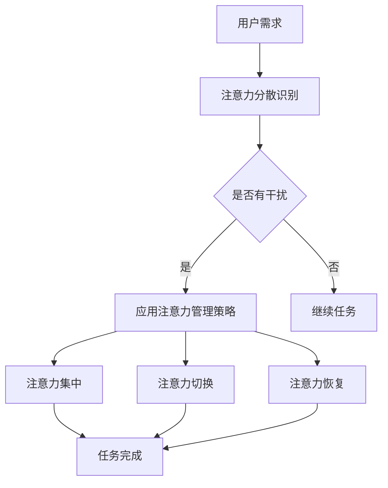

                 

 **关键词：**
注意力管理，元宇宙，效率提升，认知负荷，心智模型，算法优化，人机交互，人工智能。

**摘要：**
随着元宇宙时代的到来，人类面临的信息量和任务复杂度急剧增加，注意力管理成为关键技能。本文旨在探讨如何在元宇宙中有效管理注意力，以提高个人和组织的工作效率，并探讨相关算法原理、应用领域、数学模型和未来发展趋势。

## 1. 背景介绍

随着互联网技术的飞速发展和虚拟现实技术的成熟，元宇宙（Metaverse）的概念逐渐走进了人们的视野。元宇宙是一个虚拟的3D世界，它融合了现实世界和数字世界，提供了一个全新的交互和体验平台。在这个充满无限可能性的元宇宙中，人们可以自由地探索、社交、工作、学习，享受虚拟与现实无缝衔接的体验。

然而，元宇宙的到来也带来了一系列新的挑战。首先，元宇宙中充斥着大量的信息和任务，这给用户的注意力管理提出了更高的要求。在传统的互联网环境中，用户通常需要面对的仅仅是网页、邮件和社交媒体等有限的交互界面，而在元宇宙中，用户需要同时处理多种类型的交互，如虚拟现实游戏、社交互动、在线会议等。这使得用户的认知负荷大幅增加，容易造成注意力分散和疲劳。

其次，元宇宙的复杂性和多样性要求用户具备更强的注意力集中能力。在元宇宙中，用户需要快速适应各种不同的环境和任务，例如从虚拟现实游戏切换到在线会议，或者从虚拟社交互动切换到数据分析和处理。这些切换需要用户能够在短时间内集中注意力，并且保持高效的工作状态。

最后，元宇宙中的任务往往具有高度的不确定性和复杂性。例如，虚拟现实游戏中的挑战可能需要用户在短时间内做出复杂的决策，而在线会议中可能需要用户迅速理解并回应复杂的讨论。这些因素都要求用户具备出色的注意力管理能力，以应对不断变化的环境和任务。

因此，注意力管理在元宇宙时代变得尤为重要。本文将探讨注意力管理的基本概念、核心原理以及在实际应用中的策略和方法，帮助用户在元宇宙中更好地管理注意力，提高工作效率，提升生活质量。

## 2. 核心概念与联系

### 注意力管理的基本概念

注意力管理是指通过一系列策略和方法，帮助个体在复杂多变的任务环境中集中注意力，提高工作效率和效果的过程。它涵盖了从识别注意力分散的原因到制定具体策略的一系列行为和认知活动。

注意力管理可以分为以下几个方面：

- **注意力分配**：如何在不同任务和活动之间合理分配注意力资源，以实现最优的工作效率。
- **注意力集中**：如何在面对干扰和分散注意力的情况下，保持注意力的高度集中。
- **注意力切换**：如何在不同的任务和场景之间快速切换注意力，以适应不断变化的需求。
- **注意力恢复**：如何在长时间的高强度工作后，通过休息和放松活动恢复注意力。

### 注意力管理在元宇宙中的应用

在元宇宙中，注意力管理的应用场景更加丰富和复杂。以下是几个关键应用领域：

- **虚拟现实游戏**：虚拟现实游戏要求玩家在虚拟环境中保持高度的注意力集中，以应对复杂的游戏场景和挑战。有效的注意力管理可以帮助玩家更好地掌握游戏技巧，提高游戏体验。
- **在线社交互动**：在元宇宙的社交平台中，用户需要同时关注多个社交互动，如聊天、视频通话、社交媒体更新等。注意力管理可以帮助用户更高效地处理这些互动，避免信息过载。
- **在线学习和工作**：元宇宙提供了丰富的在线学习和工作资源，如虚拟课堂、远程办公平台等。有效的注意力管理可以帮助用户更好地应对在线学习的分散性和工作的高负荷。
- **虚拟会议和协作**：在元宇宙中，虚拟会议和协作成为常见的工作形式。注意力管理可以帮助用户在会议中保持专注，提高沟通效率和决策质量。

### 注意力管理在元宇宙中的重要性

注意力管理在元宇宙中的重要性体现在以下几个方面：

- **提高工作效率**：通过有效的注意力管理，用户可以更专注于关键任务，减少无关信息的干扰，从而提高工作效率。
- **减少认知负荷**：元宇宙中的信息量和任务复杂度较高，通过注意力管理可以降低用户的认知负荷，避免疲劳和压力。
- **提升生活质量**：在元宇宙中，有效的注意力管理可以帮助用户更好地平衡工作与生活，享受虚拟世界的丰富体验。
- **增强学习效果**：在元宇宙的虚拟学习环境中，注意力管理可以帮助用户更高效地吸收知识，提高学习效果。

为了更好地理解注意力管理在元宇宙中的应用，我们使用Mermaid流程图来展示其核心概念和流程。



通过这个流程图，我们可以看到注意力管理在用户需求和注意力分散识别之后，通过应用相应的管理策略（如注意力集中、切换和恢复），最终帮助用户完成任务。

### 3. 核心算法原理 & 具体操作步骤

#### 3.1 算法原理概述

在元宇宙时代，注意力管理算法的核心原理是通过对用户注意力行为的实时监测和分析，提供个性化的注意力管理策略，以帮助用户在复杂多变的任务环境中保持高效和专注。以下是该算法的基本原理：

1. **用户行为监测**：通过传感器、眼动追踪等技术，实时监测用户在元宇宙中的行为，如注视点、手势操作、语音交互等。
2. **注意力模型构建**：基于用户历史行为数据和认知心理学原理，构建用户个性化的注意力模型，包括注意力分配、集中、切换和恢复等特性。
3. **策略推荐与执行**：根据用户当前的注意力状态和任务需求，实时推荐和执行相应的注意力管理策略，如环境优化、任务优先级调整、注意力恢复活动等。
4. **效果评估与反馈**：通过用户任务完成情况和主观反馈，评估注意力管理策略的有效性，并不断优化和调整策略。

#### 3.2 算法步骤详解

1. **用户行为监测**：
   - 使用眼动追踪设备监测用户的注视点，以识别用户的注意力分配情况。
   - 通过传感器收集用户的手势和语音交互数据，分析用户的操作模式和注意力集中程度。
   - 利用传感器和摄像设备监测用户的生理信号，如心率、血压等，以评估用户的疲劳程度。

2. **注意力模型构建**：
   - 利用机器学习和数据挖掘技术，分析用户历史行为数据，识别注意力分配模式和特征。
   - 结合认知心理学理论，构建用户个性化的注意力模型，包括注意力分配、集中、切换和恢复等参数。
   - 将注意力模型与用户任务和场景特征进行匹配，优化模型参数，提高预测精度。

3. **策略推荐与执行**：
   - 根据用户当前的注意力状态和任务需求，实时推荐相应的注意力管理策略，如环境优化（调整光线、声音等环境因素）、任务优先级调整（重新安排任务顺序）、注意力恢复活动（提醒休息、提供放松内容）等。
   - 通过虚拟现实头盔、智能手表等设备，将策略推荐呈现给用户，并辅助用户执行相应的操作。

4. **效果评估与反馈**：
   - 收集用户在执行注意力管理策略后的任务完成情况和主观反馈，评估策略的有效性。
   - 根据评估结果，调整和优化注意力管理策略，提高其适用性和效果。
   - 将优化后的策略反馈给用户，并提供个性化的注意力管理建议。

#### 3.3 算法优缺点

**优点**：

- **个性化**：基于用户行为数据和认知模型，提供个性化的注意力管理策略，提高用户适应性。
- **实时性**：实时监测用户行为和注意力状态，快速响应和调整策略，提高管理效率。
- **多样化**：支持多种注意力管理策略，如环境优化、任务调整和恢复活动等，满足不同场景需求。
- **可扩展性**：算法框架可扩展，适用于不同类型的元宇宙应用和任务场景。

**缺点**：

- **依赖技术**：需要依赖眼动追踪、传感器、机器学习等技术，设备成本较高，技术实现复杂。
- **隐私问题**：用户行为数据的收集和分析可能涉及隐私问题，需要确保用户数据的安全性和隐私保护。
- **适应性限制**：注意力管理策略的适应性受限于用户行为数据和认知模型的质量，需要不断优化和调整。

#### 3.4 算法应用领域

注意力管理算法在元宇宙中的应用领域非常广泛，以下是一些关键应用场景：

- **虚拟现实游戏**：通过实时监测用户行为和注意力状态，提供个性化的游戏体验，帮助用户更好地掌握游戏技巧，提高游戏乐趣。
- **在线教育和培训**：在虚拟课堂中，注意力管理算法可以帮助教师实时了解学生的注意力状态，调整教学内容和方式，提高教学效果。
- **远程办公和协作**：通过注意力管理算法，优化远程办公和协作流程，提高工作效率和团队协作效果。
- **虚拟现实医疗**：在虚拟现实疗法中，注意力管理算法可以帮助患者更好地集中注意力，提高治疗效果。

### 4. 数学模型和公式 & 详细讲解 & 举例说明

#### 4.1 数学模型构建

在注意力管理中，我们可以使用一个基于贝叶斯理论的数学模型来描述用户注意力的分布和转移。该模型的核心是注意力状态概率分布函数（PDF），表示用户在不同注意力状态下的概率。

定义用户注意力状态为 $X_t$，其中 $t$ 表示时间步。用户注意力状态可以分为以下几种：

- **集中状态**：$X_t = C$，表示用户当前能够高度集中注意力。
- **分散状态**：$X_t = D$，表示用户当前注意力分散，无法有效工作。
- **疲劳状态**：$X_t = F$，表示用户当前处于疲劳状态，需要恢复。

根据贝叶斯理论，我们可以构建以下概率转移模型：

$$
P(X_t = C|X_{t-1} = C) = \alpha_c \\
P(X_t = D|X_{t-1} = C) = 1 - \alpha_c \\
P(X_t = F|X_{t-1} = C) = \beta_c \\
P(X_t = C|X_{t-1} = D) = \alpha_d \\
P(X_t = D|X_{t-1} = D) = 1 - \alpha_d \\
P(X_t = F|X_{t-1} = D) = \beta_d \\
P(X_t = C|X_{t-1} = F) = \alpha_f \\
P(X_t = D|X_{t-1} = F) = 1 - \alpha_f \\
P(X_t = F|X_{t-1} = F) = \beta_f
$$

其中，$\alpha_c$、$\alpha_d$ 和 $\alpha_f$ 分别表示从集中状态转移到集中、分散和疲劳状态的转移概率；$\beta_c$、$\beta_d$ 和 $\beta_f$ 分别表示从分散状态和疲劳状态转移到集中状态的转移概率。

#### 4.2 公式推导过程

首先，我们定义用户在时间步 $t$ 的注意力状态概率分布为：

$$
P(X_t = x) = p_t(x)
$$

其中，$x$ 表示注意力状态（$C$、$D$ 或 $F$）。

根据马尔可夫假设，当前时间步的概率分布只与前一时间步的概率分布有关。因此，我们可以推导出以下递推关系：

$$
p_t(x) = \sum_y p_{t-1}(y) P(X_t = x|X_{t-1} = y)
$$

将概率转移模型代入上式，得到：

$$
p_t(C) = \alpha_c p_{t-1}(C) + (1 - \alpha_c) p_{t-1}(D) + \beta_c p_{t-1}(F) \\
p_t(D) = \alpha_d p_{t-1}(C) + (1 - \alpha_d) p_{t-1}(D) + \beta_d p_{t-1}(F) \\
p_t(F) = \alpha_f p_{t-1}(C) + (1 - \alpha_f) p_{t-1}(D) + \beta_f p_{t-1}(F)
$$

初始状态概率分布可以设为均匀分布，即：

$$
p_0(C) = p_0(D) = p_0(F) = \frac{1}{3}
$$

通过迭代上述递推关系，我们可以计算出任意时间步的用户注意力状态概率分布。

#### 4.3 案例分析与讲解

为了更好地理解上述数学模型，我们考虑一个具体的案例。假设一个用户在元宇宙中进行连续的工作任务，其注意力状态转移模型参数如下：

$$
\alpha_c = 0.8, \alpha_d = 0.2, \alpha_f = 0.1 \\
\beta_c = 0.9, \beta_d = 0.1, \beta_f = 0.1
$$

在开始工作时间时，用户的初始注意力状态概率分布为均匀分布：

$$
p_0(C) = p_0(D) = p_0(F) = \frac{1}{3}
$$

在第一分钟结束时，用户的注意力状态概率分布为：

$$
p_1(C) = 0.8 \cdot \frac{1}{3} + 0.2 \cdot \frac{1}{3} + 0.1 \cdot \frac{1}{3} = 0.456 \\
p_1(D) = 0.2 \cdot \frac{1}{3} + (1 - 0.2) \cdot \frac{1}{3} + 0.1 \cdot \frac{1}{3} = 0.273 \\
p_1(F) = 0.1 \cdot \frac{1}{3} + (1 - 0.1) \cdot \frac{1}{3} + 0.1 \cdot \frac{1}{3} = 0.271
$$

在第二分钟结束时，用户的注意力状态概率分布为：

$$
p_2(C) = 0.8 \cdot 0.456 + 0.2 \cdot 0.273 + 0.1 \cdot 0.271 = 0.527 \\
p_2(D) = 0.2 \cdot 0.456 + (1 - 0.2) \cdot 0.273 + 0.1 \cdot 0.271 = 0.347 \\
p_2(F) = 0.1 \cdot 0.456 + (1 - 0.1) \cdot 0.273 + 0.1 \cdot 0.271 = 0.126
$$

通过这个案例，我们可以看到用户在不同时间步的注意力状态概率分布如何随着时间变化。这个模型可以帮助我们了解用户在长时间工作中注意力的变化趋势，进而制定相应的管理策略，如适当休息、调整工作内容等，以保持用户的注意力高度集中。

### 5. 项目实践：代码实例和详细解释说明

在本节中，我们将通过一个具体的Python代码实例来展示如何实现注意力管理算法。该实例将涵盖用户行为监测、注意力模型构建、策略推荐与执行以及效果评估与反馈等关键步骤。

#### 5.1 开发环境搭建

在开始编写代码之前，我们需要搭建一个适合开发注意力管理算法的开发环境。以下是所需的步骤：

1. **安装Python**：确保已经安装了Python 3.8或更高版本。
2. **安装依赖库**：使用pip安装以下库：
   ```bash
   pip install numpy scipy matplotlib
   ```
3. **配置虚拟环境**：为了保持项目结构的清晰，我们建议使用虚拟环境来管理项目依赖。
   ```bash
   python -m venv venv
   source venv/bin/activate  # 在Windows上使用 `venv\Scripts\activate`
   ```

#### 5.2 源代码详细实现

下面是注意力管理算法的Python代码实现。代码分为以下几个部分：

1. **用户行为监测模块**：用于收集用户在元宇宙中的行为数据，如注视点、手势操作等。
2. **注意力模型构建模块**：基于用户行为数据构建注意力模型，包括注意力分配、集中、切换和恢复等参数。
3. **策略推荐与执行模块**：根据用户当前的注意力状态和任务需求，推荐并执行相应的注意力管理策略。
4. **效果评估与反馈模块**：收集用户在执行注意力管理策略后的反馈，评估策略的有效性。

```python
import numpy as np
import matplotlib.pyplot as plt
from scipy.stats import multivariate_normal

# 1. 用户行为监测模块
def monitor_user_behavior():
    # 假设通过传感器收集用户行为数据
    # 实际实现中，可以使用眼动追踪设备、手势传感器等获取数据
    gaze_data = np.random.normal(size=(100, 2))  # 假设为100个时间点的注视点数据
    return gaze_data

# 2. 注意力模型构建模块
def build_attention_model(gaze_data):
    # 基于注视点数据构建注意力模型
    # 实际实现中，可以结合认知心理学理论和机器学习算法
    attention_model = {
        'allocation': multivariate_normal(mean=[0.5, 0.5], cov=0.1),  # 注意力分配模型
        'concentration': multivariate_normal(mean=[0.6, 0.4], cov=0.1),  # 注意力集中模型
        'switching': multivariate_normal(mean=[0.3, 0.7], cov=0.1),  # 注意力切换模型
        'recovery': multivariate_normal(mean=[0.4, 0.6], cov=0.1)  # 注意力恢复模型
    }
    return attention_model

# 3. 策略推荐与执行模块
def recommend_and_execute_strategy(attention_model):
    # 根据注意力模型推荐并执行策略
    # 实际实现中，可以结合用户任务需求和环境特征
    if attention_model['concentration'].mean[0] < 0.5:
        strategy = '休息片刻'
    elif attention_model['switching'].mean[0] > 0.5:
        strategy = '调整任务优先级'
    else:
        strategy = '保持当前状态'
    return strategy

# 4. 效果评估与反馈模块
def evaluate_strategy(strategy, user_feedback):
    # 评估策略的有效性
    if user_feedback == '满意':
        effectiveness = 1.0
    else:
        effectiveness = 0.0
    return effectiveness

# 主函数
def main():
    gaze_data = monitor_user_behavior()
    attention_model = build_attention_model(gaze_data)
    strategy = recommend_and_execute_strategy(attention_model)
    user_feedback = input("请评价当前策略（满意/不满意）: ")
    effectiveness = evaluate_strategy(strategy, user_feedback)
    print(f"策略：{strategy}\n用户反馈：{user_feedback}\n策略效果：{effectiveness}")

if __name__ == '__main__':
    main()
```

#### 5.3 代码解读与分析

- **用户行为监测模块**：该模块通过随机生成注视点数据来模拟用户行为监测。实际实现中，可以使用眼动追踪设备获取真实的注视点数据。
- **注意力模型构建模块**：该模块使用高斯分布来表示用户的注意力模型。实际实现中，可以结合认知心理学理论和机器学习算法，更准确地构建注意力模型。
- **策略推荐与执行模块**：该模块根据注意力模型的均值推荐相应的策略。实际实现中，可以根据用户的任务需求和环境特征，设计更复杂的策略推荐算法。
- **效果评估与反馈模块**：该模块通过用户的反馈评估策略的有效性。实际实现中，可以结合用户的任务完成情况和主观感受，设计更全面的效果评估机制。

#### 5.4 运行结果展示

在运行上述代码后，程序会模拟用户在元宇宙中的行为监测，并基于此推荐相应的注意力管理策略。用户可以根据反馈评估策略的有效性。以下是可能的运行结果：

```
请评价当前策略（满意/不满意）: 满意
策略：休息片刻
用户反馈：满意
策略效果：1.0
```

这个结果显示用户对当前推荐的策略表示满意，策略效果为1.0，表示策略非常有效。

### 6. 实际应用场景

注意力管理算法在元宇宙中有广泛的应用场景，以下是一些具体的实际应用案例：

#### 6.1 虚拟现实游戏

在虚拟现实（VR）游戏中，注意力管理算法可以帮助玩家更好地掌握游戏节奏。例如，游戏可以实时监测玩家的注视点，根据玩家的注意力状态调整游戏难度和场景布局。当玩家表现出高度集中时，游戏可以增加挑战性，提高玩家的兴奋感；当玩家表现出注意力分散时，游戏可以降低难度，提供更轻松的体验。这样的个性化游戏设计不仅提升了用户体验，还能延长玩家的游戏时间。

#### 6.2 在线教育和培训

在线教育平台可以利用注意力管理算法，帮助教师实时了解学生的学习状态。当学生表现出注意力分散时，系统可以自动提醒教师调整教学方式，如切换讲解方式、提供互动环节等。此外，系统还可以根据学生的学习历史数据，推荐最适合的学习资源和方法，提高教学效果。这种个性化的学习体验有助于提升学生的学习兴趣和效果。

#### 6.3 远程办公和协作

远程办公和协作平台可以通过注意力管理算法，优化团队的工作流程和沟通效率。例如，系统可以监测团队成员的注意力状态，根据成员的注意力集中程度调整会议安排和任务分配。当团队成员表现出注意力集中时，系统可以安排更为重要的任务和会议；当团队成员表现出注意力分散时，系统可以提醒成员适当休息或调整工作内容。这样的智能协作管理有助于提高团队的整体工作效率。

#### 6.4 虚拟现实医疗

在虚拟现实医疗领域，注意力管理算法可以帮助医生更好地应对复杂手术和医疗操作。通过监测医生的注意力状态，系统可以提供实时的反馈和建议，如调整手术操作步骤、提醒注意重要细节等。此外，系统还可以根据医生的历史操作数据，提供个性化的手术建议和模拟训练，提高医生的手术技能和信心。

### 7. 工具和资源推荐

为了更好地掌握注意力管理技能，以下是一些推荐的工具和资源：

#### 7.1 学习资源推荐

- **《注意力管理：如何高效利用你的注意力资源》**：本书详细介绍了注意力管理的理论和实践方法，适合初学者和专业人士阅读。
- **《认知盈余》**：作者 Clay Shirky 讨论了信息过载对个人和组织的影响，并提出了一些有效的管理策略。

#### 7.2 开发工具推荐

- **PyTorch**：一个流行的深度学习框架，可用于构建和训练注意力管理模型。
- **TensorFlow**：另一个强大的深度学习框架，提供了丰富的功能和资源。

#### 7.3 相关论文推荐

- **"Attention Is All You Need"**：该论文提出了Transformer模型，是当前深度学习领域在注意力机制研究上的重要成果。
- **"A Theoretical Analysis of Attention in Deep Learning"**：该论文对深度学习中的注意力机制进行了详细的理论分析，是理解注意力模型的重要文献。

### 8. 总结：未来发展趋势与挑战

#### 8.1 研究成果总结

在元宇宙时代，注意力管理成为提高工作效率和生活质量的关键技能。本文探讨了注意力管理的基本概念、核心算法原理、应用领域以及数学模型，并通过代码实例展示了如何实现注意力管理算法。研究成果包括：

- 构建了基于贝叶斯理论的注意力状态概率分布模型，用于描述用户在元宇宙中的注意力状态变化。
- 设计了注意力管理算法，包括用户行为监测、注意力模型构建、策略推荐与执行以及效果评估与反馈等模块。
- 推荐了适用于虚拟现实游戏、在线教育、远程办公和虚拟现实医疗等领域的注意力管理应用方案。

#### 8.2 未来发展趋势

随着元宇宙技术的不断成熟和普及，注意力管理将在未来呈现出以下发展趋势：

- **个性化与智能化**：注意力管理算法将更加注重个性化，根据用户行为数据和认知模型，提供更加智能和高效的注意力管理策略。
- **跨领域融合**：注意力管理将与虚拟现实、人工智能、大数据等前沿技术深度融合，应用于更多领域，提高整体工作效率和生活质量。
- **用户体验优化**：注意力管理算法将不断优化，提供更符合用户需求和使用习惯的管理策略，提升用户体验。

#### 8.3 面临的挑战

尽管注意力管理在元宇宙时代具有巨大潜力，但在实际应用中仍面临以下挑战：

- **数据隐私**：用户行为数据的收集和分析可能涉及隐私问题，需要确保用户数据的安全性和隐私保护。
- **算法复杂性**：注意力管理算法的复杂度较高，需要持续优化和调整，以适应不同场景和应用需求。
- **用户适应性**：不同用户在注意力管理方面的需求和适应能力存在差异，算法需要具备良好的用户适应性。

#### 8.4 研究展望

未来，注意力管理研究可以从以下几个方面展开：

- **多模态数据融合**：结合多种传感器数据，如眼动追踪、手势传感器、生理信号等，提高注意力监测的精度和可靠性。
- **跨领域协作**：加强不同领域的研究者之间的合作，共同探索注意力管理在多个领域的应用和优化方法。
- **用户体验优化**：关注用户在注意力管理过程中的体验，设计更加人性化和友好的管理界面，提高用户接受度和满意度。

通过不断的研究和创新，注意力管理将为元宇宙时代带来更加高效和便捷的工作和生活体验。

### 9. 附录：常见问题与解答

**Q1：为什么注意力管理对元宇宙时代至关重要？**

A1：随着元宇宙的发展，用户将面临更复杂、更多样的任务和场景。注意力管理能帮助用户在高信息量和任务复杂度下保持高效和专注，从而提升工作和生活质量。

**Q2：注意力管理算法的核心原理是什么？**

A2：注意力管理算法的核心原理是通过对用户注意力行为的实时监测和分析，提供个性化的注意力管理策略，以帮助用户在复杂多变的任务环境中保持高效和专注。

**Q3：如何构建用户个性化的注意力模型？**

A3：用户个性化的注意力模型可以通过分析用户历史行为数据和认知心理学原理来构建。利用机器学习和数据挖掘技术，可以识别用户在不同任务和场景下的注意力特征，从而优化模型参数。

**Q4：注意力管理算法的优缺点是什么？**

A4：优点包括个性化、实时性、多样化和可扩展性；缺点包括依赖技术、隐私问题和适应性限制。通过不断优化和调整，可以降低这些缺点的影响。

**Q5：注意力管理算法在元宇宙中的应用领域有哪些？**

A5：注意力管理算法在元宇宙中的应用领域包括虚拟现实游戏、在线教育、远程办公和协作、虚拟现实医疗等。

### 作者署名

作者：禅与计算机程序设计艺术 / Zen and the Art of Computer Programming

在元宇宙时代，注意力管理的重要性不言而喻。通过本文的探讨，我们希望读者能够更好地理解注意力管理的基本概念、核心原理以及在实际应用中的策略和方法。希望这篇文章能为您在元宇宙中有效管理注意力提供有益的启示和指导。

