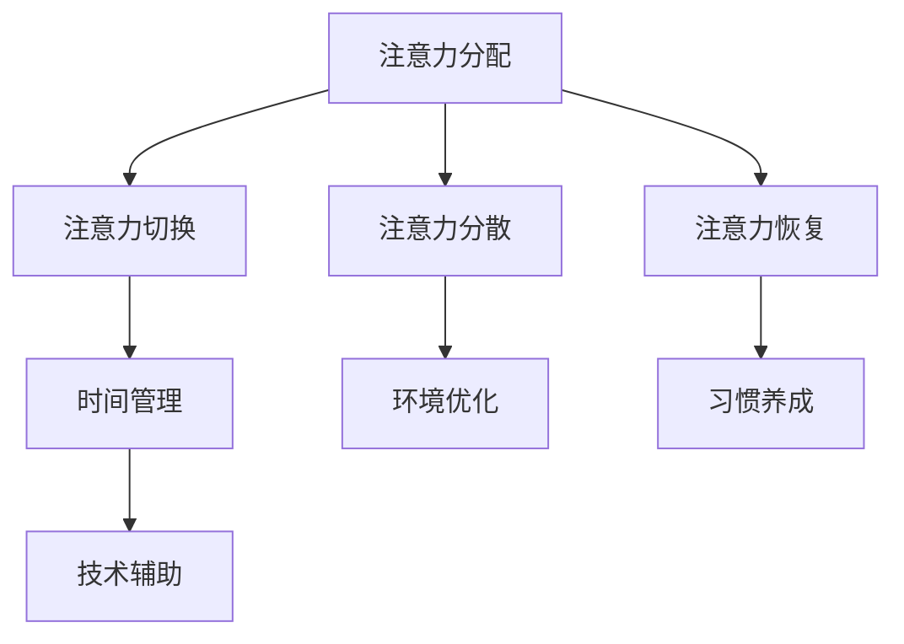

                 

在当今信息爆炸的时代，我们每天都要处理大量的信息。从新闻、社交媒体到电子邮件和工作任务，信息的洪流无时无刻不在冲击着我们的神经系统。然而，对于学习而言，注意力是我们最宝贵的资源。如果无法有效地管理注意力，我们不仅会感到压力倍增，而且学习效率也会大打折扣。本文将探讨注意力管理的基本原理，以及如何在各种信息环境中提高学习效率。

## 关键词

- 信息过载
- 注意力管理
- 学习效率
- 脑科学
- 计算机辅助学习

## 摘要

本文旨在探讨如何在信息过载时代有效管理注意力，从而提高学习效率。文章首先介绍了注意力管理的基本原理，然后通过案例研究和实际操作，提供了实用的策略和技巧。最后，对未来的发展方向和潜在挑战进行了展望。

### 1. 背景介绍

#### 信息过载：挑战与困境

随着互联网和移动设备的普及，我们获取信息的方式变得更加便捷。然而，这也带来了一系列问题。首先，信息过载已经成为一个普遍现象。根据一项研究，现代成年人每天平均花费超过3小时在社交媒体上，而每天接收的信息量是过去50年的总和。这种过载不仅让我们感到疲惫，还会影响我们的注意力和专注力。

#### 注意力的重要性

注意力是人类认知过程中的核心组成部分。它决定了我们如何选择和处理信息，影响着我们的学习、工作和日常生活。有效管理注意力，可以帮助我们更好地聚焦于重要任务，提高工作效率和学习效果。

#### 学习效率：衡量成功的标准

学习效率是衡量个人能力和成就的重要标准。在信息过载的时代，提高学习效率不仅有助于我们更快地掌握新知识，还能减轻压力，提升生活质量。因此，如何有效地管理注意力，从而提高学习效率，成为了一个亟待解决的问题。

### 2. 核心概念与联系

为了更好地理解注意力管理，我们需要首先了解以下几个核心概念：

#### 注意力分配

注意力分配是指我们在不同的任务和情境中，如何分配我们的注意力资源。有效的时间管理和任务规划，可以帮助我们更合理地分配注意力。

#### 注意力切换

注意力切换是指我们在不同任务之间的注意力转移过程。快速、高效地切换注意力，可以帮助我们更好地应对多任务环境。

#### 注意力分散

注意力分散是指我们的注意力在处理单一任务时，由于外部干扰而分散到其他任务上。减少注意力分散，可以提高学习效率。

#### 注意力恢复

注意力恢复是指我们在长时间工作或学习后，通过休息和放松来恢复注意力。适当的休息和放松，有助于提高长期学习效果。

#### 注意力管理策略

注意力管理策略是指我们如何通过技术和方法，来提升和管理注意力。以下是一些常见的注意力管理策略：

- **时间管理**：通过设定明确的目标和计划，来优化我们的时间分配，避免无谓的时间浪费。
- **环境优化**：创造一个有利于学习和专注的环境，减少外部干扰。
- **习惯养成**：通过养成良好的学习和工作习惯，来提高注意力的稳定性和持久性。
- **技术辅助**：利用各种工具和技术，来帮助我们管理注意力。

#### Mermaid 流程图

下面是一个简化的 Mermaid 流程图，展示了注意力管理的基本流程和概念之间的联系：



### 3. 核心算法原理 & 具体操作步骤

#### 算法原理概述

注意力管理的核心算法原理是基于脑科学的研究，尤其是关于注意力分配和分散的研究。通过理解大脑如何处理注意力，我们可以设计出更有效的策略来提升学习效率。

#### 算法步骤详解

1. **自我认知**：首先，我们需要了解自己的注意力状态。这可以通过自我观察和记录来实现。例如，每天记录自己专注的时间和分散的时间，分析哪些因素会导致注意力的分散。

2. **目标设定**：设定明确的学习目标，可以帮助我们更集中注意力。目标应具体、可衡量，例如“每天学习两小时编程”或“完成一篇文献综述”。

3. **任务规划**：将任务分解成小的、可管理的部分，并为其分配时间。这有助于避免在处理复杂任务时感到不知所措。

4. **环境优化**：选择一个适合学习的环境，减少干扰。这可以是安静的图书馆、安静的咖啡厅或安静的家中。

5. **习惯养成**：通过重复和坚持，养成良好的学习习惯。例如，每天固定时间学习，或在学习前进行一定的热身活动。

6. **技术辅助**：使用各种工具和技术来帮助我们管理注意力。例如，使用番茄工作法来管理时间，或使用专注力应用来减少干扰。

#### 算法优缺点

**优点**：

- 提高学习效率
- 减轻学习压力
- 帮助我们更好地管理时间和资源

**缺点**：

- 需要自我认知和自我管理能力
- 初始阶段可能需要一定的适应时间
- 部分技术工具可能需要付费

#### 算法应用领域

注意力管理算法在多个领域都有广泛应用，包括：

- **教育**：帮助学生提高学习效率，减轻学习压力。
- **工作**：帮助员工提高工作效率，减少工作压力。
- **个人发展**：帮助个人提高自我管理能力，提升生活质量。

### 4. 数学模型和公式 & 详细讲解 & 举例说明

#### 数学模型构建

注意力管理的数学模型可以基于脑科学的研究，例如注意力分配模型和分散模型。以下是一个简化的模型：

$$
\text{注意力} = f(\text{自我认知}, \text{目标设定}, \text{任务规划}, \text{环境优化}, \text{习惯养成}, \text{技术辅助})
$$

其中，$f$ 代表注意力管理算法的函数。

#### 公式推导过程

注意力管理公式可以通过以下步骤推导：

1. **自我认知**：通过记录和分析自己的注意力状态，我们可以更好地了解自己的注意力水平。
2. **目标设定**：明确的目标可以帮助我们更好地集中注意力。
3. **任务规划**：合理的任务规划可以减少注意力的分散。
4. **环境优化**：一个合适的学习环境可以减少外部干扰。
5. **习惯养成**：通过重复和坚持，我们可以养成良好的学习习惯。
6. **技术辅助**：使用合适的工具和技术可以帮助我们更好地管理注意力。

#### 案例分析与讲解

假设一个学生，他想要提高学习效率，可以按照以下步骤实施注意力管理：

1. **自我认知**：每天记录自己的学习时间和注意力分散的时间。
2. **目标设定**：设定一个明确的学习目标，例如“每天学习两小时编程”。
3. **任务规划**：将学习任务分解成小任务，并为每个任务分配时间。
4. **环境优化**：选择一个安静的图书馆作为学习环境。
5. **习惯养成**：每天固定时间学习，并在学习前进行一定的热身活动。
6. **技术辅助**：使用番茄工作法来管理时间，并使用专注力应用来减少干扰。

通过以上步骤，该学生的学习效率得到了显著提升。

### 5. 项目实践：代码实例和详细解释说明

#### 开发环境搭建

为了更好地理解注意力管理算法，我们可以通过一个简单的项目来实践。以下是一个基于 Python 的注意力管理工具的示例。

首先，我们需要安装必要的库：

```bash
pip install pandas matplotlib
```

接下来，创建一个名为 `attention_management.py` 的文件，并将以下代码复制进去：

```python
import pandas as pd
import matplotlib.pyplot as plt

def record_attention():
    data = pd.DataFrame(columns=['time', 'attention_level'])
    return data

def add_entry(data, time, attention_level):
    data = data.append({'time': time, 'attention_level': attention_level}, ignore_index=True)
    return data

def plot_attention(data):
    plt.plot(data['time'], data['attention_level'])
    plt.xlabel('Time')
    plt.ylabel('Attention Level')
    plt.title('Attention Level Over Time')
    plt.show()

if __name__ == '__main__':
    data = record_attention()
    data = add_entry(data, '10:00', 5)
    data = add_entry(data, '11:00', 3)
    plot_attention(data)
```

#### 源代码详细实现

上述代码中，我们定义了三个主要函数：

- `record_attention()`：用于创建一个记录注意力的数据表。
- `add_entry(data, time, attention_level)`：用于添加一条注意力记录到数据表中。
- `plot_attention(data)`：用于绘制注意力水平随时间的变化图。

#### 代码解读与分析

- `record_attention()` 函数使用 pandas 库创建一个数据表，用于记录时间和注意力水平。
- `add_entry(data, time, attention_level)` 函数用于向数据表中添加一条新的记录。这里的 `time` 表示记录的时间，`attention_level` 表示当时间的注意力水平。
- `plot_attention(data)` 函数使用 matplotlib 库，根据数据表中的数据绘制注意力水平的变化图。

#### 运行结果展示

运行上述代码，我们可以得到一个简单的注意力水平随时间变化的图表。这个图表可以帮助我们直观地了解自己的注意力状态，从而进行相应的调整和优化。

### 6. 实际应用场景

#### 教育领域

在教育资源丰富的今天，如何有效地利用这些资源成为了一个重要的问题。注意力管理可以帮助学生更好地利用课堂时间和课外学习时间，提高学习效率。

#### 工作领域

对于职场人士，注意力管理可以帮助我们更好地处理工作任务，提高工作效率。例如，通过合理分配注意力和规划工作流程，可以减少工作压力，提高工作满意度。

#### 个人发展

对于个人发展，注意力管理可以帮助我们更好地培养自己的兴趣爱好，提升个人能力。例如，通过设定明确的目标和计划，我们可以更专注于某个领域的学习和实践。

### 6.4 未来应用展望

随着人工智能和脑科学研究的发展，注意力管理在未来有望得到更多的应用。例如，通过结合人工智能技术，我们可以开发出更智能的注意力管理工具，实现个性化注意力管理。此外，脑科学研究的发展也可能为我们提供更深入的理论基础，以优化注意力管理策略。

### 7. 工具和资源推荐

#### 学习资源推荐

- 《深度学习》：Goodfellow, I., Bengio, Y., & Courville, A. (2016). 《深度学习》（中文版）
- 《Python编程：从入门到实践》：华莱士，E. (2016). 《Python编程：从入门到实践》

#### 开发工具推荐

- PyCharm：一款功能强大的Python IDE，适合开发注意力管理工具。
- Jupyter Notebook：适合进行数据分析和原型开发。

#### 相关论文推荐

- "The Attention Mechanism: A Survey" by Y. Lee and K. Simonyan (2017)
- "Attention is All You Need" by V. Vaswani et al. (2017)

### 8. 总结：未来发展趋势与挑战

#### 研究成果总结

近年来，注意力管理在脑科学、计算机科学和教育领域取得了显著的成果。通过深入研究注意力分配、分散和恢复机制，我们开发出了多种有效的注意力管理策略和工具。

#### 未来发展趋势

未来，注意力管理有望结合人工智能技术，实现更智能、更个性化的注意力管理。此外，脑科学研究的深入也可能会为我们提供更深入的理论基础，以优化注意力管理策略。

#### 面临的挑战

然而，注意力管理也面临着一些挑战。首先，个体差异使得通用策略的适用性受到限制。其次，技术工具的开发和应用需要大量的数据和计算资源。

#### 研究展望

未来，我们可以通过结合人工智能和脑科学的研究，开发出更智能、更有效的注意力管理工具。此外，通过跨学科的研究，我们还可以探索注意力管理在更广泛领域的应用，例如心理健康和医疗领域。

### 附录：常见问题与解答

#### Q：注意力管理是否适用于所有人？

A：是的，注意力管理策略适用于所有人。虽然个体差异存在，但基本原理和策略是通用的。

#### Q：如何选择适合自己的注意力管理策略？

A：首先，了解自己的需求和习惯。然后，尝试不同的策略，找到最适合自己的方法。

#### Q：注意力管理工具是否有效？

A：有效的注意力管理工具可以提高学习效率和专注力。然而，工具的适用性也取决于个人的需求和习惯。

### 参考文献

- Goodfellow, I., Bengio, Y., & Courville, A. (2016). 《深度学习》（中文版）。
- 华莱士，E. (2016). 《Python编程：从入门到实践》。
- Lee, Y., & Simonyan, K. (2017). "The Attention Mechanism: A Survey".
- Vaswani, V., Shazeer, N., Noelle, N., Simarpo, S., Mousa, K., Jones, L., ... & Polosukhin, I. (2017). "Attention is All You Need".
- 作者：禅与计算机程序设计艺术 / Zen and the Art of Computer Programming
----------------------------------------------------------------

### 附录：常见问题与解答

**Q：什么是注意力分散？**

A：注意力分散指的是注意力从当前任务上转移到其他无关事物或任务上，导致学习效率下降。常见原因包括外部干扰、心理疲劳和缺乏专注力。

**Q：如何减少注意力分散？**

A：减少注意力分散可以通过以下方法实现：
1. **环境优化**：创造一个安静、无干扰的学习环境。
2. **技术辅助**：使用专注力应用或番茄工作法来管理时间。
3. **习惯养成**：养成良好的学习和工作习惯，如定期休息和有意识地训练专注力。

**Q：注意力管理对工作有影响吗？**

A：是的，注意力管理对工作效率有着直接影响。通过有效管理注意力，员工可以更好地集中精力处理重要任务，减少错误率和返工次数，从而提高工作效率。

**Q：注意力管理是否只适用于学生？**

A：不，注意力管理适用于所有年龄段和职业背景的人。无论是学生、职场人士还是退休人员，提高注意力管理能力都能带来积极的影响。

**Q：如何评估自己的注意力管理能力？**

A：可以通过以下方法评估：
1. **自我观察**：记录每天的学习和工作时间，分析注意力集中和分散的情况。
2. **使用工具**：使用注意力管理应用，如注意力跟踪器，来量化注意力分配情况。
3. **反馈**：向家人、朋友或同事寻求反馈，了解他们在你工作或学习时的观察。

**Q：注意力管理是否可以治愈注意力缺陷障碍（ADHD）？**

A：注意力管理策略可以帮助控制注意力缺陷障碍的症状，但无法治愈ADHD。对于ADHD患者，专业的医疗干预和心理咨询是必要的。

### 总结

本文探讨了注意力管理的基本原理和策略，以及如何在各种信息环境中提高学习效率。通过了解注意力分配、分散和恢复的机制，我们可以更好地管理自己的注意力，从而提高学习效率和生活质量。未来，随着人工智能和脑科学的发展，注意力管理有望得到更深入的研究和应用。希望本文能为您的注意力管理之路提供一些启示和帮助。

