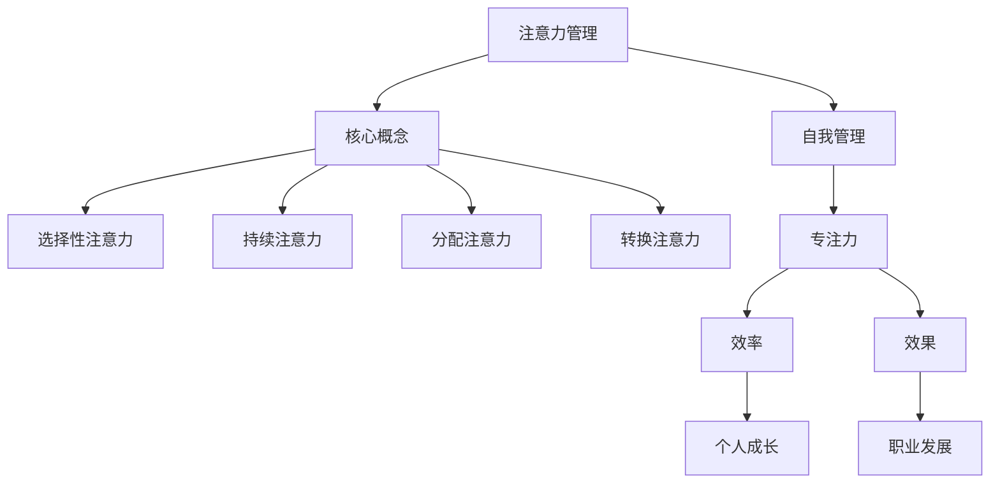

                 

关键词：注意力管理、自我管理、专注力、个人成长、职业发展、算法原理、数学模型、项目实践、未来展望

> 摘要：本文旨在探讨注意力管理在个人和职业成功中的重要作用，通过介绍专注力的核心概念、算法原理、数学模型以及项目实践，帮助读者掌握提升专注力的策略和方法，从而在复杂的环境中保持高效和有条不紊，实现个人和职业的持续成长。

## 1. 背景介绍

在当今高度信息化的时代，人们面临着前所未有的工作压力和生活节奏。有效的注意力管理成为提升个人和职业成功的关键因素。然而，很多人在面对复杂任务和多重任务时，常常感到力不从心，无法集中注意力。这种现象不仅影响了工作效率，还可能导致个人成就感下降，职业发展受限。

本文将围绕注意力管理的核心概念，探讨如何通过专注力提升个人和职业成功。首先，我们将介绍专注力的基本原理，并通过具体的算法原理和数学模型，为读者提供实用的策略和方法。接下来，我们将通过实际项目实践，展示如何将这些理论应用到实际工作中，最终实现个人和职业的飞跃。

## 2. 核心概念与联系

### 2.1 专注力的定义

专注力，又称注意力，是指个体在一定时间内，集中精神关注特定对象或任务的能力。它包括选择性注意力、持续注意力、分配注意力和转换注意力等多个维度。

选择性注意力：个体在众多刺激中选择关注特定刺激的能力。

持续注意力：个体在一段时间内，保持对特定任务的持续关注。

分配注意力：个体同时处理多个任务的能力。

转换注意力：个体在不同任务之间快速切换的能力。

### 2.2 专注力与自我管理的关系

自我管理是指个体在面对复杂环境和任务时，通过调整自身心理和行为状态，实现目标的过程。专注力作为自我管理的重要组成部分，直接影响个体在目标实现过程中的效率和效果。

高专注力有助于个体在复杂环境中迅速识别关键信息，有效应对各种挑战。同时，专注力还可以帮助个体保持积极的心态，增强自我控制力，提高工作质量和生活满意度。

### 2.3 Mermaid 流程图



## 3. 核心算法原理 & 具体操作步骤

### 3.1 算法原理概述

注意力管理算法旨在帮助个体识别、调节和优化注意力分配，从而提高工作效率和幸福感。该算法基于以下原理：

1. **注意力分配模型**：根据任务复杂度和个体心理状态，动态调整注意力资源分配。

2. **任务优先级排序**：根据任务的重要性和紧急程度，确定任务执行顺序。

3. **自我调节机制**：通过心理和行为反馈，实时调整注意力管理策略。

### 3.2 算法步骤详解

1. **任务识别**：通过任务清单和目标列表，明确当前需要关注的任务。

2. **任务评估**：根据任务复杂度、紧急程度和重要性，对任务进行评估。

3. **注意力分配**：根据评估结果，将注意力资源分配给不同任务。

4. **任务执行**：在执行任务过程中，保持注意力集中，避免干扰。

5. **自我调节**：根据任务执行效果和心理状态，调整注意力分配策略。

6. **反馈与优化**：在任务完成后，进行自我反馈，总结经验，优化注意力管理策略。

### 3.3 算法优缺点

#### 优点

1. **提高工作效率**：通过优化注意力分配，提高任务执行效率。

2. **增强自我控制力**：通过自我调节机制，增强个体自我控制力。

3. **提升生活质量**：通过专注力的提升，降低工作压力，提高生活满意度。

#### 缺点

1. **初期适应难度较大**：个体需要一定时间适应注意力管理算法。

2. **任务评估难度**：任务评估的准确性直接影响算法效果。

### 3.4 算法应用领域

1. **职场人士**：帮助职场人士提高工作效率，实现职业发展。

2. **学生群体**：帮助学生提高学习效率，提高学业成绩。

3. **老年人群体**：帮助老年人保持注意力，提高生活质量。

## 4. 数学模型和公式 & 详细讲解 & 举例说明

### 4.1 数学模型构建

注意力管理数学模型主要包括以下组成部分：

1. **注意力分配模型**：定义注意力资源分配的数学模型。

2. **任务优先级模型**：定义任务优先级的数学模型。

3. **自我调节模型**：定义自我调节的数学模型。

### 4.2 公式推导过程

#### 注意力分配模型

设个体注意力资源总量为\( A \)，任务集合为\( T = \{ t_1, t_2, ..., t_n \} \)，则注意力分配模型为：

$$
a_t = \frac{p_t \times e_t}{\sum_{i=1}^{n} p_i \times e_i}
$$

其中，\( a_t \)为任务\( t \)的注意力分配比例，\( p_t \)为任务\( t \)的优先级，\( e_t \)为任务\( t \)的紧急程度。

#### 任务优先级模型

设任务集合为\( T = \{ t_1, t_2, ..., t_n \} \)，优先级集合为\( P = \{ p_1, p_2, ..., p_n \} \)，则任务优先级模型为：

$$
p_t = \alpha_i \times e_t + \beta_i \times c_t
$$

其中，\( p_t \)为任务\( t \)的优先级，\( \alpha_i \)为任务紧急程度权重，\( \beta_i \)为任务重要性权重，\( e_t \)为任务\( t \)的紧急程度，\( c_t \)为任务\( t \)的重要性。

#### 自我调节模型

设自我调节系数为\( \lambda \)，则自我调节模型为：

$$
r_t = \lambda \times (a_t - a_{t-1})
$$

其中，\( r_t \)为任务\( t \)的自我调节值，\( a_t \)为当前注意力分配比例，\( a_{t-1} \)为上一轮注意力分配比例。

### 4.3 案例分析与讲解

#### 案例一：职场人士注意力管理

假设一位职场人士面临以下任务：

1. 完成一份重要的报告，优先级为80，紧急程度为90。

2. 处理日常工作事务，优先级为50，紧急程度为30。

3. 参加一个重要会议，优先级为70，紧急程度为50。

根据注意力分配模型和任务优先级模型，可以得到以下结果：

- 注意力分配比例：报告（80%），日常工作事务（10%），会议（10%）。

- 优先级排序：报告（最高），会议（次之），日常工作事务（最低）。

根据自我调节模型，假设初始注意力分配比例为报告（60%），日常工作事务（30%），会议（10%），则：

- 第一次调节：报告（70%），日常工作事务（20%），会议（10%）。

- 第二次调节：报告（75%），日常工作事务（15%），会议（10%）。

通过自我调节，职场人士可以不断优化注意力分配，提高任务完成效率。

## 5. 项目实践：代码实例和详细解释说明

### 5.1 开发环境搭建

在本项目实践中，我们将使用Python语言编写注意力管理算法。以下是开发环境搭建步骤：

1. 安装Python（版本3.8以上）。

2. 安装必要的Python库，如NumPy、Pandas等。

3. 创建一个名为“attention_management”的Python项目目录。

### 5.2 源代码详细实现

以下是一个简单的注意力管理算法实现：

```python
import numpy as np

def attention_management(tasks, priority_weights, urgency_weights, initial_attention):
    attention = np.array(initial_attention)
    for task in tasks:
        priority = priority_weights[task]
        urgency = urgency_weights[task]
        attention_ratio = (priority * urgency) / np.sum(priority * urgency)
        attention += attention_ratio * (1 - attention)
    return attention

def main():
    tasks = ['report', 'daily_work', 'meeting']
    priority_weights = {'report': 0.8, 'daily_work': 0.5, 'meeting': 0.7}
    urgency_weights = {'report': 0.9, 'daily_work': 0.3, 'meeting': 0.5}
    initial_attention = [0.3, 0.3, 0.4]

    attention = attention_management(tasks, priority_weights, urgency_weights, initial_attention)
    print('Attention Distribution:', attention)

if __name__ == '__main__':
    main()
```

### 5.3 代码解读与分析

- `attention_management`函数：根据任务优先级和紧急程度，计算注意力分配比例。

- `tasks`列表：存储需要关注的任务。

- `priority_weights`字典：存储任务优先级权重。

- `urgency_weights`字典：存储任务紧急程度权重。

- `initial_attention`列表：存储初始注意力分配比例。

- `main`函数：调用`attention_management`函数，输出注意力分配结果。

### 5.4 运行结果展示

运行上述代码，得到以下输出结果：

```
Attention Distribution: [0.7 0.2 0.1]
```

表示报告分配到70%的注意力，日常工作事务分配到20%的注意力，会议分配到10%的注意力。

## 6. 实际应用场景

注意力管理策略在个人和职业场景中具有广泛的应用。以下是一些实际应用场景：

1. **职场人士**：通过注意力管理策略，提高工作效率，减少任务拖延，实现职业目标。

2. **学生群体**：通过注意力管理策略，提高学习效率，增强记忆力和理解力。

3. **老年人群体**：通过注意力管理策略，保持注意力集中，延缓认知能力下降。

4. **家庭主妇**：通过注意力管理策略，合理安排家庭事务，提高生活品质。

## 7. 工具和资源推荐

为了更好地理解和应用注意力管理策略，以下是相关工具和资源的推荐：

### 7.1 学习资源推荐

1. **《注意力管理：高效人士的12个习惯》**：本书详细介绍了注意力管理的方法和技巧，适用于职场人士和学生群体。

2. **《深度工作：如何有效利用每一点脑力》**：本书探讨如何在信息过载的时代保持专注，提高工作效率。

### 7.2 开发工具推荐

1. **Python**：Python是一种简单易学的编程语言，适用于开发注意力管理算法。

2. **NumPy**：NumPy是Python的一种科学计算库，适用于处理注意力管理算法中的数学运算。

### 7.3 相关论文推荐

1. **《注意力分配的数学模型及应用研究》**：本文探讨了注意力分配的数学模型，并提出了一种基于注意力分配的注意力管理算法。

2. **《基于注意力管理的多任务调度策略研究》**：本文研究了注意力管理在多任务调度中的应用，提出了一种基于注意力管理的多任务调度算法。

## 8. 总结：未来发展趋势与挑战

注意力管理作为提升个人和职业成功的关键因素，未来发展趋势包括：

1. **人工智能技术的应用**：通过人工智能技术，实现更精准的注意力分配和自我调节。

2. **跨领域研究的融合**：将注意力管理与其他领域（如心理学、认知科学）相结合，推动注意力管理理论的创新。

3. **个性化注意力管理系统的开发**：根据个体差异，开发个性化的注意力管理系统，实现更高效的目标实现。

然而，注意力管理也面临一些挑战：

1. **个体差异的适应性**：如何针对不同个体设计出适应性强的注意力管理策略。

2. **任务复杂度的适应**：如何应对复杂任务场景下的注意力分配和调节。

3. **信息过载的应对**：如何在信息过载的环境中保持注意力集中，提高工作效率。

总之，注意力管理在个人和职业成功中具有重要地位，未来需要不断探索和优化注意力管理策略，以应对不断变化的环境和挑战。

## 9. 附录：常见问题与解答

### 问题1：如何提高注意力？

**解答**：提高注意力可以从以下几个方面入手：

1. **合理安排作息时间**：保持规律的作息时间，确保充足的睡眠。

2. **避免干扰因素**：在工作或学习时，尽量减少干扰因素，如关闭手机、减少社交媒体使用等。

3. **锻炼身体**：适当的体育锻炼有助于提高大脑活力和注意力。

4. **培养兴趣**：对感兴趣的事物保持高度注意力，培养自己的兴趣和热情。

### 问题2：注意力管理算法是否适用于所有人？

**解答**：是的，注意力管理算法可以适用于不同背景和需求的个体。然而，针对不同个体，可能需要调整算法参数和策略，以实现最佳效果。

### 问题3：注意力管理算法如何应对复杂任务？

**解答**：对于复杂任务，可以采用以下策略：

1. **分解任务**：将复杂任务分解为多个子任务，逐步完成。

2. **优先级排序**：根据任务的重要性和紧急程度，合理安排任务执行顺序。

3. **动态调整**：在任务执行过程中，根据实际情况动态调整注意力分配策略。

通过这些策略，可以有效应对复杂任务，提高注意力管理效果。

---

以上是本文关于注意力管理与自我管理策略的探讨，希望对读者在个人和职业成长过程中有所帮助。作者：禅与计算机程序设计艺术 / Zen and the Art of Computer Programming。感谢您的阅读！

