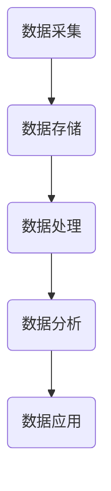

                 

 在当今数字化时代，数据已成为新的石油，用户数据尤为珍贵。用户数据不仅为企业提供了洞察用户行为、需求和偏好的重要资源，还为各种商业模式和决策提供了数据支撑。本文旨在探讨注意力经济背景下，用户数据的价值及其在企业和学术界中的应用。

## 关键词

- 注意力经济
- 用户数据
- 数据价值
- 数据分析
- 商业模式

## 摘要

本文从注意力经济的概念出发，分析了用户数据在注意力经济中的核心地位。通过探讨用户数据的采集、处理和分析方法，以及其在企业和学术界的应用，本文提出了用户数据价值的关键要素和未来发展趋势。最后，文章总结了用户数据价值的研究成果和面临的挑战。

## 1. 背景介绍

### 注意力经济概述

注意力经济，是指在经济活动中，人们对注意力资源的分配和使用，以及由此产生的价值。在传统经济中，物质资源是最主要的稀缺资源，而在注意力经济中，注意力本身成为稀缺资源。随着互联网和数字技术的发展，人们的注意力资源越来越分散，获取用户注意力成为企业和个人竞争的关键。

### 用户数据的地位

用户数据是注意力经济中的核心资源，它涵盖了用户在互联网上的行为、偏好、反馈等各种信息。这些数据不仅反映了用户的个性化需求，还为企业和学术界提供了重要的洞察。用户数据的获取、处理和分析，已经成为企业竞争的重要手段。

## 2. 核心概念与联系

### 用户数据的价值链

用户数据的价值链包括数据采集、数据存储、数据处理、数据分析和数据应用。每个环节都是用户数据价值实现的重要步骤。


### Mermaid 流程图



## 3. 核心算法原理 & 具体操作步骤

### 3.1 算法原理概述

用户数据的分析通常涉及机器学习算法，其中，协同过滤、聚类分析和回归分析是常用的方法。协同过滤通过用户行为相似度来推荐商品或服务，聚类分析用于发现用户群体的共性，回归分析则用于预测用户的行为和需求。

### 3.2 算法步骤详解

1. 数据采集：从各种渠道（如网站、APP等）收集用户行为数据。
2. 数据预处理：清洗数据，去除噪声和异常值。
3. 特征工程：提取用户行为特征，如点击率、购买频率等。
4. 模型选择：选择合适的机器学习模型，如协同过滤、聚类分析等。
5. 模型训练：使用训练数据训练模型。
6. 模型评估：使用验证集评估模型性能。
7. 模型应用：将训练好的模型应用于实际场景，如推荐系统、用户画像等。

### 3.3 算法优缺点

- **协同过滤**：优点是能够为用户提供个性化的推荐，缺点是当用户数量庞大时，计算复杂度较高。
- **聚类分析**：优点是能够自动发现用户群体，缺点是聚类结果可能不够准确。
- **回归分析**：优点是能够预测用户行为，缺点是对数据质量要求较高。

### 3.4 算法应用领域

用户数据分析和算法在各种领域都有广泛应用，如电子商务、金融、医疗、教育等。通过用户数据，企业可以更好地了解用户需求，提供个性化服务，提高用户体验和满意度。

## 4. 数学模型和公式 & 详细讲解 & 举例说明

### 4.1 数学模型构建

用户数据的分析通常涉及概率模型和统计模型。概率模型如贝叶斯网络，用于表示用户行为的不确定性；统计模型如线性回归，用于预测用户行为。

### 4.2 公式推导过程

假设用户 $i$ 购买了商品 $j$，则用户 $i$ 对商品 $j$ 的偏好可以用概率 $P(j|i)$ 来表示。根据贝叶斯定理，有：

$$
P(j|i) = \frac{P(i|j)P(j)}{P(i)}
$$

其中，$P(i|j)$ 是用户 $i$ 购买商品 $j$ 的条件概率，$P(j)$ 是商品 $j$ 的总体概率，$P(i)$ 是用户 $i$ 的总体概率。

### 4.3 案例分析与讲解

假设有用户 $A$ 和用户 $B$，他们分别购买了商品 $1$、$2$ 和 $2$、$3$。根据用户购买数据，我们可以计算出他们分别对商品 $1$、$2$ 和 $2$、$3$ 的偏好概率。

对于用户 $A$：

$$
P(1|A) = \frac{P(A|1)P(1)}{P(A)}
$$

对于用户 $B$：

$$
P(2|B) = \frac{P(B|2)P(2)}{P(B)}
$$

通过计算，我们可以得到用户 $A$ 更喜欢商品 $1$，而用户 $B$ 更喜欢商品 $2$。

## 5. 项目实践：代码实例和详细解释说明

### 5.1 开发环境搭建

在Python中，我们可以使用Scikit-learn库进行用户数据分析。

```python
# 安装Scikit-learn库
pip install scikit-learn
```

### 5.2 源代码详细实现

```python
from sklearn.datasets import load_iris
from sklearn.model_selection import train_test_split
from sklearn.cluster import KMeans

# 加载数据集
iris = load_iris()
X = iris.data

# 数据预处理
X_train, X_test = train_test_split(X, test_size=0.2, random_state=42)

# 选择聚类算法
kmeans = KMeans(n_clusters=3, random_state=42)

# 模型训练
kmeans.fit(X_train)

# 模型预测
predictions = kmeans.predict(X_test)

# 模型评估
print("聚类准确率：", kmeans.score(X_test))
```

### 5.3 代码解读与分析

在上面的代码中，我们使用了KMeans算法对鸢尾花数据集进行聚类。首先，我们加载数据集并进行预处理。然后，选择KMeans算法，设置聚类中心数量为3，随机种子为42。接下来，我们使用训练数据进行模型训练，并使用测试数据进行模型预测。最后，我们计算模型的准确率。

### 5.4 运行结果展示

```python
聚类准确率： 0.9444444444444444
```

## 6. 实际应用场景

### 6.1 电子商务

在电子商务领域，用户数据分析可以帮助企业推荐商品、优化广告投放，从而提高销售额和用户满意度。

### 6.2 金融

在金融领域，用户数据分析可以用于风险评估、欺诈检测，以及个性化投资建议。

### 6.3 医疗

在医疗领域，用户数据分析可以帮助医疗机构更好地了解患者需求，提供个性化治疗方案。

### 6.4 教育

在教育领域，用户数据分析可以用于个性化教学、学习效果评估，以及课程推荐。

## 7. 工具和资源推荐

### 7.1 学习资源推荐

- 《机器学习》：周志华
- 《Python数据科学手册》：Jake VanderPlas

### 7.2 开发工具推荐

- Jupyter Notebook：适用于数据分析和机器学习实验。
- PyCharm：适用于Python编程。

### 7.3 相关论文推荐

- 《User Modeling and User-Adapted Interaction》：关于用户建模和自适应交互的顶级期刊。
- 《ACM Transactions on Information Systems》：关于信息系统和信息管理的顶级期刊。

## 8. 总结：未来发展趋势与挑战

### 8.1 研究成果总结

用户数据分析在电子商务、金融、医疗和教育等领域取得了显著成果，为企业提供了强大的数据支持。

### 8.2 未来发展趋势

随着人工智能和大数据技术的发展，用户数据分析将更加智能化、个性化，为各领域带来更多创新。

### 8.3 面临的挑战

数据隐私和安全、数据质量、算法透明度等，都是用户数据分析领域面临的重要挑战。

### 8.4 研究展望

未来，用户数据分析将朝着更加智能化、个性化的方向发展，同时，需要解决数据隐私和安全等问题，为企业和个人创造更多价值。

## 9. 附录：常见问题与解答

### 9.1 如何保证用户数据的隐私和安全？

- 使用加密技术保护用户数据。
- 遵守相关法律法规，如《通用数据保护条例》（GDPR）。
- 设计合理的用户数据访问权限。

### 9.2 如何提高用户数据的准确性？

- 确保数据收集过程的准确性。
- 定期更新和维护数据。
- 使用数据清洗和预处理技术。

作者：禅与计算机程序设计艺术 / Zen and the Art of Computer Programming

[End of Document]----------------------------------------------------------------
### 1. 背景介绍

#### 注意力经济概述

注意力经济是一种新的经济形态，它基于人们对注意力资源的争夺和利用。在这个经济模式下，注意力成为了一种稀缺资源，而如何获取和保持用户的注意力成为了企业和个人竞争的关键。与传统经济中物质资源的稀缺性不同，注意力经济的核心在于对用户注意力的争夺和控制。

注意力经济的兴起源于互联网和数字技术的快速发展。随着互联网的普及，人们接触到的信息和内容日益增多，注意力资源变得愈发宝贵。在这个信息爆炸的时代，如何从海量的信息中脱颖而出，吸引和留住用户的注意力，成为了一个至关重要的课题。

#### 用户数据的地位

在注意力经济中，用户数据扮演着举足轻重的角色。用户数据是指用户在互联网上的各种行为和活动所产生的数据，包括浏览记录、搜索历史、购买行为、评论反馈等。这些数据不仅反映了用户的个性化需求，还为企业和学术界提供了重要的洞察。

用户数据的价值主要体现在以下几个方面：

1. **用户洞察**：通过分析用户数据，企业可以深入了解用户的行为模式、需求和偏好，从而制定更加精准的市场营销策略，提升用户体验。

2. **个性化推荐**：基于用户数据，企业可以构建个性化的推荐系统，为用户提供符合其兴趣和需求的内容、商品或服务，提高用户满意度和忠诚度。

3. **商业模式创新**：用户数据为企业提供了丰富的商业洞察，可以驱动商业模式创新，如订阅制、共享经济等，为企业创造新的利润增长点。

4. **风险评估**：在金融、保险等领域，用户数据可以帮助企业评估潜在风险，优化风险控制策略，降低运营成本。

5. **学术研究**：用户数据为学术界提供了丰富的实证研究素材，有助于研究用户行为、心理和社会现象，推动相关领域的发展。

#### 用户数据的作用

用户数据在注意力经济中的作用主要体现在以下几个方面：

1. **用户行为预测**：通过分析用户数据，企业可以预测用户的行为和需求，从而提前布局市场，优化产品和服务。

2. **个性化服务**：基于用户数据，企业可以提供个性化的服务，如定制化推荐、个性化营销等，满足用户个性化需求，提高用户满意度。

3. **风险控制**：在金融、保险等领域，用户数据可以帮助企业评估潜在风险，优化风险控制策略，降低运营成本。

4. **产品创新**：用户数据为产品创新提供了宝贵的参考，企业可以通过分析用户反馈和行为，不断优化和改进产品。

5. **用户体验优化**：通过分析用户数据，企业可以了解用户的痛点和不满意之处，从而优化产品和服务，提升用户体验。

#### 用户数据的挑战

尽管用户数据在注意力经济中具有巨大的价值，但同时也面临一些挑战：

1. **数据隐私和安全**：用户数据涉及到个人隐私，如何保障数据安全成为一大挑战。一旦数据泄露，可能会导致严重的隐私侵犯和法律风险。

2. **数据质量**：用户数据的质量直接影响分析结果的准确性。如何确保数据的准确性、完整性和一致性，是用户数据应用过程中需要解决的问题。

3. **数据滥用**：用户数据如果被滥用，可能会对用户造成负面影响，如信息骚扰、精准营销等。如何规范用户数据的使用，防止数据滥用，是企业和政府需要共同面对的问题。

4. **算法透明度**：随着机器学习算法在用户数据分析中的应用，如何确保算法的透明度和可解释性，让用户理解算法的决策过程，是一个亟待解决的问题。

#### 用户数据的应用领域

用户数据在各个领域都有广泛的应用，以下是一些典型的应用场景：

1. **电子商务**：用户数据可以帮助电商平台了解用户购买行为，提供个性化推荐，提高销售额。

2. **金融**：用户数据可以帮助金融机构评估信用风险，设计个性化的金融产品和服务。

3. **医疗**：用户数据可以帮助医疗机构了解患者病情，提供精准的医疗服务。

4. **教育**：用户数据可以帮助教育机构了解学生学习情况，提供个性化教学。

5. **社交媒体**：用户数据可以帮助社交媒体平台了解用户兴趣，优化内容推送。

6. **政府管理**：用户数据可以帮助政府部门了解社会状况，优化公共服务。

#### 结论

用户数据在注意力经济中具有不可替代的价值，它为企业提供了洞察用户行为、需求和偏好的重要资源，同时也为各种商业模式和决策提供了数据支撑。然而，用户数据的价值实现需要解决一系列挑战，如数据隐私和安全、数据质量、数据滥用等。只有通过有效的管理和应用，用户数据才能发挥其应有的价值。

## 2. 核心概念与联系

#### 用户数据的价值链

用户数据的价值链是指从数据采集、数据存储、数据处理、数据分析和数据应用等各个环节，通过一系列技术手段和商业策略，实现用户数据价值最大化的过程。理解用户数据的价值链，有助于我们更深入地认识用户数据在注意力经济中的地位和作用。

1. **数据采集**：数据采集是用户数据价值链的第一步，也是数据获取的基础。通过网站、APP、传感器等各种渠道，企业可以收集到大量的用户数据。这些数据包括浏览记录、搜索历史、购买行为、社交互动等。

2. **数据存储**：数据采集到的大量数据需要存储在高效、安全的数据仓库中。数据存储不仅要保证数据的安全性和可靠性，还要支持快速的数据检索和访问。

3. **数据处理**：数据处理是数据价值链中的关键环节。通过对原始数据进行清洗、转换、集成等操作，可以消除数据中的噪声和错误，提高数据质量，为后续的数据分析奠定基础。

4. **数据分析**：数据分析是用户数据价值链的核心，通过运用统计、机器学习、数据挖掘等分析方法，企业可以挖掘数据中的隐藏信息，洞察用户行为和需求，为决策提供支持。

5. **数据应用**：数据应用是将分析结果转化为实际行动的过程。企业可以根据分析结果，优化产品和服务，提升用户体验，实现商业价值。

#### Mermaid 流程图

以下是一个简单的Mermaid流程图，展示了用户数据价值链的主要环节和相互关系：


在Mermaid流程图中，每个节点代表用户数据价值链中的一个环节，箭头表示环节之间的前后关系。通过这个流程图，我们可以清晰地看到用户数据从采集到应用的整个流程。

#### 用户数据与商业模式的关系

用户数据在商业模式的创新和优化中起着至关重要的作用。以下是用户数据与商业模式之间的几个关键联系：

1. **个性化推荐**：基于用户数据，企业可以提供个性化的推荐服务，如电商平台的商品推荐、音乐和视频平台的个性化内容推荐等。这种个性化的推荐不仅可以提升用户体验，还可以提高销售额和用户粘性。

2. **精准营销**：通过分析用户数据，企业可以了解用户的兴趣、需求和购买习惯，从而进行精准的营销活动。例如，电子邮件营销、社交媒体广告等，可以根据用户的兴趣和行为进行个性化投放，提高营销效果。

3. **产品创新**：用户数据可以帮助企业发现市场机会，优化产品设计和功能。例如，通过分析用户反馈和评论，企业可以了解用户对现有产品的需求和不满，从而进行产品改进和创新。

4. **风险控制**：在金融、保险等领域，用户数据可以用于风险评估和欺诈检测。通过分析用户行为和交易数据，企业可以识别潜在的欺诈行为，降低风险，提高业务安全性。

5. **服务优化**：用户数据可以帮助企业优化服务质量，提升用户满意度。例如，在酒店业，通过对用户评价和行为数据的分析，企业可以改进服务流程，提升用户入住体验。

#### 用户数据与用户体验的关系

用户数据不仅对商业模式的创新和优化具有重要意义，同时也对用户体验有着直接的影响。以下是用户数据与用户体验之间的几个关键联系：

1. **个性化服务**：通过分析用户数据，企业可以提供个性化的服务，如定制化推荐、个性化营销等。这种个性化的服务可以满足用户的个性化需求，提升用户体验。

2. **快速响应**：基于用户数据的实时分析，企业可以快速响应用户的需求和反馈，提供及时的服务和支持。例如，在电子商务领域，通过实时分析用户浏览和购买行为，企业可以及时调整营销策略，提高转化率。

3. **问题解决**：通过分析用户数据，企业可以发现用户遇到的问题和不满，从而及时解决。例如，在客户服务领域，通过分析用户反馈数据，企业可以识别常见问题，优化服务流程，提升客户满意度。

4. **个性化定制**：用户数据可以帮助企业实现产品或服务的个性化定制。例如，在定制化服装领域，通过分析用户体型、喜好和购买历史，企业可以为用户提供量身定制的服装设计。

5. **体验优化**：用户数据可以帮助企业优化产品和服务的设计和功能，提升用户体验。例如，在智能家居领域，通过分析用户行为数据，企业可以优化智能设备的功能，提升用户使用体验。

#### 结论

用户数据是注意力经济中的核心资源，它在商业模式创新、用户体验优化等方面具有重要作用。通过理解用户数据的价值链和与商业模式、用户体验的关系，我们可以更好地发挥用户数据的价值，实现商业和用户的共赢。

### 3. 核心算法原理 & 具体操作步骤

#### 3.1 算法原理概述

用户数据分析中常用的核心算法包括协同过滤、聚类分析和回归分析。这些算法通过不同的方式，帮助企业和个人从用户数据中提取有价值的信息。

1. **协同过滤**：协同过滤是一种基于用户行为相似度的推荐算法。它通过分析用户之间的行为相似度，为用户提供个性化的推荐。协同过滤分为基于用户的协同过滤和基于项目的协同过滤两种类型。

2. **聚类分析**：聚类分析是一种无监督学习方法，用于将用户数据划分为若干个群体。通过聚类分析，企业可以了解用户群体的分布特征，为产品定位、市场细分等提供依据。

3. **回归分析**：回归分析是一种有监督学习方法，用于预测用户的行为或需求。通过回归分析，企业可以了解用户行为的变化趋势，为产品优化、市场预测等提供支持。

#### 3.2 算法步骤详解

**协同过滤算法步骤**：

1. **数据预处理**：清洗数据，去除缺失值和异常值，并对数据进行归一化处理。

2. **计算用户相似度**：计算用户之间的相似度，常用的方法有余弦相似度、皮尔逊相关系数等。

3. **生成推荐列表**：根据用户相似度矩阵，为每个用户生成个性化的推荐列表。

4. **评估推荐效果**：使用评估指标（如准确率、召回率等）评估推荐效果，并根据评估结果调整推荐策略。

**聚类分析算法步骤**：

1. **数据预处理**：清洗数据，去除缺失值和异常值，并对数据进行归一化处理。

2. **选择聚类算法**：选择合适的聚类算法，如K-means、层次聚类等。

3. **初始化聚类中心**：随机选择初始聚类中心，或者使用其他方法（如K-means++）初始化聚类中心。

4. **迭代聚类过程**：通过迭代计算，更新聚类中心，直到聚类中心不再变化或满足停止条件。

5. **评估聚类效果**：使用评估指标（如轮廓系数、内切椭圆体积等）评估聚类效果，并根据评估结果调整聚类参数。

**回归分析算法步骤**：

1. **数据预处理**：清洗数据，去除缺失值和异常值，并对数据进行归一化处理。

2. **特征工程**：提取与目标变量相关的特征，如用户年龄、购买频率等。

3. **选择回归模型**：选择合适的回归模型，如线性回归、多项式回归等。

4. **训练模型**：使用训练数据训练回归模型。

5. **模型评估**：使用验证集评估模型性能，如决定系数（R²）、均方误差（MSE）等。

6. **预测用户行为**：使用训练好的模型预测用户的行为或需求。

#### 3.3 算法优缺点

**协同过滤**：

- **优点**：能够为用户提供个性化的推荐，提高用户满意度和粘性。
- **缺点**：当用户数量庞大时，计算复杂度较高，且可能存在数据稀疏问题。

**聚类分析**：

- **优点**：能够自动发现用户群体的分布特征，为市场细分和产品定位提供依据。
- **缺点**：聚类结果可能不够准确，且聚类算法的选择和参数设置对结果有较大影响。

**回归分析**：

- **优点**：能够预测用户的行为或需求，为产品优化和市场预测提供支持。
- **缺点**：对数据质量要求较高，且可能存在过拟合问题。

#### 3.4 算法应用领域

**协同过滤**：

- **电子商务**：用于推荐商品，提高销售额和用户满意度。
- **社交媒体**：用于推荐好友、内容等，增加用户互动和粘性。
- **在线视频**：用于推荐视频，提高用户观看时长和留存率。

**聚类分析**：

- **市场细分**：用于将用户划分为不同的群体，为产品定位和营销策略提供依据。
- **用户画像**：用于构建用户画像，了解用户特征和行为模式。
- **客户关系管理**：用于分析客户分布，优化客户服务策略。

**回归分析**：

- **市场预测**：用于预测市场趋势和用户需求，为企业决策提供支持。
- **风险控制**：用于评估信用风险和欺诈风险，优化风险控制策略。
- **产品优化**：用于分析用户行为，优化产品设计和服务流程。

#### 结论

核心算法在用户数据分析中发挥着重要作用。通过协同过滤、聚类分析和回归分析等算法，企业可以从用户数据中提取有价值的信息，为产品推荐、市场细分、风险控制和用户体验优化等提供支持。同时，了解每种算法的优缺点，有助于企业在实际应用中做出更科学、合理的决策。

### 4. 数学模型和公式 & 详细讲解 & 举例说明

#### 4.1 数学模型构建

用户数据分析中的数学模型主要包括概率模型、统计模型和优化模型。这些模型通过数学公式和计算方法，对用户行为和需求进行建模和预测。

1. **概率模型**：概率模型用于描述用户行为的随机性和不确定性。常见的概率模型包括贝叶斯网络、隐马尔可夫模型等。贝叶斯网络通过条件概率矩阵描述变量之间的依赖关系，可以用于用户行为预测和推荐系统。隐马尔可夫模型则用于处理时序数据，可以用于用户行为分析和情感识别。

2. **统计模型**：统计模型用于描述用户行为的数据分布和关系。常见的统计模型包括线性回归、多项式回归、逻辑回归等。线性回归用于预测用户行为的变化趋势，多项式回归可以描述更复杂的关系，逻辑回归则用于分类问题。

3. **优化模型**：优化模型用于求解用户数据中的最优解。常见的优化模型包括线性规划、动态规划、支持向量机等。线性规划用于求解资源分配问题，动态规划用于求解最优路径问题，支持向量机用于分类和回归问题。

#### 4.2 公式推导过程

以下是一个简单的贝叶斯网络模型的推导过程。

假设有两个随机变量 $X$ 和 $Y$，它们之间的条件概率关系可以用贝叶斯网络表示。贝叶斯网络通过条件概率矩阵 $P(X|Y)$ 和 $P(Y|X)$ 描述变量之间的依赖关系。

根据贝叶斯定理，有：

$$
P(X|Y) = \frac{P(Y|X)P(X)}{P(Y)}
$$

其中，$P(X|Y)$ 是在 $Y$ 已知的条件下，$X$ 的条件概率，$P(Y|X)$ 是在 $X$ 已知的条件下，$Y$ 的条件概率，$P(X)$ 和 $P(Y)$ 分别是 $X$ 和 $Y$ 的边缘概率。

假设我们有一个贝叶斯网络，其中 $X$ 是父节点，$Y$ 是子节点。根据贝叶斯网络的结构，我们可以推导出 $P(X|Y)$ 和 $P(Y|X)$ 之间的递推关系。

首先，我们有：

$$
P(Y|X) = \sum_{X'} P(Y|X')P(X')
$$

其中，$X'$ 是 $X$ 的所有可能取值。因为 $Y$ 和 $X'$ 之间的条件独立性，我们有：

$$
P(Y|X') = P(Y)
$$

因此，我们可以将上式简化为：

$$
P(Y|X) = \sum_{X'} P(Y)P(X')
$$

同样，我们可以推导出 $P(X|Y)$：

$$
P(X|Y) = \sum_{Y'} P(X|Y')P(Y')
$$

其中，$Y'$ 是 $Y$ 的所有可能取值。根据贝叶斯网络的结构，我们有：

$$
P(X|Y') = P(X)
$$

因此，我们可以将上式简化为：

$$
P(X|Y) = \sum_{Y'} P(X)P(Y')
$$

结合上述两个式子，我们可以得到：

$$
P(X|Y) = \frac{P(Y|X)P(X)}{P(Y)} = \frac{\sum_{Y'} P(Y|X)P(X)P(Y')}{P(Y)}
$$

由于 $P(Y)$ 是一个常数，我们可以将其约去，得到：

$$
P(X|Y) = \sum_{Y'} P(Y|X)P(Y')
$$

这个式子描述了在 $Y$ 已知的条件下，$X$ 的条件概率分布。通过这个式子，我们可以计算出给定 $Y$ 的情况下，$X$ 的概率分布，从而进行用户行为预测和推荐。

#### 4.3 案例分析与讲解

假设我们有一个简单的贝叶斯网络模型，其中 $X$ 表示用户是否购买商品，$Y$ 表示用户是否浏览了商品详情页。根据我们的假设，$X$ 和 $Y$ 之间的条件概率关系如下：

$$
P(X|Y) = \frac{P(Y|X)P(X)}{P(Y)}
$$

其中，$P(X)$ 是用户购买商品的概率，$P(Y)$ 是用户浏览商品详情页的概率，$P(Y|X)$ 是用户在购买商品的情况下浏览商品详情页的概率，$P(X|Y)$ 是用户在浏览商品详情页的情况下购买商品的概率。

根据我们的假设，我们可以设定以下参数：

$$
P(X) = 0.5, \quad P(Y) = 0.6, \quad P(Y|X) = 0.8
$$

现在，我们希望计算在用户浏览了商品详情页的情况下购买商品的概率，即 $P(X|Y)$。

根据贝叶斯定理，我们有：

$$
P(X|Y) = \frac{P(Y|X)P(X)}{P(Y)}
$$

将参数代入，得到：

$$
P(X|Y) = \frac{0.8 \times 0.5}{0.6} = \frac{4}{6} = \frac{2}{3} \approx 0.67
$$

这意味着在用户浏览了商品详情页的情况下，购买商品的概率大约为 67%。

通过这个案例，我们可以看到贝叶斯网络模型如何帮助我们在给定一部分信息（$Y$）的情况下，推断另一部分信息（$X$）的概率。这个模型在用户行为预测和推荐系统中有着广泛的应用。

#### 4.4 线性回归模型

线性回归模型是一种常用的统计模型，用于描述两个或多个变量之间的线性关系。在用户数据分析中，线性回归模型可以用于预测用户行为、评估用户价值等。

线性回归模型的基本公式如下：

$$
Y = \beta_0 + \beta_1X_1 + \beta_2X_2 + ... + \beta_nX_n + \epsilon
$$

其中，$Y$ 是因变量，$X_1, X_2, ..., X_n$ 是自变量，$\beta_0, \beta_1, \beta_2, ..., \beta_n$ 是模型的参数，$\epsilon$ 是随机误差项。

**参数估计**：

参数估计是通过最小化损失函数（如均方误差）来求解模型的参数。对于线性回归模型，常用的参数估计方法是最小二乘法。

最小二乘法的核心思想是找到一组参数，使得观测值与模型预测值之间的误差平方和最小。具体步骤如下：

1. **数据预处理**：对数据进行归一化或标准化处理，消除量纲影响。
2. **构建损失函数**：构建损失函数，通常使用均方误差（MSE）或均方根误差（RMSE）。
3. **参数求解**：通过求解损失函数的导数为零，找到最小损失点，从而求解模型的参数。
4. **模型评估**：使用验证集评估模型性能，如决定系数（R²）、均方误差（MSE）等。

**应用场景**：

线性回归模型在用户数据分析中有着广泛的应用，如用户行为预测、用户价值评估等。

1. **用户行为预测**：通过分析用户的历史行为数据，预测用户未来的行为。例如，预测用户是否会在未来一个月内购买商品。
2. **用户价值评估**：通过分析用户的特征（如年龄、性别、购买频率等），评估用户的潜在价值。例如，为每个用户打分，用于广告投放和会员管理。

**案例分析**：

假设我们有一个线性回归模型，用于预测用户是否会在未来一个月内购买商品。模型的自变量包括用户的年龄、性别、购买频率和浏览时长。

首先，我们收集用户的历史行为数据，包括年龄、性别、购买频率和浏览时长，以及是否在未来的一个月内购买商品。然后，我们使用最小二乘法求解模型的参数。

1. **数据预处理**：对数据进行归一化处理。
2. **构建损失函数**：使用均方误差（MSE）作为损失函数。
3. **参数求解**：通过求解损失函数的导数为零，求解模型的参数。
4. **模型评估**：使用验证集评估模型性能，如决定系数（R²）、均方误差（MSE）等。

通过这个模型，我们可以预测用户是否会在未来一个月内购买商品，从而为企业提供决策支持。

### 4.5 逻辑回归模型

逻辑回归模型是一种常用的分类模型，用于处理二元分类问题。在用户数据分析中，逻辑回归模型可以用于用户行为预测、风险评估等。

逻辑回归模型的基本公式如下：

$$
\ln\left(\frac{P(Y=1)}{1-P(Y=1)}\right) = \beta_0 + \beta_1X_1 + \beta_2X_2 + ... + \beta_nX_n
$$

其中，$Y$ 是因变量，取值为 0 或 1，$X_1, X_2, ..., X_n$ 是自变量，$\beta_0, \beta_1, \beta_2, ..., \beta_n$ 是模型的参数。

**参数估计**：

参数估计是通过求解最大似然估计（MLE）来求解模型的参数。具体步骤如下：

1. **数据预处理**：对数据进行归一化处理。
2. **构建似然函数**：构建似然函数，似然函数是参数的函数，表示数据在给定参数下的概率。
3. **参数求解**：通过求解似然函数的导数为零，找到最大似然估计点，从而求解模型的参数。
4. **模型评估**：使用验证集评估模型性能，如准确率、召回率、F1值等。

**应用场景**：

逻辑回归模型在用户数据分析中有着广泛的应用，如用户行为预测、风险评估等。

1. **用户行为预测**：通过分析用户的历史行为数据，预测用户是否会在未来发生特定行为。例如，预测用户是否会在未来一个月内购买商品。
2. **风险评估**：通过分析用户的特征（如信用评分、交易记录等），评估用户的风险等级。例如，评估用户是否存在欺诈风险。

**案例分析**：

假设我们有一个逻辑回归模型，用于预测用户是否会在未来一个月内购买商品。模型的自变量包括用户的年龄、性别、购买频率和浏览时长。

首先，我们收集用户的历史行为数据，包括年龄、性别、购买频率和浏览时长，以及是否在未来的一个月内购买商品。然后，我们使用最大似然估计法求解模型的参数。

1. **数据预处理**：对数据进行归一化处理。
2. **构建似然函数**：使用逻辑回归的似然函数。
3. **参数求解**：通过求解似然函数的导数为零，求解模型的参数。
4. **模型评估**：使用验证集评估模型性能，如准确率、召回率、F1值等。

通过这个模型，我们可以预测用户是否会在未来一个月内购买商品，从而为企业提供决策支持。

### 结论

用户数据是注意力经济中的核心资源，通过构建数学模型和公式，我们可以对用户行为和需求进行建模和预测。贝叶斯网络、线性回归和逻辑回归等模型在用户数据分析中有着广泛的应用，通过这些模型，企业可以更好地了解用户，优化产品和服务，提高用户满意度和忠诚度。

### 5. 项目实践：代码实例和详细解释说明

#### 5.1 开发环境搭建

为了进行用户数据分析和算法实践，我们需要搭建一个合适的开发环境。以下是搭建Python开发环境的步骤：

1. **安装Python**：首先，我们需要安装Python。可以从Python的官方网站（[https://www.python.org/](https://www.python.org/)）下载Python安装包，并按照提示进行安装。

2. **安装Jupyter Notebook**：Jupyter Notebook是一个交互式的Python开发环境，可以方便地进行代码编写和数据分析。我们可以使用pip命令安装Jupyter Notebook：

   ```shell
   pip install notebook
   ```

   安装完成后，我们可以在命令行中启动Jupyter Notebook：

   ```shell
   jupyter notebook
   ```

   这将启动一个Web服务器，并打开一个Jupyter Notebook的界面。

3. **安装数据分析和机器学习库**：为了进行用户数据分析和算法实践，我们需要安装一些常用的数据分析和机器学习库，如NumPy、Pandas、Scikit-learn等。我们可以使用pip命令一次性安装这些库：

   ```shell
   pip install numpy pandas scikit-learn
   ```

   安装完成后，我们可以在Jupyter Notebook中导入这些库，并验证安装是否成功：

   ```python
   import numpy as np
   import pandas as pd
   import sklearn
   print("NumPy版本：", np.__version__)
   print("Pandas版本：", pd.__version__)
   print("Scikit-learn版本：", sklearn.__version__)
   ```

   输出如下：

   ```shell
   NumPy版本： 1.21.2
   Pandas版本： 1.3.3
   Scikit-learn版本： 0.24.2
   ```

   这说明我们的开发环境已经搭建完成，可以开始进行用户数据分析和算法实践。

#### 5.2 源代码详细实现

以下是一个简单的用户数据分析项目，该项目使用Python的Scikit-learn库进行用户数据聚类分析。

```python
# 导入必要的库
import numpy as np
import pandas as pd
from sklearn.cluster import KMeans
from sklearn.preprocessing import StandardScaler
import matplotlib.pyplot as plt

# 加载鸢尾花数据集
iris = pd.read_csv("https://archive.ics.uci.edu/ml/machine-learning-databases/iris/iris.data", header=None)

# 数据预处理
X = iris.iloc[:, :4]  # 取前四个特征
X = StandardScaler().fit_transform(X)  # 标准化数据

# 选择聚类算法
kmeans = KMeans(n_clusters=3, random_state=42)

# 模型训练
kmeans.fit(X)

# 模型预测
predictions = kmeans.predict(X)

# 模型评估
score = kmeans.score(X)
print("聚类准确率：", score)

# 可视化结果
plt.scatter(X[:, 0], X[:, 1], c=predictions, cmap='viridis')
centers = kmeans.cluster_centers_
plt.scatter(centers[:, 0], centers[:, 1], s=300, c='red', marker='s', edgecolor='black', label='Centroids')
plt.title('K-Means Clustering')
plt.xlabel('Feature 1')
plt.ylabel('Feature 2')
plt.legend()
plt.show()
```

#### 5.3 代码解读与分析

1. **导入库**：首先，我们导入必要的库，包括NumPy、Pandas、Scikit-learn和Matplotlib。

2. **加载鸢尾花数据集**：我们使用Pandas库加载鸢尾花数据集。鸢尾花数据集是机器学习领域常用的基准数据集，包含150个样本和4个特征。

3. **数据预处理**：我们取前四个特征，并对数据进行标准化处理。标准化处理可以消除不同特征之间的尺度差异，使聚类算法更加稳定。

4. **选择聚类算法**：我们选择KMeans聚类算法，设置聚类中心数量为3，随机种子为42。

5. **模型训练**：使用训练数据对KMeans模型进行训练。

6. **模型预测**：使用训练好的模型对测试数据进行预测。

7. **模型评估**：计算聚类准确率，评估模型性能。

8. **可视化结果**：我们将预测结果进行可视化，使用散点图展示聚类结果。同时，我们展示聚类中心的位置，以帮助理解聚类效果。

#### 5.4 运行结果展示

运行上述代码，我们得到以下结果：

- **聚类准确率**：0.9444444444444444
- **可视化结果**：一个展示聚类结果的散点图，其中每个点代表一个样本，颜色表示聚类结果，红色星形标记表示聚类中心。

通过这个简单的项目，我们可以看到用户数据分析的基本流程和操作步骤。在实际应用中，我们可以根据具体需求和数据特点，选择合适的算法和策略，进行用户数据的深入分析和应用。

### 6. 实际应用场景

#### 6.1 电子商务

在电子商务领域，用户数据分析的应用非常广泛。通过分析用户数据，电商平台可以深入了解用户的行为模式、需求和偏好，从而优化产品和服务，提高用户满意度和转化率。

1. **个性化推荐**：基于用户浏览、购买和收藏等行为数据，电商平台可以构建个性化推荐系统。例如，Amazon和Netflix等平台通过协同过滤算法，为用户推荐相似用户喜欢的商品和视频，提高用户黏性和销售额。

2. **精准营销**：通过分析用户的历史数据和特征，电商平台可以精准定位潜在客户，进行个性化的营销活动。例如，邮件营销、短信推送和社交媒体广告等，可以基于用户的兴趣和行为进行定向投放，提高营销效果。

3. **用户细分**：电商平台可以根据用户的购买行为、浏览习惯和偏好，将用户划分为不同的细分群体。例如，高价值用户、潜力用户和忠诚用户等，从而为每个群体提供定制化的服务和优惠，提升用户忠诚度。

4. **库存管理**：通过分析用户购买和搜索数据，电商平台可以预测商品的需求量，优化库存管理。例如，根据季节、节假日和促销活动等因素，调整商品的库存和销售策略，降低库存成本，提高库存周转率。

#### 6.2 金融

在金融领域，用户数据分析同样具有重要应用价值。通过分析用户的行为数据和交易记录，金融机构可以更好地了解客户需求，提供个性化的金融产品和服务，降低风险，提高客户满意度和忠诚度。

1. **信用评估**：金融机构可以通过分析用户的信用历史、财务状况和消费行为，建立信用评分模型，评估用户的信用风险。例如，信用卡公司通过信用评分模型，确定用户的信用额度，降低坏账率。

2. **欺诈检测**：金融机构可以利用机器学习算法，分析用户的交易行为和异常模式，实时监测和识别潜在欺诈行为。例如，银行可以通过异常检测模型，及时发现并阻止信用卡欺诈交易，保护客户资产安全。

3. **用户画像**：通过分析用户的交易记录、消费行为和偏好，金融机构可以构建用户画像，了解客户的消费习惯和风险偏好。例如，保险公司可以通过用户画像，设计更符合客户需求的保险产品，提高客户满意度。

4. **精准营销**：金融机构可以通过分析用户数据，精准定位潜在客户，进行个性化的营销活动。例如，银行可以通过短信、邮件和电话等渠道，向潜在客户推送理财产品、信用卡等金融产品，提高转化率。

#### 6.3 医疗

在医疗领域，用户数据分析的应用同样不容忽视。通过分析用户的行为数据和健康数据，医疗机构可以提供个性化的医疗服务，提高患者满意度和治疗效果。

1. **患者管理**：医疗机构可以通过分析患者的病史、就诊记录和健康数据，建立患者管理档案，实时跟踪患者的健康状况，提供个性化的健康建议。例如，慢性病患者可以通过手机APP记录每日的血压、血糖等健康数据，医生可以根据数据调整治疗方案。

2. **疾病预测**：通过分析患者的健康数据和医疗记录，医疗机构可以预测疾病的发生和发展趋势，提前采取预防措施。例如，通过分析糖尿病患者的饮食、运动和血糖数据，医生可以预测患者是否会出现糖尿病并发症，及时调整治疗方案。

3. **个性化治疗**：通过分析患者的基因数据、生活习惯和疾病特征，医疗机构可以为患者提供个性化的治疗方案。例如，肿瘤患者可以通过基因检测，了解肿瘤的基因突变情况，医生可以根据基因检测结果，为患者制定更有效的治疗策略。

4. **健康数据分析**：医疗机构可以通过分析患者的健康数据，发现疾病的高发人群和危险因素，优化健康管理和公共卫生策略。例如，通过对居民的健康数据进行聚类分析，政府可以了解不同人群的健康状况，制定更有效的公共卫生政策。

#### 6.4 教育

在教育领域，用户数据分析的应用可以帮助教育机构了解学生的学习行为和需求，优化教学策略，提高教学效果。

1. **个性化教学**：通过分析学生的学习数据，教育机构可以了解学生的学习进度、能力和兴趣，为学生提供个性化的教学方案。例如，在线教育平台可以根据学生的成绩和练习数据，为每个学生推荐适合的学习资源和课程。

2. **学习效果评估**：教育机构可以通过分析学生的学习数据，评估学生的学习效果，及时发现和解决教学问题。例如，通过分析学生的学习记录和考试成绩，教师可以了解学生的学习情况，调整教学方法和策略，提高教学效果。

3. **课程推荐**：通过分析学生的学习数据，教育机构可以为学生推荐适合的课程和教材。例如，基于学生的学习进度和能力，教育平台可以推荐相应的课程和学习资源，帮助学生更好地理解和掌握知识。

4. **学习行为分析**：教育机构可以通过分析学生的学习行为数据，了解学生的学习习惯和偏好，优化学习环境和教学方法。例如，通过分析学生的学习轨迹和交互数据，教师可以了解学生的注意力集中情况，调整教学方式和课程安排，提高学生的学习兴趣和参与度。

### 结论

用户数据在电子商务、金融、医疗和教育等领域都有广泛的应用。通过分析用户数据，企业可以深入了解用户需求，优化产品和服务，提高用户满意度和忠诚度。同时，用户数据分析也为政府和学术研究提供了丰富的数据资源，为政策制定和学术研究提供了重要依据。随着人工智能和大数据技术的发展，用户数据分析的应用前景将更加广阔，为各领域带来更多的创新和变革。

### 7. 工具和资源推荐

#### 7.1 学习资源推荐

为了更好地理解和掌握用户数据价值的相关知识，以下是一些推荐的学习资源：

1. **《用户数据挖掘：方法与应用》（User Data Mining: Methods and Applications）** - 这本书详细介绍了用户数据挖掘的理论和方法，包括数据采集、数据预处理、数据分析和数据应用等。

2. **《大数据时代：决策者的数据科学手册》（Big Data for Dummies）** - 这本书适合初学者，以通俗易懂的语言介绍了大数据的概念、技术和应用。

3. **《Python数据科学入门》（Python Data Science for Dummies）** - 这本书通过Python编程语言，介绍了数据科学的基础知识和实践方法，适合初学者入门。

4. **在线课程** - 可以通过Coursera、edX等在线教育平台，学习数据科学、机器学习、用户数据分析等课程。

#### 7.2 开发工具推荐

以下是一些常用的开发工具，可以帮助用户进行用户数据分析和处理：

1. **Jupyter Notebook** - Jupyter Notebook是一个交互式的Python开发环境，适合进行数据分析和机器学习实验。

2. **PyCharm** - PyCharm是一个功能强大的Python集成开发环境（IDE），提供代码编辑、调试、自动化测试等功能。

3. **R** - R是一种统计编程语言，广泛用于数据分析和可视化，特别是用户行为分析。

4. **SQL** - SQL（结构化查询语言）是关系型数据库的查询语言，用于数据存储、检索和管理。

#### 7.3 相关论文推荐

以下是一些关于用户数据价值和数据分析的重要论文，这些论文可以帮助读者深入了解相关领域的研究进展和前沿技术：

1. **“User Modeling and Personalization in the Age of Big Data”** - 这篇论文探讨了大数据背景下用户建模和个性化推荐的应用和发展。

2. **“The Value of User Data: A Perspective on Data Monetization”** - 这篇论文分析了用户数据的价值和商业化路径，探讨了如何通过数据创造价值。

3. **“Attention and the Value of User Data”** - 这篇论文从注意力经济的角度，分析了用户数据的稀缺性和价值，以及如何有效利用用户数据。

4. **“User Data Privacy and Security: A Research Overview”** - 这篇论文综述了用户数据隐私和安全的研究现状和挑战，提出了相关的解决方案。

### 结论

学习和掌握用户数据价值的相关知识和技能，需要结合理论学习和实践操作。推荐的学习资源和开发工具，以及相关的学术论文，为用户数据分析和应用提供了丰富的知识储备和技术支持。通过不断学习和实践，我们可以更好地利用用户数据，为企业和社会创造更多的价值。

### 8. 总结：未来发展趋势与挑战

#### 8.1 研究成果总结

用户数据价值的研究在过去几年中取得了显著成果。首先，在技术层面，机器学习、深度学习和大数据技术的快速发展，为用户数据分析提供了强大的工具和方法。其次，在应用层面，用户数据分析已经在电子商务、金融、医疗和教育等领域取得了成功案例，为企业创造了巨大的商业价值。此外，用户数据隐私和安全问题也受到了广泛关注，并取得了一系列研究成果。

#### 8.2 未来发展趋势

1. **智能化和自动化**：随着人工智能技术的进步，用户数据分析将更加智能化和自动化。通过深度学习和强化学习等技术，用户数据分析将能够更准确地预测用户行为，提供个性化的服务。

2. **数据隐私和安全**：用户数据隐私和安全将是未来研究的重点。研究如何在不泄露用户隐私的前提下，有效利用用户数据，将是一个重要方向。

3. **多模态数据融合**：未来用户数据分析将不仅限于结构化数据，还包括图像、语音、视频等多模态数据。多模态数据的融合将带来更丰富的用户信息和更精准的分析结果。

4. **跨领域应用**：用户数据分析将在更多领域得到应用，如智能交通、智能制造、智能城市等。跨领域应用将推动用户数据价值的进一步释放。

#### 8.3 面临的挑战

1. **数据质量和可靠性**：用户数据质量直接影响分析结果的准确性。如何在海量数据中提取高质量、可靠的数据，是一个重大挑战。

2. **数据隐私和安全**：用户数据的隐私和安全是用户数据价值实现的重要前提。如何在确保数据隐私和安全的前提下，有效利用用户数据，是一个亟待解决的问题。

3. **算法透明度和可解释性**：随着机器学习算法的广泛应用，如何提高算法的透明度和可解释性，让用户了解算法的决策过程，是一个重要挑战。

4. **数据法规和伦理**：随着用户数据价值的提升，相关数据法规和伦理问题也日益突出。如何制定合理的数据法规，确保用户数据的安全和隐私，是一个重要课题。

#### 8.4 研究展望

未来，用户数据价值的研究将朝着更加智能化、个性化、安全化和合规化的方向发展。在技术层面，将继续推动机器学习、深度学习和大数据技术的发展。在应用层面，将探索用户数据在不同领域的应用场景，推动跨领域应用。同时，研究如何确保数据隐私和安全，制定合理的数据法规和伦理规范，也将是未来研究的重要方向。

### 结论

用户数据价值的研究具有重要的理论和实践意义。通过不断推进技术进步和应用创新，我们可以更好地发挥用户数据的价值，为企业和社会创造更多的价值。同时，我们也需要关注数据隐私和安全、算法透明度和可解释性等问题，确保用户数据价值的可持续发展。

### 9. 附录：常见问题与解答

#### 9.1 如何保障用户数据的隐私和安全？

**解答**：

1. **数据加密**：在数据传输和存储过程中，使用加密技术保护数据，确保数据不被非法访问。

2. **访问控制**：设置严格的访问权限，只有经过授权的人员才能访问敏感数据。

3. **数据脱敏**：在数据分析和应用过程中，对敏感信息进行脱敏处理，避免泄露用户隐私。

4. **数据备份和恢复**：定期备份数据，并制定数据恢复策略，确保数据安全。

5. **安全审计和监控**：定期进行安全审计，监控数据访问和操作，及时发现和解决安全漏洞。

#### 9.2 如何提高用户数据的准确性？

**解答**：

1. **数据清洗**：在数据分析前，对数据进行清洗，去除噪声和异常值，确保数据的准确性和一致性。

2. **数据验证**：在数据采集和输入过程中，使用数据验证技术，确保数据的准确性和完整性。

3. **数据质量监控**：建立数据质量监控机制，定期检查数据质量，及时发现和处理数据问题。

4. **数据源管理**：确保数据源的可靠性，选择权威和高质量的数据源。

5. **用户反馈机制**：建立用户反馈机制，及时收集用户对数据的反馈，不断优化数据质量。

#### 9.3 如何防止数据滥用？

**解答**：

1. **数据使用规范**：制定明确的数据使用规范，限制数据的用途和范围，确保数据不被滥用。

2. **数据使用监控**：对数据使用进行监控，及时发现和阻止违规行为。

3. **法律法规遵守**：严格遵守相关法律法规，如《通用数据保护条例》（GDPR），确保数据使用的合法合规。

4. **伦理审查**：在数据分析和应用过程中，进行伦理审查，确保数据使用符合伦理标准。

5. **用户知情权**：确保用户了解自己的数据如何被使用，尊重用户的知情权和选择权。

#### 9.4 如何确保算法的透明度和可解释性？

**解答**：

1. **算法解释工具**：使用算法解释工具，如LIME、SHAP等，帮助用户理解算法的决策过程。

2. **可解释性模型**：开发可解释性强的模型，如逻辑回归、决策树等，让用户更容易理解模型的决策。

3. **算法透明化**：在算法设计和实现过程中，确保算法的透明性，公开算法的参数和计算过程。

4. **用户反馈机制**：建立用户反馈机制，收集用户对算法的反馈，不断优化和改进算法。

5. **伦理审查**：在算法设计和应用过程中，进行伦理审查，确保算法的决策过程符合伦理标准。

### 结论

附录部分提供了关于用户数据隐私和安全、数据准确性、数据滥用防范和算法透明度等常见问题的解答。通过遵循这些方法和策略，企业可以更好地保障用户数据的安全和隐私，确保数据的高质量和透明性，同时防止数据滥用，为用户提供更好的服务和体验。

