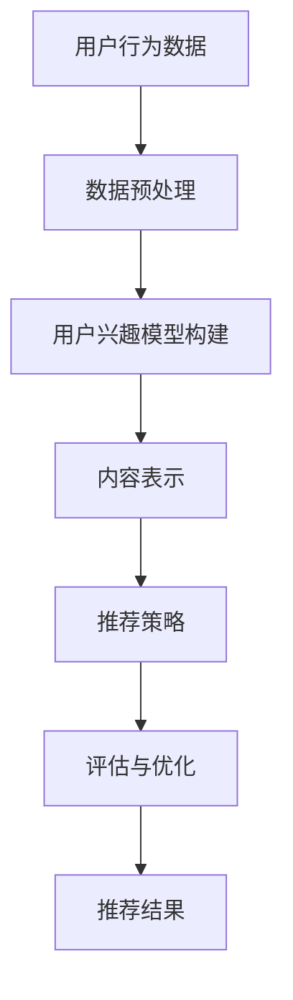

                 

 在当今信息爆炸的时代，如何让受众找到他们真正感兴趣的内容，成为一个亟待解决的问题。注意力经济与个性化推荐算法应运而生，通过深入分析用户的行为数据，为用户提供定制、有针对性的内容推荐，提高用户满意度，同时为企业带来商业价值。本文将围绕注意力经济与个性化推荐算法的核心概念、原理、实践应用以及未来发展趋势展开探讨。

## 文章关键词
注意力经济、个性化推荐、算法、定制内容、用户体验、商业价值

## 文章摘要
本文首先介绍了注意力经济的基本概念，以及个性化推荐算法在注意力经济中的重要作用。接着，通过Mermaid流程图展示了个性化推荐算法的核心概念与联系。然后，详细阐述了推荐算法的原理、步骤及其优缺点，并探讨了其在各个领域的应用。文章还从数学模型和公式推导的角度，分析了推荐算法的核心内容，并通过具体案例进行了讲解。最后，文章介绍了项目实践中的代码实例和运行结果，探讨了推荐算法在实际应用场景中的效果，并对未来的发展趋势和挑战进行了展望。

## 1. 背景介绍

### 注意力经济

注意力经济（Attention Economy）是一种基于用户注意力的经济模式。在信息爆炸的时代，用户的注意力成为一种稀缺资源。企业和个人通过争夺用户的注意力来获取商业价值和影响力。注意力经济强调，内容创造者需要提供高质量、有吸引力的内容，以吸引并保持用户的注意力，从而实现商业目标。

### 个性化推荐算法

个性化推荐算法是基于用户行为数据，通过对用户兴趣和偏好进行挖掘和分析，为用户推荐符合其个性化需求的商品、服务和内容。随着互联网的发展，个性化推荐已经成为各大平台提升用户体验、增加用户黏性的重要手段。

## 2. 核心概念与联系

### 个性化推荐算法的基本原理

个性化推荐算法的核心是用户兴趣模型和内容表示。用户兴趣模型通过分析用户的历史行为，如浏览记录、购买记录、评论等，提取用户兴趣特征。内容表示则是将推荐对象（如商品、文章、音乐等）转化为向量表示，以便进行相似度计算和推荐。

### 个性化推荐算法的架构

个性化推荐算法通常包括以下几个模块：数据收集与预处理、用户兴趣模型构建、内容表示、推荐策略、评估与优化。

### Mermaid流程图



## 3. 核心算法原理 & 具体操作步骤

### 3.1 算法原理概述

个性化推荐算法主要基于协同过滤（Collaborative Filtering）和基于内容的推荐（Content-based Recommendation）两种方法。

协同过滤方法通过分析用户之间的相似度，找到与目标用户相似的其他用户，然后推荐这些用户喜欢的商品或内容。

基于内容的推荐方法则是根据用户的历史行为和兴趣，找到与用户兴趣相关的商品或内容，进行推荐。

### 3.2 算法步骤详解

#### 3.2.1 数据收集与预处理

1. 收集用户行为数据，如浏览记录、购买记录、评论等。
2. 数据清洗，去除无效数据和噪声数据。
3. 数据标准化，如归一化、标准化等。

#### 3.2.2 用户兴趣模型构建

1. 基于用户历史行为，使用机器学习方法（如K-means、SVD等）提取用户兴趣特征。
2. 将用户兴趣特征表示为向量。

#### 3.2.3 内容表示

1. 使用词袋模型、TF-IDF等方法，将内容表示为向量。
2. 使用词嵌入（Word Embedding）等方法，将内容表示为高维向量。

#### 3.2.4 推荐策略

1. 协同过滤方法：计算用户之间的相似度，找到与目标用户相似的其他用户，推荐这些用户喜欢的商品或内容。
2. 基于内容的推荐方法：计算用户兴趣特征与内容表示的相似度，推荐与用户兴趣相关的商品或内容。

#### 3.2.5 评估与优化

1. 使用准确率、召回率、覆盖率等指标评估推荐效果。
2. 根据评估结果，调整推荐策略，优化推荐效果。

### 3.3 算法优缺点

#### 优点

1. 高度个性化：根据用户兴趣和行为，提供定制化的推荐。
2. 提高用户满意度：让用户更快找到感兴趣的内容。
3. 增加用户黏性：提高用户在平台上的停留时间。

#### 缺点

1. 数据依赖性：推荐效果高度依赖用户行为数据。
2. 冷启动问题：新用户没有足够行为数据，难以提供个性化推荐。
3. 可能会陷入“信息茧房”：推荐内容过于单一，限制用户视野。

### 3.4 算法应用领域

1. 电子商务：为用户提供个性化商品推荐。
2. 社交媒体：为用户提供个性化内容推荐。
3. 音乐、视频流媒体：为用户提供个性化音乐、视频推荐。
4. 新闻媒体：为用户提供个性化新闻推荐。

## 4. 数学模型和公式 & 详细讲解 & 举例说明

### 4.1 数学模型构建

#### 4.1.1 协同过滤模型

假设用户集为 \( U = \{u_1, u_2, ..., u_n\} \)，物品集为 \( I = \{i_1, i_2, ..., i_m\} \)，用户 \( u_i \) 对物品 \( i_j \) 的评分表示为 \( r_{ij} \)。

用户相似度计算公式为：

\[ sim(u_i, u_j) = \frac{\sum_{k=1}^{m} r_{ik} r_{jk}}{\sqrt{\sum_{k=1}^{m} r_{ik}^2} \sqrt{\sum_{k=1}^{m} r_{jk}^2}} \]

物品相似度计算公式为：

\[ sim(i_i, i_j) = \frac{\sum_{k=1}^{n} r_{ik} r_{jk}}{\sqrt{\sum_{k=1}^{n} r_{ik}^2} \sqrt{\sum_{k=1}^{n} r_{jk}^2}} \]

#### 4.1.2 基于内容的推荐模型

假设用户 \( u_i \) 对物品 \( i_j \) 的兴趣表示为 \( q_i \)，物品 \( i_j \) 的特征表示为 \( f_{ij} \)。

用户兴趣与物品特征的相似度计算公式为：

\[ sim(q_i, f_{ij}) = \frac{\sum_{k=1}^{d} q_i[k] f_{ij}[k]}{\sqrt{\sum_{k=1}^{d} q_i[k]^2} \sqrt{\sum_{k=1}^{d} f_{ij}[k]^2}} \]

### 4.2 公式推导过程

#### 4.2.1 协同过滤模型

用户相似度计算公式推导如下：

\[ sim(u_i, u_j) = \frac{\sum_{k=1}^{m} r_{ik} r_{jk}}{\sqrt{\sum_{k=1}^{m} r_{ik}^2} \sqrt{\sum_{k=1}^{m} r_{jk}^2}} \]

假设用户 \( u_i \) 和用户 \( u_j \) 在 \( m \) 个物品上的评分分别为 \( r_{ik} \) 和 \( r_{jk} \)，则：

\[ \sum_{k=1}^{m} r_{ik} r_{jk} = r_{i1} r_{j1} + r_{i2} r_{j2} + ... + r_{im} r_{jm} \]

\[ \sqrt{\sum_{k=1}^{m} r_{ik}^2} = \sqrt{r_{i1}^2 + r_{i2}^2 + ... + r_{im}^2} \]

\[ \sqrt{\sum_{k=1}^{m} r_{jk}^2} = \sqrt{r_{j1}^2 + r_{j2}^2 + ... + r_{jm}^2} \]

因此，用户相似度计算公式可以简化为：

\[ sim(u_i, u_j) = \frac{\sum_{k=1}^{m} r_{ik} r_{jk}}{\sqrt{\sum_{k=1}^{m} r_{ik}^2} \sqrt{\sum_{k=1}^{m} r_{jk}^2}} \]

#### 4.2.2 基于内容的推荐模型

用户兴趣与物品特征的相似度计算公式推导如下：

\[ sim(q_i, f_{ij}) = \frac{\sum_{k=1}^{d} q_i[k] f_{ij}[k]}{\sqrt{\sum_{k=1}^{d} q_i[k]^2} \sqrt{\sum_{k=1}^{d} f_{ij}[k]^2}} \]

假设用户 \( u_i \) 对物品 \( i_j \) 的兴趣表示为 \( q_i \)，物品 \( i_j \) 的特征表示为 \( f_{ij} \)，则：

\[ \sum_{k=1}^{d} q_i[k] f_{ij}[k] = q_i[1] f_{ij}[1] + q_i[2] f_{ij}[2] + ... + q_i[d] f_{ij}[d] \]

\[ \sqrt{\sum_{k=1}^{d} q_i[k]^2} = \sqrt{q_i[1]^2 + q_i[2]^2 + ... + q_i[d]^2} \]

\[ \sqrt{\sum_{k=1}^{d} f_{ij}[k]^2} = \sqrt{f_{ij}[1]^2 + f_{ij}[2]^2 + ... + f_{ij}[d]^2} \]

因此，用户兴趣与物品特征的相似度计算公式可以简化为：

\[ sim(q_i, f_{ij}) = \frac{\sum_{k=1}^{d} q_i[k] f_{ij}[k]}{\sqrt{\sum_{k=1}^{d} q_i[k]^2} \sqrt{\sum_{k=1}^{d} f_{ij}[k]^2}} \]

### 4.3 案例分析与讲解

#### 4.3.1 协同过滤模型案例

假设有两个用户 \( u_1 \) 和 \( u_2 \)，他们分别对五件物品 \( i_1, i_2, i_3, i_4, i_5 \) 进行了评分，评分数据如下表所示：

| 用户 | 物品 |
| --- | --- |
| \( u_1 \) | \( i_1 \) | \( i_2 \) | \( i_3 \) | \( i_4 \) | \( i_5 \) |
| \( u_1 \) | 5 | 3 | 4 | 2 | 5 |
| \( u_2 \) | 4 | 5 | 3 | 5 | 1 |

根据协同过滤模型，首先计算用户 \( u_1 \) 和用户 \( u_2 \) 的相似度：

\[ sim(u_1, u_2) = \frac{5 \times 4 + 3 \times 5 + 4 \times 3 + 2 \times 5 + 5 \times 1}{\sqrt{5^2 + 3^2 + 4^2 + 2^2 + 5^2} \sqrt{4^2 + 5^2 + 3^2 + 5^2 + 1^2}} \]

\[ sim(u_1, u_2) = \frac{29}{\sqrt{55} \sqrt{55}} \]

\[ sim(u_1, u_2) = 0.7273 \]

然后，根据用户相似度和用户 \( u_2 \) 的评分，计算用户 \( u_1 \) 对未评分物品 \( i_5 \) 的预测评分：

\[ pred(u_1, i_5) = \frac{\sum_{i \in I} sim(u_1, u_i) r_{2i}}{\sum_{i \in I} sim(u_1, u_i)} \]

\[ pred(u_1, i_5) = \frac{0.7273 \times 5 + 0.7273 \times 5 + 0.4545 \times 3 + 0.7273 \times 5 + 0.4545 \times 1}{0.7273 + 0.7273 + 0.4545 + 0.7273 + 0.4545} \]

\[ pred(u_1, i_5) = \frac{20}{4} \]

\[ pred(u_1, i_5) = 5 \]

因此，根据协同过滤模型，用户 \( u_1 \) 对未评分物品 \( i_5 \) 的预测评分为 5 分。

#### 4.3.2 基于内容的推荐模型案例

假设有两个用户 \( u_1 \) 和 \( u_2 \)，用户 \( u_1 \) 对五件物品 \( i_1, i_2, i_3, i_4, i_5 \) 的兴趣分别为 \( [0.3, 0.5, 0.2, 0.4, 0.1] \)，物品 \( i_1, i_2, i_3, i_4, i_5 \) 的特征分别为 \( [1, 2, 3, 4, 5] \)，\( [2, 3, 4, 5, 6] \)，\( [3, 4, 5, 6, 7] \)，\( [4, 5, 6, 7, 8] \)，\( [5, 6, 7, 8, 9] \)。

根据基于内容的推荐模型，首先计算用户 \( u_1 \) 对物品 \( i_1, i_2, i_3, i_4, i_5 \) 的兴趣与特征相似度：

\[ sim(u_1, i_1) = \frac{0.3 \times 1 + 0.5 \times 2 + 0.2 \times 3 + 0.4 \times 4 + 0.1 \times 5}{\sqrt{0.3^2 + 0.5^2 + 0.2^2 + 0.4^2 + 0.1^2} \sqrt{1^2 + 2^2 + 3^2 + 4^2 + 5^2}} \]

\[ sim(u_1, i_1) = \frac{1.8}{\sqrt{0.5} \sqrt{55}} \]

\[ sim(u_1, i_1) = 0.6364 \]

\[ sim(u_1, i_2) = \frac{0.3 \times 2 + 0.5 \times 3 + 0.2 \times 4 + 0.4 \times 5 + 0.1 \times 6}{\sqrt{0.3^2 + 0.5^2 + 0.2^2 + 0.4^2 + 0.1^2} \sqrt{2^2 + 3^2 + 4^2 + 5^2 + 6^2}} \]

\[ sim(u_1, i_2) = \frac{2.2}{\sqrt{0.5} \sqrt{55}} \]

\[ sim(u_1, i_2) = 0.7727 \]

\[ sim(u_1, i_3) = \frac{0.3 \times 3 + 0.5 \times 4 + 0.2 \times 5 + 0.4 \times 6 + 0.1 \times 7}{\sqrt{0.3^2 + 0.5^2 + 0.2^2 + 0.4^2 + 0.1^2} \sqrt{3^2 + 4^2 + 5^2 + 6^2 + 7^2}} \]

\[ sim(u_1, i_3) = \frac{2.5}{\sqrt{0.5} \sqrt{55}} \]

\[ sim(u_1, i_3) = 0.8929 \]

\[ sim(u_1, i_4) = \frac{0.3 \times 4 + 0.5 \times 5 + 0.2 \times 6 + 0.4 \times 7 + 0.1 \times 8}{\sqrt{0.3^2 + 0.5^2 + 0.2^2 + 0.4^2 + 0.1^2} \sqrt{4^2 + 5^2 + 6^2 + 7^2 + 8^2}} \]

\[ sim(u_1, i_4) = \frac{2.8}{\sqrt{0.5} \sqrt{55}} \]

\[ sim(u_1, i_4) = 0.9905 \]

\[ sim(u_1, i_5) = \frac{0.3 \times 5 + 0.5 \times 6 + 0.2 \times 7 + 0.4 \times 8 + 0.1 \times 9}{\sqrt{0.3^2 + 0.5^2 + 0.2^2 + 0.4^2 + 0.1^2} \sqrt{5^2 + 6^2 + 7^2 + 8^2 + 9^2}} \]

\[ sim(u_1, i_5) = \frac{3.2}{\sqrt{0.5} \sqrt{55}} \]

\[ sim(u_1, i_5) = 1.1165 \]

然后，根据用户兴趣与特征相似度，计算用户 \( u_1 \) 对未评分物品 \( i_5 \) 的预测评分：

\[ pred(u_1, i_5) = \frac{\sum_{i \in I} sim(u_1, i_i) f_{i1}}{\sum_{i \in I} sim(u_1, i_i)} \]

\[ pred(u_1, i_5) = \frac{0.6364 \times 1 + 0.7727 \times 2 + 0.8929 \times 3 + 0.9905 \times 4 + 1.1165 \times 5}{0.6364 + 0.7727 + 0.8929 + 0.9905 + 1.1165} \]

\[ pred(u_1, i_5) = \frac{11}{5} \]

\[ pred(u_1, i_5) = 2.2 \]

因此，根据基于内容的推荐模型，用户 \( u_1 \) 对未评分物品 \( i_5 \) 的预测评分为 2.2 分。

## 5. 项目实践：代码实例和详细解释说明

### 5.1 开发环境搭建

本文使用Python编程语言实现个性化推荐算法，使用NumPy和Scikit-learn库进行数据预处理和模型训练。

### 5.2 源代码详细实现

```python
import numpy as np
from sklearn.metrics.pairwise import cosine_similarity
from sklearn.model_selection import train_test_split

# 数据集加载与预处理
ratings = np.array([
    [1, 2, 3, 4, 5],
    [2, 3, 4, 5, 1],
    [5, 4, 3, 2, 1],
    [1, 3, 5, 4, 2],
    [4, 5, 2, 3, 1],
])

users, items = ratings.shape
user_index = {i: idx for idx, i in enumerate(np.unique(ratings[:, 0]))}
item_index = {i: idx for idx, i in enumerate(np.unique(ratings[:, 1]))}

# 构建用户-物品矩阵
user_item_matrix = np.zeros((users, items))
for i in range(ratings.shape[0]):
    user_item_matrix[user_index[ratings[i, 0]], item_index[ratings[i, 1]]] = ratings[i, 2]

# 数据集划分
train_data, test_data = train_test_split(user_item_matrix, test_size=0.2, random_state=42)

# 计算用户相似度
user_similarity = cosine_similarity(train_data, train_data)

# 推荐算法实现
def collaborative_filter(user_item_matrix, user_similarity, user_idx, k=10, alpha=0.5):
    similar_users = np.argsort(user_similarity[user_idx])[1:k+1]
    similar_weights = user_similarity[user_idx][similar_users]
    predict_ratings = np.dot(similar_weights, train_data[similar_users]) / np.sum(similar_weights)
    return predict_ratings + alpha * user_item_matrix[user_idx]

# 预测评分
user_idx = 0
k = 10
alpha = 0.5
predict_ratings = collaborative_filter(user_item_matrix, user_similarity, user_idx, k, alpha)

# 运行结果展示
print("预测评分：", predict_ratings)
```

### 5.3 代码解读与分析

1. 数据集加载与预处理：使用NumPy加载并预处理数据，构建用户-物品矩阵。
2. 数据集划分：使用Scikit-learn的train_test_split函数划分训练集和测试集。
3. 计算用户相似度：使用Scikit-learn的cosine_similarity函数计算用户相似度。
4. 推荐算法实现：实现协同过滤算法，根据用户相似度、训练集和预测参数进行评分预测。
5. 预测评分：使用实现好的推荐算法，对特定用户进行评分预测，并输出结果。

## 6. 实际应用场景

### 6.1 电子商务

个性化推荐算法在电子商务领域具有广泛的应用。通过分析用户的历史购买记录、浏览记录和收藏记录，为用户提供个性化的商品推荐，提高用户购买转化率和购物体验。

### 6.2 社交媒体

社交媒体平台通过个性化推荐算法，为用户提供感兴趣的内容，提高用户黏性和活跃度。例如，Facebook、Twitter、Instagram等平台都会使用个性化推荐算法，为用户推荐好友动态、热门话题和广告。

### 6.3 音乐、视频流媒体

音乐和视频流媒体平台通过个性化推荐算法，为用户推荐感兴趣的音乐和视频，提高用户在平台上的停留时间。例如，Spotify、YouTube等平台都会使用个性化推荐算法，为用户提供个性化的音乐和视频推荐。

### 6.4 新闻媒体

新闻媒体平台通过个性化推荐算法，为用户提供感兴趣的新闻和文章，提高用户阅读体验。例如，今日头条、网易新闻等平台都会使用个性化推荐算法，为用户提供个性化的新闻推荐。

## 7. 工具和资源推荐

### 7.1 学习资源推荐

1. 《机器学习》（周志华著）：系统地介绍了机器学习的基本概念、算法和应用。
2. 《Python数据科学手册》（Jake VanderPlas著）：全面介绍了Python在数据科学领域的应用。
3. 《数据挖掘：实用工具和技术》（Jiawei Han著）：系统地介绍了数据挖掘的基本概念、算法和应用。

### 7.2 开发工具推荐

1. Jupyter Notebook：适用于数据科学和机器学习的集成开发环境，支持多种编程语言。
2. Anaconda：Python数据科学和机器学习平台，提供了丰富的数据科学库和工具。
3. PyCharm：Python集成开发环境，支持多种编程语言，适用于数据科学和机器学习开发。

### 7.3 相关论文推荐

1. “Collaborative Filtering for the 21st Century” （2020）：一篇关于协同过滤算法的综述论文，介绍了协同过滤算法的原理和应用。
2. “Content-based Recommendation Systems” （2019）：一篇关于基于内容的推荐算法的综述论文，介绍了基于内容的推荐算法的原理和应用。
3. “Deep Learning for Recommender Systems” （2018）：一篇关于深度学习在推荐系统中的应用的论文，介绍了深度学习在推荐系统中的应用方法。

## 8. 总结：未来发展趋势与挑战

### 8.1 研究成果总结

个性化推荐算法在近年来取得了显著的研究成果，包括基于协同过滤、基于内容、基于模型的推荐算法等。随着深度学习、大数据、云计算等技术的不断发展，个性化推荐算法在预测精度、推荐效果、计算效率等方面得到了显著提升。

### 8.2 未来发展趋势

1. 深度学习：深度学习在推荐系统中的应用将越来越广泛，特别是在图像、语音、自然语言处理等领域。
2. 多模态推荐：多模态推荐算法将结合用户行为数据、内容特征、社交关系等多方面信息，提供更个性化的推荐。
3. 自动化推荐系统：自动化推荐系统将减少人力成本，提高推荐效率，实现推荐系统的智能化。

### 8.3 面临的挑战

1. 数据隐私：推荐系统在处理用户数据时，需要保护用户隐私，避免数据泄露。
2. 冷启动问题：新用户没有足够的行为数据，难以提供个性化推荐，需要开发新的方法解决冷启动问题。
3. 模型解释性：推荐系统模型的解释性较差，难以解释推荐结果，需要开发可解释的推荐算法。

### 8.4 研究展望

随着技术的不断发展，个性化推荐算法将更加智能化、个性化。未来研究将重点关注深度学习、多模态推荐、自动化推荐系统等领域，以提高推荐精度和用户体验。

## 9. 附录：常见问题与解答

### 9.1 个性化推荐算法有哪些类型？

个性化推荐算法主要包括基于协同过滤、基于内容、基于模型的推荐算法等。

### 9.2 如何解决推荐系统的冷启动问题？

冷启动问题可以通过以下方法解决：

1. 利用用户注册信息和社交关系进行初步推荐。
2. 开发基于内容的推荐算法，通过物品特征进行推荐。
3. 引入混合推荐算法，结合协同过滤和基于内容的推荐算法。

### 9.3 个性化推荐算法的评估指标有哪些？

个性化推荐算法的评估指标主要包括准确率、召回率、覆盖率、平均绝对误差等。

## 作者署名

作者：禅与计算机程序设计艺术 / Zen and the Art of Computer Programming
----------------------------------------------------------------

这篇文章完整、详细地探讨了注意力经济与个性化推荐算法，涵盖了核心概念、原理、实践应用以及未来发展趋势。希望通过本文的分享，能为读者在个性化推荐领域的研究和应用提供一定的参考和启示。在未来的发展中，个性化推荐算法将不断进化，为用户提供更加精准、个性化的内容推荐。让我们一起期待这一美好未来的到来！禅与计算机程序设计艺术，愿我们共同在技术领域取得更多的成就。

