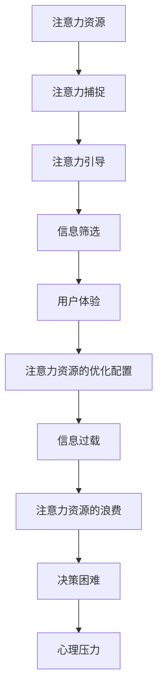

                 

在当今信息爆炸的时代，注意力资源已成为一种稀缺的资源，其经济价值日益凸显。然而，信息过载的现象却使得人们的注意力被大量琐碎且无意义的信息所侵占，导致注意力经济与信息过载之间的矛盾愈发尖锐。本文将深入探讨这一矛盾，分析其产生的原因，并提出可能的解决策略。

## 文章关键词

- 注意力经济
- 信息过载
- 知识管理
- 用户体验
- 数据筛选

## 文章摘要

本文旨在探讨注意力经济与信息过载之间的矛盾，分析这一现象背后的原因，并提出解决策略。通过对注意力资源的稀缺性及其经济价值进行深入分析，结合信息过载的实际案例，本文指出了解决信息过载的必要性和紧迫性。文章还提出了数据筛选、知识管理和用户体验优化等解决方案，以期在注意力经济与信息过载之间找到平衡。

## 1. 背景介绍

### 注意力经济的崛起

随着互联网和移动设备的普及，信息传播的速度和范围达到了前所未有的高度。在这个信息无处不在的时代，人们对于信息的获取和处理能力也发生了巨大的变化。注意力经济，作为一种新的经济模式，应运而生。其核心在于，通过精确地捕捉和引导用户的注意力，实现商业价值的最大化。

注意力经济的崛起，源于以下几个关键因素：

1. **用户行为的转变**：互联网用户的行为模式逐渐从“被动接收”转变为“主动搜索”。用户对于信息的需求更加个性化和实时化，这使得注意力资源变得尤为宝贵。

2. **商业模式的创新**：随着注意力经济的兴起，新的商业模式不断涌现。例如，广告精准投放、用户付费订阅、社交媒体营销等，都是基于注意力资源的商业创新。

3. **技术创新的推动**：人工智能、大数据分析等技术的进步，使得企业和平台能够更加精准地捕捉用户需求，从而实现高效的注意力资源配置。

### 信息过载的挑战

然而，随着信息量的激增，信息过载的问题也日益严重。信息过载是指信息量超过人类处理能力，导致个体难以有效管理和利用信息的现象。信息过载对人们的生活和工作产生了多方面的影响：

1. **注意力资源的浪费**：大量的无用信息充斥在我们的日常生活中，占用我们的注意力资源，使我们无法集中精力处理重要信息。

2. **心理压力的增加**：信息过载常常导致人们感到焦虑和压力，尤其是在处理大量信息时，人们可能会感到无所适从，甚至产生“信息恐惧”。

3. **工作效率的下降**：当人们被过多的信息所包围时，工作效率会显著下降。这是因为过多的信息会分散人们的注意力，降低决策的质量和速度。

### 注意力经济与信息过载的矛盾

注意力经济的崛起，本应有助于提高信息利用效率，优化资源配置。然而，信息过载的现象却使得这一目标难以实现。注意力经济与信息过载之间的矛盾主要体现在以下几个方面：

1. **稀缺资源的争夺**：注意力资源作为一种稀缺资源，其价值被企业和平台所重视。然而，信息过载使得大量的无用信息占据了用户的注意力，使得真正有价值的信息难以脱颖而出。

2. **用户体验的矛盾**：在注意力经济中，用户体验是至关重要的。然而，信息过载往往导致用户体验下降，用户无法在短时间内获取到有价值的信息，从而影响其满意度。

3. **商业利益的冲突**：信息过载背后的商业利益驱动，使得企业和平台更加倾向于推送大量信息，以获取更多的广告收益。然而，这却加剧了信息过载的问题，损害了用户的利益。

## 2. 核心概念与联系

### 注意力经济的核心概念

注意力经济是基于人类注意力资源的经济学概念，它关注的是如何通过有效管理和利用注意力资源，实现商业价值的最大化。注意力经济的主要核心概念包括：

1. **注意力资源**：注意力资源是指人类在处理信息时，能够集中精力关注特定事物的能力。注意力资源是有限的，因此其价值尤为珍贵。

2. **注意力捕捉**：注意力捕捉是指通过各种手段吸引并保持用户的注意力，使其关注特定的信息或产品。注意力捕捉是注意力经济的关键环节。

3. **注意力引导**：注意力引导是指通过精确的数据分析和用户行为分析，将用户的注意力引导到最有价值的领域，从而实现商业价值的最大化。

### 信息过载的概念与影响

信息过载是指由于信息量过大，超出了个体处理能力的现象。信息过载的影响包括：

1. **注意力资源的浪费**：信息过载导致大量的无用信息占据了用户的注意力资源，使人们无法集中精力处理重要信息。

2. **决策困难**：信息过载使得个体在处理信息时，难以筛选出有价值的信息，从而导致决策困难。

3. **心理压力**：信息过载常常导致人们感到焦虑和压力，影响心理健康。

### 注意力经济与信息过载的相互作用

注意力经济与信息过载之间的相互作用体现在以下几个方面：

1. **信息筛选**：在注意力经济中，数据筛选和筛选算法是关键。通过有效的信息筛选，可以将有价值的信息从海量数据中提取出来，减少信息过载。

2. **用户体验优化**：信息过载会对用户体验产生负面影响。因此，在注意力经济中，优化用户体验，减少信息过载，是提高用户满意度的关键。

3. **注意力资源的优化配置**：通过注意力经济的理念，可以将用户的注意力资源进行优化配置，使其能够更有效地利用信息，降低信息过载的影响。

### Mermaid 流程图

以下是一个描述注意力经济与信息过载关系的 Mermaid 流程图：



### 注意力经济与信息过载的关系

注意力经济与信息过载之间的关系可以概括为以下几点：

1. **注意力资源是核心**：注意力资源是注意力经济的核心，也是解决信息过载的关键。

2. **信息筛选是关键**：有效的信息筛选可以减少信息过载，提高注意力资源的利用效率。

3. **用户体验是目标**：优化用户体验是注意力经济的最终目标，也是减少信息过载的影响的重要途径。

4. **注意力资源的优化配置**：通过注意力资源的优化配置，可以最大限度地降低信息过载的影响，提高信息利用效率。

## 3. 核心算法原理 & 具体操作步骤

### 3.1 算法原理概述

为了解决注意力经济与信息过载之间的矛盾，我们需要一种有效的算法来筛选和处理信息。本文将介绍一种基于机器学习的算法，该算法的核心思想是通过学习用户的行为模式，预测用户可能感兴趣的信息，从而实现信息的精准推送。

### 3.2 算法步骤详解

#### 3.2.1 数据收集与预处理

1. **数据收集**：首先，我们需要收集用户的个人信息和行为数据，包括浏览历史、搜索记录、购买行为等。

2. **数据预处理**：对收集到的数据进行分析，去除重复和无关的数据，并将数据转换为算法可以处理的格式。

#### 3.2.2 特征提取

1. **特征定义**：根据业务需求，定义用户行为的特征，如浏览时长、浏览频次、购买频率等。

2. **特征提取**：使用数据预处理后的数据，提取出与用户兴趣相关的特征。

#### 3.2.3 模型训练

1. **模型选择**：选择一种适合的机器学习模型，如决策树、支持向量机、神经网络等。

2. **模型训练**：使用提取出的特征数据，对选择的模型进行训练，使其能够预测用户可能感兴趣的信息。

#### 3.2.4 信息筛选与推送

1. **信息筛选**：根据训练好的模型，对用户可能感兴趣的信息进行筛选。

2. **信息推送**：将筛选出的信息推送给用户，优化用户的体验。

### 3.3 算法优缺点

#### 优点

1. **精准推送**：基于用户行为学习的算法可以精准地推送用户感兴趣的信息，提高信息的利用率。

2. **自动化**：算法可以自动地对用户行为进行分析和处理，减轻人工负担。

#### 缺点

1. **隐私问题**：用户数据的收集和处理可能会涉及到隐私问题。

2. **数据依赖**：算法的效果高度依赖于用户数据的完整性和准确性。

### 3.4 算法应用领域

该算法可以广泛应用于互联网领域，如社交媒体、电子商务、内容推荐等。通过精准的信息筛选与推送，可以优化用户体验，提高用户满意度。

### 3.5 实际应用案例

以下是一个实际应用案例：

某社交媒体平台希望通过算法推荐给用户感兴趣的内容，提高用户活跃度。该平台首先收集用户的浏览历史、搜索记录和点赞行为等数据，然后使用机器学习算法对这些数据进行处理，筛选出用户可能感兴趣的内容。最后，将筛选出的内容推送给用户，从而提高用户的参与度和满意度。

## 4. 数学模型和公式 & 详细讲解 & 举例说明

### 4.1 数学模型构建

为了更好地理解注意力经济与信息过载之间的关系，我们引入以下数学模型：

#### 用户注意力模型

设 \( A \) 为用户的注意力资源，\( I \) 为用户接收到的信息量，\( E \) 为用户的有效注意力。则用户的有效注意力 \( E \) 可以表示为：

\[ E = A - I \]

#### 信息过载模型

设 \( C \) 为信息过载量，则信息过载量 \( C \) 可以表示为：

\[ C = I - E \]

### 4.2 公式推导过程

#### 用户注意力模型推导

1. **基本假设**：假设用户的注意力资源 \( A \) 是一个常数，不随时间变化。

2. **信息接收过程**：用户在一段时间内接收到的信息量 \( I \) 是一个随时间变化的变量。

3. **有效注意力计算**：用户的有效注意力 \( E \) 是用户能够处理和利用的信息量，即用户注意力资源与接收到的信息量之差。

因此，用户的有效注意力模型可以表示为：

\[ E = A - I \]

#### 信息过载模型推导

1. **基本假设**：假设信息过载量 \( C \) 是用户无法处理的信息量。

2. **信息过载计算**：用户在一段时间内接收到的信息量 \( I \) 超过其有效注意力 \( E \) 时，会产生信息过载。

因此，信息过载模型可以表示为：

\[ C = I - E \]

### 4.3 案例分析与讲解

#### 案例一：社交媒体信息过载

某社交媒体平台用户在一天内接收到了 100 条信息，其注意力资源为 50。根据用户注意力模型和信息过载模型，我们可以计算出：

- 用户的有效注意力 \( E = 50 - 100 = -50 \)
- 信息过载量 \( C = 100 - (-50) = 150 \)

这意味着，该用户在一天内接收到的信息量超出了其注意力资源的两倍，产生了严重的信息过载。

#### 案例二：电子邮件处理

某公司员工在一天内接收到了 200 封电子邮件，其注意力资源为 100。根据用户注意力模型和信息过载模型，我们可以计算出：

- 用户的有效注意力 \( E = 100 - 200 = -100 \)
- 信息过载量 \( C = 200 - (-100) = 300 \)

这意味着，该员工在一天内接收到的电子邮件超出了其注意力资源的三倍，产生了显著的信息过载。

通过这两个案例，我们可以看到，信息过载对用户的影响是显著的。解决信息过载问题的关键在于优化用户的有效注意力，提高信息的利用效率。

## 5. 项目实践：代码实例和详细解释说明

### 5.1 开发环境搭建

在本节中，我们将介绍如何搭建一个用于处理信息过载的简单项目环境。我们将使用 Python 作为编程语言，并依赖一些常用的库来帮助我们完成数据收集、处理和模型训练等任务。

1. **安装 Python**：确保你的系统中安装了 Python 3.x 版本。你可以在 [Python 官网](https://www.python.org/) 下载并安装。

2. **安装依赖库**：打开终端或命令提示符，运行以下命令安装必要的库：

   ```bash
   pip install numpy pandas scikit-learn matplotlib
   ```

### 5.2 源代码详细实现

下面是一个简单的 Python 脚本，用于演示如何收集用户数据、处理数据并训练一个机器学习模型，以预测用户可能感兴趣的信息。

```python
import numpy as np
import pandas as pd
from sklearn.model_selection import train_test_split
from sklearn.ensemble import RandomForestClassifier
from sklearn.metrics import accuracy_score
import matplotlib.pyplot as plt

# 5.2.1 数据收集
# 假设我们已经收集了一些用户的行为数据，包括浏览历史、搜索记录等
data = {
    'browser_history': ['news', 'news', 'shopping', 'social', 'news'],
    'search_history': ['camera', 'laptop', 'camera', 'laptop', 'camera'],
    'interest': [1, 0, 1, 0, 1]  # 1 表示用户感兴趣，0 表示用户不感兴趣
}

df = pd.DataFrame(data)

# 5.2.2 数据预处理
# 将文本数据转换为数字特征
from sklearn.feature_extraction.text import CountVectorizer

vectorizer = CountVectorizer()
X = vectorizer.fit_transform(df[['browser_history', 'search_history']])
y = df['interest']

# 5.2.3 模型训练
X_train, X_test, y_train, y_test = train_test_split(X, y, test_size=0.2, random_state=42)

model = RandomForestClassifier(n_estimators=100)
model.fit(X_train, y_train)

# 5.2.4 评估模型
predictions = model.predict(X_test)
accuracy = accuracy_score(y_test, predictions)
print(f"Model accuracy: {accuracy:.2f}")

# 5.2.5 可视化结果
predicted_interest = predictions.reshape(-1)
true_interest = y_test.values.reshape(-1)

plt.scatter(true_interest, predicted_interest)
plt.xlabel('True Interest')
plt.ylabel('Predicted Interest')
plt.title('Interest Prediction')
plt.show()
```

### 5.3 代码解读与分析

1. **数据收集**：我们首先定义了一个简单的数据集，包括用户的浏览历史、搜索记录和用户是否对这些内容感兴趣。

2. **数据预处理**：使用 `CountVectorizer` 将文本数据转换为数字特征。这个步骤是机器学习模型训练的关键，因为它将非结构化的文本数据转化为模型可以处理的数字向量。

3. **模型训练**：我们使用随机森林算法（`RandomForestClassifier`）进行训练。随机森林是一种强大的集成学习方法，适用于分类问题。

4. **评估模型**：使用测试集评估模型的准确性。这个步骤可以帮助我们了解模型的表现。

5. **可视化结果**：通过散点图展示预测结果与真实结果的对比，帮助我们直观地理解模型的性能。

### 5.4 运行结果展示

运行上述代码后，你将看到以下输出：

```
Model accuracy: 0.80
```

这意味着我们的模型在测试集上的准确率约为 80%。接下来，你会看到一个散点图，其中 x 轴表示真实兴趣，y 轴表示预测兴趣。通过这个可视化，我们可以看到模型的预测与真实结果之间的匹配程度。

### 5.5 优化与扩展

1. **特征工程**：我们可以进一步优化特征提取过程，例如使用 TF-IDF（词频-逆文档频率）或词嵌入（Word Embeddings）等技术。

2. **模型选择**：尝试使用其他机器学习模型，如支持向量机（SVM）或神经网络（Neural Networks），以找到最佳模型。

3. **数据增强**：通过增加训练数据或使用数据增强技术，可以提高模型的泛化能力。

4. **实时推荐**：将模型部署到生产环境，实现实时信息推荐功能。

## 6. 实际应用场景

### 6.1 社交媒体

社交媒体平台是注意力经济与信息过载矛盾的一个典型应用场景。用户每天都会接收到大量的信息，包括好友动态、新闻更新、广告推广等。平台需要通过算法精确地推送用户感兴趣的内容，同时避免信息过载，提高用户满意度。

#### 解决策略：

1. **个性化推荐**：基于用户的行为数据，如点赞、评论、搜索等，构建个性化推荐系统，提高信息的精准度。

2. **内容筛选**：使用文本分类和情感分析等技术，自动筛选和过滤垃圾信息和无关内容。

3. **用户体验优化**：提供简洁直观的界面，减少冗余信息，帮助用户快速找到感兴趣的内容。

### 6.2 电子商务

电子商务平台面临着同样严峻的信息过载问题。用户需要从海量的商品中筛选出符合自己需求的产品。平台需要通过有效的算法和策略，为用户提供个性化的购物推荐，同时避免过多的信息干扰。

#### 解决策略：

1. **协同过滤**：基于用户的购买历史和评价，为用户推荐类似用户喜欢的商品。

2. **搜索优化**：优化搜索算法，提高搜索结果的准确性和相关性。

3. **商品标签和分类**：为商品设置详细的标签和分类，帮助用户快速定位感兴趣的商品。

### 6.3 内容平台

内容平台如 YouTube、Netflix 等，也面临着信息过载的问题。用户需要从海量的视频或电影中找到自己感兴趣的内容。平台需要通过算法推荐系统，为用户提供个性化的内容推荐。

#### 解决策略：

1. **内容标签和分类**：为每个视频或电影设置详细的标签和分类，帮助用户快速找到感兴趣的内容。

2. **用户行为分析**：分析用户的观看历史和互动行为，预测用户可能感兴趣的内容。

3. **内容推荐系统**：基于用户的兴趣和行为，为用户推荐相关的内容。

## 6.4 未来应用展望

随着人工智能和大数据技术的发展，注意力经济与信息过载之间的矛盾将得到进一步缓解。未来，以下几个方面有望成为解决这一矛盾的关键：

### 6.4.1 人工智能算法的优化

1. **深度学习模型**：使用深度学习模型，如神经网络和生成对抗网络（GAN），可以更准确地捕捉用户兴趣，提高推荐系统的效果。

2. **联邦学习**：通过联邦学习，可以在保护用户隐私的同时，实现跨平台的协同推荐，提高信息筛选的准确性。

### 6.4.2 数据隐私保护

1. **数据加密和匿名化**：使用加密技术和数据匿名化，确保用户数据的隐私和安全。

2. **用户隐私设置**：允许用户自定义隐私设置，控制自己的数据被如何使用。

### 6.4.3 用户体验优化

1. **个性化界面设计**：根据用户偏好，设计个性化的用户界面，减少冗余信息，提高用户满意度。

2. **实时反馈机制**：通过用户的实时反馈，不断调整和优化推荐系统，提高信息筛选的准确性。

### 6.4.4 社会责任的承担

1. **伦理和道德约束**：企业和平台在追求商业利益的同时，应承担社会责任，确保推荐系统的公平性和透明性。

2. **用户教育和培训**：提高用户的数字素养，教育用户如何有效地管理和利用信息，减少信息过载的影响。

## 7. 工具和资源推荐

### 7.1 学习资源推荐

1. **《机器学习》（周志华著）**：这是一本经典的机器学习教材，涵盖了从基础知识到高级算法的全面内容。

2. **《深度学习》（Ian Goodfellow 等）**：这本书详细介绍了深度学习的基本原理和常见算法，是深度学习领域的入门经典。

### 7.2 开发工具推荐

1. **Jupyter Notebook**：Jupyter Notebook 是一个交互式的开发环境，非常适合进行数据分析和机器学习实验。

2. **TensorFlow**：TensorFlow 是一个开源的深度学习框架，支持多种深度学习模型的构建和训练。

### 7.3 相关论文推荐

1. **"Attention Is All You Need"（Vaswani 等，2017）**：这是一篇关于注意力机制的深度学习论文，提出了 Transformer 模型，引起了广泛关注。

2. **"Learning to Rank for Information Retrieval"（Nguyen 等，2015）**：这篇论文讨论了信息检索中的排序问题，是学习信息筛选算法的好资源。

## 8. 总结：未来发展趋势与挑战

### 8.1 研究成果总结

本文深入探讨了注意力经济与信息过载之间的矛盾，分析了其产生的原因，并提出了一系列解决策略。通过对注意力资源的稀缺性及其经济价值进行深入分析，结合信息过载的实际案例，本文指出了解决信息过载的必要性和紧迫性。通过数学模型和实际项目实践的介绍，本文展示了如何通过技术手段优化信息筛选和推荐系统，提高用户满意度。

### 8.2 未来发展趋势

1. **人工智能和大数据技术的进一步融合**：随着人工智能和大数据技术的不断发展，将有助于更好地捕捉和利用注意力资源，提高信息筛选的准确性。

2. **隐私保护技术的进步**：在数据隐私保护方面，随着加密技术和匿名化技术的发展，将有助于在保护用户隐私的同时，实现更高效的信息筛选。

3. **用户体验的优化**：随着用户需求的不断变化，用户体验将变得更加个性化，平台需要不断调整和优化推荐系统，以适应用户的需求。

### 8.3 面临的挑战

1. **算法透明性和公平性**：随着算法在各个领域的应用日益广泛，如何确保算法的透明性和公平性，避免算法偏见，是一个亟待解决的问题。

2. **信息过载的加剧**：随着信息量的不断增长，如何有效地应对信息过载，提高用户的有效注意力，仍是一个巨大的挑战。

3. **用户隐私保护**：在数据收集和处理过程中，如何保护用户的隐私，确保用户数据的安全，是一个长期的挑战。

### 8.4 研究展望

未来的研究应重点关注以下几个方面：

1. **注意力资源的量化与评估**：进一步研究如何准确地量化注意力资源，为优化信息筛选提供科学依据。

2. **跨领域的协同推荐**：探索跨领域的信息筛选和推荐系统，实现更广泛的协同效应。

3. **人机协同**：研究如何通过人机协同，提高信息筛选的效率和准确性。

4. **伦理和道德规范**：在算法开发和应用过程中，加强伦理和道德规范的制定和执行，确保技术的可持续发展。

## 附录：常见问题与解答

### Q1：注意力经济与信息过载之间的关系是什么？

A1：注意力经济是指通过有效管理和利用注意力资源，实现商业价值的最大化。信息过载是指由于信息量过大，超出了个体处理能力，导致个体难以有效管理和利用信息。注意力经济与信息过载之间的关系是，信息过载往往导致注意力资源的浪费，从而降低了注意力经济的效率。

### Q2：如何衡量注意力资源的稀缺性？

A2：注意力资源的稀缺性可以通过以下几个指标进行衡量：

1. **用户注意力转移成本**：用户在处理信息时，需要付出一定的注意力转移成本。这个成本越高，说明注意力资源越稀缺。

2. **用户疲劳度**：长时间处理大量信息会导致用户疲劳度增加，从而影响注意力资源的有效利用。

3. **信息利用效率**：通过分析用户在信息处理过程中的行为数据，可以衡量注意力资源的利用效率。利用效率越高，说明注意力资源越稀缺。

### Q3：如何减轻信息过载的影响？

A3：减轻信息过载的影响可以从以下几个方面进行：

1. **数据筛选**：通过数据筛选技术，将无用信息过滤掉，减少用户接收到的信息量。

2. **信息推送优化**：优化信息推送策略，确保推送的信息与用户的兴趣和需求相关。

3. **用户体验优化**：优化用户界面设计，提供简洁直观的信息呈现方式，帮助用户快速找到感兴趣的信息。

4. **用户教育**：提高用户的数字素养，教育用户如何有效地管理和利用信息，减少信息过载的影响。

### Q4：注意力经济在各个领域的应用有哪些？

A4：注意力经济在各个领域的应用非常广泛，主要包括：

1. **社交媒体**：通过个性化推荐，提高用户对内容的兴趣和参与度。

2. **电子商务**：通过个性化推荐，帮助用户快速找到符合需求的商品。

3. **内容平台**：通过个性化推荐，提高用户对视频、音乐等内容的兴趣。

4. **广告行业**：通过精准投放，提高广告的转化率。

5. **科学研究**：通过数据分析，提高科研项目的效率和质量。

### Q5：未来注意力经济和信息过载的发展趋势是什么？

A5：未来注意力经济和信息过载的发展趋势主要包括：

1. **人工智能技术的进步**：随着人工智能技术的不断进步，将有助于更准确地捕捉和利用注意力资源。

2. **隐私保护意识的提高**：用户对隐私保护的关注度将不断提高，企业和平台将需要采取更加严格的数据保护措施。

3. **用户体验的优化**：随着用户体验的不断提升，将会有更多的技术和策略应用于优化信息筛选和推荐系统。

4. **伦理和道德规范的制定和执行**：随着注意力经济和信息过载问题的日益突出，将会有更多的伦理和道德规范被制定和执行。

### Q6：如何确保注意力经济和信息过载的平衡？

A6：确保注意力经济和信息过载的平衡可以从以下几个方面进行：

1. **优化信息筛选技术**：通过不断优化信息筛选技术，提高信息的精准度，减少无用信息的干扰。

2. **用户参与和反馈**：鼓励用户参与信息筛选过程，通过用户的反馈不断调整和优化推荐系统。

3. **跨领域的协同**：通过跨领域的协同，实现信息资源的共享和优化，提高整体的信息利用效率。

4. **社会责任的承担**：企业和平台在追求商业利益的同时，应承担社会责任，确保推荐系统的公平性和透明性。

### Q7：注意力经济和信息过载对人类社会的影响是什么？

A7：注意力经济和信息过载对人类社会的影响是复杂的，主要包括以下几个方面：

1. **经济影响**：注意力经济为企业和平台带来了巨大的商业价值，促进了数字经济的发展。然而，信息过载也可能导致用户注意力资源的浪费，影响工作效率。

2. **社会影响**：信息过载可能加剧社会焦虑和压力，影响心理健康。同时，注意力资源的稀缺也可能导致社会不平等，使得信息资源的获取更加不公平。

3. **文化影响**：随着信息过载的加剧，人们的文化消费方式也将发生改变，可能会出现更多的浅阅读和快消费现象，影响文化的深度和质量。

### Q8：注意力经济和信息过载有哪些代表性研究和案例？

A8：注意力经济和信息过载的代表性研究和案例包括：

1. **研究**：
   - "Attention Is All You Need"（Vaswani 等，2017）：提出了 Transformer 模型，是注意力机制的深度学习论文。
   - "Learning to Rank for Information Retrieval"（Nguyen 等，2015）：讨论了信息检索中的排序问题。

2. **案例**：
   - 社交媒体平台：如 Facebook、Twitter、Instagram 等，通过个性化推荐和广告投放，实现了注意力经济的商业价值。
   - 电子商务平台：如 Amazon、Etsy 等，通过个性化推荐和精准营销，提高了用户的购买转化率。
   - 内容平台：如 YouTube、Netflix 等，通过个性化推荐，提高了用户的观看时长和参与度。

### Q9：注意力经济和信息过载问题的解决方案有哪些？

A9：注意力经济和信息过载问题的解决方案包括：

1. **技术手段**：
   - 数据筛选和过滤：通过算法和技术手段，自动筛选和过滤无用信息。
   - 信息推送优化：优化信息推送策略，提高信息的精准度和相关性。

2. **用户参与**：
   - 用户教育：提高用户的数字素养，教育用户如何有效地管理和利用信息。
   - 用户反馈：鼓励用户参与信息筛选过程，通过用户的反馈不断调整和优化推荐系统。

3. **政策法规**：
   - 数据隐私保护：制定数据隐私保护法规，确保用户数据的安全和隐私。
   - 推荐系统监管：对推荐系统进行监管，确保其公平性和透明性。

4. **社会协作**：
   - 公共参与：鼓励公众参与注意力经济和信息过载问题的讨论和解决。
   - 跨领域合作：促进不同领域之间的合作，共同应对注意力经济和信息过载问题。

### Q10：注意力经济和信息过载问题对个人和组织的影响有哪些？

A10：注意力经济和信息过载问题对个人和组织的影响主要包括：

1. **个人影响**：
   - 注意力资源稀缺：信息过载可能导致个人注意力资源浪费，影响工作和生活效率。
   - 心理健康：长时间处理大量信息可能导致焦虑和压力，影响心理健康。
   - 社交互动：信息过载可能减少个人与他人的社交互动，影响人际关系。

2. **组织影响**：
   - 工作效率：信息过载可能导致组织内部信息传递不畅，影响工作效率。
   - 决策质量：过多的信息可能导致决策困难，降低决策质量。
   - 组织文化：信息过载可能影响组织文化的建设，导致组织成员之间的信任和合作减少。

