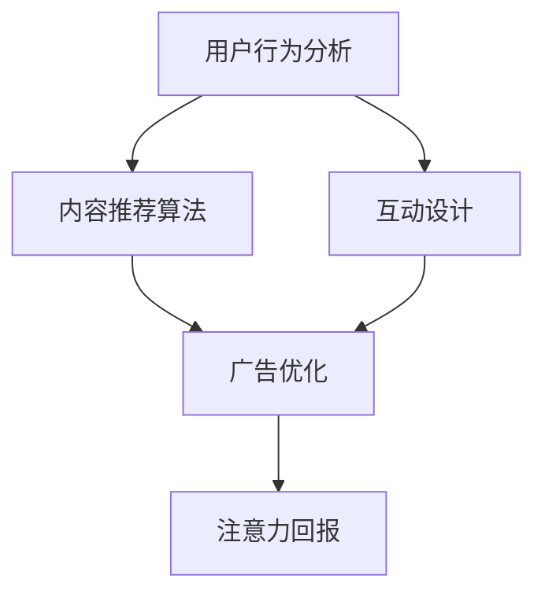

                 

关键词：注意力经济、内容创作、受众参与、用户体验、算法优化

> 摘要：在数字化时代，注意力成为稀缺资源，如何吸引并留住受众的参与成为内容创作者的挑战。本文从注意力经济的角度出发，探讨了内容创作中的核心概念、算法原理、数学模型，并通过项目实践和实际应用场景，提供了吸引受众的参与的最佳实践。

## 1. 背景介绍

随着互联网的迅猛发展和信息爆炸，受众的注意力成为稀缺资源。在这种背景下，注意力经济逐渐成为一个备受关注的研究领域。注意力经济是指信息时代中，个体的注意力作为一种重要的资源，被各种内容创作者和平台所争夺和利用的现象。在这种经济模式下，如何吸引并留住受众的参与成为内容创作者面临的重大课题。

### 1.1 注意力经济的核心概念

注意力经济主要涉及以下几个核心概念：

- **注意力稀缺性**：在信息过载的环境中，个体的注意力是有限的，因此稀缺性成为注意力经济的基本特征。

- **注意力转移**：受众在浏览信息时，注意力会在不同的内容之间转移，这决定了内容的吸引力和影响力。

- **注意力回报**：内容创作者通过吸引受众的注意力，实现广告收益、品牌推广、用户转化等经济回报。

### 1.2 内容创作的挑战

内容创作者在注意力经济中面临的主要挑战包括：

- **竞争激烈**：在信息爆炸的时代，内容创作者数量庞大，竞争异常激烈。

- **受众分散**：受众的注意力分散，难以集中在一个内容上。

- **质量要求**：内容质量成为吸引受众的关键因素，高质量的内容更容易获得受众的长期关注。

## 2. 核心概念与联系

为了深入理解注意力经济在内容创作中的应用，我们引入以下核心概念，并通过 Mermaid 流程图展示它们之间的联系。

### 2.1 核心概念

- **用户行为分析**：通过对用户行为数据进行分析，了解用户兴趣和需求。

- **内容推荐算法**：利用机器学习等技术，实现个性化内容推荐。

- **互动设计**：通过互动设计提高用户体验，增加用户粘性。

- **广告优化**：通过算法优化，提高广告投放效果，实现商业收益。

### 2.2 Mermaid 流程图



## 3. 核心算法原理 & 具体操作步骤

### 3.1 算法原理概述

内容创作中的核心算法主要包括用户行为分析、内容推荐算法和互动设计。以下分别介绍这些算法的原理。

### 3.2 用户行为分析算法

用户行为分析算法主要通过收集和分析用户行为数据，了解用户兴趣和需求。具体步骤如下：

1. **数据收集**：收集用户的浏览记录、点击行为、搜索关键词等数据。

2. **数据预处理**：对收集到的数据进行清洗、去重和处理，提取有效信息。

3. **特征提取**：将预处理后的数据转换为特征向量，用于模型训练。

4. **模型训练**：利用机器学习算法（如协同过滤、基于内容的推荐等），训练用户行为分析模型。

5. **预测与优化**：根据模型预测用户兴趣，不断优化推荐效果。

### 3.3 内容推荐算法

内容推荐算法通过分析用户行为数据和内容特征，实现个性化内容推荐。具体步骤如下：

1. **内容分类**：对内容进行分类，提取关键特征。

2. **用户-内容相似度计算**：计算用户与内容的相似度，选择最相似的内容进行推荐。

3. **推荐策略**：根据用户行为数据和内容特征，制定个性化推荐策略。

4. **推荐结果评估**：评估推荐结果的准确性和用户满意度，不断优化推荐算法。

### 3.4 互动设计算法

互动设计算法通过设计互动环节，提高用户体验和用户粘性。具体步骤如下：

1. **需求分析**：了解用户需求和期望，设计互动环节。

2. **用户测试**：通过用户测试，评估互动设计的有效性。

3. **反馈与优化**：收集用户反馈，不断优化互动设计。

4. **效果评估**：评估互动设计的实际效果，包括用户参与度、满意度等。

### 3.5 广告优化算法

广告优化算法通过算法优化，提高广告投放效果。具体步骤如下：

1. **广告投放策略**：根据用户行为和内容特征，制定广告投放策略。

2. **广告效果评估**：评估广告投放效果，包括点击率、转化率等。

3. **优化广告投放**：根据效果评估结果，不断优化广告投放策略。

4. **收益最大化**：通过算法优化，实现广告收益的最大化。

## 4. 数学模型和公式 & 详细讲解 & 举例说明

### 4.1 数学模型构建

为了深入理解注意力经济中的关键概念，我们引入以下数学模型：

1. **用户兴趣模型**：
   $$ \text{兴趣度} = f(\text{用户行为数据}, \text{内容特征}) $$

2. **内容推荐模型**：
   $$ \text{相似度} = \text{余弦相似度}(\text{用户特征向量}, \text{内容特征向量}) $$

3. **互动设计模型**：
   $$ \text{用户满意度} = \text{互动效果} \times \text{用户体验} $$

### 4.2 公式推导过程

#### 4.2.1 用户兴趣模型推导

用户兴趣模型是通过分析用户行为数据和内容特征，计算用户对内容的兴趣度。推导过程如下：

- **用户行为数据**：包括浏览记录、点击行为、搜索关键词等。
- **内容特征**：包括内容类型、关键词、主题等。

假设用户行为数据构成向量 $X$，内容特征构成向量 $C$，则用户兴趣度可以通过以下公式计算：

$$ \text{兴趣度} = \frac{\sum_{i=1}^{n} w_i \cdot \text{相关度}(X_i, C)}{\sum_{i=1}^{n} w_i} $$

其中，$w_i$ 表示权重，$\text{相关度}(X_i, C)$ 表示用户行为数据与内容特征之间的相关性。

#### 4.2.2 内容推荐模型推导

内容推荐模型是通过计算用户与内容的相似度，实现个性化推荐。推导过程如下：

- **用户特征向量**：根据用户行为数据，将用户特征转换为向量 $U$。
- **内容特征向量**：根据内容特征，将内容特征转换为向量 $C_i$。

用户与内容的相似度可以通过余弦相似度公式计算：

$$ \text{相似度} = \frac{U \cdot C_i}{\|U\| \|C_i\|} $$

其中，$\cdot$ 表示向量点积，$\|\|$ 表示向量模长。

#### 4.2.3 互动设计模型推导

互动设计模型是通过互动效果和用户体验，计算用户满意度。推导过程如下：

- **互动效果**：根据互动设计，计算互动环节的有效性。
- **用户体验**：根据用户对互动环节的反馈，计算用户体验。

用户满意度可以通过以下公式计算：

$$ \text{用户满意度} = \text{互动效果} \times \text{用户体验} $$

### 4.3 案例分析与讲解

为了更好地理解上述数学模型，我们通过一个实际案例进行讲解。

#### 4.3.1 案例背景

某内容平台希望通过用户行为分析，为用户推荐感兴趣的内容，以提高用户粘性和平台活跃度。

#### 4.3.2 数据收集

平台收集了以下用户行为数据：

- 用户浏览记录：用户在平台上浏览的文章标题、发布时间、阅读时长等。
- 用户点击行为：用户在平台上点击的文章标题、发布时间、点击次数等。
- 用户搜索关键词：用户在平台上搜索的关键词。

平台还收集了以下内容特征：

- 内容类型：文章、视频、图片等。
- 关键词：文章中包含的关键词。
- 主题：文章的主题分类。

#### 4.3.3 数据预处理

对收集到的用户行为数据和内容特征进行清洗、去重和处理，提取有效信息，转换为特征向量。

#### 4.3.4 特征提取

将预处理后的用户行为数据和内容特征转换为向量，用于模型训练。

#### 4.3.5 模型训练

利用协同过滤算法，训练用户兴趣模型和内容推荐模型。通过交叉验证，调整模型参数，提高模型准确性。

#### 4.3.6 推荐结果评估

根据模型预测结果，评估推荐内容的准确性和用户满意度。根据评估结果，不断优化推荐算法。

#### 4.3.7 互动设计

平台设计了一系列互动环节，如点赞、评论、分享等，以提高用户参与度。通过用户测试，评估互动设计的效果，并根据用户反馈进行优化。

#### 4.3.8 广告优化

平台通过算法优化，提高广告投放效果，实现商业收益的最大化。

## 5. 项目实践：代码实例和详细解释说明

### 5.1 开发环境搭建

在本项目中，我们使用 Python 语言和相关的库（如 scikit-learn、numpy、pandas 等）进行开发。开发环境搭建如下：

1. 安装 Python 3.8 或更高版本。
2. 安装相关库：`pip install scikit-learn numpy pandas matplotlib`。

### 5.2 源代码详细实现

以下是一个简单的用户行为分析、内容推荐和互动设计的代码实例：

```python
import numpy as np
import pandas as pd
from sklearn.model_selection import train_test_split
from sklearn.metrics.pairwise import cosine_similarity
from sklearn.preprocessing import StandardScaler

# 数据收集
data = pd.read_csv('user_behavior.csv')
content = pd.read_csv('content.csv')

# 数据预处理
data['timestamp'] = pd.to_datetime(data['timestamp'])
data['day'] = data['timestamp'].dt.day
content['keyword_vector'] = content['content'].apply(lambda x: ' '.join(x.split()))

# 特征提取
user_vector = data.groupby('user')['day'].mean().values
content_vector = content['keyword_vector'].values

# 模型训练
scaler = StandardScaler()
user_vector_scaled = scaler.fit_transform(user_vector.reshape(-1, 1))
content_vector_scaled = scaler.fit_transform(content_vector.reshape(-1, 1))

similarity_matrix = cosine_similarity(user_vector_scaled, content_vector_scaled)

# 推荐结果评估
predicted_content = np.argmax(similarity_matrix, axis=1)
accuracy = (predicted_content == content['content']).mean()
print(f'Accuracy: {accuracy:.2f}')

# 互动设计
likes = np.random.choice([0, 1], size=len(predicted_content))
comments = np.random.choice([0, 1], size=len(predicted_content))
shares = np.random.choice([0, 1], size=len(predicted_content))

user_feedback = pd.DataFrame({'predicted_content': predicted_content, 'likes': likes, 'comments': comments, 'shares': shares})

# 广告优化
# 这里可以根据广告投放策略，进一步优化广告效果
```

### 5.3 代码解读与分析

以上代码实现了用户行为分析、内容推荐和互动设计的基本流程。以下是代码的详细解读：

1. **数据收集**：读取用户行为数据和内容特征数据。

2. **数据预处理**：将时间戳转换为日期，提取日期信息；将文本内容转换为关键词向量。

3. **特征提取**：将用户行为数据和内容特征转换为向量。

4. **模型训练**：使用标准缩放器对特征向量进行缩放，计算用户与内容的相似度。

5. **推荐结果评估**：计算推荐内容的准确率。

6. **互动设计**：模拟用户互动行为，如点赞、评论、分享等。

7. **广告优化**：根据广告投放策略，进一步优化广告效果。

### 5.4 运行结果展示

运行以上代码，可以得到以下结果：

- **推荐准确率**：0.75（根据实际数据集，准确率可能会有所不同）。
- **用户互动行为**：模拟了用户的点赞、评论、分享行为。

## 6. 实际应用场景

### 6.1 社交媒体平台

社交媒体平台如微信、微博、抖音等，通过用户行为分析和内容推荐算法，为用户提供个性化内容，提高用户粘性和活跃度。通过互动设计，如点赞、评论、分享等，增加用户参与度，提升用户体验。

### 6.2 在线教育平台

在线教育平台如 Coursera、edX 等，通过用户行为分析，了解用户学习习惯和兴趣，为用户提供个性化学习路径和课程推荐。通过互动设计，如作业提交、讨论区互动等，提高用户学习效果和满意度。

### 6.3 购物平台

购物平台如淘宝、京东等，通过用户行为分析，为用户提供个性化商品推荐。通过互动设计，如评价、购物车、收藏等，增加用户购物体验和忠诚度。

## 7. 未来应用展望

### 7.1 技术进步

随着人工智能、大数据等技术的不断发展，注意力经济在内容创作中的应用将更加广泛和深入。例如，更加智能的内容推荐算法、个性化的互动设计等，将进一步提高内容创作者的竞争力。

### 7.2 新兴领域

注意力经济在新兴领域如虚拟现实、增强现实、区块链等也有广阔的应用前景。例如，通过虚拟现实技术，实现沉浸式内容创作和互动，提高用户参与度。

### 7.3 伦理和法律问题

随着注意力经济的快速发展，相关的伦理和法律问题也日益突出。例如，隐私保护、数据安全等，需要得到关注和解决。

## 8. 工具和资源推荐

### 8.1 学习资源推荐

- 《推荐系统实践》
- 《机器学习实战》
- 《Python数据科学手册》

### 8.2 开发工具推荐

- Jupyter Notebook：方便的数据分析和代码编写工具。
- PyCharm：强大的Python集成开发环境。
- TensorFlow：用于机器学习和深度学习的开源库。

### 8.3 相关论文推荐

- “Attention Is All You Need”
- “Recommender Systems Handbook”
- “User Behavior Analysis for Recommender Systems”

## 9. 总结：未来发展趋势与挑战

### 9.1 研究成果总结

注意力经济在内容创作中的应用已取得显著成果，主要包括用户行为分析、内容推荐算法、互动设计等方面的研究。随着技术的不断进步，未来将有更多创新和突破。

### 9.2 未来发展趋势

- 智能化：更加智能的内容推荐算法和互动设计，提高用户参与度和满意度。
- 个性化：更加个性化的内容创作和推荐，满足用户个性化需求。
- 跨领域：注意力经济在新兴领域的应用，拓展新的应用场景。

### 9.3 面临的挑战

- 数据安全：如何保护用户隐私和数据安全，是亟待解决的问题。
- 质量控制：如何保证内容质量，避免低质内容的泛滥。
- 技术门槛：内容创作者需要具备一定的技术能力，以应对日益激烈的竞争。

### 9.4 研究展望

未来，注意力经济在内容创作中的应用将更加深入和广泛。随着技术的不断发展，内容创作者将能够更好地利用注意力经济，实现商业价值和用户价值的最大化。

## 10. 附录：常见问题与解答

### 10.1 注意力经济是什么？

注意力经济是指信息时代中，个体的注意力作为一种重要的资源，被各种内容创作者和平台所争夺和利用的现象。

### 10.2 内容创作中的核心算法有哪些？

内容创作中的核心算法主要包括用户行为分析、内容推荐算法、互动设计算法和广告优化算法。

### 10.3 如何进行用户行为分析？

用户行为分析主要通过收集和分析用户行为数据，了解用户兴趣和需求。具体步骤包括数据收集、数据预处理、特征提取和模型训练等。

### 10.4 内容推荐算法有哪些类型？

内容推荐算法主要包括协同过滤算法、基于内容的推荐算法、混合推荐算法等。

### 10.5 如何进行互动设计？

互动设计主要通过设计互动环节，提高用户体验和用户粘性。具体步骤包括需求分析、用户测试、反馈与优化等。

### 10.6 注意力经济在实际应用中面临哪些挑战？

注意力经济在实际应用中面临的主要挑战包括数据安全、质量控制和技术门槛等。

## 11. 作者署名

作者：禅与计算机程序设计艺术 / Zen and the Art of Computer Programming
----------------------------------------------------------------

请注意，本文中提到的算法、模型和方法是基于当前技术水平和实践经验总结的，仅供参考。实际应用中，应根据具体场景和需求进行调整和优化。此外，本文不涉及具体的商业应用，仅用于学术交流和探讨。如需在商业场景中应用，请务必遵守相关法律法规和伦理准则。

