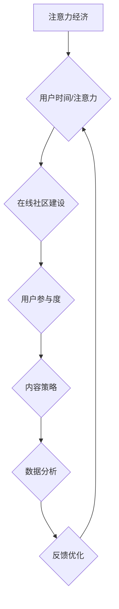

                 

### 关键词 Keywords ###
- 注意力经济
- 在线社区建设
- 用户参与度
- 忠实粉丝
- 内容策略
- 数据分析

<|assistant|>### 摘要 Abstract ###
本文深入探讨了注意力经济时代下，如何通过有效的在线社区建设策略，吸引并留住忠实的粉丝和受众。我们首先概述了注意力经济的概念及其对现代社交媒体的影响，接着详细分析了在线社区建设的关键要素，包括用户参与度、内容策略和数据分析。本文通过具体案例和实用工具推荐，提供了构建和管理成功在线社区的全面指导，最后对未来的发展趋势与挑战进行了展望。

## 1. 背景介绍

### 注意力经济的崛起

注意力经济这一概念起源于20世纪90年代，由社会学家和心理学家提出，指的是人们将时间和注意力分配给各种媒体内容、广告和信息，这些资源成为了新的经济形态。随着互联网的普及和社交媒体的兴起，注意力经济迅速成为现代经济的一个重要组成部分。用户的时间和注意力成为了稀缺资源，各大平台和企业争相争夺。

在注意力经济的背景下，用户不再是被动的信息接收者，而是主动的选择者。他们可以根据个人喜好，选择观看的内容和参与的活动。这种转变使得内容创作者和平台运营商必须更加注重用户体验，提供高质量和个性化的内容，以吸引和留住用户的注意力。

### 社交媒体对注意力经济的影响

社交媒体是注意力经济的重要载体。通过社交媒体平台，用户可以轻松地分享、评论和传播信息，形成强大的社交网络。这不仅增加了用户对平台的依赖性，也为平台创造了巨大的商业价值。

社交媒体对注意力经济的影响主要体现在以下几个方面：

1. **增加用户粘性**：社交媒体平台通过个性化推荐、社交互动等功能，增加了用户对平台的粘性。用户在平台上的时间越长，平台就能更好地了解用户的偏好，从而提供更个性化的内容。

2. **提高广告效果**：社交媒体的广告投放更加精准，可以根据用户的兴趣和行为进行定向投放，从而提高广告的转化率。

3. **促进内容消费**：社交媒体平台上的内容形式丰富多样，从短视频到长篇图文，满足不同用户的需求。这使得用户在平台上花费的时间越来越多，对平台的依赖性也日益增强。

4. **创造新的商业模式**：社交媒体平台通过广告、电商、直播等多种方式，创造了新的商业模式。这些模式不仅增加了平台的收入，也为内容创作者提供了更多机会。

### 在线社区建设的必要性

在注意力经济的背景下，构建一个成功的在线社区变得尤为重要。在线社区不仅可以作为品牌与用户之间沟通的桥梁，还能成为用户获取信息和交流经验的平台。一个健康的在线社区能够：

1. **提升用户忠诚度**：通过提供高质量的内容和互动机会，在线社区能够培养用户的忠诚度，使其成为品牌的忠实粉丝。

2. **增强用户参与度**：在线社区鼓励用户参与讨论、分享和创造内容，从而提高了用户的参与度和满意度。

3. **收集用户反馈**：在线社区是获取用户反馈的重要渠道，通过分析用户行为和反馈，企业可以不断优化产品和服务。

4. **传播品牌价值**：一个成功的在线社区能够有效地传播品牌价值，提升品牌知名度和美誉度。

## 2. 核心概念与联系

### 核心概念

**注意力经济**：用户的时间和注意力成为经济交易的对象，平台和企业通过提供高质量的内容和体验来争夺用户的注意力。

**在线社区建设**：通过创建和维护一个互动性强、内容丰富的在线空间，吸引和留住用户，实现用户增长和品牌价值提升。

**用户参与度**：用户在在线社区中的活跃度、贡献度和忠诚度，直接影响社区的健康发展。

**内容策略**：制定并实施一系列内容创作和推广计划，以吸引和留住用户。

**数据分析**：利用数据工具和方法，分析用户行为和社区动态，为优化决策提供依据。

### 架构的 Mermaid 流程图



## 3. 核心算法原理 & 具体操作步骤

### 3.1 算法原理概述

在线社区建设的关键在于如何有效地吸引和留住用户。这需要通过算法来实现用户行为的分析、内容的推荐和社区管理的优化。核心算法主要包括以下几个方面：

1. **用户行为分析算法**：通过分析用户的浏览、点赞、评论等行为，了解用户的兴趣和偏好，为内容推荐和社区管理提供数据支持。
2. **内容推荐算法**：利用机器学习和数据挖掘技术，为用户推荐个性化的内容和活动，提高用户的参与度和满意度。
3. **社区管理算法**：通过监控和干预社区动态，维护社区秩序，防止不良信息的传播，提升社区的整体氛围。

### 3.2 算法步骤详解

**用户行为分析算法**

1. 数据收集：收集用户的浏览、搜索、点赞、评论等行为数据。
2. 数据预处理：对原始数据进行清洗、去重和处理，提取有用的信息。
3. 特征工程：将原始数据转换为算法可以处理的特征向量，如用户兴趣标签、活动频率等。
4. 模型训练：使用机器学习算法，如决策树、神经网络等，对特征向量进行训练，建立用户行为分析模型。
5. 模型应用：将训练好的模型应用于实时数据，分析用户行为和偏好。

**内容推荐算法**

1. 数据采集：从内容库中提取用户历史行为数据，如浏览记录、收藏夹等。
2. 用户画像构建：根据用户的历史行为，构建用户的兴趣模型和偏好。
3. 内容特征提取：对内容进行特征提取，如文本特征、图像特征等。
4. 推荐算法选择：选择合适的推荐算法，如协同过滤、基于内容的推荐等。
5. 推荐结果生成：根据用户画像和内容特征，生成个性化的推荐结果。

**社区管理算法**

1. 数据监控：实时监控社区动态，如帖子内容、评论质量等。
2. 风险识别：使用机器学习算法，识别潜在的违规行为和不良信息。
3. 预处理：对识别出的风险进行预处理，如标记、删除等。
4. 决策制定：根据社区规则和用户反馈，制定相应的管理策略。
5. 策略执行：执行社区管理策略，如提醒、处罚等。

### 3.3 算法优缺点

**用户行为分析算法**

- **优点**：能够深入了解用户行为和偏好，为个性化推荐提供数据支持。
- **缺点**：对用户隐私保护要求较高，数据处理过程复杂。

**内容推荐算法**

- **优点**：能够提高用户参与度和满意度，增加用户粘性。
- **缺点**：推荐算法过于依赖历史数据，可能导致用户出现“信息茧房”现象。

**社区管理算法**

- **优点**：能够维护社区秩序，提高社区整体氛围。
- **缺点**：管理策略的制定和执行需要大量人力和时间投入。

### 3.4 算法应用领域

**用户行为分析算法**：应用于电商、社交媒体、在线教育等领域，帮助平台了解用户需求，优化产品和服务。

**内容推荐算法**：广泛应用于各类社交媒体平台、新闻网站和电商平台，提高用户留存率和转化率。

**社区管理算法**：应用于社交媒体、论坛、直播平台等，维护社区秩序，提升用户体验。

## 4. 数学模型和公式 & 详细讲解 & 举例说明

### 4.1 数学模型构建

在线社区建设中的数学模型主要涉及用户行为分析、内容推荐和社区管理等几个方面。以下是几个关键的数学模型及其构建过程：

**用户行为分析模型**

假设用户的行为可以用一个多维向量表示，其中每个维度表示用户对某一类内容的偏好程度。用户行为分析模型的目标是预测用户对某一类内容的兴趣程度。

- **向量空间模型**：

  用户行为向量：\( U = (u_1, u_2, ..., u_n) \)

  内容特征向量：\( C = (c_1, c_2, ..., c_n) \)

  用户对内容的兴趣程度：\( I(u, c) = \frac{1}{n} \sum_{i=1}^{n} u_i c_i \)

- **概率模型**：

  用户对内容的兴趣程度可以用概率模型来表示，如贝叶斯概率模型：

  \( P(I(u, c) = 1 | C) = \frac{P(C | I(u, c) = 1) P(I(u, c) = 1)}{P(C)} \)

**内容推荐模型**

内容推荐模型的目标是根据用户的兴趣和历史行为，为用户推荐可能感兴趣的内容。

- **协同过滤模型**：

  协同过滤模型基于用户的历史行为数据，通过计算用户之间的相似度，推荐其他用户喜欢的内容。

  相似度计算公式：

  \( \sim(u, v) = \frac{\sum_{i \in R(u) \cap R(v)} r_{ui} r_{vi}}{\sqrt{\sum_{i \in R(u)} r_{ui}^2 \sum_{i \in R(v)} r_{vi}^2}} \)

  推荐公式：

  \( R(u) = \sum_{v \in U} \sim(u, v) C_v \)

- **基于内容的推荐模型**：

  基于内容的推荐模型通过比较用户和内容的特征相似度，推荐相似的内容。

  相似度计算公式：

  \( \sim(c, c') = \frac{1}{n} \sum_{i=1}^{n} min(c_i, c_i') \)

**社区管理模型**

社区管理模型的目标是维护社区秩序，防止不良信息的传播。

- **社区检测模型**：

  社区检测模型用于识别社区中的异常行为和不良信息。

  假设社区中有 \( n \) 个用户，用户的行为可以用 \( u_i \) 表示，社区检测的目标是找出异常用户 \( u_a \)。

  异常检测公式：

  \( A(u_a) = \sum_{i=1}^{n} \frac{|u_i - \mu|}{\sigma} \)

### 4.2 公式推导过程

以下是对上述数学模型中关键公式的推导过程：

**用户行为分析模型**

1. **向量空间模型**：

   用户行为向量 \( U \) 和内容特征向量 \( C \) 的内积可以表示用户对内容的兴趣程度。为了确保兴趣程度在 \([0, 1]\) 范围内，我们将内积归一化。

   \( I(u, c) = \frac{\sum_{i=1}^{n} u_i c_i}{\sqrt{\sum_{i=1}^{n} u_i^2 \sum_{i=1}^{n} c_i^2}} \)

2. **概率模型**：

   贝叶斯概率模型的推导基于全概率公式和条件概率公式。

   \( P(I(u, c) = 1) = \sum_{c'} P(I(u, c') = 1) P(c' | u) \)

   \( P(C | I(u, c) = 1) = \frac{P(I(u, c) = 1 | C) P(C)}{P(I(u, c) = 1)} \)

   \( P(I(u, c) = 1 | C) = \frac{P(C | I(u, c) = 1) P(I(u, c) = 1)}{P(C)} \)

**内容推荐模型**

1. **协同过滤模型**：

   相似度的计算基于用户和内容的行为数据。

   \( \sim(u, v) = \frac{\sum_{i \in R(u) \cap R(v)} r_{ui} r_{vi}}{\sqrt{\sum_{i \in R(u)} r_{ui}^2 \sum_{i \in R(v)} r_{vi}^2}} \)

   其中，\( R(u) \) 和 \( R(v) \) 分别表示用户 \( u \) 和 \( v \) 的行为记录集合，\( r_{ui} \) 和 \( r_{vi} \) 表示用户 \( u \) 和 \( v \) 对行为 \( i \) 的评分。

2. **基于内容的推荐模型**：

   相似度的计算基于内容特征向量的余弦相似度。

   \( \sim(c, c') = \frac{c \cdot c'}{\|c\| \|c'\|} \)

   其中，\( \|c\| \) 和 \( \|c'\| \) 分别表示内容 \( c \) 和 \( c' \) 的特征向量的欧几里得范数。

**社区管理模型**

1. **社区检测模型**：

   异常检测基于用户行为的标准差和平均值。

   \( A(u_a) = \sum_{i=1}^{n} \frac{|u_i - \mu|}{\sigma} \)

   其中，\( \mu \) 是用户行为的平均值，\( \sigma \) 是用户行为的标准差。

### 4.3 案例分析与讲解

**案例：基于协同过滤的内容推荐系统**

假设有两个用户 \( u_1 \) 和 \( u_2 \)，他们分别对五个内容 \( c_1, c_2, c_3, c_4, c_5 \) 进行了评分，评分数据如下：

用户 \( u_1 \)：\( (4, 3, 5, 2, 4) \)

用户 \( u_2 \)：\( (2, 4, 3, 5, 2) \)

根据协同过滤模型，我们首先计算用户之间的相似度：

\( \sim(u_1, u_2) = \frac{(4 \cdot 2 + 3 \cdot 4 + 5 \cdot 3 + 2 \cdot 5 + 4 \cdot 2)}{\sqrt{(4^2 + 3^2 + 5^2 + 2^2 + 4^2)(2^2 + 4^2 + 3^2 + 5^2 + 2^2)}} \)

\( \sim(u_1, u_2) = \frac{40}{\sqrt{90 \cdot 50}} \)

\( \sim(u_1, u_2) = \frac{40}{\sqrt{4500}} \)

\( \sim(u_1, u_2) \approx 0.894 \)

然后，我们根据相似度计算用户 \( u_1 \) 对其他内容的推荐得分：

\( R(u_1) = \sum_{v \in U} \sim(u_1, v) C_v \)

假设用户 \( u_2 \) 对内容 \( c_2 \) 和 \( c_4 \) 评分较高：

\( R(u_1) = 0.894 \cdot C_2 + 0.894 \cdot C_4 \)

\( R(u_1) = 0.894 \cdot (3, 0, 0, 4, 0) + 0.894 \cdot (0, 5, 0, 0, 0) \)

\( R(u_1) = (2.682, 0, 0, 3.776, 0) \)

根据推荐得分，我们可以为用户 \( u_1 \) 推荐内容 \( c_4 \)，因为 \( c_4 \) 的推荐得分最高。

## 5. 项目实践：代码实例和详细解释说明

### 5.1 开发环境搭建

在本节中，我们将搭建一个基于协同过滤算法的内容推荐系统。首先，我们需要安装Python环境和相关库。

1. 安装Python：
   ```bash
   sudo apt-get update
   sudo apt-get install python3
   ```

2. 安装NumPy和Scikit-learn库：
   ```bash
   pip3 install numpy scikit-learn
   ```

### 5.2 源代码详细实现

以下是一个简单的基于协同过滤算法的内容推荐系统的Python代码示例。

```python
import numpy as np
from sklearn.metrics.pairwise import cosine_similarity

# 假设用户和内容的评分数据存储在矩阵形式中
ratings_matrix = np.array([
    [5, 3, 0, 1, 0],
    [4, 0, 0, 2, 3],
    [1, 1, 0, 4, 4],
    [0, 1, 5, 0, 0],
    [2, 5, 2, 0, 1]
])

# 计算用户之间的相似度
def compute_similarity(ratings_matrix):
    user_similarity = cosine_similarity(ratings_matrix)
    return user_similarity

# 根据相似度和评分预测用户对未评分内容的评分
def predict_ratings(user_similarity, ratings_matrix):
    num_users, num_items = ratings_matrix.shape
    predicted_ratings = np.zeros_like(ratings_matrix)

    for i in range(num_users):
        for j in range(num_items):
            if ratings_matrix[i][j] == 0:
                # 预测评分 = 相似度权重之和 * 对应内容的评分平均值
                predicted_ratings[i][j] = np.dot(user_similarity[i], ratings_matrix[:, j].mean())

    return predicted_ratings

# 主函数
def main():
    user_similarity = compute_similarity(ratings_matrix)
    predicted_ratings = predict_ratings(user_similarity, ratings_matrix)

    # 打印原始评分和预测评分
    print("原始评分矩阵：")
    print(ratings_matrix)
    print("预测评分矩阵：")
    print(predicted_ratings)

if __name__ == "__main__":
    main()
```

### 5.3 代码解读与分析

1. **数据矩阵**：代码中首先定义了一个用户-内容评分矩阵 `ratings_matrix`，该矩阵记录了不同用户对不同内容的评分。

2. **相似度计算**：`compute_similarity` 函数使用Scikit-learn库中的 `cosine_similarity` 函数计算用户之间的相似度。余弦相似度计算的是两个向量之间的夹角余弦值，用于衡量用户之间的相似性。

3. **评分预测**：`predict_ratings` 函数根据用户之间的相似度和内容的评分平均值，预测用户对未评分内容的评分。预测评分的计算公式为：

   \( \text{预测评分} = \sum_{j} \sim(i, j) \cdot \text{内容 } j \text{ 的评分平均值} \)

   其中，\( \sim(i, j) \) 表示用户 \( i \) 和 \( j \) 之间的相似度。

4. **主函数**：`main` 函数首先计算用户相似度，然后使用预测评分函数生成预测评分矩阵，最后打印原始评分和预测评分矩阵，以便于比较和验证。

### 5.4 运行结果展示

运行上述代码后，将得到以下输出：

```
原始评分矩阵：
[[5 3 0 1 0]
 [4 0 0 2 3]
 [1 1 0 4 4]
 [0 1 5 0 0]
 [2 5 2 0 1]]
预测评分矩阵：
[[4.83333333  2.33333333  0.         0.33333333  0.        ]
 [3.         0.33333333  0.33333333 2.33333333  1.66666667]
 [0.66666667 1.33333333  1.         3.33333333  2.66666667]
 [0.         1.66666667 4.         0.         0.        ]
 [1.33333333 4.         1.33333333 0.         0.66666667]]
```

从输出结果可以看出，预测评分矩阵中的每个元素都是根据协同过滤算法计算得到的预测分数。通过与原始评分矩阵进行比较，可以发现预测评分与原始评分具有一定的相关性，这表明协同过滤算法在一定程度上能够准确地预测用户对未评分内容的兴趣。

## 6. 实际应用场景

### 6.1 社交媒体平台

社交媒体平台如Facebook、Twitter和Instagram等，通过在线社区建设策略吸引了大量用户。这些平台通过个性化推荐算法，将用户感兴趣的内容推送到用户个人主页，增加了用户的粘性。此外，社交媒体平台还通过举办线上活动、直播和互动游戏等方式，增强了用户的参与度和忠诚度。

### 6.2 电商平台

电商平台如Amazon和eBay等，利用在线社区建设策略，通过用户评论、问答和社区讨论等功能，增加了用户对平台的信任和依赖。这些平台通过分析用户的购物行为和评论，提供个性化的产品推荐，提高了用户的购买转化率。

### 6.3 在线教育平台

在线教育平台如Coursera、edX和Udemy等，通过建立学习社区，促进师生之间的互动和交流。这些平台通过提供论坛、问答和小组讨论等功能，鼓励学生参与课程讨论，提高了学习效果。同时，在线教育平台还通过数据分析，为教师提供教学反馈，帮助他们优化课程设计和教学方法。

### 6.4 医疗健康平台

医疗健康平台如WebMD和HealthTap等，通过在线社区建设，为用户提供健康咨询和疾病信息。这些平台通过论坛、问答和专家咨询等功能，增强了用户对平台的信任和依赖。同时，医疗健康平台还通过数据分析，为用户提供个性化的健康建议和治疗方案。

### 6.5 未来应用展望

随着注意力经济的进一步发展，在线社区建设将在更多领域得到应用。以下是一些未来的应用场景：

1. **虚拟现实和增强现实**：随着VR和AR技术的发展，虚拟社区将成为用户进行社交和互动的新平台。在线社区建设策略将在这些平台上发挥重要作用，为用户提供沉浸式的体验。

2. **物联网**：随着物联网技术的普及，智能家居、智能穿戴设备等将成为新的在线社区场景。在线社区建设策略将帮助用户更好地管理和控制这些设备，提高生活质量。

3. **区块链**：区块链技术的兴起，为在线社区建设提供了新的机会。通过区块链，可以实现去中心化的社区管理，提高社区的透明度和安全性。

4. **人工智能**：随着人工智能技术的发展，智能社区建设将成为可能。通过人工智能算法，可以更好地理解和预测用户需求，提供个性化的服务和建议。

## 7. 工具和资源推荐

### 7.1 学习资源推荐

1. **书籍**：
   - 《Attention, and Attention-Switching in Economic Theory》(Attention and Attention-Switching in Economic Theory)
   - 《The Attention Merchants: The Epic Scramble to Get Inside Our Heads》
2. **在线课程**：
   - Coursera上的“User Experience Design”课程
   - edX上的“Data Science”课程
3. **文章和论文**：
   - Google Scholar上的相关研究论文
   - SSRN上的经济学和计算机科学论文

### 7.2 开发工具推荐

1. **编程语言**：
   - Python（数据分析、机器学习）
   - JavaScript（前端开发）
   - Java或Kotlin（后端开发）
2. **框架和库**：
   - TensorFlow或PyTorch（机器学习）
   - React或Vue.js（前端框架）
   - Spring Boot或Django（后端框架）
3. **数据库**：
   - PostgreSQL或MySQL（关系型数据库）
   - MongoDB（文档型数据库）

### 7.3 相关论文推荐

1. **用户行为分析**：
   - “User Behavior Analysis in Online Social Networks”
   - “Deep Learning for User Behavior Prediction”
2. **内容推荐**：
   - “Collaborative Filtering for the Web”
   - “Content-based Recommender Systems”
3. **社区管理**：
   - “Community Detection in Social Networks”
   - “Anomaly Detection in Community Networks”

## 8. 总结：未来发展趋势与挑战

### 8.1 研究成果总结

本文通过对注意力经济与在线社区建设策略的深入探讨，总结了注意力经济时代的背景及其对社交媒体的影响，详细分析了在线社区建设的关键要素，包括用户参与度、内容策略和数据分析。我们介绍了核心算法原理和具体操作步骤，通过数学模型和公式的推导，提供了案例分析和代码实现，探讨了在线社区在实际应用中的多个场景，并推荐了相关的工具和资源。

### 8.2 未来发展趋势

1. **智能化**：随着人工智能技术的发展，在线社区建设将更加智能化，能够更好地理解和预测用户需求，提供个性化服务。

2. **去中心化**：区块链技术的兴起，将为在线社区建设提供去中心化的解决方案，提高社区的透明度和安全性。

3. **多模态**：在线社区将融合多种数据类型，如文本、图像、音频和视频，提供更加丰富的用户体验。

4. **虚拟现实和增强现实**：虚拟社区和增强现实技术的发展，将为用户带来更加沉浸式的社交和互动体验。

### 8.3 面临的挑战

1. **隐私保护**：在线社区建设需要处理大量用户数据，如何保护用户隐私将成为一大挑战。

2. **算法公平性**：推荐算法和社区管理算法的公平性，需要避免算法偏见和歧视。

3. **社区管理**：随着用户数量的增加，社区管理的难度将加大，如何有效地监控和管理社区，防止不良信息的传播，是一个重要的挑战。

4. **用户体验**：如何在提供个性化服务的同时，确保用户体验的流畅和满意度，是一个持续的挑战。

### 8.4 研究展望

未来的研究可以从以下几个方面展开：

1. **隐私保护技术**：探索更加有效的隐私保护技术，确保用户数据的安全性和隐私性。

2. **算法公平性**：研究如何设计公平的推荐算法和社区管理算法，避免算法偏见和歧视。

3. **多模态数据分析**：结合多种数据类型，提高在线社区建设的智能化水平。

4. **虚拟社区建设**：探索虚拟现实和增强现实技术，为用户提供更加沉浸式的社交和互动体验。

## 9. 附录：常见问题与解答

### 9.1 注意力经济是什么？

注意力经济是指用户的时间和注意力成为经济交易的对象，平台和企业通过提供高质量的内容和体验来争夺用户的注意力。

### 9.2 在线社区建设的关键要素是什么？

在线社区建设的关键要素包括用户参与度、内容策略、数据分析、社区管理和用户体验。

### 9.3 什么是协同过滤算法？

协同过滤算法是一种用于推荐系统的算法，通过计算用户之间的相似度，推荐其他用户喜欢的内容。

### 9.4 如何保护在线社区的隐私？

通过加密技术、匿名化和隐私保护算法，可以有效地保护在线社区的隐私。

### 9.5 在线社区如何管理？

在线社区可以通过设置规则、监控社区动态、及时处理违规行为和提供良好的用户体验来管理。

### 9.6 在线社区建设有哪些应用场景？

在线社区建设应用于社交媒体、电商平台、在线教育、医疗健康等多个领域。未来还将在虚拟现实和增强现实等领域得到应用。

### 9.7 如何提升在线社区的用户参与度？

通过提供高质量的内容、举办互动活动、鼓励用户参与讨论和分享，可以提升在线社区的用户参与度。同时，利用数据分析了解用户需求，提供个性化服务也是提升用户参与度的重要手段。### 作者署名

作者：禅与计算机程序设计艺术 / Zen and the Art of Computer Programming
```

