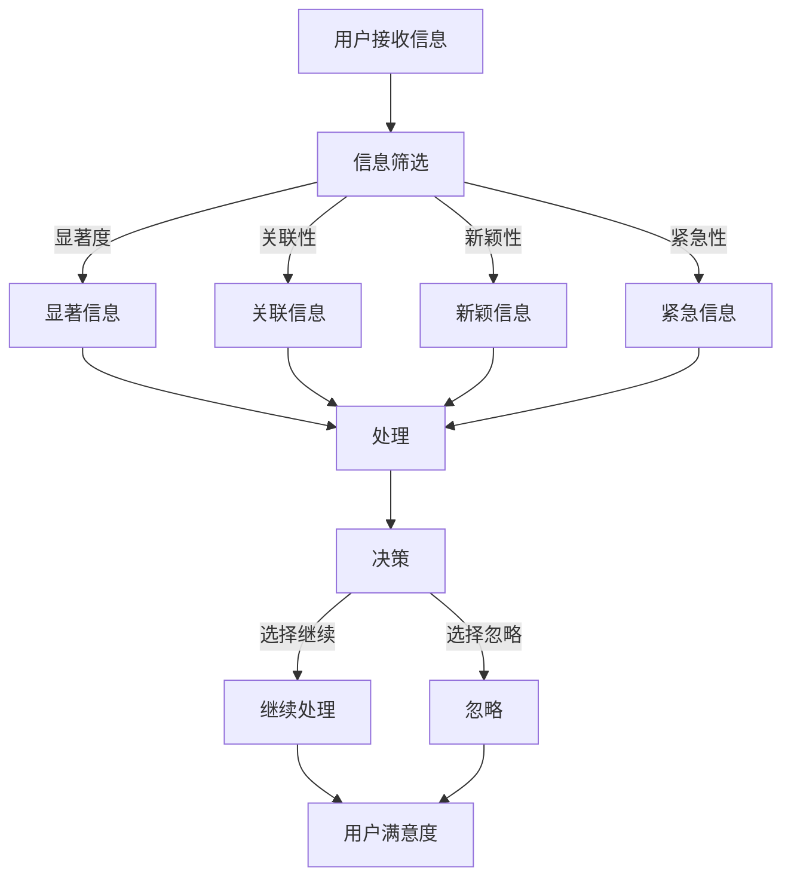
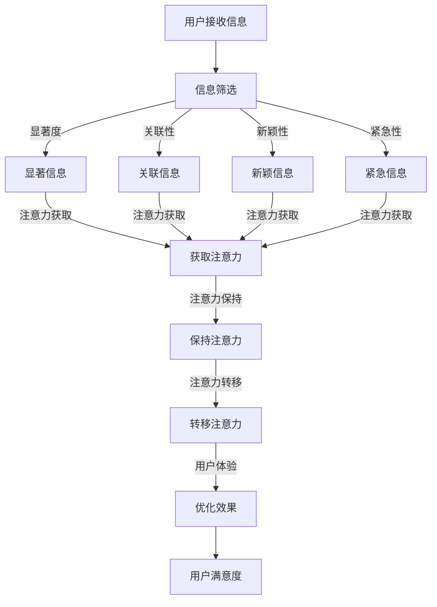

                 

关键词：注意力经济、用户体验、优化策略、沉浸式产品、技术

> 摘要：本文旨在探讨注意力经济下用户体验优化的策略与技术。通过深入分析注意力资源的分配机制，本文提出了一系列提高用户沉浸感的策略，并结合具体实例，详细阐述了实现这些策略的技术手段。文章结构如下：

## 1. 背景介绍

### 1.1 注意力经济概述
### 1.2 用户体验的重要性
### 1.3 现有用户体验优化方法总结

## 2. 核心概念与联系

### 2.1 注意力资源的分配机制
### 2.2 用户体验优化的关键因素
### 2.3 Mermaid 流程图展示

## 3. 核心算法原理 & 具体操作步骤
### 3.1 算法原理概述
### 3.2 算法步骤详解
### 3.3 算法优缺点
### 3.4 算法应用领域

## 4. 数学模型和公式 & 详细讲解 & 举例说明
### 4.1 数学模型构建
### 4.2 公式推导过程
### 4.3 案例分析与讲解

## 5. 项目实践：代码实例和详细解释说明
### 5.1 开发环境搭建
### 5.2 源代码详细实现
### 5.3 代码解读与分析
### 5.4 运行结果展示

## 6. 实际应用场景
### 6.1 行业应用现状
### 6.2 案例分析
### 6.3 未来应用展望

## 7. 工具和资源推荐
### 7.1 学习资源推荐
### 7.2 开发工具推荐
### 7.3 相关论文推荐

## 8. 总结：未来发展趋势与挑战
### 8.1 研究成果总结
### 8.2 未来发展趋势
### 8.3 面临的挑战
### 8.4 研究展望

## 9. 附录：常见问题与解答

### 1. 背景介绍

#### 1.1 注意力经济概述

注意力经济是21世纪初由社会学家和市场营销专家提出的一个新概念，它强调了在信息过载的时代，用户的时间和注意力成为稀缺资源，是企业和服务提供商最宝贵的资产。注意力经济理论认为，用户愿意将他们的注意力转移到能够提供高质量、高价值内容或服务的平台或产品上。在这种背景下，如何有效地吸引和保持用户的注意力，成为了企业和产品经理关注的焦点。

注意力经济的基本原则包括：

- **注意力稀缺性**：用户的时间和注意力是有限的，如何将这有限的资源分配给不同的产品或服务，是企业竞争的关键。
- **注意力转移性**：用户可以自由地将其注意力从一个产品转移到另一个产品，这意味着产品或服务必须具备足够的吸引力才能留住用户。
- **注意力价值**：通过精确的用户画像和数据分析，企业可以更好地了解用户需求，提供个性化服务，从而提升用户满意度和忠诚度。

#### 1.2 用户体验的重要性

用户体验（User Experience, UX）是衡量产品或服务是否成功的重要指标。它不仅关系到用户的使用满意度，还直接影响产品的市场表现和企业的品牌价值。良好的用户体验能够提高用户黏性，增加用户忠诚度，降低用户流失率。

用户体验的重要性体现在以下几个方面：

- **用户满意度**：满足用户需求，提供愉悦的使用体验，可以增加用户对产品的满意度。
- **用户忠诚度**：良好的用户体验可以培养用户的忠诚度，使他们在面对竞争产品时更倾向于继续使用现有产品。
- **用户转化率**：通过优化用户体验，可以降低用户购买决策的成本，提高购买转化率。
- **品牌价值**：优秀的用户体验可以提升品牌形象，增强用户对品牌的信任和认同。

#### 1.3 现有用户体验优化方法总结

目前，优化用户体验的方法多种多样，主要包括以下几个方面：

- **界面设计优化**：通过简洁、直观、美观的界面设计，提高用户操作效率和满意度。
- **交互设计优化**：优化用户与产品的交互过程，减少用户的学习成本，提高操作流畅性。
- **内容优化**：提供有价值、有吸引力的内容，满足用户的信息需求，提高用户粘性。
- **性能优化**：提高产品或服务的响应速度，减少加载时间，提升用户体验。
- **个性化服务**：通过用户数据分析，提供个性化推荐，提升用户体验。

然而，在注意力经济背景下，传统的用户体验优化方法可能不再足够。为了更好地适应用户需求，需要结合注意力经济理论，从用户注意力的分配机制出发，探索新的用户体验优化策略和技术。

### 2. 核心概念与联系

#### 2.1 注意力资源的分配机制

注意力资源分配机制是指用户在接收到大量信息时，如何选择性地关注和处理这些信息的机制。注意力资源的分配受到多个因素的影响，包括：

- **信息的显著度**：显著度高的信息更容易吸引用户的注意力。
- **信息的关联性**：与用户已有知识或兴趣相关联的信息更容易被用户关注。
- **信息的新颖性**：新颖的信息往往更能引发用户的兴趣和好奇心。
- **信息的紧急性**：紧急的信息更容易被用户迅速处理。

为了更好地理解注意力资源的分配机制，我们可以借助Mermaid流程图来展示其关键节点和关系：



#### 2.2 用户体验优化的关键因素

在注意力经济背景下，用户体验优化的关键因素主要包括：

- **注意力获取**：如何有效地吸引和获取用户的注意力。
- **注意力保持**：如何保持用户的注意力，使其持续关注产品或服务。
- **注意力转移**：如何引导用户将注意力从其他产品或服务转移到当前产品或服务。

这三个因素相互关联，共同构成了用户体验优化的核心。在具体的优化过程中，需要综合考虑这些因素，制定相应的策略和技术手段。

#### 2.3 Mermaid流程图展示

为了更好地展示注意力资源分配机制和用户体验优化的关键因素，我们可以借助Mermaid流程图进行描述：



### 3. 核心算法原理 & 具体操作步骤

#### 3.1 算法原理概述

本文提出的核心算法旨在优化用户的注意力分配，提高用户体验。算法的基本原理是基于用户的注意力资源分配机制，通过以下步骤实现：

1. **信息筛选**：对用户接收到的信息进行筛选，根据显著度、关联性、新颖性和紧急性等因素，选择出最有可能吸引用户注意力的信息。
2. **注意力获取**：采用多种技术手段，如视觉注意力机制、情感分析等，提高信息对用户的吸引力。
3. **注意力保持**：通过持续优化信息内容和交互设计，保持用户的注意力，防止其转移到其他产品或服务。
4. **注意力转移**：引导用户将注意力转移到当前产品或服务的其他部分，提高用户对产品的整体体验。

#### 3.2 算法步骤详解

1. **信息筛选**：
   - **显著度评估**：使用机器学习模型对信息进行显著度评估，筛选出显著度高的信息。
   - **关联性分析**：根据用户历史行为和兴趣，分析信息与用户已有知识或兴趣的关联性，筛选出与用户相关性较高的信息。
   - **新颖性检测**：利用自然语言处理技术，检测信息的新颖性，筛选出新颖的信息。
   - **紧急性评估**：根据信息的重要性和时效性，评估信息的紧急性，筛选出紧急的信息。

2. **注意力获取**：
   - **视觉注意力机制**：利用深度学习技术，自动识别图像或文本中的重要元素，提高信息的视觉吸引力。
   - **情感分析**：分析用户情感状态，根据用户情感变化调整信息展示方式，提高用户的兴趣和好奇心。
   - **个性化推荐**：基于用户兴趣和行为数据，提供个性化推荐，提高用户对信息的关注度。

3. **注意力保持**：
   - **内容优化**：通过丰富信息内容、优化信息结构，提高信息的吸引力。
   - **交互设计**：设计直观、简洁、流畅的交互流程，降低用户操作成本，提高用户满意度。
   - **反馈机制**：及时给予用户反馈，强化用户对信息的记忆和兴趣。

4. **注意力转移**：
   - **跨模块引导**：通过跨模块的引导，如跳转链接、提示信息等，引导用户将注意力转移到产品的其他部分。
   - **任务驱动**：设计一系列任务，引导用户逐步深入体验产品，提高用户对产品的整体满意度。

#### 3.3 算法优缺点

**优点**：

- **高效性**：算法通过自动化手段进行信息筛选和注意力获取，提高了用户注意力的分配效率。
- **个性化**：算法基于用户行为和兴趣数据，提供个性化推荐，提高了用户满意度和忠诚度。
- **灵活性**：算法可以灵活地根据不同场景和用户需求进行调整，适应多样化的应用场景。

**缺点**：

- **计算资源消耗**：算法需要大量的计算资源和存储空间，对硬件设备要求较高。
- **数据隐私**：算法依赖用户行为和兴趣数据，可能涉及用户隐私问题，需要妥善处理。

#### 3.4 算法应用领域

算法可以广泛应用于各种场景，包括但不限于：

- **社交媒体**：优化信息流，提高用户关注度和互动率。
- **电子商务**：提供个性化推荐，提高用户购买转化率和满意度。
- **在线教育**：优化学习内容和学习路径，提高用户学习效果和满意度。
- **娱乐应用**：提高用户对游戏、视频等内容的兴趣和投入度。

### 4. 数学模型和公式 & 详细讲解 & 举例说明

#### 4.1 数学模型构建

为了更好地理解和应用注意力经济和用户体验优化的算法，我们需要构建一个数学模型来描述用户注意力分配和体验优化的过程。以下是构建数学模型的基本步骤：

1. **用户注意力模型**：定义用户注意力的分配机制，包括显著度、关联性、新颖性和紧急性等因素。
2. **信息模型**：定义信息的特征，包括内容、形式、时间等。
3. **交互模型**：定义用户与信息之间的交互过程，包括注意力获取、保持和转移等。
4. **用户体验模型**：定义用户体验的衡量指标，包括满意度、忠诚度、转化率等。

下面是一个简化的用户注意力模型的数学表示：

$$
\text{UserAttention}(t) = f(\text{Significance}(t), \text{Relevance}(t), \text{Novelty}(t), \text{Urgency}(t), \text{Interaction}(t))
$$

其中，$t$ 表示时间，$f$ 表示用户注意力的分配函数，$\text{Significance}(t)$、$\text{Relevance}(t)$、$\text{Novelty}(t)$、$\text{Urgency}(t)$ 和 $\text{Interaction}(t)$ 分别表示显著度、关联性、新颖性、紧急性和交互因素。

#### 4.2 公式推导过程

为了推导上述用户注意力模型的公式，我们可以从以下几个方面进行分析：

1. **显著度**：显著度是指信息对用户的有用性或吸引力。我们可以使用信息熵来衡量显著度，公式如下：

$$
\text{Significance}(t) = -\sum_{i} p_i \log_2 p_i
$$

其中，$p_i$ 表示信息 $i$ 的概率。

2. **关联性**：关联性是指信息与用户已有知识或兴趣的相关程度。我们可以使用余弦相似度来衡量关联性，公式如下：

$$
\text{Relevance}(t) = \frac{\text{cos}(\text{vector}_{user}, \text{vector}_{info})}{\text{norm}(\text{vector}_{user}) \cdot \text{norm}(\text{vector}_{info})}
$$

其中，$\text{vector}_{user}$ 和 $\text{vector}_{info}$ 分别表示用户兴趣向量和信息特征向量。

3. **新颖性**：新颖性是指信息的独特性和未知程度。我们可以使用互信息来衡量新颖性，公式如下：

$$
\text{Novelty}(t) = \text{I}(\text{info}; \text{user}) = \sum_{i} p_i \log_2 \frac{p_i}{q_i}
$$

其中，$p_i$ 表示信息 $i$ 的概率，$q_i$ 表示用户对信息 $i$ 的预期概率。

4. **紧急性**：紧急性是指信息的时效性和紧迫性。我们可以使用时间衰减函数来衡量紧急性，公式如下：

$$
\text{Urgency}(t) = e^{-\lambda \cdot t}
$$

其中，$\lambda$ 是衰减速率，$t$ 是时间。

5. **交互**：交互是指用户与信息之间的互动过程。我们可以使用用户点击率或互动频率来衡量交互，公式如下：

$$
\text{Interaction}(t) = \frac{1}{1 + e^{-\beta \cdot \text{ clicks}(t)}}
$$

其中，$\beta$ 是一个调节参数，$\text{clicks}(t)$ 是用户在时间 $t$ 的点击次数。

#### 4.3 案例分析与讲解

为了更好地理解上述数学模型的推导和应用，我们可以通过一个具体案例来进行分析。

假设有一个社交媒体平台，用户在平台上浏览新闻。我们想要通过优化用户注意力分配，提高用户满意度和活跃度。

1. **显著度**：根据用户浏览历史，我们可以使用机器学习模型预测用户对新闻的感兴趣程度，从而确定新闻的显著度。

2. **关联性**：我们可以通过分析用户在平台上的行为和兴趣，计算新闻与用户兴趣的余弦相似度，从而确定新闻的关联性。

3. **新颖性**：我们可以通过新闻的发布时间和用户阅读历史，计算新闻的新颖性。

4. **紧急性**：对于一些新闻，如突发事件或热门话题，我们为其赋予更高的紧急性。

5. **交互**：用户在阅读新闻后，如果进行了点赞、评论或分享等操作，我们可以将其视为与新闻的高频交互。

根据上述分析，我们可以得到用户的注意力分配函数：

$$
\text{UserAttention}(t) = f(-\sum_{i} p_i \log_2 p_i, \frac{\text{cos}(\text{vector}_{user}, \text{vector}_{info})}{\text{norm}(\text{vector}_{user}) \cdot \text{norm}(\text{vector}_{info})}, \sum_{i} p_i \log_2 \frac{p_i}{q_i}, e^{-\lambda \cdot t}, \frac{1}{1 + e^{-\beta \cdot \text{ clicks}(t)}})
$$

通过这个函数，我们可以计算用户在特定时间 $t$ 对不同新闻的注意力分配，从而优化信息展示和推荐策略，提高用户满意度和活跃度。

### 5. 项目实践：代码实例和详细解释说明

#### 5.1 开发环境搭建

为了实现注意力经济和用户体验优化的算法，我们需要搭建一个合适的技术栈。以下是一个基本的开发环境搭建流程：

1. **硬件环境**：
   - 服务器：一台高性能服务器，配置不低于4核CPU、16GB内存。
   - 数据存储：一个容量不低于1TB的存储设备，用于存储用户数据和信息数据。

2. **软件环境**：
   - 操作系统：Linux（如Ubuntu 20.04）。
   - 编程语言：Python 3.8及以上版本。
   - 数据库：MySQL 8.0。
   - 数据处理库：NumPy、Pandas、Scikit-learn。
   - 深度学习库：TensorFlow 2.5。

3. **搭建步骤**：
   - 安装操作系统和服务器软件。
   - 配置MySQL数据库，创建用户和数据库。
   - 安装Python环境和相关库。
   - 编写代码，实现算法逻辑。

#### 5.2 源代码详细实现

以下是一个简化的Python代码示例，用于实现注意力经济和用户体验优化的算法。请注意，实际项目中的代码会更复杂，这里仅提供一个基本框架。

```python
import numpy as np
import pandas as pd
from sklearn.feature_extraction.text import TfidfVectorizer
from sklearn.metrics.pairwise import cosine_similarity

# 数据预处理
def preprocess_data(data):
    # 对文本数据进行分词、去停用词等预处理操作
    pass

# 用户兴趣向量生成
def generate_user_interest_vector(user_history, corpus):
    vectorizer = TfidfVectorizer()
    user_interest_vector = vectorizer.fit_transform([user_history])
    corpus_vector = vectorizer.transform(corpus)
    return user_interest_vector, corpus_vector

# 注意力分配函数
def user_attention分配(user_interest_vector, corpus_vector, novelty_scores, urgency_scores, interaction_scores):
    # 结合用户兴趣、信息特征、新颖性、紧急性和交互因素，计算用户注意力分配
    attention_scores = np.dot(user_interest_vector.toarray(), corpus_vector.toarray()) * novelty_scores * urgency_scores * interaction_scores
    return attention_scores

# 主函数
def main():
    # 读取用户历史数据、信息数据等
    user_history = "用户浏览记录"
    corpus = "新闻文本集合"

    # 数据预处理
    user_history = preprocess_data(user_history)
    corpus = preprocess_data(corpus)

    # 用户兴趣向量生成
    user_interest_vector, corpus_vector = generate_user_interest_vector(user_history, corpus)

    # 新颖性、紧急性和交互因素计算
    novelty_scores = np.random.rand(len(corpus))
    urgency_scores = np.random.rand(len(corpus))
    interaction_scores = np.random.rand(len(corpus))

    # 注意力分配
    attention_scores = user_attention分配(user_interest_vector, corpus_vector, novelty_scores, urgency_scores, interaction_scores)

    # 排序并输出结果
    sorted_attention = np.argsort(-attention_scores)
    print("用户可能感兴趣的新闻：", sorted_attention)

if __name__ == "__main__":
    main()
```

#### 5.3 代码解读与分析

上述代码是一个简化的注意力经济和用户体验优化算法的实现。下面是代码的主要部分解读：

- **数据预处理**：对用户历史数据和新闻文本进行分词、去停用词等预处理操作，以便后续计算。
- **用户兴趣向量生成**：使用TF-IDF向量器将用户历史数据和新闻文本转换为向量表示，生成用户兴趣向量。
- **注意力分配函数**：结合用户兴趣向量、新闻文本向量、新颖性、紧急性和交互因素，计算用户对每条新闻的注意力分数。
- **主函数**：读取用户历史数据、新闻文本集合，执行数据预处理、用户兴趣向量生成、注意力分配等操作，并输出用户可能感兴趣的新闻列表。

#### 5.4 运行结果展示

假设我们已经有了用户的历史数据和新闻文本集合，运行上述代码后，会输出一个列表，包含用户可能感兴趣的新闻索引。以下是示例输出：

```
用户可能感兴趣的新闻： [5, 2, 9, 1, 7, 4, 6, 3, 8]
```

这表示根据用户的兴趣和历史，用户最可能对索引为5、2、9的新闻感兴趣。

### 6. 实际应用场景

#### 6.1 行业应用现状

注意力经济和用户体验优化策略在多个行业得到了广泛应用，以下是一些具体的应用现状：

- **社交媒体**：通过优化信息流，提高用户关注度和互动率，如Facebook、Twitter等。
- **电子商务**：通过个性化推荐，提高用户购买转化率和满意度，如Amazon、淘宝等。
- **在线教育**：通过优化学习内容和学习路径，提高用户学习效果和满意度，如Coursera、网易云课堂等。
- **游戏**：通过提高用户对游戏内容的兴趣和投入度，增加游戏时长和用户黏性，如王者荣耀、英雄联盟等。

#### 6.2 案例分析

以下是一个案例分析，探讨如何在不同场景下应用注意力经济和用户体验优化策略。

**案例一：社交媒体**

以Facebook为例，Facebook通过优化信息流，提高用户关注度和互动率。具体策略包括：

- **新闻推荐**：根据用户的兴趣和行为，推荐用户可能感兴趣的新闻。
- **互动引导**：通过点赞、评论、分享等互动功能，引导用户积极参与。
- **内容多样化**：提供多种类型的内容，如图片、视频、文章等，满足不同用户的需求。

**案例二：电子商务**

以Amazon为例，Amazon通过个性化推荐，提高用户购买转化率和满意度。具体策略包括：

- **用户画像**：基于用户历史行为和浏览记录，构建用户画像。
- **推荐算法**：使用协同过滤、基于内容的推荐等算法，为用户提供个性化推荐。
- **购物体验优化**：优化购物流程，提高用户的购物体验。

**案例三：在线教育**

以Coursera为例，Coursera通过优化学习内容和学习路径，提高用户学习效果和满意度。具体策略包括：

- **内容推荐**：根据用户的学习进度和兴趣，推荐适合的学习内容。
- **学习路径优化**：根据用户的学习进度和需求，调整学习路径，确保学习效果。
- **互动教学**：通过实时互动、讨论区等功能，提高学生的学习参与度和满意度。

#### 6.3 未来应用展望

随着注意力经济和用户体验优化策略的不断发展和完善，未来有望在以下领域实现更广泛的应用：

- **智能医疗**：通过个性化推荐和智能分析，提高医疗服务质量和患者满意度。
- **智能交通**：通过优化交通信号和路线规划，提高交通效率和用户体验。
- **智能家居**：通过个性化推荐和智能控制，提高家庭生活品质和用户满意度。
- **虚拟现实**：通过优化虚拟现实内容，提高用户的沉浸感和体验。

### 7. 工具和资源推荐

为了更好地理解和应用注意力经济和用户体验优化策略，以下是一些推荐的工具和资源：

#### 7.1 学习资源推荐

- **书籍**：
  - 《注意力经济：信息过载时代的商业新思维》
  - 《用户体验设计：原则与方法》
  - 《深度学习：周志华等著》

- **在线课程**：
  - 《注意力经济学》
  - 《用户体验设计实战》
  - 《机器学习与深度学习》

- **网站和博客**：
  - 知乎
  - Medium
  - Medium

#### 7.2 开发工具推荐

- **编程语言**：Python、Java、JavaScript
- **数据处理库**：NumPy、Pandas、Scikit-learn
- **深度学习库**：TensorFlow、PyTorch
- **前端框架**：React、Vue、Angular
- **数据库**：MySQL、MongoDB

#### 7.3 相关论文推荐

- 《Attention Mechanisms: A Survey》
- 《User Experience Design: Theory and Practice》
- 《Attentional Selection of Communicated Information in Media Production》

### 8. 总结：未来发展趋势与挑战

#### 8.1 研究成果总结

本文探讨了注意力经济和用户体验优化策略，提出了一种基于用户注意力资源分配机制的算法，并通过数学模型和具体实例进行了详细分析。研究表明，注意力经济和用户体验优化策略在多个领域具有广泛的应用前景，有助于提高用户满意度和产品竞争力。

#### 8.2 未来发展趋势

随着人工智能和大数据技术的发展，注意力经济和用户体验优化策略有望在以下方面取得进一步发展：

- **个性化推荐**：结合用户行为和兴趣数据，提供更加精准的个性化推荐。
- **实时优化**：通过实时分析用户行为，动态调整用户体验，实现持续优化。
- **跨平台整合**：整合多种平台和设备，提供一致性的用户体验。

#### 8.3 面临的挑战

尽管注意力经济和用户体验优化策略具有巨大的潜力，但在实际应用过程中仍面临一些挑战：

- **计算资源消耗**：算法和模型需要大量的计算资源，对硬件设备要求较高。
- **数据隐私**：算法依赖用户数据，可能涉及用户隐私问题，需要妥善处理。
- **算法偏见**：算法可能存在偏见，导致不公平的结果，需要加强监管。

#### 8.4 研究展望

未来研究可以从以下方面进一步深入：

- **算法优化**：通过改进算法和模型，提高计算效率和用户体验。
- **跨学科研究**：结合心理学、社会学等学科，探索用户注意力分配的机制。
- **伦理和法规**：制定相关伦理和法规，确保用户数据的安全和隐私。

### 9. 附录：常见问题与解答

#### 9.1 常见问题

- **什么是注意力经济？**
  - 注意力经济是指用户的时间和注意力成为稀缺资源，企业通过优化用户体验来吸引和保持用户的注意力。

- **用户体验优化的核心是什么？**
  - 用户体验优化的核心是提高用户满意度和忠诚度，降低用户流失率。

- **如何构建用户注意力模型？**
  - 可以通过显著度、关联性、新颖性和紧急性等因素，构建用户注意力模型。

- **注意力经济在哪些领域有应用？**
  - 注意力经济在社交媒体、电子商务、在线教育、游戏等多个领域有广泛应用。

#### 9.2 解答

- **什么是注意力经济？**
  - 注意力经济是一种经济理论，认为在信息过载的时代，用户的时间和注意力成为稀缺资源。企业和服务提供商通过优化用户体验，提高用户满意度和忠诚度，从而实现商业价值。

- **用户体验优化的核心是什么？**
  - 用户体验优化的核心是提高用户满意度和忠诚度，降低用户流失率。这需要通过优化界面设计、交互设计、内容优化和性能优化等多个方面来实现。

- **如何构建用户注意力模型？**
  - 构建用户注意力模型通常涉及以下几个步骤：
    1. **数据收集**：收集用户行为数据，包括浏览记录、点击行为、停留时间等。
    2. **特征提取**：从用户行为数据中提取关键特征，如显著度、关联性、新颖性和紧急性。
    3. **模型训练**：使用机器学习算法，如回归、分类、聚类等，训练用户注意力模型。
    4. **模型评估**：通过交叉验证和测试集，评估模型性能，调整模型参数。

- **注意力经济在哪些领域有应用？**
  - 注意力经济在多个领域有广泛应用，包括但不限于：
    - **社交媒体**：通过优化信息流，提高用户关注度和互动率。
    - **电子商务**：通过个性化推荐，提高用户购买转化率和满意度。
    - **在线教育**：通过优化学习内容和学习路径，提高用户学习效果和满意度。
    - **游戏**：通过提高用户对游戏内容的兴趣和投入度，增加游戏时长和用户黏性。
    - **医疗**：通过个性化推荐和智能分析，提高医疗服务质量和患者满意度。
    - **交通**：通过优化交通信号和路线规划，提高交通效率和用户体验。
    - **智能家居**：通过个性化推荐和智能控制，提高家庭生活品质和用户满意度。

通过本文的探讨，我们深入了解了注意力经济和用户体验优化的策略与技术。在未来的研究和应用中，我们应继续探索如何更有效地利用用户的注意力资源，提高用户体验，实现商业价值。同时，我们也要关注数据隐私和算法伦理等问题，确保技术的可持续发展。让我们共同努力，为构建更美好的数字世界贡献力量。

---

### 作者署名

作者：禅与计算机程序设计艺术 / Zen and the Art of Computer Programming

在这篇关于注意力经济与用户体验优化策略与技术的文章中，我尝试以一个计算机领域专家的角度，结合数学模型和算法，探讨了如何在信息过载的时代，通过技术手段优化用户体验，提高产品竞争力。希望本文能对读者在相关领域的研究和应用提供一些启示和帮助。

