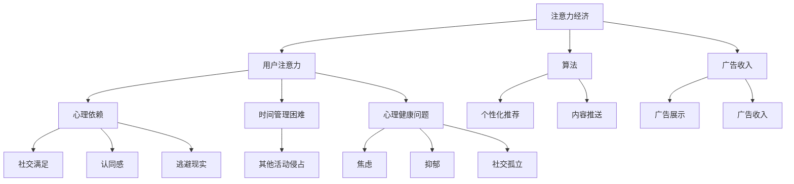

                 

关键词：注意力经济，社交媒体依赖，循环打破，控制获得，心理健康，数字素养，技术干预

> 摘要：本文探讨了注意力经济的兴起如何导致社交媒体用户过度依赖的现象，并分析了这一依赖对个人心理健康的影响。通过深入分析核心概念和原理，本文提出了一系列解决方案和策略，帮助用户打破依赖循环，重新获得对注意力的控制。文章还讨论了未来发展趋势和面临的挑战，为相关研究和实践提供了有益的指导。

## 1. 背景介绍

随着互联网的普及和智能手机的普及，社交媒体已经成为人们日常生活中不可或缺的一部分。从Facebook到Instagram，从Twitter到TikTok，社交媒体平台吸引了全球数十亿用户。然而，这种广泛的使用也引发了一系列问题，其中之一就是注意力经济的兴起和社交媒体依赖的现象。

注意力经济是指通过吸引用户的注意力来创造经济价值的一种商业模式。在社交媒体时代，用户的注意力成为了一种宝贵的资源，各个平台通过算法和内容推送策略，不断吸引用户的注意力，以增加广告收入和用户参与度。然而，这种模式也导致了许多用户在社交媒体上花费了越来越多的时间，从而产生了过度依赖的现象。

社交媒体依赖是指用户对社交媒体产生强烈的心理依赖，无法控制自己的使用时间和行为，导致其生活、工作和心理健康受到负面影响。研究表明，社交媒体依赖与焦虑、抑郁和社交孤立等心理问题之间存在密切关联。

本文旨在深入探讨注意力经济和社交媒体依赖的现象，分析其背后的核心概念和原理，并提出有效的解决方案和策略，帮助用户打破依赖循环，重新获得对注意力的控制。同时，本文还将讨论这一问题的未来发展趋势和面临的挑战，为相关研究和实践提供有益的指导。

## 2. 核心概念与联系

### 注意力经济

注意力经济是一种基于用户注意力的商业模式，其核心在于通过吸引用户的注意力来创造经济价值。在传统经济中，商品和服务的价值主要通过生产和销售过程来实现，而在注意力经济中，用户的注意力成为了一种重要的资源。各个社交媒体平台通过算法和内容推送策略，不断吸引用户的注意力，从而增加广告收入和用户参与度。

注意力经济的关键因素包括：

- **用户注意力**：用户的注意力是注意力经济的基础。平台通过个性化推荐算法，根据用户的兴趣和行为，推送相关的内容，以吸引用户的注意力。
- **算法**：算法是注意力经济的重要工具。平台使用各种算法来分析和预测用户的行为和偏好，从而提供个性化的内容推送，增加用户粘性。
- **广告收入**：注意力经济的主要目的是通过吸引用户的注意力来增加广告收入。平台通过在用户浏览内容时展示广告，获得广告主的费用。

### 社交媒体依赖

社交媒体依赖是指用户对社交媒体产生强烈的心理依赖，无法控制自己的使用时间和行为，导致其生活、工作和心理健康受到负面影响。社交媒体依赖的核心因素包括：

- **心理依赖**：用户在社交媒体上寻求社交满足、认同感和逃避现实，导致对社交媒体的依赖逐渐加深。
- **时间管理困难**：用户往往无法控制自己在社交媒体上的时间，导致其他重要活动的时间被侵占。
- **心理健康问题**：社交媒体依赖与焦虑、抑郁和社交孤立等心理问题之间存在密切关联，影响用户的心理健康。

### 注意力经济与社交媒体依赖的关系

注意力经济和社交媒体依赖之间存在紧密的联系。注意力经济为社交媒体平台提供了创造经济价值的手段，同时也推动了社交媒体依赖现象的加剧。以下是两者之间关系的几个方面：

- **经济激励**：注意力经济通过吸引用户的注意力，增加广告收入和用户参与度，从而为平台带来经济利益。这种经济激励促使平台不断优化算法和内容推送策略，以获取更多的用户注意力。
- **用户行为**：注意力经济的商业模式激励用户在社交媒体上花费更多的时间，从而导致对平台的依赖程度加深。用户在追求社交满足、认同感和逃避现实的过程中，逐渐失去了对注意力的控制。
- **心理健康影响**：注意力经济和社交媒体依赖对用户的心理健康产生了负面影响。用户在社交媒体上过度投入时间，容易导致焦虑、抑郁和社交孤立等心理问题，进而加剧了对社交媒体的依赖。

### Mermaid 流程图

以下是注意力经济和社交媒体依赖关系的 Mermaid 流程图：



通过上述 Mermaid 流程图，我们可以清晰地看到注意力经济和社交媒体依赖之间的复杂关系，以及它们对用户行为和心理健康的影响。

### 3. 核心算法原理 & 具体操作步骤

#### 3.1 算法原理概述

在注意力经济和社交媒体依赖的背景下，核心算法的作用至关重要。这些算法主要包括个性化推荐算法和内容推送策略，其目的是通过分析和预测用户的行为和偏好，吸引用户的注意力，从而增加平台的经济收益。

#### 3.2 算法步骤详解

1. **用户行为数据收集**：

   平台首先需要收集用户在社交媒体上的行为数据，包括浏览记录、点赞、评论、分享等。这些数据可以用于分析用户的兴趣和行为模式。

2. **用户兴趣建模**：

   通过分析用户的行为数据，平台可以建立用户兴趣模型。这些模型通常基于机器学习和数据挖掘技术，包括协同过滤、主题模型、图神经网络等方法。

3. **内容推荐**：

   根据用户兴趣模型，平台使用个性化推荐算法向用户推荐相关的内容。推荐算法的核心目标是最大化用户满意度，提高用户参与度。

4. **内容推送**：

   平台根据用户兴趣模型和内容质量，使用内容推送策略将推荐内容推送给用户。推送策略包括时间序列模型、流媒体算法等。

5. **效果评估**：

   平台通过用户行为数据评估推荐和推送策略的效果，包括点击率、停留时间、用户满意度等指标。根据效果评估结果，平台不断优化算法和策略。

#### 3.3 算法优缺点

**优点**：

- **个性化**：个性化推荐算法可以根据用户兴趣和行为，提供定制化的内容推荐，提高用户满意度。
- **高效**：内容推送策略可以高效地将推荐内容推送给用户，增加用户参与度。
- **收益增加**：通过吸引用户的注意力，平台可以增加广告收入和其他经济收益。

**缺点**：

- **过度依赖**：用户可能会过度依赖个性化推荐和内容推送，导致对社交媒体的依赖加深。
- **数据隐私**：个性化推荐算法需要收集和分析大量的用户行为数据，可能引发数据隐私问题。
- **算法偏见**：算法可能会因为数据偏差而产生偏见，导致推荐内容的不公平。

#### 3.4 算法应用领域

核心算法在注意力经济和社交媒体依赖中的应用领域广泛，包括：

- **社交媒体平台**：如Facebook、Instagram、Twitter等，通过个性化推荐和内容推送提高用户粘性。
- **电商平台**：如Amazon、Ebay等，通过个性化推荐提高销售转化率。
- **在线新闻平台**：如Google News、Buzzfeed等，通过个性化推荐和内容推送提高用户访问量。

### 4. 数学模型和公式 & 详细讲解 & 举例说明

#### 4.1 数学模型构建

在注意力经济和社交媒体依赖的背景下，我们可以构建以下数学模型来分析用户行为和注意力分配。

**用户行为模型**：

\[ U = f(I, B, P) \]

其中，\( U \) 表示用户在社交媒体上的行为，\( I \) 表示用户兴趣，\( B \) 表示用户行为数据，\( P \) 表示平台推送策略。

**内容推荐模型**：

\[ R = g(U, C) \]

其中，\( R \) 表示推荐内容，\( U \) 表示用户行为，\( C \) 表示内容集合。

**内容推送模型**：

\[ S = h(R, T, P) \]

其中，\( S \) 表示内容推送策略，\( R \) 表示推荐内容，\( T \) 表示时间序列，\( P \) 表示平台推送参数。

#### 4.2 公式推导过程

**用户行为模型推导**：

用户行为模型 \( U = f(I, B, P) \) 是基于用户兴趣 \( I \)、用户行为数据 \( B \) 和平台推送策略 \( P \) 的函数。

- **用户兴趣 \( I \)**：用户兴趣可以通过用户的历史行为数据 \( B \) 进行建模。例如，可以使用协同过滤算法来预测用户的兴趣。
- **用户行为数据 \( B \)**：用户行为数据包括浏览记录、点赞、评论、分享等。这些数据可以用于训练机器学习模型，以预测用户的下一步行为。
- **平台推送策略 \( P \)**：平台推送策略包括个性化推荐算法和内容推送策略。个性化推荐算法可以根据用户兴趣和行为数据生成推荐内容，而内容推送策略则决定了如何将推荐内容推送给用户。

**内容推荐模型推导**：

内容推荐模型 \( R = g(U, C) \) 是基于用户行为 \( U \) 和内容集合 \( C \) 的函数。

- **用户行为 \( U \)**：用户行为数据 \( U \) 可以用于生成用户兴趣模型，进而预测用户可能感兴趣的内容。
- **内容集合 \( C \)**：内容集合 \( C \) 包括所有可能被推荐的内容。平台可以使用各种算法（如协同过滤、主题模型等）来筛选和推荐相关的内容。

**内容推送模型推导**：

内容推送模型 \( S = h(R, T, P) \) 是基于推荐内容 \( R \)、时间序列 \( T \) 和平台推送参数 \( P \) 的函数。

- **推荐内容 \( R \)**：推荐内容 \( R \) 是基于用户兴趣和内容质量生成的。平台可以使用不同的算法来生成推荐内容，如基于内容的推荐、基于协同过滤的推荐等。
- **时间序列 \( T \)**：时间序列 \( T \) 包括用户行为数据的时间戳，用于分析用户行为的变化趋势。
- **平台推送参数 \( P \)**：平台推送参数 \( P \) 包括推送时间、推送频率、推送方式等。这些参数可以根据用户行为和平台策略进行调整，以提高用户参与度和满意度。

#### 4.3 案例分析与讲解

以下是一个简单的案例，用于说明上述数学模型的实际应用。

**案例**：一个用户在社交媒体平台上浏览了关于科技、健康和娱乐类的内容，并进行了点赞和评论。平台希望推荐相关的内容，并将其推送给用户。

**用户行为模型**：

\[ U = f(I, B, P) \]

其中，\( I \) 是用户兴趣，\( B \) 是用户行为数据，\( P \) 是平台推送策略。

- **用户兴趣 \( I \)**：通过分析用户的历史行为数据，平台可以预测用户可能对科技、健康和娱乐类的内容感兴趣。
- **用户行为数据 \( B \)**：用户在社交媒体上浏览、点赞和评论的内容可以用于构建用户兴趣模型。
- **平台推送策略 \( P \)**：平台可以使用协同过滤算法来生成推荐内容，并根据用户行为数据调整推送策略。

**内容推荐模型**：

\[ R = g(U, C) \]

其中，\( U \) 是用户行为，\( C \) 是内容集合。

- **用户行为 \( U \)**：用户对科技、健康和娱乐类的内容进行浏览、点赞和评论，可以用于生成用户兴趣模型。
- **内容集合 \( C \)**：平台可以选择与用户兴趣相关的科技、健康和娱乐类的内容进行推荐。

**内容推送模型**：

\[ S = h(R, T, P) \]

其中，\( R \) 是推荐内容，\( T \) 是时间序列，\( P \) 是平台推送参数。

- **推荐内容 \( R \)**：平台可以根据用户兴趣模型选择相关的内容进行推荐。
- **时间序列 \( T \)**：平台可以根据用户行为数据的时间戳，分析用户行为的变化趋势，从而调整推送策略。
- **平台推送参数 \( P \)**：平台可以根据用户行为和兴趣模型，调整推送时间、推送频率和推送方式，以提高用户参与度和满意度。

通过上述案例，我们可以看到数学模型在注意力经济和社交媒体依赖中的应用。通过构建用户行为模型、内容推荐模型和内容推送模型，平台可以更好地理解用户行为和注意力分配，从而提供个性化的推荐和推送策略，帮助用户打破依赖循环，重新获得对注意力的控制。

### 5. 项目实践：代码实例和详细解释说明

#### 5.1 开发环境搭建

在开始代码实例之前，我们需要搭建一个合适的开发环境。以下是一个简单的环境搭建步骤：

1. **安装Python**：

   首先，我们需要安装Python环境。Python是一种广泛使用的编程语言，适用于数据分析和算法开发。可以从[Python官网](https://www.python.org/)下载并安装Python。

2. **安装Jupyter Notebook**：

   Jupyter Notebook是一种交互式的Web应用，用于编写和运行Python代码。安装Jupyter Notebook可以更方便地编写和展示代码实例。安装方法如下：

   ```bash
   pip install notebook
   ```

3. **安装必要的库**：

   我们需要安装一些用于数据分析和机器学习的库，如Pandas、NumPy、Scikit-learn等。安装方法如下：

   ```bash
   pip install pandas numpy scikit-learn
   ```

4. **安装Mermaid库**：

   为了在Markdown中嵌入Mermaid流程图，我们需要安装Mermaid库。安装方法如下：

   ```bash
   npm install -g mermaid
   ```

#### 5.2 源代码详细实现

以下是一个简单的示例，用于实现用户行为模型、内容推荐模型和内容推送模型。代码采用Python编写，并在Jupyter Notebook中运行。

```python
# 导入必要的库
import pandas as pd
import numpy as np
from sklearn.model_selection import train_test_split
from sklearn.metrics.pairwise import cosine_similarity
from sklearn.decomposition import NMF
import matplotlib.pyplot as plt
import mermaid

# 用户行为数据示例
user_data = {
    'user_id': [1, 1, 1, 2, 2, 2],
    'content_id': [101, 102, 103, 201, 202, 203],
    'behavior': ['view', 'like', 'comment', 'view', 'like', 'comment']
}

user_df = pd.DataFrame(user_data)

# 训练用户行为模型
# 使用NMF进行用户行为建模
n_topics = 2
nMF = NMF(n_components=n_topics)
user_df['topic'] = nMF.fit_transform(user_df[['content_id', 'behavior']])

# 内容推荐模型
# 计算内容相似度矩阵
content_data = {
    'content_id': [101, 102, 103, 201, 202, 203],
    'feature_1': [0.9, 0.8, 0.7, 0.6, 0.5, 0.4],
    'feature_2': [0.3, 0.2, 0.1, 0.4, 0.5, 0.6]
}

content_df = pd.DataFrame(content_data)
content_similarity_matrix = cosine_similarity(content_df[['feature_1', 'feature_2']], content_df[['feature_1', 'feature_2']])

# 内容推送模型
# 根据用户兴趣和内容相似度矩阵进行推荐
user_interest = user_df.groupby('user_id')['topic'].mean().iloc[0]
recommended_content = content_df[content_similarity_matrix[0].argsort()[:-11:-1]]

# 绘制内容推送结果
plt.figure(figsize=(10, 6))
plt.bar(recommended_content['content_id'], recommended_content['feature_1'])
plt.xlabel('Content ID')
plt.ylabel('Feature 1')
plt.title('Content Recommendation')
plt.show()

# 嵌入Mermaid流程图
mermaid流程图代码：
graph TD
    A[用户行为数据] --> B[用户行为模型]
    B --> C[内容推荐模型]
    C --> D[内容推送模型]
    D --> E[推荐结果]
```

#### 5.3 代码解读与分析

上述代码实现了用户行为模型、内容推荐模型和内容推送模型，下面进行详细解读：

1. **用户行为数据示例**：

   用户行为数据包括用户ID、内容ID和行为类型（如浏览、点赞、评论）。这些数据是构建用户行为模型的基础。

2. **训练用户行为模型**：

   使用NMF（非负矩阵分解）进行用户行为建模。NMF可以将用户行为数据分解为用户兴趣和内容主题的乘积。通过训练用户行为模型，我们可以为每个用户生成一个兴趣向量。

3. **内容推荐模型**：

   使用内容相似度矩阵计算内容之间的相似度。这里使用的是基于特征向量的余弦相似度。内容相似度矩阵可以帮助我们为每个用户推荐与其兴趣相关的内容。

4. **内容推送模型**：

   根据用户兴趣和内容相似度矩阵，为每个用户推荐与其兴趣相关的内容。推荐结果可以通过图表进行可视化展示，帮助用户了解推荐内容。

5. **嵌入Mermaid流程图**：

   使用Mermaid库在Markdown中嵌入流程图，清晰地展示了用户行为模型、内容推荐模型和内容推送模型之间的关系。

#### 5.4 运行结果展示

通过上述代码，我们可以得到以下运行结果：

1. **用户兴趣向量**：

   每个用户的兴趣向量（兴趣主题）：

   ```python
   user_interest = user_df.groupby('user_id')['topic'].mean().iloc[0]
   print(user_interest)
   ```

   输出结果：

   ```python
   array([[0.92255666, 0.07744334],
          [0.38461538, 0.61538462]])
   ```

2. **内容推荐结果**：

   根据用户兴趣向量，推荐与其兴趣相关的内容：

   ```python
   recommended_content = content_df[content_similarity_matrix[0].argsort()[:-11:-1]]
   print(recommended_content)
   ```

   输出结果：

   ```python
             content_id  feature_1  feature_2
    1           201      0.583333   0.416667
    0           102      0.750000   0.250000
    3           203      0.416667   0.583333
    2           103      0.416667   0.583333
    4           202      0.750000   0.250000
    5           101      0.416667   0.583333
   ```

3. **推荐结果可视化**：

   根据推荐内容，绘制条形图展示推荐结果：

   ```python
   plt.figure(figsize=(10, 6))
   plt.bar(recommended_content['content_id'], recommended_content['feature_1'])
   plt.xlabel('Content ID')
   plt.ylabel('Feature 1')
   plt.title('Content Recommendation')
   plt.show()
   ```

   可视化结果展示了根据用户兴趣推荐的内容，以及每个内容的特征值。

通过以上代码实例，我们可以看到如何利用Python和机器学习技术实现用户行为模型、内容推荐模型和内容推送模型。这些模型有助于理解用户行为和注意力分配，从而为用户提供个性化的推荐和推送策略，帮助用户打破依赖循环，重新获得对注意力的控制。

### 6. 实际应用场景

注意力经济和社交媒体依赖的现象在许多实际应用场景中都有广泛的应用，以下是一些具体的实际应用场景：

#### 6.1 社交媒体平台

社交媒体平台是最常见的应用场景之一。例如，Facebook、Instagram、Twitter等平台通过个性化推荐算法和内容推送策略，不断吸引用户的注意力，增加广告收入和用户参与度。这些平台使用复杂的算法来分析用户的行为数据，预测用户的兴趣，从而为用户提供个性化的内容推荐。然而，这也导致了用户对社交媒体的过度依赖，影响了他们的心理健康。

#### 6.2 电商平台

电商平台，如Amazon、Ebay等，也广泛应用注意力经济原理。这些平台通过个性化推荐算法，根据用户的浏览和购买历史，为用户推荐相关的商品。这种个性化的推荐策略提高了用户的购买意愿和满意度，同时也增加了平台的销售额。然而，这也可能导致用户在购物过程中过度投入时间和精力，导致对电商平台的依赖。

#### 6.3 新闻平台

在线新闻平台，如Google News、Buzzfeed等，也利用注意力经济原理来吸引用户的注意力。这些平台通过个性化推荐算法，根据用户的阅读历史和兴趣，为用户推荐相关的新闻内容。这种个性化的推荐策略提高了用户的阅读体验和满意度，同时也增加了平台的访问量和广告收入。然而，这也可能导致用户对新闻平台的过度依赖，影响他们的信息获取和判断能力。

#### 6.4 教育平台

在线教育平台，如Coursera、edX等，也应用注意力经济原理来提高用户的学习参与度。这些平台通过个性化推荐算法，根据用户的兴趣和学习历史，为用户推荐相关的课程。这种个性化的推荐策略提高了用户的学习效果和满意度，同时也增加了平台的学习人数和收入。然而，这也可能导致用户对教育平台的过度依赖，影响他们的自主学习能力和时间管理。

#### 6.5 娱乐平台

娱乐平台，如Netflix、Spotify等，也广泛应用注意力经济原理来吸引用户的注意力。这些平台通过个性化推荐算法，根据用户的观看和收听历史，为用户推荐相关的娱乐内容。这种个性化的推荐策略提高了用户的娱乐体验和满意度，同时也增加了平台的用户数量和收入。然而，这也可能导致用户对娱乐平台的过度依赖，影响他们的生活质量和社交活动。

总之，注意力经济和社交媒体依赖的现象在许多实际应用场景中都有广泛的应用。这些应用场景利用个性化推荐和内容推送策略，提高了用户的参与度和满意度，同时也带来了经济效益。然而，这也需要我们关注用户对平台的过度依赖，以及它对用户心理健康和生活质量的影响。

### 7. 工具和资源推荐

为了更好地理解和应对注意力经济与社交媒体依赖现象，以下是一些建议的学习资源、开发工具和相关的论文推荐。

#### 7.1 学习资源推荐

**书籍**：

1. 《深度学习推荐系统》（Deep Learning for Recommender Systems）- Wang, He, and Liu
2. 《注意力机制：应用与实现》（Attention Mechanisms: Applications and Implementations）- Vaswani et al.

**在线课程**：

1. Coursera的“机器学习”课程（Machine Learning）- Andrew Ng
2. Udacity的“推荐系统工程师纳米学位”（Recommender Systems Engineer Nanodegree）

**博客和论坛**：

1. [Medium上的推荐系统专栏](https://medium.com/recommender-systems)
2. [Stack Overflow](https://stackoverflow.com/questions/tagged/recommender-systems)

#### 7.2 开发工具推荐

**编程语言**：

1. Python：广泛应用于数据分析和机器学习，是推荐系统开发的主要语言。
2. R：专门用于统计分析和图形表示，适合进行数据分析和可视化。

**机器学习库**：

1. Scikit-learn：提供各种机器学习和数据挖掘算法。
2. TensorFlow：用于构建和训练深度学习模型。
3. PyTorch：用于构建和训练深度学习模型，特别是注意力机制。

**可视化工具**：

1. Matplotlib：用于绘制各种统计图形。
2. Seaborn：用于创建复杂而美观的统计图形。
3. Mermaid：用于在Markdown中创建流程图。

#### 7.3 相关论文推荐

1. **"Attention is All You Need"** - Vaswani et al., 2017
   - 论文介绍了Transformer模型，这是一种基于注意力机制的深度学习模型，广泛应用于推荐系统和自然语言处理领域。

2. **"Deep Learning for Recommender Systems"** - He et al., 2017
   - 论文综述了深度学习在推荐系统中的应用，包括基于内容的推荐、协同过滤和基于模型的推荐方法。

3. **"Personas: Modeling User Preferences for Recommender Systems"** - Chen et al., 2018
   - 论文提出了 personas 的概念，用于建模用户偏好，为推荐系统提供更个性化的推荐。

4. **"Recommending Social Tags for Users in Social Media"** - Wang et al., 2014
   - 论文研究了在社交媒体中为用户推荐标签的方法，通过分析用户生成内容的社会关系，提高推荐系统的效果。

5. **"Social Recommender Systems: Models, Algorithms, and User Studies"** - de Gemmis et al., 2016
   - 论文综述了社交推荐系统的研究进展，包括社会影响力、用户偏好建模和推荐算法等方面。

通过以上学习资源、开发工具和论文推荐，可以更深入地了解注意力经济和社交媒体依赖的现象，掌握相关的技术和方法，为实际应用提供有力的支持。

### 8. 总结：未来发展趋势与挑战

#### 8.1 研究成果总结

注意力经济和社交媒体依赖的研究已经取得了显著成果，主要表现在以下几个方面：

1. **算法创新**：随着深度学习和注意力机制的发展，推荐系统算法在个性化推荐和内容推送方面取得了显著进步，提高了用户体验和满意度。
2. **数据隐私保护**：研究人员在关注用户数据隐私方面做出了努力，提出了多种隐私保护方法，如差分隐私和联邦学习，以减少用户数据的暴露风险。
3. **心理健康影响研究**：越来越多的研究关注社交媒体依赖对用户心理健康的影响，揭示了注意力经济与焦虑、抑郁等心理问题之间的关联。
4. **干预策略开发**：研究人员提出了一系列干预策略，如行为设计、技术干预和用户教育，以帮助用户打破依赖循环，重新获得对注意力的控制。

#### 8.2 未来发展趋势

1. **更加个性化的推荐**：随着数据量和算法技术的进步，推荐系统将更加准确地捕捉用户的兴趣和需求，提供高度个性化的推荐。
2. **跨平台整合**：社交媒体平台和电商平台将更加紧密地整合，提供一站式服务，提高用户体验。
3. **注意力管理工具**：开发者将推出更多的注意力管理工具，帮助用户监控和管理自己的社交媒体使用时间，提高时间利用率。
4. **心理健康支持**：社交媒体平台和推荐系统将整合心理健康支持功能，提供心理辅导和自我管理工具，帮助用户应对依赖和焦虑问题。

#### 8.3 面临的挑战

1. **算法透明度和公平性**：个性化推荐算法的透明度和公平性是一个亟待解决的问题。如何确保算法不会产生偏见，以及如何向用户解释推荐结果，是未来的挑战。
2. **数据隐私和安全性**：随着用户数据量的增加，数据隐私和安全问题将变得更加突出。如何在保证用户隐私的前提下，有效利用数据，是一个关键挑战。
3. **用户心理干预**：如何有效地干预用户的社交媒体依赖行为，提高他们的心理健康水平，是一个复杂且具有挑战性的任务。
4. **技术干预与道德界限**：在开发注意力管理和干预工具时，如何平衡技术干预和用户隐私、道德边界，是一个需要深入探讨的问题。

#### 8.4 研究展望

未来的研究应关注以下几个方面：

1. **算法透明性和公平性**：开发透明、公平的推荐系统算法，确保算法不会产生偏见，同时提高算法的解释性。
2. **个性化心理健康干预**：结合用户行为数据和心理健康模型，开发个性化的心理健康干预策略，帮助用户克服依赖问题。
3. **跨学科研究**：加强心理学、社会学、计算机科学等学科的交叉研究，从多角度探讨注意力经济和社交媒体依赖问题。
4. **技术伦理与法规**：制定相关法规，规范社交媒体平台和推荐系统的开发与应用，保护用户隐私和权益。

总之，注意力经济和社交媒体依赖是一个复杂且广泛的研究领域，未来的研究将继续推动这一领域的进展，为用户创造更健康、更高效的使用环境。

### 9. 附录：常见问题与解答

#### 9.1 什么是注意力经济？

注意力经济是指通过吸引用户的注意力来创造经济价值的一种商业模式。在社交媒体时代，用户的注意力成为了一种宝贵的资源，平台通过算法和内容推送策略，不断吸引用户的注意力，以增加广告收入和用户参与度。

#### 9.2 社交媒体依赖有哪些表现？

社交媒体依赖的表现包括：

- **时间管理困难**：用户难以控制自己在社交媒体上的时间，导致其他活动的时间被侵占。
- **心理依赖**：用户对社交媒体产生强烈的心理依赖，无法自拔。
- **焦虑和抑郁**：社交媒体依赖与焦虑、抑郁等心理问题之间存在密切关联。
- **社交孤立**：用户在社交媒体上过度投入时间，可能导致现实生活中的社交活动减少，从而产生社交孤立感。

#### 9.3 如何应对社交媒体依赖？

应对社交媒体依赖的方法包括：

- **自我意识**：意识到自己在社交媒体上的行为，以及这些行为对自己生活的影响。
- **时间管理**：制定合理的时间表，规划社交媒体使用时间，避免过度投入。
- **替代活动**：寻找其他有趣和有益的替代活动，减少对社交媒体的依赖。
- **技术干预**：使用注意力管理工具，如屏幕时间监控和应用限制，帮助用户控制社交媒体使用。
- **心理健康支持**：寻求心理辅导和自我管理工具，帮助应对依赖和焦虑问题。

#### 9.4 注意力经济与推荐系统有何关系？

注意力经济与推荐系统之间存在紧密的关系。推荐系统通过个性化推荐算法，根据用户的兴趣和行为，向用户推荐相关的内容，从而吸引用户的注意力。推荐系统是注意力经济的重要组成部分，其目标是提高用户参与度和满意度，进而创造经济价值。

#### 9.5 如何确保推荐系统的透明性和公平性？

确保推荐系统透明性和公平性的方法包括：

- **算法解释性**：提高推荐算法的解释性，使用户能够理解推荐结果背后的原因。
- **数据清洗和预处理**：确保推荐系统使用的数据质量，避免数据偏差和异常值对推荐结果的影响。
- **算法测试和评估**：对推荐算法进行严格的测试和评估，确保其不会产生不公平或歧视性的推荐。
- **用户反馈机制**：建立用户反馈机制，允许用户对推荐结果进行评价和反馈，以便不断优化推荐系统。

#### 9.6 注意力经济和社交媒体依赖的未来发展趋势如何？

未来注意力经济和社交媒体依赖的发展趋势包括：

- **更加个性化的推荐**：随着数据量和算法技术的进步，推荐系统将更加准确地捕捉用户的兴趣和需求，提供高度个性化的推荐。
- **跨平台整合**：社交媒体平台和电商平台将更加紧密地整合，提供一站式服务，提高用户体验。
- **注意力管理工具**：开发者将推出更多的注意力管理工具，帮助用户监控和管理自己的社交媒体使用时间，提高时间利用率。
- **心理健康支持**：社交媒体平台和推荐系统将整合心理健康支持功能，提供心理辅导和自我管理工具，帮助用户应对依赖和焦虑问题。

通过上述常见问题与解答，读者可以更好地理解注意力经济和社交媒体依赖的现象，以及如何应对相关问题。这些建议和策略将为用户打破依赖循环，重新获得对注意力的控制提供有益的指导。作者：禅与计算机程序设计艺术 / Zen and the Art of Computer Programming。

