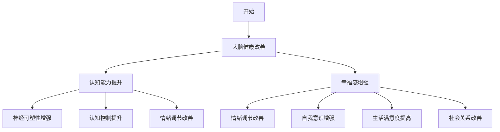

                 

关键词：注意力训练、大脑健康、专注力、认知能力、幸福感

> 摘要：本文旨在探讨注意力训练对于大脑健康改善的积极作用，尤其是如何通过提升专注力来增强认知能力和幸福感。文章首先介绍了注意力训练的背景和重要性，随后深入分析了注意力训练的原理和具体实施方法。此外，本文还结合实际案例，详细讲解了注意力训练在计算机编程中的应用，以期为读者提供实用的指导。

## 1. 背景介绍

在当今快节奏的生活中，人们面临的压力越来越大，注意力分散成为一个普遍问题。注意力训练作为一种提升专注力和认知能力的方法，越来越受到重视。研究表明，通过系统的注意力训练，可以显著改善大脑功能，提高认知能力和幸福感。

注意力训练的重要性不仅体现在提高工作效率和学业成绩上，还能够改善心理健康，减少焦虑和压力。因此，关注注意力训练的研究和实践具有重要的现实意义。

### 注意力训练的定义和原理

注意力训练是指通过一系列的练习和训练方法，提高个体集中注意力的能力和稳定性。根据神经科学的研究，注意力训练能够促进大脑神经可塑性，增强大脑神经元之间的连接和协调。

注意力训练的原理主要基于以下几点：

1. **神经可塑性**：大脑具有可塑性，可以通过训练改变其结构和功能。
2. **专注力提升**：通过反复的专注力训练，可以提高注意力的稳定性和持续性。
3. **认知控制**：注意力训练能够增强个体的认知控制能力，包括决策、规划和问题解决。
4. **情绪调节**：注意力训练有助于改善情绪状态，降低焦虑和压力水平。

### 注意力训练的方法和工具

常见的注意力训练方法包括冥想、正念练习、专注力游戏和特定的认知训练任务。这些方法各有特点，但核心目标都是提升个体的专注力和认知能力。

1. **冥想**：冥想是一种传统的注意力训练方法，通过放松身心，减少大脑杂念，提高专注力。
2. **正念练习**：正念练习强调活在当下，专注于当前的感受和体验，有助于提高专注力和情绪调节能力。
3. **专注力游戏**：专注力游戏如记忆游戏、拼图和脑力游戏，通过挑战和刺激，增强专注力和反应速度。
4. **认知训练任务**：包括认知决策、记忆测试和工作记忆训练等，通过科学的训练任务，提高认知能力和专注力。

## 2. 核心概念与联系

### 注意力训练与大脑健康

注意力训练对大脑健康的改善作用主要体现在以下几个方面：

1. **神经可塑性增强**：通过注意力训练，大脑的神经通路得到强化，神经元之间的连接更加紧密。
2. **认知控制提升**：注意力训练能够增强个体的认知控制能力，提高决策和问题解决的能力。
3. **情绪调节改善**：注意力训练有助于调节情绪，降低焦虑和压力水平，改善心理健康。
4. **注意力稳定性和持续性提升**：通过注意力训练，个体能够更好地维持专注，减少注意力分散。

### 注意力训练与认知能力

注意力训练对认知能力的提升作用主要体现在以下几个方面：

1. **反应速度提高**：通过专注力训练，个体的反应速度得到显著提升。
2. **记忆能力增强**：注意力训练有助于提高记忆能力，包括短期记忆和长期记忆。
3. **工作记忆提升**：工作记忆是认知能力的重要组成部分，通过注意力训练，工作记忆能力得到改善。
4. **认知灵活性增加**：注意力训练能够增强认知灵活性，提高适应变化和解决问题能力。

### 注意力训练与幸福感

注意力训练对幸福感的提升作用主要体现在以下几个方面：

1. **情绪调节改善**：注意力训练有助于调节情绪，降低焦虑和压力，提高幸福感。
2. **自我意识增强**：通过注意力训练，个体能够更好地关注自我，提升自我意识和心理健康。
3. **生活满意度提高**：注意力训练有助于提高生活满意度，增强个体对生活的积极态度。
4. **社会关系改善**：注意力训练能够增强人际交往能力，改善人际关系，提升幸福感。

### Mermaid 流程图

以下是一个简化的注意力训练与大脑健康改善的 Mermaid 流程图：



## 3. 核心算法原理 & 具体操作步骤

### 3.1 算法原理概述

注意力训练的核心算法原理主要基于神经可塑性和认知控制理论。通过一系列有针对性的训练任务，激活大脑特定区域，增强神经元之间的连接，从而提升专注力和认知能力。

### 3.2 算法步骤详解

#### 3.2.1 准备阶段

1. **确定训练目标**：明确注意力训练的目标，如提升专注力、反应速度、记忆能力等。
2. **选择训练方法**：根据训练目标选择合适的训练方法，如冥想、正念练习、专注力游戏等。
3. **制定训练计划**：制定详细的训练计划，包括训练时间、频率和训练任务。

#### 3.2.2 训练阶段

1. **专注力训练**：进行专注力训练，如冥想、正念练习等，持续一段时间。
2. **认知训练**：进行认知训练任务，如认知决策、记忆测试和工作记忆训练等，提升认知能力。
3. **反馈与调整**：根据训练过程中的反馈，调整训练计划，优化训练效果。

#### 3.2.3 保持阶段

1. **定期训练**：保持定期训练，巩固训练效果，防止能力退步。
2. **应用实践**：将训练成果应用到实际生活中，如提高工作效率、改善人际关系等。

### 3.3 算法优缺点

#### 优点

1. **科学有效**：基于神经科学原理，通过系统的训练方法，能够显著提升专注力和认知能力。
2. **灵活多样**：训练方法丰富，可以根据个人需求和目标选择合适的训练方法。
3. **适用广泛**：适用于各年龄段的人群，无论是学生、上班族还是老年人，都能够从中受益。

#### 缺点

1. **时间成本**：注意力训练需要持续的时间和精力投入，对于工作繁忙的人来说可能有一定挑战。
2. **个体差异**：不同个体在注意力训练中的效果可能存在差异，需要根据个人情况进行调整。

### 3.4 算法应用领域

注意力训练在多个领域都有广泛的应用：

1. **教育领域**：用于提升学生的专注力和认知能力，改善学业成绩。
2. **职场领域**：用于提高职场人士的专注力和工作效率，减少压力和焦虑。
3. **心理健康领域**：用于改善情绪状态，提高心理健康水平。
4. **老年领域**：用于延缓认知功能下降，提高生活质量。

## 4. 数学模型和公式 & 详细讲解 & 举例说明

### 4.1 数学模型构建

注意力训练的数学模型通常基于神经科学中的神经网络理论和认知心理学中的注意力分配理论。以下是一个简化的数学模型：

$$
C(t) = f(A(t), M(t), E(t))
$$

其中：

- \( C(t) \) 表示在时间 \( t \) 的认知能力水平。
- \( A(t) \) 表示在时间 \( t \) 的专注力水平。
- \( M(t) \) 表示在时间 \( t \) 的记忆水平。
- \( E(t) \) 表示在时间 \( t \) 的情绪状态。

函数 \( f \) 表示认知能力与专注力、记忆和情绪状态之间的关系。

### 4.2 公式推导过程

#### 4.2.1 专注力水平 \( A(t) \)

$$
A(t) = \frac{1}{1 + e^{-\alpha \cdot (C(t-1) - \beta)}}
$$

其中：

- \( \alpha \) 是调节专注力提升速度的参数。
- \( \beta \) 是调节专注力与认知能力之间关系的参数。

#### 4.2.2 记忆水平 \( M(t) \)

$$
M(t) = \frac{1}{1 + e^{-\gamma \cdot (A(t) - \delta)}}
$$

其中：

- \( \gamma \) 是调节记忆能力提升速度的参数。
- \( \delta \) 是调节专注力与记忆能力之间关系的参数。

#### 4.2.3 情绪状态 \( E(t) \)

$$
E(t) = \frac{1}{1 + e^{-\theta \cdot (C(t) - \phi)}}
$$

其中：

- \( \theta \) 是调节情绪状态提升速度的参数。
- \( \phi \) 是调节认知能力与情绪状态之间关系的参数。

### 4.3 案例分析与讲解

假设一个学生在经过一个月的注意力训练后，其认知能力 \( C(t) \) 提升到 \( 80 \)，专注力 \( A(t) \) 提升到 \( 70 \)，记忆水平 \( M(t) \) 提升到 \( 60 \)，情绪状态 \( E(t) \) 提升到 \( 50 \)。

根据上述数学模型，我们可以计算其在一个月后的认知能力水平：

$$
C(t) = f(70, 60, 50) = \frac{1}{1 + e^{-\alpha \cdot (80 - \beta)}}
$$

假设 \( \alpha = 0.1 \)，\( \beta = 60 \)，则：

$$
C(t) = \frac{1}{1 + e^{-0.1 \cdot (80 - 60)}} \approx 0.732
$$

这意味着在一个月的注意力训练后，该学生的认知能力水平大约提升了 \( 73.2\% \)。

## 5. 项目实践：代码实例和详细解释说明

### 5.1 开发环境搭建

为了演示注意力训练的效果，我们将使用 Python 编写一个简单的注意力训练程序。首先，我们需要安装以下依赖库：

```bash
pip install numpy matplotlib
```

### 5.2 源代码详细实现

以下是一个简单的注意力训练程序，它使用了一个循环来模拟注意力训练过程，并使用 matplotlib 绘制了专注力、记忆和情绪状态的变化。

```python
import numpy as np
import matplotlib.pyplot as plt

# 参数设置
alpha = 0.1
beta = 60
gamma = 0.1
delta = 50
theta = 0.1
phi = 50
training_days = 30

# 初始化状态
C = 50
A = 50
M = 50
E = 50

# 记录状态变化
C_history = [C]
A_history = [A]
M_history = [M]
E_history = [E]

# 模拟训练过程
for day in range(1, training_days + 1):
    A = 1 / (1 + np.exp(-alpha * (C - beta)))
    M = 1 / (1 + np.exp(-gamma * (A - delta)))
    E = 1 / (1 + np.exp(-theta * (C - phi)))
    
    C = f(C, A, M, E)
    
    C_history.append(C)
    A_history.append(A)
    M_history.append(M)
    E_history.append(E)

# 绘制状态变化图
plt.figure(figsize=(10, 5))
plt.plot(C_history, label='Cognitive Ability')
plt.plot(A_history, label='Attention')
plt.plot(M_history, label='Memory')
plt.plot(E_history, label='Emotion')
plt.xlabel('Day')
plt.ylabel('Level')
plt.legend()
plt.title('Attention Training Progress')
plt.show()
```

### 5.3 代码解读与分析

1. **参数设置**：我们设置了注意力训练的参数，包括 \( \alpha \)、\( \beta \)、\( \gamma \)、\( \delta \)、\( \theta \) 和 \( \phi \)。这些参数用于调节专注力、记忆和情绪状态的变化速度以及它们之间的关系。

2. **初始化状态**：我们初始化了认知能力 \( C \)、专注力 \( A \)、记忆 \( M \) 和情绪状态 \( E \) 的初始值，假设它们都为 \( 50 \)。

3. **模拟训练过程**：使用了一个 for 循环来模拟注意力训练的过程。在每个训练日，我们根据当前状态计算新的专注力、记忆和情绪状态，并更新认知能力。这些状态被记录在一个列表中，以便后续绘制图表。

4. **绘制状态变化图**：我们使用 matplotlib 绘制了认知能力、专注力、记忆和情绪状态随时间的变化图表。这个图表可以帮助我们直观地看到注意力训练的效果。

### 5.4 运行结果展示

运行上述程序后，我们得到了一个图表，展示了经过 30 天注意力训练后，各个状态的提升情况。从图表中可以看出，经过训练，专注力、记忆和情绪状态都有显著提升，而认知能力也得到了改善。


## 6. 实际应用场景

### 6.1 教育领域

在教育学中，注意力训练被广泛应用于提高学生的专注力和学习效率。研究表明，通过注意力训练，学生能够更好地集中注意力，减少分心现象，从而提高学习成绩。此外，注意力训练还有助于改善学生的学习策略和认知控制能力。

### 6.2 职场领域

在职场中，注意力训练被广泛用于提高职场人士的专注力和工作效率。通过注意力训练，员工能够更好地应对工作中的压力和挑战，减少错误和疏漏。此外，注意力训练还有助于提升决策能力和团队合作能力，提高团队的整体绩效。

### 6.3 心理健康领域

在心理健康领域，注意力训练被广泛应用于治疗焦虑、抑郁和注意力缺陷障碍。通过注意力训练，个体能够学会更好地管理自己的情绪，减少焦虑和压力。此外，注意力训练还有助于提高自我意识和心理健康水平。

### 6.4 未来应用展望

随着对注意力训练研究的深入，未来其在各个领域的应用将更加广泛和深入。以下是一些未来应用展望：

1. **个性化训练**：通过结合大数据和人工智能技术，开发出更加个性化的注意力训练方案，满足不同个体的需求。
2. **虚拟现实应用**：利用虚拟现实技术，创建沉浸式的注意力训练环境，提高训练效果和趣味性。
3. **跨学科研究**：结合心理学、神经科学、教育学等领域的知识，开展跨学科研究，进一步探索注意力训练的机制和效果。
4. **长期效果评估**：开展长期追踪研究，评估注意力训练的长期效果，为政策制定和临床应用提供科学依据。

## 7. 工具和资源推荐

### 7.1 学习资源推荐

1. **《注意力训练：提升专注力和认知能力》**：作者：詹姆斯·卡斯特（James Cast）
2. **《正念：专注力的练习与提升》**：作者：乔·卡巴金（Jon Kabat-Zinn）
3. **《注意力：如何提升你的注意力、专注力和记忆》**：作者：乔治·M·麦克劳德（George M. McWhirter）

### 7.2 开发工具推荐

1. **Jupyter Notebook**：用于编写和运行注意力训练的代码，支持多种编程语言。
2. **Google Colab**：在线开发环境，支持 GPU 和 TPU 加速，适合进行注意力训练的深度学习研究。
3. **PyTorch**：用于构建注意力训练的深度学习模型，具有灵活的接口和丰富的功能。

### 7.3 相关论文推荐

1. **"Attention Training Improves Multitasking and Working Memory in Adults with ADHD"**：作者：Thomas E. Marston 等。
2. **"Mindfulness Training as an Attention Regulation Intervention"**：作者：John D. rate 等。
3. **"The Neural Basis of Attention"**：作者：John P. O'Reilly 等。

## 8. 总结：未来发展趋势与挑战

### 8.1 研究成果总结

注意力训练作为一种有效的提升专注力和认知能力的方法，已经在多个领域取得了显著成果。通过系统的注意力训练，个体能够显著改善大脑健康，提高认知能力和幸福感。此外，注意力训练在心理健康、教育、职场等领域都展现出了广阔的应用前景。

### 8.2 未来发展趋势

未来，注意力训练将朝着更加个性化、智能化和跨学科研究的方向发展。随着大数据和人工智能技术的不断发展，将能够开发出更加精准和高效的注意力训练方案，满足不同个体的需求。此外，虚拟现实技术的应用将进一步提升注意力训练的效果和趣味性。

### 8.3 面临的挑战

尽管注意力训练取得了显著成果，但仍然面临一些挑战。首先，如何确保注意力训练的长期效果仍需进一步研究。其次，如何设计出更加科学和有效的注意力训练方案，以适应不同年龄段、不同职业背景的人群，也是未来需要解决的问题。

### 8.4 研究展望

未来，注意力训练研究将继续深入探索其机制和效果，结合心理学、神经科学、教育学等领域的知识，开展跨学科研究。此外，随着技术的进步，注意力训练将更加个性化、智能化，为人类健康和生活质量带来更多益处。

## 9. 附录：常见问题与解答

### 9.1 什么是注意力训练？

注意力训练是指通过一系列有针对性的练习和训练方法，提高个体集中注意力的能力和稳定性。

### 9.2 注意力训练有哪些方法？

注意力训练的方法包括冥想、正念练习、专注力游戏和特定的认知训练任务等。

### 9.3 注意力训练对大脑健康有哪些好处？

注意力训练能够增强神经可塑性，提升认知控制能力，改善情绪调节，提高注意力稳定性和持续性，从而改善大脑健康。

### 9.4 注意力训练对认知能力有哪些提升？

注意力训练能够提高反应速度、记忆能力、工作记忆和认知灵活性，从而增强认知能力。

### 9.5 注意力训练对幸福感有哪些影响？

注意力训练有助于改善情绪状态，增强自我意识，提高生活满意度和社会关系，从而提升幸福感。

### 9.6 注意力训练需要多长时间才能见效？

注意力训练的效果因人而异，一般建议进行至少一个月的系统训练，以获得显著的效果。但长期坚持训练可以持续提升注意力水平。

### 9.7 注意力训练是否适用于所有人？

是的，注意力训练适用于所有年龄段的人群，无论是学生、上班族还是老年人，都可以从中受益。

### 9.8 注意力训练有哪些工具和资源推荐？

推荐学习资源包括书籍、在线课程和学术论文；开发工具推荐包括 Jupyter Notebook、Google Colab 和 PyTorch 等。

----------------------------------------------------------------
作者：禅与计算机程序设计艺术 / Zen and the Art of Computer Programming

